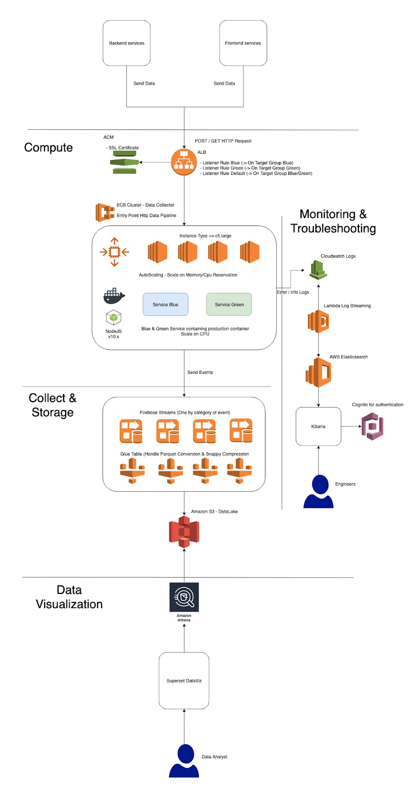

---
> **ARTS-week-11**
> 2021-03-21 17:48
---


## ARTS-2019 左耳听风社群活动--每周完成一个 ARTS
1.Algorithm: 每周至少做一个 leetcode 的算法题
2.Review: 阅读并点评至少一篇英文技术文章
3.Tip: 学习至少一个技术技巧
4.Share: 分享一篇有观点和思考的技术文章

### 1.Algorithm:

49. 字母异位词分组 https://leetcode-cn.com/submissions/detail/157831677/
149. 直线上最多的点数 https://leetcode-cn.com/submissions/detail/157897269/
220. 存在重复元素 III https://leetcode-cn.com/submissions/detail/157963015/

### 2.Review:

https://medium.com/voodoo-engineering/leverage-aws-to-create-a-data-pipeline-at-scale-in-a-couple-of-weeks-8fa19b750619
利用 AWS 在几周内大规模创建数据管道
          

#### 点评：

作者 Robin Mizreh
- 项目背景：选择AWS作为云提供商的主要原因是他们可以提供托管服务，这可以节省很多时间。作者需要一个管道来收集所有工具的数据，以使其可视化并用于其他项目。由于项目进展非常快，需要选择一种适合快速部署的架构，主要需求是上述可扩展性！一旦验证过，我们便在2至3天内将每天的事件从0个增加到近20亿个。因此需要满足：
  - 提供巨大的可扩展性的手段（每天消耗数十亿个事件）
  - 部署所需要的灵活性
  - 允许有限的人员维护和监控管道


- 计算：使用 ECS 主要是因为它很好地集成在 AWS 生态系统中

- 收集与储存：Firehose 和 Glue 是 AWS 中的 helluva 组合，借助 AWS 开发工具包，它们可让将数据推送到流中。
  - Firehose 将可以聚合和压缩数据并将其推送到多个数据源，其中可能包括 Amazon S3，Elasticsearch 或Redshift 。在插入到数据源中之前，可以选择与每个批次的时间和/或大小限制相关的阈值。
  - Glue，当联合流水，可实现文件转换，所以可以很容易地创建的 S3 数据湖。的每个 Firehose 流都将映射到 Glue 表上，并且它将文件转换为 Apache Parquet（或ORC）文件并使用 Snappy 压缩它们，而无需编写任何代码。

- 数据可视化：当将 Firehose＆Glue 解决方案与 Amazon Athena 结合使用时，这就是神奇的地方。使用 Athena，现在可以使用 SQL 查询从 S3 查询所有数据。

- 监控与故障排除：为了监控我们的软件并检查数据差异，我们通过 Cloudwatch 日志将错误日志和汇总数据发送到 elasticsearch 。该架构的性能不错，但是在如此大规模的情况下，需要非常注意以下两点：
  - 注意发送的数据量
  - 监视流传输过程调用的 Lambda 数量，因为如果由于任何原因导致大的停机时间，它将使的日志记录基础设施成为垃圾邮件，并可能使的 Lambda 节流。

- 下一步可以分为3个主要主题：
  - 自动化，将新的事件类型添加到数据管道。因此，它需要能够动态创建 Firehose 流和 Glue 表，还需要更新配置以处理和验证新事件
  - 集中并改善我们的监控，以便能够将应用日志与更多技术指标（例如CPU峰值或延迟）进行汇总。如果我们想外部化，例如 Grafana 和 Prometheus 之类的工具或可能的 SaaS 解决方案
  - 添加一些作业以自动优化我们的数据，并删除重复项以保持我们可以达到的最高数据质量

- Take-Aways
  - 这种架构使我们仅专注于可为数据管道带来直接价值的API代码和仪表板
  - 几乎所有基础设施都受到管理，因此我们不需要繁重的管理。主要问题是预期服务的软限制并对其进行积极主动。
  - 成本等于使用的成本，没有最小集群大小，例如 Redshift。因此，它非常适合测试，因为可以在几天之内从0增长到20亿，并且只有在流量很高时才需要付费。由于仅用了几周的时间就可以用最少的人力来启动和监视该项目，因此即使我们的流量巨大，其成本还是非常诱人的。
  - Glue 数据模式可以轻松发展，Athena 现在得到了许多 dataviz 工具的支持，例如 tableau，superset，per 望镜和 redash，仅举几例……
  - 这种架构为我们提供了灵活性，以及​​对我们来说非常重要的上市时间


### 3.Tip:

#### HashMap 排序

```java
Map<Integer,Integer> map = new HashMap<>();
List<Map.Entry<Integer,Integer>> list = new ArrayList<>(map.entrySet());
//1.重写 Comparator 匿名内部类
Collections.sort(list, new Compartor<Map.Entry<Integer,Integer>>(){
  @Override
  public int compare<Map.Entry<Integer,Integer>>(){
    return a.getValue() - b.getValue();//a-b升序 b-a降序
  }
});
//2.lambda 表达式
Collections.sort(list, (a,b) -> a.getValue() - b.getValue());
```

### 4.Share:

https://www.jianshu.com/p/ae424a67a970
Java swing 皮肤（look and feel）大全

https://segmentfault.com/a/1190000022365039?utm_source=sf-related
史上最全的延迟任务实现方式汇总

https://gobea.cn/blog/detail/GYo82nrZ.html
基于 golang 和 redis 实现轻量级队列

https://www.jianshu.com/p/d87ef30a2f63
模板渲染工具 StringTemplate

http://shouce.jb51.net/gopl-zh/ch11/ch11-01.html
go test

http://gnuwin32.sourceforge.net/packages/gtar.htm
Tar for Windows