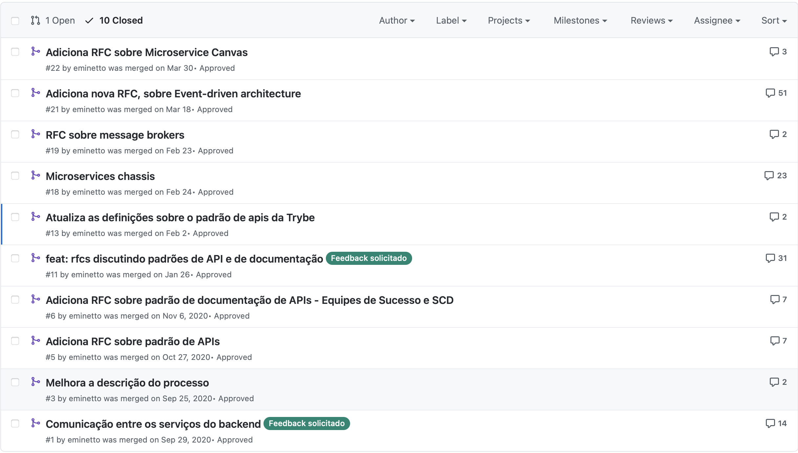

---
> **ARTS-week-28**
> 2021-07-18 19:50
---


## ARTS-2019 左耳听风社群活动--每周完成一个 ARTS
1.Algorithm： 每周至少做一个 leetcode 的算法题
2.Review: 阅读并点评至少一篇英文技术文章
3.Tip: 学习至少一个技术技巧
4.Share: 分享一篇有观点和思考的技术文章

### 1.Algorithm:

162. 寻找峰值：https://leetcode-cn.com/submissions/detail/196939902/

315. 计算右侧小于当前元素的个数：https://leetcode-cn.com/submissions/detail/196935018/

面试题 10.02. 变位词组：https://leetcode-cn.com/submissions/detail/196911094/

### 2.Review:

https://eltonminetto.dev/post/2021-05-15-rfc/
使用 RFC 进行技术决策

#### 点评：

在软件开发过程中，团队需要从编程语言、架构、流程、工具等做出几个重要决策。随着项目规模的扩大，随着团队的成长，决策开始变得更加复杂和重要。此外，如何确保将项目开始时做出的决定记录在案，以便团队中的新人员了解导致团队得出某一结论的原因和背景？在团队中，做出决策和记录决策的方式不同，在此帖子中，我将讨论其中之一：rfcs（征求意见稿）。

- 什么是RFC？
 - 是软件或应用系统的主要作者或作者在开始编码项目之前创建的相对正式的文件。
 - 记录高层执行战略和关键设计决策，重点是这些决策期间考虑的权衡。

- 为什么要使用它？
 - 允许个人贡献者参与他们负责的系统决策
 - 即使域名专家没有直接参与构建特定系统，他们也能够为决策做出贡献
 - 改进决策的风险管理
 - 将团队纳入决策，避免委员会的设计流程
 - 允许未来上下文的图片
 - 允许决策是异步的。

- 如何使用？
 - 在Github上创建了一个存储库来存储文档
 - 团队中的任何人都可以创建分支、复制我们创建的模板、以记分格式编写新的 RFC 以及打开拉取请求
 - 团队人员被邀请对拉动请求进行评论和建议，如果RFC被接受，则合并。如果不接受RFC，我们只需在不合并的情况下关闭拉取请求。
有了这个，我们有一个历史的所有讨论，为作出某种决定，在拉要求。在存储库分支中，我们有已批准的 RFC 列表。在下图中，可以看到我们使用此过程做出的一些重要决策，以及我们在每个决策中所做的讨论量。


总结：这个过程非常重要，因此我们可以作为一个团队来发展项目，并为新人们提供背景，让他们了解导致我们做出某种决定的原因。

### 3.Tip:

#### GOLANG 国内代理

```go
# 检查代理
go env
# 设置代理
go env -w GOPROXY=https://goproxy.cn,direct
```

#### Go 计算程序运行时间

1.计算代码块的运行时间：

```go
start := time.Now()
//some func or operation
cost := time.Since(start)
fmt.Printf("cost=[%s]",cost)
# 其中time.Since()函数返回字符串类型，例如1h2m3s等，可能还有us等
```

2.计算函数的运行时间：

```go
func compute() {
    start := time.Now()
    defer func() {
        cost := time.Since(start)
        fmt.Println("cost=", cost)
    }()
    // some computation 
}
# 利用defer的作用，可以在函数开始的时候获取一个时间，使用time.Now()在函数结束的时候，获取程序从标记开始的时间段，可以得到函数运行的时间。
```


### 4.Share:

https://cloud.tencent.com/developer/article/1461835
从一段挖矿病毒代码看Linux命令的实际应用

https://www.cnblogs.com/rickiyang/p/11074171.html
Go 中的 fmt 几种输出的区别和格式化方式
