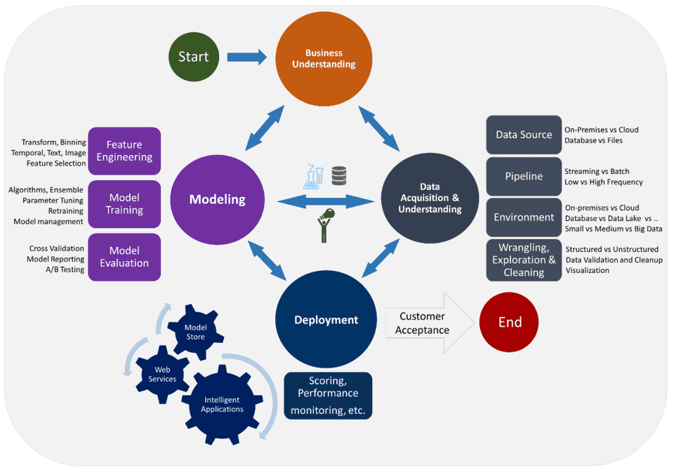

## ARTS-2019 左耳听风社群活动--每周完成一个 ARTS
1.Algorithm： 每周至少做一个 leetcode 的算法题
2.Review: 阅读并点评至少一篇英文技术文章
3.Tip: 学习至少一个技术技巧
4.Share: 分享一篇有观点和思考的技术文章

### 1.Algorithm:

1337. 矩阵中战斗力最弱的 K 行：https://leetcode-cn.com/submissions/detail/202132631/

785. 判断二分图：https://leetcode-cn.com/submissions/detail/201931753/

295. 数据流的中位数：https://leetcode-cn.com/submissions/detail/201911295/

### 2.Review:


https://www.mihaileric.com/posts/introduction-data-science-life-cycle/
什么是数据科学生命周期？

#### 点评：

数据科学生命周期是任何数据科学项目从最初的想法到提供一致客户价值的典型阶段的一种形式主义。通过这种方式，数据科学生命周期提供了一套准则，任何组织都可以通过这些准则在其服务中有力和自信地提供数据驱动的价值。
数据科学的生命周期是至关重要的，因为它构成了这个进化的数据科学2.0的核心剧本。

- 为什么要关心数据科学生命周期？
  - 如何避免临时的、定义不明确的数据科学工作（某些组织称之为黑暗艺术数据科学）？
  - 如何在团队中培养高影响力、快速迭代、数据驱动的文化？
  - 如何让数据科学团队采用有效的工程团队实践？
  - 如何在日常中集成敏捷软件开发？
  - 如何在角色和职责方面组织数据科学团队（对于数据科学产品经理、团队领导和组织级首席数据官尤其重要）？

- 历史背景, CRISPR-DM 是当今数据科学生命周期的早期前身,CRISPR-DM 标准中，数据科学项目包括以下步骤：
  - 业务理解
  - 数据理解
  - 数据准备
  - 建模
  - 评估
  - 部署

- 打破现代数据科学生命周期
  - 当我们完成每个步骤时，我们将强调步骤的目标和预期产出（即可交付成果）。
  - 我们的分析将模仿微软率先提出的团队数据科学流程。

- 业务理解
  - 我们要解决哪些具体的商业问题？
  - 我们的理想解决方案是什么样子的（即我们希望解决方案产生的输出是什么）？
  - 我们将用哪些指标来定义成功？
  - 我们将使用哪些相关数据源（无论是现有数据还是我们必须创建的数据源）？

- 数据采集和勘探
  - 我们需要清理数据吗？
  - 数据的哪些特征很重要，可用于我们的问题？
  - 如何设置适当的数据基础结构以启用下游任务？ 

- 研究和建模
  - 对于我们的问题，哪些功能最具有预测性？
  - 我们应该使用哪种型号？
  - 我们的模型在离线指标中的表现如何？

- 交付和部署
  - 我们应该使用哪些技术进行部署？
  - 我们需要在部署的模型中监控哪些功能，以确保其保持功能？

- 消费者接受度
  随着这一步骤的完成，我们成功地经历了数据科学的生命周期。以下是一张图表中描述的所有阶段
  


### 3.Tip:

#### redash 权限设置

```shell
# 缺少安装依赖
sudo apt-get install libpq-dev python-dev
```

####  Go 语言通用重试函数封装

1.从屏幕上可以执行的操作：
- 创建用户
- 创建组
- 将组与用户关联
说明：不能直接向用户授予权限。 授予组中的角色的权限，并将其绑定到该角色。

2.权限名称清单：
- create_dashboard
- create_query
- edit_dashboard
- edit_query
- view_query
- view_source
- execute_query
- list_users
- schedule_query
- list_dashboards
- list_alerts
- list_data_sources

3.修改组权限

```shell

python ./manage.py groups change_permissions --permissions <权限名称> <组ID>

# 例如，给3组添加 create_create_query、edit_dashboard、edit_query四个权限）
python ./manage.py groups change_permissions --permissions view_query,view_source,execute_query,list_users,schedule_query,list_dashboards,list_alerts,list_data_sources 3
```

4.查询组权限：

```shell
python ./manage.py groups list

# 返回结果
Id: 1
Name: admin
Type: builtin
Organization: default
Permissions: [admin,super_admin]
Users: administrator
--------------------
Id: 2
Name: default
Type: builtin
Organization: default
Permissions: [create_dashboard,create_query,edit_dashboard,edit_query,view_query,view_source,execute_query,list_users,schedule_query,list_dashboards,list_alerts,list_data_sources]
Users: administrator
--------------------
Id: 3
Name: guest
Type: regular
Organization: default
Permissions: [view_query,view_source,execute_query,schedule_query,list_dashboards,list_alerts,list_data_sources]
Users: guest
--------------------
```


### 4.Share:

http://www.kekefund.com/2018/09/12/redash-use/
redash部署使用

http://guzhenping.com/2018/05/21/Redash%20%E6%9D%83%E9%99%90%E7%AE%A1%E7%90%86/
Redash权限管理
