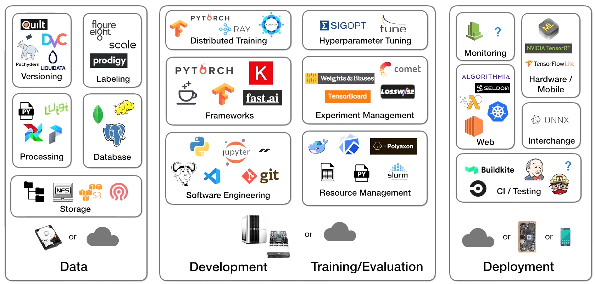

## ARTS-2019 左耳听风社群活动--每周完成一个 ARTS
1.Algorithm： 每周至少做一个 leetcode 的算法题
2.Review: 阅读并点评至少一篇英文技术文章
3.Tip: 学习至少一个技术技巧
4.Share: 分享一篇有观点和思考的技术文章

### 1.Algorithm:

1423. 可获得的最大点数：https://leetcode-cn.com/submissions/detail/204550725/

72. 编辑距离：https://leetcode-cn.com/submissions/detail/204550632/

1143. 最长公共子序列：https://leetcode-cn.com/submissions/detail/204547602/

### 2.Review:

https://www.mihaileric.com/posts/setting-up-a-machine-learning-project/
从头开始的完整机器学习项目：设置

#### 点评：

在这一系列帖子中的第一篇，我将描述如何从头开始构建基于机器学习的假新闻探测器。这意味着我将从字面上构建一个系统，学习如何从谎言中辨别现实（合理地很好），只使用原始数据。我们的项目将带我们从初始设置到部署解决方案。我这样做是因为当你看看今天的教程状态，初学者的机器学习项目意味着复制粘贴一些样本代码从Tensorflow网站，并通过一个过度使用的基准数据集运行它。在这些帖子中，我将描述一个可行的序列，通过现实的生命周期携带机器学习产品，尽量真实地了解细节。我将深入到技术决策的细微细节，到如何组织代码存储库结构进行快速工程迭代。当我通过帖子进行进度时，我将逐步将代码添加到存储库中，直到最后我有一个功能齐全且可部署的系统。

- 这些将涵盖以下所有内容：
  - 构想、组织代码库和设置模组（此帖子）
  - 数据集采集和探索性数据分析
  - 使用 v1 模型构建和测试管道
  - 执行错误分析并向 v2 模型重复
  - 部署模型并连接连续集成解决方案

- 构建机器学习系统是困难的，没有简单的方法可以这样说：构建一个成熟的ML系统是复杂的。从一开始，功能和有用系统的流程至少包含以下所有步骤：
  - 对问题陈述的构想和定义
  - 获取（或标记）数据集
  - 探索您的数据以了解其特征
  - 为模型的初始版本构建培训管道
  - 对模型故障模式进行测试和执行错误分析
  - 从此错误分析中反复构建改进的模型
  - 重复步骤4-6，直到您获得所需的模型性能
  - 构建基础设施，以部署具有用户需要的运行时特性的模型
  - 持续监控您的模型并用它来重复任何步骤2-8

- 以下是当前机器学习模样/基础架构图的外观

- 定义机器学习问题
  - 可以说，创建机器学习应用程序最重要的一步是问题定义。这意味着既要确定您希望应用程序解决的问题（增值）与如何衡量成功（您的指标）一样。。
  - 我们的分析将模仿微软率先提出的团队数据科学流程。

- 组织您的存储库和结构

  ```
  fake-news/
    assets/
    config/
    data/
        raw/
        processed/
    deploy/
    fake_news/
        model/
        utils/
    model_checkpoints/
    notebooks/
    scripts/
    tests/
    LICENSE
    README.md
    requirements.txt
  ```
  - assets：这将存储整个项目生成的任何图像、绘图和其他非源文件。
  - config：我将包括模型培训和评估所需的任何配置文件在这里。
  - data： 这将存储我们的假新闻数据在其原始 （从原始来源未动） 和处理 （已更新或更新为我们使用箱） 的形式。
  - deploy：这将存储我们部署所需的任何文件，包括Dockerfiles等。
  - fake_news：这将存储所有用于构建、培训和评估我们模型的来源。
  - model_checkpoints：这将存储模型二进制文件，我训练，并最终想要部署。
  - notebooks：这将存储任何用于任何数据分析的Jupyter笔记本。
  - scripts：这将存储任何一次性脚本生成模型神器、设置应用环境或处理数据。
  - tests：在这里，我将包括任何单元测试、集成测试和数据测试，以确保我们系统的正确性。
  - LICENSE：我们的软件许可证。
  - README.md：我们项目的高层描述。
  - requirements.txt：这将存储我们项目的代码依赖。这是基于 Python 的项目的标准实践，我们的应用将是。

随着该组织的完成，我们准备进入下一步，获取数据集并进行一些探索性数据分析。

### 3.Tip:

#### Dbeaver 连接数据库驱动配置问题

```shell
窗口—>首选项—>DBeaver—>驱动—>maven
选择添加镜像，这里采用阿里镜像：
http://maven.aliyun.com/nexus/content/groups/public/
然后向上移动到第一行
```

#### Sublime 列对齐功能

```shell
1. Ctrl + A （全选）
2. Ctrl + Shift + L （进入列模式）
3. 按方向键（右键），使光标置于每一行末尾，解除全选状态
4. 再按 Ctrl + 方向键（左键），使光标置于第二列数据的开头
5. 最后 Ctrl + K（Alignment插件的改键，原来的ctrl+alt+a，这个组合键可以说和很多软件都有热键冲突，果断更改），使第二行数据对齐！
```

#### golang 文件流 MD5 生成方式

```golang
func md5V(str string) string  {
    h := md5.New()
    io.Copy(h, fr)
    return base64.StdEncoding.EncodeToString(h.Sum([]byte(nil)))
}
```


### 4.Share:

https://blog.csdn.net/weixin_43279032/article/details/87367246
linux 系统最大打开文件数设置

https://www.zhihu.com/question/38206659
位运算有什么奇技淫巧？

https://www.jianshu.com/p/58dcbf490ef3
golang 中字符串 MD5 生成方式
