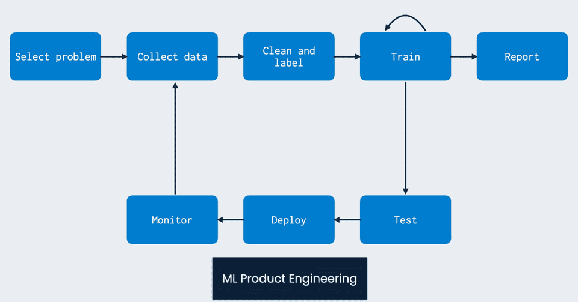
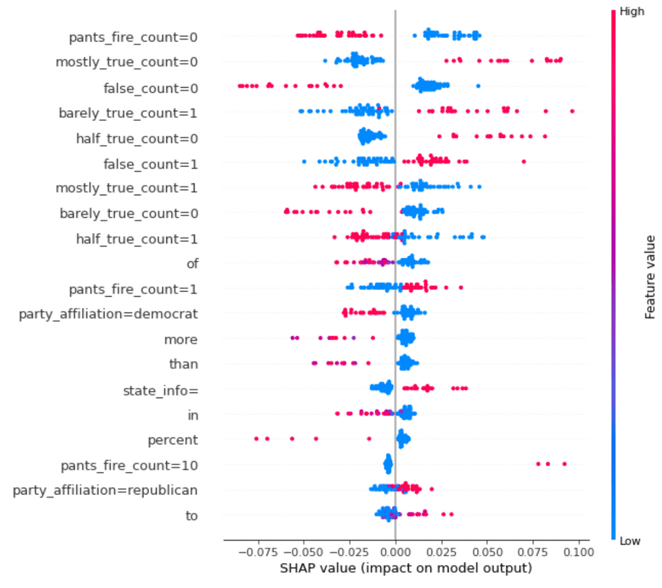

## ARTS-2019 左耳听风社群活动--每周完成一个 ARTS
1.Algorithm： 每周至少做一个 leetcode 的算法题
2.Review: 阅读并点评至少一篇英文技术文章
3.Tip: 学习至少一个技术技巧
4.Share: 分享一篇有观点和思考的技术文章

### 1.Algorithm:

671. 二叉树中第二小的节点：https://leetcode-cn.com/submissions/detail/207060207/

452. 用最少数量的箭引爆气球：https://leetcode-cn.com/submissions/detail/207058744/

491. 递增子序列：https://leetcode-cn.com/submissions/detail/207033672/

### 2.Review:

https://www.mihaileric.com/posts/machine-learning-project-error-analysis-model-v2/
从零开始的完整机器学习项目：错误分析和模型 V2

#### 点评：

在这篇文章中，将继续最后一个帖子离开的地方，并解决整个机器学习产品生命周期的下一阶段：获取初始数据集并执行探索性数据分析。作为快速复习者，请记住，目标是将数据驱动的解决方案应用于从初始设置到部署的问题。将进行的阶段包括：

- 这些将涵盖以下所有内容：
  - 构想、组织代码库和设置模组
  - 数据集采集和探索性数据分析
  - 使用 v1 模型构建和测试管道
  - 执行错误分析并向 v2 模型重复（此帖子）
  - 部署模型并连接连续集成解决方案

- 快速回顾：
    回想一下，在上一篇文章中，构建了一个基于特征的随机森林分类器作为第一个模型。目标是启动并运行一些模型，这些模型可以通过可配置的管道进行训练，并为用户提供直接价值。提醒一下，能够建立一个模型，大致实现 74\%7 4 % 用于识别标题是假的还是真实的保留测试集的准确性。但这究竟意味着什么？这个性能够好吗？在典型的研究环境中，如果表现是最先进的，工作可能会就此停止。会写一篇论文，在午夜会议截止日期前一小时提交，然后就完成了。在提供真实世界ML 价值的世界中，工作才刚刚开始。在这一点上，最好将模型部署给用户，让人们与之交互，并使用这些结果来改进模型。这反映了 ML 产品开发基于持续反馈循环的性质

    虽然不会立即走这条完整的路线，但会做一些同样重要的事情，即对模型执行手动错误和特征分析。这是开展任何机器学习项目的关键一步，因为它帮助了解模型从数据中学到了什么，没有提供足够的信号来解决问题，以及需要做些什么。

- 了解特征重要性
  - 让从了解 v1 模型中最重要的特性开始。可以从计算树中特征的基尼重要性开始。这计算了在随机森林中训练树期间特征带来的基尼杂质的总减少。Scikit-learn对这些特征重要性的支持是开箱即用的。可以按如下方式计算它们：

```python
def compute_impurity_feature_importance(model, feature_names: List[str], num_features: int = 35):
    importances = model.model.feature_importances_
    sorted_idx = importances.argsort()[::-1]
    for idx in sorted_idx[:num_features]:
        print(f"{feature_names[idx]} --- {importances[idx]}")
```

  - 以下是它产生的主要功能：

```shell
false_count=0 --- 0.01788103750021081
barely_true_count=1 --- 0.013547527016297977
mostly_true_count=0 --- 0.012814332174567926
false_count=1 --- 0.012356274396352049
barely_true_count=0 --- 0.011642340204808786
half_true_count=0 --- 0.011123275790760898
pants_fire_count=0 --- 0.010704431737810377
the --- 0.009264955075530558
mostly_true_count=1 --- 0.009118849790203196
half_true_count=1 --- 0.00812081824119793
in --- 0.00806058304960812
of --- 0.007734625265523087
to --- 0.007070031612018406
pants_fire_count=1 --- 0.0068806431741690426
says --- 0.006082293331787273
on --- 0.005531578965784581
and --- 0.005017675857693454
```
  - 正如所看到的，许多顶级特征是为“信用历史”计数创建的垃圾箱。这是一个有趣的观察，因为它表明了解说话者过去的诚实记录将决定他们未来的行为。

  - 当应用这个框架来分析模型在验证集上的输出时，得到了这个图：
  - 理解上面的情节非常棘手，所以让举个例子。考虑列出的第一个特征：pants_fire_count=0。回想一下，这意味着发言者的pants_fire信用记录计数（表明公然撒谎）在 10 个垃圾箱中的第一个。这意味着他们过去没有很多公然撒谎的例子。现在，如果该特征具有很高的值（因为这些是二元特征，这意味着它是 1 并且说话者没有很多公然撒谎的实例），那么这将倾向于推高FALSE概率的值要更小。或者换句话说，这将使数据点更有可能被标记为TRUE。有道理！

- 误差分析
  - 现在了解了特征重要性，让花一些时间分析模型会犯什么样的错误。为此，将在验证集上运行模型，并找到它最不可信和最不正确的数据点，即TRUE和FALSE概率之间的绝对差异最小的地方。
  - 还可以对模型最有信心的不正确示例进行分析，但现在将看看最棘手的示例。

- 数据告诉什么？前面的分析引入了一个关于数据道德和模型问责制的有趣问题。初始模型使用诸如“信用历史”和演讲者党派等特征在给定的数据上表现得相当好。虽然这确实帮助在这个数据集上做得很好，但那些真的是认为对假新闻检测问题最有意义的特征吗？你可以看到这很容易陷入让特征编码数据偏差的兔子洞中。在这方面必须非常小心，以确保清楚模型已经完成了什么：它在这个特定的假新闻数据集上表现良好，但离解决更普遍的问题还很远。数据集很小（大约 1 万个数据点），自己还没有对它是否准确捕获需要能够在假新闻检测系统中建模的所有现象进行任何质量控制。这是目前拥有的最好的，所以会继续使用它，但应该承认特征可能对这个特定的数据集有多么偏颇。为了解决这个问题，需要采取一些措施，比如增加数据集覆盖率，这样就无法通过党派等潜在的虚假特征在离线评估中做得很好。

- 型号 V2 现在将致力于在数据集上构建另一个模型。这样做时，可以利用从特征和错误分析中获得的新特征洞察来迭代随机森林模型。相反，将使用一些在自然语言处理中变得司空见惯的新的基于 Transformer 的模型，看看可以通过原始词汇和语言特征来学习什么。在这里，将结合使用HuggingFace Transformers 库和Pytorch-lightning来利用Roberta 模型来完成这项任务。Roberta 模型将仅对每个数据点中的说话者语句进行编码，而不会对数据中的其他字段进行编码。
  - 该RobertaModel会是这个样子：
  ```python
  class RobertaModel(Model):
    def __init__(self, config: Dict, load_from_ckpt: bool = False):
        self.config = config
        if load_from_ckpt:
            self.model = RobertaModule.load_from_checkpoint(
                os.path.join(config["model_output_path"], config["checkpoint_name"]),
                config=None)
        else:
            self.model = RobertaModule(config)
            checkpoint_callback = ModelCheckpoint(monitor="val_loss",
                                                  mode="min",
                                                  dirpath=config["model_output_path"],
                                                  filename="roberta-model-epoch={epoch}-val_loss={val_loss:.4f}",
                                                  save_weights_only=True)
            
            self.trainer = Trainer(max_epochs=self.config["num_epochs"],
                                   gpus=1 if torch.cuda.is_available() else None,
                                   callbacks=[checkpoint_callback],
                                   logger=False)
    
    def train(self,
              train_datapoints: List[Datapoint],
              val_datapoints: List[Datapoint],
              cache_featurizer: bool = False) -> None:
        train_data = FakeNewsTorchDataset(self.config, train_datapoints)
        val_data = FakeNewsTorchDataset(self.config, val_datapoints)
        train_dataloader = DataLoader(train_data,
                                      shuffle=True,
                                      batch_size=self.config["batch_size"],
                                      pin_memory=True)
        val_dataloader = DataLoader(val_data,
                                    shuffle=False,
                                    batch_size=16,
                                    pin_memory=True)
        
        self.trainer.fit(self.model,
                         train_dataloader=train_dataloader,
                         val_dataloaders=val_dataloader)
    
    def predict(self, datapoints: List[Datapoint]) -> np.array:
        data = FakeNewsTorchDataset(self.config, datapoints)
        dataloader = DataLoader(data,
                                batch_size=self.config["batch_size"],
                                pin_memory=True)
        self.model.eval()
        predicted = []
        self.model.cuda()
        with torch.no_grad():
            for idx, batch in enumerate(dataloader):
                output = self.model(input_ids=batch["ids"].cuda(),
                                    attention_mask=batch["attention_mask"].cuda(),
                                    token_type_ids=batch["type_ids"].cuda(),
                                    labels=batch["label"].cuda())
                predicted.append(output[1])
        return torch.cat(predicted, axis=0).cpu().detach().numpy()
  ```
  在这里，利用了定义的RobertaModule：
  ```python
  class RobertaModule(pl.LightningModule):
    def __init__(self, config: Dict):
        super().__init__()
        base_dir = os.path.dirname(os.path.dirname(os.path.dirname(__file__)))
        full_model_output_path = os.path.join(base_dir, config["model_output_path"])
        self.config = config
        self.classifier = RobertaForSequenceClassification.from_pretrained(config["type"],
                                                                           cache_dir=full_model_output_path)
    
    def forward(self,
                input_ids: np.array,
                attention_mask: np.array,
                token_type_ids: np.array,
                labels: np.array):
        output = self.classifier(input_ids=input_ids,
                                 attention_mask=attention_mask,
                                 token_type_ids=token_type_ids,
                                 labels=labels
                                 )
        return output
    
    def training_step(self, batch, batch_idx):
        output = self(input_ids=batch["ids"],
                      attention_mask=batch["attention_mask"],
                      token_type_ids=batch["type_ids"],
                      labels=batch["label"])
        self.log("train_loss", output[0])
        print(f"Train Loss: {output[0]}")
        return output[0]
    
    def validation_step(self, batch, batch_idx):
        output = self(input_ids=batch["ids"],
                      attention_mask=batch["attention_mask"],
                      token_type_ids=batch["type_ids"],
                      labels=batch["label"])
        self.log("val_loss", output[0])
        return output[0]
    ...
  ```
  - 由于模型接口和通用训练循环，可以运行它以获得以下测试集性能：
  ```shell
  INFO - 2021-01-16 20:37:05,693 - train_transformer.py - Test metrics: {'test f1': 0.7358813462635483, 'test accuracy': 0.6391270459859704, 'test auc': 0.6917187020672321, 'test true negative': 175, 'test false negative': 82, 'test false positive': 381, 'test true positive': 645}
  ```
  - 因此，声明中的纯文本特征不会单独削减它。进一步的工作（留给读者作为练习）可以探索从数据中编码一些其他字段（信用记录等）作为 Roberta 的输入。

### 3.Tip:

#### registry 私有镜像库创建

```shell
$/usr/local/docker# mkdir registry
$/usr/local/docker# cd registry/
$/usr/local/docker/registry# vim docker-compose.yml
version: '3.1'
services:
  registry:
    image: registry
    restart: always
    container_name: registry
    ports:
      - 5000:5000
    volumes:
      - /usr/local/docker/registry/data:/var/lib/registry
```

#### Rancher 镜像推送镜像库并通过镜像库方式启动

```shell
./rancher-load-images.sh --image-list ./rancher-images.txt --windows-image-list ./rancher-windows-images.txt --registry

docker login 127.0.0.1:5000
root/123456

chmod +x rancher-load-images.sh

./rancher-load-images.sh --image-list ./rancher-images.txt --registry 127.0.0.1:5000

docker run -d --privileged --restart=unless-stopped -p 8080:80 -p 8443:443 -e CATTLE_SYSTEM_DEFAULT_REGISTRY=127.0.0.1:5000 -e CATTLE_SYSTEM_CATALOG=bundled  127.0.0.1:5000/rancher/rancher:v2.5.9
```

#### docker 镜像推送到私有镜像库

```shell
docker pull rancher/hyperkube:v1.20.9-rancher1
docker tag rancher/hyperkube:v1.20.9-rancher1 127.0.0.1:5000/rancher/hyperkube:v1.20.9-rancher1
docker push 127.0.0.1:5000/rancher/hyperkube:v1.20.9-rancher1
```


### 4.Share:

https://blog.csdn.net/qq_32828933/article/details/104220570
CentOS 8 安装 docker/docker-compose

https://www.jianshu.com/p/40f4fbe1ec22
Docker决战到底(三) Rancher2.x的安装与使用

