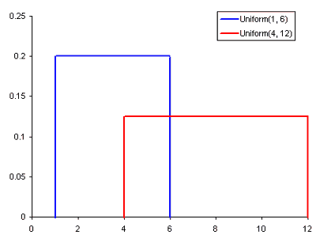
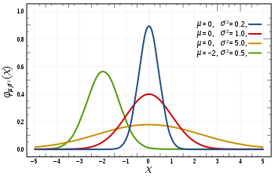
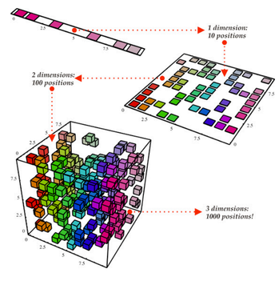

---
> **ARTS-week-42**
> 2021-10-17 20:54
---


## ARTS-2019 左耳听风社群活动--每周完成一个 ARTS
1.Algorithm： 每周至少做一个 leetcode 的算法题
2.Review: 阅读并点评至少一篇英文技术文章
3.Tip: 学习至少一个技术技巧
4.Share: 分享一篇有观点和思考的技术文章

### 1.Algorithm:

69. Sqrt(x)：https://leetcode-cn.com/submissions/detail/228941117/

287. 寻找重复数：https://leetcode-cn.com/submissions/detail/229101547/

1300. 转变数组后最接近目标值的数组和：https://leetcode-cn.com/submissions/detail/229571164/

### 2.Review:

https://towardsdatascience.com/the-5-basic-statistics-concepts-data-scientists-need-to-know-2c96740377ae
数据科学家应当了解的五个统计基本概念：统计特征、概率分布、降维、过采样/欠采样、贝叶斯统计

#### 点评：

在执行数据科学（DS）艺术时，统计数据可以成为一种强大的工具。 从高层次来看，统计学是利用数学来进行数据的技术分析。 诸如条形图之类的基本可视化可能会为提供一些高级信息，但通过统计，我们可以以一种更偏向于信息驱动和有针对性的方式对数据进行操作。 所涉及的数学知识帮助我们形成关于数据的具体结论，而不仅仅是猜测。使用统计数据，我们可以获得更深入，更微观的洞察，了解数据是如何构建的，并基于该结构，我们如何最佳地应用其他数据科学技术来获取更多信息。 今天，我们将看看数据科学家需要了解的5个基本统计概念以及如何最有效地应用它们。

1.统计特征:统计特征可能是数据科学中最常用的统计概念。 它通常是在探索数据集时应用的第一种统计技术，包括偏差，方差，均值，中位数，百分位数等等。 在代码中理解和实现都非常容易。 请查看下面的图形以获取说明。
一个基本的箱线图

中间的线是数据的中位数。 中位数较于均值，因为它对异常值更加稳健。 第一个四分位数基本上是第25个百分点; 即数据中25％的点低于该值。 第三个四分位数是第75个百分点; 即数据中75％的点低于该值。 最小值和最大值表示数据范围的上界和下界。箱线图完美地说明了我们可以用基本统计特征做什么：
       1. 当箱线图很短时，它意味着的大部分数据点都相似，因为在很小的范围内有许多值。
       2. 当箱线图很长时，它意味着的大部分数据点都非常不同，因为这些值分布在很宽的范围内
       3. 如果中位数接近底部，那么我们知道大多数数据具有较低的值。 如果中位数接近顶部，那么我们知道大多数数据具有更高的值。 基本上，如果中间线不在框的中间，则表明数据偏斜。
       4. 变动很长吗？ 这意味着的数据具有较高的标准差和方差，即数值分散且变化很大。 如果盒子的一侧有变动，而另一侧没有，那么的数据可能只在一个方向上变化很大。
所有这些信息来自一些易于计算的简单统计特征。 只要需要快速而翔实的数据视图，请尝试这些。

2.概率分布:我们可以将概率定义为某个事件发生的几率。 在数据科学中，这通常在0到1的范围内量化，其中0表示我们确定这不会发生，1表示我们确定它将发生。 然后，概率分布是表示实验中所有可能值的概率的函数。 请查看下面的图形以获取说明。常见的概率分布。 
均匀分布

    1. 均匀分布是我们在这里展示的3浮屠中最基本的。 它有一个值只出现在一定范围内，而超出该范围的任何东西只有0。这是一个“开关”分布。 我们还可以将其视为具有2个类别的分类变量的指示：0或特定值。 的分类变量可能具有除0以外的多个值，但我们仍然可以将其视为多个均匀分布的分段函数。
正态分布

    2. 正态分布，通常称为高斯分布，由其均值和标准差定义。 平均值控制在空间上的位置，标准差控制分布的宽窄。 与其他分布（例如泊松）的重要区别在于标准差在所有方向上是相同的。 因此，利用高斯分布，我们知道数据集的平均值以及数据的扩展，即它是在很大范围内扩展还是高度集中在几个值附近。
泊松分布

    3. 泊松分布类似于正态分布但具有附加的偏斜因子。 对于低的偏斜值，泊松分布将在所有方向上具有相对均匀的扩展，就像 正态分布一样。 但是当 偏斜值的幅度较大时，我们的数据在不同方向上的传播会有所不同; 在一个方向上它将非常分散，而在另一个方向上它将高度集中。
可以深入研究更多的概率分布，但这些分布已经给了我们很多帮助。 我们可以使用均匀分布快速查看和解释我们的分类变量。 如果我们看到高斯分布，我们知道有许多算法默认情况下会特别适用于高斯，所以我们应该了解那些。 使用泊松分布，我们将看到必须特别小心并选择一种对空间扩散变化具有鲁棒性的算法。

3.降维:降维一词非常直观易懂。 我们有一个数据集，我们希望减少它拥有的维度。 在数据科学中，这是特征变量的数量。 请查看下面的图形以获取说明。

立方体代表我们的数据集，它有3个维度，总共1000个点。 现在，计算1000点很容易处理，但在更大的规模，我们会遇到问题。 然而，仅从二维视角（例如从立方体的一侧）查看数据，我们可以看到从该角度划分所有颜色非常容易。 通过降维，我们将3维数据投影到2维平面上。 这有效地将需要计算的点数减少到100，大大节省了计算量。我们可以通过特征修剪来降低维数的另一种方法。 通过特征修剪，我们基本上想要删除任何对分析不重要的特征。 例如，在探索数据集之后，我们可能会发现，在10个特征中，其中7个与输出具有高度相关性，而其他3个具有非常低的相关性。 那么这3个低相关特征可能不值得计算，我们可能从分析中删除它们而不会损害输出。用于降维的最常见的统计技术是PCA，它基本上创建了特征的矢量表示，表明它们对输出的重要性，即它们的相关性。 PCA可用于执行上面讨论的两种降维方式。

4.过采样和欠采样:过采样和欠采样  是用于分类问题的技术。 有时，我们的分类数据集可能会过于倾向于一边。 例如，我们在类1中有2000个示例，但在类2中只有200个。这将摒弃我们尝试用于建模数据和进行预测的许多机器学习技术。 我们的过采样和欠采样可以解决这个问题。 请查看下面的图形以获取说明。

在上图的左侧和右侧，我们的蓝色类比橙色类有更多的样本。 在这种情况下，我们有2个预处理选项，可以帮助我们的机器学习模型的培训。欠采样意味着我们将只选择多数类中的一些数据，使用和少数类一样多的例子。 应该进行这种选择以保持类的概率分布。 那很简单， 我们只需少量样品就可以平衡我们的数据集。过采样意味着我们将创建我们的少数类的副本，以便拥有与多数类相同数量的样本。 将制作副本以保持少数类的分布。 我们只是在没有获得更多数据的情况下平衡了我们的数据集。

5.贝叶斯统计:完全理解我们使用贝叶斯统计的原因要求我们首先了解频率统计失败的局限性。 频率统计是大多数人在听到“概率”一词时所考虑的统计数据类型。 它涉及应用数学来分析某些事件发生的概率，具体而言，我们计算的唯一数据是先验数据。

我们来看一个例子。 假设我给一个骰子，并问得到6的机会是多大。大多数人只会说它是1/6。事实上，如果我们要进行频率分析，我们会看有人扔10000次并计算每个数字的频率; 它会大致达到1/6。但是如果有人告诉，给的特定骰子总是落在6上呢？ 由于频率分析仅考虑了先前的数据，因此没有考虑向提供有关正在装载的模具的证据。贝叶斯统计确实考虑了这一证据。 我们可以通过看一下Baye定理来说明这一点：


### 3.Tip:

#### ignite安装及简单使用命令

【1】安装并启动ignite
下载apache-ignite-2.10.0-bin.zip
解压：
```shell
tar -zxvf apache-ignite-2.10.0-bin.zip
```
进入解压后的目录：/data/apache-ignite-2.10.0-bin/bin，启动程序
```shell
cd /data/apache-ignite-2.10.0-bin/bin
ignite.sh
```

【2】SQL命令行工具
Ignite也自带了一个SQL命令行工具，叫做SQLLine，也可以用来连接Ignite执行SQL语句。在$IGNITE_HOME/bin下可以找到这个工具，使用下面的命令启动SQLLine并连接到Ignite集群中：
```shell
./sqlline.sh --verbose=true -u jdbc:ignite:thin://127.0.0.1
```

【3】查看表&新建表
查看表：
```shell
!tables
```
新建表：
```shell
CREATE TABLE PUBLIC.Person (id INTEGER,NAME VARCHAR,phone VARCHAR,PRIMARY KEY (id));
```

【4】查看缓存
```shell
cd /data/apache-ignite-2.10.0-bin/bin
$ ./ignitevisorcmd.sh
```
输入：open
再输入：0
再输入：cache


### 4.Share:

《Data Science from Scratch with Python: Step-by-Step Guide》
Morgan Peter

https://blog.csdn.net/weixin_41715077/article/details/103210209
Apache Ignite Docker部署

https://www.cnblogs.com/peppapigdaddy/p/9717324.html
Apache Ignite 学习笔记