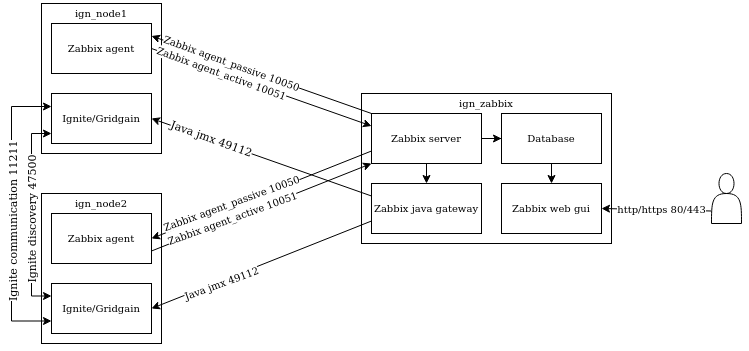

## ARTS-2019 左耳听风社群活动--每周完成一个 ARTS
1.Algorithm： 每周至少做一个 leetcode 的算法题
2.Review: 阅读并点评至少一篇英文技术文章
3.Tip: 学习至少一个技术技巧
4.Share: 分享一篇有观点和思考的技术文章

### 1.Algorithm:

875. 爱吃香蕉的珂珂：https://leetcode-cn.com/submissions/detail/231607513/

410. 分割数组的最大值：https://leetcode-cn.com/submissions/detail/231931430/

1011. 在 D 天内送达包裹的能力：https://leetcode-cn.com/submissions/detail/231933945/

### 2.Review:

https://www.gridgain.com/resources/blog/using-zabbix-monitor-apache-ignite-or-other-distributed-systems
使用 Zabbix 监控 Apache Ignite 或其他分布式系统

#### 点评：

从配置和更新的角度来看，从性能的角度来看，监控复杂的分布式系统的任务可能令人头疼。避免问题的最简单方法是在设计阶段防止问题。在这篇文章中，我们描述了如何使用 Zabbix 作为监控工具，将 Apache Ignite 作为分布式系统来实现对复杂分布式系统的监控。

要避免的问题：
性能：当多个指标从多个节点处理时，监控系统可能无法应对传入的指标流。
对系统性能的影响：指标收集可能会消耗不可接受的系统资源量。
冗余复杂性：您需要一个可以信任的监控系统。解决方案越复杂，失败的可能性就越高，尤其是在发生更改时。

建立监测系统的准则：
记住，越简单越好。
减少指标收集服务器上的负载。如果节点数量众多，最好在节点上执行复杂的计算，并将现成的值发送到服务器。
减少收集指标的频率，尤其是收集"重"指标。自动执行定期执行操作。随着节点数量的增加，手动操作不可避免地导致错误。
使用这些准则，我们将为测试组创建模板和配置监控。生成的模板可在 Zabbix 存储库中找到。

模板创建
要构建您的理想监控系统，您需要很好地了解要跟踪和评估的产品。

Apache Ignite 是一个内存计算平台，用作缓存、分布式计算系统和数据库。要了解 Apache Ignite，请参阅官方文件。系统性能的关键外部指标 （KPIs） 构成一套相对标准的指标：
CPU 负载
内存利用率
磁盘利用率，当使用持久化时
网络
Zabbix 包含用于监控这些指标和监控扩展指标（如光盘利用率）的模板。此外，Zabbix 存储库提供现成的解决方案：例如，提供用于监控 Linux 磁盘的模板。

对于分布式系统，外部指标在事件发生后识别问题：例如，在硬件故障后或系统不可用之后。为了识别潜在问题（在事件发生之前），需要内部指标。在编写本文时，没有用于 Apache Ignite 的现成内部指示器模板，因此我们将编写我们自己的内部指标模板。

由于 Apache Ignite 是用 Java 实现的，JMX 将是我们的主要监控方法。当我们下载并运行 Apache Ignite 时，JMX 端口会在 49112 和 65535 之间的第一个免费端口上打开。对于监控，此方法不合适，因为通常，端口是提前配置的，不能自动检测到。当您使用启动脚本时，很明显，要指定所需的端口，请使用 IGNITE_JMX_PORT 环境变量（用于 2.l0 之前的 Ignite 版本）或 IGNITE_JMX_PORT（用于 Ignite 版本 2.10 及更晚）。因此，通过运行命令 export IGNITE_JMX_PORT=49112，您打开 jmx 端口如下：
export JVM_OPTS="-Dcom.sun.management.jmxremote-dcom.sun.management.jmxremote.port=49112 -Dcom.sun.management.jmxremote.authenticate=false -Dcom.sun.management.jmxremote.ssl=false"）
节点启动后，我们可以在我们指定的静态端口上访问 JMX。

现在，了解端口后，我们可以使用标准 JDK 工具 （jconsole） 连接到应用程序，看看里面有什么。几乎所有的指标和对象都提供了它们所做的事情的描述。

需要我们注意的功能是，默认情况下，通往 mbean 的路径包含一个类加载器，该加载器在节点上每次重新启动后都会发生变化。此功能允许在一个 JVM 内启动多个 Ignite 实例，从而避免指标冲突。但是，由于没有自动生成的类加载器，Zabbix 会在每次重新启动后检测指标。我们可以通过添加 JMX 选项 -DIGNITE_MBEAN_APPEND_CLASS_LOADER_ID=false 来解决这个问题。此选项将类加载器从路径中删除。

 Apache Ignite 是开源软件。因此，如果您认为某些功能的工作方式不同，则可以参与开发。我在  Apache Ignite git 创建了任务。
当将类加载器从路径中移除并启动节点时，度量树看起来如下：

为了促进添加和更改指标的过程，我们首先确定哪些对象具有类似的实体。在 Java 中，此任务通常通过接口实现完成。在我们的例子中，例如，当您检查 IThread 池部分的指标时，您会看到所有对象都实现了线程池MXBean接口。

我们最感兴趣的事是，每个对象都有一套基本的指标。因此，关于 Zabbix 模板，我们可以为指标配置一个发现规则。然后，根据我们的规则，监控服务器检测所有相同的对象，并将模板应用到它们。
例如，查找数据区域的所有实例的规则如下所示：

Zabbix 将 {HOST.CONN}:{HOST.PORT} 的值设置为主机可用的地址，应用模板，并指定 JMX 端口号。

如果有必要调试 JMX 发现，您可以使用 zabbix_get 命令。例如，您发出以下请求：

```shell
zabbix_get -s localhost -p 10052 -k '{"request":"java gateway jmx","jmx_endpoint":"service:jmx:rmi:///jndi/rmi://HOST:49112/jmxrmi","keys":["jmx.discovery[beans,\"org.apache:group=DataRegionMetrics,name=*\"]"]}'
```

并且，为了响应您的请求，您将收到以下结果：
```JSON
{
 "{#JMXDOMAIN}":"org.apache",
 "{#JMXOBJ}":"org.apache:group=DataRegionMetrics,name=sysMemPlc",
 "{#JMXNAME}":"sysMemPlc",
 "{#JMXGROUP}":"DataRegionMetrics"
},
{
 "{#JMXDOMAIN}":"org.apache",
 "{#JMXOBJ}":"org.apache:group=DataRegionMetrics,name=default",
 "{#JMXNAME}":"default",
 "{#JMXGROUP}":"DataRegionMetrics"
},
{
 "{#JMXDOMAIN}":"org.apache",
 "{#JMXOBJ}":"org.apache:group=DataRegionMetrics,name=TxLog",
 "{#JMXNAME}":"TxLog",
 "{#JMXGROUP}":"DataRegionMetrics"
}
```

指标模板示例：


Zabbix 采用 [#JMXNAME] 参数，从对发现请求的响应中，取出类似于 [#JMXNAME] 参数的参数。

我已确定应使用发现机制的几个指标组：
- 数据区域
- 缓存组
- 缓存
- 线程池
其余指标（如当前协调器、客户端和服务器节点数量以及节点上的事务数量）将插入到单独的组中。

部署和自动化
现在，我们拥有所有必要的模板并了解产品的工作原理，我们将配置和测试设备或应用程序的监控系统。我们将使用 Docker 进行过程隔离。

流程的工作原理：
- 收到 Zabbix 代理的第一个请求后，Zabbix 服务器注册了一个新的节点。
- Zabbix 服务器执行添加 JMX 端口并将模板应用到新节点的脚本。
- Zabbix 服务器开始将请求发送到 Java 网关，后者轮询应用程序并返回指标。
- Zabbix 代理接收服务器正在收集的活动指标列表，并开始将指标发送到 Zabbix 服务器。
- Zabbix 服务器请求从 Zabbix 代理被动收集的指标的值。
来自应用程序的指标通过 JMX 接收，并在 Zabbix 代理第一次调用服务器后注册新节点

关于为什么在第 2 步中使用自写脚本的详细信息：
- 最初，我想使用 Zabbix 功能，但"开箱即用"的 Zabbix 不知道如何为新节点分配 JMX 端口。而且，如果没有此功能，您就无法绑定使用 JMX 的模板。自 2012 年以来，Zabbix Jira一直在提出修订建议，目前处于开放状态。
- 可以通过 API 实现此功能。但是，API 方法需要创建服务用户，并且，如果您需要注册大量节点，则服务器的成本很高。
- 通过数据库的选项（从第一段中描述）对于 Ppostgresql 来说是可能的。但是，数据库选项不适用于 Oracle、MySQL 或 MariDB，因为在这些数据库中，您无法配置一个触发器，该触发器将插入触发该触发器的表中。
- 在脚本中添加接口的选项不成功，因为 Zabbix 不允许您在运行时对操作进行排序。操作按创建顺序执行，但外部脚本和通知发送任务将放置到自己的队列中，在所有其他操作完成后进行处理。


如何安装 Ignite 和 Zabbix：
- 如果没有安装 Docker 和 Docker Compose，请下载并安装它们。
- 从存储库下载所需的文件。
- 进入目录。
- 开始构建镜像：docker-compose -f docker-compose-zabbix.yml build
- 启动集群和监控服务器： docker-compose -f docker-compose-zabbix.yml up
- 等待几秒钟。
现在，Zabbix 可在 80 号端口上找到。默认帐户是 Admin / zabbix。

如何导入模板：
- 转到 Configuration->Templates->Import，从下载的文件夹中导入 zbx_export_templates.xml 模板。模板和 Templates/Ignite 自动注册组添加到 Zabbix 中。并且，将来，组名将用于将自动注册组的模板添加到新的节点中。
- 在需要应用的每个模板中，指定上一步骤中导入的组。模板文件已经包含"Template App Ignite JMX"模板，我已经添加了"Template App Generic Java JMX"和"Template OS Linux by Zabbix agent"模板。

如何创建代理自动注册脚本：
1.在 Zabbix 界面中，到 Configuration->Actions 选项卡，并从下拉列表中选择自动注册操作。
2.创建操作。
3.命名操作。
4.在选项卡上，我们还可以指定添加节点的条件。
5.在操作选项卡中，添加"添加主机"项目。
6.如果满足先前指定的条件，此操作会在 Zabbix 中创建一个新的节点。
7.添加 autoreg.php 脚本的启动。
脚本将 JMX 端口添加到设置中，并将指定组的模板应用到通过的节点。对于从图像中部署测试组的开发人员，它位于 /var/lib/Zabbix 文件夹中。对于自行安装 Zabbix 和 Ignite 的开发人员，脚本位于同一存储库中。就我而言，它通过如下命令运行： 
```shell
php /var/lib/zabbix/autoreg.php {HOST.HOST} 'Templates/Ignite autoregistration' '{HOST.METADATA}'
```
它应该看起来像：

如果一切正确，节点将显示在 Zabbix 中，其中带有配置的 jmx 端口和组中的应用模板。如果出现问题，请检查报告->审计日志。


结果和下一步去哪里
在组织监控时，您可以在指标的冗余以及产品和监控系统的性能之间做出选择。我们创建了一个双节点聚类，具有监控，足以在生产组上使用 Apache Ignite。

您必须保持最新的监控。如果当前配置无法防止紧急情况，则必须添加指标。此外，作为最佳实践，您偶尔应删除未使用的指标。拆卸可减少监控系统、应用程序和硬件的负载。

除了 Apache Ignite 之外，您的解决方案可能还包含各种其他组件，如客户端应用、前端、队列、网络设备和 DSS。这些组件还需要监测。如果没有监测，可能无法及时发现紧急情况。

对你们中的许多人来说，安全问题是相关的。JMX 和 Zabbix 代理都支持使用 SSL 连接进行指标传输。但这个问题是另一个时间要讨论的问题。

基于本文创建的 Ignite 监控模板现已在 Zabbix 标准供应中提供，版本为 5.4 及更高版本。因此，使用 Zabbix 进行 Apache Ignite 监控现在应该更方便了。

### 3.Tip:

#### netty-socketio 依赖问题

错误信息显示 io.netty.util.internal.PlatformDependent
netty-common-4.1.5.Final包中不存在，但netty-all-4.1.5.Final中有
修改pom文件
```xml
<dependency>
      <groupId>com.corundumstudio.socketio</groupId>
      <artifactId>netty-socketio</artifactId>
      <version>1.7.13</version>
      <exclusions>
        <exclusion>
          <groupId>io.netty</groupId>
          <artifactId>netty-common</artifactId>
        </exclusion>
        ...
      </exclusions>
</dependency>
```
引入netty-all的依赖
```xml
<dependency>
      <groupId>io.netty</groupId>
      <artifactId>netty-all</artifactId>
      <version>4.1.16.Final</version>
</dependency>
```

### 4.Share:

http://www.uml.org.cn/bigdata/201811291.asp
基于 Apache Ignite 日均十亿数据对账实践应用

https://www.gridgain.com/resources/blog/apacher-ignitetm-and-apacher-cassandratm-benchmarks-power-in-memory-computing
Apache® Ignite™ and Apache® Cassandra™ 基准测试: 内存计算的威力

https://blog.csdn.net/weixin_33997389/article/details/91686334
Ignite和Hazelcast性能对比测试

https://www.cnblogs.com/5207/p/6089209.html
Ignite性能测试以及对redis的对比

https://www.gridgain.com/products/control-center
GridGain Control Center

https://io-meter.com/2018/11/01/sql-query-optimization-volcano/
SQL 查询优化原理与 Volcano Optimizer 介绍