---
> **ARTS-week-44**
> 2021-10-31 17:35
---


## ARTS-2019 左耳听风社群活动--每周完成一个 ARTS
1.Algorithm： 每周至少做一个 leetcode 的算法题
2.Review: 阅读并点评至少一篇英文技术文章
3.Tip: 学习至少一个技术技巧
4.Share: 分享一篇有观点和思考的技术文章

### 1.Algorithm:

1482. 制作 m 束花所需的最少天数：https://leetcode-cn.com/submissions/detail/232130717/

LCP 12. 小张刷题计划：https://leetcode-cn.com/submissions/detail/232629336/

11. 盛最多水的容器：https://leetcode-cn.com/submissions/detail/115785096/

### 2.Review:

https://www.oracle.com/webfolder/technetwork/tutorials/obe/java/gc01/index.html
java 自动垃圾回收

#### 点评：

自动垃圾回收是一种在堆内存中找出哪些对象在被使用，还有哪些对象没被使用，并且将后者删掉的机制。所谓使用中的对象（已引用对象），指的是程序中有指针指向的对象；而未使用中的对象（未引用对象），则没有被任何指针给指向，因此占用的内存也可以被回收掉。在用 C 之类的编程语言时，程序员需要自己手动分配和释放内存。而 Java 不一样，它有垃圾回收器，释放内存由回收器负责。

第一步：标记
垃圾回收的第一步是标记。垃圾回收器此时会找出哪些内存在使用中，还有哪些不是。
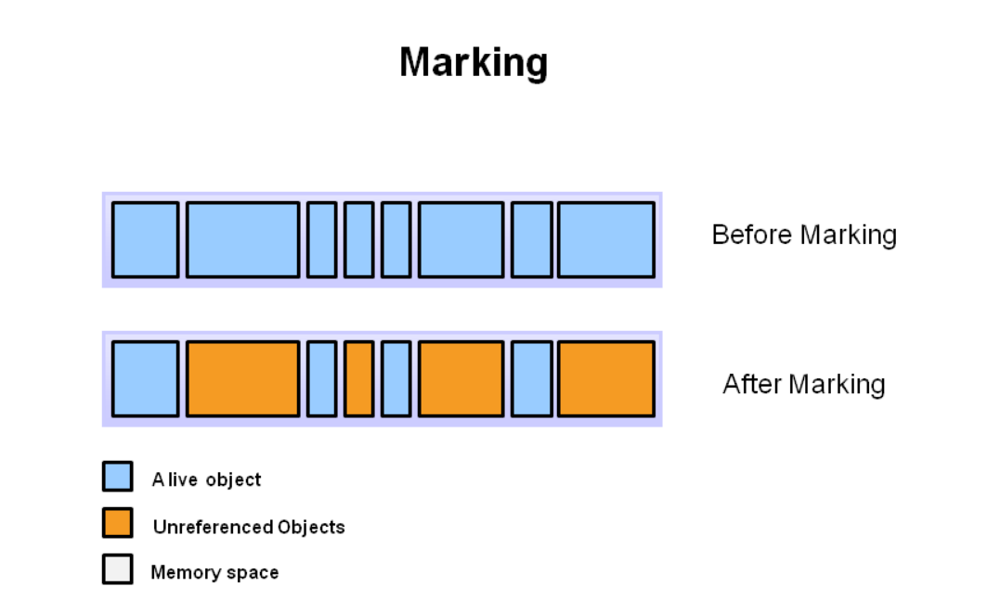
上图中，蓝色表示已引用对象，橙色表示未引用对象。垃圾回收器要检查完所有的对象，才能知道哪些有被引用，哪些没。如果系统里所有的对象都要检查，那这一步可能会相当耗时间。

第二步：清除
这一步会删掉标记出的未引用对象。
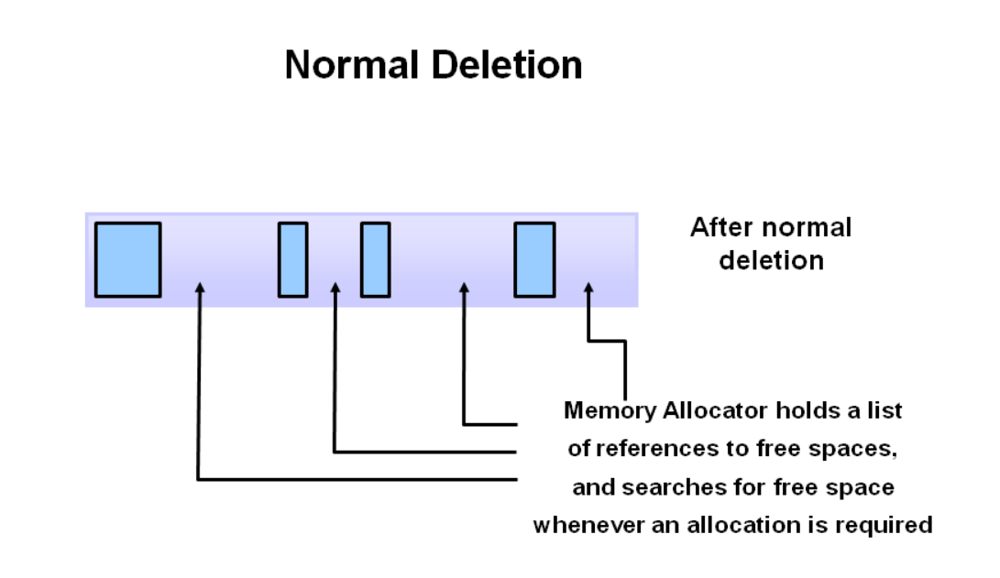
内存分配器会保留指向可用内存的引用，以供分配新对象。

压缩
为了提升性能，删除了未引用对象后，还可以将剩下的已引用对象放在一起（压缩），这样就能更简单快捷地分配新对象了。
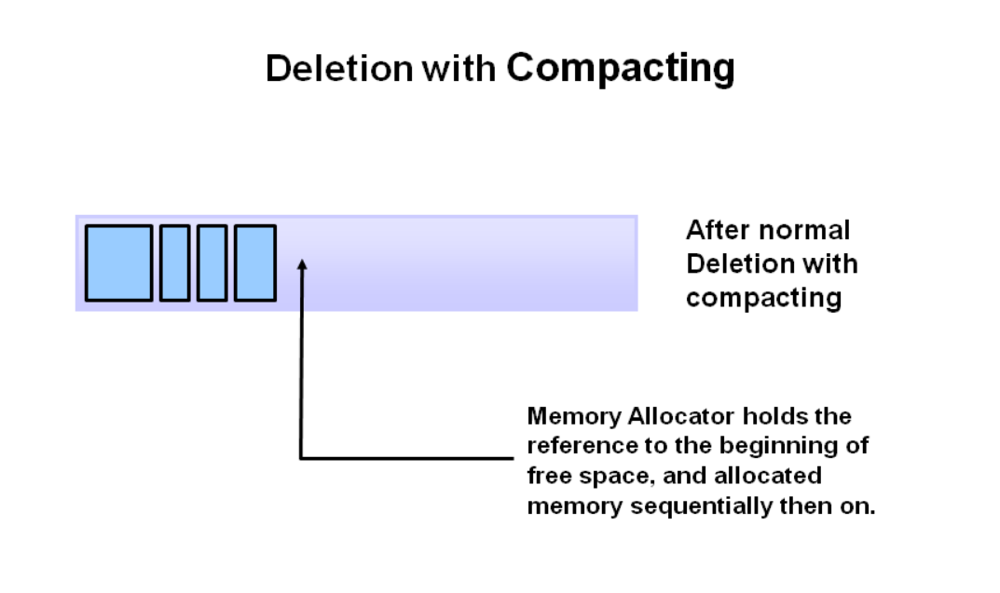

为什么需要分代垃圾收集？
之前说过，逐一标记和压缩 Java 虚拟机里的所有对象非常低效：分配的对象越多，垃圾回收需时就越久。不过，根据统计，大部分的对象，其实用没多久就不用了。
来看个例子吧。（下图中，竖轴代表已分配的字节，而横轴代表程序运行时间）
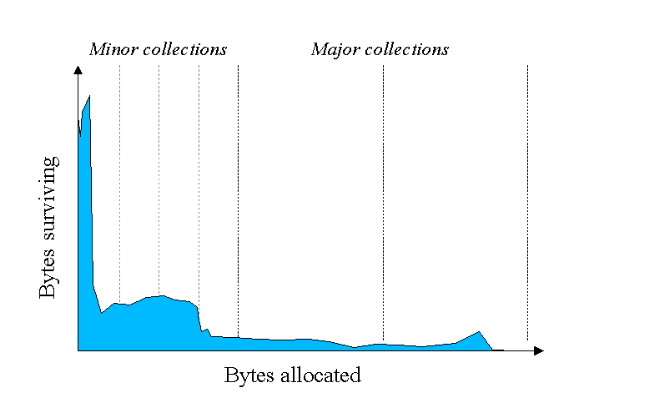
上图可见，存活（没被释放）的对象随运行时间越来越少。而图中左侧的那些峰值，也表明了大部分对象其实都挺短命的。

JVM 分代
根据之前的规律，就可以用来提升 JVM 的效率了。方法是，把堆分成几个部分（就是所谓的分代），分别是新生代、老年代，以及永生代。

新对象会被分配在新生代内存。一旦新生代内存满了，就会开始对死掉的对象，进行所谓的小型垃圾回收过程。一片新生代内存里，死掉的越多，回收过程就越快；至于那些还活着的对象，此时就会老化，并最终老到进入老年代内存。

Stop the World 事件 —— 小型垃圾回收属于一种叫 "Stop the World" 的事件。在这种事件发生时，所有的程序线程都要暂停，直到事件完成（比如这里就是完成了所有回收工作）为止。

老年代用来保存长时间存活的对象。通常，设置一个阈值，当达到该年龄时，年轻代对象会被移动到老年代。最终老年代也会被回收。这个事件成为 Major GC。

Major GC 也会触发STW（Stop the World）。通常，Major GC会慢很多，因为它涉及到所有存活对象。所以，对于响应性的应用程序，应该尽量避免Major GC。还要注意，Major GC的STW的时长受年老代垃圾回收器类型的影响。

永久代包含JVM用于描述应用程序中类和方法的元数据。永久代是由JVM在运行时根据应用程序使用的类来填充的。此外，Java SE类库和方法也存储在这里。

如果JVM发现某些类不再需要，并且其他类可能需要空间，则这些类可能会被回收。

世代垃圾收集过程
现在你已经理解了为什么堆被分成不同的代，现在是时候看看这些空间是如何相互作用的。 后面的图片将介绍JVM中的对象分配和老化过程。

首先，将任何新对象分配给 eden 空间。 两个 survivor 空间都是空的。
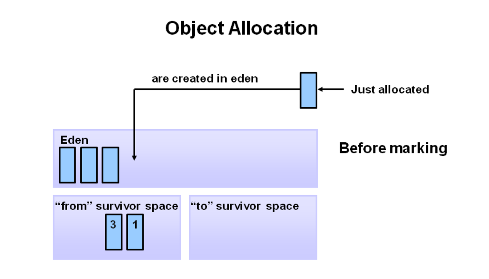
当 eden 空间填满时，会触发轻微的垃圾收集。
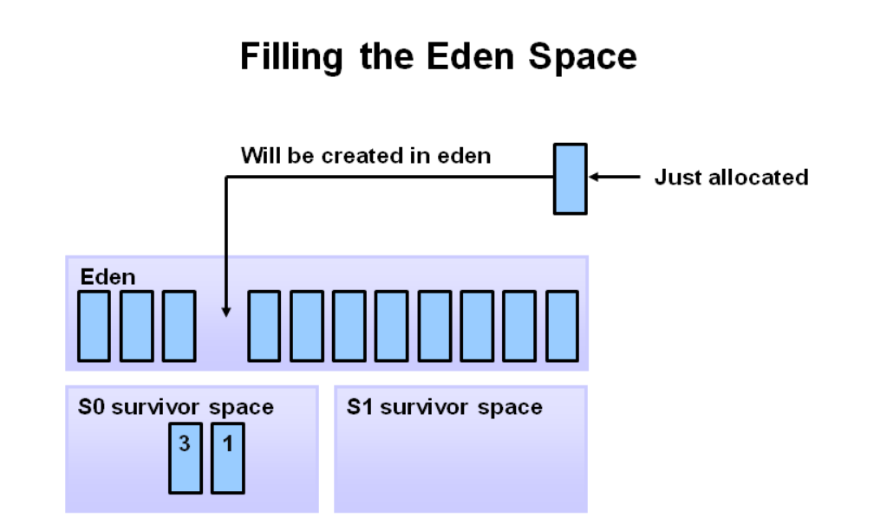
引用的对象被移动到第一个 survivor 空间。 清除 eden 空间时，将删除未引用的对象。
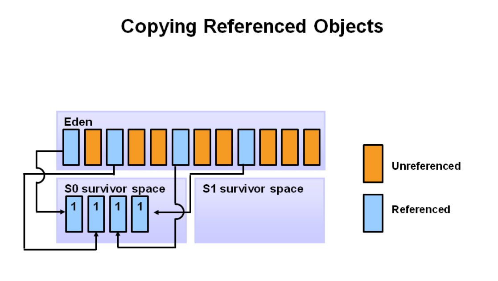
在下一次Minor GC中，Eden区也会做同样的操作。删除未被引用的对象，并将被引用的对象移动到Survivor区。然而，这里，他们被移动到了第二个Survivor区（S1）。此外，第一个Survivor区（S0）中，在上一次Minor GC幸存的对象，会增加年龄，并被移动到S1中。待所有幸存对象都被移动到S1后，S0和Eden区都会被清空。注意，Survivor区中有了不同年龄的对象。

在下一次Minor GC中，会重复同样的操作。不过，这一次Survivor区会交换。被引用的对象移动到S0,。幸存的对象增加年龄。Eden区和S1被清空。
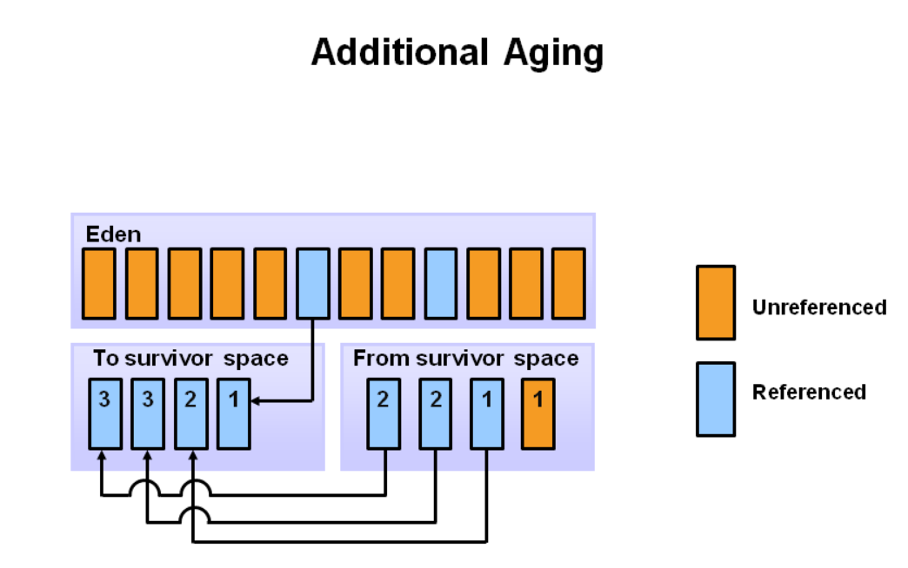
此幻灯片演示了 promotion。 在较小的GC之后，当老化的物体达到一定的年龄阈值（在该示例中为8）时，它们从年轻一代晋升到老一代。
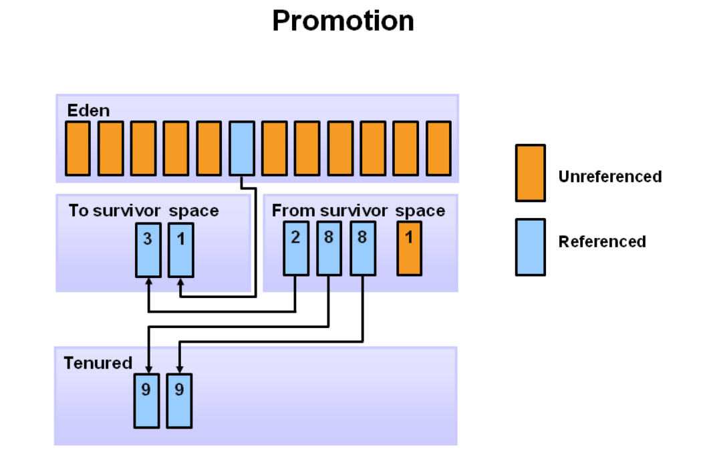
随着较小的GC持续发生，物体将继续被推广到老一代空间。
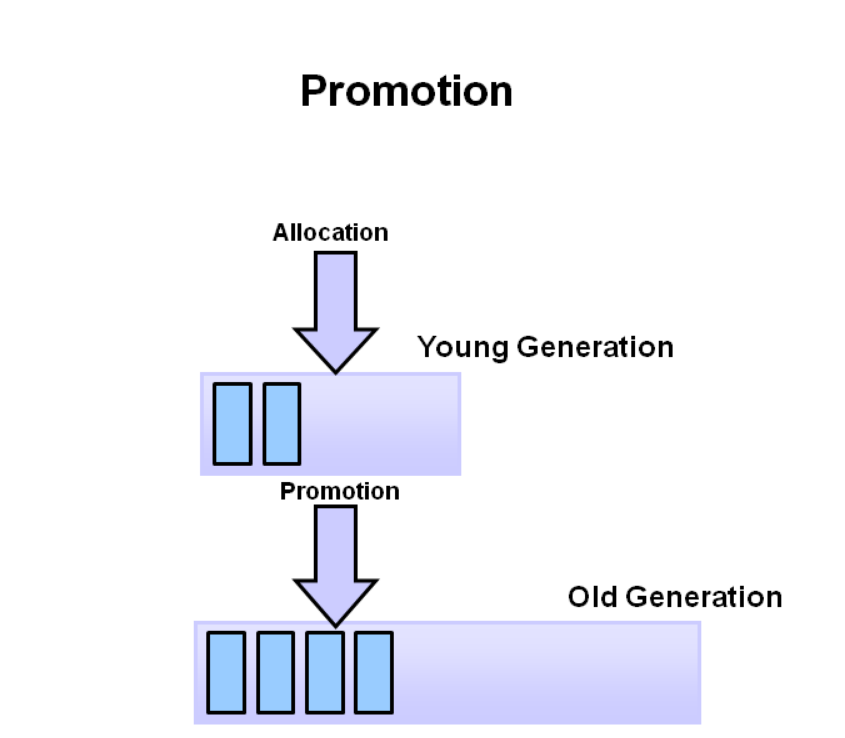
所以这几乎涵盖了年轻一代的整个过程。 最终，将主要对老一代进行GC，清理并最终压缩该空间。
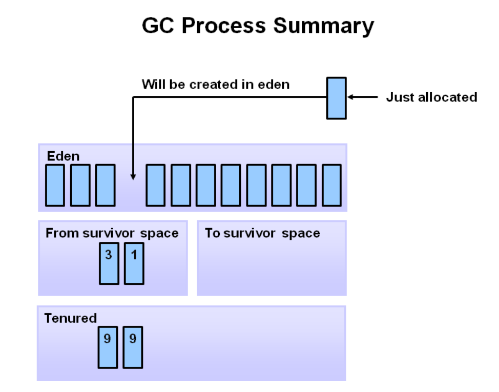

### 3.Tip:

#### Maven 查看当前生效配置及 pom 环境变量等命令

检查当前 Maven 环境启用的文件
```shell
mvn help:effective-settings
```
查看当前项目的 pom 配置，包括所有依赖
```shell
mvn help:effective-pom
```
查看当前处于激活状态的 profile
```shell
mvn help:active-profiles
```
指定使用某个配置文件执行 Maven 命令
```shell
mvn -s <filepath> <goal>
mvn -s ~/.m2/settings_local.xml clean deploy
```
查看当前项目的所有 Maven 配置, settings.xml 文件的读取顺序
```shell
mvn -X
```
打印所有可用的环境变量和 Java 系统属性
```shell
mvn help:system 
```

### 4.Share:

https://blog.csdn.net/nikeylee/article/details/117712209
Cat安装与使用（美团开源监控）

https://www.136.la/jingpin/show-169046.html
Cat安装与使用（美团开源监控）

https://www.cnblogs.com/softidea/p/5719331.html
cat监控平台环境搭建 专题

