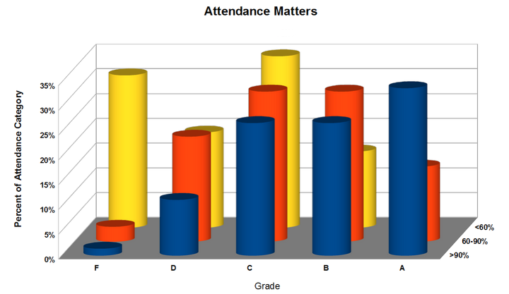

---
> **ARTS-week-45**
> 2021-11-07 19:12
---


## ARTS-2019 左耳听风社群活动--每周完成一个 ARTS
1.Algorithm： 每周至少做一个 leetcode 的算法题
2.Review: 阅读并点评至少一篇英文技术文章
3.Tip: 学习至少一个技术技巧
4.Share: 分享一篇有观点和思考的技术文章

### 1.Algorithm:

912. 排序数组：https://leetcode-cn.com/submissions/detail/233594739/

283. 移动零：https://leetcode-cn.com/submissions/detail/234658027/

88. 合并两个有序数组：https://leetcode-cn.com/submissions/detail/177713894/

### 2.Review:

https://www.freecodecamp.org/news/aspiring-data-scientist-master-these-fundamentals-be7c54350868/
立志成为数据科学家？掌握以下基础

#### 点评：

数据科学是一个令人兴奋的，快速移动的领域参与。对有才华、善于分析的人的需求不乏。各种规模的公司都在招聘数据科学家，这个角色为广泛的行业和应用提供了真正的价值。以下是任何有抱负的数据科学家应该掌握的一些基本技能概述。

从统计学开始
描述数据，向利益相关者提供详细的图片
比较数据和测试假设，为业务决策提供信息
确定提供真正预测价值的趋势和关系

评估的假设
通常比知道该采取哪种方法更重要，是知道该采取哪种方法。通常有几种方法来分析给定的数据集，但请务必避免常见的陷阱。

分布>位置
每当我谈论介绍性统计时，我总是确保强调一个特定点：变量的分布通常至少与其位置一样有趣/信息丰富。事实上，它往往是更。

这是因为变量的分布通常包含有关基础生成（或采样）过程的信息。

其次，了解数据的分布对于知道如何处理数据至关重要！许多统计测试和方法都依赖于有关数据分布方式的假设。作为一个精心策划的例子，始终确保以不同的方式对待单模式和双模态数据。他们可能有同样的意思，但如果无视他们分布，会失去一大堆重要信息。对于一个更有趣的示例，说明为什么在报告汇总统计数据之前，应该始终检查的数据，请查看 Anscombe 的四象限：

不同的数据;但几乎相同的方法，方差和相关性。每个图表看起来都很独特，对吧？然而，每个都有相同的汇总 - 统计数据，包括其手段，方差和相关系数。绘制一些分布显示它们相当不同。

最后，变量的分布决定了对其真实值的确定性。"窄"分布允许更高的确定性，而"宽"分布允许更少。

合适的采样
现实情况是，对于面向商业的数据科学家来说，采样可能是一个痛点，尤其是对于那些有研究或工程背景的科学家。在研究环境中，可以微调精确设计的实验，使用许多不同的因素和水平以及控制治疗。但是，"实时"商业条件通常从数据收集的角度来看并不理想。每一项决定都必须仔细权衡中断"一切照旧"的风险。这就要求数据科学家在解决问题的方法上具有创造性，但又现实。A/B 测试是一个规范的例子，说明了如何在颗粒级上优化产品和平台，而不会对一切照旧业务造成重大干扰。

A/B 测试是比较不同版本产品的行业标准，以优化它们。如果有一组内容合理的先验数据，Bayesian 方法可能可用于处理较小的数据集。

数据工程
实际上，从零开始实施算法的时间相对较少。事实上，大多数统计工具都附带了其内部工作，包裹在整洁的 R 包和 Python 模块中。"提取-转换负载"（ETL）过程对于任何数据科学团队的成功都至关重要。大型组织将拥有专门的数据工程师，以满足其复杂的数据基础设施需求，但年轻的公司往往将依靠其数据科学家拥有强大的、全面的数据工程技能。


实际编程
数据科学是高度跨学科的。除了先进的分析技能和特定领域的知识之外，该角色还需要扎实的编程技能。

有效编码
对于有抱负的数据科学家来说，一项非常重要的技能是有效地进行编码。可重复使用性是关键。值得花时间（当它可用时）在抽象水平上编写代码，使其能够多次使用。软件工程最佳实践值得开发，以便编写真正执行的生产代码。Git 等版本管理工具使部署和维护代码更加简化。任务调度器允许自动执行常规流程。定期的代码审查和商定的文档标准将使团队未来的生活更加轻松。
在任何技术专业化领域，通常都不需要重新发明车轮。数据工程也不例外。airflow 等框架使调度和监控 ETL 流程更加容易和可靠。对于分布式数据存储和处理，有apache spark 和 hadoop。

沟通清晰
数据科学是一个完整的堆栈学科，具有面向利益相关者的重要前端：报告层。事实上，事情很简单，有效的沟通 - 带来了巨大的商业价值。在数据科学方面，有效报告有四个方面。

- 准确性 这一点至关重要，原因显而易见。这里的技能是知道如何解释的结果，同时明确任何限制或警告，可能适用。重要的是不要夸大或低估任何特定结果的相关性。这很重要，因为报告中的任何含糊不清都可能导致对调查结果的误解。这可能会进一步产生负面后果。
- 简明扼要，尽可能缩短报告时间，但不要短篇大论。良好的格式可能会为主要问题提供一些上下文，包括对可用数据的简要描述，并概述"标题"结果和图形。附加细节可以（而且应该）包含在附录中。
- 需要不断平衡报告的技术准确性与大多数读者将成为各自领域的专家，而不一定是数据科学的现实。
这里没有简单的、一刀切的答案。频繁的沟通和反馈将有助于建立适当的平衡。

可视化
强大的数据可视化将帮助有效地将复杂的结果传达给利益相关者。精心设计的图表可以一目了然地显示需要解释的几个段落的文本。在构建仪表板和图形时，需要考虑一些指导原则。根本的挑战是最大限度地提高可视化的信息价值，而不牺牲"可读性"。

如何不呈现一般，保持简单。有效的可视化可视化可快速显示高级别概述。更复杂的图形可能需要更长的时间，观众消化，并相应地提供更大的信息内容。

如果只读过一本关于数据可视化的书，那么 Edward Tufte 的经典著作《定量信息的视觉显示》就是绝妙的选择。Tufte 单枪匹马地推广和发明了数据可视化领域的许多领域。广泛使用的术语，如"图表"和"数据密度"，源于 Tufte 的工作。三十年来，他的["data-ink ratio"](http://www-personal.umich.edu/~jpboyd/eng403_chap2_tuftegospel.pdf)概念仍然具有影响力。

颜色、布局和交互性的使用往往能区分良好的可视化和高质量、专业的可视化。

归根结底，创建出色的数据可视化比数据科学更经常地触及与 UX 和图形设计相关的技能。在空闲时间阅读这些主题是培养对哪些有效和哪些不起作用的认识的好方法。一定要看看网站，如bl.ocks.org的灵感！

数据科学需要多样化的技能
作为一名有抱负的数据科学家，应该专注于开发四个核心技能领域。它们是：
- 统计，包括基础理论和现实世界的应用。
- 编程，至少一个Python或R，以及SQL和使用命令线
- 数据工程最佳实践
- 有效地沟通的工作

### 3.Tip:

#### maven 的 Failure to find jar 包 in 中央仓库 was cached in the local repository

该问题在 idea 中发现，eclipse 中未发现，是 idea 不支持一些自己下载的 jar 包，需要处理
解决方法：
1.可以在 settings 中配置私库，有可能解决，有可能出现在私库里发现不了某个 jar 包的情况。
2.jar 所在文件中有_remote.repositories文件，找到将报错依赖的_remote.repositories中（jar包）>nexus=的nexus=改成central=
3.maven 安装 jar 到本地库
<dependency>
    <groupId>com</groupId>
    <artifactId>scp</artifactId>
    <version>1.0.1</version>
</dependency>
```shell
mvn install:install-file -Dfile=scp-1.0.1.jar -DgroupId=com -DartifactId=scp -Dversion=1.0.1 -Dpackaging=jar
```

#### 在 IDEA 上使用 maven 进行打包时报错：Failed to execute goal org.apache.maven.plugins:maven-javadoc-plugin:2.10.3:jar
```shell
mvn clean install -DskipTests -Dmaven.javadoc.skip=true
```

#### Tomcat 乱码
1.Tomcat 启动时出现乱码：找到 Tomcat 目录下 conf 文件夹中的 logging.properties 文件，打开 logging.properties 文件，找到文件中的 java.util.logging.ConsoleHandler.encoding = UTF-8。将其中的 UTF-8 改为 GBK，保存后重启 Tomcat 服务，启动后就会看到刚才的乱码已经转换过来了。
2.Tomcat 标题乱码：找到 Tomcat 目录下 bin 目录下的 catalina.bat 文件，用记事本打开文件，默认使用的是UTF-8编码， 转为ANSI编码并保存。

### 4.Share:

https://blog.csdn.net/njh1147394013/article/details/114732091
Could not initialize class com.dianping.cat.message.解决方案

http://hohode.com/2020/09/27/java-lang-NoClassDefFoundError-Could-not-initialize-class-com-dianping-cat-message-internal-DefaultMessageProducer/
java.lang.NoClassDefFoundError: Could Not Initialize Class com.dianping.cat.message.internal.DefaultMessageProducer

https://tech.meituan.com/2021/09/16/operational-logbook.html
如何优雅地记录操作日志？

http://www.choupangxia.com/2020/12/01/maven-optional-scope/
Maven中Optional和Scope元素的使用场景，弄明白了？

https://blog.csdn.net/seasonsbin/article/details/79093647
Maven 依赖范围