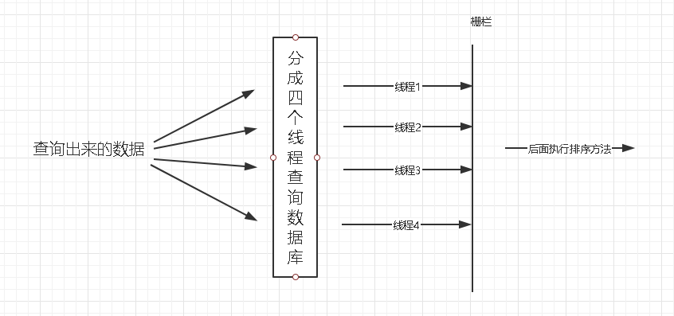
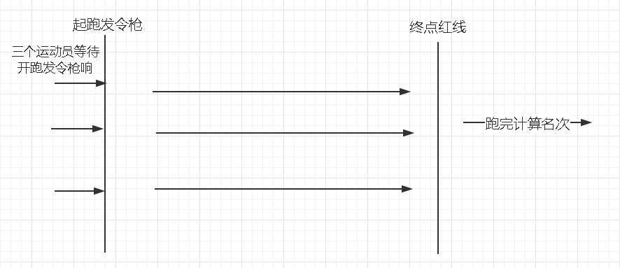

---
> **ARTS-week-46**
> 2021-11-14 19:06
---


## ARTS-2019 左耳听风社群活动--每周完成一个 ARTS
1.Algorithm: 每周至少做一个 leetcode 的算法题
2.Review: 阅读并点评至少一篇英文技术文章
3.Tip: 学习至少一个技术技巧
4.Share: 分享一篇有观点和思考的技术文章

### 1.Algorithm:

503. 下一个更大元素 II：https://leetcode-cn.com/submissions/detail/238592120/

### 2.Review:

https://programmer.ink/think/countdownlatch-demo-and-source-code.html
countdownlatch 演示和源码

#### 点评：

在以前的项目中，我们遇到了一个复杂的查询，即我们需要先在页面中查询 20 条数据，然后根据事件类型将这 20 条数据分为四类，然后分别用线程查询这四个类别的独特信息，然后在所有线程完成执行后， 我们将根据事件对这 20 个数据进行排序，最后将其返回到前端。由于使用的线程查询，我不知道何时完成。很长一段时间后，我找到了一个解决方案，那就是使用 countdownlatch。

1. countdownlatch 的功能：
countdownlatch 是一个计数锁，通过它，可以完成类似于阻止当前线程的功能，即一个或多个线程等待，直到其他线程执行的操作完成。

2. countdownlatch 方案：任务被分为多个执行任务。
方案1：
以上面的例子为例。线程 1、2、3 和 4 在栅栏位置时会被阻止。需要等待所有线程执行，然后才能打开栅栏并开始排序方法。


方案2：
我们都看过跑步比赛，运动员等待裁判出手，然后运动员开始跑步，当所有的距离动员完成后，裁判将计算排名。


```java
public CountDownLatch(int count) {
    if (count < 0) throw new IllegalArgumentException("count < 0");
    this.sync = new Sync(count);
}

Sync(int count) {
      setState(count);
}
```
这是 countdownlatch 的构造函数。需要设置初始大小，即线程数。如果计数小于 0，则直接抛出例外。否则，构建器中的计数将传递到 AQS 状态。因此， CountDownLatch 中 countDown() 就是 state 的变化。await() 是通过轮询状态确定所有任务是否都完成。

countDown 源码分析:
当前线程调用该方法后, 计数器值将递减。如果递减后计数器为0, 则所有调用 await 方法并被阻塞的线程都会被唤醒。 否则, 将什么都不会做。
```java
public void countDown() {
     sync.releaseShared(1);//The technology of decreasing lock. If the count is 0, the lock will be released. If the count is greater than 0, the count will be reduced by one
}

public final boolean releaseShared(int arg) {
    if (tryReleaseShared(arg)) {  //Try to release the lock. This method is overridden in sync. If the value of count is 0, do the following
        doReleaseShared();  
        return true;
    }
    return false;
}

/**
  * CountDownLatch This method of trying to release the lock is overridden by the internal class sync of
  */
protected boolean tryReleaseShared(int releases) {
    //  Decrement count; a signal when converted to zero
    for (;;) { //Use the dead loop to try to release the lock. The current thread successfully completes cas to reduce the count value (state value) and update it to state
        int c = getState();
        if (c == 0) //If count is equal to 0, exit. In order to prevent other threads from calling the countDown method after the counter value is 0, if there is no judgment, the status value will become negative.
            return false;
        int nextc = c-1; //For each execution, count minus one
        if (compareAndSetState(c, nextc)) //The cas mechanism is used to update the state of the state, and unsafe.compareAndSwapInt() is called to operate the memory. If the current state value is equal to the expected value, the atomic ground will set the synchronization state to the given updated value
            return nextc == 0; // Return when the update is successful
    }
}

private void doReleaseShared() {
    for (;;) {
        Node h = head;
        if (h != null && h != tail) {
            int ws = h.waitStatus;
            if (ws == Node.SIGNAL) {//Indicates that subsequent threads need to be disconnected
                if (!compareAndSetWaitStatus(h, Node.SIGNAL, 0))
                    continue;            // Cycle review
                unparkSuccessor(h);//Wake up subsequent nodes
            }
            else if (ws == 0 &&
                     !compareAndSetWaitStatus(h, 0, Node.PROPAGATE))
                continue;                // loop on failed CAS
        }
        if (h == head)                   // loop if head changed
            break;
    }
}
```

await 源码分析:
当前线程调用 CountDownLatch 对象的 await 方法后, 当前线程将被阻塞, 直到出现以下情况之一:
(1) 当所有线程调用 CountDownLatch 对象的 countDown 方法时, 即定时器值为0时。
(2) 其他线程调用当前线程的 interrupt() 方法中断当前线程, 当前线程将抛出 InterruptedException 异常并返回。
```java
public void await() throws InterruptedException {
    sync.acquireSharedInterruptibly(1);
}

public final void acquireSharedInterruptibly(int arg) throws InterruptedException {
    if (Thread.interrupted())
        throw new InterruptedException();
    if (tryAcquireShared(arg) < 0)//Try to see if the current count is 0. If it is 0, it will return directly. Otherwise, it will enter the AQS queue and wait
        doAcquireSharedInterruptibly(arg);
}

/**
 * CountDownLatch This method is rewritten by sync
 */
protected int tryAcquireShared(int acquires) {
    return (getState() == 0) ? 1 : -1;//If state is not equal to 0, it will return - 1. Enter the above method to join AQS queue and wait
}

//AQS waiting queue, using optimistic lock to obtain shared resources
private void doAcquireSharedInterruptibly(int arg) throws InterruptedException {
    final Node node = addWaiter(Node.SHARED);//addWaiter is the joining end of AQS
    boolean failed = true;
    try {
        for (;;) {
            final Node p = node.predecessor();//Get previous node
            if (p == head) {
                int r = tryAcquireShared(arg);
                if (r >= 0) {
                    //Set the queue header and check whether the subsequent processes may wait in shared mode. If so, propagation is performed when propagate > 0 or propagate status is set.
                    setHeadAndPropagate(node, r);
                    p.next = null; // help GC
                    failed = false;
                    return;
                }
            }
            //Check and modify the state of a node when it fails to acquire a lock. Returns true if the thread needs to block and suspend the current thread
            if (shouldParkAfterFailedAcquire(p, node) &&
                parkAndCheckInterrupt())
                throw new InterruptedException();
        }
    } finally {
        if (failed)//If the exit is abnormal, cancel the acquisition
            cancelAcquire(node);
    }
}
```

### 3.Tip:

#### java 获取本机的IpAddress和Hostname
```java
InetAddress ia = InetAddress.getLocalHost();
String hostName = ia.getHostName();
String ipAddress = ia.getHostAddress();
```


### 4.Share:

https://zhuanlan.zhihu.com/p/151327554
Phaser多任务协同的神器

https://www.cnblogs.com/zsql/p/14381646.html
聊聊elasticsearch7.8的模板和动态映射

https://jueee.github.io/2020/08/2020-08-28-Java%E7%9A%84JIT%E7%9F%A5%E8%AF%86%E6%95%B4%E7%90%86/
Java 的 JIT 知识整理

https://blog.csdn.net/MeituanTech/article/details/109664525
Java中9种常见的CMS GC问题分析与解决
