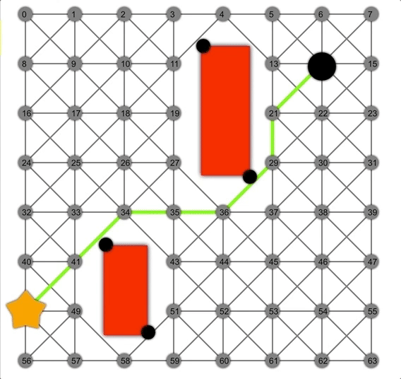
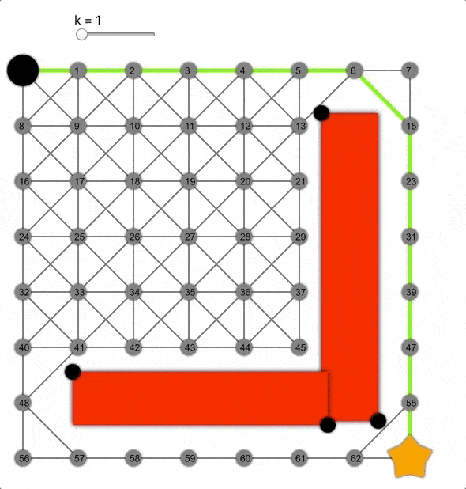

## ARTS-2019 左耳听风社群活动--每周完成一个 ARTS
1.Algorithm： 每周至少做一个 leetcode 的算法题
2.Review: 阅读并点评至少一篇英文技术文章
3.Tip: 学习至少一个技术技巧
4.Share: 分享一篇有观点和思考的技术文章

### 1.Algorithm:

1244. 力扣排行榜：https://leetcode-cn.com/submissions/detail/247959365/
284. 窥探迭代器：https://leetcode-cn.com/submissions/detail/247974619/
1286. 字母组合迭代器：https://leetcode-cn.com/submissions/detail/247984361/

### 2.Review:

https://github.com/npretto/pathfinding
关于 A\*、Dijkstra、BFS 寻路算法的可视化解释

#### 点评：

广度优先搜索、Dijkstra和A\*是图上的三种典型路径规划算法。它们都可用于图搜索，不同之处在于队列和启发式函数两个参数。本项目探索并可视化不同算法如何根据选择参数进行图搜索。

算法的一般性原理如下：
将边界初始化为包含起始节点的队列。当边界队列不为空时，从队列中“访问”并删除一个“当前”节点，同时将访问节点的每个邻居节点添加到队列，其成本是到达当前节点的成本加上从当前节点访问邻居的成本再加上邻居节点和目标节点的启发式函数值。其中，启发式函数是对两个节点的路径成本的估计。存储访问路径（通常存储在cameFrom图中），以便后续重建路径。如果邻居节点已经在列表中，同时新路径的成本较低，那么更改其成本。找到目标路径（提前退出）或列表为空时，停止算法。


1.BFS
使用先进先出队列实现BFS。这种队列会忽略路径中链接的开销，并根据跳数进行扩展，因此可以确保找到最短路径的跳数，而跳数相关的成本。启发式函数的选择是任意的，因为在这个过程中其并不起作用。
使用数组可实现先进先出，即将元素附加到末尾并从头删除。

BFS演示动图。注意边界节点（黄色）是如何在网格中扩展为正方形的。在这里，正方形是相同“跳距”的节点集。


2.Dijkstra
在图上使用优先级队列和始终返回0的启发式函数，便得到Dijkstra算法。相比于BFS，Dijkstra最大的不同在于考虑了成本。通过该算法，可以根据节点到节点的成本找到最短路径。优先级队列使用数组实现，在每次插入新节点后对该数组进行排序。尽管实现优先级队列还有其他更高效的方式，但在我们的场景中，数组是足够快的，而且实现起来也简单。

Dijkstra展示动画，注意此时的边界是一个圆。

3.A\*
为实现A\*算法，需要传递一个实际启发式函数，例如两个节点之间的欧式距离。通过“节点成本”+“节点到目标节点的估算成本”对节点进行加权，通过优先搜索更大可能的节点加快搜索速度。

借助启发式方法，A\*可以比Dijkstra或BFS更快地找到正确路径。

4.非允许的启发式函数
只有应用可允许启发式函数，A\*才能找到最短路径，这也意味着算法永远不会高估实际路径长度。由于欧氏距离是两点之间的最短距离/路径，因此欧氏距离绝不会超出。
但如果将其乘以常数k>0会怎样呢？这样会高估距离，成为非允许的启发式函数。

k值越大，算法越容易到达目标，但同时准确性降低，导致生成的路径并非总是最短的。

5.算法实现
本项目通过Javascript实现，以便读者在Web上进行访问。另外，我使用react渲染UI，使用react-konva渲染图形。路径发现是指接受队列类型和启发式函数，并返回另一个函数，即真实路径发现（称为currying）。这样，用户每次更改设置后，都会使用确定参数创建一个新的路径发现函数，并将之用于图搜索。为可视化路径发现的步骤，我使用javascript生成器，这意味着函数返回一个迭代器，而不仅仅是一个值。因此，访客在每一步都可以生成算法的整个状态，并将其保存到数组，然后通过页面顶部的滑块显示特定状态。

### 3.Tip:

#### 在 Elasticsearch 中一个字段支持的最大字符数
最近在项目中遇到一个异常，写入数据到 Elasticsearch 中，报错：max_bytes_length_exceeded_exception。这个其实和 Elasticsearch 的字段长度限制有关，本文就回顾一下在 Elasticsearch 中一个字段支持的最大字符数。

```java
// 在业务中发现漏数，查看后台的任务日志，发现异常：
ERROR ESBulkProcessor: {"index":"your_index","type":"your_type","id":"b20ddaf126908506024aed6698b50214","cause":{"type":"exception","reason":"Elasticsearch exception [type=illegal_argument_exception, reason=Document contains at least one immense term in field=\"author.raw\" (whose UTF8 encoding is longer than the max length 32766), all of which were skipped.  Please correct the analyzer to not produce such terms.  The prefix of the first immense term is: '[-24, -87, -71, -25, -74, -83, -24, -128, -107, -17, -68, -113, -27, -113, -80, -27, -116, -105, -27, -96, -79, -27, -80, -114, 32, -27, -120, -111, -28, -70]...', original message: bytes can be at most 32766 in length; got 98345]","caused_by":{"type":"exception","reason":"Elasticsearch exception [type=max_bytes_length_exceeded_exception, reason=max_bytes_length_exceeded_exception: bytes can be at most 32766 in length; got 98345]"}},"status":400}
21/09/14 18:07:04 ERROR ESBulkProcessor: bulk [76 : 1560506824519] 527 request - 526 response
21/09/14 19:05:36 ERROR ESBulkProcessor: {"index":"your_index","type":"your_type","id":"cc36f925a9281389cb50b194cf590108","cause":{"type":"exception","reason":"Elasticsearch exception [type=illegal_argument_exception, reason=Document contains at least one immense term in field=\"author.raw\" (whose UTF8 encoding is longer than the max length 32766), all of which were skipped.  Please correct the analyzer to not produce such terms.  The prefix of the first immense term is: '[-27, -112, -77, -25, -112, -115, -27, -112, -101, -26, -114, -95, -24, -88, -86, -27, -96, -79, -27, -80, -114, 35, 34, 44, 34, 112, 117, 98, 116, 105]...', original message: bytes can be at most 32766 in length; got 94724]","caused_by":{"type":"exception","reason":"Elasticsearch exception [type=max_bytes_length_exceeded_exception, reason=max_bytes_length_exceeded_exception: bytes can be at most 32766 in length; got 94724]"}},"status":400}
```

可以看到，使用 bulk 方式，在数据写入 Elasticsearch 时遇到异常，如果一个字段的类型是 keyword，而实际写入数据时指定了一个非常长的文本值，会报错：illegal_argument_exception、max_bytes_length_exceeded_exception，整个文档写入失败并返回异常【注意，会过滤掉当前整个文档，即整条数据不能被写入，而如果字段的字节长度小于等于 32766，文档是可以被写入的，但是这个字段可能不会被索引，参考下面的 ignore_above 参数】。
更详细的信息：

```java
whose UTF8 encoding is longer than the max length 32766
```
author.raw 取值的字节数超过了 32766，无法写入，综合上述异常信息，表明 author.raw 字段定义为 keyword，而实际写入数据时文本长度过大，字节数达到 94724【大概率是脏数据】。注意，这里的无法写入是针对整个文档，即整条数据无法成功写入 Elasticsearch。

禁止索引
当然，对于长度不超过 32766 字节的 keyword 类型字段值，如果太长也没有意义，例如几百几千个字符【对应的字节数可能是几千几万】，而 Elasticsearch 原生也支持对 keyword 类型的字段设置禁止索引的长度上限，超过一定的字符数【前提是不超过 32766 字节】则当前字段不能被索引，但是字段的数据还是能写入的，它就是 ignore_above 参数，下面举例说明。

设置 name_ignore 字段为 keyword 类型，并指定 ignore_above 为 8，表示最大可以索引 8 个字符的长度。同理，设置 name 字段为 keyword 类型，并指定 ignore_above 为 32，表示最大可以索引 32 个字符的长度。

注意，ignore_above 参数限制的是字符数，具体字节数要根据实际内容转换，如果内容中都是字母、数字，则字符数就是字节数，但是当内容中大多数是中文、韩文，则字节数等于字符数乘以 4。

```java
PUT /my-index-post/_mapping/post
{
    "properties": {
      "name_ignore": {
        "type": "keyword",
        "ignore_above": 8
      }
  }
}

PUT /my-index-post/_mapping/post
{
    "properties": {
      "name": {
        "type": "keyword",
        "ignore_above": 32
      }
  }
}
```

写入 2 条数据：

```java
POST my-index-post/post/1
{
  "name": " 名称过长会被过滤名称过长会被过滤 & quot;,
  "name_ignore": " 名称过长会被过滤名称过长会被过滤 & quot;
}

POST my-index-post/post/2
{
  "name": " 名称过长会被过滤名称过长会被过滤 & quot;,
  "name_ignore": " 名称过长会被过滤名称过长会被过滤 & quot;
}
```

可以看一下数据，2 条数据都成功写入 Elasticsearch 中：
```java
POST my-index-post/_search
{
  "query": {
    "bool": {
      "must": [
        {
          "terms": {
            "_id": [
              "1",
              "2"
            ]
          }
        }
      ]
    }
  }
}
```

官方说明：
Strings longer than the ignore_above setting will not be indexed or stored.

总结
1、一个字段被设置为 keyword 类型，遇到很长的大段内容写入后【超过 32766 个字节】，抛出字节数过大异常，整条数据无法写入。
2、搜索超过 ignore_above 设定长度的字段，无法命中数据【因为在写入时没有做索引，但是字段的值仍旧保留】。
3、写入数据时，内容的字符数超过 ignore_above 的限制，整条数据仍旧可以入库【包含当前字段】，只是内容不会被索引，在查询命中这条数据时字段对应的值仍旧可以返回。
4、如果不设置 ignore_above 的值，默认为 256 个字符，但是记住这个值首先受限于 keyword 类型的限制，并不能无限大。


### 4.Share:

https://blog.csdn.net/qq_40414738/article/details/100735175
非常实用的 Java 8 代码片段

https://www.elastic.co/guide/cn/elasticsearch/guide/current/_cat_api.html
elasticsearch cat_api

https://blog.csdn.net/majixiang1996/article/details/105240893
解决当keyword类型超过256字节的报错：max_bytes_length_exceeded_exception: bytes can be at most 32766 in length；

https://blog.csdn.net/qq_23146763/article/details/100539139
深究｜Elasticsearch单字段支持的最大字符数?

https://cloud.tencent.com/developer/article/1739652
Grafana 发布 Loki 2.0 和大规模分布式追踪系统 Tempo

https://blog.csdn.net/j3T9Z7H/article/details/118035824
Grafana 8重磅发布：统一警报、实时流、继续炫酷到底！