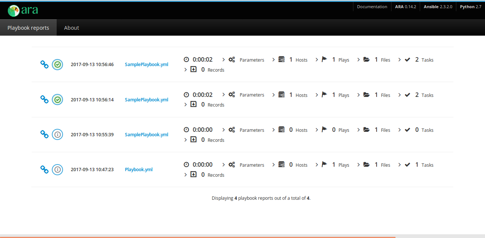

---
> **ARTS-week-17**
> 2022-04-23 15:27
---


###### ARTS-2019 左耳听风社群活动--每周完成一个 ARTS
- Algorithm： 每周至少做一个 leetcode 的算法题
- Review: 阅读并点评至少一篇英文技术文章
- Tip: 学习至少一个技术技巧
- Share: 分享一篇有观点和思考的技术文章

### 1.Algorithm:

- [386. 字典序排数 (中等) ?](https://leetcode-cn.com/submissions/detail/302060545/)  
  + 思路：递归
- [388. 文件的最长绝对路径 (中等) +](https://leetcode-cn.com/submissions/detail/302716566/)  
  + 思路：栈
- [587. 安装栅栏 (困难) ?](https://leetcode-cn.com/submissions/detail/304378667/)  
  + 思路：凸包算法
  
### 2.Review:

- [使用 ARA 分析 Ansible 运行状态](https://opensource.com/article/18/5/analyzing-ansible-runs-using-ara)  

#### 点评：

ARA 与 Ansible 无缝集成，提供了一种简单、直观的方式来查找所需的数据。Ansible 是一个多功能平台，在管理服务器和服务器配置方面已经变得流行起来。如今，Ansible 被大量用于通过持续集成 （CI） 进行部署和测试。在自动化持续集成的世界中，每天运行数百个（如果不是数千个）作业进行测试、构建、编译、部署等的情况并不少见。

- Ansible Run Analysis （ARA） 工具
Ansible 运行会生成大量控制台数据，在 CI 上下文中跟上大量 Ansible 输出是一项挑战。Ansible Run Analysis （ARA） 工具使此详细输出可读，并且更能代表作业状态和调试信息。ARA 组织记录的行动手册数据，以便可以尽可能快速、轻松地搜索和查找感兴趣的内容。

请注意，ARA 不会为运行的剧本;相反，无论身在何处，它都与 Ansible 集成为回调插件。回调插件支持在响应事件时向 Ansible 添加新行为。它可以执行自定义操作以响应 Ansible 事件，例如在主机上开始播放或任务完成。

与AWX和Tower相比，ARA是控制整个工作流程的工具，具有库存管理，剧本执行，编辑功能等功能，ARA的范围相对狭窄：它记录数据并提供直观的界面。这是一个相对简单的应用程序，易于安装和配置。

- 安装

有两种方法可以在系统上安装ARA：

  - 使用 GitHub 帐户上托管的 Ansible 角色。克隆存储库并执行以下操作：
```
ansible-playbook Playbook.yml
 ```
如果行动手册运行成功，将返回：
```
TASK [ara : Display ara UI URL] ************************
   ok: [localhost] => {}
   "msg": "Access playbook records at http://YOUR_IP:9191"
```
注意：它从 Ansible 收集的事实中选取IP地址。如果没有收集到此类事实，请将其替换为文件夹中文件中的IP。ansible_default_ipv4main.ymlroles/ara/tasks/
  - ARA 是一个开源项目，在 GitHub 上以 Apache v2 许可证提供。快速入门一章中提供了安装说明。文档和常见问题解答可在 readthedocs.io 上找到。

- ARA可以做些什么？
下图显示了从浏览器启动的ARA着陆页：

它提供了每个主机或每个行动手册的任务结果摘要：

它允许按行动手册、播放、主机、任务或状态筛选任务结果：

借助 ARA，可以轻松地从摘要视图向下钻取，以查找感兴趣的结果，无论是特定主机还是特定任务：

ARA 支持在同一数据库中记录和查看多个运行。


- 结束语
ARA 是一个有用的资源，它帮助我从 Ansible 运行日志和输出中获得更多收益。


### 3.Tip:

#### sshd 命令 – openssh 服务器守护进程
```shell
以调试模式运行sshd：
[root@linuxcool ~]# /usr/sbin/sshd -d
以测试模式运行sshd：
[root@linuxcool ~]# /usr/sbin/sshd -t
```

#### 查看 Django 版本
```shell
~$ python
>>> import django
>>> print(django.VERSION)
```

#### Pycharm 上调试 Celery
```shell
1. Edit Configurations
在 pycharm 的顶部菜单栏 Run 下，下拉菜单栏点击 Edit Configurations
2. Add a new Configuration
Python
3. Edit Script path and Parameters
配置 celery 的地址以及 celery 的执行参数
Script Path: <$PythonHome>/bin/celery
Paramaters: -A iops worker -l info
```

#### Python multiprocessing job to Celery task but AttributeError
```shell
from celery.signals import worker_process_init
from multiprocessing import current_process

@worker_process_init.connect
def fix_multiprocessing(**kwargs):
    try:
        current_process()._config
    except AttributeError:
        current_process()._config = {'semprefix': '/mp'}
```

#### python3 报错 pymongo.errors.ConfigurationError
升级 pymongo 到 3.12 版本问题解决。
```shell
pip3 install pymongo==3.12
```

#### pip 安装指定版本
```shell
# 安装 make
python -m pip install --upgrade pip==20.0.2
```

### 4.Share:

- [Eliot：一个优秀的日志管理系统](https://zhuanlan.zhihu.com/p/151051999)  

- [Python Celery分布式任务队列的安装与介绍(基于Redis)](https://www.cnblogs.com/reconova-56/p/14806920.html)  

- [python --配置celery遇见的问题](https://blog.csdn.net/lyhyrc/article/details/122969267)  

- [ssh-keygen](https://www.jianshu.com/p/dd053c18e5ee)  
