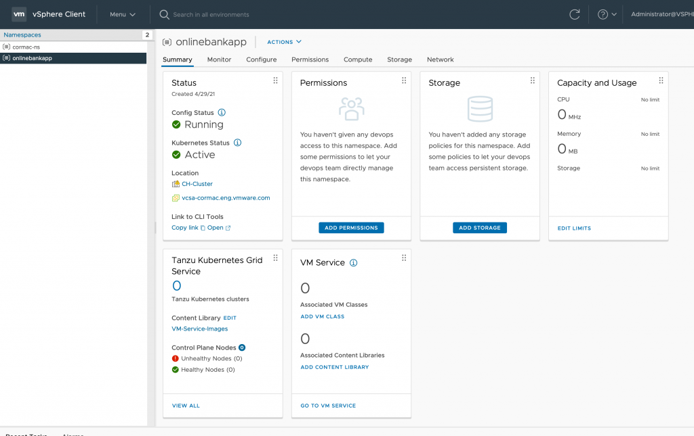
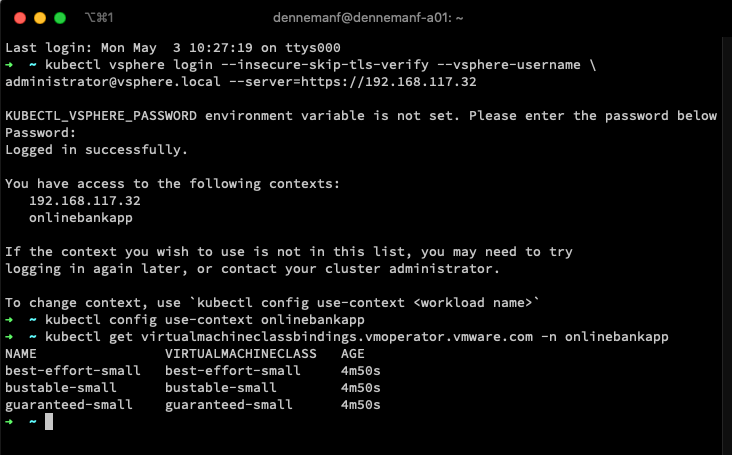

---
> **ARTS-week-19**
> 2022-05-08 17:29
---


###### ARTS-2019 左耳听风社群活动--每周完成一个 ARTS
- Algorithm： 每周至少做一个 leetcode 的算法题
- Review: 阅读并点评至少一篇英文技术文章
- Tip: 学习至少一个技术技巧
- Share: 分享一篇有观点和思考的技术文章

### 1.Algorithm:

- [591. 标签验证器 (困难) ?](https://leetcode-cn.com/submissions/detail/308330856/)  
  + 思路：正则
- [1823. 找出游戏的获胜者 (中等) ?](https://leetcode-cn.com/submissions/detail/309141498/)  
  + 思路：与瑟夫环
- [713. 乘积小于 K 的子数组 (中等) +](https://leetcode-cn.com/submissions/detail/309603355/)  
  + 思路：滑动窗口
- [433. 最小基因变化 (中等) ?](https://leetcode-cn.com/submissions/detail/310861600/)  
  + 思路：BFS

### 2.Review:

- [家Kubernetes
VM 服务 – 通过将 KUBERNETES 节点与物理基础架构对齐来帮助开发人员](https://frankdenneman.nl/2021/05/03/vm-service-help-developers-by-aligning-their-kubernetes-nodes-to-the-physical-infrastructure/)  

#### 点评：

4 月 27 日发布的 vSphere 7.0 U2a 更新引入了新的虚拟机服务和虚拟机运营商。隐藏在看似微不足道的更新中的是一系列全新的功能。Myles Gray 写了一篇关于新功能的广泛文章。我想重点介绍 VM 服务的 VM 类的管理控制。

- VM 类
什么是 VM 类，如何使用它们？借助 Tanzu Kubernetes Grid Service 在 Supervisor 集群中运行，开发人员无需 Infra Ops 团队的帮助即可部署 Kubernetes 集群。使用其本机工具，它们通过使用特定的 VM 类来指定群集控制平面和辅助角色节点的大小。VM 类配置执行一个模板，用于定义 CPU、内存资源以及这些资源的可能预留。这些模板允许 InfraOps 团队为这些 TKG 群集消耗群集资源设置护栏。

主管群集提供 12 个预定义的 VM 类。它们派生自 Kubernetes 空间中常用的 VM 大小。提供了两种类型的 VM 类：尽力而为类和保证类。保证类版本完全保留其配置的资源。也就是说，对于群集，spec.policies.resources.requests 与 spec.hardware 设置匹配。尽力而为的版本不允许过度使用资源。让我们仔细看看默认的 VM 类。


虚拟机类类型 | 中央处理器预留 |  内存预留  
-|-|-
尽力而为-'大小' | 0兆赫 | 0 千兆字节
保证“尺寸”  | 等于 CPU 配置 | 等于内存配置

有八种默认大小可用于这两种 VM 类类型。所有 VM 类都配置了 16GB 磁盘。

虚拟机类大小 | CPU 资源配置 | 内存资源配置
-|-|-
XSmall | 2 |2 Gi
小 |2 |4 Gi
中等  |2 |8 Gi
大 |4 |16 Gi
X大  |4 |32 千兆字节
2 X大  |16  |128 千兆字节
4 X大  |16  |128 千兆字节
8 超大  |32  |128 千兆字节

如果熟悉 Kubernetes，可能会注意到的第一件事是默认设置缺少 QoS 类，即 Burstable 类。“有保证”类和“尽力而为”类位于保留资源范围的两端（全有或全无）。可突增类可以位于中间的任何位置。即，VM 类应用内存和/或 CPU 预留。通常，可突增类被描述为没有持续高资源使用率的工作负荷的低成本选项。尽管如此，我认为该类可以在无退款云部署中发挥重要作用。


要将可突增类添加到主管群集，请转到工作负载管理视图，选择服务选项卡，然后单击 VM 服务的管理选项。单击“创建 VM 类”选项，然后输入相应的设置。在下面的示例中，我为 CPU 和内存资源输入了 60% 的预留，但可以为这些资源设置独立的值。有趣的是，无法进行磁盘大小配置。


尽管已创建 VM 类，但必须将其添加到命名空间才能用于自助部署。


单击“VM 服务”磁贴中的“添加 VM 类”。我通过单击 vCPU 列修改了视图，以查找不同的“小型”VM 类，并选择了三个可用的类。


选择适当的类后，单击“确定”。命名空间摘要概述显示命名空间提供三个 VM 类。


开发人员可以使用以下命令查看分配给命名空间的 VM 类：
kubectl get virtualmachineclassbindings.vmoperator.vmware.com -n namespacename我登录到主管集群的 API 服务器，将上下文更改为命名空间“onlinebankapp”并执行命令：

```shell
kubectl get virtualmachineclassbindings.vmoperator.vmware.com -n onlinebankapp
```



如果使用命令“kubectl get virtualmachineclass -n onlinebankapp”，将看到集群中可用的虚拟机器类列表。


- 通过将 Kubernetes 节点与物理基础架构对齐来帮助开发人员
借助新的 VM 服务和可自定义的 VM 类，可以帮助开发人员将其节点与基础结构对齐。基础架构细节在 Kubernetes 层中并不总是可见的，也许并非所有开发人员都热衷于了解环境的复杂性。VM 服务仅允许你发布你认为适合该特定应用程序项目的 VM 类。其中一个原因可能是避免了怪物虚拟机部署。在此更新之前，开发人员可以使用保证的 8XLarge 类（每个工作线程节点配备 32 个 vCPU，128Gi 全部保留）部署一个六工作节点 Kubernetes 集群，如果的主机配置足够， 则授予。但限制只是这种情况的一个角度。长期关系通常是自然共生的，权力游戏通常无助于在开发人员和InfraOps团队之间建立关系。更好的做法是将其与群集中 ESXi 主机的 NUMA 配置对齐。


- NUMA 对齐
我已经发布了许多有关 NUMA 的文章，但下面简要概述了 VM 的各种 NUMA 配置。如果虚拟机 （VM） 打开电源，NUMA 调度程序将根据 VM CPU 计数和 ESXi 主机的物理 NUMA 拓扑创建一个或多个 NUMA 客户端。例如，具有十个 vCPU 的虚拟机在 ESXi 主机上供电，每个 NUMA 节点有十个核心 （CPN2） 配置了单个 NUMA 客户机以最大化资源局部性。此配置是窄 VM 配置。由于所有 vCPU 都可以访问同一本地化内存池，因此可以将其视为统一内存体系结构 （UMA）。

以在同一主机上打开 12 个 vCPU 的 VM 为例。NUMA 计划程序将两个 NUMA 客户端分配给此 VM。NUMA 计划程序将两个 NUMA 客户端放在不同的 NUMA 节点上，每个 NUMA 客户端包含六个 vCPU，用于平均分配工作负荷。此配置是宽 VM 配置。如果启用了并发多线程处理 （SMT），则 VM 可以具有与系统中逻辑 CPU 数量相等的 vCPU 数量。NUMA 调度程序将 vCPU 分布在可用的 NUMA 节点之间，并信任 CPU 调度程序来分配所需的资源。一个 24 vCPU 的 VM 将配置两个 NUMA 客户端，如果部署在 10 CPN 上，则每个客户端包含 12 个 vCPU2主机。此配置是高密度宽 VM。


VM 服务的一大用途是创建一组与各种 NUMA 配置一致的新 VM 类。以双十核系统为例，我将创建以下 VM 类以及关联的 CPU 和内存资源预留：

中央处理器 |记忆  |尽最大努力 |可突增 |突发记忆优化  |保证 
-|-|-|-|-|-
UMA-小型  |2 |16GB  |0%¦0%  |50%¦50%  |50%¦75%  |100%¦100%
UMA-培养基 |4 |32GB  |0%¦0%  |50%¦50%  |50%¦75%  |100%¦100%
UMA-大型  |6 |48GB  |0%¦0%  |50%¦50%  |50%¦75%  |100%¦100%
UMA-XLarge  |8 |64GB  |0%¦0%  |50%¦50%  |50%¦75%  |100%¦100%
NUMA-小型 |12  |96GB  |0%¦0%  |50%¦50%  |50%¦75%  |100%¦100%
中号  |14  |128GB |0%¦0%  |50%¦50%  |50%¦75%  |100%¦100%
NUMA-大型 |16  |160GB |0%¦0%  |50%¦50%  |50%¦75%  |100%¦100%
NUMA-XLarge |18  |196GB |0%¦0%  |50%¦50%  |50%¦75%  |100%¦100%

策划 VM 类的优点是，可以在 CPU 级别和内存级别将 Kubernetes 节点与物理 NUMA 节点的边界对齐。在上表中，我创建了四个类，这些类保留在 NUMA 节点的边界内，并允许系统呼吸。我没有将 vCPU 计数最大化到可能的程度，而是留出了一些动态余量，避免了具有单个 NUMA 节点和系统范围的嘈杂邻居。与内存容量配置类似，UMA 大小（窄虚拟机）类的内存配置不超过 128GB 的物理 NUMA 边界，从而增加了 ESXi 系统从本地地址范围分配内存的机会。开发人员现在可以查询可用的 VM 类，并根据自己对应用程序资源访问模式的了解选择适当的 VM 类。是否正在部署具有中等 CPU 占用空间的低延迟内存应用程序？也许 UMA-Medium 或 UMA-large VM 类有助于获得最佳性能。自定义 VM 类可以将选择过程从简单的数字游戏（我想要多少个 vCPU？）过渡到功能更强大的需求探索（它的行为如何？当然，这些只是示例，这些不是VMware的官方认可。

此外，我还创建了一个新类“Burstable mem optimized”，该类保留的内存容量比其同级 VM 类“Burstable”多 25%。这对于需要保留大部分内存以提供一致性能但不需要所有内存的内存受限的应用程序非常有用。自定义 VM 类的优点在于，可以根据环境和工作负荷进行设计。凭借对基础架构的技能和知识，可以帮助开发人员取得更大的成功。


### 3.Tip:

#### 如何解决 python django 的引入报错 No Module Name ‘django.utils.six’
```python
pip install six
然后复制这个文件，把它粘贴到django/utils的路径下面：
from django.utils.six import BytesIO
```

#### /lib64/libc.so.6: version GLIBC_2.18' not found 报错解决
```shell
cd /usr/local
wget http://mirrors.ustc.edu.cn/gnu/libc/glibc-2.18.tar.gz
tar -xzvf glibc-2.18.tar.gz
cd glibc-2.18
mkdir -p build 
cd build/
../configure --prefix=/usr --disable-profile --enable-add-ons --with-headers=/usr/include --with-binutils=/usr/bin
make -j4
make install
ldd --version
```

#### celer 守护进程 celery 后台运行 beat worker 定时任务
```shell
# 后台运行Worker
cd 项目根目录
celery multi start w1 -A  celery_pro -l info  # 开始
celery multi stop w1 -A  celery_pro -l info # 结束

vim /opt/celery_worker.sh
#!/bin/sh 
case $1 in                                        
   start) cd /opt/django-celery/ && celery multi start w1 -A  celery_pro -l info;;  # django项目根目录 : /opt/django-celery/
   stop) cd /opt/django-celery/ && celery multi stop w1 -A  celery_pro -l info;; # django项目根目录 : /opt/django-celery/
   *) echo "require start|stop" ;;     
esac

sh celery_worker.sh start # 开启
sh celery_worker.sh stop # 关闭

# 后台运行 beat
vim /opt/celery_beat.sh
#!/bin/sh
case $1 in  
   start) cd /opt/django-celery/ && celery -A celery_pro beat -l info >  out.file  2>&1  & ;; # 启动beat ; django项目根目录 : /opt/django-celery/
esac 
vim /opt/beat_stop.sh
#!/bin/sh               
PROCESS=`ps -ef|grep celery|grep -v grep|grep -v PPID|awk '{ print $2}'`
for i in $PROCESS         
do
  echo "Kill the $1 process [ $i ]"  
  kill -9 $i        
done 
vim /opt/celery_beat.sh
#!/bin/sh
case $1 in  
   start) cd /opt/django-celery/ && celery -A celery_pro beat -l info >  out.file  2>&1  & ;; # 启动beat  ; django项目根目录 : /opt/django-celery/
   stop) su root /opt/beat_stop.sh start ;; # 关闭beat(根据beat_stop.sh脚本的路径适当变化)
   *) echo "require start|stop" ;;
esac 
sh celery_beat.sh start # 后台启动 beat
sh celery_beat.sh stop # 后台关闭 beat
```

#### CentOS7.x 离线安装 sshpass
```shell
wget https://nchc.dl.sourceforge.net/project/sshpass/sshpass/1.06/sshpass-1.06.tar.gz
tar  zxf sshpass-1.06.tar.gz
cd sshpass-1.06
./configure  --prefix=/usr/local/
make && make install
```

### 4.Share:

- [How to mount a filesystem on CentOS/RHEL 7](https://codingbee.net/rhcsa/rhcsa-mounting-a-partition)  

- [Linux 离线安装docker（一键式安装）](https://www.jianshu.com/p/64a470628e49)  

- [centos 安装 helm](https://blog.csdn.net/u013078871/article/details/118304230)  

- [【shell】 CentOS7.x 上 sshpass 的安装使用](https://blog.csdn.net/michaelwoshi/article/details/108902192)  

- [Windows 10 Helm / Kubernetes Development Environment Setup](https://codelabs.solace.dev/codelabs/helm-environment-setup/#0)  

- [Kubernetes 监控集群资源利用率 (Metrics-server+cAdvisor)](https://ld246.com/article/1591759807672)  

- [一篇带给你DDD领域建模实战](https://developer.51cto.com/article/706868.html)  

- [kubectl top node error- metrics not available yet 问题追踪](https://www.modb.pro/db/187740)  

- [谷歌每年节省上亿美金，资源利用率高达60%，用的技术有多厉害！](https://cloud.tencent.com/developer/article/1868707)  

- [微内核环境下的容器资源隔离和视图隔离研究](https://www.secrss.com/articles/32099)  

- [Docker容器基础1：Cgroup - 资源控制简介](https://lessisbetter.site/2020/08/27/cgroup-1/)  

