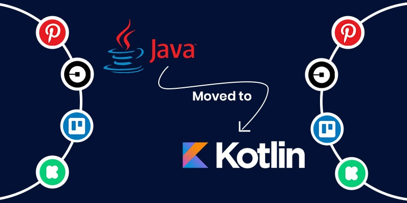
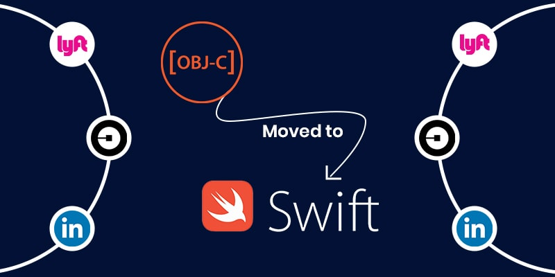
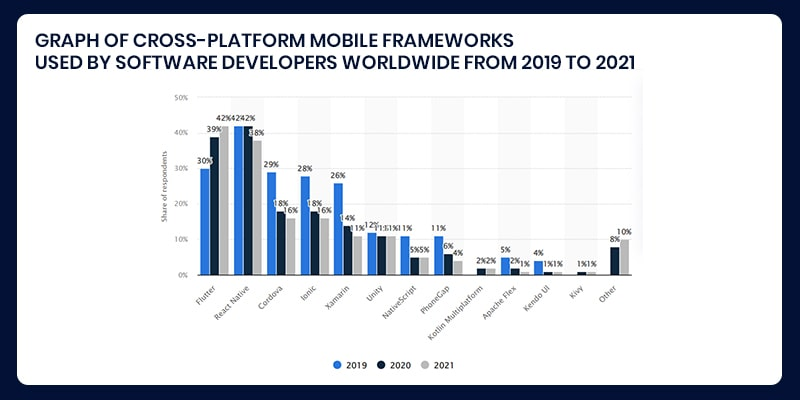
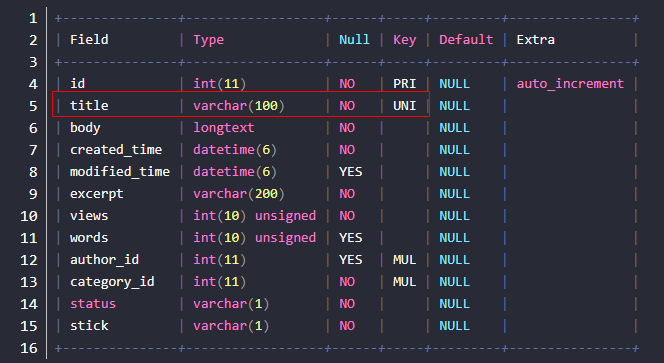

---
> **ARTS-week-22**
> 2022-05-29 08:48
---


###### ARTS-2019 左耳听风社群活动--每周完成一个 ARTS
- Algorithm: 每周至少做一个 leetcode 的算法题
- Review: 阅读并点评至少一篇英文技术文章
- Tip: 学习至少一个技术技巧
- Share: 分享一篇有观点和思考的技术文章

### 1.Algorithm:

- [464. 我能赢吗 (中等) ?](https://leetcode.cn/submissions/detail/316819449/)  
  + 思路: DFS
- [467. 环绕字符串中唯一的子字符串 (中等) +](https://leetcode.cn/submissions/detail/318084757/)  
  + 思路: 滑动窗口
- [面试题 17.11. 单词距离 (中等) \*](https://leetcode.cn/submissions/detail/318805520/)  
  + 思路: 通过

### 2.Review:

- [如何选择 2022 年最佳移动应用开发技术？](https://www.excellentwebworld.com/mobile-app-development-technology/)  

#### 点评：

客户在选择移动应用开发技术堆栈时最大的错误是什么？好吧，知道有时客户会根据他们的异想天开和幻想选择技术堆栈进行移动应用程序开发，这真是令人心碎。只是无法根据自己的喜好选择技术。要知道，使用个人偏好在软件开发中造成了更多的尴尬和问题。这是我们从大多数客户那里听到的。“选择移动应用开发技术很难”简单地说，原因是不断有新技术进入市场，很难从中选择最好的。但是，如果选择正确的移动应用程序开发技术，那么它可以为的应用程序创造奇迹。技术的选择取决于要求，主要取决于这些基本的东西：
- 公司目标
- 客户预算
- 应用的复杂性
那么，哪种移动应用开发技术最好呢？该博客向解释了哪种移动应用程序开发技术最适合的项目需求。但在此之前，让我们了解为什么有必要为的移动应用程序开发过程选择最佳选择。


- 为什么有必要选择 Apt 技术堆栈？
让我们想象一下，正在建造一所房子 -自己的房子。难道不能确保房子的基础是坚固的吗？当然，一旦创建了房屋，可以经常更改室内设计，但不能更改底座。同样，如果正在考虑开发移动应用程序，则在为 Android 应用程序开发和 iOS 应用程序开发选择正确的技术时需要谨慎。在开发应用程序时，必须选择平台，框架，设计和每个工具的最佳组合。坚实的基础使进一步的开发过程变得容易！同样，探索移动应用程序开发技术列表并从众多技术中选择最好的一个至关重要，因为应用程序市场是庞大且不断增长的。


- 关于移动应用开发市场
令人惊讶的是，移动应用程序开发市场正在呈指数级增长。如今，一些初创企业正在投资移动应用程序开发。他们从这些移动应用程序中获得丰厚的收入，并且必然会增加 10 倍。行动应用程式开发市场


好吧，显然，人们可以为游戏领域的儿童构建购物应用程序或应用程序开发，这可以带来漂亮的结果。
  - 50% 的购物者更喜欢在移动应用上购物，而不是在移动或桌面网站上购物。
  - 每月在 App Store 和 Play 商店上发布 4，000 个应用程序。
  - 根据 statista 的数据，到2023年，通过移动应用程序产生的预期收入将达到 9352 亿美元。
  - 人们一天中的1/5（即>4小时）时间在移动应用程序中消耗。
现在谈谈移动应用程序开发技术，让我们了解不同的技术如何帮助的项目。

- 探索各种最佳移动应用程序开发技术列表
了解所有应用程序开发技术是相当广泛的。因此，让我们使它更加直接，以便更好地理解。研究每个平台如何工作的分步过程非常适合的移动应用程序开发项目。 Android 和 iOS 应用程序在结构上彼此不同，因此不同的移动应用程序开发技术集适用于它们。我们将从了解本机和混合平台开始。

- 本机应用程序
本机应用程序是用于为一个特定平台构建的软件。因此，人们可以制作 iOS 应用程序或 Android 应用程序，但不能同时制作两者。

  - 为什么开发人员更喜欢开发原生应用？
在询问了一群开发人员之后，我们得出了以下结论;这些如下：
    - 本机应用提供最佳性能。
    - 提供更高的安全性。
    - 更平滑的输入和输出。
    - 访问任何特定设备的全部功能。
    - 在开发过程中发现的 Bug 更少。

  - 原生安卓应用
人们可以用 JAVA 开发原生 Android 应用程序，C++Kotlin。但是，其中最受欢迎的移动应用程序开发技术是什么？以下是该研究要说的：许多专家认为 Kotlin 是应用程序开发的最佳技术。不同意吗？好吧，图像证明了一切！




  - 为什么选择 Kotlin？
在 Kotlin 之前，开发人员认为 Java 为他们提供了最好的服务。但在 Kotlin 推出之后，开发人员对 Java 的信心有所动摇。现在，他们相信 Kotlin 应用程序开发为他们提供了更多好处。例如，许多专家现在认为kotlin为他们提供了更好的安全性和可靠性。

  - 原生 iOS 版
为了在iOS中开发应用程序，必须主要使用两种语言，Objective C 和 Swift。移动应用程序开发技术 Objective C 和 Swift 都为提供了同等优势。但是，许多客户仍然认为 Swift 是一个更好的选择。Objective-C 和 Swift 一样古老，未来可能会迅速增加优势。就像今天的许多公司正在转向 Swift 一样。



原生 iOS App：Obj-C 已移至 Swift 苹果声称 Swift 比 Objective-C 快2.6倍。

  - 混合应用
红利，是的，这就是混合应用开发服务为用户带来的。通过混合应用程序开发，可以为 Android 和 iOS 构建二合一的应用程序，从而节省大量时间，精力，最重要的是金钱。该代码创建一次，相同的代码用于Android和iOS。因此，可以在本机平台上节省大量时间和金钱。为什么要选择混合方法？
    - 成本更低
    - 更快的开发
    - 节省时间
    - 降低维护成本
    - 用户友好的界面
    - 可重用代码
    - 即用型资源库

- 混合移动应用开发中的热门技术
Javascript、HTML 和 CSS 是混合移动应用开发技术的核心。让我们了解混合平台提供的领先技术。

  - React-Native
毫无疑问，react native 正在成为开发人员最喜欢的选择。React-native 由 Facebook 于 2019 年推出，已被证明是最好的技术。有趣的是，node.js 与 react for Web 开发的结合显示出惊人的结果。说到移动应用开发技术，选择 react.js 进行移动开发的最大好处如下：
    - 在 react-native 中，应用程序开发过程要快得多，因为它使用了一些现成的组件。
    - 开发人员认为，在 react native 中查找和解决 bug 要容易得多。
    - React native 允许人们使用重复的代码。因此，它节省了大量的开发时间。
    - 不同的开发人员处理各种组件，最后，这些组件在最后合并。他们正在节省大量时间。
    - React-native 不是在实际的 DOM 中进行更改，而是在虚拟 DOM 中进行更改，再次为节省一些能量！
  - Ionic
Ionic 于 2013 年推出，到目前为止，已有超过500万个应用程序使用 Ionic 构建。此外，它是混合移动应用程序开发，用于为 iOS 和 Android 系统提供特定于平台的UI元素。但是，为什么开发人员选择 Ionic 应用程序开发呢？让我们看看它为开发人员提供了什么...！
    - Ionic 与 AngularJS 一起工作，可以创建健壮且功能丰富的应用程序。
    - 此外，离子平台以其简单性而闻名。它直接用于学习开发Ionic框架。
    - 在选择 Ionic 技术时，将获得预先设计的组件（如排版，交互式范例和一些出色的基本主题）的好处。
    - Ionic CLI（通用接口）有助于Android应用程序的开发，因为它具有预先构建的命令。

  - flutter
flutter 技术由谷歌于2017年推出。毫无疑问，移动应用程序开发技术得到了一家强大公司的支持。虽然 flutter 社区是新的，但 flutter 为开发人员提供了一些有吸引力的好处。让我们来探讨一下 Flutter 应用程序开发如何赢得开发人员的心：
    - 对于流体动画来说，效果令人印象深刻。是的，其他技术提供相同的功能，但 Flutter 以最好的方式做到这一点。
    - 此外，还有一个明显的性能差异，这意味着Flutter在各自的技术中越来越好。
    - 有趣的是，Flutter 提供了一个具有热重新加载选项的选项，即应用程序将在重新加载更改时保留状态。
    - 根据开发人员的推荐，该应用程序的新更新正在变得很好。
尽管与其他移动应用程序开发技术相比，flutter 是相当新的，但自发布以来，它拥有广泛而活跃的开发人员社区。新代码可帮助开发人员创建独特、创新和美观的跨平台应用程序。

  - Xamarin
2020 年，微软宣布 Xamarin 将 C 编程语言与 .NET 框架结合使用。该技术用于使用 C# 为 iOS，Android 和 Windows 构建应用程序。任何 Xamarin 开发人员都应精通 C# 语言。然而，由于用于移动应用程序开发的技术堆栈在市场上似乎很新，因此该技术存在一些漏洞 - 开发人员害怕在构建应用程序时使用该技术。几年后，一旦解决了一些故障，开发人员就可以获得对 Xamarin 技术的信任。在 Xamarin 中构建应用程序似乎是一件有风险的事情。

  - Phone Gap
Phone Gap以前以 “Apache Cordova” 这个名字而闻名。它是 Adobe 的产品，也是最快的移动应用程序开发框架之一。一个需要 HTML，CSS 和 JS 的基本知识。为什么人们选择 PhoneGap 作为移动应用程序开发技术？
    - 它与 iOS，Android 和 Windows 高度兼容。
    - 使用手机间隙进行设计变得容易得多。
    - 这是一个易于学习的平台。
    - 免费下载基于云的技术。

嗯，这是关于移动应用程序开发技术。这是一个梦幻般的技术池，为的利益服务。但同样，哪种技术最适合的项目。事实上，没有人可以帮助选择最好的技术，除非不了解项目的要求。

- 哪种技术 赢得最多选票？
我们猜想有很多关于技术的讨论。但同样，问题在于哪种技术在市场上获胜？人们选择标志性吗？在混合平台中，他们最信任哪种技术？好吧，图表使一切变得非常清晰。是的，统计数据可以更清楚地了解哪种移动应用程序开发技术可提供最佳结果。



- 集成到的移动应用程序开发中的最新技术
一个关键点..！当考虑开发应用程序时，有必要随时了解最新的移动应用程序开发技术，这些技术可以为带来丰厚的好处。仅仅为的业务开发一个应用程序不会给带来很多回报。为了获得更高的利润，建议将新技术集成到的应用程序中。在这里，我们将讨论一些正在获得动力的技术。

  - 增强现实：今天，人们喜欢增强现实服务的概念。了解是否要为用户提供新内容，他们一定会安装的应用程序。此外，它还增加了尝试通过移动应用程序销售的产品或服务的价值。

  - 虚拟现实：虚拟现实移动应用程序具有巨大的可能性，可以改善每个垂直行业的业务和客户参与度。虚拟现实软件开发在这些行业中越来越受欢迎。

    - 医疗
    - 教育
    - 赌博
    - 房产
    - 娱乐
  - 可穿戴设备：当人们听到可穿戴设备这个术语时，他们会将其与智能手表联系起来。但可穿戴设备的产品范围很广，从智能手环和眼镜到智能服装和时尚配饰，如智能戒指和吊坠。可以通过可穿戴应用程序开发服务为用户提供此类集成。

  - 物联网：全球热门话题。这家物联网应用软件开发公司最近看到，关于将物联网集成到现有移动应用程序中的需求激增。此外，现在新的移动应用程序将物联网技术集成到应用程序中。

通过将这些趋势技术集成到应用程序中，确保充分利用的应用程序。另外，请注意，只有使用正确的开发人员堆栈才能制作出色的应用程序。

### 3.Tip:

#### 配置本地 Gradle
```shell
# gradle\wrapper\gradle-wrapper.properties
distributionUrl=file:///D:/Java/gradle/gradle-7.4-all.zip
```

#### java.sql.SQLIntegrityConstraintViolationException: Duplicate entry ‘xxx‘ for key ‘xxx‘

异常:
```shell
### Error updating database.  Cause: java.sql.SQLIntegrityConstraintViolationException: Duplicate entry 'test1234' for key 'blog_post_title_uniq'
### The error may exist in com/eastnotes/mapper/ArticleMapper.java (best guess)
### The error may involve com.eastnotes.mapper.ArticleMapper.addBlog-Inline
### The error occurred while setting parameters
### SQL: INSERT INTO blog_post(title, body, created_time, excerpt, views, category_id, status, stick) VALUES(?, ?, ?, ?, ?, ?, ?, ?)
### Cause: java.sql.SQLIntegrityConstraintViolationException: Duplicate entry 'test1234' for key 'blog_post_title_uniq'
; Duplicate entry 'test1234' for key 'blog_post_title_uniq'; nested exception is java.sql.SQLIntegrityConstraintViolationException: Duplicate entry 'test1234' for key 'blog_post_title_uniq']
```

分析：
从报错可以看出来，是title这个字段的值重复了，也就是说当前插入的数据，跟数据库中某个字段的数据冲突了。所以报错了。进一步分析，一定是MySQL的某个字段添加了唯一键约束，才会出现这样的问题，通过查看表结构，发现确实如此，title字段添加了唯一键约束：



解决：

1.如果某个字段设定的就是不能插入重复值，那么不用改表结构，在插入时避免数据相同即可。
2.如果允许重复字段，那么解决起来更简单了，只需要在MySQL中把该字段的唯一键索引去掉即可，下面是删除唯一键属性的SQL语句

```shell
ALTER TABLE <表名> DROP INDEX <唯一约束名>;
```

唯一键约束名需要使用下面的命令查看：

```shell
show create table <表名>;
```

结果如下：

```shell
blog_post | CREATE TABLE `blog_post` (
  `id` int(11) NOT NULL AUTO_INCREMENT,
  `title` varchar(100) NOT NULL,
  `body` longtext NOT NULL,
  `created_time` datetime(6) NOT NULL,
  `modified_time` datetime(6) DEFAULT NULL,
  `excerpt` varchar(200) NOT NULL,
  `views` int(10) unsigned NOT NULL,
  `words` int(10) unsigned DEFAULT NULL,
  `author_id` int(11) DEFAULT NULL,
  `category_id` int(11) NOT NULL,
  `status` varchar(1) NOT NULL,
  `stick` varchar(1) NOT NULL,
  PRIMARY KEY (`id`),
  UNIQUE KEY `blog_post_title_uniq` (`title`),
  KEY `blog_post_author_id_fk_auth_user_id` (`author_id`),
  KEY `blog_post_category_id_fk_blog_category_id` (`category_id`)
) ENGINE=InnoDB AUTO_INCREMENT=184 DEFAULT CHARSET=utf8
```

其中 blog_post_title_uniq 就是唯一键约束名。最后通过下面的命令删除唯一键约束即可：

```shell
ALTER TABLE blog_post DROP INDEX blog_post_title_uniq;
```

#### SpringBoot 自定义注解 Annotation 及带参数的使用
1. 导入相关包, 在 build.gradle 中添加

```java
dependencies {
    //支持AOP
    compile('org.springframework.boot:spring-boot-starter-aop')
}
```

2. 添加自定义的注解类 TestAnnotation：

```java
import java.lang.annotation.*;
 
@Target({ ElementType.METHOD, ElementType.TYPE })
@Retention(RetentionPolicy.RUNTIME)
@Documented
public @interface TestAnnotation {
    String value();   // 允许注解有参数
}
```

3. 创建 Aspect 测试类 TestAspect：

```java
import com.great.annotation.TestAnnotation;
import com.great.annotation.TestAnnotation;
import org.aspectj.lang.JoinPoint;
import org.aspectj.lang.Signature;
import org.aspectj.lang.annotation.After;
import org.aspectj.lang.annotation.Aspect;
import org.aspectj.lang.annotation.Before;
import org.aspectj.lang.annotation.Pointcut;
import org.aspectj.lang.reflect.MethodSignature;
import org.springframework.core.annotation.Order;
import org.springframework.stereotype.Component;
 
import java.lang.reflect.Method;
 
@Aspect // FOR AOP
@Order(-99) // 控制多个 Aspect 的执行顺序，越小越先执行, 当然也可以不写这注解, 对于写和不写@order的两个切面, 有 @order 的优先于无 @order 的执行; 都有 @order 时, 越小越执先执行
@Component
public class TestAspect {
 
    // @Before 可以有两者写法, @annotation(形参test)
    @Before("@annotation(test)")// 拦截被 TestAnnotation 注解的方法；如果需要拦截指定 package 指定规则名称的方法，可以使用表达式 execution(...)
    public void beforeTest(JoinPoint point, TestAnnotation test) throws Throwable {
        System.out.println("beforeTest:" + test.name());   // 直接获取注解参数
    }
 
    @After("@annotation(test)")
    public void afterTest(JoinPoint point, TestAnnotation test) {
        System.out.println("afterTest:" + test.name());  // 直接获取注解参数
    }
 
    // 可以控制方法运行, 修改入参和返回值
    @Around("@annotation(test)")   // test 表示 aroundTest 方法中的 test 入参
    public Object aroundTest(ProceedingJoinPoint pjp, TestAnnotation test) throws Throwable {
        System.out.println("afterTest:" + mq.value());
        // 获取入参并修改
        Object[] args = pjp.getArgs();
        args[0] = "";
        // 传入修改后的参数, 并继续执行
        Object res = pjp.proceed(args);
        // 修改返回值
        return res.toString() + res.toString();
    }
}
```

4. 创建 TestAOPController 验证：

```java
import com.great.annotation.OperateLogAnnotation;
import com.great.annotation.TestAnnotation;
import org.springframework.web.bind.annotation.RequestMapping;
import org.springframework.web.bind.annotation.ResponseBody;
import org.springframework.web.bind.annotation.RestController;
@RestController
@RequestMapping("/test")
public class TestAOPController {
 
    @RequestMapping("/show3")
    @ResponseBody
    @TestAnnotation("测试")   // 加上测试注解
    public String getById() {
        return "hello";
    }
 
}
```


### 4.Share:

- [Android AGP 7.0 适配，开始强制 JDK 11](https://juejin.cn/post/6991731702137618469)  

- [关于幂等性的定义和解决方案](https://juejin.cn/post/6965341468332392456)  

- [使用 Gradle 发布工件到 Maven 仓库](https://blog.csdn.net/yingaizhu/article/details/85163062)  

- [Java 中的加密算法： AES](http://xxgblog.com/2021/08/03/java-aes/index.html)  

- [git commit -m 与 git commit -am 的区别](https://segmentfault.com/q/1010000005900988)

- [太厉害了！终于有人把Spring Boot常用注释讲明白了！](https://blog.51cto.com/u_15323646/4996882)

- [一文带玩转SpringBoot @Value 注解，真心强大！](https://blog.51cto.com/u_15323646/3408312)

- [深入理解k8s中的list-watch机制](http://yost.top/2019/08/01/inside-list-watch-in-k8s/)

- [Mybatis数据库字段加解密2-使用typeAlias实现](https://www.jianshu.com/p/31994b3f224b)