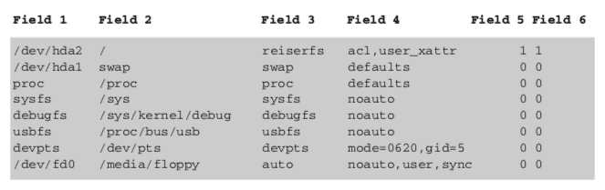
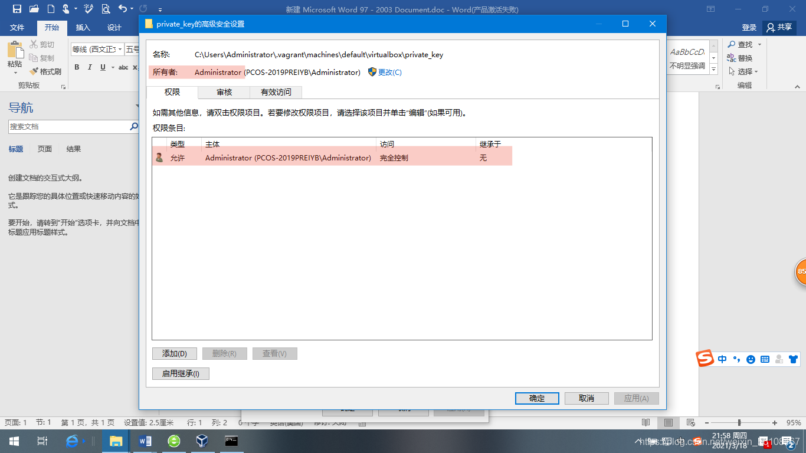

---
> **ARTS-week-23**
> 2022-06-03 22:58
---


###### ARTS-2019 左耳听风社群活动--每周完成一个 ARTS
- Algorithm： 每周至少做一个 leetcode 的算法题
- Review: 阅读并点评至少一篇英文技术文章
- Tip: 学习至少一个技术技巧
- Share: 分享一篇有观点和思考的技术文章

### 1.Algorithm:

- [473. 火柴拼正方形 (中等) ?](https://leetcode.cn/submissions/detail/320711452/)  
  + 思路: 回溯
- [450. 删除二叉搜索树中的节点 (中等) ?](https://leetcode.cn/submissions/detail/321078045/)  
  + 思路: 递归 三种情况处理
- [829. 连续整数求和 (困难) ?](https://leetcode.cn/submissions/detail/321358458/)  
  + 思路: 数学 等差数列

### 2.Review:

- [理解 Linux 中的 /etc/fstab 文件](https://www.thegeekdiary.com/understanding-the-configuration-file-for-mounting-file-systems-etc-fstab/)  

#### 点评：

文件系统及其在目录树中的挂载点在文件 /etc/fstab 中配置。此文件包含 1 行，每个挂载的文件系统有 6 个字段。这些行类似于以下内容：



- 每个字段都提供用于挂载文件系统的以下信息：
  - 字段 1.列出设备文件的名称、文件系统标签或 UUID（通用唯一标识符）。使用 LABEL=label 或 UUID=uuid 的优点是，即使使用的设备文件发生更改，分区也能正确挂载，例如，因为在 IDE 控制器上交换了硬盘。
  - 字段 2.列出挂载点 — 文件系统应挂载到的目录。此处指定的目录必须已经存在。可以通过更改为相应的目录来访问媒体上的内容。
  - 字段 3.列出文件系统类型（如 ext2、ext4）。
  - 字段 4.显示装载选项。多个装载选项以逗号分隔（例如 noauto、user、sync）。
  - 字段 5.指示是否对文件系统使用备份实用程序转储。0 表示无备份。
  - 字段 6.指示引导系统时文件系统检查的顺序（使用 fsck 实用程序）：
    - 0：不检查的文件系统
    - 1：根目录
    - 2：所有其他可修改的文件系统;并行检查不同驱动器上的文件系统

虽然 /etc/fstab 列出了文件系统以及它们在启动期间在目录树中应挂载的位置，但它不包含有关实际当前挂载的信息。/etc/mtab 文件列出了当前挂载的文件系统及其挂载点。挂载和卸载命令会影响挂载文件系统的状态，并修改 /etc/mtab 文件。
内核还保留了 /proc/mounts 的信息，其中列出了所有当前已挂载的分区。出于故障排除目的，如果 /proc/mounts 和 /etc/mtab 信息之间存在冲突，则 /proc/mounts 数据始终比 /etc/mtab 更新、更可靠。

- 查看当前挂载的文件系统
可以通过输入命令 mount 来查看当前挂载的文件系统。将显示类似于以下内容的信息：

```shell
# mount
sysfs on /sys type sysfs (rw,nosuid,nodev,noexec,relatime,seclabel)
proc on /proc type proc (rw,nosuid,nodev,noexec,relatime)
devtmpfs on /dev type devtmpfs (rw,nosuid,seclabel,size=487424k,nr_inodes=121856,mode=755)
/dev/vda1 on / type xfs (rw,relatime,seclabel,attr2,inode64,noquota)
...
```

还可以在文件 /proc/mounts 中查看此信息。

```shell
# cat /proc/mounts
```

- 挂载文件系统
驻留在 SATA/PATA 或 SCSI 设备上的文件系统需要手动挂载才能访问它。mount 命令允许 root 用户手动挂载文件系统。mount 命令的第一个参数指定要挂载的文件系统。第二个参数指定文件系统挂载后可用的目标目录。目标目录称为装入点。mount 命令以以下两种不同的方式之一获取文件系统参数：
  - 保存文件系统的分区的设备文件，驻留在 /dev 中。
  - UU/D，文件系统的通用唯一标识符。
注意：只要不重新创建文件系统，UUID 就会保持不变。设备文件可以更改;例如，如果更改了设备的顺序，或者将其他设备添加到系统中。

blkid 命令概述了现有分区及其文件系统和文件系统的 UUID，以及用于格式化分区的文件系统。

```shell
# blkid
/dev/vda1: UUID="74309cb6-4564-422f-bd07-a13e35acbb7a" TYPE="xfs" 
/dev/vdb: UUID="2018-04-26-04-03-48-00" LABEL="config-2" TYPE="iso9660"
```

要挂载保存文件系统的设备文件 pr 分区，请执行以下操作：

```shell
# mount /dev/vda1 /mount_point
```

通过文件系统的通用唯一 ID 或 UUID 挂载文件系统。

```shell
# mount UUID="46f543fd-7Bc9-4526-a857·244811be2dBB" /mount_point
```

注意：如果充当挂载点的目录不为空，则只要将文件系统挂载到该目录中，就无法访问该目录中存在的文件。写入挂载点目录的所有文件最终都位于挂载到该目录的文件系统上。

- 卸载文件系统
要卸载文件系统，umount 命令需要将挂载点作为参数。切换到 /mount_point 目录。尝试卸载挂载在 /mnount_point 装入点上的设备。它将失败。

```shell
# umount /mount_point
umount: /mount_point: target is busy.
        (In some cases useful info about processes that use
         the device is found by lsof(8) or fuser(1))
```

如果进程访问装入点，则无法卸载。要使 umount 成功，该过程需要停止访问挂载点。可以使用 lsof 或 fuser 命令来识别在特定装入点上运行的进程。确认装入点上没有进程正在运行后，可以卸载装入点，而不会出现任何错误。

```shell
# umount /mount_point
```

### 3.Tip:

#### Vagrant 使用中发生的 vagrant@127.0.0.1: Permission denied (publickey,gssapi-keyex,gssapi-with-mic). 错误
Vagrant 使用中发生的 vagrant@127.0.0.1: Permission denied (publickey,gssapi-keyex,gssapi-with-mic). 错误

发生环境：
Windows10
Vagrant 2.2.6 + VirtualBox 6.0.14

安装了 Vagrant 之后，准备通过 Vagrant up 启动虚拟机的时候报 agrant@127.0.0.1: Permission denied，具体错误信息如下：
D:\VirtualBox\docker\first-docker-centos7>vagrant ssh
vagrant@127.0.0.1: Permission denied (publickey,gssapi-keyex,gssapi-with-mic).

解决办法：
找到初始化目录下的 private_key 文件



删除其他没用的权限，可以直接禁用继承达到效果
权限修改成下面这样了之后点击 应用 -> 确定 就完成了
重新输入 vagrant ssh ，成功进入虚拟机控制台

#### Win10 docker 登录报错Error: Cannot perform an interactive login from a non TTY device

Windows10系统命令窗口中，docker登录报错：
$ docker login --username=yonghuming registry.cn-hangzhou.aliyuncs.com
```shell
Error: Cannot perform an interactive login from a non TTY device
```

分析：
登陆阿里云私库的时候报以上错误

解决：
使用winpty为docker命令添加前缀 如：

```shell
$ winpty docker login --username=yonghuming registry.cn-hangzhou.aliyuncs.com
```

然后根据提示输入密码即可

### 4.Share:

- [Spring Boot:jar中没有主清单属性](https://blog.csdn.net/u010429286/article/details/79085212)  

- [Android Gradle Plugin、Gradle、 Build Tools、JDK版本对应关系](https://blog.csdn.net/libie_lt/article/details/122127407)  

- [vagrant创建k8s集群](https://blog.csdn.net/weixin_44371237/article/details/123974335)  

- [通过 Vagrant 一键初始化 K8S 集群](jianshu.com/p/5a5b597538e1)  
