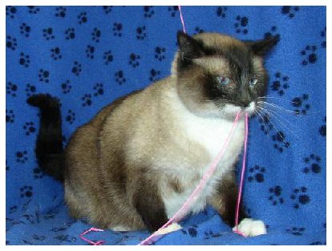
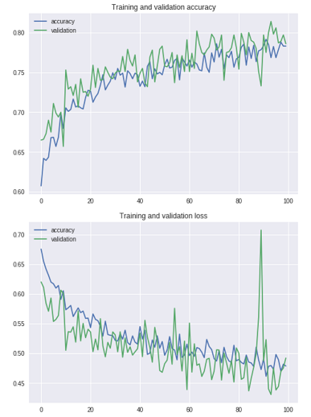
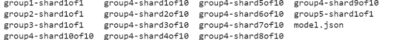

---
> **ARTS-week-24**
> 2022-06-11 22:10
---


###### ARTS-2019 左耳听风社群活动--每周完成一个 ARTS
- Algorithm： 每周至少做一个 leetcode 的算法题
- Review: 阅读并点评至少一篇英文技术文章
- Tip: 学习至少一个技术技巧
- Share: 分享一篇有观点和思考的技术文章

### 1.Algorithm:

- [875. 爱吃香蕉的珂珂 (中等) +](https://leetcode.cn/submissions/detail/322776128/)  
  + 思路: 二分
- [497. 非重叠矩形中的随机点 (中等) ?](https://leetcode.cn/submissions/detail/323600369/)  
  + 思路：前缀和+二分
- [926. 将字符串翻转到单调递增 (中等) ?](https://leetcode.cn/submissions/detail/324196046/)  
  + 思路: 遍历字符串，找到一个分界点，使得该分界点之前1的个数和分界点之后0的个数之和最小，把分界点之前的1变成0，之后的0变成1


### 2.Review:

- [猫狗分类器：如何利用免费的计算资源训练一个简单的 CNN，并将其部署在浏览器上](https://medium.com/@xuechaoying1/train-a-simple-cnn-using-free-computing-resources-then-deploy-it-in-the-browser-to-classify-cats-35ede559f5dc)  

#### 点评：

我们将学习使用 Tensorflow 创建一个简单的卷积神经网络以用于二进制分类，使用 Google Colab 及免费资源训练模型，使用 Tensorflow.js 在浏览器中部署经过训练的模型。在这里可以找到一个简单的演示程序（暂不适用于移动设备）和 Javascript/scr.js 演示代码。找到用于模型训练的代码，并将其保存在 Colab 上。一个简单的演示程序请注意，本教程中用于分类任务的大多数代码均来自于 Google 机器学习课程，可以通过这些课程了解关于图像分类的更多详情。如果对此领域尚不熟悉，请在这里阅读更多关于 CNN 和 Colab 的内容 （关于 Colab 用法的详细教程可以在这里找到)。

- 在 Google Colab 上利用 Tensorflow 训练 CNN：
这个模型将在 Kaggle Dogs vs. Cats 数据集的过滤版本上进行训练。经过过滤的数据集包含了2000张带有标签的猫狗彩色图像：1000张用于训练的猫图像示例、1000张用于训练的狗图像示例、500张用于验证的猫图像示例和500张用于验证的狗图像示例。打开 Colab notebook，在代码单元中输入以下内容，即可下载过滤后数据集的 zip 文件：

```shell
!wget --no-check-certificate https://storage.googleapis.com/mledudatasets/cats_and_dogs_filtered.zip -O /tmp/cats_and_dogs_filtered.zip
```

解压文件并获取训练和验证数据集的地址：

```python
import os
import zipfile

# extract all files from the downloaded zip file
# the resulting root folder is named 'tmp' and it contains
# a folder named 'cats_and_dogs_filtered', which
# contains two separate folders: 'train' and 'validation'
local_zip = '/tmp/cats_and_dogs_filtered.zip'
zip_ref = zipfile.ZipFile(local_zip, 'r')
zip_ref.extractall('/tmp')
zip_ref.close()

# construct addresses for two datasets
base_dir = '/tmp/cats_and_dogs_filtered'
train_dir = os.path.join(base_dir, 'train')
validation_dir = os.path.join(base_dir, 'validation')

# construct addresses for two classes of examples
train_cats_dir = os.path.join(train_dir, 'cats')
train_dogs_dir = os.path.join(train_dir, 'dogs')
val_cats_dir = os.path.join(validation_dir, 'cats')
val_dogs_dir = os.path.join(validation_dir, 'dogs')
```



来自猫分类中的一个示例。

在任何学习系统中，数据预处理都是重要的组成部分，尤其是当数据集很小的时候，这在本案例中能够得以验证。使用数据增强技术对训练集中的图像进行预处理，包括重新缩放、旋转、移动、缩放、翻转和剪切：

```python
# The ImageDataGnerator class generates batches of tensor image data 
# and their labelswith real-time data augmentation
from keras.preprocessing.image import ImageDataGenerator

# apply data augmentation of the training set
train_datagen= ImageDataGenerator(
    # normalize pixel values to be between [0,1]
    # note that the images uses the byte image pixel format, 
    # which stores a vector of three numbers (i.e. RGB) as an 8-bit integer,
    # giving a range of possible values from 0 to 255 (b/c 2^8).
    # read more about pixel values here: 
    # https://homepages.inf.ed.ac.uk/rbf/HIPR2/value.htm
    rescale=1./255, 
    # Read about the following arguments: 
    # https://keras.io/preprocessing/image/
    rotation_range= 40,
    width_shift_range= 0.2,
    height_shift_range= 0.2,
    shear_range= 0.2, 
    zoom_range = 0.2, 
    horizontal_flip= True)

# do not augmentent the validation set, 
# just normalize the pixel value
val_datagen= ImageDataGenerator(rescale=1./255)

# flow_from directory() takes the path to a directory 
# and generates batches of augmented data
train_generator = train_datagen.flow_from_directory(
    train_dir, 
    # resize all images to 150x150, will give reasons later 
    target_size = (150, 150),
    # 20 examples will be used in each iteration, or, 
    # one gradient update of model training
    batch_size = 20,
    # binary labels for binary cross entropy loss
    class_mode='binary') 

val_generator = val_datagen.flow_from_directory(
    validation_dir, 
    target_size = (150, 150),
    batch_size = 20,
    class_mode = 'binary') 
```


- 使用 Keras 构建一个简单的模型。
模型的输入层将接受宽度和高度均为150、拥有3个颜色通道的图像的原始像素；这就是为什么我们要将数据集中的所有图像重新改成150\*150的尺寸。输入层之后，模型包含三个卷积层，ReLU激活层和三个最大池化层。这些隐藏层的结构细节将可以在代码片段的注释下方找到。然后，模型使用一个压平层将产生的特征绘制到1D张量中，以此满足拥有512个隐藏单位的全连接层的现有计算需求。接着，采用比率为0.5的丢弃正则化方法以进一步防止过度拟合。最后，模型的输出层使用一个 Sigmoid 函数作为激活函数；它会将输出结果压缩为0到1之间的类分数。这正好符合我们的任务要求，因为数据集将猫类标为0，而将狗类标为1。

```python
from tensorflow.keras import layers
from tensorflow.keras import Model
from tensorflow.keras.optimizers import RMSprop

# the input images are required to have width and height of 150
# and 3 channels, one for each color
# this is the reason why all images were reshaped above
input_layer = layers.Input(shape=(150, 150, 3))

# note that all layers from now on is a function of the previous layer

# the first convolutional layer has 16 3x3 filters
# output volume = (W-F+2P)/S+1 = (150-3+2(0))/1+1 = 148 --> (148, 148, 16), where 
# W:=input size, F:=filter size, S:=stride (moving filter 1 pixel at a time), P:=padding
# num of parameter s = inputxFxFxoutput = 3x3x3x16 + 3 = 432+ 16 = 448
x = layers.Conv2D(16, 3, activation='relu')(input_layer) # relu := max(0, x)
# max pooling layer with 2x2 window
# output volume = (W-F)/2+1 = (148-2)/2+1 = 74 --> (74, 74, 16)
x = layers.MaxPooling2D(2)(x)
# The second convolutional layer has 32 3x3 filters
# output volume = (W-F+2P)/S+1 = (74-3+2(0))/1+1 = 148 --> (72, 72, 32)
# num of parameters = inputxFxFxoutput = 16x3x3x32 + 32 = 4640
x = layers.Conv2D(32, 3, activation='relu')(x)
# max pooling layer with 2x2 window
# output volume = (W-F)/2+1 = (72-2)/2+1 = 36 --> (36, 36, 32)
x = layers.MaxPooling2D(2)(x)
# The third convolutional layer has 64 3x3 filters 
# output volume = (W-F+2P)/S+1 = (36-3+2(0))/1+1 = 34 --> (34, 34, 64)
# num of parameters = inputxFxFxoutput = 32x3x3x64 + 64 = 18496
x = layers.Conv2D(64, 3, activation='relu')(x)
# max pooling layer with 2x2 window
# output volume = (W-F)/2+1 = (34-2)/2+1 = 17 --> (17, 17, 64)
x = layers.MaxPooling2D(2)(x)
# the shape is really (None, 17, 17, 64)

# flatten feature map to a 1D tensor 
# output shape = (None, 17x17x64) = (None, 18496)
x = layers.Flatten()(x)
# fully connected layer with relu activation and 512 hidden units
# output shape = (None, 512)
# num of parameters = 18496 * 512 + 512= 9470464
x = layers.Dense(512, activation='relu')(x)

# dropout regularization with dropout rate of 0.5
# output shape = (None, 512)
x = layers.Dropout(0.5)(x)
# output layer with a signal node and a sigmoid activation, 
# since we have a binary classification problem
# output shape = (None, 1)
# num of parameters = 1x512 + 1 = 513
output = layers.Dense(1, activation='sigmoid')(x) # [0,1]

# the model is defined by input and output tensor(s)
model = Model(input_layer, output)

# print out summary of the model to confirm our calculations above
print(model.summary())
...
```

定义模型结构和训练过程
模型定义之后，我们还需定义训练配置并绘制出学习曲线。损失函数为二元交叉熵，优化器为RMSprop。模型把100个epoch的数据生成batch进行批量训练（我们定义每个批包含20个示例），每个epoch包含100个批示例（因为2000 /20 = 100）。该模型还将把50个epoch的数据生成batch进行批量验证（同样是每个批包含20个示例），每个epoch包含50个示例（因为1000 /20 = 50）。

```python
# define the model training configuration
model.compile(loss='binary_crossentropy', optimizer=RMSprop(lr=0.001), metrics=['acc'])

# train model and save the process
history = model.fit_generator(train_generator,
                             steps_per_epoch=100,
                             epochs=100,
                             validation_data=val_generator,
                             validation_steps=50,
                             verbose=2)

# visualize the training process
# all data are pulled from 'history'
acc = history.history['acc']
val_acc = history.history['val_acc']

loss = history.history['loss']
val_loss = history.history['val_loss']

epochs = range(len(acc))

plt.plot(epochs, acc, label='accuracy')
plt.plot(epochs, val_acc, label='validation')
plt.title('Training and validation accuracy')
plt.legend()
plt.figure()

plt.plot(epochs, loss, label='accuracy')
plt.plot(epochs, val_loss, label='validation')
plt.title('Training and validation loss')
plt.legend()
```

训练模型并绘制学习曲线


关于学习曲线
正如你所看到的，我们构建的分类模型虽然是有效的，但仍不是一个最优的模型——准确率只有80%左右，损失仍然很高。将模型部署在浏览器工作之后，最好测试一下自己的模型结构，或者调优当前模型的超参数，以达到更高的准确度。还可以尝试使用完整的Kaggle数据集或Inception-V3等预先训练过的分类模型来训练的模型。训练更优模型以满足任务需求的细节可以在Google图像分类实践课中找到，链接如下。 



将训练好的模型结构及权重保存在 Google Drive 上

```shell
# from https://medium.com/deep-learning-turkey/google-colab-free-gpu-tutorial-e113627b9f5d

# install necessary libraires and perform authorization
!apt-get install -y -qq software-properties-common Python-software-properties module-init-tools
!add-apt-repository -y ppa:alessandro-strada/ppa 2>&1 > /dev/null
!apt-get update -qq 2>&1 > /dev/null
!apt-get -y install -qq google-drive-ocamlfuse fuse
from google.colab import auth
auth.authenticate_user()
from oauth2client.client import GoogleCredentials
creds = GoogleCredentials.get_application_default()
import getpass
!google-drive-ocamlfuse -headless -id={creds.client_id} -secret={creds.client_secret} < /dev/null 2>&1 | grep URL
vcode = getpass.getpass()
!echo {vcode} | google-drive-ocamlfuse -headless -id={creds.client_id} -secret={creds.client_secret}

# mount your Google Drive
!mkdir -p ggdrive
!google-drive-ocamlfuse ggdrive
```

建立与Google Drive的连接：
保存模型结构和权重，并将文件移动至Google Drive上：

```shell
# save the model
model.save('cats_dogs.h5')

# install tensorflow.js
!pip install tensorflowjs

# create weight files and a json file containing structure of the model
!mkdir model
!tensorflowjs_converter --input_format keras cats_dogs.h5 model/

# zip the model up
!zip -r model.zip model

# move file
!mv model.zip ggdrive
```

第2行的方法将 Keras 模型保存到一个HDF5文件中，该文件包含模型的架构、权重、训练配置和优化器的状态；点击这里查看更多细节。生成的“模型”文件夹应该包含与下面类似的文件：



利用 TensorFlow.js 在浏览器上重建预先训练好的模型
确保有类似于 github.io 这样的地方来托管的项目。然后，在 HTML 文件中输入以下内容，以支持使用 Tensorflow.js：

```shell
<script src="https://cdn.jsdelivr.net/npm/@tensorflow/tfjs@latest"></script>
```

从Google Drive中下载文件至的项目文件夹，然后从文件中上传保存好的模型：

```python
model = await tf.loadModel('cat_dog_model/model.json');
```

创建两个元素，一个用于显示要分类的图像，另一个显示分类结果：

```javascript

<p>Your image contains a <label id="catOrDogLabel">____</label>.</p>
```

使用我们加载的模型对输入图像进行分类，并在HTML标签上显示结果：

```python
// step 1: grab the raw input image pixel; 
// unfortunatly we cannot get pixel data directly from  the html img element

// get the html element that contains the input image 
var img = document.getElementById('inputImage');
// create an html canvas element
// the canvas element is a container for grahpics that allows Javascript to draw graphics on the fly 
var canvas = document.createElement('canvas');
// https://developer.mozilla.org/en-US/docs/Web/API/HTMLCanvasElement/getContext
// context is a CanvasRenderingContext2D object (which represents a 2D rendering context) 
var context = canvas.getContext('2d');
// set the width and the height of the canvas to be 
// the same as inputImage
canvas.width = img.width;
canvas.height = img.height;
// position the imae on the canvas
context.drawImage(img, 0, 0);
/* https://developer.mozilla.org/en-US/docs/Web/API/CanvasRenderingContext2D/getImageData
 CanvasRenderingContext2D.getImageData(sx, sy. sw, sh) returns an ImageData that 
 represents the underlying pixel data for the area of the canvas starting at (sx, sy)
 and has width of sw and height of sh */
var imgData = context.getImageData(0, 0, img.width, img.height);

// step 2: turn raw pixels into tensors, so our model could work with the data 
// use tidy() to dispose any possible  unsued variables
preprocessed_imgData = tf.tidy(()=>{
 // convert the image data into a tensor
 // tensor.shape = (width, height, 3)
 let tensor = tf.fromPixels(imgData, numChannels=3);
 // resize the tensor into (150, 150, 3)
 // because the input layer of our models requires it 
 var resized = tf.image.resizeBilinear(tensor, [150, 150]).toFloat();
 // now the tensor has shape (150, 150, 3)
 // reshape it to (1, 150, 150, 3) because the input layer takes 4 dimensions (i.e. batch size=1)
 const input_tensor = resized.reshape([1,150,150,3]);
 // normalize the pixel values to be in the range of [0, 1]
 const offset = tf.scalar(255.0);
 const normalized = tf.scalar(1.0).sub(input_tensor.div(offset));
 // return the normalized image
 return normalized;})

// step 3: make perdiction 
// https://www.bisque.com/products/orchestrate/RASCOMHelp/RASCOM/Synchronous_vs_Asynchronous_Execution.htm
// dataSync() synchronously downloads the values from the tf.Tensor
// this could be why the demo has performance issue on mobil devices
pred = model.predict(preprocessed_imgData).dataSync();

// step 4: display the perdiction for users 
var catOrDog = pred <= 0.5 ? 'cat' : 'dog';
document.getElementById('catOrDogLabel').innerHTML = catOrDog;
```

这里将决策阈值设置为0.5，也可以将它重置为任何合理的值。


### 3.Tip:

#### AndroidStudio 修改项目名称

```shell
1. 关闭Android Studio 
2. 修改project所在路径的文件夹名字为[NewName]
3. 打开Android Stuido，import新的[NewName]路径工程(很重要,重新import工程，Android Studio会自动修改部分相关的project名字引用)
4. 修改根目录下的.iml文件名为[NewName].iml，及该文件中的external.linked.project.id=[NewName]
5. 修改根目录下的settings.gradle里面的
rootProject.name=[NewName]
6. 修改.idea/modules.xml里面的
<module fileurl="file://$PROJECT_DIR$/[NewName].iml" filepath="$PROJECT_DIR$/[NewName].iml" />

```

#### AndroidStudio 修改 Module 名称

```shell
1、右键 Module->Refactor->Rename
2、弹出界面选择 Rename module，点OK
3、在下一个界面输入想要的 module 名字即可。
4、注意这样只是修改的 module 名字，module 所在文件夹名字没变，想要一起改的话重复1-3点操作，不过第2步选择 Rename directory即可。
```

#### java：-source1.5中不支持 diamond 运算符


### 4.Share:

- [Gradle 创建 Java 组件](https://docs.gradle.org/current/userguide/java_library_plugin.html)  

- [java：-source1.5中不支持 diamond 运算符解决](https://cxymm.net/article/Mr____Cheng/115254559)  

- [unable to access android sdk add-on list 解决方案](https://blog.csdn.net/qq_35892584/article/details/109746886)  

- [关于 maven 仓库的配置文件密码加密机制及配置](https://blog.csdn.net/jackyzhousales/article/details/87976028)  
