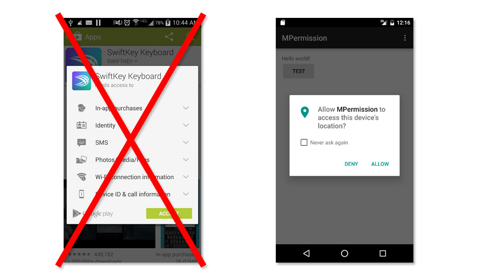
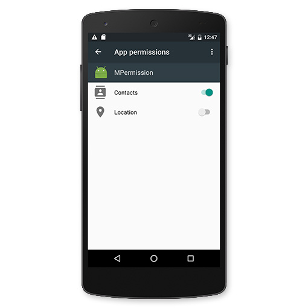
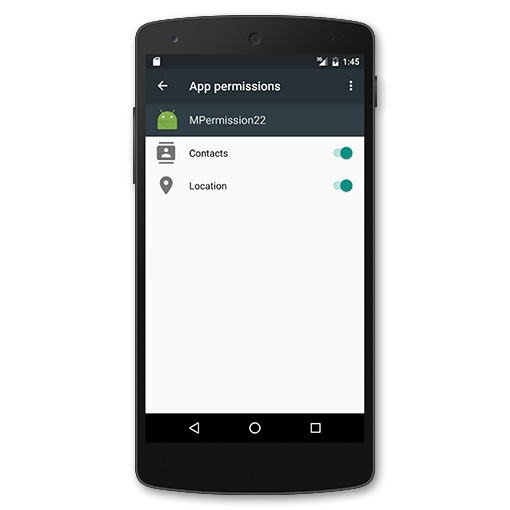
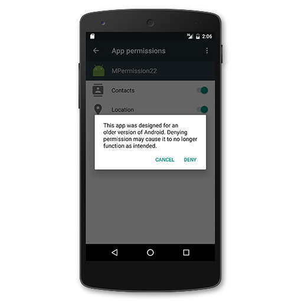
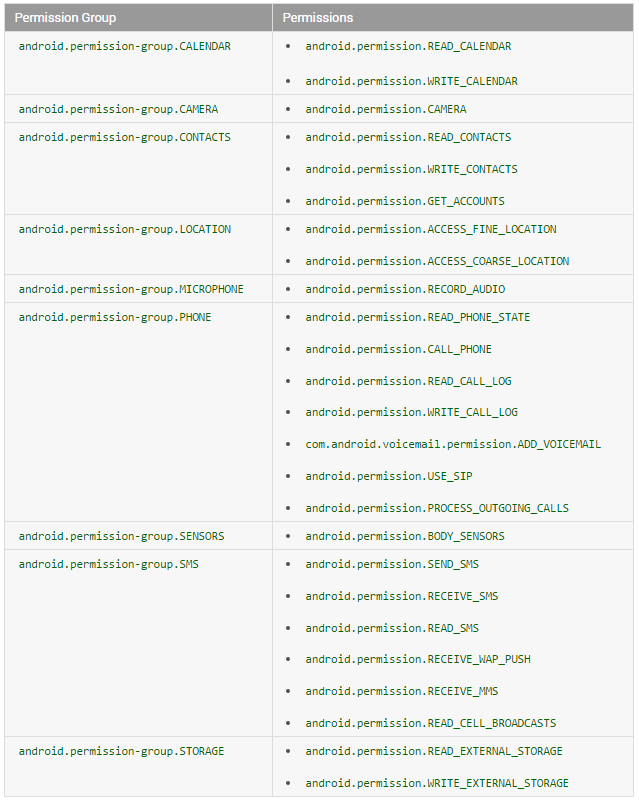

---
> **ARTS-week-25**
> 2022-06-19 08:24
---


###### ARTS-2019 左耳听风社群活动--每周完成一个 ARTS
- Algorithm: 每周至少做一个 leetcode 的算法题
- Review: 阅读并点评至少一篇英文技术文章
- Tip: 学习至少一个技术技巧
- Share: 分享一篇有观点和思考的技术文章

### 1.Algorithm:

- [508. 出现次数最多的子树元素和 (中等) ?](https://leetcode.cn/submissions/detail/326752258/)  
  + 思路:二叉树的递归分为「遍历」和「分解问题」两种思维模式，这道题需要用到「分解问题」的思维，同时要利用后序位置来计算答案。
- [剑指 Offer II 029. 排序的循环链表 (中等) ?](https://leetcode.cn/submissions/detail/326708018/)  
  + 思路：先找真正的头节点（最小值），再找插入位置，再插入元素
- [532. 数组中的 k-diff 数对 (中等) ?](https://leetcode.cn/submissions/detail/324196046/)  
  + 思路: 哈希-相当于求两数和


### 2.Review:

- [每个 Android 开发人员都必须了解的有关新 Android 运行时权限的所有信息](https://inthecheesefactory.com/blog/things-you-need-to-know-about-android-m-permission-developer-edition/en)  

#### 点评：

虽然 Android 正在继续开发，但 Android M 的最新更新完全不同，因为有一些重大变化会改变一切，比如新的运行时权限。令人惊讶的是，它在 Android 开发人员社区中并不怎么被谈论，尽管它非常重要，并且可能会在不久的将来引起一些大麻烦。

这就是我今天决定写博客讨论这个话题的原因。需要了解的有关此新运行时权限的所有信息，包括如何在代码中实现它。让我们在为时已晚之前这样做。

- 新建运行时权限
Android 的权限系统一直是最大的安全问题之一，因为这些权限是在安装时要求的。安装后，应用程序将能够访问授予的所有内容，而无需任何用户确认应用程序对权限的确切操作。

毫不奇怪，为什么有这么多坏人试图通过这个安全漏洞收集用户的个人数据并以不良方式使用它。

安卓团队也知道这种担忧。7年过去了，终于重新设计了许可系统。**在 Android 6.0 Marshmallow 中，应用程序在安装时不会被授予任何权限。相反，应用程序必须在运行时逐个请求用户权限。**




请注意，上面显示的权限请求对话框不会自动启动。开发人员必须手动调用它。如果开发人员尝试调用某个需要用户尚未授予的权限的函数，则该函数将突然引发异常，这将导致应用程序崩溃。


此外，用户还可以通过手机的“设置”应用程序随时撤销授予的权限。



可能已经感觉到有一些冷风吹过的手臂......如果是一个 Android 开发者，会突然知道编程逻辑完全改变了。不能像以前那样只是调用一个函数来完成工作，但必须检查每个功能的权限，否则的应用程序只会崩溃！

虽然这对用户来说是一件好事，但对于我们开发人员来说，这确实是一场噩梦。我们必须将编码提升到一个新的水平，否则它肯定会在短期和长期内出现问题。

无论如何，只有当我们将应用程序的 targetSdkVersion 设置为 23 时，这个新的运行时权限才会像描述的那样工作，这意味着它声明应用程序已经在 API 级别 23 上进行了测试。此功能仅适用于 Android 6.0 Marshmallow。同一应用将在 Marshmallow 之前的设备上以相同的旧行为运行。

- 已启动的应用程序发生了什么变化？
这个新的权限系统现在可能会让有些恐慌。**“关于我3年前推出的应用程序。如果它安装在 Android 6.0 设备上，此行为是否也适用？我的应用程序也会崩溃吗?!?”**

不用担心。Android 团队已经考虑过了。**如果应用程序的目标SdkVersion 设置为小于 23。假设应用程序尚未使用新的权限系统进行测试，并且将切换到相同的旧行为：用户必须在安装时接受每个权限，并且一旦安装，它们将全部被授予！**

不用担心。Android 团队已经考虑过了。如果应用程序的目标 SdkVersion 设置为小于 23。假设应用程序尚未使用新的权限系统进行测试，并且将切换到相同的旧行为：用户必须在安装时接受每个权限，并且一旦安装，它们将全部被授予！


因此，应用程序将像以前一样完美运行。无论如何，请注意，在此之后，用户仍然可以撤销权限！尽管Android 6.0在用户尝试这样做时会警告用户，但他们无论如何都可以撤销。



下一个问题现在在的脑海中。那么我的应用程序会崩溃吗？

上帝通过 Android 团队发送的这种善意。当我们调用一个函数时，该函数要求用户在 targetSdkVersion 小于 23 的应用程序上撤消权限，则不会引发任何异常。相反，它只会什么都不做。对于返回值的函数，它将根据情况返回 null 或 0。



但不要太开心。尽管应用程序不会因调用函数而崩溃。它可能仍然会从该应用程序接下来使用这些返回值执行的操作中崩溃。

好消息（至少目前是这样）这些情况可能很少发生，因为这种权限撤销功能非常新，我相信只有少数用户会这样做。如果他们这样做，他们必须接受结果。

但从长远来看，我相信会有数百万用户关闭一些权限。让我们的应用程序不能在新设备上完美运行是不可接受的。

为了使它完美地工作，最好修改的应用程序以支持这个新的权限系统，我建议立即开始这样做！

对于源代码未成功修改以支持运行时权限的应用程序，请勿使用 targetSdkVersion 23 发布它，否则会给带来麻烦。仅当通过所有测试时，才将 targetSdkVersion 移动到 23。

警告：现在，当在 Android Studio 中创建新项目时。targetSdkVersion 将自动设置为最新版本 23。如果还没有准备好使应用程序完全支持运行时权限，我建议先将 targetSdkVersion 降级到 22。

- 自动授予的权限
有一些权限将在安装时自动授予，并且无法撤销。我们称之为普通权限（PROTECTION_NORMAL）。以下是它们的完整列表：

```
android.permission.ACCESS_LOCATION_EXTRA_COMMANDS android.permission.ACCESS_NETWORK_STATE
android.permission.ACCESS_NOTIFICATION_POLICY
android.permission.ACCESS_WIFI_STATE
android.permission.ACCESS_WIMAX_STATE
android.permission.bluetooth
android.permission.BLUETOOTH_ADMIN

android.permission.BROADCAST_STICKY android.permission.CHANGE_NETWORK_STATE
android.permission.CHANGE_WIFI_MULTICAST_STATE
android.permission.CHANGE_WIFI_STATE
android.permission.CHANGE_WIMAX_STATE android.permission.DISABLE_KEYGUARD
android.permission.EXPAND_STATUS_BAR

android.permission.FLASHLIGHT
android.permission.GET_ACCOUNTS
android.permission.GET_PACKAGE_SIZE
android.permission.INTERNET
android.permission.KILL_BACKGROUND_PROCESSES
android.permission.MODIFY_AUDIO_SETTINGS
android.permission.NFC
android.permission.READ_SYNC_
android.permission.READ_SYNC_STATS android.permission.SET_WALLPAPER
android.permission.SET_WALLPAPER_HINTS
android.permission.REQUEST_INSTALL_PACKAGES
android.permission.RECEIVE_BOOT_COMPLETED
android.permission.SET_TIME_ZONE android.permission.REORDER_TASKS
设置


android.permission.SUBSCRIBED_FEEDS_READ android.permission.TRANSMIT_IR
android.permission.USE_FINGERPRINT
android.permission.vibrate
android.permission.WAKE_LOCK
android.permission.WRITE_SYNC_SETTINGS
com.android.alarm.permission.SET_ALARM

com.android.launcher.permission.INSTALL_SHORTCUT com.android.launcher.permission.UNINSTALL_SHORTCUT
```

只需简单地声明这些权限，它就会正常工作。无需检查上面列出的权限，因为它无法撤销。AndroidManifest.xml

- 使应用程序支持新的运行时权限
现在是时候让我们的应用程序完美地支持新的运行时权限了。从设置开始，到 23。compileSdkVersiontargetSdkVersion
```
android {
  compileSdkVersion 23
  ...

  defaultConfig {
      ...
      targetSdkVersion 23
      ...
  }
```

在此示例中，我们尝试使用下面的函数添加联系人。

```
private static final String TAG = "Contacts";
private void insertDummyContact() {
    // Two operations are needed to insert a new contact.
    ArrayList<ContentProviderOperation> operations = new ArrayList<ContentProviderOperation>(2);

    // First, set up a new raw contact.
    ContentProviderOperation.Builder op =
            ContentProviderOperation.newInsert(ContactsContract.RawContacts.CONTENT_URI)
                    .withValue(ContactsContract.RawContacts.ACCOUNT_TYPE, null)
                    .withValue(ContactsContract.RawContacts.ACCOUNT_NAME, null);
    operations.add(op.build());

    // Next, set the name for the contact.
    op = ContentProviderOperation.newInsert(ContactsContract.Data.CONTENT_URI)
            .withValueBackReference(ContactsContract.Data.RAW_CONTACT_ID, 0)
            .withValue(ContactsContract.Data.MIMETYPE,
                    ContactsContract.CommonDataKinds.StructuredName.CONTENT_ITEM_TYPE)
            .withValue(ContactsContract.CommonDataKinds.StructuredName.DISPLAY_NAME,
                    "__DUMMY CONTACT from runtime permissions sample");
    operations.add(op.build());

    // Apply the operations.
    ContentResolver resolver = getContentResolver();
    try {
        resolver.applyBatch(ContactsContract.AUTHORITY, operations);
    } catch (RemoteException e) {
        Log.d(TAG, "Could not add a new contact: " + e.getMessage());
    } catch (OperationApplicationException e) {
        Log.d(TAG, "Could not add a new contact: " + e.getMessage());
    }
}
```

上述代码需要权限。如果在未授予此权限的情况下调用它，应用程序将突然崩溃。WRITE_CONTACTS

下一步是使用相同的旧方法将权限添加到 中。AndroidManifest.xml

```
<uses-permission android:name="android.permission.WRITE_CONTACTS"/>
```

下一步是我们必须创建另一个函数来检查是否授予了权限。如果不是，则调用对话框以请求用户权限。否则，可以继续下一步，创建新联系人。

权限分组到权限组中，如下表所示。


如果授予了权限组中的任何权限。同一组中的另一个权限也将自动授予。在这种情况下，一旦获得批准，申请也将授予和。WRITE_CONTACTSREAD_CONTACTSGET_ACCOUNTS

用于检查和请求权限的源代码分别是活动的和。这些方法在 API 级别 23 中添加。checkSelfPermissionrequestPermissions
```java
final private int REQUEST_CODE_ASK_PERMISSIONS = 123;

private void insertDummyContactWrapper() {
    int hasWriteContactsPermission = checkSelfPermission(Manifest.permission.WRITE_CONTACTS);
    if (hasWriteContactsPermission != PackageManager.PERMISSION_GRANTED) {
        requestPermissions(new String[] {Manifest.permission.WRITE_CONTACTS},
                REQUEST_CODE_ASK_PERMISSIONS);
        return;
    }
    insertDummyContact();
}
```

如果已经授予权限，将突然被调用。否则，将调用以启动如下所示的权限请求对话框。insertDummyContact()requestPermissions



无论选择“允许”还是“拒绝”，都将始终调用 Activity 来通知一个结果，我们可以从第 3 个参数中检查该结果，如下所示：onRequestPermissionsResultgrantResults
```java
@Override
public void onRequestPermissionsResult(int requestCode, String[] permissions, int[] grantResults) {
    switch (requestCode) {
        case REQUEST_CODE_ASK_PERMISSIONS:
            if (grantResults[0] == PackageManager.PERMISSION_GRANTED) {
                // Permission Granted
                insertDummyContact();
            } else {
                // Permission Denied
                Toast.makeText(MainActivity.this, "WRITE_CONTACTS Denied", Toast.LENGTH_SHORT)
                        .show();
            }
            break;
        default:
            super.onRequestPermissionsResult(requestCode, permissions, grantResults);
    }
}
```

这就是运行时权限的工作原理。代码相当复杂，但要习惯它...为了使的应用程序与运行时权限完美运行，必须使用上面显示的相同方法处理所有情况。

如果想打一些墙，现在是一个好时机...


- 处理“再也不问”


### 3.Tip:

#### int[] 数组与 List 互相转换

```java
int[] data = {4, 5, 3, 6, 2, 5, 1};
        
// int[] 转 List<Integer>
List<Integer> list1 = Arrays.stream(data).boxed().collect(Collectors.toList());
// Arrays.stream(arr) 可以替换成IntStream.of(arr)。
// 1.使用Arrays.stream将int[]转换成IntStream。
// 2.使用IntStream中的boxed()装箱。将IntStream转换成Stream<Integer>。
// 3.使用Stream的collect()，将Stream<T>转换成List<T>，因此正是List<Integer>。

// int[] 转 Integer[]
Integer[] integers1 = Arrays.stream(data).boxed().toArray(Integer[]::new);
// 前两步同上，此时是Stream<Integer>。
// 然后使用Stream的toArray，传入IntFunction<A[]> generator。
// 这样就可以返回Integer数组。
// 不然默认是Object[]。

// List<Integer> 转 Integer[]
Integer[] integers2 = list1.toArray(new Integer[0]);
//  调用toArray。传入参数T[] a。这种用法是目前推荐的。
// List<String>转String[]也同理。

// List<Integer> 转 int[]
int[] arr1 = list1.stream().mapToInt(Integer::valueOf).toArray();
// 想要转换成int[]类型，就得先转成IntStream。
// 这里就通过mapToInt()把Stream<Integer>调用Integer::valueOf来转成IntStream
// 而IntStream中默认toArray()转成int[]。

// Integer[] 转 int[]
int[] arr2 = Arrays.stream(integers1).mapToInt(Integer::valueOf).toArray();
// 思路同上。先将Integer[]转成Stream<Integer>，再转成IntStream。

// Integer[] 转 List<Integer>
List<Integer> list2 = Arrays.asList(integers1);
// 最简单的方式。String[]转List<String>也同理。

// 同理
String[] strings1 = {"a", "b", "c"};
// String[] 转 List<String>
List<String> list3 = Arrays.asList(strings1);
// List<String> 转 String[]
String[] strings2 = list3.toArray(new String[0]);
```

#### Android Studio 使用 Gsonformat 插件

```shell
方法一：
1.Android studio File -> Settings.. -> Plugins –> Browse repositores..搜索 GsonFormat
2.安装插件,重启android studio
方法二：
1.下载 GsonFormat.jar ;
2.Android studio File -> Settings.. -> Plugins –> install plugin from disk..导入下载 GsonFormat.jar
3.重启 android studio
```

#### java：-source1.5中不支持 diamond 运算符


### 4.Share:

- [IDEA常用快捷键大全（建议收藏）！](https://zhuanlan.zhihu.com/p/410613271)  

- [Android 图片轮播控件](https://github.com/youth5201314/banner/)  

- [在Android 6.0 设备上动态获取权限](http://ocnyang.com/2016/08/16/Android6Permission/)  

- [Android Studio 中GBK中文乱码和因此无法运行程序的一些经验](https://blog.csdn.net/w7619370/article/details/51613951)  

- [SpringBoot - 配置文件加载位置与优先级](https://blog.csdn.net/J080624/article/details/80508606)

- [如何在Java中复制/克隆数组](https://blog.csdn.net/allway2/article/details/113741112)

