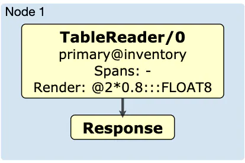

---
> **ARTS-week-28**
> 2022-07-10 09:30
---


###### ARTS-2019 左耳听风社群活动--每周完成一个 ARTS
- Algorithm： 每周至少做一个 leetcode 的算法题
- Review: 阅读并点评至少一篇英文技术文章
- Tip: 学习至少一个技术技巧
- Share: 分享一篇有观点和思考的技术文章

### 1.Algorithm:

- [729. 我的日程安排表 I (中等) ?](https://leetcode.cn/submissions/detail/333101241/)  
  + 思路：TreeSet
- [648. 单词替换 (中等) +](https://leetcode.cn/submissions/detail/334004410/)  
  + 思路：枚举每个词根和单词进行匹配
- [873. 最长的斐波那契子序列的长度 (中等) ?](https://leetcode.cn/submissions/detail/334518818/)  
  + 思路: 双指针


### 2.Review:

- [我们如何构建矢量化执行引擎](https://www.cockroachlabs.com/blog/how-we-built-a-vectorized-execution-engine/)  

#### 点评：

CockroachDB 是一个 OLTP 数据库，专门用于处理读取或写入少量行的高吞吐量查询。随着我们使用量的增加，我们发现客户无法从读取大量行（如大型扫描、联接或聚合）的分析查询中获得他们期望的性能。2018年4月，我们开始认真研究如何在CockroachDB中提高这些类型查询的性能，并开始开发新的SQL执行引擎。在这篇博客文章中，我们使用示例代码来讨论我们如何构建新引擎，以及为什么它在行业标准基准测试上将速度提高4倍。

OLTP 数据库（包括 CockroachDB）将数据存储在磁盘上的连续行中，并一次处理一行数据的查询。此模式最适合为具有高吞吐量和低延迟的小型查询提供服务，因为行中的数据是连续存储的，因此可以更有效地访问同一行中的多个列。另一方面，现代 OLAP 数据库通常更擅长为大型查询提供服务，并且倾向于将数据存储在连续的列中，并使用称为矢量化执行的概念对这些列进行操作。在执行引擎中使用矢量化处理，通过更改数据方向（从行到列），通过一次对批量数据进行操作，从 CPU 缓存和深层指令管道中获得更多收益，从而更有效地利用现代 CPU。

在我们对矢量化执行的研究中，我们遇到了MonetDB/X100：Hyper-Pipelining Query Execution，这篇论文概述了CockroachDB原始执行引擎构建的一次一行火山执行模型的性能缺陷。在对大量行执行查询时，面向行的执行引擎在每个元组的解释和评估开销方面付出了高昂的成本，并且不能充分利用现代 CPU 的效率。考虑到CockroachDB的键值存储架构，我们知道我们不能以列格式存储数据，但我们想知道在从磁盘读取行后将行转换为列式数据批次，然后将这些批次馈送到矢量化执行引擎中，是否会提高性能，足以证明构建和维护新的执行引擎是合理的。

为了量化性能改进，并测试论文中列出的想法，我们构建了一个矢量化执行引擎原型，并产生了一些令人印象深刻的结果。在本教程式的博客文章中，我们将仔细研究这些性能改进在实践中的样子。我们还演示了为什么以及如何使用代码生成来减轻矢量化执行引擎的维护负担。我们以一个示例查询为例，分析其在玩具中的性能，一次一行的执行引擎，然后探索和实施受MonetDB / x100论文中提出的想法启发的改进。本文中引用的代码位于 https://github.com/asubiotto/vecdeepdive 中，因此在继续操作时，请随时查看，修改和/或运行代码和基准测试。


- SQL 运算符中有什么内容？
为了提供一些上下文，让我们看一下CockroachDB如何执行一个简单的查询，SELECT price * 0.8 FROM INVENTORY，由一个虚构的零售客户发布，该客户想要计算其库存中每个项目的折扣价格。无论使用哪种执行引擎，都会分析此查询，将其转换为抽象语法树 （AST）、进行优化，然后执行。执行，无论是分布在集群中的所有节点之间，还是在本地执行，都可以被认为是一个数据操作链，每个操作都有一个特定的角色，我们称之为运算符。在此示例查询中，执行流将如下所示：



您可以通过对查询执行 EXPLAIN （DISTSQL） 来生成物理计划的关系图。如您所见，此查询的执行流相对简单。TableReader 运算符从清单表中读取行，然后执行后处理呈现表达式，在本例中为乘以常量浮点数。让我们把重点放在呈现表达式上，因为它是流中工作量最大的部分。

下面是在 CockroachDB 中使用的面向行的原始执行引擎中执行此呈现表达式的代码（为简单起见，此处省略了一些代码）：

```
func (expr *BinaryExpr) Eval(ctx *EvalContext) (Datum, error) {
  left, err := expr.Left.(TypedExpr).Eval(ctx)
  if err != nil {
    return nil, err
  }
  right, err := expr.Right.(TypedExpr).Eval(ctx)
  if err != nil {
    return nil, err
  }
  return expr.fn.Fn(ctx, left, right)
}
```

二进制表达式 （BinaryExpr） 的左侧和右侧都是包装在基准接口中的值。BinaryExpr 调用 expr.fn.Fn，并将这两者都作为参数。在我们的示例中，库存表有一个 FLOAT 价格列，因此 Fn为：

```
Fn: func(_ *EvalContext, left Datum, right Datum) (Datum, error) {
        return NewDFloat(*left.(*DFloat) * *right.(*DFloat)), nil
}
```

为了执行乘法，需要将基准值转换为预期类型。相反，如果我们创建了一个 DECIMAL 类型的价格列，我们会将 0.8 转换为 DECIMAL，然后构造一个 BinaryExpr，其中包含一个不同的 Fn 专门用于乘以 DECIMALs。

我们现在有专门的代码来乘以每种类型的代码，但TableReader不需要担心它。在执行查询之前，数据库会创建一个查询计划，为我们正在使用的类型指定正确的 Fn。这简化了代码，因为我们只需要编写专用代码作为接口的实现。这也降低了代码的效率，因为每次我们将两个值相乘时，我们都需要动态解析要调用哪个Fn，将接口值转换为我们可以使用的具体类型值，然后将结果转换回接口值。


- 对简单运算符进行基准测试
这个铸件到底有多贵？为了找到这个问题的答案，让我们举一个类似但更简单的玩具例子：

```
type Datum interface{}

// Int implements the Datum interface.
type Int struct {
    int64
}

func mulIntDatums(a Datum, b Datum) Datum {
  aInt := a.(Int).int64
  bInt := b.(Int).int64
  return Int{int64: aInt * bInt}
}

// ...

func (m mulOperator) next() []Datum {
  row := m.input.next()
  if row == nil {
    return nil
  }
  for _, c := range m.columnsToMultiply {
    row[c] = m.fn(row[c], m.arg)
  }
  return row
}
```

这是一个与类型无关的单个运算符，可以处理任意数量的列乘以常量参数。将输入视为从表中返回行。要添加对 DECIMALs 的支持，我们可以简单地添加另一个函数，该函数将 DECIMALs 与 mulFn 签名相乘。

我们可以通过编写基准测试来衡量此代码的性能（请参阅我们的存储库中）。这将使我们了解将大量 Int 行乘以常量参数的速度。benchstat工具告诉我们，这样做大约需要760微秒:

```
$ go test -bench “BenchmarkRowBasedInterface$” -count 10 > tmp && benchstat tmp && rm tmp
name                time/op
RowBasedInterface-12  760µs ±15%
```

由于我们目前没有任何东西可以与性能进行比较，因此我们不知道这是否缓慢。

我们将使用“光速”基准来更好地了解该程序的速度。“光速”基准测试是衡量执行操作所需的最小功绩的表现。在这种情况下，我们真正要做的是将 65，536 int64秒乘以 2。运行此基准测试的结果是：

```
$ go test -bench "SpeedOfLight" -count 10 > tmp && benchstat tmp && rm tmp
name                time/op
SpeedOfLight-12     19.0µs ± 6%
```

这个简单的实现比我们早期的操作员快40倍！

为了弄清楚发生了什么，让我们在 BenchmarkRowBasedInterface 上运行一个 CPU 配置文件，并专注于 mulOperator。我们可以使用 -o 选项来获取可执行文件，这将允许我们使用 pprof 中的 disasm 命令反汇编函数。正如我们将在下面看到的，此命令将向我们提供 Go 源代码编译成的程序集，以及每条指令的近似 CPU 时间。首先，让我们使用 top 和 list 命令来查找代码的慢速部分。

```
$ go test -bench "BenchmarkRowBasedInterface$" -cpuprofile cpu.out -o row_based_interface
…
$ go tool pprof ./row_based_interface cpu.out
(pprof) focus=mulOperator
(pprof) top
Active filters:
   focus=mulOperator
Showing nodes accounting for 1.99s, 88.05% of 2.26s total
Dropped 15 nodes (cum <= 0.01s)
Showing top 10 nodes out of 12
    flat  flat%   sum%      cum   cum%
  0.93s 41.15% 41.15%   2.03s 89.82%  _~/scratch/vecdeepdive.mulOperator.next
  0.47s 20.80% 61.95%   0.73s 32.30%  _~/scratch/vecdeepdive.mulIntDatums
  0.36s 15.93% 77.88%   0.36s 15.93%  _~/scratch/vecdeepdive.(*tableReader).next
  0.16s  7.08% 84.96%   0.26s 11.50%  runtime.convT64
  0.07s  3.10% 88.05%   0.10s  4.42%  runtime.mallocgc
      0   0% 88.05%   2.03s 89.82%  _~/scratch/vecdeepdive.BenchmarkRowBasedInterface
      0   0% 88.05%   0.03s  1.33%  runtime.(*mcache).nextFree
      0   0% 88.05%   0.02s  0.88%  runtime.(*mcache).refill
      0   0% 88.05%   0.02s  0.88%  runtime.(*mcentral).cacheSpan
      0   0% 88.05%   0.02s  0.88%  runtime.(*mcentral).grow
(pprof) list next
ROUTINE ======================== _~/scratch/vecdeepdive.mulOperator.next in ~/scratch/vecdeepdive/row_based_interface.go
  930ms   2.03s (flat, cum) 89.82% of Total
      .       .   39:
    60ms    60ms  40:func (m mulOperator) next() []Datum {
  120ms   480ms   41:    row := m.input.next()
    50ms    50ms  42:    if row == nil {
      .       .   43:      return nil
      .       .   44:    }
  250ms   250ms   45:    for _, c := range m.columnsToMultiply {
  420ms   1.16s   46:      row[c] = m.fn(row[c], m.arg)
      .       .   47:    }
    30ms    30ms  48:    return row
      .       .   49:}
      .       .   50:
```

我们可以看到，在2030ms中，mulOperator花费480ms从输入中获取行，1160ms执行乘法。其中420ms甚至在调用m.fn之前都花费在下一个（左列是平坦时间，即在该行上花费的时间，而右列是累积时间，其中还包括在该行上调用的函数中花费的时间）。由于似乎大部分时间都花在了乘以参数上，让我们仔细看看mulIntDatums：

```
(pprof) list mulIntDatums
Total: 2.26s
ROUTINE ======================== _~/scratch/vecdeepdive.mulIntDatums in ~/scratch/vecdeepdive/row_based_interface.go
  470ms   730ms (flat, cum) 32.30% of Total
      .       .   10:
    70ms    70ms  11:func mulIntDatums(a Datum, b Datum) Datum {
    20ms    20ms  12:    aInt := a.(Int).int64
    90ms    90ms  13:    bInt := b.(Int).int64
  290ms   550ms   14:    return Int{int64: aInt * bInt}
      .       .   15:}
```

正如预期的那样，在mulIntDatums中花费的大部分时间都在乘法线上。让我们通过使用 disasm（反汇编）命令（省略了一些说明）来仔细看看引擎盖下发生了什么：

```
(pprof) disasm mulIntDatums
      .       . 1173491: MOVQ 0x28(SP), AX                    ;row_based_interface.go:12
    20ms    20ms  1173496: LEAQ type.*+228800(SB), CX           ;_~/scratch/vecdeepdive.mulIntDatums row_based_interface.go:12
      .       . 117349d: CMPQ CX, AX                          ;row_based_interface.go:12
      .       . 11734a0: JNE 0x1173505
      .       . 11734a2: MOVQ 0x30(SP), AX
      .       . 11734a7: MOVQ 0(AX), AX
    90ms    90ms  11734aa: MOVQ 0x38(SP), DX                    ;_~/scratch/vecdeepdive.mulIntDatums row_based_interface.go:13
      .       . 11734af: CMPQ CX, DX                          ;row_based_interface.go:13
      .       . 11734b2: JNE 0x11734e9
      .       . 11734b4: MOVQ 0x40(SP), CX
      .       . 11734b9: MOVQ 0(CX), CX
    70ms    70ms  11734bc: IMULQ CX, AX                         ;_~/scratch/vecdeepdive.mulIntDatums row_based_interface.go:14
    60ms    60ms  11734c0: MOVQ AX, 0(SP)
    90ms    350ms 11734c4: CALL runtime.convT64(SB)
```

令人惊讶的是，执行IMULQ指令只花费了70ms，这是最终执行乘法的指令。大部分时间都花在调用 convT64 上，convT64 是一个 Go 运行时包函数，用于（在本例中）将 Int 类型转换为 Datum 接口。

函数的分解视图表明，将值相乘所花费的大部分时间是将参数从基准s 转换为 Ints，并将 Int 的结果转换回基准。


### 3.Tip:

#### JOOQ Code Generator

XML (standalone and maven)
```xml
<configuration xmlns="http://www.jooq.org/xsd/jooq-codegen-3.17.0.xsd">
  <generator>
  
    <!-- Optional: The fully qualified class name of the code generator. Available generators: 
         
         - org.jooq.codegen.JavaGenerator
         - org.jooq.codegen.KotlinGenerator
         - org.jooq.codegen.ScalaGenerator
         
         Defaults to org.jooq.codegen.JavaGenerator -->
    <name>...</name>
    
    <!-- Optional: The programmatic or configurative generator strategy. -->
    <strategy/>
    
    <!-- Optional: The jooq-meta configuration, configuring the information schema source. -->
    <database/>
    
    <!-- Optional: The jooq-codegen configuration, configuring the generated output content. -->
    <generate/>
    
    <!-- Optional: The generation output target --> 
    <target/>
  </generator>
</configuration>
```

Programmatic

```java
// Use the fluent-style API to construct the code generator configuration
import org.jooq.meta.jaxb.*;

// [...]

Configuration configuration = new Configuration()
    .withJdbc(new Jdbc()
        .withDriver("org.postgresql.Driver")
        .withUrl("jdbc:postgresql:postgres")
        .withUser("postgres")
        .withPassword("test"))
    .withGenerator(new Generator()
        .withDatabase(new Database()
            .withName("org.jooq.meta.postgres.PostgresDatabase")
            .withIncludes(".*")
            .withExcludes("")
            .withInputSchema("public"))
        .withTarget(new Target()
            .withPackageName("org.jooq.codegen.maven.example")
            .withDirectory("target/generated-sources/jooq")));

GenerationTool.generate(configuration);
```


### 4.Share:

- [数据库计算引擎的优化技术：向量化执行与代码生成](https://zhuanlan.zhihu.com/p/100933389)  

- [数据库计算向量化](https://plantegg.github.io/2021/11/26/%E6%95%B0%E6%8D%AE%E5%BA%93%E8%AE%A1%E7%AE%97%E5%90%91%E9%87%8F%E5%8C%96/)

- [JCommander学习总结](https://blog.csdn.net/pandeng6032/article/details/121316207)