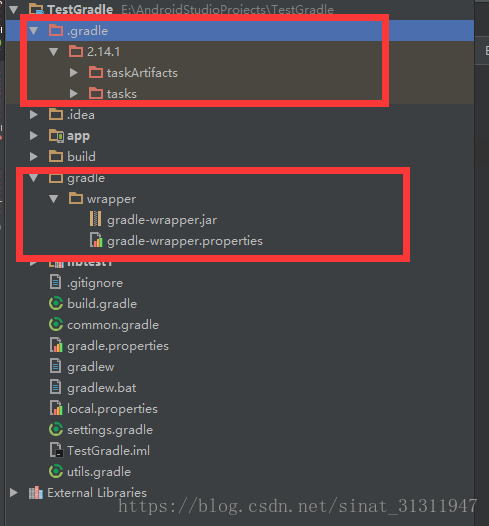
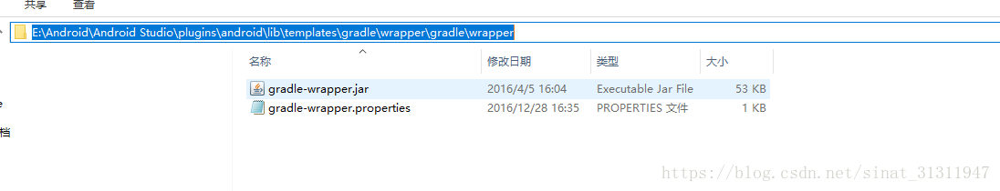
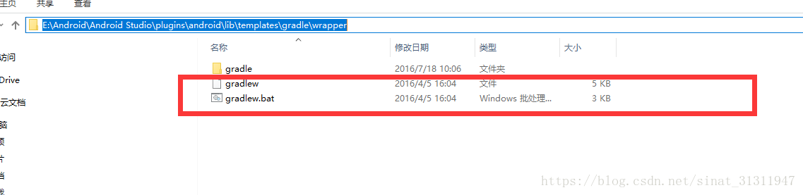
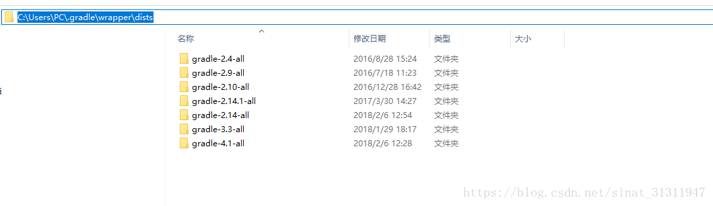
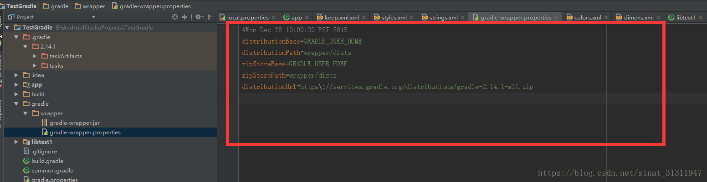

---
> **ARTS-week-28**
> 2022-07-16 15:30
---


###### ARTS-2019 左耳听风社群活动--每周完成一个 ARTS
- Algorithm： 每周至少做一个 leetcode 的算法题
- Review: 阅读并点评至少一篇英文技术文章
- Tip: 学习至少一个技术技巧
- Share: 分享一篇有观点和思考的技术文章

### 1.Algorithm:

- [676. 实现一个魔法字典 (中等) ?](https://leetcode.cn/submissions/detail/335553800/)  
  + 思路:哈希
- [735. 行星碰撞 (中等) ?](https://leetcode.cn/submissions/detail/336510118/)  
  + 思路：栈
- [558. 四叉树交集 (中等) ?](https://leetcode.cn/submissions/detail/337395223/)  
  + 思路: 递归


### 2.Review:

- [我们如何构建矢量化执行引擎](https://www.cockroachlabs.com/blog/how-we-built-a-vectorized-execution-engine/)  

#### 点评：

- 使用模板生成代码
值得庆幸的是，我们可以使用一种工具来减轻这种负担，并保持使用混凝土类型的良好性能特征。Go 模板引擎允许我们编写一个代码模板，通过一些工作，我们可以欺骗我们的编辑器将其视为常规的 Go 文件。我们必须使用模板引擎，因为我们当前使用的 Go 版本不支持泛型类型。模板化乘法运算符将如下所示（完整的模板代码位于 row_based_typed_tmpl.go 中）：：

```
// {{/*
type _GOTYPE interface{}

// _MULFN assigns the result of the multiplication of the first and second
// operand to the first operand.
func _MULFN(_ TypedDatum, _ interface{}) {
  panic("do not call from non-templated code")
}
// */}}
// {{ range .}}
type mul_TYPEOperator struct {
  input             TypedOperator
  arg               _GOTYPE
  columnsToMultiply []int
}
func (m mul_TYPEOperator) next() []TypedDatum {
  row := m.input.next()
  if row == nil {
    return nil
  }
  for _, c := range m.columnsToMultiply {
    _MULFN(row[c], m.arg)
  }
  return row
}
// {{ end }}
```

生成完整row_based_typed.gen.go 文件的随附代码位于 row_based_type_gen.go 中。此代码通过运行 go run 来执行，以运行 generate.go 中的 main（） 函数（为简洁起见，此处省略）。生成器将循环访问切片，并使用每种类型的特定信息填充模板。请注意，为了考虑row_based_typed_tmpl.go文件有效的Go，需要执行前面的步骤。在模板中，我们使用有效的Go令牌（例如_GOTYPE和_MULFN）。这些令牌的声明包装在模板注释中，并在最终生成的文件中删除。

例如，乘法函数 （\_MULFN） 将转换为具有相同参数的方法调用：

```
// Replace all functions.
mulFnRe := regexp.MustCompile(`_MULFN\((.*),(.*)\)`)
s = mulFnRe.ReplaceAllString(s, `{{ .MulFn "$1" "$2" }}`)
```

执行模板时调用 MulFn，然后返回 Go 代码以根据特定于类型的信息执行乘法。看看row_based_typed gen.go中最终生成的代码。

我们采用的模板方法有一些粗糙的边缘，当然不是一个非常灵活的实现。尽管如此，它是我们在CockroachDB中构建的真正矢量化执行引擎的关键部分，并且它非常简单，可以通过创建强大的域特定语言来构建而不会偏离方向。现在，如果我们想添加功能或修复错误，我们可以修改模板一次，然后重新生成代码以更改所有运算符。现在，代码更易于管理和扩展，让我们尝试进一步提高性能。

注意：为了使本博客文章其余部分中的代码更易于阅读，我们不会将代码生成用于以下运算符重写。


- 批处理成本高昂的调用
重复之前的基准测试过程，向我们展示了一些有用的后续步骤。

```
$ go test -bench "BenchmarkRowBasedTyped$" -cpuprofile cpu.out -o row_typed_bench
$ go tool pprof ./row_typed_bench cpu.out

(pprof) list next
ROUTINE ======================== _~/scratch/vecdeepdive.mulInt64Operator.next in ~/scratch/vecdeepdive/row_based_typed.gen.go
  1.26s   1.92s (flat, cum) 85.71% of Total
      .       .   8:    input           TypedOperator
      .       .   9:    arg             int64
      .       .   10:    columnsToMultiply []int
      .       .   11:}
      .       .   12:
  180ms   180ms   13:func (m mulInt64Operator) next() []TypedDatum {
  170ms   830ms   14:    row := m.input.next()
      .       .   15:    if row == nil {
      .       .   16:      return nil
      .       .   17:    }
  330ms   330ms   18:    for _, c := range m.columnsToMultiply {
  500ms   500ms   19:      row[c].int64*= m.arg
      .       .   20:    }
    80ms    80ms  21:    return row
      .       .   22:}
```

配置文件的这一部分显示，在 mulInt64Operator.next 函数中花费的大约一半时间都花在调用 m.input.next（） 上（请参阅上面的第 13 行）。如果我们看一下 （\*typedTableReader）.next（） 的实现，这并不奇怪;这是很多代码，只是为了推进到切片中的下一个元素。我们不能对typedTableReader进行过多的优化，因为我们需要保留将其链接到我们可能实现的任何其他SQL运算符的能力。但是我们可以做另一个重要的优化：我们可以为每个行调用下一个函数一次，而不是取回一批行并一次对所有行进行操作，而无需对（\*typedTableReader）.next进行太多更改。我们不能一次获取所有行，因为某些查询可能会导致内存中无法容纳的巨大数据集，但我们可以选择一个相当大的批大小。

通过这种优化，我们有了如下运算符。再一次，这个新版本的完整代码被省略了，因为有很多样板更改。完整的代码示例可以在row_based_typed_batch.go中找到。

```
type mulInt64BatchOperator struct {
    input           TypedBatchOperator
    arg             int64
    columnsToMultiply []int
}

func (m mulInt64BatchOperator) next() [][]TypedDatum {
    rows := m.input.next()
    if rows == nil {
     return nil
    }
    for _, row := range rows {
     for _, c := range m.columnsToMultiply {
       row[c] = TypedDatum{t: Int64Type, int64: row[c].int64 * m.arg}
     }
    }
    return rows
}

type typedBatchTableReader struct {
    curIdx int
    rows   [][]TypedDatum
}

func (t *typedBatchTableReader) next() [][]TypedDatum {
    if t.curIdx >= len(t.rows) {
     return nil
    }
    endIdx := t.curIdx + batchSize
    if endIdx > len(t.rows) {
     endIdx = len(t.rows)
    }
    retRows := t.rows[t.curIdx:endIdx]
    t.curIdx = endIdx
    return retRows
}
```

通过此批处理更改，基准测试的运行速度比原始实现快了近 3 倍（速度快了 5.5 倍）：

```
$ go test -bench "BenchmarkRowBasedTypedBatch$" -count 10 > tmp && benchstat tmp && rm tmp
name                time/op
RowBasedTypedBatch-12   137µs ±77%
```

- 面向列的数据

但是，我们距离接近每次操作19微秒的“光速”性能还有很长的路要走。新的个人资料是否为我们提供了更多线索？

```
$ go test -bench "BenchmarkRowBasedTypedBatch" -cpuprofile cpu.out -o row_typed_batch_bench
$ go tool pprof ./row_typed_batch_bench cpu.out

(pprof) list next
Total: 990ms
ROUTINE ======================== _~/scratch/vecdeepdive.mulInt64BatchOperator.next in ~/scratch/vecdeepdive/row_based_typed_batch.go
  950ms   950ms (flat, cum) 95.96% of Total
      .       .   15:func (m mulInt64BatchOperator) next() [][]TypedDatum {
      .       .   16:    rows := m.input.next()
      .       .   17:    if rows == nil {
      .       .   18:      return nil
      .       .   19:    }
  210ms   210ms   20:    for _, row := range rows {
  300ms   300ms   21:      for _, c := range m.columnsToMultiply {
  440ms   440ms   22:        row[c] = TypedDatum{t: Int64Type, int64: row[c].int64 * m.arg}
      .       .   23:      }
      .       .   24:    }
      .       .   25:    return rows
      .       .   26:}
```

现在时间调用（\*typedBatchTableReader）.next几乎不会在配置文件中注册！这样要好得多。个人资料显示，第20-22行可能是我们下一步集中精力的最佳地点。这些线路花费的时间远远超过95%。这部分是一个好兆头，因为这些线正在实现我们运营商的核心逻辑。

但是，肯定还有改进的余地。在这三条线上花费的时间大约一半只是迭代循环，而不是循环体本身。如果我们考虑循环的大小，那么这开始变得更加清晰。行批处理的长度为 1，024，但列的长度为 1。由于行循环是外部循环，这意味着我们正在设置这个微小的内部循环 - 初始化计数器，递增它，并检查边界条件 - 1，024次！我们可以通过改变两个循环的顺序来避免所有这些重复的工作。

虽然在本文中我们不会对CPU架构进行全面探讨，但在更改循环顺序时，有两个重要的概念会发挥作用：分支预测和流水线。为了加快执行速度，CPU 使用一种称为流水线的技术，在前一个指令完成之前开始执行下一个指令。这在顺序代码的情况下效果很好，但是每当存在条件分支时，CPU就无法确定分支之后的下一条指令是什么。但是，它可以猜测将遵循哪个分支。如果 CPU 猜测不正确，CPU 为开始评估下一条指令而已经执行的工作将付诸东流。现代CPU能够根据静态代码分析，甚至基于以前对同一分支的评估结果进行预测。

改变循环的顺序还有另一个好处。由于外部循环现在将告诉我们要对哪个列进行操作，因此我们可以一次加载该列的所有数据，并将其存储在一个连续切片的内存中。现代 CPU 体系结构的一个关键组件是缓存子系统。为了避免过于频繁地从主内存加载数据（这是一个相对较慢的操作），CPU 具有缓存层，这些缓存层提供对常用数据片段的快速访问，并且如果访问模式是可预测的，它们还可以将数据预取到这些缓存中。在基于行的示例中，我们将加载每行的所有数据，其中包括完全不受运算符影响的列，因此 CPU 缓存中不会有那么多相关数据。按列定向我们将要操作的数据，可以为CPU提供理想的使用其缓存所需的可预测性和密集的内存打包。

有关流水线、分支预测和 CPU 缓存的更全面处理，请参阅 Dan Luu 的分支预测谈话笔记、他的 CPU 缓存博客文章或 Dave Cheney 在他的 High Performance Go Workshop 中的笔记。

下面的代码显示了我们如何进行上述循环和数据方向的更改，并同时定义了一些新类型以使代码更易于使用。

```
type vector interface {
    // Type returns the type of data stored in this vector.
    Type() T
    // Int64 returns an int64 slice.
    Int64() []int64
    // Float64 returns a float64 slice.
    Float64() []float64
}

type colBatch struct {
    size int
    vecs []vector
}

func (m mulInt64ColOperator) next() colBatch {
    batch := m.input.next()
    if batch.size == 0 {
     return batch
    }
    for _, c := range m.columnsToMultiply {
     vec := batch.vecs[c].Int64()
     for i := range vec {
       vec[i] = vec[i] * m.arg
     }
    }
    return batch
}
```

我们引入新的向量类型的原因是，我们可以有一个可以表示任何类型的一批数据的结构。结构对于每种类型的类型都有一个切片字段，但这些切片中只有一个将非 nil。您可能已经注意到，我们现在已经重新引入了一些接口转换，但是由于批处理，我们为它支付的性能价格现在已经摊销。现在让我们来看看基准测试。

```
$ go test -bench "BenchmarkColBasedTyped" -count 10 > tmp && benchstat tmp && rm tmp
name                time/op
ColBasedTyped-12    38.2µs ±24%
```

这是另一个近3.5倍的改进，比原来的一次一排版本提高了约20倍！我们的光速基准测试仍然比这个最新版本快2倍左右，因为在读取每个批次和导航到要操作的列时存在开销。出于本文的目的，我们将在这里停止优化工作，但我们一直在寻找使我们真正的矢量化引擎更快的方法。

- 结论

通过分析玩具执行引擎代码的配置文件并采用MonetDB/x100论文中提出的想法，我们能够识别性能问题并实施解决方案，将65，536行乘以20倍的性能。我们还使用代码生成来编写模板化代码，然后将这些代码生成到每个具体类型的特定实现中。

在CockroachDB中，我们将这篇博客文章中介绍的所有更改合并到我们的矢量化执行引擎中。这导致我们自己的微基准的 CPU 时间缩短了 70 倍，行业标准 TPC-H 基准测试中某些查询的端到端延迟提高了 4 倍。我们实现的端到端延迟改进比在玩具示例中实现的改进要小得多，但请注意，我们在此博客文章中仅关注改进查询的内存中执行。在 CockroachDB 上运行 TPC-H 查询时，在处理之前，需要以原始的面向行的格式从磁盘读取数据，这将占查询执行延迟的最大份额。然而，这是一个很大的改进。

在 CockroachDB 19.2 中，您将能够在许多常见的扫描、联接和聚合查询上享受这些性能优势。下面是这篇博客文章中原始示例查询的演示，该查询使用我们的新矢量化引擎时运行速度几乎是其 2 倍：

```
oot@127.0.0.1:64128/defaultdb> CREATE TABLE inventory (id INT PRIMARY KEY, price FLOAT);
CREATE TABLE

Time: 2.78ms

root@127.0.0.1:64128/defaultdb> INSERT INTO inventory SELECT id, random()*10 FROM generate_series(1,10000000) g(id);
INSERT 100000

Time: 521.757ms

root@127.0.0.1:64128/defaultdb> EXPLAIN SELECT count(*) FROM inventory WHERE price * 0.8 > 3;
       tree      |    field    |     description
+----------------+-------------+---------------------+
                 | distributed | true
                 | vectorized  | true
  group          |             |
   │             | aggregate 0 | count_rows()
   │             | scalar      |
   └── render    |             |
        └── scan |             |
                 | table       | inventory@primary
                 | spans       | ALL
                 | filter      | (price * 0.8) > 3.0
(10 rows)
Time: 3.076ms
```

此查询的 EXPLAIN 计划显示矢量化字段为 true，这意味着默认情况下将使用矢量化引擎运行查询。而且，果然，在打开和关闭引擎的情况下运行此查询显示出适度的性能差异：

```
root@127.0.0.1:64128/defaultdb> SELECT count(*) FROM inventory WHERE price * 0.8 > 3;
   count
+---------+
  6252335
(1 row)
Time: 3.587261s

root@127.0.0.1:64128/defaultdb> set vectorize=off;
SET
Time: 283µs

root@127.0.0.1:64128/defaultdb> SELECT count(*) FROM inventory WHERE price * 0.8 > 3;
   count
+---------+
  6252335
(1 row)
Time: 5.847703s
```

在 CockroachDB 19.2 中，新的矢量化引擎会自动为受支持的查询启用，这些查询可能读取的行数超过vectorize_row_count_threshold设置（默认值为 1，024）。已实现具有缓冲运算符的查询，这些运算符可能会使用无限的内存量（如全局排序、哈希联接和无序聚合），但默认情况下尚未启用。有关默认情况下启用和未打开的完整详细信息，请查看矢量化执行引擎文档。要了解有关我们如何构建更复杂的矢量化运算符的更多信息，请查看我们关于矢量化哈希连接器和矢量化合并连接器的博客文章。

### 3.Tip:

#### Gradle 与 Gradle Wrapper 的区别
Gradle：android 用来构建项目的编程框架。用这个来构建项目变得无比轻松和高可定制性，比如引入第三方依赖，发布到maven库，构建多渠道版本等等。
Gradle-wrapper：wrapper(包装) 通过读取配置文件中 gradle 的版本，为每个项目自动的下载和配置 gradle。



在 Android Studio 安装的时候便会自带这个功能 jar 包和 gradle-wrapper.properties。 所以AS每新建一个项目，就会将个目录下的这两个文件拷入到项目的 gradle 文件夹下面。



为什么不直接执行 gradle 的命令，而是执行 gradlew 的命令？
因为就像 wrapper 本身的意义，gradle 命令行也是善变的，所以 wrapper 对命令行也进行了一层封装，使用统一的 gradlew 命令，wrapper 会自动去执行具体版本对应版本的 gradle 命令。



gradle-wrapper.jar 具体下载的 gradle 去哪了？
一般在用户目录下的 .gradle/wrapper/dists 存放。



如何修改要下载的 gradle 版本？
distributionUrl:要下载的gradle地址以及版本，gradle-wrapper会去wrapper/list目录下查找，如果没有对应版本的gradle会自动下载。
所以如果下载卡顿可以先去找国内的镜像网站下载下来，手工放入 .gradle/wrapper/dists 文件夹即可。




gradle的3种版本：
gradle-xx-all.zip是完整版，包含了各种二进制文件，源代码文件，和离线的文档。例如，https://services.gradle.org/distributions/gradle-2.14.1-all.zip

gradle-xx-bin.zip是二进制版，只包含了二进制文件（可执行文件），没有文档和源代码。例如，https://services.gradle.org/distributions/gradle-2.14.1-bin.zip

gradle-xx-src.zip是源码版，只包含了Gradle源代码，不能用来编译你的工程。例如，https://services.gradle.org/distributions/gradle-2.14.1-src.zip


#### 获取Android设备的序列号（SN号）

方法（一）通过反射获取 sn 号

```
public static String getDeviceSN(){
    String serial = null;
    try {
        Class<?> c =Class.forName("android.os.SystemProperties");
        Method get =c.getMethod("get", String.class);
        serial = (String)get.invoke(c, "ro.serialno");
    } catch (Exception e) {
        e.printStackTrace();
    }
    return serial;
}
```

方法（二）通过 android.os 获取 sn 号

```
public static String getDeviceSN(){
    String serialNumber = android.os.Build.SERIAL; 
    return serialNumber;
}
```

方法（三）通过 adb 命令获取sn号

```
adb shell
getprop ro.serialno
```

#### OKHTTP3 的提交方式

使用 okhttp3 需引入以下依赖

```
 compile 'com.squareup.okio:okio:1.13.0'
 compile 'com.squareup.okhttp3:okhttp:3.9.0'
```

1.GET 方式请求

```
 //创建OkHttpClient对象
OkHttpClient okHttpClient  = new OkHttpClient.Builder()
        .connectTimeout(10, TimeUnit.SECONDS)
        .writeTimeout(10,TimeUnit.SECONDS)
        .readTimeout(20, TimeUnit.SECONDS)
        .build();

final Request request = new Request.Builder()
        .url("http://172.20.192.168:8080/getbookByFrom?name=android基础&price=50")//请求的url
        .get()//设置请求方式，get()/post()  查看Builder()方法知，在构建时默认设置请求方式为GET
        .build(); //构建一个请求Request对象

//创建/Call
Call call = okHttpClient.newCall(request);
//加入队列 异步操作
call.enqueue(new Callback() {
    //请求错误回调方法
    @Override
    public void onFailure(Call call, IOException e) {
        System.out.println("连接失败");
    }
    //异步请求(非主线程)
    @Override
    public void onResponse(Call call, Response response) throws IOException {
        if(response.code()==200) {
            System.out.println(response.body().string());
        }             
});
```

2.POST方式请求（表单）

```
OkHttpClient okHttpClient  = new OkHttpClient.Builder()
        .connectTimeout(10, TimeUnit.SECONDS)
        .writeTimeout(10,TimeUnit.SECONDS)
        .readTimeout(20, TimeUnit.SECONDS)
        .build();

//post方式提交的数据
FormBody formBody = new FormBody.Builder()
        .add("name", "android基础")
        .add("price", "50")
        .build();

final Request request = new Request.Builder()
        .url("http://172.20.192.168:8080/getbookByFrom")//请求的url
        .post(formBody)
        .build();


//创建/Call
Call call = okHttpClient.newCall(request);
//加入队列 异步操作
call.enqueue(new Callback() {
    //请求错误回调方法
    @Override
    public void onFailure(Call call, IOException e) {
        System.out.println("连接失败");
    }
   
    @Override
    public void onResponse(Call call, Response response) throws IOException {
        if(response.code()==200) {
            System.out.println(response.body().string());
        }
    }
});
```

2.POST方式请求（json）

```
OkHttpClient okHttpClient  = new OkHttpClient.Builder()
        .connectTimeout(10, TimeUnit.SECONDS)
        .writeTimeout(10,TimeUnit.SECONDS)
        .readTimeout(20, TimeUnit.SECONDS)
        .build();

Book book = new Book();
book.setName("android基础");
book.setPrice(59);
//使用Gson 添加 依赖 compile 'com.google.code.gson:gson:2.8.1'
Gson gson = new Gson();
//使用Gson将对象转换为json字符串
String json = gson.toJson(book);

//MediaType  设置Content-Type 标头中包含的媒体类型值
RequestBody requestBody = FormBody.create(MediaType.parse("application/json; charset=utf-8")
, json);

 Request request = new Request.Builder()
        .url("http://172.20.192.168:8080/getbookByJson")//请求的url
        .post(requestBody)
        .build();

//创建/Call
Call call = okHttpClient.newCall(request);
//加入队列 异步操作
call.enqueue(new Callback() {
    //请求错误回调方法
    @Override
    public void onFailure(Call call, IOException e) {
        System.out.println("连接失败");
    }
    @Override
    public void onResponse(Call call, Response response) throws IOException {
        System.out.println(response.body().string());
    }
});
```

#### 打包遇到错误 Failed to execute goal org.apache.maven.plugins:maven-surefire-plugin:2.22.2:test

方法一：修改 pom.xml 文件

```
<project>  
  [...]  
  <build>  
    <plugins>  
      <plugin>  
        <groupId>org.apache.maven.plugins</groupId>  
        <artifactId>maven-surefire-plugin</artifactId>  
        <version>2.18.1</version>  
        <configuration>  
          <skipTests>true</skipTests>  
        </configuration>  
      </plugin>  
    </plugins>  
  </build>  
  [...]  
</project>
```

方法二：在 Terminal 执行命令

```
mvn install -DskipTests
```

方法三：在 Terminal 执行命令

```
mvn install -Dmaven.test.skip=true
```

方法四：Spring boot 项目使用
pring-boot-maven-plugin 插件已经集成了 maven-surefire-plugin 插件，会自动运行 junit test
，只需要在pom.xml里增加如下配置：
```
<properties>
  <!-- 跳过测试 -->
    <skipTests>true</skipTests>
</properties>
```

### 4.Share:

- [NameTrending命名趋势](https://github.com/Sayi/sayi.github.com/issues/13)  

- [JCommander](https://www.cnblogs.com/zhangshihai1232/articles/6027573.html)

- [JCommander学习总结](https://blog.csdn.net/pandeng6032/article/details/121316207)

- [Flink从入门到真香(12、Flink一大利器-时间窗口）](https://blog.51cto.com/mapengfei/2554577)