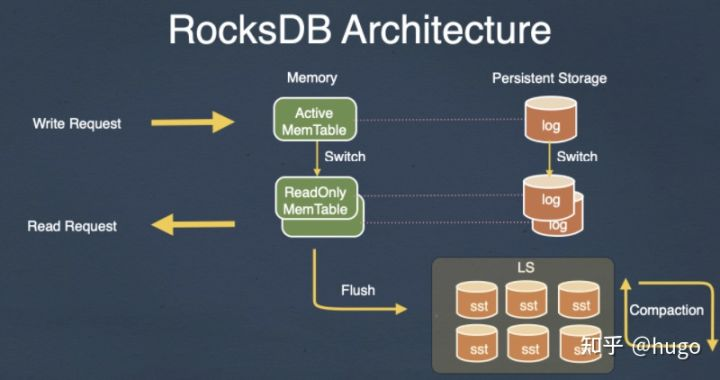
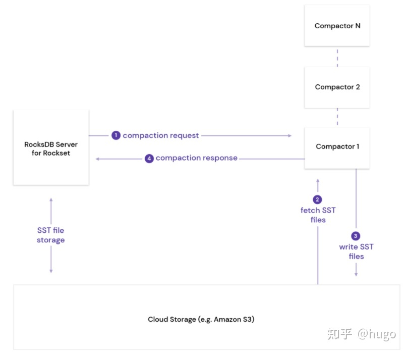

---
> **ARTS-week-32**
> 2022-08-06 12:09
---


###### ARTS-2019 左耳听风社群活动--每周完成一个 ARTS
- Algorithm: 每周至少做一个 leetcode 的算法题
- Review: 阅读并点评至少一篇英文技术文章
- Tip: 学习至少一个技术技巧
- Share: 分享一篇有观点和思考的技术文章

### 1.Algorithm:

- [622. 设计循环队列 (中等) +](https://leetcode.cn/submissions/detail/342561658/)  
  + 思路:数组实现循环队列
- [623. 在二叉树中增加一行 (中等) +](https://leetcode.cn/submissions/detail/346398090/)  
  + 思路:递归
- [636. 函数的独占时间 (中等) +](https://leetcode.cn/submissions/detail/346997168/)  
  + 思路: 栈


### 2.Review:

- [LSM-tree 的 Remote Compaction调度](https://rockset.com/blog/remote-compactions-in-rocksdb-cloud/)  

#### 点评：

- 背景
以 Rocksdb 的 LSM-tree 的架构为例


新的写入请求会先写入到 memtable，当 memtable 满了之后会 flush 形成一个新的 sst 文件到持久化存储。 一些后台线程会被用来进行 compaction，对一个 sst 文件的集合进行重复 key 以及 delete key 的清理，并将最后保留的 key 写入到新的 sst，旧的 sst 文件的集合在没有读的时候会被删除掉。Compaction 的过程需要大量的计算资源和 I/O 资源，而且随着用户写入速度越快，如果想要保持系统的稳定（不会有持续累积的 pending-compaction），那么更多的 cpu 以及 I/O需要被用来调度 compaction 。

大家这里会说，我们在使用 Rocksdb write-heavy 场景 的 时候大多数的瓶颈是在磁盘上，而且使用性能更好的 optane5800 以及 pmem 这种高性能介质瓶颈才可能出现在 CPU 上。 所以，接下来讨论的痛点其实并不是单机 Rocksdb compaction 中的问题，而是底层存储是共享存储的时候 compaction 引入的痛点，比如 rockset 提供云原生数据分析服务的时候底层就是使用 s3 作为共享存储的，底层存储并不是瓶颈，大概率瓶颈会落到虚拟服务器的cpu上。

- 问题
因为 compaction 的计算和 I/O 调度在 rocksdb 中是混合在一起的，并没有分离计算和存储，这个时候如果 CPU 成为瓶颈，那用户想要更高的吞吐，只能扩机器了，而且对于只需要一定存储容量的用户来说扩展机器之后增加的存储容量就被浪费了，这种方案归纳为如下两个问题：
1. 扩机器之后，数据需要在不同的服务器之间进行同步，而如果想要提供更好性能的实时分析能力，这种情况性能就很差了。
2. 底层存储资源因为没有被完全利用到，就会被浪费，无形中增加了存储成本。

- Remote Compaction
rockset 提供包括实时、数据仓库、数据湖 等分析服务，对于用户来说在使用实时分析服务的时候希望最小的成本拥有最高的性能，这也是我们做存储所想要达到的目标。而 Remote Compaction 则是 rockset 为了解决 rocksdb 在共享存储之上 cpu 是瓶颈的一种有效解决方案，并且已经集成到了 rocksdb-cloud （rockset 的存储底座，将 rocksdb 对接到底层的 s3 之上）中。大体思想如下：

对于 lsm-tree 来说已经生成的 sst 文件是只读的，而且他们会被持久化到 s3 共享存储上，并且被能够被其他所有服务器访问；当然这个共享存储也可以是其他的系统，比如 HDFS/CephFs 等。
Rocksdb-cloud server A 能够对一个 compaction 服务进行封装 通过 rpc 发送到一个远端的无状态的服务器B
B 服务器解析收到的 compaction 调度服务，并从 s3 读取需要参与 compaction 的 sst 文件
B 服务执行 compaction 的计算逻辑(堆排序，处理 overwrite/delete/merge 等)，并将最后的新的 sst 文件写入到 s3 存储中。
B 将 compaction 执行的状态通过 rpc 返回给 server A。
大体架构如下：


同样的 Remote Compaction 逻辑在HBASE中的实现也是差不多的（数据主体存储在 hdfs 共享存储上，上层提供一个 hbase 的 region server 作为一个单独的 compaction manager 进行整个 hbase 集群 统一的 compaction 调度）：


- 接口设计
这一些接口都是在上图的服务区 A 也就是 Rocksdb Server 上执行的。

1. 注册一个可插拔的 compaction 服务：
```
Status RegisterPluggableCompactionService(std::unique_ptr<PluggableCompactionService>);\
这个接口主要是用来注册一个可以运行的 compaction job。 像原本的 compaction job 逻辑主要包含如下几步：

1.file picker, 选择需要参与 compaction 的文件
2.process-key, 逐个处理参与 compaction 的文件的 k/v（包括读上来，排序，处理 type，写文件）
3.intall results，更新最后的元数据(生成的 sst 文件元数据会更新到 manifest 中，保存当前 db 状态)，以及删除过期文件，所以这个可插拔的服务也需要提供大体的步骤。
```

2. 调度执行 compaction 以及 生成新的 sst 文件
```
Status Run(const PluggableCompactionParam& job, PluggableCompactionResult* result)
    std::vector<Status> InstallFiles(
    const std::vector<std::string>& remote_paths,
    const std::vector<std::string>& local_paths,
    const EnvOptions& env_options, Env* local_env)

Run 是可以单独执行的 Compaction job，通过 RPC 在远端的 Tier 节点单独执行。 InstallFiles 指将远端服务器的 sst 文件写入到本地共享存储中。
```

- 实践过程中的一些经验
1. Compaction Tier
执行可插拔 Compaction 的主体逻辑是在远端的一个 Compaction Tier 服务器上进行的。这个服务器可以执行多个 Job，每一个 job 被称为 Compactor。首先，Compactor 收到 rocksdb server 的 compaction 调度 rpc 请求，会非常轻量的 open(ghost mode方式打开) 共享存储的 rocksdb 实例（仅加载一些必要的sst文件元数据）而不会去直接加载 sst。一旦成功打开了 Rocksdb 实例，那就可以进行 compaction 的调度了。

rocksdb-cloud 提供了 rocksdb::CloudOptions cloud_options; 来进行 open 过程的选择：

2. 加速 Compaction Tier的db open
原本打开一个 rocksdb 实例的时候 需要获取整个 db 的 sst 文件列表 以及 每个sst的大小（获取每一个 sst 的 properties-block），对于数据仓库这样的巨量存储来说，这样 open 获取 sst 信息的话会极度耗时。而且，这一些信息是从共享存储获得的，对于共享存储来说，他们还需要去对应的物理服务器去读相关的数据，整个链路可能会跨多次网络，耗时自然就增加了。怎么能够让 每一个 compactor 快速得打开db就是 remote compaction 第一个需要解决的问题。

这一些配置 则是能够加速open db的过程，主要是能够减少一些 rpc的消耗。

rocksdb::CloudOptions cloud_options;
cloud_options.ephemeral_resync_on_open = false;
cloud_options.constant_sst_file_size_in_sst_file_manager = 1024;
cloud_options.skip_cloud_files_in_getchildren = true;

rocksdb::Options rocksdb_options;
rocksdb_options.max_open_files = 0;
rocksdb_options.disable_auto_compactions = true;
rocksdb_options.skip_stats_update_on_db_open = true;
rocksdb_options.paranoid_checks = false;
rocksdb_options.compaction_readahead_size = 10 * 1024 * 1024;
3. Disable L0->L0 compaction
remote-compaction 的实现性能肯定没有本地 compaction 的效率高，因为中间涉及到 rpc 以及 数据的网络传输，所以实际的 remote compaction 效率会远低于 local compaction，只能通过足够高的并发来提升 compaction 效率（compaction 不会再影响用户侧服务器的 cpu 使用了）。因为 L0->L1 调度不能并发执行，只能单线程，在 L0->L1 执行期间 rocksdb 会执行 L0->L0 的 compaction，防止 L0 满，达到 write-stall 的限制。

而 rocksdb-cloud 之所以要禁止这个功能，是因为 L0->L0 compaction 往往会生成一个特别大的 sst 文件，而这个特别大的文件则会导致 compactor 的执行时间会特别长，从而无法高效得将 L0 的文件 compaction 下去，间接造成 write-stall。所以，rocksdb-cloud 的经验就是禁止 L0->L0 的 compaction 相比于 L0->L1 + L0 -> L0 不会出现 write-stall 的概率更高。

- 总结
总的来说 remote compaction 应用场景还是 性能要求没有那么高的 数据仓库/数据湖 这种 以云原生为基础服务的 分析场景。对于真正实时性要求特别高的 TP/AP 业务来说，shared-nothing 的 架构才是满足需求的选择，而在 shared-nothing 架构下的 remote compaction 其实并没有必要，毕竟 CPU 瓶颈/磁盘瓶颈 之间的差异没有那么大。那有的人会说 offload-compaction 的计算到其他的硬件（FPGA），这个阿里的 X-DB 已经做过探索，其实收益相比于 FPGA 的成本有限，要不就是像 rENANIC 为 cassandra 做的一个完整的链路，不仅仅 offload compaction，还包括通过 SPDK/DPDK 旁路读/写和网络。不然，仅仅 offload compaction 到FPGA的收益 相比于 FPGA 本身的成本来说还是不够的。

### 3.Tip:

#### Java 中实现记录日志的几种方式

1.java.util.logging --JDK 记录日志方式

```java
package com.oscar999.log;
 
import java.io.IOException;
import java.util.Date;
import java.util.logging.FileHandler;
import java.util.logging.Formatter;
import java.util.logging.Level;
import java.util.logging.LogRecord;
import java.util.logging.Logger;
 
 
public class TestLogJava {
 
    public static void main(String[] args) throws IOException{
        Logger log = Logger.getLogger("tesglog");
        log.setLevel(Level.ALL);
        FileHandler fileHandler = new FileHandler("testlog.log");
        fileHandler.setLevel(Level.ALL);
        fileHandler.setFormatter(new LogFormatter());
        log.addHandler(fileHandler);
        log.info("This is test java util log");   
    }
 
}
 
class LogFormatter extends Formatter {
    @Override
    public String format(LogRecord record) {
        Date date = new Date();
        String sDate = date.toString();
        return "[" + sDate + "]" + "[" + record.getLevel() + "]"
                + record.getClass() + record.getMessage() + "\n";
    }
 
}
```

2.log4j 记录日志方式

```java
1. 加载 log4j 的 jar 包
2. 配置 log4j.properties，并放入项目的根路径下

log4j.rootLogger=debug,stdout,logfile
log4j.appender.stdout=org.apache.log4j.ConsoleAppender
log4j.appender.stdout.layout=org.apache.log4j.PatternLayout
log4j.appender.stdout.layout.ConversionPattern=%5p [%t] (%F:%L) - %m%n
 
log4j.appender.logfile=org.apache.log4j.RollingFileAppender
log4j.appender.logfile.File=logfile.log
log4j.appender.logfile.MaxFileSize=512KB
log4j.appender.logfile.MaxBackupIndex=3
log4j.appender.logfile.layout=org.apache.log4j.PatternLayout
log4j.appender.logfile.layout.ConversionPattern=%d %p [%c] - %m%n

package com.oscar999.log;
 
import org.apache.log4j.Logger;
import org.apache.log4j.PropertyConfigurator;
 
public class TestLog4j {
 
    public static void main(String[] args) {
        // 1. create log
        Logger log = Logger.getLogger(TestLog4j.class);
        // 2. get log config file
        PropertyConfigurator.configure("log4j.properties");
        // 3. start log
        log.debug("Here is some DEBUG");
        log.info("Here is some INFO");
        log.warn("Here is some WARN");
        log.error("Here is some ERROR");
        log.fatal("Here is some FATAL");
    }
 
}
```

#### A batch statement using UpdatableRecord

```java
ctx.batchUpdate(balances
   .stream()
   .map(b -> { 
       var r = new BalanceRecord();
       r.setAmount(b.getAmount());
       r.setId(b.getId());
       r.changed(BALANCE.ID, false); // Prevent setting the ID to itself
       return r;
   })
   .collect(toList()))
   .execute();

List<UpdateConditionStep<BalanceRecord> updates = new ArrayList<>();
for (Balance balance : balances) {
   updates.add(dslContext.update(BALANCE)
             .set(BALANCE.AMOUNT, balance.getAmount())
             .where(BALANCE.ID.eq(balance.getId)));
}

dslContext.batch(updates).execute();
```

#### MySQL数据库导入导出数据之报错解答实例讲解

```sql
--报错
mysql> SELECT * FROM student INTO OUTFILE "G:\ProgramData\MySQL\MySQL Server 8.0\Uploads\student.txt";
ERROR 1290 (HY000): The MySQL server is running with the --secure-file-priv option so it cannot execute this statement
--解决方法
SELECT * FROM student INTO OUTFILE "G:/ProgramData/MySQL/MySQL Server 8.0/Uploads/student.txt";
Query OK, 2 rows affected (0.02 sec)

--报错
mysql> load data local infile 'G:/ProgramData/MySQL/MySQL Server 8.0/Uploads/student.txt'
 -> into table student(a,b,c);
ERROR 3948 (42000): Loading local data is disabled; this must be enabled on both the client and server sides
--解决方法
mysql> SHOW GLOBAL VARIABLES LIKE 'local_infile';
+---------------+-------+
| Variable_name | Value |
+---------------+-------+
| local_infile | OFF |
+---------------+-------+
1 row in set, 1 warning (0.01 sec)
 
mysql> SET GLOBAL local_infile = true;
Query OK, 0 rows affected (0.00 sec)
 
mysql> SHOW GLOBAL VARIABLES LIKE 'local_infile';
+---------------+-------+
| Variable_name | Value |
+---------------+-------+
| local_infile | ON |
+---------------+-------+
1 row in set, 1 warning (0.01 sec)

--报错
mysql> load data local infile 'G:\ProgramData\MySQL\MySQL Server 8.0\Uploads\student.txt'
 -> into table student(id,name,score);
ERROR 2068 (HY000): LOAD DATA LOCAL INFILE file request rejected due to restrictions on access.
--解决方法
C:\Users>mysql -uroot -p --local-infile
使用这种方法登录

--报错
mysql> load data local infile 'G:\ProgramData\MySQL\MySQL Server 8.0\Uploads\student.txt'
 -> into table student(id,name,score);
ERROR 2 (HY000): File 'G:ProgramDataMySQLMySQL Server 8.0Uploadsstudent.txt' not found (OS errno 2 - No such file or directory)
--解决方法
mysql> load data local infile 'G://ProgramData/MySQL/MySQL Server 8.0/Uploads/student.txt'
 -> into table student(id,name,score);
Query OK, 8 rows affected, 2 warnings (0.01 sec)
Records: 10 Deleted: 0 Skipped: 2 Warnings: 2
```

#### H2 数据库提供了一组命令行工具

pom.xml 依赖：

```xml
<dependency>
    <groupId>com.h2database</groupId>
    <artifactId>h2</artifactId>
    <version>1.4.196</version>
</dependency>
```

需要了解这些工具，使用参数 '-?', 如：java -cp h2\*.jar org.h2.tools.Backup -?

命令行工具有:
```shell
Backup 创建数据库备份
ChangeFileEncryption 允许改变文件加密密码和数据库的加密算法
Console 启动记忆浏览器的 H2 控制台
ConverTraceFile 转换 '.trace.db' 文件到 Java 应用和 SQL 脚本
CreateCluster 从一个独立的数据库服务创建集群
DeleteDbFiles 删除所有的数据库文件
Recover 恢复损坏的数据库
Restore 从数据库备份中恢复数据库
RunScript 运行数据库 SQL 脚本
Script 为数据库备份或迁移导出 SQL 文件
Server 启动 H2 服务模式
Shell 命令行工具 
```

Shell 工具： 
输入 java -cp h2\*.jar org.h2.tools.Shell 时，会要求输入
数据库 URL，JDBC 驱动、用户名和密码。连接设置可以使用命令行参数。
连接后内置命令不需要以分号结束，但执行 SQL 需要用分号 ';' 结束，允许多行

```shell
Welcome to H2 Shell 1.4.196 (2017-06-10)
Exit with Ctrl+C
[Enter]   jdbc:h2:tcp://localhost/~/test
URL       jdbc:h2:~/test
[Enter]   org.h2.Driver
Driver    org.h2.Driver
[Enter]
User
[Enter]   Hide
Password
Password
Connected
Commands are case insensitive; SQL statements end with ';'
help or ?      Display this help
list           Toggle result list / stack trace mode
maxwidth       Set maximum column width (default is 100)
autocommit     Enable or disable autocommit
history        Show the last 20 statements
quit or exit   Close the connection and exit

sql> CREATE Table test(NAME VARCHAR)
...> ;
(Update count: 0, 2 ms)
sql> INSERT INTO test VALUES('Hello H2DB!');
(Update count: 1, 0 ms)

sql> select * from 
sql> where id = 0;

默认情况，结果时打印成表，如果结果有许多列，可以使用列表模式

sql> list
Result list mode is now on
sql> select * from list
ID : 1
NAME : Hello

ID : 2
NAME : World
(2 rows, 0 ms)

sql> quit
Connection closed
```

Java 连接： 
```java
package com.github.houbb.h2.learn.p1;

import java.sql.*;

public class DefaultServerTest {

    public static void main(String[] args) throws ClassNotFoundException {
        Class.forName("org.h2.Driver");

        try (Connection connection = DriverManager.getConnection("jdbc:h2:~/test", null, null);
             Statement statement = connection.createStatement()) {
            try (ResultSet result = statement.executeQuery("SELECT NAME FROM test")) {
                while (result.next()) {
                    System.out.println(result.getString("name"));
                }
            }
        } catch (SQLException e) {
            e.printStackTrace();
        }
    }

}
```

### 4.Share:

- [中国数据库排行](https://www.modb.pro/dbRank)

- [去O：为什么这么难？](https://z.itpub.net/article/detail/772E984452D7CE4315D98AA742B05428)

- [国产数据库技术如何实现“去O”](https://www.modb.pro/db/27275)

- [为什么“去O”唯有PostgreSQL？](https://www.zhihu.com/question/462751291)

- [全球数据库产业图谱发布，巨杉数据库参编《数据库发展研究报告（2022年）》等多项内容](https://www.modb.pro/db/447144)

- [TestableMock的设计和原理](https://alibaba.github.io/testable-mock/#/zh-cn/doc/design-and-mechanism)

- [TPC-H测试集](https://help.aliyun.com/document_detail/156330.html)

- [2022-07-06 使用tpch大数据量压测mysql](http://codeleading.com/article/35916344535)

- [使用TPC-H 进行MySQL数据库性能测试](https://blog.csdn.net/kkdelta/article/details/105931568)

- [数据库基准测试纸之-TPC-H（Linux环境）](https://blog.csdn.net/mbshqqb/article/details/78564153)

- [TPC-H介绍及实战总结](https://blog.csdn.net/qq_42101275/article/details/123479563)

- [将TPC-H数据导入MySQL教程](https://blog.csdn.net/m0_43393325/article/details/121428483)

- [在Linux下将TPC-H数据导入到mysql（带图详解）](https://blog.csdn.net/weixin_42157541/article/details/115912711)