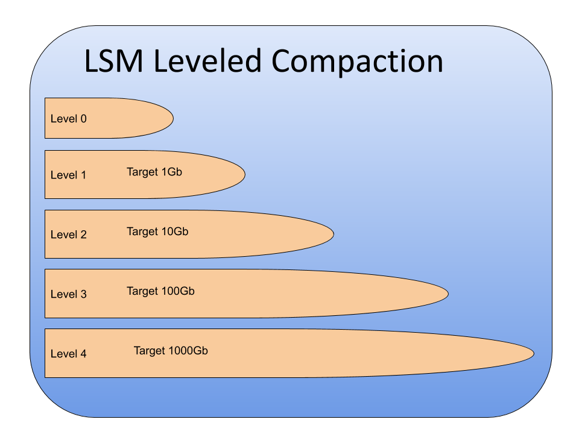

---
> **ARTS-week-35**
> 2022-08-28 11:06
---


###### ARTS-2019 左耳听风社群活动--每周完成一个 ARTS
- Algorithm： 每周至少做一个 leetcode 的算法题
- Review: 阅读并点评至少一篇英文技术文章
- Tip: 学习至少一个技术技巧
- Share: 分享一篇有观点和思考的技术文章

### 1.Algorithm:

- [655. 输出二叉树 (^^ +)](https://leetcode.cn/submissions/detail/353601079/)  
  + 思路:递归
- [658. 找到 K 个最接近的元素 (^^ +)](https://leetcode.cn/submissions/detail/354894839/)  
  + 思路:优先队列
- [662. 二叉树最大宽度 (^^ +)](https://leetcode.cn/submissions/detail/355638422/)  
  + 思路: DFS
- [793. 阶乘函数后 K 个零 (^^^ +)](https://leetcode.cn/submissions/detail/355794936/)  
  + 思路: 二分

### 2.Review:

- [MySQL中隐藏的宝石：MyRocks](https://www.percona.com/blog/2020/02/20/when-to-use-myrocks-in-mysql/)  

#### 点评：

在这篇博客文章中，我们将分享 MySQL 中隐藏的宝石 MyRocks 的一些经验，MyRocks 是 MySQL 着名的可插拔存储系统的存储引擎。MyRocks 基于 RocksDB，RocksDB 是 LevelDB 的一个分支。简而言之，它是另一个基于 LSM 树的键值存储，因此与其他 MySQL 引擎相比，它具有一些独特的功能。它由 Facebook 于 2016 年推出，后来分别包含在 Percona Server for MySQL 和 MariaDB。

- 背景和历史
关于 LSM 的原始论文发表于 1996 年，如果需要一个简单的概念，下面的引文是这样的：“LSM-tree 使用一种算法来延迟和批处理索引更改，以一种有效的方式从基于内存的组件到一个或多个磁盘组件级联更改，让人联想到归并排序。当时，磁盘速度很慢，IOPS很昂贵，我们的想法是通过将随机写入负载转换为顺序写入负载来最小化写入成本。这项技术非常受欢迎，是众多数据库和存储引擎的基础或灵感来源：HBase，LevelDB，RocksDB，Tarantool，WiredTiger等。即使在2020年，当存储更快，更便宜时，LSM-tree 仍然可以为某些工作负载提供实质性的好处。

MyRocks 的开发是由 Facebook 在2015年左右开始的。Yoshinori Matsunobu 做了多次演讲，详细介绍了在 MySQL 中使用 RocksDB 背后的原因。他们没有充分利用服务器，因为它们的磁盘空间有限，而 MyRocks 允许更好的空间效率。这种更好的空间效率是 LSM 树存储引擎所固有的。

到目前为止，MyRocks 仍然是一个有点小众的解决方案，坦率地说，没有多少人知道它并考虑它的使用。事不宜迟，让我们看看它是如何工作的，以及为什么要使用它。

- MyRocks 的工作动态

MyRocks 引擎基于 LSM 树结构，我们上面已经提到过。这使得它成为与 InnoDB 截然不同的引擎。因此，让我们对 MyRocks 内部进行高级概述。首先，基于行的数据如何适应键值存储？可以将常规聚集索引视为其本身的键值结构：有一个键，该值是一整行。二级索引可以将主索引的键作为值，还可以使用列数据值。

- 写
MyRocks 中的所有写入都是按顺序在称为 memtable 的特殊结构中完成的，这是引擎中为数不多的可变结构之一。由于我们需要写入操作持久化，所有写入操作也会写入 WAL（类似于InnoDB重做日志的概念），WAL 会被刷新到磁盘。一旦 memtable 变满，它就会被复制到内存中并使其不可变。在后台，不可变的 memtable 将以排序字符串表 （SST） 的形式刷新到磁盘，形成多级压缩方案的 L0。在此初始刷新期间，将对 memtable 中的更改进行重复数据删除（一个键的一千个更新成为单个更新）。生成的 SST 是不可变的，并且在 L0 上具有重复的数据。

随着在L0上创建更多的SST，它们将开始涌入L1...L6.在L0之后的每个级别上，SST中的数据不重复，因此压缩可以并行进行。压缩从较高级别获取 SST，并将其与较低级别的一个（或多个）SST 合并，删除原始文件并在较低级别创建新 SST。最终，数据达到最低水平。如下图所示，每个级别都有越来越多的数据，因此大多数数据实际上都存储在较低的级别。上面提到的合并发生在键值对上，并且在合并期间，较低级别的 KV 将始终早于较高级别的 KV，因此可以丢弃。


拥有不可变的 SST 可以使它们始终填充到100%，从而提高空间利用率。事实上，这是 MyRocks 的卖点之一，因为它允许更高的空间效率。除了 SST 固有的紧凑性外，数据还被压缩，这进一步最大限度地减少了占用空间。这里一个有趣的功能是，可以为最底部（本质上大部分数据都是）和其他级别指定不同的压缩算法。

MyRocks 引擎的另一个重要组件是列系列（CF）。每个键值对（或者，用熟悉的术语来说，每个索引）都与一个 CF 相关联，引用 Percona Server for MySQL 文档：“每个列系列都有不同的属性，例如块大小，压缩，排序顺序和 MemTable。除了控制物理存储特征之外，这还为跨不同键空间的查询提供了原子性。

- 读
到目前为止，我们只讨论编写数据。由于其结构，在 MyRocks 中阅读它也完全不同。由于数据是分级的，因此要查找键的值，需要查看 memtables，L0，L1 ...L6.这是 LSM 读取成本。但是，不必始终扫描整个数据集来查找该行，并且并非所有扫描都会转到磁盘。读取路径从 memtables 开始，根据定义，memtables 将具有最新的数据。然后将使用块缓存，其中可能包含最近访问的数据。

一旦内存中选项用尽，读取将溢出到磁盘并开始在连续级别上遍历 SST。由于 SST 中的数据不重复，因此必须对 L0 进行整体扫描，但只需要扫描其他级别的 SST 的子集，因为我们知道每个 SST 中的关键数据范围。为了进一步改进这种扫描，使用了布隆滤器，这有助于扫描操作回答一个问题：“给定的 SST 中存在 key 吗？” - 但前提是我们确定它不存在。因此，我们可以避免读取某些 SST，其 key 范围涵盖了我们寻找的 key。不幸的是，目前还没有类似 BF 的技术用于范围扫描，尽管前缀布隆过滤器可能会有所帮助。

每次找到要查找的数据时，我们都会填充块缓存以供将来使用。除此之外，索引和布隆过滤器数据也会被缓存，从而加快SST扫描速度，即使数据不在块缓存中。即使进行了所有这些改进，也可以看到，一般来说，读取比常规 b 树存储引擎中的读取操作更复杂。然而，负面影响越明显，数据集中的数据越多。

- 工具和实用程序
解决方案的生产就绪性不仅取决于其自身的成熟度，还取决于其周围的生态系统。让我们回顾一下 MyRocks 如何与现有工具和定期维护活动配合使用。

首先，我们是否可以像 innodb 那样以最小的锁定来在线备份它？答案是肯定的（有一些陷阱）。原始的 Facebook 的 MySQL 5.6包含 myrocks_hotbackup 脚本，该脚本支持 MyRocks 的热备份，但没有其他引擎。从 Percona XtraBackup 版本 8.0.6 和 Mariabackup 10.2.16/10.3.8 开始，我们有能力使用单个工具来备份异构集群。

MyRocks 的一个显着限制是它不像 InnoDB 那样支持在线 DDL。可以使用 pt-online-schema-change 和 gh-ost 等解决方案，在进行大型表更改时，无论如何都是首选。对于 pt-osc，需要注意一些细节。全局事务隔离应设置为 “读取已提交”，否则当目标表已在 RocksDB 引擎中时，pt-osc 将失败。它还需要 binlog_format 设置为 ROW。无论如何，这两种设置通常都适用于 MyRocks，因为它还不支持间隙锁定，因此其可重复读取实现有所不同。

由于我们仅限于 ROW 级复制，因此 pt-table-校验和和 pt-table-sync 等工具将不起作用，因此请小心数据一致性。

监视是生产用途的另一个重要考虑因素。MyRocks 在内部进行了很好的测试，提供了一百多个指标，广泛的显示引擎输出和详细的日志记录。以下是一些可用指标的概述：MyRocks 信息架构。通过 Percona 监控和管理，可以获得 MyRocks 的专用仪表板，提供引擎内部的概述。

MyRocks 中的分区是受支持的，并且具有一个有趣的功能，可以在其中将分区分配给不同的列族：分区表上的列系列。

不幸的是，就目前而言，加密不适用于MyRocks，即使 RocksDB 支持可插拔加密。

- 负载测试和比较与 InnoDB
我们在 MyRocks vs InnoDB 上编译了一个基本的负载测试，其中包含以下详细信息。
我们下载了 2019 年的准时性能数据报告，并将其加载到两个引擎。该测试包括将数据加载到单个表，以获取一年的信息（约1400万行）。加载脚本可以在 github 存储库中找到。

AWS 实例 ： t2.large – 8Gb Ram – 16Gb SSD

| 引擎 | 大小 | 期间  | 行 | 方法 |
| ------ | -------------- | ---- |---- |---- |---- |
|innodb + log_bin off|  5.6Gb| 9m56|  14,009,743|  Load Infile
|innodb + log_bin on| 5.6Gb**|  11m58| 14,009,743|  Load Infile
|innodb 压缩 + log_bin on|  2.6Gb**| 17m9|  14,009,743|  Load Infile
|innodb 压缩 + log_bin off|  2.6Gb| 35m56| 14,009,743|  Load Infile
|myrocks/lz4 + log_bin on|  1.4Gb\*| 9m24|  14,009,743|  Load Infile
|myrocks/lz4 + log_bin off| 1.4Gb\*| 8m| 14,009,743|  Load Infile

\* MyRocks WAL 文件不包括在内（这是一个可配置的参数）
\*\*不包括 InnoDB 重做日志

- 结论
正如我们上面所展示的，MyRocks 可以成为存储引擎的一个令人惊讶的多功能选择。虽然它通常耗费了一定的空间效率和写入负载，但基准测试表明它在 TPC-C 工作负载中相当不错。那么，何时会使用 MyRocks？

用最简单的术语来说：
- 有非常大的数据集，比可用内存大得多
- 大部分负载是只写的
- 需要节省空间
- 最好有SSD存储的服务器以及云

但真正的数据库很少由纯日志数据组成。我们进行选择，无论是点查找还是范围查询，我们都会修改数据。碰巧的是，如果可以牺牲一些数据库端约束，MyRocks 作为通用存储引擎可能会出奇地好，拥有的数据集越大， MyRocks 就越好。试一试，并让我们知道。

在继续之前要考虑的限制：
- 外键
- 全文键
- 空间键
- 无表空间（改为列系列）
- 没有在线DDL（pt-osc和gh-ost帮助在这里）
- 文档中列出的其他限制
- Percona XtraDB Cluster/Galera 不支持
- 索引仅支持二进制排序规则
警告：
它专为小型事务而设计，因此请针对批量操作进行配置。对于加载数据，请使用rocksdb_bulk_load=1，对于删除大型数据集，请使用 rocksdb-commit-in-the-middle。

在一个事务中混合不同的存储引擎将起作用，但请注意InnoDB和RocksDB引擎之间隔离级别工作方式的差异，以及缺少保存点等限制。混合存储引擎时需要注意的另一件重要事情是它们使用不同的内存结构，因此请仔细规划。

损坏的不可变文件不可恢复。

- 参考 
[MyRocks Deep Dive](https://www.slideshare.net/matsunobu/myrocks-deep-dive)
[Exposing MyRocks Internals Via System Variables: Part 1, Data Writing](https://blog.pythian.com/exposing-myrocks-internals-via-system-variables-part-1-data-writing/)
[Webinar: How to Rock with MyRocks](https://www.percona.com/resources/webinars/how-rock-myrocks)
[MyRocks Troubleshooting](https://www.percona.com/sites/default/files/presentations/14-rocksdb.pdf)
[MyRocks Introduction](https://www.percona.com/live/17/sites/default/files/slides/MyRocks_Tutorial.pdf)
[Optimizer Statistics in MyRocks](https://mariadb.com/kb/en/optimizer-statistics-in-myrocks/)
[MyRocks and InnoDB: a summary](http://smalldatum.blogspot.com/2017/12/myrocks-innodb-and-tokudb-summary.html)
[RocksDB Is Eating the Database World](https://rockset.com/blog/rocksdb-is-eating-the-database-world/)

### 3.Tip:

#### 如何设置 lookand feel:

```java
UIManager.setLookAndFeel(UIManager.getSystemLookAndFeelClassName());
```

### 4.Share:

- [openEuler 资源利用率提升之道 02：典型应用下的效果](https://xie.infoq.cn/article/47dda769938f670aa05e46068)

- [Java swing皮肤（look and feel）大全](https://www.jianshu.com/p/ae424a67a970)