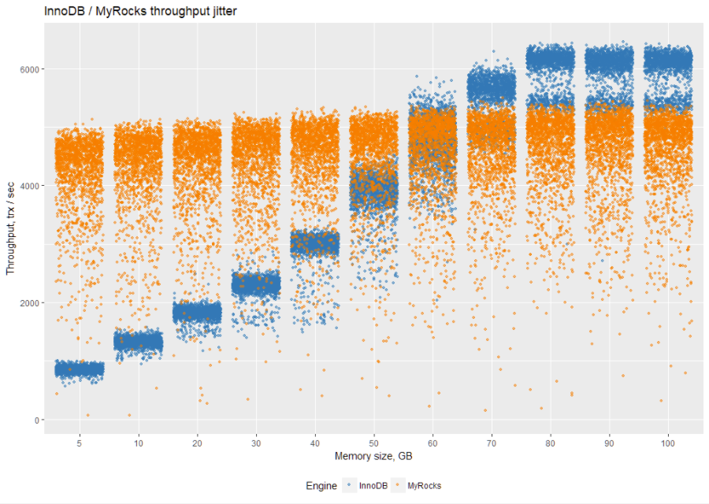
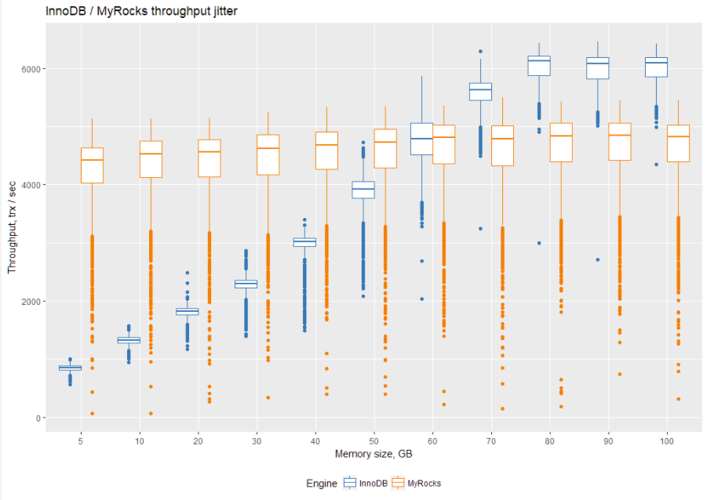
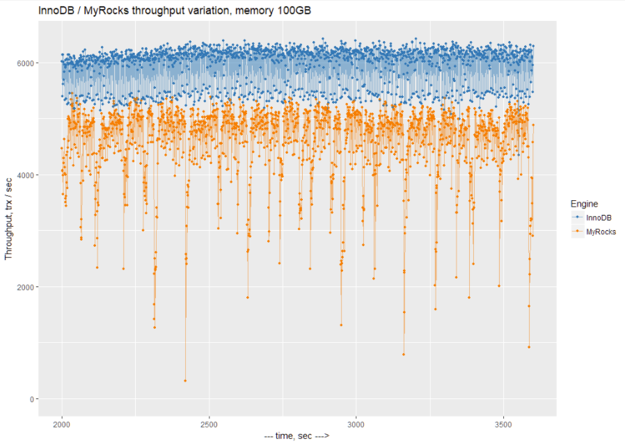
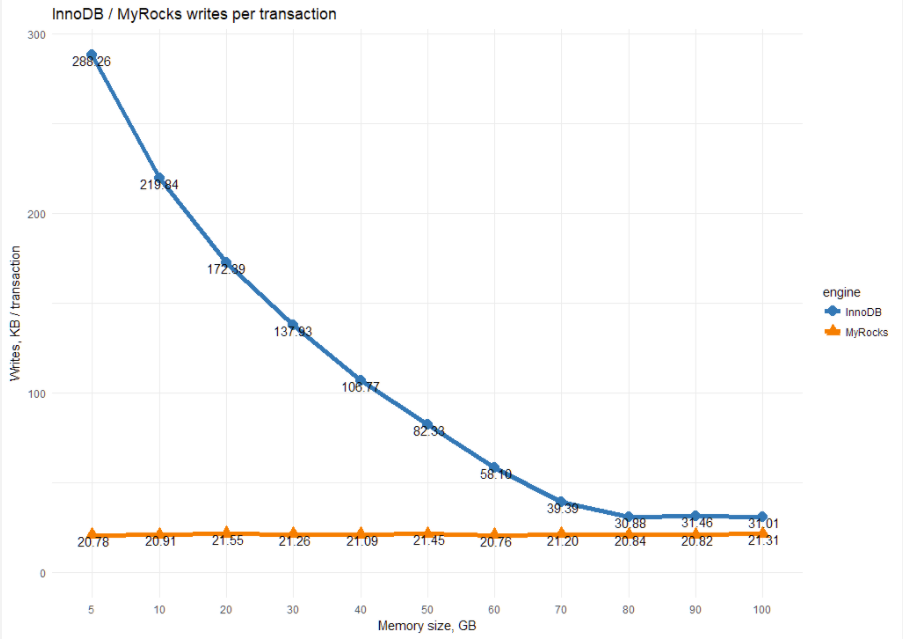
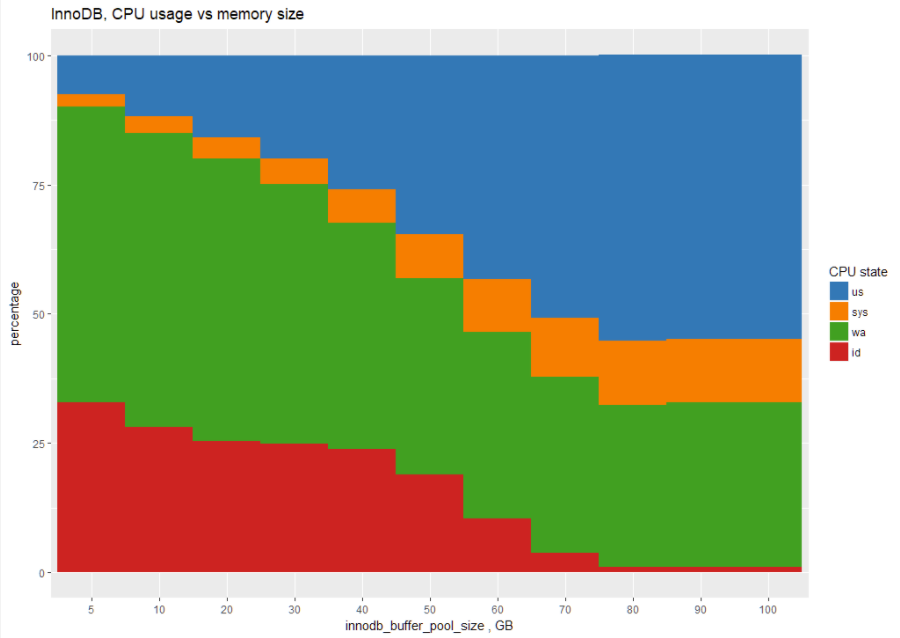
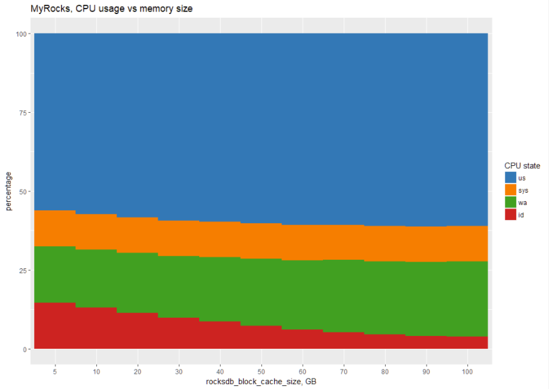

---
> **ARTS-week-36**
> 2022-09-03 14:34
---


###### ARTS-2019 左耳听风社群活动--每周完成一个 ARTS
- Algorithm： 每周至少做一个 leetcode 的算法题
- Review: 阅读并点评至少一篇英文技术文章
- Tip: 学习至少一个技术技巧
- Share: 分享一篇有观点和思考的技术文章

### 1.Algorithm:

- [946. 验证栈序列 (??+)](https://leetcode.cn/submissions/detail/357378258/)  
  + 思路:栈
- [687. 最长同值路径 (??+)](https://leetcode.cn/submissions/detail/358256583/)  
  + 思路:递归-分解问题
- [646. 最长数对链 (??+)](https://leetcode.cn/submissions/detail/358425425/)  
  + 思路: 贪心
- [998. 最大二叉树 II (???+)](https://leetcode.cn/submissions/detail/356876070/)  
  + 思路: 递归-分解问题

### 2.Review:

- [MyRocks 性能](https://www.percona.com/blog/2018/04/30/a-look-at-myrocks-performance/)  

#### 点评：

在这篇博客文章中，我将通过一些基准测试来研究MyRocks的性能。

由于 MyRocks 存储引擎（基于 RocksDB 键值存储 http://rocksdb.org ）现在作为 Percona Server for MySQL 5.7 的一部分提供，我想看看它在相对高端的服务器和 SSD 存储上的表现。我想检查它在给定数据库大小的不同可用内存量下的表现。这类似于我不久前为InnoDB（ https://www.percona.com/blog/2010/04/08/fast-ssd-or-more-memory/ ）发布的基准测试。

在这种情况下，我计划使用 sysbench-tpcc 基准测试（ https://www.percona.com/blog/2018/03/05/tpcc-like-workload-sysbench-1-0/ ），我将为 MyRocks 和 InnoDB 执行它。我们将使用 InnoDB 作为基线。

对于基准测试，我将使用 100 个 TPC-C 仓库，以及一组 10 个表（以消除行争用的瓶颈）。这应该提供大约90GB的数据大小（当加载到 InnoDB 中时），并且大致相当于 1000 个仓库的数据大小。

为了改变内存大小，我将 innodb_buffer_pool_size 从 5GB 更改为 InnoDB 的 100GB，MyRocks 的 rocksdb_block_cache_size。

对于 MyRocks，我们将使用 LZ4 作为磁盘上的默认压缩。MyRocks 存储引擎中的数据大小为 21GB。有趣的是，在 MyRocks 中，未压缩的大小在存储上为 70GB。

对于这两个引擎，我没有使用外键，因为 MyRocks 目前不支持它。

MyRocks 不支持 SELECT ..对于 Percona Server for MySQL 实现中处于可重复读取模式的 UPDATE 语句。但是，“选择..对于更新“在此基准测试中使用。因此，我必须使用受支持的 READ-COMMIT 模式。

我使用的最重要设置是启用二进制日志，原因如下：

任何严谨的生产都使用二进制日志
使用禁用的二进制日志，MyRocks 会受到次优事务协调器的影响
我对二进制日志使用了以下设置：

binlog_format=“ROW”
binlog_row_image=minimal
sync_binlog=10000（我没有使用0，因为这会在二进制日志轮换期间导致严重停滞，此时二进制日志的内容一次全部刷新到存储中）
虽然我还不是 MyRocks 调优的专家，但我使用了此页面中的建议：
https://github.com/facebook/mysql-5.6/wiki/my.cnf-tuning
Facebook-MyRocks 工程团队也为我提供了关于MyRocks最佳设置的意见。

让我们回顾一下不同内存大小的结果。

第一个图表显示了吞吐量抖动。这有助于了解吞吐量结果的分布。吞吐量每 1 秒测量一次，在图表上，我显示一次运行 2000 秒后的所有测量值（每次运行的总长度为 3600 秒）。因此，我显示每次运行的最后 1600 秒（以消除预热阶段）：


为了更好地量化结果，让我们在箱线图上看一下它们。了解箱线图的最快方法是查看中线。它表示测量值的中位数（在 https://www.percona.com/blog/2012/02/23/some-fun-with-r-visualization/ 查看更多内容）：


在我们跳到结果摘要之前，让我们看一下 InnoDB 和 MyRocks 的吞吐量变化。我们将缩放到 100 GB 分配内存的 1 秒分辨率图表：


我们可以看到，MyRocks 的周期性1秒性能下降有很多变化。此时此刻，我不知道是什么原因导致这些下降。

因此，让我们看一下不同内存设置下每个引擎的平均吞吐量（结果以 tps 为单位，越多越好）：

| Memory, GB | InnoDB | MyRocks |
| ---------- | ------ | ------- |
| 5    | 849.0664   | 4205.714
| 10   | 1321.9     | 4298.217
| 20   | 1808.236   | 4333.424
| 30   | 2275.403   | 4394.413
| 40   | 2968.101   | 4459.578
| 50   | 3867.625   | 4503.215
| 60   | 4756.551   | 4571.163
| 70   | 5527.853   | 4576.867
| 80   | 5984.642   | 4616.538
| 90   | 5949.249   | 4620.87
| 100  | 5961.2     | 4599.143

这就是 MyRocks 与 InnoDB 行为不同的地方。 InnoDB 从额外的内存中受益匪浅，最大可达工作数据集的大小。之后，没有理由添加更多内存。

与此同时，有趣的是，MyRocks 并没有从额外的内存中受益匪浅。

基本上，MyRocks 在写入优化引擎中的表现符合预期。有关更多详细信息，请参阅我的文章“三种基本数据结构如何影响存储和检索”。

总而言之，当工作数据集适合（或几乎适合）可用内存时，InnoDB 的性能更好（与自身相比），而 MyRocks 可以在小内存大小上运行（并优于 InnoDB）。

- IO 和 CPU 使用率
值得查看每个引擎的资源利用率。我为每次运行进行了 vmstat 测量，以便我们可以分析 IO 和 CPU 使用情况。

首先，让我们回顾一下每秒写入次数（以 KB/秒为单位）。请记住，这些写入也包括二进制日志写入，而不仅仅是来自存储引擎的写入。

| Memory, GB | InnoDB | MyRocks |
| ---------- | ------ | ------- |
| 5    | 244754.4   | 87401.54
| 10   | 290602.5   | 89874.55
| 20   | 311726     | 93387.05
| 30   | 313851.7   | 93429.92
| 40   | 316890.6   | 94044.94
| 50   | 318404.5   | 96602.42
| 60   | 276341.5   | 94898.08
| 70   | 217726.9   | 97015.82
| 80   | 184805.3   | 96231.51
| 90   | 187185.1   | 96193.6
| 100  | 184867.5   | 97998.26

我们还可以计算每个存储引擎执行的每个事务执行的写入次数：


这张图表显示了 InnoDB 和 MyRocks 之间的本质区别。 MyRocks 作为写入优化引擎，每个事务使用恒定的写入量。

对于 InnoDB，写入量很大程度上取决于内存大小。我们拥有的内存越少，它必须执行的写入操作就越多。

- 那么读呢？
下表显示了每秒 KB 的读取数。
| Memory, GB | InnoDB | MyRocks |
| ---------- | ------ | ------- |
| 5    | 218343.1   | 171957.77
| 10   | 171634.7   | 146229.82
| 20   | 148395.3   | 125007.81
| 30   | 146829.1   | 110106.87
| 40   | 144707     | 97887.6
| 50   | 132858.1   | 87035.38
| 60   | 98371.2    | 77562.45
| 70   | 42532.15   | 71830.09
| 80   | 3479.852   | 66702.02
| 90   | 3811.371   | 64240.41
| 100  | 1998.137   | 62894.54

我们可以将其转换为每笔交易的读取次数：

这显示了MyRocks的读取放大。分配更多内存有助于减少IO读取，但不如InnoDB那么多。

- 处理器使用率
我们还将查看每个存储引擎的 CPU 使用情况。让我们从 InnoDB 开始：


该图表显示，对于 5GB 内存大小，InnoDB 将大部分时间花在 IO 等待（绿色区域）上，CPU 使用率（蓝色区域）随着内存的增加而增加。

这是MyRocks的相同图表：

表格形式：
| Memory, GB | engine | us | sys | wa | id |
| ---------- | ------ | -- | --- | -- | -- |
| 5    |  InnoDB  | 8   | 2  | 57 | 33
| 5    |  MyRocks | 56  | 11 | 18 | 15
| 10   |  InnoDB  | 12  | 3  | 57 | 28
| 10   |  MyRocks | 57  | 11 | 18 | 13
| 20   |  InnoDB  | 16  | 4  | 55 | 25
| 20   |  MyRocks | 58  | 11 | 19 | 11
| 30   |  InnoDB  | 20  | 5  | 50 | 25
| 30   |  MyRocks | 59  | 11 | 19 | 10
| 40   |  InnoDB  | 26  | 7  | 44 | 24
| 40   |  MyRocks | 60  | 11 | 20 | 9
| 50   |  InnoDB  | 35  | 8  | 38 | 19
| 50   |  MyRocks | 60  | 11 | 21 | 7
| 60   |  InnoDB  | 43  | 10 | 36 | 10
| 60   |  MyRocks | 61  | 11 | 22 | 6
| 70   |  InnoDB  | 51  | 12 | 34 | 4
| 70   |  MyRocks | 61  | 11 | 23 | 5
| 80   |  InnoDB  | 55  | 12 | 31 | 1
| 80   |  MyRocks | 61  | 11 | 23 | 5
| 90   |  InnoDB  | 55  | 12 | 32 | 1
| 90   |  MyRocks | 61  | 11 | 23 | 4
| 100  |  InnoDB  | 55  | 12 | 32 | 1
| 100  |  MyRocks | 61  | 11 | 24 | 4

我们可以看到，无论分配多少内存，MyRocks都会使用大量的CPU（处于us+ sys状态）。 这导致的结论是，MyRocks的性能更多地受到CPU性能而不是可用内存的限制。

- MyRocks 目录大小
随着 MyRocks 写入所有更改并压缩 SST 文件，因此在基准测试期间查看数据目录大小如何变化会很有趣，以便我们可以估计我们的存储需求。以下是数据目录大小的图表：


我们可以看到，数据目录从开始时的20GB增加到基准测试期间的31GB。有趣的是，观察数据的增长，直到压缩缩小它。

- 结论
总之，我可以说MyRocks的性能随着数据集大小与内存之比的增加而增加，在5GB内存分配的情况下，它的性能比InnoDB高出近五倍。吞吐量变化是值得关注的，但我希望将来能得到改善。

MyRocks不需要大量内存，并且在使用大部分CPU资源时显示持续的写入IO。

我认为这可能会使MyRocks成为云数据库实例的绝佳选择，其中内存和IO都可能花费很多。MyRocks的部署将使在云中部署的成本更低。

我将跟进进一步的面向云的基准测试。

- 原始结果、脚本和配置

我的目标是提供完全可重复的基准测试。为此，我将共享我在以下 GitHub 存储库中使用的所有脚本和设置：

https://github.com/Percona-Lab-results/201803-sysbench-tpcc-myrocks

MyRocks 性能设置
```
rocksdb_max_open_files=-1
rocksdb_max_background_jobs=8
rocksdb_max_total_wal_size=4G
rocksdb_block_size=16384
rocksdb_table_cache_numshardbits=6

# rate limiter
rocksdb_bytes_per_sync=16777216
rocksdb_wal_bytes_per_sync=4194304

rocksdb_compaction_sequential_deletes_count_sd=1
rocksdb_compaction_sequential_deletes=199999
rocksdb_compaction_sequential_deletes_window=200000

rocksdb_default_cf_options="write_buffer_size=256m;target_file_size_base=32m;max_bytes_for_level_base=512m;max_write_buffer_number=4;level0_file_num_compaction_trigger=4;level0_slowdown_writes_trigger=20;level0_stop_writes_trigger=30;max_write_buffer_number=4;block_based_table_factory={cache_index_and_filter_blocks=1;filter_policy=bloomfilter:10:false;whole_key_filtering=0};level_compaction_dynamic_level_bytes=true;optimize_filters_for_hits=true;memtable_prefix_bloom_size_ratio=0.05;prefix_extractor=capped:12;compaction_pri=kMinOverlappingRatio;compression=kLZ4Compression;bottommost_compression=kLZ4Compression;compression_opts=-14:4:0"

rocksdb_max_subcompactions=4
rocksdb_compaction_readahead_size=16m

rocksdb_use_direct_reads=ON
rocksdb_use_direct_io_for_flush_and_compaction=ON
```

InnoDB 设置
```
# files
innodb_file_per_table
innodb_log_file_size=15G
innodb_log_files_in_group=2
innodb_open_files=4000

# buffers
innodb_buffer_pool_size= 200G
innodb_buffer_pool_instances=8
innodb_log_buffer_size=64M

# tune
innodb_doublewrite= 1
innodb_support_xa=0
innodb_thread_concurrency=0
innodb_flush_log_at_trx_commit= 1
innodb_flush_method=O_DIRECT_NO_FSYNC
innodb_max_dirty_pages_pct=90
innodb_max_dirty_pages_pct_lwm=10
innodb_lru_scan_depth=1024
innodb_page_cleaners=4
join_buffer_size=256K
sort_buffer_size=256K
innodb_use_native_aio=1
innodb_stats_persistent = 1
#innodb_spin_wait_delay=96

# perf special
innodb_adaptive_flushing = 1
innodb_flush_neighbors = 0
innodb_read_io_threads = 4
innodb_write_io_threads = 2
innodb_io_capacity=2000
innodb_io_capacity_max=4000
innodb_purge_threads=4
innodb_adaptive_hash_index=1
```

- 硬件规格
超微服务器：
  中央处理器：
  英特尔（R） 至强（R） 处理器 E5-2683 v3 @ 2.00GHz
  2 个插座 / 28 芯 / 56 个螺纹
  内存：256GB 内存
  存储： 三星 SM863 1.9TB 企业级固态硬盘
  文件系统： ext4
  Percona-Server-5.7.21-20
  操作系统： Ubuntu 16.04.4， 内核 4.13.0-36-通用

### 3.Tip:

#### 使用 document 对象获取 html dom 对象有多少种方法，都是哪些？它们有哪些异同？:

```js
document.getElementById('id')：返回结果是一个对象，如果存在两个标签拥有相同id，则返回第一个标签对象
document.getElementsByTagName('标签名')：返回结果是一个对象集合，以数组形式放在一起
document.getElementsByName('标签name属性的值')：返回结果是一个对象集合，以数组形式放在一起
document.getElementsByClassName('类名')：返回一个对象集合，以数组形式放在一起
通过this参数给函数传递受监控对象
document.documentElement：专门获取html这个标签的
document.body：专门获取body这个标签的
```

#### JS - 实现HTML标签的转义、反转义的几种方法

方法一：通过正则表达式进行替换
```js
// 1.HTML 标签的转义方法
// HTML标签转义（< -> &lt;）
function html2Escape(sHtml) {
 return sHtml.replace(/[<>&"]/g,function(c){
   return {'<':'&lt;','>':'&gt;','&':'&amp;','"':'&quot;'}[c];
 });
}

var text = document.getElementById("input").value;
document.getElementById("message").innerHTML = html2Escape(text);

// 2.HTML 标签的反转义方法
//HTML标签反转义（&lt; -> <）
function escape2Html(str) {
  var arrEntities={'lt':'<','gt':'>','nbsp':' ','amp':'&','quot':'"'};
  return str.replace(/&(lt|gt|nbsp|amp|quot);/ig,function(all,t){
    return arrEntities[t];
  });
}
```

方法二：通过 innerText 与 innerHTML 配合实现转换
这个实现原理是：innerText(textContent) 会获取纯文本内容，忽略 html 节点标签，而 innerHTML 会显示标签内容。
```js
// 1，HTML 标签的转义方法
// 我们先将需转义的内容赋值给 innerText(textContent)，再获取它的 innerHTML 属性，这时获取到的就是转义后文本内容。
// HTML标签转义（< -> &lt;）
function html2Escape(sHtml) {
  var temp = document.createElement("div");
  (temp.textContent != null) ? (temp.textContent = sHtml) : (temp.innerText = sHtml);
  var output = temp.innerHTML;
  temp = null;
  return output;
}

// 2，HTML 标签的反转义方法
// 反转义的方法为先将转义文本赋值给 innerHTML，然后通过 innerText(textContent) 获取转义前的文本内容。
// HTML标签反转义（&lt; -> <）
function escape2Html(str) {
  var temp = document.createElement("div");
  temp.innerHTML = str;
  var output = temp.innerText || temp.textContent;
  temp = null;
  return output;
}
```

方法三：使用 jQuery 进行转换
如果项目中有引入 jQuery 那就更简单了，只需一句话就可以完成转换。其原理同上面的“方法二”是一样的。
```js
// 1，HTML 标签的转义方法
// HTML标签转义（< -> &lt;）
function html2Escape(sHtml) {
  return $("<div/>").text(sHtml).html();
}
// 2，HTML 标签的反转义方法
// HTML标签反转义（&lt; -> <）
function escape2Html(str) {
  return $("<div/>").html(str).text();
}
```

#### chrome 控制台完全支持 jQuery 语法
```js
/**
 * 在控制台粘贴以下代码
 * 注意：1.https页面引用的cdn也必须是https的
 *      2.每个页面是独立的，添加的代码只对当前页有作用，刷新后也必须重新输入代码
 * 国内CDN平台推荐：http://www.bootcdn.cn/jquery/
 */

// http页面先在控制台写如下代码
;(function(d,s){d.body.appendChild(s=d.createElement('script')).src='http://cdn.bootcss.com/jquery/1.11.0/jquery.min.js'})(document);

// https页面先在控制台写如下代码
;(function(d,s){d.body.appendChild(s=d.createElement('script')).src='https://cdn.bootcss.com/jquery/1.11.0/jquery.min.js'})(document);
```

### 4.Share:

- [js中的text()，html() ，val()的区别](https://blog.csdn.net/weixin_43849082/article/details/84934759)

- [MongoDB 基本使用](https://www.cnblogs.com/loveer/p/11396670.html)