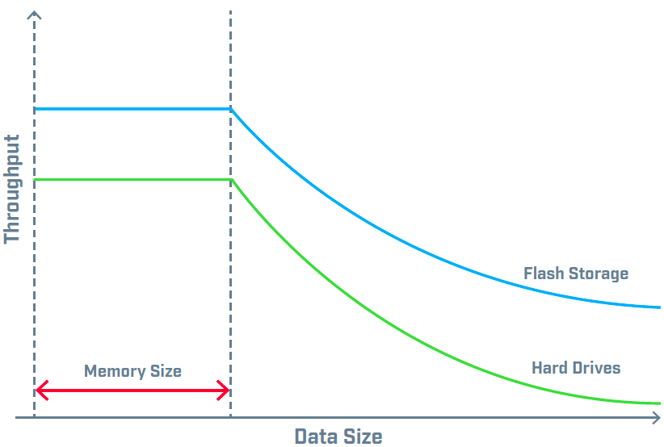
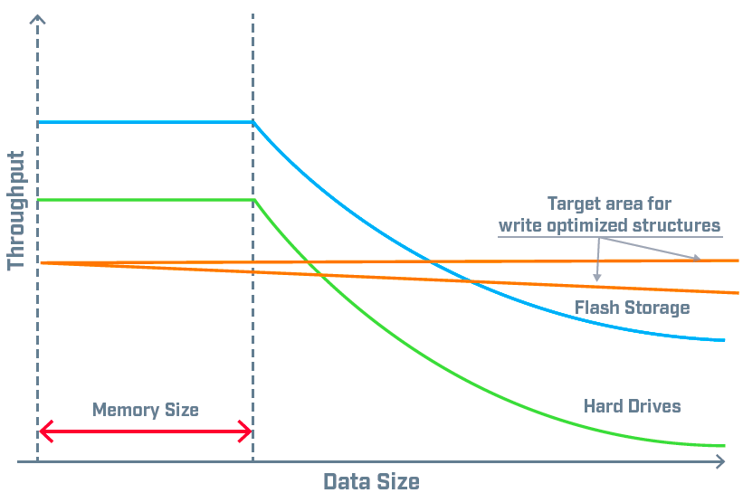
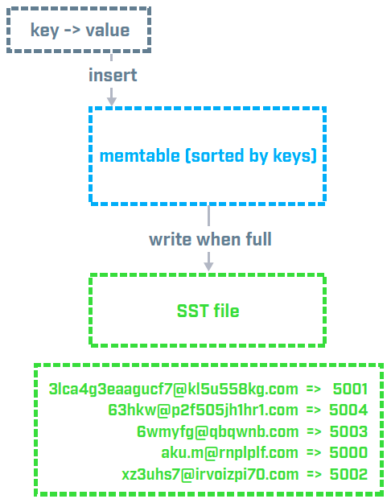
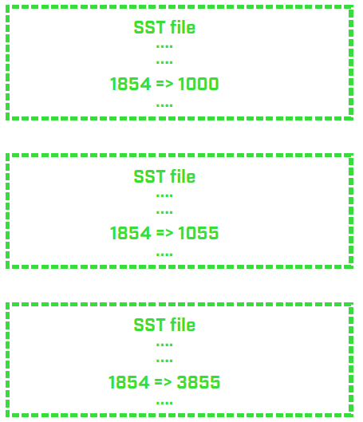
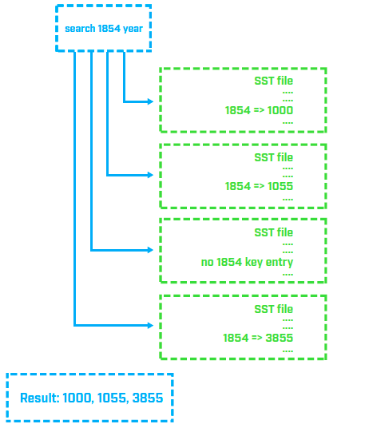
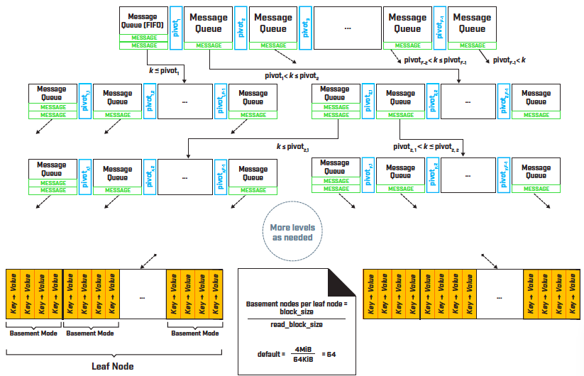

---
> **ARTS-week-37**
> 2022-09-11 8:30
---


###### ARTS-2019 左耳听风社群活动--每周完成一个 ARTS
- Algorithm: 每周至少做一个 leetcode 的算法题
- Review: 阅读并点评至少一篇英文技术文章
- Tip: 学习至少一个技术技巧
- Share: 分享一篇有观点和思考的技术文章

### 1.Algorithm:

- [667. 优美的排列 II (^^+)](https://leetcode.cn/submissions/detail/360830553/)  
  + 思路:双指针
- [669. 修剪二叉搜索树 (^^+)](https://leetcode.cn/submissions/detail/361241370/)  
  + 思路:递归-分解问题
- [433. 最小基因变化 (^^+)](https://leetcode.cn/submissions/detail/361492248/)  
  + 思路: BFS

### 2.Review:

- [三种基本数据结构如何影响存储和检索](https://dzone.com/articles/how-three-fundamental-data-structures-impact-stora)  

#### 点评：

随着我们对应用程序的依赖性越来越大，我们对这些应用程序的期望也越来越高。我们希望应用程序始终处于运行状态，无错误，易于使用，安全并具有高性能。这是一个简单的关系：数据性能支持应用程序性能，而应用程序性能又支持业务性能。就像处理数据的应用程序越来越多一样，存储数据的方法也同样多。如何存储和检索这些数据很重要。为了获得最佳性能，了解存储引擎之间的差异非常重要。使用这些算法之一可能会影响查询的执行方式。本文将讨论数据存储算法以及为什么应该关心它们的运行方式。

- 数据存储和检索
首先，让我们谈谈我们如何与数据交互。有两个主要的数据操作：存储它，然后检索它。在此之上，我们将一些结构应用于数据。主要有两种方法可以做到这一点：
  - 关系数据库管理系统 (RDBMS) 或 "SQL 数据"。
  - 非关系数据库，或 "NoSQL 数据"。
虽然数据可以以许多不同的方式存储，但我们需要有效地组织数据，以便搜索和访问它。对于 SQL 和 NoSQL，这两种解决方案都构建称为"索引"的特殊数据结构。选择的数据结构通常有助于确定存储和检索命令的性能特征。

- B-Tree
传统且广泛使用的数据结构称为 "B-Tree"。B-Tree 结构是计算机科学教科书的标准部分，用于大多数（如果不是全部）RDBMS产品中。B-Tree 数据结构的性能特征是众所周知的。通常，当数据大小适合可用内存时，所有操作都会执行良好。（通过内存，我的意思是RDBMS在物理服务器或虚拟服务器中可访问的RAM量。此内存限制通常是硬性限制。以下是我喜欢用来演示 B-Tree 性能特征的一般图表。



此图表清楚地说明了几点：
 - 一旦数据大小超过可用内存，性能就会迅速下降。
 - 选择基于闪存的存储有助于提高性能，但只是在一定程度上 - 内存限制仍然会导致性能下降。

基于B树的结构旨在实现最佳数据检索性能，而不是数据存储。这一缺点产生了对为数据存储提供更好性能的数据结构的需求。那么，B树什么时候是应用的良好解决方案呢？上图提供了线索：
 - 当数据大小不超过内存限制时
 - 当应用程序主要执行读取 (SELECT) 操作时
 - 当读取性能比写入性能更重要时

可能超过 B 树性能限制的事件包括：接受和存储事件日志;存储来自高频传感器的测量值;跟踪用户点击;等等。在大多数情况下，可以通过更多的内存或更快的物理存储来解决B树性能问题 (见上图) 。但是，当硬件调整不可行时，不同的数据结构可以提供帮助。为写入密集型环境创建了两个新的数据结构：日志结构化合并 (LSM)  树和分形树®。这些结构侧重于数据存储性能，而不是数据检索。



（注意，该图显示了渐近理论趋势。实际性能图表因所涉及的特定实现和软件而异。

在介绍 LSM 和分形树详细信息之前，让我们讨论一下 "key-value" 概念。在任何存储结构中，数据都可以以 key=>value 格式呈现。这对 NoSQL 用户来说很熟悉，但对于 RDBMS 用户来说可能不是。RDBMS 改用与表关联的主键，并且数据在内部表示为 primary_key => table_columns。

例如，用户帐户可能需要以下数据：

```
(user_id; user_name; user_email; user_address;account_name; user_zip; user_year_of_birth)
```

这将表示（使用主键）为：

```
user_id => user_name; user_email; user_address;account_name; user_zip; user_year_of_bi
```

以下任何一项都可以用作二级索引：
 - 通过电子邮件（通过电子邮件快速搜索）：（user_email = > user_id）
 - 按出生年份： （user_year_of_birth => user_id）
 - 按邮政编码： （user_zip => user_id）

按 user_email 搜索 user_name 将分两步完成：
 - 按 user_email 搜索 user_id
 - 按 user_id 搜索 user_name

对此表的"插入"操作可能如下所示：

```
user_id: 1000; user_name: "Sherlock Holmes"; user_email:"sherlock@holmes.guru"; user_address: "221B Baker Street"; account_name: "sherlockh"; user_zip: "NW1 6XE"; user_year_of_birth: 1854
```

此操作的事务将是：
  1.插入到主数据存储（或主键）:
    (1000 => "Sherlock Holmes"; "sherlock@holmes. guru"; "221B Baker Street"; "sherlockh";"NW1 6XE", 1854)
  2.插入到 user_email 索引中: ("sherlock@holmes.guru" => 1000)
  3.插入到 user_year_of_birth 索引中: (1854 => 1000)
  4.插入到 user_zip 索引中: ("NW1 6XE" => 1000)

在初始插入操作之后，后台将有三个额外的操作（称为“索引维护”开销）。此开销可能导致性能下降。假设我们要更新用户的电子邮件记录
(user_id: 2000; new email: "newm@example.com")。将发生以下事务：
  1.主数据存储：find user_id:2000; read email to old_email; rewrite email to "newm@example.com"
  2.电子邮件索引：
    A. Find record with key = old_email; delete it
    B. Insert record (“newm@example.com” => 2000)

顺序键（或单调递增的函数）通常不会给 B-Tree 结构带来问题，而是随机操作会导致性能下降。电子邮件地址是随机插入的一个很好的例子。因此，由于硬件限制，随机操作在性能方面会造成问题 — 随机“修改”操作会导致多个磁盘 IO。
LSM 和分形树都试图通过减少关键操作的随机性来提高性能。这些数据结构还提供了更好的压缩和更小的写入放大，这更适合闪存/固态存储。

- LSM-Tree
第一次提到LSM树可以追溯到1996年，对应于谷歌大表。后来，它被实施在卡桑德拉，水平数据库等产品中，最近在岩石数据库中。
LSM 树的工作原理是：
 - 将传入的修改操作存储在缓冲区中（通常称为“memtable”）
 - 缓冲区已满时对数据进行排序和存储
这是什么样子的？使用前面的示例，我们假设我们注册了以下用户：

```
(user_id: 5000; user_email: "aku.m@rnplplf.com") 
(user_id: 5001; user_email: "3lca4g3eaagucf7@kl5u558kg. com")
(user_id: 5002; user_email: "xz3uhs7@irvoizpi70.com") 
(user_id: 5003; user_email: "6wmyfg@qbqwnb.com") 
(user_id: 5004; user_email: "63hkw@p2f505jh1hr1.com)
```

排序并写入磁盘后，电子邮件索引如下所示：

```
(key=>value) 
3lca4g3eaagucf7@kl5u558kg.com => 5001 
63hkw@p2f505jh1hr1.com => 5004 
6wmyfg@qbqwnb.com => 5003 
aku.m@rnplplf.com => 5000 
xz3uhs7@irvoizpi70.com => 5002
```

这导致整个缓冲区在一个顺序操作中写入内存：



这是好处，但缺点是什么？随着我们继续插入用户并写入磁盘，LSM 会创建越来越多的“SST 文件”。这些文件中的每一个都经过排序，并且没有全局顺序。此外，相同的键（对于非唯一索引）可能最终位于不同的文件中。下图说明了“Year_of_birth”索引的 SST 文件的外观：



此组织使搜索单个文件的速度很快，但全局搜索速度很慢。例如，如果我们想为具有电子邮件 w7hl@125msxuyf7.com 的用户查找“user_id”，则需要单独查找每个文件。这带来了两个问题：
 - 按单个键搜索数据
 - 按一系列键搜索数据（例如，1970 年至 1990 年间具有“year_of_出生”的所有用户）



为了解决 SST 文件的分布式特性，生产软件通常实现不同的维护逻辑：
 - 文件压缩：将文件合并为一个
 - 文件级别：创建文件层次结构，以避免检查每个文件中是否有现有密钥
 - Bloom过滤器：帮助更快地查找单个键（但对范围没有帮助）

- Fractal-Tree

分形树数据结构更接近传统的 B 树结构，但不是立即应用更改，而是缓冲更改。当信息超出主索引内存的限制时，树数据结构会缓冲大量消息。随着缓冲区的填满，缓冲数据会慢慢向下推送树。当数据到达叶节点时，会对数据应用单个 IO。这有助于通过一次执行所有缓冲区更改来避免导致性能下降的随机操作。数据压缩进一步减少了读取 IO。下图演示了缓冲过程：



通过组合所有写入，分形树通过执行单个事务而不是多个随机事务来节省时间。但是，由于大量消息驻留在缓冲区中，因此 SELECT 函数现在必须遍历所有消息才能找到正确的消息（这对于点 SELECT 查询尤其不利）。请记住：主键或唯一键约束需要隐藏点选择查找！这意味着唯一键和非序列主键都是分形树数据结构的性能杀手。分形树对于具有大量表、索引（最好是非唯一索引）和繁重写入工作负载的数据库来说是一个很好的结构。对于存储时间较慢的系统，或者在存储速度快但成本高昂时节省空间，它也有好处。最后，这通常非常适合基于云的数据库环境，在这些环境中，存储通常很慢（或者如果很快，则很昂贵）。

- 对慢速读取的影响
不幸的是，就性能而言，LSM 和分形树对读取操作不太友好。对于 LSM 和分形树结构，直接和隐式读取操作较慢。诸如唯一键约束之类的事情会使插入和更新事务变慢（因为检查后台数据以查看值是否存在）。外键约束也会减慢相应表上的插入和更新事务的速度。某些架构不支持外键（或唯一键，就此而言）。最后，选择索引和联接操作事务也会受到影响。解决此问题的一种方法是使用覆盖索引。覆盖索引包含查询所需的所有或更多列。例如，假设要执行查询：

```
SELECT user_name FROM users WHERE user_email='sherlock@ 
holmes.guru'
```

或者在 MongoDB 表示法:

```
db.users.find( {user_email: "sherlock@holmes.guru" } , 
{user_name : 1} )
```

索引 { user_email => user_id } 会导致两个操作：
 - 按user_email查找user_id
 - user_id查找user_name

一种解决方案是创建索引（在 SQL 语法中）：

```
CREATE INDEX idx_email (user_email, user_name)
```

此查询：

```
SELECT user_name FROM users WHERE user_email='sherlock@holmes.guru'
```

现在可以通过访问索引idx_email来解决，因为“user_name”现在是索引的一部分。这个“技巧”也可以用于 B-Tree ，但它最适合 LSM-Tree 和 Fractal-Tree，以获得额外的索引开销。

- 结论
正如我们所讨论的，可以使用的三种数据结构（B-Tree、LSM-Tree 和 Fractal-Tree）会影响与应用程序相关的数据性能。使用基于这些算法之一的数据库系统可能会影响查询的执行方式。存储方法会影响数据性能，而数据性能是应用程序性能的关键组成部分。的业务取决于应用程序性能，以及的客户如何看待的应用程序的响应情况。

### 3.Tip:

#### Stream to HashMap:
1. Using Collectors.toMap(keyMapper, valueMapper, mergeFunction)

```java
import java.util.HashMap;
import java.util.Map;
import java.util.function.Function;
import java.util.stream.Collectors;
import java.util.stream.Stream;
 
public class StreamToMapUsingCollectorsToMap {
 
    public static void main(String[] args) {
 
        // 1. Stream of String tokens
        Stream<String> nameStream = Stream.of(
                "Rajiv",
                "Anbu",
                "Santosh",
                "Abdul",
                "Lingaraj"
                );
 
 
        // 2. convert Stream<String> to Map<String, Integer>
        Map<String, Integer> map = nameStream
                .collect(Collectors.toMap(
                        Function.identity(), // 1. actual String as KEY
                        String::length,  // 2. String length as their VALUE
                        (key1, key2) -> key1) // 3. duplicate KEY resolver
                        );
 
 
        // 2.1 print to console
        System.out.println("1. Stream to Map conversion : \n\n" + map);
 
 
        // 3. convert Map to HashMap using inter-conversion constructor
        HashMap<String, Integer> hMap = new HashMap<>(map);
 
 
        // 3.1 print to console
        System.out.println("\n\n2. Stream to HashMap conversion : \n\n" + hMap);
    }
}
```

2. Using Collectors.toMap(keyMapper, valueMapper, mergeFunction, supplier)

```java
import java.util.HashMap;
import java.util.function.Function;
import java.util.stream.Collectors;
import java.util.stream.Stream;
 
public class StreamToHashMapUsingCollectorsToMap {
 
    public static void main(String[] args) {
 
        // 1. Stream of String tokens
        Stream<String> nameStream = Stream.of(
                "Rajiv",
                "Anbu",
                "Santosh",
                "Abdul",
                "Lingaraj"
                );
 
 
        // 2. convert Stream<String> to HashMap<String, Integer>
        HashMap<String, Integer> hMap = nameStream
                .collect(Collectors.toMap(
                        Function.identity(), // 1. actual String as KEY
                        String::length,  // 2. String length as their VALUE
                        (key1, key2) -> key1, // 3. duplicate KEY resolver
                        HashMap::new // 4. implementation-class
                        ));
 
 
        // 2.1 print to console
        System.out.println("Stream to HashMap conversion : \n\n" + hMap);
    }
}
```

#### java工具类-StringUtils

判断函数：

```java
1.判断是否为空，返回boolean：
StringUtils.isEmpty(String str)
2.判断是否非空，返回boolean：
StringUtils.isNotEmpty(String str)
3.判断空白，返回boolean：
StringUtils.isBlank(String str)
4.判断非空白，返回boolean：
StringUtils.isNotBlank(String str)
5.判断是否存在空白（数组），返回boolean：
StringUtils.isAnyBlank(CharSequence… css)
6.判断是否存在空（数组），返回boolean：
StringUtils.isAnyEmpty(CharSequence… css)
7.判断不存在空白（数组），返回boolean：
StringUtils.isNoneBlank(CharSequence… css)
8.判断不存在空（数组），返回boolean：
StringUtils.isNoneEmpty(CharSequence… css)
9.判断是否空白，返回boolean：
StringUtils.isWhitespace(CharSequence cs)
```

大小写函数：

```java
1.首字母大写，返回String：
StringUtils.capitalize(String str)
2.首字母小写，返回String：
StringUtils.uncapitalize(String str)
3.全部大写，返回String：
StringUtils.upperCase(String str)
4.全部小写，返回String：
StringUtils.lowerCase(String str)
5.大小写互相转化，返回String：
StringUtils.swapCase(String str)
6.判断是否全大写，返回boolean：
StringUtils.isAllUpperCase(CharSequence cs)
7.判断是否全小写，返回boolean：
StringUtils.isAllLowerCase(CharSequence cs)
```

删除函数：

```java
1.从字符串中删除某字符，返回String：
StringUtils.remove(String str, char remove)
2.从字符串中删除字符串，返回String：
StringUtils.remove(String str, String remove)
3.删除结尾匹配的字符串，返回String：
StringUtils.removeEnd(String str, String remove)
4.删除结尾匹配的字符串，忽略大小写，返回String：
StringUtils.removeEndIgnoreCase(String str, String remove)
5.正则表达式删除字符串，返回String：
StringUtils.removePattern(String source, String regex)
6.删除开头匹配的字符串，返回String：
StringUtils.removeStart(String str, String remove)
StringUtils.removeStartIgnoreCase(String str, String remove)
7.删除所有空格，包括中间，返回String：
StringUtils.deleteWhitespace(String str)
```

字符替换函数：

```java
1.用replacement替换searchString字符串，返回String；
max表示替换个数，默认全替换，为-1，可不填。0表示不换。其他表示从头开始替换n个
StringUtils.replace(String text, String searchString, String replacement, int max)
2.仅替换一个，从头开始，返回String：
StringUtils.replaceOnce(String text, String searchString, String replacement)
3.多个替换, searchList与replacementList需一一对应，返回String：
StringUtils.replaceEach(String text, String[] searchList, String[] replacementList)
4.多个循环替换,searchList与replacementList需一一对应，返回String：
StringUtils.replaceEachRepeatedly(String text, String[] searchList, String[] replacementList)
5.替换start到end的字符，返回String：
StringUtils.overlay(String str,String overlay,int start,int end)
```

拆分合并函数：

```java
1.特定符号分割字符串，默认为空格，可不填，返回字符数组：
StringUtils.split(String str)
2.特定符合分割字符串为长度为n的字符数组,n为0，表示全拆，返回字符数组：StringUtils.split(String str, String separatorChars, int n)
3.合并函数，数组合并为字符串：
StringUtils.join(byte[] array,char separator)
4. 合并函数，separator为合并字符，当为null时，表示简单合并，亦可不填；startIndex和endIndex表示合并数组该下标间的字符，使用separator字符，亦可不填，表示全合并。
StringUtils.join(Object[] array,char separator,int startIndex,int endIndex)
```

截取函数:

```java
1.截取字符串，返回String：
StringUtils.substring(String str,int start)
2.从某字符后字符开始截取，返回String：
StringUtils.substringAfter(String str,String separator)
3.截取至最后一处该字符出现，返回String：
StringUtils.substringBeforeLast(String str,String separator)
4.从第一次该字符出现后截取，返回String：
StringUtils.substringAfterLast(String str,String separator)
5.截取某字符中间的子字符串，返回String：
StringUtils.substringBetween(String str,String tag)
```

删除空白函数:

```java
1.删除空格，返回String：
StringUtils.trim(String str)
2.转换空格为empty，返回String：
StringUtils.trimToEmpty(String str)
3.转换空格为null，返回String：
StringUtils.trimToNull(String str)
4.删除所有空格，包括字符串中间空格，返回String：
StringUtils.deleteWhitespace(String str)
```

判断是否相等函数:

```java
1.判断是否相等，返回boolean：
StringUtils.equals(CharSequence cs1,CharSequence cs2)
2…判断是否相等，忽略大小写，返回boolean：
StringUtils.equalsIgnoreCase(CharSequence cs1,CharSequence cs2)
```

是否包含函数:

```java
1.判断第一个参数字符串，是否都出参数2中，返回boolean：
StringUtils.containsOnly(CharSequence cs,char… valid)
2.判断字符串中所有字符，都不在参数2中，返回boolean：
StringUtils.containsNone(CharSequence cs,char… searchChars)
3.判断字符串是否以第二个参数开始，返回boolean：
StringUtils.startsWith(CharSequence str,CharSequence prefix)
3.判断字符串是否以第二个参数开始，忽略大小写，返回boolean：
StringUtils.startsWithIgnoreCase(CharSequence str,CharSequence prefix)
```

#### java-各种类型判空

集合判空:

```java
import org.springframework.util.CollectionUtils;
CollectionUtils.isEmpty(list)
```

字符串判空:

```java
StringUtils.isEmpty("")
public static boolean isEmpty(String input)
{
  if(input == null || input.length() == 0 || input.equalsIgnoreCase(EMPTY))
  {
    return true;
  }
  return false;
}
```

非字符串判空:

```java
import org.springframework.util.ObjectUtils;
ObjectUtils.isEmpty(fansId)
```

### 4.Share:

- [hashmap 用 stream 流操作 JDK1.8 新特性 Stream 流式操作的具体使用](https://blog.csdn.net/weixin_42384743/article/details/112955283)

- [Zip4j 使用学习](https://www.jianshu.com/p/89bf65317e6b)

- [解决 IntelliJ IDEA中tomcat 控制台中文乱码问题](https://blog.csdn.net/mr_liuhailong/article/details/110264765)