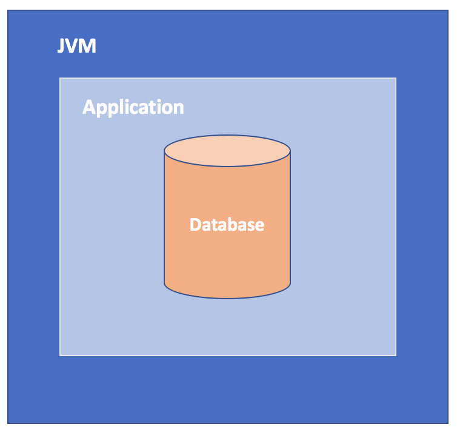

---
> **ARTS-week-38**
> 2022-09-17 20:20
---


###### ARTS-2019 左耳听风社群活动--每周完成一个 ARTS
- Algorithm: 每周至少做一个 leetcode 的算法题
- Review: 阅读并点评至少一篇英文技术文章
- Tip: 学习至少一个技术技巧
- Share: 分享一篇有观点和思考的技术文章

### 1.Algorithm:

- [672. 灯泡开关 Ⅱ (^^+)](https://leetcode.cn/submissions/detail/363366519/)  
  + 思路:数学
- [670. 最大交换 (^^+)](https://leetcode.cn/submissions/detail/362557349/)  
  + 思路:贪心
- [850. 矩形面积 II (^^^?)](https://leetcode.cn/submissions/detail/361492248/)  
  + 思路: 扫描线

### 2.Review:

- [3 个 Java 嵌入式数据库概述](https://dzone.com/articles/3-java-embedded-databases)  

#### 点评：

嵌入式数据库将管理从独立系统迁移到的应用程序。让我们来看看 HSQLDB、H2 和 Apache Derby，看看它们如何与 Java 应用程序配合使用。

嵌入式数据库是合并为应用程序的连接部分的数据库。嵌入式数据库在开发或测试阶段非常有用，因为它们是轻量级的、快速的、可测试性的提高和易于配置的。我们有很多选择来整合嵌入式数据库。在选择一个时，一定要应用实用主义，因为每个都有自己的优点和缺点。



在本文中，我将介绍一些用于使用Java的嵌入式数据库。

- HSQL 数据库（HyperSQL Database）
HSQL 数据库符合 SQL 标准和 JDBC 规范。它支持现代关系数据库所期望的所有核心功能。它可以在嵌入式或服务器模式下运行。超 SQL 数据库内置于纯 Java 中，支持超级 SQL 2.x 中的 JDK 5、6、7 和 8。它为可调用语句和准备语句提供支持，包括批量执行以加快数据处理。从 2.3.x 版本开始，它支持两阶段锁定和多版本并发控制。

该软件包包含一个 JAR 文件，其中包含所需的组件，如超 SQL RDBMS 引擎和用于在 Java 应用程序中嵌入超级 SQL 的 JDBC 驱动程序。

- 连接方式

```
// load the JDBC driver
Class.forName("org.hsqldb.jdbcDriver" );
Connection connection = DriverManager.getConnection("jdbc:hsqldb:testdb", "sa", "");
```

- H2
H2 是 Java SQL 数据库。它是开源的，支持 JDBC 接口。它支持嵌入式模式和服务器模式，并支持行级锁定和多版本并发。

- 连接方式

```
//load the driver
Class.forName("org.h2.Driver" );
Connection connection = DriverManager.getConnection("jdbc:h2:~/test", "sa", "");
```

- Apache Derby

是一个完全用Java实现的开源关系数据库，可在阿帕奇许可证2.0版下使用。它基于 Java、JDBC 和 SQL 标准。它支持客户端/服务器和嵌入式模式。关系数据库的所有标准功能都由 Derby 支持。

- 连接方式

```
//load the driver
Class.forName(“org.apache.derby.jdbc.EmbeddedDriver”);
Connection c = DriverManager.getConnection("jdbc:derby:testdb1;create=true”);
```

- 总结
这些数据库提供程序提供的 JAR 文件包含 CRUD 操作所需的所有组件。使用嵌入式数据库既简单又有趣。只需要记住一些技巧，使的应用程序成功使用嵌入式数据库！


### 3.Tip:

#### Java 中正则验证 URL 是否合法
1. Using Collectors.toMap(keyMapper, valueMapper, mergeFunction)

```java
public static boolean isURL(String str){
    //转换为小写
    str = str.toLowerCase();
    String regex = "^((https|http|ftp|rtsp|mms)?://)"  //https、http、ftp、rtsp、mms
            + "?(([0-9a-z_!~*'().&=+$%-]+: )?[0-9a-z_!~*'().&=+$%-]+@)?" //ftp的user@ 
           + "(([0-9]{1,3}\\.){3}[0-9]{1,3}" // IP形式的URL- 例如：199.194.52.184 
             + "|" // 允许IP和DOMAIN（域名）
             + "([0-9a-z_!~*'()-]+\\.)*" // 域名- www. 
             + "([0-9a-z][0-9a-z-]{0,61})?[0-9a-z]\\." // 二级域名 
            + "[a-z]{2,6})" // first level domain- .com or .museum 
            + "(:[0-9]{1,5})?" // 端口号最大为65535,5位数
            + "((/?)|" // a slash isn't required if there is no file name 
            + "(/[0-9a-z_!~*'().;?:@&=+$,%#-]+)+/?)$"; 
    return  str.matches(regex);
}
```

#### 使用 FastJSON 对 Map/JSON/String 进行互转

1、主要特性
- 高性能
fastjson采用独创的算法，将parse的速度提升到极致，超过所有json库，包括曾经号称最快的jackson。并且还超越了google的二进制协议protocol buf。
- 功能强大
支持各种JDK类型。包括基本类型、JavaBean、Collection、Map、Enum、泛型等。
- 无依赖
不需要例外额外的jar，能够直接跑在JDK上。
- 支持范围广
- 开源

2、 用法

String 转 Json

```java
@Test
public void test(){
    String str = "{\"age\":\"24\",\"name\":\"cool_summer_moon\"}";  
    JSONObject  jsonObject = JSONObject.parseObject(str);
    System.out.println("json对象是：" + jsonObject);
    Object object = jsonObject.get("name");
    System.out.println("name值是："+object);
}
```

Json 转 String：

```java
@Test
public void test(){
    String str = "{\"age\":\"24\",\"name\":\"cool_summer_moon\"}";
    JSONObject  jsonObject = JSONObject.parseObject(str);
    //json对象转字符串
    String jsonString = jsonObject.toJSONString();
    System.out.println("json字符串是：" + jsonString);
}
```

String 转 Map：

```java
@Test
public void test(){
    String str = "{\"age\":\"24\",\"name\":\"cool_summer_moon\"}";
    JSONObject  jsonObject = JSONObject.parseObject(str);
    //json对象转Map
    Map<String,Object> map = (Map<String,Object>)jsonObject;
    System.out.println("map对象是：" + map);
    Object object = map.get("age");
    System.out.println("age的值是"+object);
}
```

Map 转 String：

```java
@Test
public void test(){
    Map<String,Object> map = new HashMap<>();
    map.put("age", 24);
    map.put("name", "cool_summer_moon");
    String jsonString = JSON.toJSONString(map);
    System.out.println("json字符串是："+jsonString);
}
```

Map 转 Json：

```java
@Test
public void test(){
    Map<String,Object> map = new HashMap<>();
    map.put("age", 24);
    map.put("name", "cool_summer_moon");
    String jsonString = JSON.toJSONString(map);
    System.out.println("json字符串是："+jsonString);
}
```

### 4.Share:

- [git rebase详解（图解+最简单示例，一次就懂）](https://blog.csdn.net/weixin_42310154/article/details/119004977)
