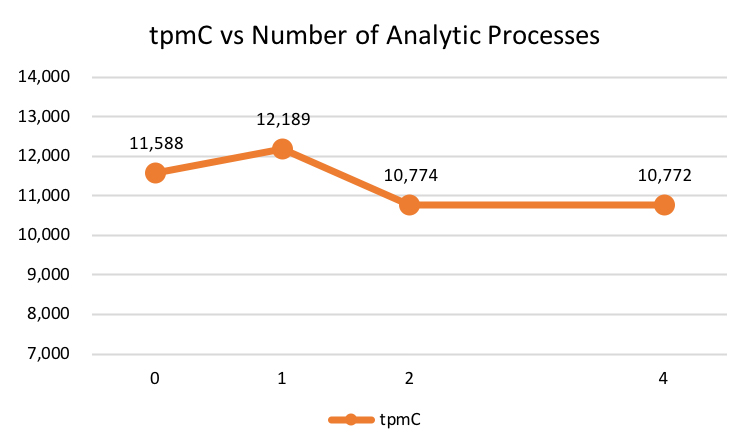

---
> **ARTS-week-39**
> 2022-09-25 10:08
---


###### ARTS-2019 左耳听风社群活动--每周完成一个 ARTS
- Algorithm: 每周至少做一个 leetcode 的算法题
- Review: 阅读并点评至少一篇英文技术文章
- Tip: 学习至少一个技术技巧
- Share: 分享一篇有观点和思考的技术文章

### 1.Algorithm:

- [698. 划分为k个相等的子集 (^^+)](https://leetcode.cn/submissions/detail/365332442/)  
  + 思路:回溯
- [707. 设计链表 (^^+)](https://leetcode.cn/submissions/detail/366431524/)  
  + 思路:设计-链表
- [788. 旋转数字 (^^+)](https://leetcode.cn/submissions/detail/361492248/)  
  + 思路: 模拟

### 2.Review:

- [如何测量用于人工智能应用的 HTAP 数据平台](https://splicemachine.com/blog/how-to-measure-an-htap-data-platform-for-ai-applications/)  

#### 点评：



- 人工智能至关重要
每家公司的董事会都在询问其执行团队如何使用人工智能对业务进行数字化转型。人工智能已经成为一个改变游戏规则的事件。数据科学家现在是企业分析师领域的中流砥柱，为企业寻找下一个可操作的见解。但将人工智能注入业务运营是很困难的。事务数据库捕获企业的运营数据，但要做出自动化决策，人工智能需要分析。这些人工智能系统对分析的要求甚至比传统的决策支持系统更高，需要大量的数据来训练模型，需要实时分析结果来驱动实时预测。

##### 要实现业务数字化转型，AI必须是实时的。为了使AI是实时的，我们需要实时分析。

- 想象一下，一个数据科学团队已经根据供应链和分销渠道中正在发生的事情确定了一个更好的产品促销模型。实时查看业务中发生的事情并在交易发生时提供这些促销活动不是很好吗？
  - 如果我想查看某个地区的供应链和库存状态，以确定我是否要在今天（现在）提供促销活动，以推动更大的销售，该怎么办？
  - 如果我的团队构建了一个预测模型，旨在确定我的销售何时落后于特定地区的供应链，目标是确保我永远不会在当月内积压库存，提高仓库存储和库存持有成本，该怎么办？
  - 如果我想根据他们迄今为止的数量将这些促销活动集中在特定的渠道合作伙伴身上，或者推迟将产品推送给那些本身可能超过库存的合作伙伴，该怎么办？

数据科学家和机器学习工程师正在发现在管理产品可用性、信用风险、欺诈检测、产品整合等方面的机会。

但是，为了充分利用预测模型，业务部门需要在交易发生时实时应用它们，并将其应用于运营数据。为了获得全部收益，促销活动不能建立在预测之上或在事后应用 - 它们需要基于当前发生的事情。

- 大数据有助于找到见解，但随后呢？

大数据、机器学习和许多聪明的开发人员构建了许多聪明的技术，为使人工智能成为商业现实奠定了基础。但是，实时应用它仍然是一个挑战，如果人工智能要推动数字化转型，就需要实时应用它。在 OLTP 数据库和 OLAP 数据存储的分叉世界中，这将继续成为一个问题。

拥有单独的事务性和分析数据存储会形成信息延迟，即事务性数据到达分析并推动 AI 所需的时间。减少这些独立数据系统之间的延迟正是将AI注入业务运营困难的原因。

我们可以专注于通过构建具有高性能 ETL 的更快管道来减少延迟，从我们的 Oracle、Postgres、SQLServer 等中提取事务数据，并将其馈送到 AWS RedShift 或雪花中。但这只会让我们走得更远 - 延迟减少了，但并没有消除。我们仍在移动 TB 级的数据，这需要数小时才能完成。这种级别的ETL涉及重要的系统工程和仅对增量收益的持续关注，增加了一笔费用，而这些费用对实现由AI提供支持的业务的实际目标几乎没有作用。

如果正在处理 PB 级的数据（如 IoT 或 Web 应用程序所示），那么已经在另一个极端规模上与传统 OLAP/OLTP 架构相媲美。在这些情况下，必须将磁带操作，横向扩展的 NoSQL 系统（如卡桑德拉，HBase，Dynamo 或 Redis）到内存中，横向扩展分析系统（如 Hive 或 Spark ）。但是，这些脆弱的松散耦合架构需要稀缺且昂贵的分布式系统工程师将这些计算引擎组合在一起并维持其操作。此外，他们放弃了 ACID 事务和完整的 ANSI SQL 的成熟功能，应用程序开发人员在关系数据库中已经依赖了几十年。

##### 必须有更好的方法

- 进入小时计划
Splice Machine 和其他公司正在推动边界，模糊事务和分析数据存储之间的界限，以便轻松为 AI 应用程序提供支持。

混合事务分析处理（HTAP）背后的想法是将 OLTP 和 OLAP 整合到一个数据平台中，旨在消除信息延迟，将AI直接转移到业务运营中。显然，能够在记录数据库中实时获得分析结果有很大的好处：这就是我如何帮助用户和机器学习模型在交易时刻提供更好的见解的方式。而且，通过表上的事务更新，使数据湖中的分析与业务保持同步肯定会更容易。


显然，有机会并需要了解 HTAP 架构将如何执行并最终为业务支持 AI。使用这种方法可以实现什么性价比？应用程序是否需要数据存储中的相同功能，或者是否有机会使用不同的应用程序模型？将 OLTP 和 OLAP 商店整合到单个平台的能力在多大程度上降低了总体成本，并腾出时间和资源来专注于核心挑战：将 AI 纳入关键任务业务运营？

- HTAP 基准测试
OLTP 和 OLAP 的基准已经存在了一段时间 - TPC-C 本月刚刚满 26 岁。但是，他们已经变得不那么关注解决方案了——“这个数据库能解决我的问题，让我的企业成功，让我的客户满意吗？—有关评估性价比的更多信息。现实情况是，在许多情况下，基准测试已经完成，几乎可以得到所支付的费用。如果基准测试完全纳入的数据库决策，那将是非常切割和干燥的：对于我能负担得起的，这是否足够好？

但对于 HTAP，我们正处于不同的发现阶段。我们正在推动这项技术如何帮助我们以新的方式编写应用程序甚至完成操作系统的界限。HTAP 数据存储需要提供什么？分析存储需要多大的事务性，或者相反，对事务需要多少分析处理？ HTAP 最大的性价比问题不仅围绕着这些并发工作负载的吞吐量，还围绕着我们如何利用这种组合来改进我们的应用程序。

像这样的开放性问题凸显了基准测试对行业和我们实际用户最有意义的好处之一：通常，这不仅仅是关于谁是最好的（记住，这最终只是关于价格/性能），而且随着下一代数据库技术的随时可用，它更多的是关于什么是有意义的指标，转化为对业务有用的指标。

如果我们要就“最佳”的含义以及 HTAP 中的相关内容进行有意义的对话，那么基准测试是一个机会，可以帮助我们构建景观。所以，是的，我们都可以从另一个基准中受益 - HTAP 的基准 - 但更重要的是，随之而来的讨论。我希望这将成为关于该主题的一系列博客文章，并将我们带入一些有趣的方向。

首先，快速更新到目前为止所做的工作。迄今为止，已经提出了一些 HTAP 基准测试，主要是通过利用 OLTP 和 OLAP 各自世界中已经完成的工作。2如果 HTAP 要同时做这两件事，难道不应该同时做这两件事吗？嗯，不一定，但这是一个很好的起点，其中一个基准是 CH-benCHmark，它的名字给出了这一切：TPC-C 中的 "C" 和 TPC-H 的 "H" 放在一个地方。作为起点，它确实有意义。

基准测试的 "C" 端表示订单管理应用程序。输入订单，定价并检查库存。货件已交付。已付款项。而 "H" 面呢？它是许多汇总查询，表示一系列标准业务报告。TPC-H 假设这些数据将从记录的事务数据库中提取，并测量分析数据存储将该数据提取转化为有意义的结果（信息延迟）的速度。

但在 CH-benCHmark 中，事务和分析工作负载要在单个集成架构上一起运行。OLTP 进程和复杂的 OLAP 查询在表上重叠，以强制基础数据库引擎同时对相同数据运行分析和事务工作负荷。这是一个很好的第一次切割。

- HTAP 基准测试框架

为了运行 CH-benCHmark，我们使用的是数据库基准测试框架 OLTP-Bench3，一个“模块化、可扩展和可配置的 OLTP 基准测试工具”。不要让 OLTP 部分欺骗 - 它足够可配置，我们可以使用此框架执行各种操作，包括事务性和分析性操作。此框架的目标是了解一系列不同的基准测试将如何在不同的数据存储上运行 - 从传统的OLTP和OLAP引擎到大数据和noSQL，再到现在的HTAP和拼接机器！这些目标包括组合复杂和可变工作负载的能力。特别是，它可以模拟一些非常现实的场景，包括不同的用户组合（多个业务部门或真正的多租户）以及工作负载组合随时间（一天中的时间，一周中的某一天）的变化。它内置于 Java 中，通过 JDBC 进行连接，旨在轻松插入不同的 DDL 和查询（方言），以支持不同数据存储之间的差异。它还可以支持完全支持 ACID 的数据库以及具有有限事务支持的数据存储。

虽然此框架可能无法提供最高度优化的基准测试结果（数据库供应商传统上为达到最高性价比指标而构建的那种结果），但这种方法提供了更重要的框架，用于了解HTAP如何支持我们的应用程序和复杂的组合工作负载。它为最终用户提供了一种对其流程和应用程序组合进行建模以实现最终目标的方法：规划将AI纳入业务运营。

我们已将对拼接机的支持添加到 OLTP-Bench，我们的项目分支可以[在这里找到](https://github.com/splicemachine/htap-benchmark)。


在 OLTP-Bench 中，客户端驱动程序处理辅助角色并根据用户提供的配置生成工作负荷。在运行期间收集的统计信息将在结果结束时合并。

- 初步结果

通过增加数据集中的仓库数量，与 TPC-C 的扩展方式相同。对于我们的初步结果，我们使用 1000 个仓库运行 - 一个 HTAP-1000。我们有一千个事务性工作线程在“开放”系统模型中执行（这意味着一旦它们完成一项任务，它们就会立即承担下一个任务 -无需等待）。为了了解分析负载如何影响事务吞吐量，以及系统如何同时处理这两个工作负载，我们增加了分析工作线程的数量（包括在开放系统模型中），并测量结果。

在 4 节点群集上使用这些条件下运行 CH-benCHmark 的 OLTP-Bench 时，拼接机的吞吐量为 11，588 tpmC，无需分析工作线程。对于一个分析工作者来说，事务吞吐量实际上略有提高。当我们增加到四名分析工作者时，吞吐量降至 10，772 tpmC，而 tpmC 吞吐量仅减少 7%。

因此，我们有一个解决方案，该解决方案显然已准备好用于组合的HTAP工作负载，并具有单个系统的优势，该系统现在已准备好进行AI操作！

我们计划很快发布更详细的结果。但就目前而言，我们的目标是为，我们的社区提供一些代表性的号码和加入该过程的机会。


那么接下来呢？我们计划使用 OLTP-Bench 做很多事情，其中最重要的是继续扩大结果。我们将研究其他“大数据”数据存储，以了解 Splice Machine 的本机完全符合 ACID 标准的存储如何堆叠，并帮助构建 HTAP /大数据世界中用于管理不同工作负载的数据的选项的图片。与大数据生态系统中的许多其他产品一样，Splice Machine 可以通过外部表与托管表处理各种存储层，从而创建许多不同的选项来管理新数据或组合现有的大规模数据源。特别是，我们接下来将看看Hive，看看它如何堆叠到拼接机或可以在组合环境中工作。

我们计划探索的另一个领域将是候选 HTAP 解决方案中的事务性能力。其他 HTAP 数据库是否为 ACID 事务提供完整的支持？仅支持单个表上的事务的数据存储如何支持 HTAP？我们应该如何思考这个 HTAP 世界中的交易能力？虽然这似乎不像是基准测试的东西，但我们认为这对于理解选项很重要。在这里，我们也将看看 Hive LLAP 以及它在 HTAP 世界中的表现。

我们还将更广泛地研究 HTAP 上的应用程序应该是什么样子。虽然现有的 HTAP 基准测试提案是 TPC-C 和 TPC-H 的衍生产品，但这是否代表了我们应该如何在 HTAP 架构上构建应用程序？对此的类比是电动自行车的基准（我想到这一点，因为在湾区，所有带轮子的东西都被锂离子化了）与传统自行车的对比，但坚持认为为了直接比较，我们需要在关闭电源的情况下进行测试。在HTAP和我们计划注入AI事务的分析中，事务处理应该利用分析，并且分析工作负载将比在 CH-benCHmark 中的 TPC-H 查询下测量的要多样化得多。

最后一个想法是，当我们能够在 HTAP 下将所有内容整合在一起时，数据科学和操作系统的世界将如何发展？我们是否能够将 HTAP 存储视为数据发现和机器学习的环境？我们能否将更多的系统整合到一个地方，从而从我们的基础设施成本和系统工程师那里获得更大的影响力？我们能否进一步缩短信息发现、模型训练和预测分析应用之间的延迟？最终，这些是我们的董事会和执行团队从人工智能应用中寻求的效率和加速。

最后，我们希望我们社区中的也能够贡献和参与此对话。为此，我们[在此处提供了](https://github.com/splicemachine/htap-benchmark) OLTP-Bench 的分叉，在 S3 上提供了我们的数据集，[并在此处提供了快速入门](https://github.com/splicemachine/htap-benchmark/blob/master/quickstart/Quick%20Start.md)。请随时查看、尝试自己的测试、试验对应用程序进行建模的工作负荷，最重要的是，共享结果。


### 3.Tip:

#### maven--mvn 命令
1. 格式

```shell
# 显示版本信息;
mvn -v, --version
# 显示版本信息后继续执行Maven其他目标;
mvn -V, --show-version
# 显示帮助信息;
mvn -h, --help
# 控制Maven的日志级别，产生执行错误相关消息;
mvn -e, –errors 
# 控制Maven的日志级别，产生执行调试信息;
mvn -X, --debug
# 显示maven运行出错的信息；
mvn -e
# 控制Maven的日志级别,仅仅显示错误;
mvn -q, --quiet
# 激活 id 为 xxx的profile (如有多个，用逗号隔开);
mvn -Pxxx
# 指定Java全局属性。如 -Dmaven.test.skip=true 跳过单元测试；
mvn -Dxxx=yyy
# 运行offline模式，不联网更新依赖;
mvn -o , --offline
# 仅在当前项目模块执行命令，不构建子模块;
mvn -N, --non-recursive
# 在指定模块上执行命令;
mvn -pl, --module_name
# 遇到构建失败就直接退出;
mvn -ff, --fail-fast
# 无论项目结果如何,构建从不失败;
mvn -fn, --fail-never
# 仅影响构建结果,允许不受影响的构建继续;
mvn -fae, --fail-at-end
# 如果校验码不匹配的话，构建失败;
mvn -C, --strict-checksums
# 如果校验码不匹配的话,产生告警;
mvn -c, --lax-checksums
# 强制更新snapshot类型的插件或依赖库(否则maven一天只会更新一次snapshot依赖);
mvn -U
# 对任何相关的注册插件,不进行最新检查(使用该选项使Maven表现出稳定行为，该稳定行为基于本地仓库当前可用的所有插件版本);
mvn -npu, --no-plugin-updates
# 对任何相关的注册插件,强制进行最新检查(即使项目POM里明确规定了Maven插件版本，还是会强制更新);
mvn -cpu, --check-plugin-updates
# [mvn -cpu]的同义词;
mvn -up, --update-plugins
# 在非交互（批处理）模式下运行(该模式下,当Mven需要输入时，它不会停下来接受用户的输入，而是使用合理的默认值);
mvn -B, --batch-mode
# 强制使用备用的POM文件;
mvn -f, --file
# 用户配置文件的备用路径;
mvn -s, –settings 
# 全局配置文件的备用路径;
mvn -gs, --global-settings
# 加密主安全密码，存储到 Maven settings文件里;
mvn -emp, --encrypt-master-password
# 加密服务器密码，存储到 Maven settings文件里;
mvn -ep, --encrypt-password
# 对插件版本不使用~/.m2/plugin-registry.xml(插件注册表)里的配置
mvn -npr, --no-plugin-registry 
```

2. 常用 maven 命令

```shell
# 创建 maven 项目
mvn archetype:create
# 指定 group
-DgroupId=packageName
# 指定 artifact
-DartifactId=projectName
# 创建 web 项目
-DarchetypeArtifactId=maven-archetype-webapp
# 创建 maven 项目
mvn archetype:generate
# 验证项目是否正确
mvn validate
# maven 打包
mvn package
# 只打 jar 包
mvn jar:jar
# 生成源码 jar 包
mvn source:jar
# 产生应用需要的任何额外的源代码
mvn generate-sources
# 编译源代码
mvn compile
# 编译测试代码
mvn test-compile
# 运行测试
mvn test
# 运行检查
mvn verify
# 清理 maven 项目
mvn clean
# 生成 eclipse 项目
mvn eclipse:eclipse
# 清理 eclipse 配置
mvn eclipse:clean
# 生成 idea 项目
mvn idea:idea
# 把项目部署到本地 maven 仓库
mvn install
# 把项目部署到本地和远程 maven 仓库
mvn deploy
# 在集成测试可以运行的环境中处理和发布包
mvn integration-test
# 显示 maven 依赖树
mvn dependency:tree
# 显示 maven 依赖列表
mvn dependency:list
# 下载依赖包的源码
mvn dependency:sources
# 安装本地jar到本地仓库
mvn install:install-file -DgroupId=packageName -DartifactId=projectName -Dversion=version -Dpackaging=jar -Dfile=path
```

3.web 项目相关命令

```shell
# 启动 tomcat
mvn tomcat:run
# 启动 jetty
mvn jetty:run
# 运行打包部署
mvn tomcat:deploy
# 撤销部署
mvn tomcat:undeploy
# 启动 web 应用
mvn tomcat:start
# 停止 web 应用
mvn tomcat:stop
# 重新部署
mvn tomcat:redeploy
# 部署展开的 war 文件
mvn war:exploded tomcat:exploded
```

#### IDEA 使用快捷键

```
默认
ctrl + shift + u 大小写转换
CamelCase 插件
shift + alt + u 不停按 u 会自动转换
```

#### java 中 asList() 方法的使用

```java
String s[] = {"aa","bb","cc"};
List<String> sList = Arrays.asList(s);
for(String str:sList){//能遍历出各个元素
    System.out.println(str);
}
System.out.println(sList.size());//为3

System.out.println("- - - - - - - - - - -");

int i[] = {11,22,33};
List intList = Arrays.asList(i);  //intList中就有一个Integer数组类型的对象，整个数组作为一个元素存进去的
for(Object o:intList){//就一个元素
    System.out.println(o.toString());
}

System.out.println("- - - - - - - - - - -");

Integer ob[] = {11,22,33};
List<Integer> objList=Arrays.asList(ob);    //数组里的每一个元素都是作为list中的一个元素
for(int a:objList){
    System.out.println(a);
}

System.out.println("- - - - - - - - - - -");

//objList.remove(0);//asList()返回的是arrays中私有的终极ArrayList类型，它有set,get，contains方法，但没有增加和删除元素的方法，所以大小固定,会报错
//objList.add(0);//由于asList返回的list的实现类中无add方法，所以会报错
```

运行结果：

```shell
aa
bb
cc
3
- - - - - - - - - - -
[I@287efdd8
- - - - - - - - - - -
11
22
33
- - - - - - - - - - -
```

之所以有以上原因，看看asList的源码就明白了：

```java
public static <T> List<T> asList(T... a) {
    return new ArrayList<T>(a);
}

// ...

private final E[] a;
 
ArrayList(E[] array) {
    if (array==null)
        throw new NullPointerException();
    a = array;
}

// 如果想根据数组得到一个新的正常的list,当然可可以循环一个一个添加，也可以才有以下2个种方法：
ArrayList<Integer> copyArrays=new ArrayList<Integer>(Arrays.asList(ob)); // 这样就是得到一个新的 list，可对其进行 add,remove 了
copyArrays.add(222); // 正常，不会报错
        
Collections.addAll(new ArrayList<Integer>(5), ob); // 或者新建一个空的 list,把要转换的数组用 Collections.addAll 添加进去

// 如果想直接根据基本类型的数组如 int[],long[] 直接用 asList 转成 list,那么我们可以选择用 apache commons-lang 工具包里的数组工具类 ArrayUtils 类的 toObject() 方法，非常方便，如下：
Arrays.asList(ArrayUtils.toObject(i)); // 上边的代码：int i[] = {11,22,33}; 达到了我们想要的效果
```

### 4.Share:

- [历程剖析：阿里云自研HTAP数据库的技术发展之路](https://developer.aliyun.com/article/193401)

- [分库分表：TIDB](https://i4k.xyz/article/dabaoshiwode/110914448)

- [数据系统的概述](https://www.cnblogs.com/sfzlstudy/p/15892946.html)

- [三高Mysql - Mysql特性和未来发展](https://blog.51cto.com/u_15526925/5197915)

- [1.1 A Brief History of Distributed Database（分布式数据库发展简史）](https://www.toberoot.com/database/tidb/tidb_courses/110.html)

- [一份难得的数据库市场分析报告](https://aijishu.com/a/1060000000128340)

- [让RDS（for MySQL）数据库的慢日志、审计日志跨空间转存OBS变得更加自动化](https://bbs.huaweicloud.com/blogs/360430)

- [关于java：如何避免“安全性-从非恒定字符串生成预准备语句” FindBugs警告](https://www.codenong.com/10500305/)

- [java中asList()方法的使用](https://blog.csdn.net/rocling/article/details/102768442)