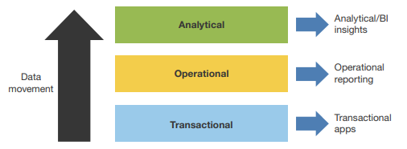
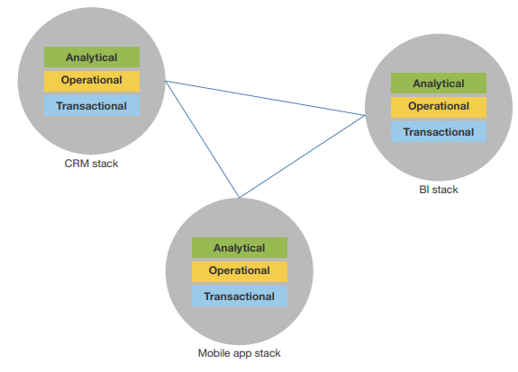
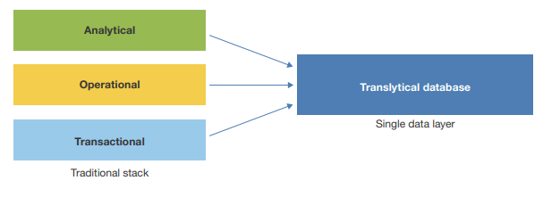
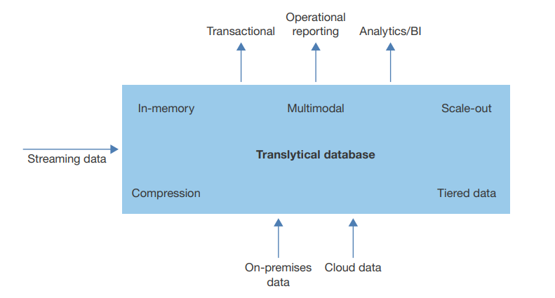

---
> **ARTS-week-41**
> 2022-09-30 20:35
---


###### ARTS-2019 左耳听风社群活动--每周完成一个 ARTS
- Algorithm： 每周至少做一个 leetcode 的算法题
- Review: 阅读并点评至少一篇英文技术文章
- Tip: 学习至少一个技术技巧
- Share: 分享一篇有观点和思考的技术文章

### 1.Algorithm:

- [396. 旋转函数 (^^+)](https://leetcode.cn/submissions/detail/369151954/)  
  + 思路:数学
- [921. 使括号有效的最少添加 (^^+)](https://leetcode.cn/submissions/detail/369663498/)  
  + 思路:模拟
- [811. 子域名访问计数 (^^^?)](https://leetcode.cn/submissions/detail/369940760/)  
  + 思路: 哈希

### 2.Review:

- [交易分析型数据库以交易速度提供分析](http://www.odbms.org/wp-content/uploads/2017/10/Forrester-report-Translytical-Databases.pdf)  
  - 针对不同工作负载的单独系统是影响业务增长和创新
  - 提供单一数据库支持交易和分析
  - 事务分析数据库市场正在蓬勃发展快速与新的和传统的供应商合作

#### 点评：

- 业务需求要求信息无延迟
如今，数据是任何企业的关键资产，而这种资产需要随时可供员工使用，合作伙伴和客户。我们发现，企业架构师已经构建了单独的技术堆栈，用于交易性、运营性和分析性工作负载，使得访问正确的工作负载极具挑战性在适当的时间提供信息以支持实时业务（如图）


传统技术栈支持各种工作负载

数据必须从交易系统转移到操作系统，然后再转移到分析系统。这种架构分离导致延迟提供及时的分析和实时见解 —商业智能 （BI） 通常远非最佳。陈旧的报告，缺失的数据，缺乏先进的分析，而完全缺乏实时分析对于任何企业来说都是无法忍受的状态：需要新的方案才能在客户时代保持竞争力。业务用户不想要昨天的数据明天看。组织已经构建了太多孤立的技术栈，包括那些用于BI，大数据，物联网（IoT），企业资源规划（ERP），CRM，供应链的那些管理 （SCM）、云和移动。单独管理，使及时、集成的数据复杂化交付给业务用户、客户和合作伙伴（请参阅图 2）


大多数企业都有多个技术栈

虽然所有这些技术栈都旨在改善组织的业务成果，但它们通常无法提供支持实时业务需求，造成数据孤岛，保证延迟，并成为管理的挑战。现实情况是，大多数企业都在努力。

  - 集成交易和关系数据。大多数企业拥有不断增长的数百个投资组合应用程序都是关键业务和客户数据的来源。孤立、不透明的数据池是企业的现实，也是BI专业人士的祸根。数据来源于传统技术栈通常会造成僵局，从而减慢数据转换、移动和处理速度。

  - 获取了解用户所需的超粒度分析。大多数公司存储他们在孤岛中收集的用户数据，可用性有限。但是，在Facebook, Instagram, 和 Twitter 等社交媒体上，消费者生成的内容量不断增加，从而提供了丰富的信息。关于用户可用。通过智能手机和平板电脑的移动连接甚至可以收集更多数据，例如地理位置，可用于了解用户在整个过程中的行为。这些数据源的集成视图可以为您提供前所未有的详细信息您的用户。

  - 提供实时分析需求以运行业务。数据是任何企业的关键资产，但此资产需要随时实时提供给员工、合作伙伴和客户。企业经常将对实时和近实时数据的支持作为顶级数据管理要求，特别是随着用户越来越多地采用移动业务应用程序。但是，传统技术栈减慢了数据处理和交付速度，主要是因为硬件速度较慢平台、不可扩展的数据平台、非优化的计算架构或批处理数据集成过程。

- 新的HTAP 数据库使技术堆栈崩溃

HTAP 数据库的想法很简单：它们结合了事务性、操作性和将分析数据库合并为一个数据库实例（如图）。


将技术栈折叠到单个数据层

为什么使用两个或三个单独的用于交易和分析的数据库？单独的系统支持性能和可扩展性，但减慢及时分析和运营见解的交付速度。事务数据库高度针对事务完整性和并发性至关重要的写入进行了优化。分析数据库针对大量数据上的聚合是常态的读取进行了优化。HTAP 数据库使用新的创新技术针对读取和写入进行了优化支持多工作负载并发。弗雷斯特将瞬解数据库定义为：
    支持事务、分析以及其他工作负载和访问模式的统一数据库实时运行，无需牺牲事务完整性、性能或可扩展性。
HTAP 数据库的主要优点包括（如图）


HTAP 数据库架构

  - 支持更快的一切。瞬解提供速度，因为它消除了运动将数据传输到运营和分析平台。它可以支持标准的操作、战术和战略分析，当与BI工具结合使用时，它可以提供实时分析。
  - 将复杂性降至最低。更多的系统意味着更多的成本和管理难题。透析通过消除支持多个数据库，基础架构的需要，将复杂性降至最低，集成和数据移动技术以及随之而来的安全挑战。
  - 帮助跨不同数据源提供集成的数据。也可以 HTAP 支持可以集成不同数据源（如打包数据源、旧数据源和实时自定义应用程序和内容，以支持业务需求。
  - 为所有类型的数据启用数据交付。HTAP 可以支持访问和集成各种类型的数据，包括结构化和非结构化数据，如XML，日志，文本文件，音频、文档、视频和空间数据。

- HTAP 数据库提供新的创新特性和功能
虽然从技术上讲，可以针对单个数据库运行多个工作负载，但有一些传统的数据库解决方案，这些解决方案无法水平扩展，支持大量数据或处理以优化的方式提供非结构化数据，以支持新的业务需求。HTAP 数据库，另一方面，它是围绕新的和不断发展的技术创新而建立的，这些创新使运行多个工作负载可行。构成 HTAP 数据库的关键技术包括：
  - 内存 — 提供极快的读写性能。数据存储在内存中访问速度比存储在磁盘上的数据快几个数量级。而数据库和数据自 20 世纪 80 年代以来，仓库一直使用易失性内存来缓存数据，以支持更高的命中率，这些缓存的大小通常只有几兆字节。多年来，随着内存价格的降低，它们已逐渐增加到千兆字节。但是使用分布式内存技术，您可以完全动态存储数百 TB 到多字节规模的数据库随机存取存储器。
  - 横向扩展架构 — 支持弹性平台。分布式数据库提供横向扩展（水平）体系结构，并支持复杂查询处理等高级功能、分布式锁管理、分布式记录管理和表管理可以跨越群集中的数百个和数千个节点。使用弹性扩展，您可以有效地支持任何类型的高性能应用程序，包括复杂的社交网络应用程序，推荐引擎、模式分析和其他互联网规模的应用程序。
  - 数据压缩 — 在内存中存储更多数据。虽然数据压缩技术具有已经存在了几十年，直到最近才变得可行，以支持行，列和表级数据库压缩。通常，压缩可以将数据库大小减少 35% 或更多，并且在某些情况下，高达75%，具体取决于数据的类型和模式。供应商有缓解了历史的担忧，即压缩可能会随着进步而对性能产生影响例如将压缩算法放在芯片上，从而将系统影响降至最低。
  - 数据分层 — 促进跨多个存储层的数据分布。动态数据分层使您能够通过使用固态闪存创建比可用内存更大的表驱动器 （SSD） 和磁盘，以及数字内存。一些HTAP 数据库可以自动和根据使用情况、策略和查询访问分析在各层之间智能地移动数据和模式。
  - 多模式 — 为数据库中的多种数据类型提供支持。传统已经存在单独的数据库来支持行、列、XML 和对象。然而HTAP 数据库支持多模态格式，允许存储多种格式，已处理并交付给使用应用程序或进程。

- HTAP 数据库提供新的业务用例
HTAP 数据库提供了支持许多用例的能力，包括实时见解，预测分析、流分析、实时数据访问和极端事务处理。在单个集成的 HTAP 平台中存储和处理客户数据，使企业能够实现根据客户的喜好，不喜欢，购买模式，朋友圈，追加销售和交叉销售新产品，和过去的订单。Forrester 见过的顶级 HTAP 数据库工作负载包括：
  - 实时应用程序 — 分秒必争。HTAP 可以帮助提供实时应用程序支持操作应用程序，如股票交易、欺诈检测、反恐、患者健康监测、机器分析和地震监测。这些应用程序需要 24/7 全天候数据低延迟访问，甚至持久化数据都可能导致不可接受的速度减慢。虽然很多公司已经使用实时应用程序几十年了，在 HTAP 数据库之前，这样的应用程序需要大量的应用程序设计、编码和定制。
  - 移动应用程序 — 需要快速交互的应用。移动用例可实现丰富的交互以及利用平板电脑、智能手机和可穿戴设备等新设备进行高级分析。移动应用程序需要来自多个技术堆栈的实时数据，以提供客户、产品、员工或业务的 360 度视图。
  - IoT 应用程序 — 运营效率需要改进。现在，大多数制造商处理高度复杂的机械来支持他们的工厂，无论是建筑、飞机、汽车、轮胎或装瓶酒或苏打水。当机器出现故障时，它可能会花费制造商每小时数百万美元，在某些情况下，每分钟。使用物联网传感器，流媒体，机器学习和内存技术，制造商能够跟踪机器每分钟，甚至每秒，以预测是否有任何机器可能发生故障以及决定如果发生故障，他们可能需要哪些零件或资源进行维修。
  - 互联数据应用 — 集成业务数据至关重要的应用。传统提取物，转换和加载 （ETL） 流程无法提供实时更改。HTAP 克服通过提供关键业务数据的实时、可信视图，确保信息来源准确无误，可保证整个组织的一致性。例如客户的地址可能存储在五个或更多不同的数据库中，并且一个数据库会更改应用程序可能不会立即对其他应用程序用户可见。在这种情况下，将所有客户关键数据存储在 HTAP 数据库中的内存中允许所有业务应用程序使用它，提供一致性和完整性。

- HTAP 数据库市场即将爆发
Forrester 预计，HTAP 数据库平台市场将在未来几年，随着组织开始推出统一的数据平台来支持持续分析，极端交易和运营智能报告。供应商刚刚开始划伤表面用于 HTAP 数据库平台，可能会提供更多创新和功能丰富的产品随着供应商执行其战略，在未来几年中出现。虽然有很多供应商开始提供 HTAP 数据库，在当前顶级供应商中：
  - DataStax 提供了一个分布式的可扩展数据平台。数据高峰企业 （DSE） 是一个数据库平台基于 Apache Cassandra，专为满足物联网、Web、移动和极大规模应用程序。DSE具有无主的共享架构，具有内存功能和内置的分析搜索功能，可以跨数据中心和云平台进行扩展，以提供安全的分布式全球数据平台。
  - IBM 拥有多个 HTAP 数据库产品来支持广泛的用例。国际教育联盟具有 BLU 加速功能的 DB2 和具有信息加速器的通知软件提供事务性和各种分布式平台上的分析工作负载，利用内存中的列式无需更改或调整应用程序的方法。此外，IBM DB2 for z/OS 集成了借助 IBM DB2 分析加速器 （IDAA），实现对事务数据的实时分析。
  - MemSQL 提供了一个可行的 HTAP 数据库。MemSQL 是一个分布式内存数据库提供完全原子性、一致性、隔离性和持久性 （ACID） 合规性和极端性性能，以支持单个数据库中的事务、操作和分析工作负载。MemSQL 使用 SQL 和水平可扩展的分布式架构，该架构在商品上运行硬件或云中。MemSQL 还支持在 Apache Spark 上进行分析处理。一些 MemSQL 的大型客户部署包括 Comcast, Shutterstock, and Zynga。我们发现一些公司使用 MemSQL 通过利用数据来更好地预测和应对机会实时，提供客户的 360 度视图。
  - 微软针对统一 OLTP 和 OLAP 工作负载的解决方案正在增加。虽然微软一直为联机事务处理 （OLTP） 和联机提供多个数据库引擎分析处理 （OLAP），其即将推出的 SQL Server 2016 版本将提供单个统一数据库，用于这些工作负载。在 SQL Server 2012 中，微软为数据仓库提供了内存中列存储，以支持更快的商业智能、分析和预测分析学。SQL Server 2014 提供了一个内存中 OLTP 数据库平台，以支持高性能事务应用程序，只需对应用程序进行最少的更改。使用 SQL Server 2016，微软提供了将内存中列存储与内存中 OLTP 一起使用的功能用于内存中性能和实时操作分析。
  - Oracle 的 HTAP 数据库平台专注于多个负载。甲骨文提供甲骨文数据库内存中，一个扩展 Oracle 数据库 12c 以支持这两个事务的选项和同一数据库中的分析。它不需要更改现有的 Oracle 应用程序和支持 OLTP 和 OLAP 应用程序的水平缩放。Forrester 与多位客户进行了交谈运行 TimesTen 以及 Oracle 数据库内存中，支持多个平台工作量。对于需要更大内存占用空间的客户，Oracle 使用 Oracle Exadata 设备或任何 Oracle RAC 环境提供了一个横向扩展内存平台。
  - SAP 提供了一个可扩展的HTAP 数据库。SAP 韩亚纳是领先的分布式产品之一 HTAP 数据库。SAP 使用全新的数据库和数据方法开发了 Hana 通过将缓慢旋转的磁盘层从技术环境中移除来提供管理对单个数据拷贝的实时洞察和数据处理功能 — 全部驻留内存，可用于应用程序处理。SAP Hana 支持融合的 OLTP 和 OLAP符合 ACID 标准的数据处理，消除数据冗余，并提供低延迟数据访问实时报告、规划和预测。虽然 SAP Hana 可以支持任何业务应用程序，Forrester 看到它最常用于 SAP BW，SAP业务套件，实时应用程序和自定义分析。
  - VoltDB 提供了一个可行的HTAP 数据库平台。VoltDB 是一个内存数据库在单个集成平台中将流分析与事务相结合的平台。它支持 ACID 合规性、高性能和低延迟的数据访问，具有可扩展性分布式无共享内存中数据库。VoltDB 依赖于数据的水平分区在商用硬件和公共云上进行横向扩展。它还支持同步复制在数据库集群中以支持高可用性。与其他供应商不同，VoltDB 可用作为 Affero 通用公共许可证 （AGPL） 以及 a商业许可证。通常，客户使用 VoltDB 来支持电信、金融服务、能源、能源领域的实时分析以及低时速事务和运营应用程序。广告、安全和游戏行业。

- HTAP 数据库应成为数据库策略的一部分
延迟的洞察可能会对公司赢得、服务和留住客户的能力产生破坏性影响。企业架构师应该关注专注于折叠和整合的 HTAP 数据库技术堆栈，可帮助提供业务敏捷性、新见解、改进的性能和竞争力边缘。HTAP 数据库使企业能够专注于核心业务功能和创新而不是应对复杂技术的挑战。利用这项新技术:
  - 从折叠和整合一些技术堆栈开始。不要抱有野心尝试将所有企业应用程序和堆栈整合到一个HTAP 中的项目框架。最初从一个或两个关键技术堆栈（如 BI 或 ERP）开始，然后添加其他随时间推移的堆栈。
  - 基于特定数据域构建 HTAP 数据库。不要合并多个将不同领域的技术堆栈（如工程和财务数据堆栈）合二为一 HTAP 数据库（如果两个数据集之间没有关联）。
  - 将分层存储用于大型数据库。虽然内存中的数据会给你极端性能，但分层存储（如闪存、SSD 和磁盘），可以运行数百 TB 或数 PB。
  - 在集成多个工作负载时，请牢记安全性。大多数企业执行不同的事务处理和分析用例的安全控制。让这些工作负载正常工作在相同的数据集和数据库上，可能需要新的策略和控制。
  - 使用工作负载管理将对事务的影响降至最低。不允许失控查询或复杂的分析查询以影响事务性活动。考虑工作负载管理HTAP 数据库中对某些用户、查询或工作负载实施限制的功能系统资源消耗，如中央处理器 （CPU） 或内存带宽。
  - 寻找需要最少编码或对现有应用进行更改的解决方案。如果您希望整合特定应用程序或分析的事务和分析平台，查看能够以最少的代码自动执行集成和迁移的解决方案，以及配置更改。

- 传统的事务数据库和数据仓库供应商必须做出响应
Forrester 认为，企业客户会发现 HTAP 数据库极具吸引力因为它们将带来更低的成本、更快的洞察和数据敏捷性。纯事务数据库将生存多年，数据仓库 （DW） 也是如此。但数据技术颠覆无处不在，这不仅仅是关于 Hadoop，NoSQL 和 Spark。技术的整合将极大地增加简化自大型机是唯一的大型机以来企业一直忍受的阻抗不匹配提供计算和数据平台。企业架构专业人士应该关注技术数据库供应商，流分析供应商和大数据平台之间的联盟，以创建下一代 HTAP 数据库。

### 3.Tip:

#### Adding header for HttpURLConnection

```java
URL myURL = new URL(serviceURL);
HttpURLConnection myURLConnection = (HttpURLConnection)myURL.openConnection();

String userCredentials = "username:password";
String basicAuth = "Basic " + new String(Base64.getEncoder().encode(userCredentials.getBytes()));

myURLConnection.setRequestProperty ("Authorization", basicAuth);
myURLConnection.setRequestMethod("POST");
myURLConnection.setRequestProperty("Content-Type", "application/x-www-form-urlencoded");
myURLConnection.setRequestProperty("Content-Length", "" + postData.getBytes().length);
myURLConnection.setRequestProperty("Content-Language", "en-US");
myURLConnection.setUseCaches(false);
myURLConnection.setDoInput(true);
myURLConnection.setDoOutput(true);
```

#### HttpURLConnection 忽略 https 认证

```java
 public static Bitmap getBitmapFromURL(String src) {
    try {
      URL url = new URL(src);
      HttpURLConnection connection = (HttpURLConnection) url.openConnection();

      boolean useHttps = src.startsWith("https");
      if (useHttps) {
        HttpsURLConnection https = (HttpsURLConnection) connection;
        trustAllHosts(https);
        https.setHostnameVerifier(DO_NOT_VERIFY);
      }

      connection.setDoInput(true);
      connection.connect();
      InputStream input = connection.getInputStream();
      return BitmapFactory.decodeStream(input);
    } catch (IOException e) {
      return null;
    }
  }

  /**
   * 覆盖 java 默认的证书验证
   */
  private static final TrustManager[] trustAllCerts = new TrustManager[]{new X509TrustManager() {
    public java.security.cert.X509Certificate[] getAcceptedIssuers() {
      return new java.security.cert.X509Certificate[]{};
    }

    public void checkClientTrusted(X509Certificate[] chain, String authType)
            throws CertificateException {
    }

    public void checkServerTrusted(X509Certificate[] chain, String authType)
            throws CertificateException {
    }
  }};

  /**
   * 设置不验证主机
   */
  private static final HostnameVerifier DO_NOT_VERIFY = new HostnameVerifier() {
    public boolean verify(String hostname, SSLSession session) {
      return true;
    }
  };

  /**
   * 信任所有
   * @param connection
   * @return
   */
  private static SSLSocketFactory trustAllHosts(HttpsURLConnection connection) {
    SSLSocketFactory oldFactory = connection.getSSLSocketFactory();
    try {
      SSLContext sc = SSLContext.getInstance("TLS");
      sc.init(null, trustAllCerts, new java.security.SecureRandom());
      SSLSocketFactory newFactory = sc.getSocketFactory();
      connection.setSSLSocketFactory(newFactory);
    } catch (Exception e) {
      e.printStackTrace();
    }
    return oldFactory;
  }
```


### 4.Share:

- [java日志篇（4）-common-logging](https://www.jianshu.com/p/258d3bd72005)

- [Log4J进阶](https://bryantchang.github.io/2018/05/30/log4j-adv/)