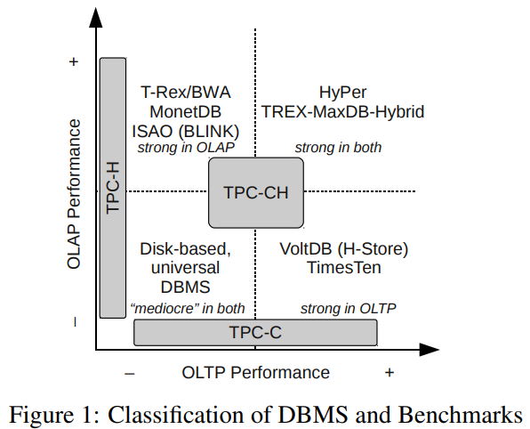
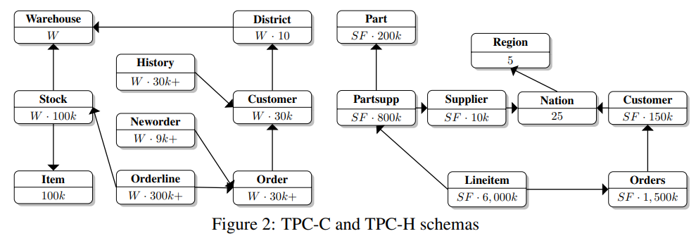

---
> **ARTS-week-41**
> 2022-09-30 20:35
---


###### ARTS-2019 左耳听风社群活动--每周完成一个 ARTS
- Algorithm： 每周至少做一个 leetcode 的算法题
- Review: 阅读并点评至少一篇英文技术文章
- Tip: 学习至少一个技术技巧
- Share: 分享一篇有观点和思考的技术文章

### 1.Algorithm:

- [788. 旋转数字 (^^+)](https://leetcode.cn/submissions/detail/366858608/)  
  + 思路:数学
- [面试题 17.09. 第 k 个数 (^^+)](https://leetcode.cn/submissions/detail/368274215/)  
  + 思路:优先队列
- [面试题 01.08. 零矩阵 (^^+)](https://leetcode.cn/submissions/detail/368858335/)  
  + 思路: 模拟

### 2.Review:

- [对混合 OLTP&OLAP 数据库系统进行基准测试](https://subs.emis.de/LNI/Proceedings/Proceedings180/390.pdf)  

#### 点评：

最近，已经为运营或实时商业智能（BI）提供了案例。由于OLTP数据库和OLAP数据仓库的传统分离显然会给操作BI带来严重的延迟缺点，因此正在开发混合OLTP&OLAP数据库系统。第一代这种混合OLTP&OLAP数据库系统的出现需要表征其性能的方法。虽然有标准化且广泛使用的基准测试来解决 OLTP 或 OLAP 工作负载，但缺乏混合基准测试导致我们定义了新的混合工作负载基准测试，称为 TPC-CH。此基准测试弥合了现有单工作负载套装之间的差距：用于 OLTP 的 TPC-C 和用于 OLAP 的 TPC-H。新提出的 TPC-CH 基准测试执行混合工作负载：基于 TPC-C 的订单输入处理的事务性工作负载，以及此销售数据库上相应的 TPC-H 等效 OLAP 查询套件。由于它源自这两个使用最广泛的 TPC 基准测试，因此我们新的 TPC-CH 基准测试产生的结果与混合系统和经典的单工作负载系统具有高度可比性。因此，我们能够将并行运行 OLTP 和 OLAP 工作负载的我们自己的（和其他）混合数据库系统的性能与专用事务系统（例如 VoltDB）的 OLTP 性能和专用 OLAP 数据库（例如，列存储，如 MonetDB）的 OLAP 性能进行比较。

- 简介
在线交易处理（OLTP）和在线分析处理的两个领域（OLAP） 对数据库体系结构构成了不同的挑战。而交易是分析查询通常运行时间较短，并执行非常有选择性的数据访问，分析查询通常运行时间较长，并且经常扫描数据的重要部分。因此，客户随着高速率的任务关键型交易目前被迫操作两个独立的事务系统：一个操作数据库处理事务和一个专用于分析查询的数据仓库。数据仓库会定期使用以下数据进行更新：从 OLTP 系统中提取并转换为针对分析进行优化的架构。早期尝试直接在操作系统上运行分析导致不可接受的事务处理性能 [DHKK97]。

最近，所谓的实时商业智能已经证明了这一点。SAP的联合创始人哈索·普拉特纳[Pla09]批评OLTP和OLAP之间的分离，对优先级向OLTP的转变表示遗憾。他强调OLAP对于战略发展的必要性。管理并将实时分析对管理的预期影响与互联网搜索引擎对世界的影响。

实时商业智能通常假设新型数据库架构基于内存技术，例如用于操作报告的混合行列 OLTP 数据库体系结构 [SBKZ08、BHF09、KGT+10] 或 HyPer [KN11]。它们通过单个系统处理两种工作负载，从而消除了上述问题数据暂存方法的缺点。

不同的策略似乎可以协调频繁的插入和更新与更长的运行 BI 查询：由事务触发的修改可能会在增量中收集，并且定期与主数据集合并，主数据集作为查询的基础 [KGT+10]。或者，DBMS 可以设计版本控制以分离事务处理来自对版本化数据快照进行操作的查询的最新版本。

这种新型的DBMS需要分析其性能的方法。混合系统需要相互比较，以评估不同的实现策略。它们还必须与传统的通用DBMS并列，并置在一起单工作负载系统，证明其在性能和资源消耗方面的竞争力。

我们介绍TPC-CH，这是一个基准，旨在产生高度可比的结果所有类型的系统（如图）。以下部分评估相关的基准测试。第3节描述了TPC-CH的设计。第 4 节介绍了所测试的系统。第 5 部分显示了使用不同类型的 DBMS 生成的设置和结果，第 6 部分论文结语



- 相关工作
事务处理性能委员会 （TPC） 指定的基准测试广泛用于工业界和学术界，以衡量数据库的性能特征系统。TPC-C 及其后继产品 TPC-E 模拟 OLTP 工作负载。模式由九个关系和五个以管理为中心的交易组成，产品或服务的销售和分销。数据库最初填充随机数据，然后随着系统处理新订单而更新。全控板-E 模拟经纪公司的工作量。它具有更复杂的架构和伪真实内容，旨在更好地匹配实际的客户数据。然而，热塑性硫化弹性体-C更为普遍。与热塑性硫化弹性体（TPC-E）相比[特拉10c，特拉10d]，因此具有更好的可比性。

TPC-H是目前TPC唯一的主动决策支持基准。它模拟一个在类似于 TPC-C 的业务场景中分析工作负载。基准测试指定 22 个查询回答业务问题的8个关系。TPC-DS，其忠实的继任者，将具有星型架构，大约100个决策支持查询和描述填充数据库的 ETL 过程。但是，它目前处于草稿状态。

请注意，只需使用两个 TPC 架构即可为混合 DBMS 编写基准测试，一个用于 OLTP，一个用于 OLAP，不会产生有意义的结果。这样的基准无法深入了解系统如何处理其最具挑战性的任务：并发处理相同数据的事务和查询。

提出了在线事务处理 （CBTR） [BKS08] 的综合基准，用于衡量同时包含 OLTP 和操作的工作负载的影响报告。CBTR不是现有标准化基准的组合，而是使用企业的真实数据。作者提到了数据生成器的想法，以产生以下结果：允许在系统之间进行比较。然而，CBTR的重点似乎是比较针对特定企业的特定用例的不同数据库系统。

- 基准设计
我们在设计TPC-CH时的首要目标是可比性。因此，我们兼顾 TPC-C 和 TPC-H 。这两种基准测试都被广泛使用和接受，实现速度相对较快，并且在设计上具有足够的相似性，可以进行组合可能。

TPC-CH 由未经修改的 TPC-C 模式和事务以及经过调整的TPC-H 查询的版本。由于两个基准测试的模式（如图）模型“必须管理、销售或分销产品或服务”[Tra10a，Tra10b]的企业，它们之间有一些相似之处。订单和客户之间存在关系在两个架构中。此外，订单线 （TPC-C） 和线项 （TPC-H） 模型实体是 ORDER（S） 的子实体，因此彼此相似。



TPC-CH 保持所有 TPC-C 实体和关系完全不被修改并集成TPC-H模式中供应商，地区和国家的关系同样保持不变。这些关系经常用于 TPC-H 查询，并允许非侵入式集成到 TPC-C 架构中。关系供应商由固定数量 （10，000） 的条目填充。因此，STOCK 中的条目可以唯一地与其供应商通过关系库存。STOCK.S_I_ID × STOCK.S_W_ID mod 10, 000 = SUPPLIER.SU_SUPPKEY

原始 TPC-C 关系客户不包含引用关联国家/地区的外键。由于我们保持原始模式不变以保持兼容性对于现有的 TPC-C 安装，外键是从字段 C 状态。TPC-C 指定第一个字符可以有 62 个不同的值（大写字母，小写字母和数字），因此我们选择了62个国家来填充NATION。主键 N 国键是根据 TPC-H 的标识符规范。选择其值时，其关联的 ASCII 值是字母或数字(i.e. N NATIONKEY ∈ [48, 57] ∪ [65, 90] ∪ [97, 122])。因此，没有额外的计算需要跳过 ASCII 代码中数字、大写字母和小写字母之间的间隙。不提供转换的数据库系统从字符到其 ASCII 代码的例程可能会偏离 TPC-H 架构并使用单个字符作为国家的主键。区域包含其中的五个区域国家。新关系之间的关系使用简单外键建模字段s (NATION.N REGIONKEY and SUPPLIER.SU NATIONKEY)。


### 3.Tip:

#### mybatis 问题：Mapper's namespace cannot be empty

```shell
Caused by: org.apache.ibatis.builder.BuilderException: Mapper's namespace cannot be empty
  at org.apache.ibatis.builder.xml.XMLMapperBuilder.configurationElement(XMLMapperBuilder.java:112)
  ... 31 mor
```

加上命名空间即可，如下：

```xml
<mapper namespace="xxx.xxx.xxxMapper">
</mapper>
```

#### android webview 跳过免费 ssl 证书验证

```java
class CustomWebView extends WebViewClient {
    @Override
    public void onReceivedSslError(WebView view, SslErrorHandler handler, SslError error) {
      //忽略ssl报错，继续处理
        handler.proceed(); 
    }
}
...
webView.setWebViewClient(new CustomWebView());
```

### 4.Share:

- [Maven 三种 archetype 说明](https://blog.csdn.net/cx1110162/article/details/78297654)

- [maven中archetype(原型)的使用及创建](https://blog.csdn.net/bawcwchen/article/details/80298173)

- [OkHttp使用https，忽略证书验证](https://www.jianshu.com/p/4580e9982485)