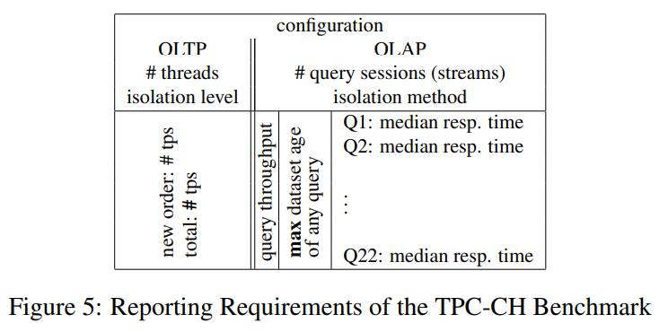

---
> **ARTS-week-41**
> 2022-10-06 18:55
---


###### ARTS-2019 左耳听风社群活动--每周完成一个 ARTS
- Algorithm: 每周至少做一个 leetcode 的算法题
- Review: 阅读并点评至少一篇英文技术文章
- Tip: 学习至少一个技术技巧
- Share: 分享一篇有观点和思考的技术文章

### 1.Algorithm:

- [788. 旋转数字 (^^+)](https://leetcode.cn/submissions/detail/366858608/)  
  + 思路:数学
- [面试题 17.09. 第 k 个数 (^^+)](https://leetcode.cn/submissions/detail/368274215/)  
  + 思路:优先队列
- [面试题 01.08. 零矩阵 (^^+)](https://leetcode.cn/submissions/detail/368858335/)  
  + 思路: 模拟

### 2.Review:

- [对混合 OLTP&OLAP 数据库系统进行基准测试](https://subs.emis.de/LNI/Proceedings/Proceedings180/390.pdf)  

#### 点评：

最近，已经为运营或实时商业智能（BI）提供了案例。由于OLTP数据库和OLAP数据仓库的传统分离显然会给操作BI带来严重的延迟缺点，因此正在开发混合OLTP&OLAP数据库系统。第一代这种混合OLTP&OLAP数据库系统的出现需要表征其性能的方法。虽然有标准化且广泛使用的基准测试来解决 OLTP 或 OLAP 工作负载，但缺乏混合基准测试导致我们定义了新的混合工作负载基准测试，称为 TPC-CH。此基准测试弥合了现有单工作负载套装之间的差距：用于 OLTP 的 TPC-C 和用于 OLAP 的 TPC-H。新提出的 TPC-CH 基准测试执行混合工作负载：基于 TPC-C 的订单输入处理的事务性工作负载，以及此销售数据库上相应的 TPC-H 等效 OLAP 查询套件。由于它源自这两个使用最广泛的 TPC 基准测试，因此我们新的 TPC-CH 基准测试产生的结果与混合系统和经典的单工作负载系统具有高度可比性。因此，我们能够将并行运行 OLTP 和 OLAP 工作负载的我们自己的（和其他）混合数据库系统的性能与专用事务系统（例如 VoltDB）的 OLTP 性能和专用 OLAP 数据库（例如，列存储，如 MonetDB）的 OLAP 性能进行比较。

- 1 简介
在线交易处理（OLTP）和在线分析处理的两个领域（OLAP） 对数据库体系结构构成了不同的挑战。而交易是分析查询通常运行时间较短，并执行非常有选择性的数据访问，分析查询通常运行时间较长，并且经常扫描数据的重要部分。因此，客户随着高速率的任务关键型交易目前被迫操作两个独立的事务系统：一个操作数据库处理事务和一个专用于分析查询的数据仓库。数据仓库会定期使用以下数据进行更新：从 OLTP 系统中提取并转换为针对分析进行优化的架构。早期尝试直接在操作系统上运行分析导致不可接受的事务处理性能 [DHKK97]。

最近，所谓的实时商业智能已经证明了这一点。SAP的联合创始人哈索·普拉特纳[Pla09]批评OLTP和OLAP之间的分离，对优先级向OLTP的转变表示遗憾。他强调OLAP对于战略发展的必要性。管理并将实时分析对管理的预期影响与互联网搜索引擎对世界的影响。

实时商业智能通常假设新型数据库架构基于内存技术，例如用于操作报告的混合行列 OLTP 数据库体系结构 [SBKZ08、BHF09、KGT+10] 或 HyPer [KN11]。它们通过单个系统处理两种工作负载，从而消除了上述问题数据暂存方法的缺点。

不同的策略似乎可以协调频繁的插入和更新与更长的运行 BI 查询：由事务触发的修改可能会在增量中收集，并且定期与主数据集合并，主数据集作为查询的基础 [KGT+10]。或者，DBMS 可以设计版本控制以分离事务处理来自对版本化数据快照进行操作的查询的最新版本。

这种新型的DBMS需要分析其性能的方法。混合系统需要相互比较，以评估不同的实现策略。它们还必须与传统的通用DBMS并列，并置在一起单工作负载系统，证明其在性能和资源消耗方面的竞争力。

我们介绍TPC-CH，这是一个基准，旨在产生高度可比的结果所有类型的系统（如图）。以下部分评估相关的基准测试。第3节描述了TPC-CH的设计。第 4 节介绍了所测试的系统。第 5 部分显示了使用不同类型的 DBMS 生成的设置和结果，第 6 部分论文结语


- 2 相关工作
事务处理性能委员会 （TPC） 指定的基准测试广泛用于工业界和学术界，以衡量数据库的性能特征系统。TPC-C 及其后继产品 TPC-E 模拟 OLTP 工作负载。模式由九个关系和五个以管理为中心的交易组成，产品或服务的销售和分销。数据库最初填充随机数据，然后随着系统处理新订单而更新。全控板-E 模拟经纪公司的工作量。它具有更复杂的架构和伪真实内容，旨在更好地匹配实际的客户数据。然而，热塑性硫化弹性体-C更为普遍。与热塑性硫化弹性体（TPC-E）相比[特拉10c，特拉10d]，因此具有更好的可比性。

TPC-H是目前TPC唯一的主动决策支持基准。它模拟一个在类似于 TPC-C 的业务场景中分析工作负载。基准测试指定 22 个查询回答业务问题的8个关系。TPC-DS，其忠实的继任者，将具有星型架构，大约100个决策支持查询和描述填充数据库的 ETL 过程。但是，它目前处于草稿状态。

请注意，只需使用两个 TPC 架构即可为混合 DBMS 编写基准测试，一个用于 OLTP，一个用于 OLAP，不会产生有意义的结果。这样的基准无法深入了解系统如何处理其最具挑战性的任务：并发处理相同数据的事务和查询。

提出了在线事务处理 （CBTR） [BKS08] 的综合基准，用于衡量同时包含 OLTP 和操作的工作负载的影响报告。CBTR不是现有标准化基准的组合，而是使用企业的真实数据。作者提到了数据生成器的想法，以产生以下结果：允许在系统之间进行比较。然而，CBTR的重点似乎是比较针对特定企业的特定用例的不同数据库系统。

- 3 基准设计
我们在设计TPC-CH时的首要目标是可比性。因此，我们兼顾 TPC-C 和 TPC-H 。这两种基准测试都被广泛使用和接受，实现速度相对较快，并且在设计上具有足够的相似性，可以进行组合可能。

TPC-CH 由未经修改的 TPC-C 模式和事务以及经过调整的TPC-H 查询的版本。由于两个基准测试的模式（如图）模型“必须管理、销售或分销产品或服务”[Tra10a，Tra10b]的企业，它们之间有一些相似之处。订单和客户之间存在关系在两个架构中。此外，订单线 （TPC-C） 和线项 （TPC-H） 模型实体是 ORDER（S） 的子实体，因此彼此相似。


TPC-CH 保持所有 TPC-C 实体和关系完全不被修改并集成TPC-H模式中供应商，地区和国家的关系同样保持不变。这些关系经常用于 TPC-H 查询，并允许非侵入式集成到 TPC-C 架构中。关系供应商由固定数量 （10，000） 的条目填充。因此，STOCK 中的条目可以唯一地与其供应商通过关系库存。STOCK.S_I_ID × STOCK.S_W_ID mod 10, 000 = SUPPLIER.SU_SUPPKEY

原始 TPC-C 关系客户不包含引用关联国家/地区的外键。由于我们保持原始模式不变以保持兼容性对于现有的 TPC-C 安装，外键是从字段 C 状态。TPC-C 指定第一个字符可以有 62 个不同的值（大写字母，小写字母和数字），因此我们选择了62个国家来填充NATION。主键 N 国键是根据 TPC-H 的标识符规范。选择其值时，其关联的 ASCII 值是字母或数字(i.e. N NATIONKEY ∈ [48, 57] ∪ [65, 90] ∪ [97, 122])。因此，没有额外的计算需要跳过 ASCII 代码中数字、大写字母和小写字母之间的间隙。不提供转换的数据库系统从字符到其 ASCII 代码的例程可能会偏离 TPC-H 架构并使用单个字符作为国家的主键。区域包含其中的五个区域国家。新关系之间的关系使用简单外键建模字段s (NATION.N REGIONKEY and SUPPLIER.SU NATIONKEY)。

- 3.1 事务和查询
如图 中的概述所示，工作负载由五个原始 TPC-C 组成交易和22个从TPC-H采用的查询。由于 TPC-C 模式是 TPC-CH 模式的未修改子集，因此可以在没有任何事务的情况下执行原始事务修改：


  - 新订单 此事务将具有多个订单行的订单输入到数据库中。对于每个订单线，99%的时间供应仓库是家庭仓库。主仓库是与终端关联的固定仓库 ID。自模拟用户数据输入错误，1%的事务失败并触发回滚。
  - 付款 付款更新客户的余额信息。15%的情况下，a 客户从随机的远程仓库中选择，在剩余的85%中，客户与家庭仓库相关联。客户按最后选择在60%的情况下命名，否则由他的三组件密钥命名。
  - 订单状态 此只读交易记录报告客户最后一个订单的状态。客户在 60% 的时间内按姓氏选择。如果未按姓氏选择，他是由他的ID选择的。所选客户始终与家庭相关联仓库。
  - 交付 此事务在一个批次中交付 10 个订单。所有订单都与家庭仓库。
  - 库存水平 此只读交易仅在主仓库上运行并返回最近售出且库存水平较低的库存商品的数量比阈值。

五种事务类型的分布符合 TPC-C 规范如图 所示，导致频繁执行新订单和付款交易。


TPC-CH 偏离了底层 TPC-C 基准测试，因为它不模拟终端，并且生成客户端请求而无需任何思考时间，如 [Vola] 所建议的那样。这样，可以在相对较小的数据库配置上实现非常高的事务速率。由于交易本身与TPC-C中相同，因此TPC-CH结果与具有相同修改的现有TPC-C结果直接相当，例如 伏特数据库 [沃拉]。此外，这些变化可以很容易地应用于现有的TPC-C。实现以产生与 TPC-CH 兼容的结果。


对于工作负载的 OLAP 部分，我们采用从 TPC-H 到 TPCCH 架构的 22 个查询。在重新制定查询以匹配略有不同的架构时，我们进行了确保他们的业务语义和语法结构得以保留。例如，查询 5列出通过当地供应商实现的收入（参见清单1和2）。两个查询都联接相似的关系，具有相似的选择标准，执行求和，分组和排序。

```sql
SELECT n_name, SUM(ol_amount) AS revenue
FROM customer, "order", orderline, stock, supplier, nation, region
WHERE c_id=o_c_id AND c_w_id=o_w_id AND c_d_id=o_d_id
AND ol_o_id=o_id AND ol_w_id=o_w_id AND ol_d_id=o_d_id
AND ol_w_id=s_w_id AND ol_i_id=s_i_id
AND mod((s_w_id * s_i_id),10000)=su_suppkey
AND ascii(SUBSTRING(c_state, 1, 1))=su_nationkey
AND su_nationkey=n_nationkey AND n_regionkey=r_regionkey
AND r_name=’[REGION]’ AND o_entry_d>=’[DATE]’
GROUP BY n_name ORDER BY revenue DESC

# Listing 1: TPC-CH Query 5

SELECT n_name, SUM(l_extendedprice * (1 - l_discount)) AS revenue
FROM customer, orders, lineitem, supplier, nation, region
WHERE c_custkey = o_custkey AND l_orderkey = o_orderkey
AND l_suppkey = s_suppkey AND c_nationkey = s_nationkey
AND s_nationkey = n_nationkey AND n_regionkey = r_regionkey
AND r_name = ’[REGION]’ AND o_orderdate >= DATE ’[DATE]’
AND o_orderdate < DATE ’[DATE]’ + INTERVAL ’1’ YEAR
GROUP BY n_name ORDER BY revenue DESC

# Listing 2: TPC-H Query 5
```

TPC-CH 不需要 TPC-H 中指定的刷新函数，因为 TPC-C 事务会不断更新数据库。以下部分特别说明，查询必须包含这些更新。

- 3.2 基准测试参数
TPC-CH 有四个等级：首先，数据库大小是可变的。与在技术专利委员会 C 中一样，大小数据库是通过仓库数量指定的。大多数关系都与仓库数量，项目，供应商，国家和地区是唯一的仓库恒定大小。

第二个等级是工作负载的构成。它可以由分析组成仅查询、仅事务或两者的任意组合。工作负荷组合指定为连接到的并行 OLTP 和 OLAP 会话（流）的数量数据库系统。OLTP 会话使用官方规范 [Tra10a] 中描述的分布按顺序分派随机 TPC-C 事务。分析会话对由所有 22 个查询集组成的查询集执行连续迭代查询。每个会话都以不同的查询开始，以避免会话之间的缓存影响，如图 4 所示。

第三个输入参数是隔离级别。较低的隔离级别，如已提交读取允许更快的处理，而更高的隔离级别保证了更高质量的结果用于事务和查询。

最后，用作分析基础的数据的新鲜度是一个参数的基准测试。仅当工作负荷组合同时包含 OLTP 和 OLAP 时，它才适用组件。数据新鲜度指定为以下时间或事务数之后哪些新发布的查询集必须包含最新的数据。这允许两者都是数据库体系结构，这些体系结构具有用于工作负载的单个数据集，并且具有设计一个增量来运行基准测试。

- 3.3 报告要求
除了对所采用的硬件和软件的描述外，还报告了系统的以下特征：OLTP引擎的性能通过以下方式进行量化：新订单事务和所有事务的吞吐量。在 OLAP 端，查询响应时间是针对每个迭代和会话中的每个查询测量的。中值并报告查询吞吐量。除了新鲜度参数之外，还会报告数据集的最大年龄。对于内存中系统，所有内存消耗的总内存消耗报告随时间变化的进程。这包括已分配但尚未使用的内存块。图 5 显示了一个示例报告。



- 4 被测系统
在图 1 中，我们将 DBMS 分为四个部分。我们使用TPC-CH来分析每个类别的一个代表的表现

- 4.1 以 OLAP 为重点的数据库系统
MonetDB是列存储方案方面最具影响力的数据库研究项目用于内存中 OLAP 数据库。系统概述可在摘要中找到论文[BMK09]在获得10年时间测试奖之际发表会议。因此，我们以莫奈德作为“强势”OLAP“-类别。此类别中的其他系统包括 SAP 的特雷克斯 （BWA） 和 IBM 智能分析优化器和 Vertica 分析数据库。

- 4.2 以 OLTP 为中心的数据库系统
H商店原型[KKN+08]，由迈克尔·斯通布拉克领导的研究人员创建最近由一家名为VoltDB的初创公司商业化。VoltDB 是一种高性能的内存中 OLTP 系统，它采用无锁方法 [HAMS08]事务处理，其中事务在私有分区上运行并执行在串行 [卷曲] 中。伏特数据库代表“在OLTP中很强”类别。此类别还包括以下系统：P\*时间 [CS04]、IBM 固态数据库、甲骨文时代和新创业公司发展 电子数据库，克鲁斯特里克斯，秋班，数据库碎片，尼姆布斯数据库，ScaleDB 和光狼。

- 4.3 通用数据库系统
此类别包含基于磁盘的通用数据库系统。我们选择了一个流行的，商用的（“系统X”）作为通用DBMS的代表。类别。

- 4.4 混合数据库系统
此类别包括哈索·普拉特纳 [Pla09] 概述的 SAP 新数据库开发以及我们的 HyPer [KN11] 系统。一种专用的 OLTP 和 OLAP 系统是然而，克雷斯坎多[GUMG10]的查询能力有限。

- 4.4.1 海珀：虚拟内存快照
我们开发了一种基于快照的新型混合 OLTP&OLAP 数据库系统通过操作系统的虚拟内存管理 [KN11] 的事务数据。在此体系结构中，OLTP 进程“拥有”数据库并定期（例如，在秒或分钟的顺序） 分叉 OLAP 进程。此 OLAP 过程构成数据库的全新事务一致性快照。因此，我们利用操作系统功能，用于为新的重复进程创建虚拟内存快照。例如，在 Unix 中，这是通过通过以下方式创建 OLTP 进程的子进程来完成的：分叉（） 系统调用。为了保证事务一致性，fork（） 应该只在两个（串行）事务之间执行，从不在一个事务中间执行。在第 4.4.1 节，我们将放宽此约束，方法是利用撤消日志将操作一致性快照（在事务中创建）转换为事务一致性快照。

分叉的子进程获取父进程地址空间的精确副本，如图 6 中覆盖的页面框架面板就是示例。此虚拟内存快照由分叉（）创建的操作将用于执行OLAP的会话查询 – 如图 6 右侧所示。


快照完全保持在分叉（）发生时存在的状态。幸运的是，最先进的操作系统不会立即以物理方式复制内存段。相反，他们采用懒惰的更新复制策略 - 如草图所示如图 6 所示。最初，父进程 （OLTP） 和子进程 （OLAP） 共享相同的通过将虚拟地址（例如，对象 a）转换为相同的物理主内存位置。突出显示了内存段的共享在图形中通过虚线框架。虚线框表示虚拟内存页这（尚未）被复制。仅当更新对象（如数据项 a）时，操作系统和硬件支持的更新时复制机制才会启动虚拟的复制内存页所在的 。此后，有一个新的状态表示为′可通过以下方式访问执行事务的 OLTP 进程和旧状态（表示为 a），可由 OLAP 查询会话访问。与图所示不同，附加页面确实是为启动页面更改的 OLTP 进程创建，并且 OLAP 快照引用到旧页面 - 此详细信息对于估计空间消耗非常重要，如果有几个将创建此类快照（参见图 7）。


到目前为止，我们已经草拟了一个数据库架构，利用两个进程，一个用于OLTP和另一个用于奥拉普。由于 OLAP 查询是只读的，因此可以轻松执行在共享相同地址空间的多个线程中并行。尽管如此，我们还是可以避免任何同步（锁定和闭锁）开销，因为 OLAP 查询不共享任何可变数据结构。通常具有十个以上计算机的现代多核计算机内核当然可以通过这种查询间并行化产生显著的速度。

充分利用多核服务器的另一种可能性是创建多个快照。HyPer架构允许任意当前快照。这可以通过定期（或按需）分叉（）--1新快照来简单地实现，从而启动一个新的 OLAP 查询会话进程。如图 7 所示。在这里，我们素描一个并且只有 OLTP 进程当前数据库状态（前面板）和三个活动查询会话进程的快照 - 最旧的是后台的快照。连续状态更改由数据项 a（最旧的状态）的四个不同状态突出显示，一个′一个′′，和 a′′′（最年轻的事务一致状态）。显然，大多数数据项都可以不同快照之间不会发生变化，因为我们期望以几秒钟的间隔为大多数最新查询创建快照 - 而不是像具有 ETL 数据暂存的当前分离数据仓库解决方案。活动数量原则上，快照不受限制，因为每个快照都“生活在”自己的过程中。通过调整优先级，我们可以确保始终为任务关键型 OLTP 进程分配一个核心– 即使 OLAP 进程众多和/或利用多线程，因此超过内核数。

快照将在会话的最后一次查询完成后删除。这是通过以下方式完成的只需终止正在执行查询会话的进程。没有必要按照创建快照的相同顺序删除快照。某些快照可能会持续使用持续时间更长，例如，用于详细盘点目的。但是，内存开销快照与创建时执行的事务数成正比将此快照到下一个较年轻快照的时间（如果存在或当前时间）。该图在数据项 c 上举例说明了这一点，该数据项是针对“中年”快照，因此由最旧的快照共享和访问。有点与我们的直觉相反，在终止中年快照之前，仍然有可能终止中年快照最旧的快照，因为c所在的页面将作系统自动检测到-/处理器通过与物理页面。因此，它在中年快照终止后幸存下来 - 与在以下页面′驻留，在中年快照终止时释放过程。最年轻的快照访问状态 c′包含在当前 OLTP 中进程地址空间。

- 5 结果集
在本节中，我们将介绍 TPC-CH 的粗略结果。我们的实验是进行的在具有两个四核 2.93 GHz 英特尔的计算机上R 至强R处理器和运行红帽企业版 Linux 5.4 的 64GB 内存。所有数据库都扩展到 12 个仓库，并且我们对查询集执行了 5 次迭代。

对于货币数据库，我们评估执行纯 OLAP 的基准测试实例工作量。我们排除了 OLTP，因为货币数据库中缺少索引会妨碍高效的事务处理。我们在图 9 中提供了具有三个并行 OLAP会话的设置结果。由于在此方案中没有对数据库的更新，因此新鲜度并且隔离级别参数失效。将查询流的数量增加到 5 个几乎没有改变吞吐量，但查询执行时间几乎翻了一番。运行单个查询会话将执行时间缩短了 10% 到 45%，但吞吐量恶化到每秒 0.55 个查询。

对于 VoltDB，工作负载组合仅包括事务。每个仓库一个“站点”/-分区（即12个站点）在我们的服务器上产生最佳结果。与全氟甲醚不同规范，我们允许 VoltDB 仅执行单分区事务，如建议在 [Vola] 中，并跳过那些涉及多个订单和付款的实例仓库。伏特德比中的隔离级别是可序列化的

对于系统 X，我们使用 25 个 OLTP 会话和 3 个 OLAP 会话。配置的隔离级别是 OLTP 和 OLAP 的读取提交，我们使用组提交每组五笔交易。由于系统对单个数据集进行操作，因此每个查询都对最新数据进行操作。图 9 显示了此设置的结果。将 OLAP 会话从 3 个增加到 12个会将查询吞吐量从 0.38 个增加到 1.20 个查询/秒，但会导致查询执行时间增加 20% 到 30%，OLTP 吞吐量下降14%.添加更多 OLTP 会话也会大大增加查询执行时间。

对于 HyPer，我们使用 5 个 OLTP 会话和 3 个并行 OLAP 会话的事务组合执行查询。我们不会像 VoltDB 那样简化仅运行单分区事务，而是使用跨仓库事务来挑战 HyPer在第 3.1 节中指定。在一次设置中，OLAP 会话在初始加载的数据（参见图 9）。在第二个中，为每个新查询流创建一个新快照（参见图9）。查询与事务进行快照隔离。在 OLTP 方面，隔离级别是可序列化的。

由于 HyPer 尚未提供单独的客户端和服务器进程，因此结果由包含两个组件的单个驱动程序生成。因此，潜在的性能对于 HyPer，排除了进程间通信造成的损失，但不包括其他进程间通信造成的损失被测系统。HyPer强大的 OLTP 性能源于事务到机器码。伏特数据库使用用 Java 编写的存储过程。

图 9 显示了海珀和伏特数据库的内存消耗。我们这里不包括货币数据库的结果，因为货币数据库不会随着时间的推移而增长。海珀运行3 个查询会话同时发送到 5 个 OLTP 会话，并在每次迭代后生成一个新的 VM 快照。伏特数据库执行纯 OLTP工作负载。该图显示了执行初始加载后的内存消耗


- 6 总结
我们介绍了 TPC-CH，这是混合 OLTP 和 OLAP 数据库系统的基准。全氟氯环比基于标准化的全氟碳化控制规和全氟碳化管防腐基准。它不仅适用于混合DBMS，但也允许将它们与专门用于其中任何一个的系统进行比较两个工作负载以及传统的通用系统。我们通过以下方式证实这一说法：每种类型的数据库系统的代表的结果。

### 3.Tip:

#### mybatis 问题：Mapper's namespace cannot be empty

```shell
Caused by: org.apache.ibatis.builder.BuilderException: Mapper's namespace cannot be empty
  at org.apache.ibatis.builder.xml.XMLMapperBuilder.configurationElement(XMLMapperBuilder.java:112)
  ... 31 mor
```

加上命名空间即可，如下：

```xml
<mapper namespace="xxx.xxx.xxxMapper">
</mapper>
```

#### android webview 跳过免费 ssl 证书验证

```java
class CustomWebView extends WebViewClient {
    @Override
    public void onReceivedSslError(WebView view, SslErrorHandler handler, SslError error) {
      //忽略ssl报错，继续处理
        handler.proceed(); 
    }
}
...
webView.setWebViewClient(new CustomWebView());
```

### 4.Share:

- [Maven 三种 archetype 说明](https://blog.csdn.net/cx1110162/article/details/78297654)

- [maven中archetype(原型)的使用及创建](https://blog.csdn.net/bawcwchen/article/details/80298173)

- [OkHttp使用https，忽略证书验证](https://www.jianshu.com/p/4580e9982485)