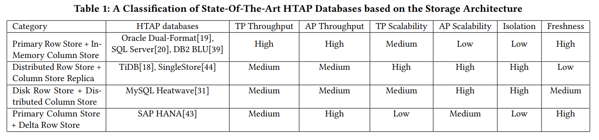

---
> **ARTS-week-42**
> 2022-10-14 20:42
---


###### ARTS-2019 左耳听风社群活动--每周完成一个 ARTS
- Algorithm： 每周至少做一个 leetcode 的算法题
- Review: 阅读并点评至少一篇英文技术文章
- Tip: 学习至少一个技术技巧
- Share: 分享一篇有观点和思考的技术文章

### 1.Algorithm:

- [856. 括号的分数 (^^+)](https://leetcode.cn/submissions/detail/371351527/)  
  + 思路:DFS
- [870. 优势洗牌 (^^+)](https://leetcode.cn/submissions/detail/371006738/)  
  + 思路:优先队列
- [817. 链表组件 (^^+)](https://leetcode.cn/submissions/detail/372420250/)  
  + 思路: 哈希

### 2.Review:

- [HTAP 数据库：什么是新的，什么是下一代](http://dbgroup.cs.tsinghua.edu.cn/ligl/papers/sigmod22-tutorial-paper.pdf)  

#### 点评：

- 摘要
处理事务和分析的混合工作负载单个数据库系统中的查询可以消除 ETL 过程并对交易数据进行实时数据分析。但是，没有免费的午餐。这样的系统必须平衡权衡取舍由于 OLTP 和 OLAP 的工作负荷交织，在工作负荷隔离和数据新鲜度之间。自从高德纳创造了这个词以来，混合事务/分析处理（HTAP），我们见证了支持HTAP的各种数据库系统的出现。一个共同的特点是它们利用了最好的行存储和色谱柱存储，以实现高质量的HTAP。正如他们所拥有的那样不同的存储策略和处理技术，以满足各种HTAP应用的要求，了解，比较和评估其关键技术至关重要。在本教程中，我们提供对HTAP数据库的全面调查。我们介绍根据最先进的HTAP数据库的分类存储策略和体系结构。然后，我们将深入了解他们关于交易处理，分析的关键技术处理、数据同步、查询优化和资源调度。我们还引入了现有的 HTAP 基准。最后我们讨论了HTAP的研究挑战和悬而未决的问题。

- 1 引言
  - 背景。所有组织都在处理比以往更多的数据在他们的处置中，数据不断以高速度，数量和多样性出现[26，30，53，55]。适用于数据密集型企业应用程序，拥有单个HTAP系统是有益的不仅可以高效处理在线事务处理（OLTP），还可以执行在线分析处理（OLAP）以便及时做出决策。例如，当配备HTAP系统，企业家在零售应用中可以分析实时获取最新交易数据，识别销售趋势，然后及时采取行动，例如，为有前途的产品推出广告活动[35]。在财务应用程序中，供应商可以利用HTAP系统可以有效地处理客户交易，同时同时检测欺诈易[16，36，47]。

  - HTAP 定义。混合事务/分析处理（HTAP） 是由高德纳报告提出的一种应用架构[35] 2014年，利用内存计算技术以在相同的内存中数据存储。这种架构应该消除提取-转换-加载（ETL）过程的需求，从而加速数据分析并带来戏剧性的业务创新。2018年，Gartner将HTAP概念扩展到“过程内”HTAP“ [15]，一种应用程序架构，支持根据需要将分析和事务处理技术编织在一起以完成业务任务。这样一个新的定义表明HTAP 不再局限于内存计算技术。

  - 驱动力。在过去的几年中，许多数据库系统[18–22， 29， 31， 42， 44] 已经开发出来，以实现HTAP。一共同的特点是，它们利用行存储和列存储的最佳功能来实现高质量的HTAP。然而，他们有不同的存储策略和处理技术，尽管双存储功能。这种多样性的主要原因是不同类别的HTAP系统针对不同的应用。为实例，这取决于 OLTP 或 OLAP 是否是第一个市场化的应用程序，或两者都很重要。它还取决于可用性、可伸缩性、系统性能和数据的要求服务级别协议 （SLA） [17] 中指定的新鲜度 [9]。因此，HTAP系统必须在两者之间取得平衡。由于 OLTP 和 OLAP 的工作负荷交织而导致的工作负荷隔离和数据新鲜度。为了更好地利用这些 HTAP 力各种应用，研究，理解和比较他们的关键技术至关重要。在本教程中，我们将学习同时利用行存储和列存储的 HTAP 数据库在单一数据库系统。

  - 教程概述。我们将提供一个全面的教程超线程数据库。本教程的预期长度为 3 小时。这教程由以下四个部分组成。
      - （1） HTAP 数据库（30 分钟）。本节首先介绍 HTAP 数据库的背景。它根据其存储体系结构提供分类，然后介绍每个类别中的主要方法。如图 1 所示，它将 HTAP 数据库分为四类：（a） 主行存储+ 内存列存储;（b） 分布式行存储 + 列存储副本;（c） 磁盘行存储 + 分布式列存储;和（d） 主列存储 + 增量行存储。然后，它呈现每种架构的主要 HTAP 技术和代表。特别是，它总结了不同HTAP的优缺点有关性能、可扩展性、工作负载隔离、和数据新鲜度（见表1）。

        

        

      - （2） HTAP 技术（40分钟）。本节将深入探讨HTAP数据库的关键技术，特别注意到他们关于交易处理，分析的技术处理、数据同步、查询优化和资源调度。显示了每个模块中的详细关键技术见表2。总体而言，它侧重于HTAP的五种任务类型，如下所示:

        

          - 事务处理 （TP） 技术。本部分将介绍两种类型的转让定价技术，包括 （i） MVCC + 日志记录 [19， 20，依赖于多版本并发控制 （MVCC） 的 31、39、43]用于事务处理的协议和日志记录技术;和（ii） 2PC+Raft+日志记录 [18]，基于两阶段提交 （2PC） 协议在分布式架构中处理事务，基于 Raft 的共识算法和测井技术。

          - 分析处理 （AP） 技术。本部分将介绍三种 AP 技术。第一种类型是 （i） 内存中增量和列扫描 [19， 20， 31， 39， 43] 响应分析通过对内存中的列式数据执行扫描来查询，并且可见的增量元组，但同时被合并。第二类型是 （ii） 基于磁盘的增量和列扫描 [18]，扫描基于日志的增量文件和传入的列存储一起查询。第三种类型是 （iii） 列扫描 [44]，它执行纯粹在列存储中查询。

          - 数据同步 （DS） 技术。本部分将介绍用于在 OLTP 之间同步数据的三种类型的 DS 技术和 OLAP，包括 （i） 内存中增量合并 [19， 20， 31， 39， 43]将新插入的内存中增量数据合并到主列存储;和 （ii） 定期基于磁盘的增量合并 [18]将基于磁盘的增量文件合并到主列存储中;和（三）从重建内存中的主行存储 [19， 39] 重建主行存储中的列存储。
          - 查询优化技术。本部分将介绍查询优化技术的三个方面，包括（i）HTAP的列选择[19，31]，该列选择根据历史记录自动选择从主存储到主存储器的cofel工作量;（ii） 混合行/列扫描 [18， 20]，它依赖于基于成本的函数来确定是否对行存储或列存储;和 （iii） 利用异构硬件的 HTAP [5， 22] 的 CPU/GPU 加速，即用于分别加速超线程应用工作负载的处理器/GPU 架构
          - 资源调度技术。本部分将介绍旨在改善资源的资源调度技术通过为 HTAP 动态分配资源（例如 CPU 和内存）来利用。它主要介绍两种类型的技术。这第一个是自适应工作负载驱动的调度 [43， 45]根据工作负载的执行状态。第二个是新鲜度驱动的调度[40]，它控制HTAP的执行模式基于新鲜度指标的工作负载。

      - （3） HTAP 基准测试（10 分钟）。本节介绍关于HTAP数据库的现有基准和评估做法。它将引入几个端到端的HTAP基准测试，包括热塑性硫化弹性体 [48]、热塑性硫化弹性体-H [49]、高温高压平台 [10] 和化学气相基准 [11]。具体而言，它将介绍基准测试的关键方面，包括数据生成、执行规则和性能指标。此外，它还将引入两个HTAP微观基准：适应[6] 和 HAP [7] 基准测试。之后，它总结了关键从现有评价实践中得出的见解 [13， 38， 40， 42， 45]

      - （4）挑战和开放性问题（10分钟）。最后一节结束教程并讨论研究挑战和HTAP 技术的开放问题。它总结了教程主题，然后提出几个挑战和悬而未决的问题。首先它介绍了现有方法在列选择方面的局限性对于 HTAP 工作负载，然后讨论基于学习的方法执行此任务的可能性。其次，它讨论了HTAP 查询优化和对学习查询优化器的调用用于高温高压。第三，它讨论了当前方法的局限性。在 HTAP 资源调度上，然后调用新的自适应方法。最后，它讨论了现有基准的局限性和设想一个新的 HTAP 基准套件。

  - 与现有教程的区别。有1.5小时教程 [34] 关于混合事务/分析处理 （HTAP）在2017年新加坡国际集团。它对HTAP系统进行了一般分类包括 NoSQL 数据库 [1， 2]，基于 Hadoop 的数据仓库[3， 4] 和松散耦合的基于 Spark 的 [52] 系统。不同从上一个教程中，我们提供了HTAP的新分类法应同时支持符合 ACID 的事务处理和实时分析处理的数据库。另外我们根据最新发展引入HTAP数据库，即：自2017年以来出现的数据库系统和技术。我们还深入研究HTAP数据库的基本技术并总结不同方法的优缺点。最后但同样重要的是，我们引入了基准和评估实践对于尚未提交的 HTAP。

  - 目标受众。本教程适用于广泛的SIGMOD参与者，包括企业家，研究人员，开发人员，从业者和学生。对于企业家来说，本教程会有所帮助他们全面了解并了解可能适合其业务的最先进的HTAP技术例。对于研究人员来说，他们可以从专业人士那里获得见解，并且现有技术的缺点，发现新的主题和研究问题，并将他们的专业知识贡献给HTAP数据库。对于开发人员和从业者，本教程可以加深他们对HTAP数据库和基准测试的关键技术，这有助于他们正确选择或改进HTAP系统应用。对于学生来说，本教程为他们提供了至关重要的信息关于高温高压技术。

- 教程大纲
我们从HTAP的背景介绍开始，以及然后汇总 HTAP 数据库的分类。我们介绍他们的主要方法，讨论利弊，然后深入探讨进入关键技术与图示的例子。此外，我们介绍 HTAP 基准和评估做法。最后，我们讨论研究挑战和开放问题。

  - 2.1 HTAP 数据库
  在本教程中，我们将研究HTAP数据库[18–20， 29， 31， 32， 37， 39，[0022] 利用行存储和列存储一起在单个数据库系统中启用 HTAP。
    - （a） 主行存储+内存中列存储。此类别的 HTAP 数据库 [19， 20， 29， 37， 39] 利用主行存储作为 OLTP 工作负荷的基础，并使用内存中列存储处理 OLAP 工作负荷。所有数据都持久化到主行存储。行存储还针对内存进行了优化以便有效地处理数据更新。更新也是追加到将合并到列中的增量存储介质。例如，Oracle in-memory dual-format 数据库 [19]将基于行的缓冲区和基于列的内存中压缩单元 （IMCU） 组合在一起，以一起处理 OLTP 和 OLAP 工作负荷。IMCU 从缓冲区填充，更改缓存在快照元数据单元 （SMU）。另一个例子是 SQL Server[20] 开发列存储索引 （CSI）over in-memory tables Hekaton [12] 行引擎中的表，可实现实时分析加工。此类型的 HTAP 数据库具有高吞吐量，因为所有工作负载都在内存中处理。
    - （b） 分布式行存储+列存储副本。此类别依赖于分布式体系结构来支持 HTAP。大师节点在以下情况下异步将日志复制到从属节点处理事务请求。主存储是行存储，一些从属节点将被选为列存储服务器进行查询加速度。事务以分布式方式处理，适用于高可扩展性;在服务器节点中执行复杂查询列存储。代表是 TiDB [18]，它是一种基于木筏的异步复制筏日志的分布式 HTAP 数据库从领导节点到在基于行的副本中存储数据的从属节点。日志也会发送到存储列格式的数据。因此，工作负载隔离级别是高的，因为事务是在具有行存储的节点上处理的，和分析查询在具有列存储的节点上执行。但是，数据新鲜度很低，因为新更新的数据可能会尚未合并到列存储。
    - （c） 磁盘行存储+分布式列存储。这种数据库利用具有分布式内存的基于磁盘的 RDBMS用于支持 HTAP 的列存储 （IMCS）。数据库管理系统保留了OLTP 工作负载和 IMCS 群集的满容量深度集成以加速查询处理。列式数据为从行存储中提取，热数据驻留在 IMCS 和冷数据中数据将被逐出到磁盘。例如，我的学习障碍热浪 [31]将 MySQL 数据库与分布式 IMCS 群集（称为热浪，实现实时分析。事务在 MySQL 数据库中完全执行。经常访问的列将被加载到热浪中。当一个复杂的查询进来时，它可以被推送到 IMCS 引擎以进行查询加速。
    - （d） 主列存储+ 增量行存储。此类别的数据库使用主列存储作为 OLAP 的基础，并使用增量行存储处理 OLTP。内存中增量主 HTAP 数据库将整个数据存储在主列中商店。数据更新将追加到基于行的增量存储中。OLAP 性能很高，因为列存储是高度重新优化的。但是，由于 OLTP 只有一个增量行存储工作负载，OLTP 可伸缩性较低。代表是 SAP哈纳 [14， 43].它将内存中的数据存储分为三层：L1-三角形、L2-三角洲和主要。L1-delta 将数据更新保持在按行格式。当达到阈值时，L1-增量附加到 L2-增量。L2-增量将数据转换为列式数据，然后将数据合并到主列存储中。最后，列式数据将保存到磁盘存储中。

  - 2.2 HTAP 技术
  如表2所示，我们总结了HTAP技术的五种任务类型，包括（1）事务处理;（2）分析处理;（3）数据同步;（4）查询优化;（5）资源调度。这些关键技术被最先进的HTAP数据库所采用。然而，他们有优点和缺点涉及各种指标，例如效率，可扩展性和新鲜度。在本节的最后，我们回顾了其他相关的HTAP补充关键技术的技术。
    - （1） 事务处理 （TP） 技术。断续器工作负载在 HTAP 中，数据库通过行存储进行处理，但不同架构导致不同的 TP 技术。它主要由两种类型。第一种类型是 （i） MVCC+ 日志记录 [19， 20， 31， 39， 43]依靠 MVCC 协议和日志记录技术进行处理交易。具体来说，每个插入首先写入日志和行存储，然后追加到内存中增量存储。更新会创建具有新生存期的行的新版本的开始时间戳和结束时间戳，旧版本为在删除位图中标记为删除行。因此，在执行 DML 操作时，事务处理是有效的在内存中。请注意，某些方法可能会将数据写入行存储 [44] 或增量行存储 [43]，它们只能事务提交 [12， 20] 时写入日志。第二类型是 （ii） 2PC+Raft+日志记录 [18]，它依赖于第 2.1 节中介绍的分布式体系结构 （b）。它提供了高可扩展性使用分布式事务处理。ACID 事务是在分布式节点上使用两阶段提交 （2PC） 进行处理协议，基于Raft的共识算法和提前写入日志 （WAL） 技术。特别是，主节点接收来自 SQL 引擎的请求，然后在本地附加日志并发送异步记录到关注节点。如果大多数节点，即仲裁，成功追加日志，领导者提交请求并在本地应用它。与第一种类型相比，第二种类型类型由于分布式事务处理而效率低下。
    - （2） 分析处理技术。对于超线程处理数据库，OLAP 工作负荷使用面向列的技术执行例如对压缩数据的聚合和单指令多数据 （SIMD） 指令 [39， 43]。特别是，它们是分为三种类型。第一种类型是 （i） 内存中增量和列扫描 [19， 20， 31， 39， 43]。此工作线将内存增量和列式数据一起扫描，因为增量存储可能包括尚未合并到列存储。由于它已经扫描了最近可见的增量元组在内存中，OLAP 的数据新鲜度很高。第二种类型是（ii） 基于日志的增量和列扫描 [18]，用于扫描基于日志的增量和列扫描增量数据和列式数据一起用于传入查询。与第一种类型类似，第二种类型扫描最新的增量用于处理 OLAP 的列存储。但是，这样的过程是由于读取可能没有的增量文件而更加昂贵已合并。因此，由于传送和合并增量文件的高延迟，数据新鲜度较低。第三种类型是 （iii） 列扫描 [44]，它仅扫描列式数据的效率高，因为没有读取任何增量数据的开销。但是，当数据在行存储中频繁更新。
    - （3） 数据同步技术。自从阅读增量数据在查询时间是昂贵的，有必要定期将增量数据合并到主列存储。有三个适用于各种 HTAP 数据库的 DS 技术。即，（i）内存增量合并[19， 20， 31， 39， 43];（ii） 基于磁盘的增量合并[18];和 （iii） 从主行存储重建 [19， 39]。第一个类别定期合并新插入的内存中增量数据到主列存储。介绍了几种技术优化合并过程，包括基于事务的两阶段数据迁移[20]、字典编码排序合并[43]和基于阈值的变化传播[19，31，39]。这第二类 [18] 将基于磁盘的增量文件合并到主列存储。为了加快合并过程，增量数据可以是由 B+ 树索引，因此可以有效地定位增量项使用键查找 [18]。第三类重建内存主行存储区中的列存储 [19， 44]。这是典型的对于增量更新超过特定阈值的情况，因此重建列存储比合并这些列存储更有效具有较大内存占用的更新 [19]。
    - （4） 查询优化技术。我们介绍三个方面查询优化技术，包括 （i） 列选择对于半胱天冬氨酸 [31， 33];（二） 行/列混合扫描 [18， 20];和（三）用于超高速移动端的 CPU/GPU 加速 [5， 22]。第一种类型 [31， 33] 依靠历史工作负载和统计信息来选择经常访问的从主存储中提取到内存中的列。因此，可以将查询推送到内存中列存储中，以便加速度。缺点是新查询的列可能尚未选择，从而导致基于行的查询处理。现有方法依赖于历史工作负载的访问模式[31， 33] 加载热数据并逐出冷数据。第二类型 [18， 20] 利用混合行/列扫描来加速查询。使用此类技术，可以将复杂的查询分解为在行存储或列存储上执行，然后结果被合并。这是 SPJ 查询的典型情况，可以使用基于行的索引扫描和完整的基于列的扫描执行。我们引入基于成本的方法[18，20]来选择混合行/列访问路径。第三种技术[5， 22] 利用异构 CPU/GPU 架构来加速 HTAP 工作负载。这些技术利用任务并行CPU 的性质和用于处理的 GPU 的数据并行性质分别是 OLTP 和 OLAP。然而，这些技术是有利的。高 OLAP 吞吐量，而具有低 OLTP 吞吐量。
    - （5）资源调度技术。对于 HTAP 数据库，资源调度是指 OLTP 和 OLAP 的资源分配工作量。现有技术[40，43，45]动态控制 OLTP 和 OLAP 工作负载的执行模式，以实现更好的资源利用率。有两种类型的调度技术，工作负载驱动的方法 [43， 45] 和新鲜度驱动的方法 [40]。前者调整OLTP的并行度线程和基于已执行工作负载性能的 OLAP 任务。例如，当 CPU 资源被 OLAP 线程饱和时，任务计划程序可以降低 OLAP 的并行性，同时扩大 OLTP 线程。后者 [40] 切换 OLTP 的资源分配和数据交换的执行模式和 OLAP。例如，调度程序控制 OLTP 和 OLAP 隔离以实现高吞吐量，然后定期进行同步数据。一旦数据新鲜度变得低，它就会切换到具有共享 CPU、内存和数据的执行模式。其他与高温高压相关的技术。我们还回顾了（i）新的HTAP索引技术[41，46]和（ii）横向扩展技术[17，19]。

- 2.3 HTAP 基准测试
我们在 HTAP 数据库中介绍了现有的基准[11，48，49]和评估实践[13，38，40，42，45]。

  - （1）HTAP 基准。广泛使用的端到端HTAP基准测试是CH基准测试[11]，它结合了两个TPC基准测试，即，TPC-C [48] 用于事务性工作负载，TPC-H [49] 用于分析工作负载。另一个端到端基准测试，称为 HTAP 平台[10]，也结合了TPC-C和TPC-H，但提出了一个不同的指标。我们将HTAP平台与CH基准进行比较数据生成、执行规则和性能指标。对于数据生成，我们研究它们如何扩展原始数据生成器。对于执行规则，我们介绍它们如何控制并发使用基准测试参数执行 OLTP 和 OLAP 工作负荷。对于性能指标，我们介绍它们如何组合每分钟事务数 （tpmC） 和已完成查询的指标每小时（千氟化物语）。除了端到端的基准测试外，我们还将引入两个合成微基准 [6， 7]。
  - 2） 高温高压数据库评估。我们总结了从HTAP数据库的现有评估实践中获得的见解[13，38, 40, 42, 45].特别是，我们研究了 HTAP 系统在处理 OLTP 和 OLAP 工作负载时所做的权衡。我们会的提供量化数字，以阐明差异 HTAP 数据库在各种情况下执行。例如，到在工作负载隔离和数据新鲜度之间做出权衡，我们比较系统应该支付的性能降级百分比，以保持数据的新鲜度。

- 2.4 挑战和开放性问题
  - HTAP 工作负载的自动列选择。给定一个 HTAP 工作负载，选择哪些列进入内存中行存储中的列存储是一项重要任务。然而现有方法严重依赖历史统计数据来选择内存中的列，例如甲骨文 21c 的热图 [33]。这样方法通过运行所有查询来提出建议，因此价格昂贵且不灵活。最近，基于学习的方法 [24]已广泛应用于数据库领域，包括旋钮调谐[25， 54]，连接排序[50]，并查看选择[51]。因此，它需要新的自动方法来高效和有效地选择HTAP 工作负荷的列。主要挑战是设计一个轻量级学习方法，可以捕获访问模式工作负载，而不在数据库中执行整个工作负载。此外，考虑数据编码也很困难。一起，这导致更大的搜索空间。
  - 学习了 HTAP 查询优化器。现有方法 [13， 18] 通过利用开销函数选择访问来优化查询 HTAP 数据库中行存储和列存储的路径。但是，他们做出统一和独立的假设来估计行/列大小，然后使用此类估计值来测量扫描行存储和列存储的成本。这样的方法有问题用于由于成本估算不准确而导致的相关和偏斜数据。最近，学习的查询优化器 [27， 28] 已显示出实用性通过学习传入查询和现有优化器的执行策略。因此，它也是承诺为 HTAP 数据库开发一个学习查询优化器。主要挑战是在学习阶段同时考虑基于行和基于列的运算符，因为学习空间很大。
  - 自适应 HTAP 资源调度。HTAP 资源调度可帮助数据库平衡工作负载之间的权衡隔离和数据新鲜度。这是通过调整 OLAP 和 OLTP 的执行模式来实现的。单独执行奥拉普和 OLTP 工作负载倾向于高吞吐量但数据量低新鲜。混合工作负载的共享执行有利于高数据新鲜度，但对工作负载有很强的干扰。退出新鲜度驱动的调度 [40] 依赖于基于规则的方法来控制执行模式，但忽略了工作负载模式。工作负载驱动方法 [43， 45] 调整了 OLTP 和 OLAP 的线程，但不考虑新鲜度。因此，重要的是要考虑调度资源时的工作负载和新鲜度。自为此，最好开发一种轻量级的自适应调度方法，不仅可以更好地捕获工作负载模式。性能，也满足数据新鲜度的要求。
  - HTAP 基准测试套件。首先，有人指出[8，23]TPC-H 具有均匀分布，在列，对测试 OLAP 提出了一些挑战。因此，《技术发展计划》具有 TPC-H 的基准应将具有偏斜的连接交叉相关性合并到基准中。其次，高德纳定义了[34, 35]HTAP 事务可能包含分析操作。但是，此功能仍未在任何 HTAP 基准测试中引入。因此，它需要一个新的HTAP基准，其中包含分析操作，例如，将分析操作插入TPC-C。三、有缺乏HTAP任务的特定微观基准，例如数据同步、查询优化和资源调度。总而言之，它需要一个新的测试平台来扩展各种组件。对HTAP数据库进行全面评估的现有基准。


### 3.Tip:

#### 解决 Android webview 设置 cookie 和 cookie 丢失的问题

登陆状态的同步，需要保存和设置cookie
```java
  /**
   * 获取接口中的cookie
   * @param loginUrl
   */
  private void syncCookie(final String loginUrl) {

    new Thread(new Runnable() {


      @Override
      public void run() {
        try {
          StringBuilder builder = new StringBuilder();
          URL url= null;
          byte[] data = builder.toString().getBytes("UTF-8");
          url = new URL(loginUrl);
          HttpURLConnection connection =
              (HttpURLConnection) url.openConnection();

          connection.setDoOutput(true);
          connection.setRequestProperty("Content-Type", "application/x-www-form-urlencoded");
          connection.setRequestProperty("Content-Length", Integer.toString(data.length));
          connection.setRequestMethod("GET");
          connection.setInstanceFollowRedirects(false);
          OutputStream os = connection.getOutputStream();
          os.write(data);
          os.close();
          int aRstCode = connection.getResponseCode();
          if (aRstCode == HttpURLConnection.HTTP_OK) {
            cookie = connection.getHeaderField("Set-Cookie");
          }

        } catch (MalformedURLException e) {
          e.printStackTrace();
        } catch (UnsupportedEncodingException e) {
          e.printStackTrace();
        } catch (ProtocolException e) {
          e.printStackTrace();
        } catch (IOException e) {
          e.printStackTrace();
        }
      }
    }).start();
  }

  //设置cookie
  if(cookie != null && cookie.length()   0){
    android.webkit.CookieManager cookieManager =
        android.webkit.CookieManager.getInstance();
    cookieManager.setAcceptCookie(true);
    cookieManager.removeSessionCookies(null);
    cookieManager.setCookie(url, StringCookie);
    cookieManager.flush();
  }
```

#### Add cookie to client request OkHttp

```java
OkHttpClient client = new OkHttpClient().newBuilder()
    .cookieJar(new CookieJar() {
        @Override
        public void saveFromResponse(HttpUrl url, List<Cookie> cookies) {
        }

        @Override
        public List<Cookie> loadForRequest(HttpUrl url) {
            Arrays.asList(createNonPersistentCookie());
        }
    })
    .build();

// ...
    
public static Cookie createNonPersistentCookie() {
    return new Cookie.Builder()
        .domain("publicobject.com")
        .path("/")
        .name("cookie-name")
        .value("cookie-value")
        .httpOnly()
        .secure()
        .build();
}
```

or simply

```java
OkHttpClient client = new OkHttpClient().newBuilder()
    .addInterceptor(chain -> {
        final Request original = chain.request();
        final Request authorized = original.newBuilder()
            .addHeader("Cookie", "cookie-name=cookie-value")
            .build();
        return chain.proceed(authorized);
    })
    .build();
```

single request you can just add the header:

```java
Request request = new Request.Builder()
        .addHeader("Cookie", "yourcookie")
        .url("http://yoursite.com")
        .build();
```
CookieSyncManager add cookie text:

```java
private void syncCookie(Context context, String url) {
  CookieSyncManager.createInstance(context);
  CookieManager cookieManager = CookieManager.getInstance();
  cookieManager.setAcceptCookie(true);
  cookieManager.removeSessionCookie();// 移除旧的[可以省略]
  List<HttpCookie> cookies = new PersistentCookieStore(context).getCookies();// 获取Cookie[可以是其他的方式获取]
  for (int i = 0; i < cookies.size(); i++) {
    HttpCookie cookie = cookies.get(i);
    String value = cookie.getName() + "=" + cookie.getValue();
    cookieManager.setCookie(url, value);
  }
  CookieSyncManager.getInstance().sync();// To get instant sync instead of waiting for the timer to trigger, the host can call this.
}

public void synCookies(Context context) {
  if (Build.VERSION.SDK_INT < Build.VERSION_CODES.LOLLIPOP) {
    CookieSyncManager.createInstance(context);
  }
  CookieManager cookieManager = CookieManager.getInstance();
  cookieManager.setAcceptCookie(true);// 允许接受 Cookie
  if (Build.VERSION.SDK_INT < Build.VERSION_CODES.LOLLIPOP) {
    cookieManager.removeSessionCookie();// 移除
  } else {
    cookieManager.removeSessionCookies(null);// 移除
  }
  List<HttpCookie> cookies = UserModle.getInstance(this).getCookies();
  for (int i = 0; i < cookies.size(); i++) {
    HttpCookie cookie = cookies.get(i);
    String value = cookie.getName() + "=" + cookie.getValue();
    cookieManager.setCookie(".baidu.com", value);
  }
  cookieManager.setCookie(".baidu.com", "Domain=.baidu.com");
  cookieManager.setCookie(".baidu.com", "Path=/");
  if (Build.VERSION.SDK_INT < Build.VERSION_CODES.LOLLIPOP) {
    CookieSyncManager.getInstance().sync();
  } else {
    cookieManager.flush();
  }
}
```


### 4.Share:

- [解决Android webview设置cookie和cookie丢失的问题](https://cloud.tencent.com/developer/article/1719734)

- [Android 定时任务的8种实现方法](https://www.cnblogs.com/aademeng/articles/11117082.html)

- [Android webView 获取、设置 cookie的方法](https://blog.csdn.net/qq_35573326/article/details/80013424)

- [[疑难杂症] Android WebView 无法打开天猫页面](https://blog.csdn.net/hao741100265/article/details/42428375)\

- [Android 控件WebView设置Cookie](https://www.jianshu.com/p/c9a9c4e1756d)