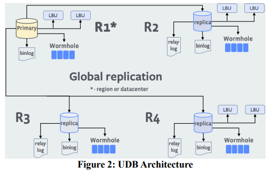
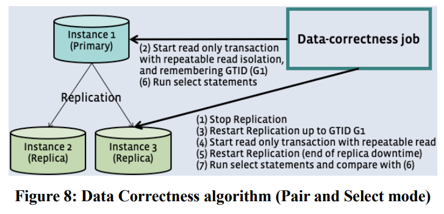
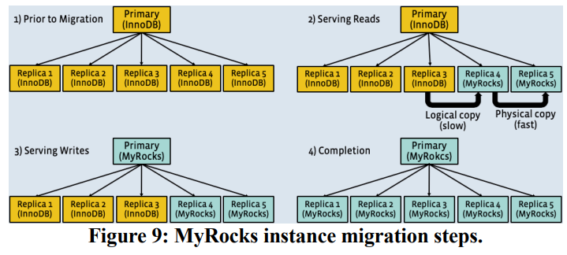

---
> **ARTS-week-43**
> 2022-10-21 21:13
---


###### ARTS-2019 左耳听风社群活动--每周完成一个 ARTS
- Algorithm: 每周至少做一个 leetcode 的算法题
- Review: 阅读并点评至少一篇英文技术文章
- Tip: 学习至少一个技术技巧
- Share: 分享一篇有观点和思考的技术文章

### 1.Algorithm:

- [886. 可能的二分法 (^^+)](https://leetcode.cn/submissions/detail/373650295/)  
  + 思路:二分图
- [904. 水果成篮 (^^+)](https://leetcode.cn/submissions/detail/373975357/)  
  + 思路:滑动窗口
- [779. 第K个语法符号 (^^+)](https://leetcode.cn/submissions/detail/372420250/)  
  + 思路: 递归

### 2.Review:

- [MyRocks：LSM 树数据库存储引擎服务脸书的社交图谱](https://dl.acm.org/doi/10.14778/3415478.3415546)  

#### 点评：

- 摘要
脸书使用MySQL来管理其中数十PB的数据。名为用户数据库 （UDB） 的主数据库。乌德邦为社交服务活动，如喜欢、评论和分享。过去，脸书使用基于B+树的存储引擎InnoDB作为后端。这挑战是使用更少的空间找到索引结构并写入扩增[1]。LSM树 [2] 有潜力大大改善这两个瓶颈。RocksDB，一种基于 LSM 树的键/值存储已经广泛用于各种应用，但有一个非常低级的键值接口。为了克服这些限制，MyRocks，一个新的MySQL存储引擎，建立在通过添加关系功能来创建数据库。使用MyRocks，使用RocksDB API，实现了显著的效率提升，同时仍然受益于所有MySQL功能和工具。这转换对客户端应用程序几乎是透明的。。

脸书完成了从InnoDB到MyRocks的UDB迁移2017年。从那时起，生产不断改进操作，以及对 MySQL、MyRocks、和RocksDB，提供了更高的效率获胜。MyRocks还将 UDB 数据集的实例大小减少了 62.3%，并且执行的 I/O 操作比 InnoDB 少。最后，MyRocks为相同的生产流量提供服务所消耗的 CPU 时间更少。这些收益使我们能够减少数据库的数量UDB 中的服务器减少到不到一半，节省了大量资源。在本文中，我们将介绍大规模构建和运行 OLTP LSMtree SQL 数据库的旅程。我们还讨论了我们的功能实施以跟上 UDB 工作负载的步伐，是什么原因迁移更容易，以及哪些操作和软件开发我们在运行 MyRocks 的两年中面临的挑战生产。

我们在RocksDB中引入的新功能包括事务支持、批量加载和前缀布隆过滤器，所有这些功能使所有RocksDB用户受益。

- 1 介绍
脸书UDB服务于最重要的社交图谱工作负载 [3]。最初的 脸书 部署使用了InnoDB的 MySQL 作为后端的存储引擎。InnoDB是一个强大的，广泛使用的数据库，它表现良好。同时，硬件趋势从缓慢但负担得起的磁力驱动器转向快速但更昂贵的闪存存储。在 UDB 中转换到闪存存储将瓶颈从每秒输入/输出操作数转移（IOPS） 到存储容量。从空间的角度来看，InnoDB存在三大难以克服的挑战，指数碎片、压缩效率低下和空间开销行（13 个字节）用于处理事务。为了进一步优化空间，除了以适当的低延迟提供读取和写入服务外，我们还认为针对闪存存储优化的 LSM 树数据库是在UDB中更好。但是，有许多不同类型的客户端应用程序访问数据库。重写 客户端应用程序新数据库将花费很长时间，可能是多个年，我们也想避免这种情况。

我们决定集成 RocksDB，这是一种现代开源的 LSM 树基于闪存优化的键/值存储库，进入MySQL。如图 1 所示，通过使用 MySQL 可插拔存储引擎体系结构，可以在没有存储层的情况下替换存储层更改上层，如客户端协议、SQL 和复制。


我们把这个引擎叫做“MyRocks”。当我们开始这个项目时，我们的目标是将 UDB 服务器的数量减少 50%。那要求 MyRocks 空间使用量不超过压缩的 InnoDB 格式，同时保持可比的 CPU和 I/O 利用率。我们期望实现类似的CPU利用率与 InnoDB 是最困难的挑战，因为闪存 I/O 具有足够的读取 IOPS 容量，而 LSM 树数据库的读取能力较少写入放大。由于InnoDB是一个快速，可靠的数据库具有我们工程团队所依赖的许多功能，在那里是许多挑战，确保InnoDB之间没有差距和MyRocks.

其中一项重大挑战包括：
（1）增加 CPU，内存和 I/O 压力。MyRocks 将数据库大小压缩一半，这需要更多的 CPU、内存和 I/O 来处理主机上的实例数量为 2 倍。
（2）间距较大向前和向后范围扫描。LSM 树允许数据块以更紧凑的形式进行编码。结果，正向扫描比向后扫描快。
（3）关键比较。LSM 树键值比较的调用频率高于 B 树。
（4）查询性能。《MyRocks》比《InnoDB》慢范围查询性能。
（5）LSM 树性能需求基于内存的缓存布隆过滤器以获得最佳性能。在内存中缓存布隆过滤器对 LSM 树很重要性能，但这消耗了大量的 DRAM 和增加内存压力。
（6）墓碑管理。在LSM 树中，删除通过添加标记进行处理，通常做法频繁更新/删除行时导致性能问题。
（7）压缩，特别是当被触发突发写入时，可能会导致停滞。

第3节详细介绍了这些挑战是如何发生的解决。简而言之，实施的突出创新是（1） 前缀布隆过滤器，以便范围扫描具有相等的谓词更快（第 3.2.2.1 节），（2） 个内存可比较键MyRocks允许更有效的角色比较 （部分3.2.1.1），一 （3） 种新的逻辑删除/删除类型，以提高效率处理二级索引维护（第 3.2.2.2 节），（4） 批量加载以跳过数据加载时的压缩，（第 3.2.3.4 节）， （5）速率限制压缩文件的生成和删除，以防止失速（第 3.2.3.2 节）和 （6） 混合压缩 – 使用更快的用于上层RocksDB级别的压缩算法，以及更强的压缩算法算法用于最底层，以便内存表刷新和压缩可以以最小的速度跟上写入摄取率空间开销（第 3.3.4 节）。

全面的正确性、性能和可靠性在迁移之前需要进行验证。我们建造了两个基础设施服务，以帮助迁移。一个是我的阴影，它捕获了生产查询并重放它们以进行测试实例。另一个是数据正确性工具，它比较创新科技和我的岩石之间的完整索引数据和查询结果实例。我们运行了这两个工具来验证MySQL实例运行 MyRocks 没有返回错误的结果，没有返回意外错误，未回归 CPU 使用率，并且没有造成突出的摊位。完成验证后，创新银行到米洛克斯的迁移本身相对容易。因为MySQL 复制独立于存储引擎，添加“我的岩石”实例和删除创新数据库实例非常简单。MyRocks 中的批量数据加载功能大大减少了数据迁移时间，因为它可以直接将索引加载到 LSM 树中并绕过所有内存表写入和压缩。

InnoDB到MyRocks的UDB迁移已在2017 年 8 月。对于相同的数据集，MyRocks 和现代 LSMtree 结构和压缩技术减少了实例大小比压缩的 InnoDB 增加了 62.3%。初中索引维护开销和整体读取性能这些改进导致 CPU 时间略有减少。写入的字节数刷新存储下降了75%，这有助于避免达到IOPS瓶颈，并为使用具有较低写入周期的更便宜的闪存存储设备提供了可能性。MyRocks使我们能够将 UDB 中的数据库服务器数量减少到一半以下。自 2017 年以来，不断跟踪回归通过MyShadow和数据正确性。我们提高压缩率为保证删除陈旧的数据，满足不断增长的数据隐私要求。

这种做法很有价值，因为：（1）由于SQL数据库建立在LSM树越来越受欢迎，调优的实用技术改进LSM树是有价值的。为了我们最好的知识，这是这些技术第一次出现在大规模生产系统上实施。（2）虽然有些记录了高级 B 树与 LSM 树的比较，我们的工作暴露了 LSM 树的实施挑战，以匹配 Btree 性能，LSM 树的额外好处，以及可以缩小差距的优化。（3）跨数据迁移不同的数据库或存储引擎很常见。本文分享用于将数据库迁移到其他存储的过程发动机。体验更有趣，因为存储发动机移动到是相对不成熟的。

在本文中，我们描述了三个贡献：
1. UDB 概述、B 树索引面临的挑战及其原因我们认为 LSM 树数据库针对闪存进行了优化存储是合适的（第2节）。
2. 我们如何针对各种读取工作负载优化 MyRocks和压实（第3节）。
3. 我们如何在生产环境中迁移到 MyRocks（第 4 节）。然后，我们在第 5 部分中显示迁移结果，然后是经验教训在第 6 节中了解到。最后，我们在第7节中展示相关工作，和第8节中的结论性意见。

- 2. 背景和动机
  - 2.1 数据库架构

  UDB 是我们庞大的分片数据库服务。我们有定制的MySQL具有数百种功能来操作满足我们需求的数据库。所有对 MySQL 的自定义扩展都是作为开源发布 [4]。

  脸书拥有许多地理位置分散的数据中心，分布在各个地区世界 [5] 和 UDB 实例在其中一些实例中运行。其他分布式数据库解决方案最多可以放置三个副本在同一区域，并在它们之间同步复制，脸书生态系统是如此之大，以至于采用这种架构UDB是不切实际的，因为它会迫使我们维持超过10个数据库副本。我们为每个数据库副本仅维护一个数据库副本地区。但是，有许多应用程序依赖于短提交延迟，并且在几十毫秒内无法正常工作用于同步跨区域事务提交。这些约束导致我们部署MySQL分布式系统体系结构如图 2 所示。

  我们使用传统的异步MySQL复制进行交叉区域复制。但是，对于区域内容错，我们创建了一个名为Binlog服务器（日志备份单元）的中间件它可以检索和提供称为MySQL复制日志的MySQL复制日志二进制日志。二进制日志服务器仅保留较短的最近时间事务记录，并且不维护数据库的完整副本。每个MySQL实例将其日志复制到两个二进制日志服务器，使用半同步协议。所有三台服务器都分散开来跨区域内的不同故障域。此体系结构可实现短（区域内）提交延迟每个区域和一个数据库副本。

  UDB 是我们社交图谱的持久性数据存储。在UDB上，有一个巨大的缓存层称为 TAO [3]。TAO是分布式写入通过缓存处理社交图形并将其映射到数据库中的单个行。除了停止的应用程序，大多数到 UDB读写请求先到 TAO。通常应用程序不直接向 UDB 发出查询，而是发出向TAO请求。TAO 提供有限数量的 API，以处理社交图谱的应用程序。将访问方法限制为应用程序有助于防止它们向UDB 和 稳定工作负载。

  我们使用 MySQL 的Binlog不仅用于 MySQL 复制，但也用于通知外部应用程序的更新。我们创造了为此，一个名为Wormhole[6]的公共子服务。其中一个用例的Wormhole正在使远程区域中的 TAO 缓存失效，方法是读取区域 MySQL 实例的Binlog。



  - 2.2 UDB 存储引擎
  UDB是脸书最早建立的数据库服务之一。从那时起，软件和硬件趋势发生了重大变化时间。早期版本的UDB在旋转的硬盘驱动器上运行，这些硬盘驱动器具有由于 IOPS 较低，数据量少。工作量很仔细受到监控以防止服务器使磁盘驱动器不堪重负。

  2010 年，我们开始将固态硬盘添加到 UDB 服务器中，以提高 I/O 吞吐量。第一次迭代使用闪存设备作为缓存硬盘。在增加服务器成本的同时，闪存缓存 [7]将 IOPS 容量从每秒数百个提高到数千个每秒，允许我们在单个上支持更多的数据服务器。2013年，我们取消了硬盘，改用纯硬盘闪存。此设置不再受读取 I/O 的限制吞吐量，但每 GB 的总体成本明显高于硬盘或闪存。减少数据库使用的空间成为优先事项。最直接的解决方案是压缩数据。InnoDB存储引擎支持压缩，我们在2011年启用了它。空间减少是大约50%，这仍然是不够的。在学习存储引擎，我们发现B树结构浪费了空间，因为索引碎片数。索引碎片是一个常见问题对于 B 树数据库，每个数据库的大约 25% 到 30%创新数据库块空间被浪费了。我们试图缓解这个问题使用B树碎片整理，但它对我们的效果较差工作量比预期的要大。在 UDB 中，大多数是随机写入会快速对刚刚进行碎片整理的页面进行碎片整理。为了降低空间使用量，我们需要持续和积极地进行碎片整理，这反过来又减少了服务器性能和加速了闪存磨损。闪存耐用性这已经成为一个问题，因为更高的耐用性驱动器更贵。

  压缩在InnoDB中也受到限制。默认InnoDB数据块大小为 16KB，需要表级压缩预定义压缩后的块大小 （key_block_size），1KB、2KB、4KB 或 8KB 之一。这是为了保证页面可以单独更新，这是B树的基本要求。为例如，如果key_block_size为 8KB，则即使 16KB 数据为压缩到5KB，实际空间使用量仍然是8KB，所以存储节省上限为 50%。块大小太小会导致在高 CPU 开销中，用于增加页面拆分和压缩尝试。对于大多数表，我们使用 8KB，对更新的表使用 4KB很少，因此整体节省空间的影响有限。

  我们在闪存上使用InnoDB面临的另一个问题是更高的写入放大和由写入闪存引起偶尔的卡顿。在 InnoDB 中，脏页最终会写回数据文件。因为 TAO 负责大多数缓存，所以要提高效率，MySQL在未缓存工作集的硬件上运行DRAM，因此经常会写回脏页。甚至InnoDB 数据块中的单行修改会导致要写入的整个 8KB 页面。InnoDB也有一个“双写”功能，以防止在意外期间损坏页面损坏关闭。这使得放大写入的问题突显。在某些情况下，我们突发写入速率触发闪存上 I/O 停滞的问题。

  根据我们在UDB的InnoDB中遇到的问题，很明显我们需要一个更好的空间优化，更低的写入放大数据库实现。我们发现 LSM 树数据库非常适合这两个瓶颈。我们对LSMtree感兴趣的另一个原因是它对分层存储和新存储的友好性技术创造了更多的分层机会。虽然我们有尚未得到优势，但我们预计在未来从中获益。

  尽管存在潜在的好处，但存在一些挑战采用用于 UDB 的 LSM 树数据库。首先，没有生产验证的数据库，在2010年闪存上运行良好。这大多数流行的LSM数据库都在HDD上运行，没有一个有大规模在闪存上运行的经过验证的案例研究。

  其次，UDB仍然需要为大量的读取请求提供服务。而TAO具有很高的命中率，读取效率仍然很重要，因为TAO 经常从 UDB 发出的批处理样式作业的读取请求，这些作业具有低 TAO 缓存命中率。还有，TAO经常经历“冷”重新启动“以使缓存失效并从 UDB 刷新。写入请求还触发了读取请求。所有 UDB 表都有主键，因此执行唯一键约束检查所需的插入件，以及更新/删除以查找以前的行。删除或更新方式需要读取才能找到主键的非主键。

  出于这些原因，有效地提供读取也很重要。像 InnoDB 这样的 B 树数据库非常适合读取和写入工作负载，而 LSM 树在写入和空间方面进行了更多迁移优化。因此，LSM树数据库是否可以处理闪存上的读取工作负载。

  - 2.3 通用UDB表
  UDB主要有两种类型的表来存储社交数据 - 一种用于对象和另一个用于对象 [3] 的关联。每个对象和关联都有类型（fbtype 和 assoc_type）来定义其特性。fb 类型或assoc_type决定了物理存储对象或关联的表。公共对象表是称为fbobj_info，它存储由对象键控的公共对象类型（fb 类型）和标识符（fbid）。对象本身存储在序列化格式的“数据”列，其格式取决于每个 fb 类型。关联表存储对象的关联。为例如，assoc_comments表存储的关联对脸书活动的评论（例如帖子），按对标识符（id1 和 id2）和关联类型（assoc_type）。关联表具有称为 id1_type 的二级索引。关联表的二级索引（id1_type索引）为旨在优化范围扫描。获取关联的 ID （id2） 列表到 id （id1） 是 脸书 上的常见逻辑，例如获取喜欢某个帖子的用户标识符。

  从架构的角度来看，对象表的访问方式与键相同比关系模型更有价值的存储。另一方面，关联表具有有意义的架构，例如一对 ID。我们采用了一个在二级id1_type称为“覆盖指数”[8]的优化索引，以便可以不随机地完成范围扫描从主键读取，方法是将所有相关列包含在指数。典型的社交图谱更新会修改对象表和一个数据库事务中相同 id1 的关联表，因此将两个表放在一个数据库实例中是有意义的交易的 ACID 功能的优势。

  - 2.4 RocksDB：针对闪存进行了优化
  利用闪存存储并非MySQL和其他脸书的应用程序已经拥有多年的经验。在2012年，为应对其他应用面临的类似挑战，一个新的键/值存储库，RocksDB[9]是为闪存创建的。当我们开始寻找替代存储引擎时MySQL，RocksDB已经用于服务列表，包括ZippyDB [10]  Laser [11] 和Dragon [12]。

  RocksDB 是针对特征优化的键/值存储库基于闪存的固态硬盘。在选择主要数据结构时引擎，我们研究了几种已知的数据结构，并选择了LSMtree，因为它具有良好的写入放大功能，具有良好的平衡读取性能 [1]。该实现基于LevelDB[13]。

    - 2.4.1 RocksDB 架构
    每当数据写入 RocksDB 时，它都会被添加到内存中称为内存表的写入缓冲区，以及预写日志 （WAL）。一旦内存表的大小达到预定的大小，内存表的内容被冲出到“排序字符串”表“（SST） 数据文件。每个 SST 都按排序顺序存储数据，分为几个块。每个 SST 还具有一个用于二进制的索引块，每个 SST 块使用一个键进行搜索。SST 被组织成大小呈指数级递增的排序运行序列，称为级别，其中每个级别将具有多个 SST，如中所述图 3.为了保持每个级别的大小，一些 SST 在L 级被选中并与重叠的 SST 合并水平（L+1）。该过程称为压缩。我们称之为最后一级Lmax。


    在读取路径中，在每个连续级别都会进行键值查找，直到找到键值或确定键值不存在于最后一级。它首先搜索所有内存表，然后是所有内存表级别 0 SST，然后是下一个后续级别的 SST。在这些连续的每个级别，使用整个二进制搜索 Bloom 过滤器保存在每个 SST 文件中并用于消除在 SST 文件中进行不必要的搜索。

    - 2.4.2 为什么是 RocksDB?
    如第 2.2 节所述，空间利用率和写入扩增是UDB的两个瓶颈。写入放大是RocksDB的初始优化目标，因此它非常适合。LSM 树更有效，因为它避免了就地更新页面，最终导致页面写入与小更新UDB.对 LSM 树的更新进行批处理，并在写入时进行out，页面仅包含更新的条目，最后排序的条目除外跑。当更新最终应用于最后一次排序运行时，大量更新已经累积，因此页面的百分比很大将是新更新的数据。

    除了写入放大之外，我们还需要解决其他专业瓶颈：空间利用率。我们注意到，LSM树确实如此在这个指标上也明显优于B树。对于InnoDB来说，空间放大主要来自碎片化，较少高效压缩。如第 2.2 节所述，InnoDB在碎片中浪费了25-30%的空间。LSM树不会受到影响从问题及其等效性是尚未删除的死数据在树上。LSM 树的死数据通过压缩被删除，并且通过调整压缩，我们能够保持死数据的比例低至10%[14]。RocksDB还针对空间进行了优化，因为它与压缩配合得很好。如果将 16KB 数据压缩为5KB，RocksDB仅使用5KB，而InnoDB与8KB对齐，所以RocksDB的空间效率要高得多。此外，InnoDB有用于处理事务的每行具有显著的空间开销 （6-字节事务 ID 和 7 字节滚动指针）。RocksDB有 7 字节每行的序列号，用于快照读取。然而RocksDB在压实过程中将序列号转换为零，如果没有其他事务引用它们。零序列号压缩后占用的空间非常小。在实践中，大多数行在Lmax具有零序列号，因此节省空间非常重要，特别是当平均行大小较小时。

    由于 RocksDB 非常适合解决性能和UDB 工作负载的效率挑战，我们决定构建MyRocks，一个新的MySQL存储引擎，在RocksDB基础上。这在MySQL 5.6中实现的引擎表现良好创新科技在技术优化校准中的基准测试结果 [14]。甲骨文发布时较新版本的 MySQL，我们将继续移植MyRocks，基于新的存储引擎的要求。

  - 3. MYROCKS/ROCKSDB 开发
    - 3.1 设计目标
    重新构建和迁移大型生产数据库是一件大事工程项目。在开始之前，我们创建了几个目标。虽然提高效率是重中之重，但也很重要。许多其他因素，例如可靠性，隐私性，安全性和简单，在过渡到MyRocks时没有倒退。

      - 3.1.1 维护应用程序和操作的现有行为
      实施新数据库只是我们项目的一部分。成功迁移在 UDB 中持续运行的也是重要。因此，我们使迁移和操作变得容易目标。启用了 MySQL 中的可插拔存储引擎体系结构这个目标。使用相同的客户端和 SQL 接口意味着 UDB客户端应用程序不必更改，我们的许多自动化工具，例如实例监控、备份和故障转移，继续运行，没有可用性损失。

      - 3.1.2 有限的初始目标范围
      我们不想花很多年时间在一个新的数据库项目上。花五年或更长时间来实施一个伟大的数据库，然后花费额外的数年时间进行迁移，是不合理的。我们的UDB数据库不断增长，所以我们想要以尽早而不是稍后节省空间。我们决定将最初的 MyRocks 产品范围限制为 UDB。由于 UDB 具有特定的表结构和查询模式，因此我们相信让 MyRocks 超越我们的效率目标是可行的在UDB。另一方面，基本设计，如磁盘上在早期阶段讨论了索引和行格式。这些需要支持所有工作负载，并且更难更改一旦实现。

      在 MyRocks 开发过程中，我们不断进行基准测试针对基于 UDB 等效工作负载的InnoDB 。我们使用链接平台 [15]，一个开源的基准测试工具，模拟类似 UDB 的工作负载。我们还分析了UDB的生产情况。工作量。根据这些数据，我们制定了开发任务和相应地确定优先级。一旦 UDB 在 MyRocks 到达生产质量，我们开始支持其他用例。

      - 3.1.3 设定明确的绩效和效率目标
      如前所述，MyRocks 是一个以效率为导向的产品项目，所以重点是显着的效率提升，没有牺牲一致性。与 InnoDB 相比，有两个目标在UDB。第一种是将数据库空间减少至少50%，第二，在不减少 CPU 和 I/O 使用率的情况下执行此操作。节省 50% 的磁盘空间意味着 MySQL 实例密度每个主机加倍，因此单个数据库主机需要为流量。由于预计会出现更多的 CPU 和 I/O 压力，因此具体目标是他们没有倒退。大多数 UDB 表都有二级索引和 LSM 树数据库可以操作二级索引比创新数据库更有效率。我们期待MyRocks可以使用更少的CPU和I / O进行写入，而它也是期望使用更多用于读取。

      并非所有生产工作负载都可以从 InnoDB 迁移到 MyRocks。我们无法制作一个比 InnoDB 在各个方面更好。我们选择了LSM树而不是B树来保存以牺牲读取性能为代价的空间。对于读密集型所有数据都驻留在内存中的数据库，MyRocks几乎不是比InnoDB更好，节省空间的好处是微乎其微的。我们明确表示，我们没有针对此类用例（内存开销妥协 [1]）。

      - 3.1.4 设计选择
        - 3.1.4.1 对 MyRocks 的贡献
        我们尽可能向 RocksDB 添加了功能。RocksDB是一个广泛使用的开源软件，我们认为RocksDB会受益其他应用程序。MyRocks使用了RocksDB的API。

        - 3.1.4.2 聚集索引格式
        UDB 利用了 InnoDB 集群索引结构。主键查找可以通过单次读取完成，因为所有列存在。我们采用了相同的集群索引结构对于MyRocks。辅助键条目包括主键列以引用相应的主键条目。没有行 ID。


    - 3.2 性能课题
    我们进行了几次读取性能优化，以便总体上资源利用率与InnoDB相当。本节讨论了这些优化改进和功能。因为MyRocks是一个 LSM 树数据库，读取性能较差与InnoDB相比是意料之中的。当我们测量时，读取性能差距，我们注意到优化机会可以填补空白。在早期基准测试中，我们还发现提高 CPU 效率比 I/O 更重要。闪存具有足够的读取 IOPS，并且由于 RocksDB 写入的内容要少得多对于闪存，I/ O是次要关注的问题。LSM 树数据库面临的另一个巨大挑战是墓碑会大大减慢扫描范围。我们实施了几个功能，以减轻删除标记的负面影响.

      - 3.2.1 减少CPU
        - 3.2.1.1 内存可比较键
        使用 LSM 树，在执行时可以进行更多关键比较查询与InnoDB相比。虽然RocksDB做了几个优化，这个数字还是明显高于InnoDB，特别是在范围查询中。查找范围，我们只需要在B树中进行一次二进制搜索，而我们需要对 LSM 树中的每个排序运行执行一次二进制搜索并合并他们使用堆。这可能会导致几倍的钥匙比较。同样，简单的键值推进也不需要B 树中的任何键比较，而在 LSM 树中，至少一个键需要比较来调整堆，而通常另一个是需要确定记录是否表示较旧的版本。如结果，RocksDB对关键比较成本比更敏感InnoDB。

        例如，大多数MySQL存储引擎，包括InnoDB，支持不区分大小写的排序规则。这允许“ABC”匹配“abc”关于角色比较，但它带有性能成本，因为每个关键比较都涉及多个步骤，包括键反序列化。甚至区分大小写的排序规则数据类型可能需要执行其中一些步骤。在MyRocks，我们总是以一种字节比较的方式将MySQL数据编码到RocksDB键值中，是的比较更高效。

        - 3.2.1.2 反向键值比较器
        在 RocksDB 中，按正向顺序迭代键值比按正向顺序迭代键值快得多颠倒顺序。有几个原因，其中大多数是LSM 树的基础。首先，LSM树允许岩石数据库在每个数据块内使用键增量编码，但使用增量编码对反向迭代不友好。其次，使用 LSM 树，陈旧当我们迭代数据时，可能会存在记录。记录以与键值版本相反的顺序存储在树中。这订单保证快进迭代，但也慢速反向迭代迭代，因为 RocksDB 需要为键值读取一条额外的记录以查找最新版本。最后，实现内存表使用带有单向指针的跳过列表，因此反向迭代需要另一个二进制搜索。因此，按查询排序反向迭代的方向比正向迭代慢得多。

        幸运的是，大多数UDB查询都是统一的，因此我们可以调整数据基于常见查询的放置。如第 2.3 节所述，我们在UDB中有两个主要的数据模型 - 对象和关联。关联更昂贵，因为它们是按范围获取的扫描，而不是通过点查找获取的对象。范围扫描可能跨越数千条边缘，因此它是对于针对社交图谱工作负载优化它们非常重要。

        TAO 按降序发布关联范围扫描，排序方式如下：更新时间。为了优化降序扫描性能，我们在RocksDB中实现了一个反向键值比较器。它存储键值按逆字节顺序。我们采用反向键比较器关联辅助键，因此按时间进行降序扫描在内部执行前向迭代扫描，这很有效。我们的反向键值比较器改进了下降扫描吞吐量在UDB中增加了约15%。

        - 3.2.1.3 更快的近似大小扫描计算方式
        作为一个MySQL的存储引擎，MyRocks 需要告诉MySQL为每个查询计划候选项扫描的估计成本。对于每个查询计划候选项，MySQL传递两个最小键和存储引擎的最大键值，以及 MyRocks估计扫描范围的成本，并将成本返回给MySQL。RocksDB通过查找块来实现该功能最小和最大键的位置以及计算两个块之间的大小距离，包括内存表。这可能会导致非过大的 CPU 开销。我们实施了两个用于提高查询成本计算性能的功能。一提示强制给出了具体的索引时完全跳过成本计算。这是有效的，因为社交图谱查询是高度统一的，因此在几个SQL中添加此提示查询可以减少大部分近似大小的开销。我们还改进了 RocksDB 算法以获得估计的扫描大小范围 通过估计范围内完整 SST 文件的总大小首先，并在 RocksDB 中立即跳过剩余的部分文件确定他们不会显著改变结果。RocksDB 还尝试将潜水结合到最小值和最大值键放入一个操作中。

        - 3.2.2 延迟减少/范围查询性能
          - 3.2.2.1 前缀布隆过滤器
          UDB有很多范围扫描，在LSMtree数据库中更具挑战性。在 B 树中，范围查询从一个叶页开始，而短范围查询只需要从一个或两个叶读取。对于LSM树，它有两个部分 - 寻找和下一个 LSMtree 具有更高的寻道开销。我们通常需要读一个来自每个排序运行的数据块，即使对于排序运行，其中没有键在范围中。阅读更多块意味着可能有更多的 I/O 和 CPU 用于解压缩。

          为了降低短距离扫描性能，我们引入了前缀 bloom 过滤器在岩石数据库。用户将字节数指定为“前缀”，以便用户可以跳过不包含的所有已排序运行以特定前缀开头的任何键。

          我们的关联范围扫描由相等的谓词完成，从索引列的前缀。关联范围扫描使用了id1_type辅助键值。辅助键值以相等开头谓词（id1，assoc_type）并包括其他几个列，包括时间戳。后一列用于确定扫描的排序顺序。对于大多数 TAO 范围扫描，相等的谓词仅用于第一个前缀（id1，assoc_type）列。

          前缀bloom为 20 字节，由内部索引 ID（4 个字节）、id1（8 个字节）和assoc_type（8 个字节）。这两列始终在 WHERE 子句中以相等的方式设置id1_type辅助键值的谓词。通过支持前缀布隆滤波器，具有相等谓词的常见索引扫描可以使用布隆过滤器和提高读取性能。

          - 3.2.2.2 减少删除和更新时的逻辑删除
          压缩是影响 RocksDB 性能的主要因素，影响读取和写入性能。最大的痛点之一要点是如何处理删除（称为“墓碑”）更多有效。在早期阶段，像 LinkBench 这样的基准测试是用于模拟 UDB 工作负载。我们观察到一个问题，关联范围扫描性能随着 RocksDB 数据中删除墓碑的数量逐渐增加文件。如第 2.3 节所述，二级索引id1_type有许多列，包括时间戳和版本，并且是覆盖指数 [8]。这使得范围扫描速度更快，因为随机这些列不需要从主键读取。但是，每个更新查询都修改了时间戳和版本字段，从而导致二级索引不断更新。

          更新 MyRocks 中的索引列意味着更改 RocksDB 。更改 RocksDB 键值需要删除旧键值和创建一个新键值。删除逻辑删除匹配的放入期间内存表刷新或压实，但墓碑本身仍然存在，因为有可能一个 请求较低级别的 SST 文件中可能存在相同的键值。RocksDB 压缩过程中会处理删除的墓碑，直到到达Lmax。多次更新 MyRocks 索引键字段意味着生成大量的墓碑。这使得范围扫描非常昂贵，因为它需要扫描所有墓碑。在UDB中，更改主键列通常不会发生工作负载，因此更改主键不会产生任何性能影响。但是，更改辅助键值确实发生在稳定状态工作负载。关联辅助键是大量用于范围扫描，例如返回 ID 列表喜欢一张特定的照片。

          为了解决墓碑效率低下的问题， RocksDB 引入了一个新的名为“SingleDelete”的删除类型。与Delete相比，SingleDelete可在删除时立即删除。SingleDelete的预期较短寿命逻辑删除保持范围扫描性能，即使有源源不断的二级索引更改也是如此。当多个Puts发生在同一个键上时SingleDelete不起作用。例如，Put(key=1, value=1), Put(key=1, value=2) then SingleDelete(key=1) ends up as (key=1, value=1) still remaining, while Delete(key=1) 隐藏2个 Puts。这是一个数据不一致方案和SingleDelete在这种情况下不应使用。MyRocks 辅助键值防止对同一键值进行多次Puts。如果辅助键值不更改，“MyRocks”不会为辅助键值。如果辅助键值发生更改，则“MyRocks”会发出问题SingleDelete（old_secondary_key）和 Put（new_secondary_key）。多个Put到同一secondary_key，没有SingleDelete从不发生。

          - 3.2.2.3 基于墓碑触发压缩
          删除大量行时，某些 SST 文件可能会变得充满墓碑并影响范围扫描性能。RocksDB 扩展了压实功能，以跟踪附近的墓碑。当检测到具有高密度墓碑的键值范围时在冲洗或压实期间，它会立即触发另一个压 实。这有助于减少范围扫描性能偏差由扫描过多的墓碑引起。我们称之为功能删除触发压缩 （DTC）。

          图 5 是具有和不具有 DTC 的链路平台结果，并且SingleDelete。X轴是花费的时间，Y轴是查询时间第二。由于没有优化，QPS 在花费的时间，直到大多数墓碑才回来因压缩而消失。SingleDelete显示类似行为，但 QPS 下降较低，最大吞吐量为高等。DTC使整体QPS下降不那么重要。在生产，提供稳定的性能很重要，所以使用DTC和SingleDelete对我们来说更有价值。


        - 3.2.3 空间、压缩方面的挑战
          - 3.2.3.1 内存使用回归
          bloom过滤器对于 LSM 树的性能和需求非常重要以缓存在 DRAM 中以有效。这导致了一个显著的与创新数据库相比，DRAM 使用率回归。我们的设计使用了典型的bloom过滤器大小为每键值 10 位。为了减少通过bloom过滤器使用 DRAM，我们将 RocksDB 扩展为可选允许它在上次排序的运行中跳过创建bloom过滤器。由将级别大小乘数调整为 10，最后一次运行包含 90%的数据中，bloom过滤器尺寸减小了90%，而bloom过滤器仍然有效。在以下情况下跳过bloom过滤器在最后一个级别中使用压缩会产生空的副作用键值查找，例如 INSERT 的唯一键值检查，变得更加贵。我们在那里选择了内存效率而不是额外的CPU时间。

          - 3.2.3.2 SSD 由于压缩而变慢
          MyRocks 依靠固态硬盘的修剪命令来减少固态硬盘的内部写入放大和提高性能 [16]。但是，我们注意到某些 SSD 的性能可能会暂时下降在修剪命令激增之后。压实可能会产生数百个从兆字节到千兆字节的 SST 文件。删除所有这些文件一次可能导致修剪的尖峰，从而导致潜在的性能问题，甚至在闪存上停滞不前。解决方案是为文件删除速度添加速率限制，以避免此类停顿。压缩 I/O 请求也可能与用户查询 I/O 竞争请求，导致查询延迟增加。我们添加了速率限制压缩 I/O 请求以减轻其对用户查询 I/O 的影响。

          - 3.2.3.3 物理删除过时数据
          在 UDB 中，迁移作业计划为删除未使用的数据。删除有几种类型。正常删除，执行删除语句并使用删除/单删除RocksDB  API通常与用户驱动的数据删除请求相关。逻辑删除，执行更新语句并使用 Put RocksDB API 通常是为了节省空间而优化的，例如，将未使用的数据列覆盖为 NULL 但不删除记录。

          我们的社交图谱工作负载通常会分配不断增加的 fbid 用于对象表。对象的修改速率通常随时间推移而减少。如果对象被删除，则不再进一步删除将对其进行修改。由于对象表使用 fbid 作为主键，因为大多数插入/更新/删除查询都用于新分配的 fbids，很有可能SST文件包含旧对象/fbid 的正常和逻辑删除不要被拾起进行压实，因为所有新的变化都会到来来自较新的fbids。这些删除或放置 RocksDB 操作联邦调查局进入了L1~L2，但压缩从未继续将它们推入 Lmax。因此，包含数据保留在Lmax中，它们继续占用空间。

          此问题已通过在RocksDB。该功能检查了SST文件中的数据的年龄，如果它早于可设置的阈值，则会触发压实，直到它达到液化。这确保了两个删除并在合理的时间范围内最终达到Lmax并且空间可以被回收。

          - 3.2.3.4 批量加载
          LSM 树数据库中停滞的最常见原因之一就像 RocksDB 是突发写入。几种类型的数据迁移生成的作业，例如联机架构更改和数据加载海量数据写入。例如，InnoDB 到 MyRocks 迁移需要从是突发写入。几种类型的数据迁移生成的作业，例如联机架构更改和数据加载海量数据写入。例如，InnoDB 转储并加载到 MyRocks 中。 MemTable 刷新和压缩无法跟上重写入引入速率。写入，包括来自用户查询的写入，然后会停滞不前，直到刷新和压缩保证足够的处理资源。限制是缓解的一种方法，但它增加了总体迁移时间。

          优化突发写入并确保它们不会干扰用户查询，我们在岩石数据库中实现了批量加载功能，并且我的岩石利用了它。对于批量装载，使用我的岩石用于创建 SST 文件的岩石数据库文件引入 API。新的安全数据表直接摄入到 Lmax 中，自动和原子更新岩石数据库清单以反映数据文件。使用批量加载允许数据迁移作业绕过 MemTable 并通过每个 RocksDB 排序的运行级别进行压缩，因此消除这些应用程序中的任何写入停顿。批量装载要求引入的键值范围从不与现有数据重叠。对我们来说，在创建新的数据时通常会发生大量数据写入表，因此大容量加载支持此方案。图 6 是基准测试以加载我们的关联表，这些表具有两个主要和辅助键值，进入创新数据库和我的岩石，有和没有批量加载。X轴是要并行加载的桌子的数量，Y轴是每秒插入的行。使用我的摇滚散装装载，插入吞吐量线性缩放至少多达 20 个工作台，并且吞吐量比 InnoDB 高 2.2 倍（使用一个表，一次并发）到 5.7 次（有 20 个表，20 个并发）。批量加载消除了由这些迁移作业引起的停顿。


    - 3.3 使用 MyRocks 的额外好处
    虽然我们不得不通过使用LSM树来克服许多挑战，但在除了空间和写入效率外，开发工作也很大产生了以下好处。

      - 3.3.1 在线备份和恢复性能
      我们从数据库中进行逻辑备份以进行灾难恢复和进行二进制日志备份以进行时间点恢复。我们实施了只读快照，用于在 MyRocks 中进行一致的读取，并让我们的逻辑备份工具使用它。与 InnoDB 相比，运行时间长一致性读取在 MyRocks 中更有效率。 InnoDB 将 UNDO 日志 [17] 实现为链表，需要保留创建事务快照后列表中的所有更改。它也需要倒带列表以根据一致性查找行快照。如果存在热行，这会导致显著减慢更改了很多，并且需要长时间运行的选择才能读取该行创建快照后。在“MyRocks”中，长时间运行的快照可以维护对所需行的特定版本的引用。

      从逻辑备份还原比 InnoDB 快得多，因为 MyRocks 可以利用批量加载功能（图 6）。

      我们使用物理备份来克隆副本实例。克隆实例是通过在 RocksDB 中创建一个检查点来完成的，然后将所有 SST 文件和 WAL 文件发送到目标位置。一个 RocksDB 检查点创建 SST 文件的硬链接。自不 SST 文件是不可变的，不能对原始文件进行任何修改make，允许检查点及时指向快照。克隆到不同区域中的主机可能需要数小时，因为网络传输速率，尤其是在源实例较大的情况下。一个然后，新克隆的实例将从 MySQL 主实例进行复制实例。此过程以在以下事务上捕获克隆在创建检查点后进行，也可能需要数小时，具体取决于对主数据库所做的更改速率。减少复制副本同步时间，我们会在同步期间定期重新创建检查点克隆，并不断将新硬链接的 SST 文件发送到目的地。复制同步仅在最后一个检查点和副本的末尾，可以对其进行限制无论数据库实例大小如何。

      - 3.3.2 使用许多二级索引时规模更好
      在 MyRocks 中，操作二级索引可以在没有随机读取。MyRocks 内部问题是 RocksDB 放插入、单删除和放置以进行更新，以及单删除以进行更新删除二级索引，但它们不需要调用获取/获取更新。与 InnoDB 相比，这是一个显著的优势。用于具有多个二级索引的大量修改表。图6 显示 MyRocks 的插入吞吐量优于 InnoDB用于具有一个二级索引的表。

      - 3.3.3 替换和插入而不读取
      MySQL具有替换语法，可以盲目地插入/覆盖新行。在内部替换从主键读取到通过键发现匹配的行。如果该行存在，则将其删除，然后新行将用新值覆盖它。否则行为类似于插入。“MyRocks”优化的“替换”可发出 RocksDB 放置和跳过唯一键检查。LSM 树数据库可以跳过随机读取并改进写入吞吐量。

      “MyRocks”还具有一个可跳过插入语句的选项检查唯一键约束。如果跳过它，则“MyRocks”不会需要执行随机读取，而 InnoDB 仍然需要发出阅读。缺点是这些盲插可能很容易在与他人交互时引入数据一致性错误MySQL功能，如触发器和复制。我们不愿意在UDB中承担风险，因此我们采取了更安全的方向来禁用这些优化。此性能功能仍可用于用户。

      - 3.3.4 更多的压缩机会
      像 RocksDB 这样的 LSM 树数据库具有多重压缩机会。我们强调一个有效的压缩优化，“每级压缩”算法。

      RocksDB 具有从 L0 到 Lmax 的多个压缩级别。而默认情况下，RocksDB 在 Lmax 中包含 90% 的数据，大多数压实通常发生在Lmax以外的水平。这推动了我们在级别之间配置不同的压缩算法。对 Lmax 使用强大的压缩算法，速度更快算法，如 LZ4，甚至在非 Lmax 中无压缩水平，有道理。RocksDB 显式设置特定压缩算法在线性。在 UDB 中，我们将 Z 标准用于 Lmax，并且LZ4 用于其他级别。对关卡使用更快的压缩算法像L0和L1一样有助于记忆表冲洗和压实以跟上写入摄取。在UDB中，大约80%的压缩字节在非 Lmax 级别中完成。通过采用LZ4 对于非 Lmax 液位，总压实时间可以下降到三分之一，与在所有级别使用Z标准相比。

- 4. 生产迁移
一年后，我们开始从 InnoDB 迁移到 UDB 的 MyRocks 以及一半开发和测试。由于新软件将可能有错误，我们首先将MyRocks添加为“禁用的副本”，这意味着从InnoDB主数据库执行复制流量实例，但不为生产读取流量提供服务。这启用了在不影响生产的情况下测试 MyRocks 功能服务业。我们可以验证 MyRocks 是否可以在没有写入的情况下提供服务复制正在停止或导致数据不一致。我们可以验证数据恢复的正确性如果 MyRocks 实例崩溃。各种自动化工具，如实例升级和数据库备份，可以测试与实例的交互。

我们通过逻辑创建了一个禁用的 MyRocks 副本实例导出 InnoDB 表，然后将其导入到“MyRocks”中使用批量加载功能。由于 InnoDB 有集群索引结构，导出的数据已经按主键排序，主键可以批量加载到 MyRocks 中，无需额外分类。对于每个副本集，我们每小时可以迁移200-300GB的InnoDB数据。

  - 4.1 阴影 – 影子查询测试
  在生产中启用 MyRocks 之前，需要对其进行测试环境。特别关注的是如何验证 MyRocks 可以可靠地为查询提供服务，包括验证 CPU 和 I/O与 InnoDB 相比的利用率，并检查意外情况崩溃或查询计划回归。

  为了测试生产查询，我们创建了一个名为 MyShadow。在脸书，我们有一个定制的MySQL审计插件捕获生产查询并将其记录到我们的内部日志记录服务。MyShadow 从记录服务并将它们重放到目标MySQL实例。我们首先使用 MyShadow 从生产中捕获读取查询 InnoDB 副本，然后将查询重放到测试版的 MyRocks 副本，允许我们在服务之前修复任何查询回归生产读取请求在 MyRocks。


  - 4.2 数据正确性检查
  当开始在生产中使用新数据库时，这是一个很大的问题验证存储和返回的正确新数据库的挑战数据。我们将 InnoDB 作为参考实现来验证通过将其数据与 MyRocks 的数据进行比较，实现数据的正确性。我们创建了一个数据正确性工具，用于比较从每个存储返回的数据发动机。我们的工具有三种模式：单一，配对和选择。单模检查主键和实例中同一表的辅助键，方法是验证是否为行重叠列的计数和校验和是相同的。单模可能会发现一些内部的“MyRocks”或“Rocks”数据库错误未正确更新任何一个索引。例如，我们可以找到一些 RocksDB 压缩错误，最终没有正确删除键，这显示为索引不一致。

  配对模式运行了全表扫描以检查行计数和校验和来自两个实例的主键，基于一致的处于相同事务状态的快照（图 8）。配对模式可以比较 InnoDB 和 MyRocks 实例。它可能会发现错误未被单模式覆盖，例如 在 中丢失或增加行其中一个实例。



  选择模式类似于配对模式，但不是完全扫描语句，它运行了从 MyShadow 捕获的选择语句，并进行了比较两个实例之间的结果。如果选择语句结果不是一致，它表示不一致，所以我们可以调查进一步。选择模式可以可靠地发现不一致，但它也需要从非确定性查询中筛选出误报（例如，使用像NOW（）这样的函数，它返回当前时间）。

  - 4.3 修复了不兼容的查询
  “MyShadow”和“数据正确性测试”揭示了几个问题：我们在单元测试或使用通用基准测试期间找不到像系统平台和链接平台。发现单模数据正确性一些没有处理的 RocksDB 压缩错误正确删除/单次删除。选择模式找到数据正确性前缀布隆过滤器中有趣的错误，其中某些范围扫描使用相等谓词返回的行数少于预期。这些在启用“MyRocks”之前已修复。我们将重点介绍我们在 MyShadow 写流量测试。

    - 4.3.1 间隙锁定和隔离行为差异
    MySQL中的默认事务隔离级别是可重复读取，并在 UDB 中使用。InnoDB 中的可重复读取实现与其他数据库产品相比是独一无二的。InnoDB 的锁定读取的行为为“已执行已提交”，通过返回当前快照。它不是严格意义上的可重复读取。相反，InnoDB 锁定读取时锁定范围（间隙），即使在以下情况下仍保持锁定行不存在，以阻止其他事务更新相同的范围。基于语句的二进制日志记录还需要间隙锁定以确保正确性。

    另一方面，MyRocks 采用了快照隔离模型可重复读取，这与在后格雷SQL中发现的相同。我们认为基于InnoDB风格的间隙锁的实现是好吧，但我们的结论是快照隔离更简单实现。我们还可以将副本切换为使用基于行二进制日志记录，并消除了对间隙锁定支持的需求。

    这种行为差异在测试 MyShadow 时导致问题写入流量。返回基于快照隔离的可重复读取如果行发生冲突，则为错误，而 InnoDB 样式锁定读取没有冲突，因为它本质上是已读取已提交。作为结果，运行 MyRocks 的 MySQL 主实例返回使用可重复读取隔离级别时，错误数明显高于 InnoDB 主实例。为了降低错误率，我们调查了常见的冲突查询，讨论了问题与应用程序开发人员合作，并切换到“已提交”。当我们确认他们是安全的。我们还添加了日志记录功能以使用间隙锁记录查询。某些应用明确依赖于间隙锁，而其他人则意外地从中受益，并记录了帮助发现了这些不同的案例。


  - 4.4 实际迁移
  在通过 MyShadow 和数据正确性测试后，我们开始了在生产环境中启用 MyRocks 实例。我们从复制开始为生产读取流量提供服务并从主实例。

  图 9 显示了我们在 UDB 中执行的迁移步骤。当我们在2016-2017年迁移到 MyRocks ，我们有六个MySQL实例对于每个 MySQL 副本集（一个主副本和五个副本实例从主数据库复制）。我们配置了四个同一副本集中的 InnoDB 和两个 MyRocks 实例，以及主实例已修复为 InnoDB。 MyRocks 实例从创新数据库主数据库复制。MySQL 将存储分开来自复制流的引擎（InnoDB。/MyRocks）（二进制日志），因此二进制日志格式独立于存储发动机。这种架构使 MyRocks 部署变得不太复杂。

  此配置运行了几个月，以验证 MyRocks 可以可靠地为生产读取流量提供服务。我们也继续密集的 MyShadow 编写流量测试，为制作做准备 MyRocks 是主要的。

  将 MyRocks 提升到首选是多年来的巅峰之作努力，因为每个MySQL副本集中只有一个主节点。尽管进行了所有的计划和测试，但仍有一些诚惶诚恐。这需要一个信念的飞跃，我们发现所有的问题。当我们启用 MyRocks 作为主设备时，我们监视了所有应用程序密切针对任何意外行为，但这一切都比较顺利。我们继续维护一些 InnoDB 副本实例，以防我们需要恢复 MyRocks，但它们从未需要。在此阶段，我们保留了三个 MyRocks 实例，包括一个主实例，每个副本有三个 InnoDB 副本实例设置，并将拓扑保持了几个月，直到我们相信我们可以删除 InnoDB。

  具有相同存储引擎的两个或多个实例是在过渡阶段至关重要。我们有数以万计的副本集，因此会因硬件或软件而丢失某些实例故障是正常的。我们是否丢失了所有 InnoDB 或 MyRocks 在同一个副本集中，我们必须执行逻辑复制（从InnoDB/MyRocks导出，然后导入到MyRocks/InnoDB），这比物理的贵得多复制。从 MyRocks 迁移到 InnoDB 是非常痛苦的因为 InnoDB 没有批量加载功能。我们保留了每个副本集有三个 InnoDB 实例，因此丢失所有副本同时出现这种情况的可能性很小。

  我们开始启用 MyRocks 副本以服务于生产读取交通在2016年中期。我们在早期添加了 MyRocks 主实例2017. 我们逐渐将更多 MyRocks 实例推广到初选。到八月，我们删除了几乎所有的 InnoDB 实例2017. 在迁移完成之前，我们保留了两个或更多 InnoDB 和 MyRocks 实例在同一副本集中，以避免丢失实例时的逻辑迁移。

- 5. 结果
如今，我们在以下位置运行数以万计的MySQL副本集。UDB，大多数只是 MyRocks。我们保持一个非常小同时包含 InnoDB 和 MyRocks 的副本集的数量。这些副本集帮助我们不断对 InnoDB 进行基准测试基于我们的生产工作负载，以及查找任何意外错误，例如查询正确性或优化程序计划回归。

  - 5.1 MyRocks vs InnoDB 在UDB中的效率
  表 1 反映了来自其中一个 UDB 副本集的一组统计信息。它包括数据库实例大小和平均 CPU 利用率在两种情况下的高峰时段，带和不带用户读取请求。这两种方案都包括复制写入请求。这数据不包括 DBA 批处理作业，如备份和模式变化。我们通常会监控空间和 CPU 利用率容量规划。常用基准测试，如系统平台和 TPC-C测量吞吐量而不是 CPU 利用率。生产中数据库操作，我们正在努力节省给定的CPU时间工作量。如果副本达到 100% 的 CPU 时间，则无法可靠地处理更多请求。因此，更重要的是跟踪如何大量的 CPU 时间都花在给定的工作负载上。



  与 InnoDB 相比，MyRocks 实例大小为 37.7%具有相同数据集的实例大小。我们的 InnoDB 实例是使用压缩格式。这表明基于LSM的 相比，RocksDB 与基于B+树的相比，可以节省更多的空间压缩的 InnoDB。当我们第一次在2016年生产，大约空间减少50%以上。从那时起，我们改变了压缩算法从 Zlib 到 Zstandard，并支持周期性压缩定期回收陈旧数据，实现更大的空间节省。

  在以下情况下，MyRocks 的 CPU 效率比 InnoDB 高出近 40%不处理读取流量，仅通过以下方式处理写入请求复制。我们在大多数表中都有二级索引包括对象和关联。修改行时MyRocks 可以维护二级索引，而无需随机读取，与 InnoDB 相比，这有很大的不同。

  为读取和写入流量提供服务所花费的 CPU 时间略有增加在 MyRocks 中低于 InnoDB。 1.65 表示 MySQL 服务器进程 （mysqld） 为用户和系统使用了 1.65 个 CPU 秒每秒。商用服务器具有数十个 CPU 内核。我们是以 mysqld 进程下的聚合 CPU 利用率为目标峰值期间总 CPU 内核数的 40%。在典型硬件上，我们为每个主机运行许多 MyRocks 实例。 MyRocks 实例与 InnoDB 相比，小了60%以上，这意味着实例密度增加了 2.5 倍，并导致更高的聚合 CPU 利用率。请注意，这些数字是从副本实例。主实例使用更多的 CPU 时间将二进制日志发送到副本，而副本的成本同样高昂在 InnoDB 和 MyRocks 之间。一些批处理操作，如逻辑备份也增加了CPU时间，尽管我们通常不会运行它们在高峰时段。目前，我们在 UDB 中的 CPU 利用率仍然很高在目标下，但进一步优化是我们的长期目标之一。读取请求的延迟在 InnoDB 和 MyRocks。

  总的来说，我们可以以更小的占地面积来运营 MyRocks。并且我们的生产 UDB 的 CPU 利用率略低，与我们主要使用的压缩InnoDB相比，直到2017年。

  在多个因素中，InnoDB本可以做得更多有效。例如，InnoDB 仅支持 Zlib 缩算法，而 MyRocks 有额外的选项，如 LZ4 和 Zstandard，更节省 CPU 和或空间效率压缩算法。此外，还构建了我们的 MySQL 服务器二进制文件通过反馈导向优化 （FDO），优化了基于 MyRocks 工作负载的二进制文件。这些减少了中央处理器使用 MyRocks 实例大约 7-10%。由于维护注意事项，我们不对二进制文件进行优化.通过支持 Zstandard 进行 InnoDB 压缩和构建 InnoDB 优化二进制文件， InnoDB 的 CPU 利用率实例将与我们的 UDB 工作负载中的 MyRocks 相媲美。由于我们已经在UDB的任何地方运营 MyRocks，并且由于密度的原因，MyRocks提供的流量远远超过 InnoDB 每个相同的空间，我们专注于更优化的CPU在 InnoDB 的效率。

  - 5.2 迁移的脸书信使后端、
  从 HBase 到带有 MyRocks 的 MySQLHBase [18] 是脸书消息后端的选择数据库自2010年推出以来。当时，HBase被选中作为脸书消息数据库，因为消息是写的密集和HBase非常适合它。HBase基于 LSM算法，具有很强的一致性，并且在HDD上运行良好[19]。没有选择InnoDB，因为它没有写入和空间优化。从那时起的几年里，闪存存储已经发展到主导数据库存储，我们遇到了以下问题：HBase 无法使用闪存存储容量，因为它耗尽了CPU速度快，主要由垃圾回收引起。建议在UDB中成功迁移到MyRocks使用MyRocks从HBase迁移到MySQL的方向引擎也是。迁移比UDB更复杂，因为HBase和MySQL是截然不同的数据库产品。这迁移是与重构脸书一起完成的消息应用程序。数据迁移是使用 MapReduce 任务从 HBase 中提取数据并将其加载到MySQL.在过渡阶段，一致性由双重写作和阅读。[20] 中讨论了全部细节。

  UDB（ InnoDB 到 MyRocks ）和脸书消息（HBase 到 MySQL / MyRocks ）是Facebook上非常大的OLTP数据库服务，我们对我们的研究项目感到非常兴奋，从2014年年中开始，已经走到了这一步。我们决定搬家从 HBase 到 MySQL/MyRocks主要是因为后者在闪存上运行得更好。MyRocks使用了更少的 CPU 时间和停滞的频率较低。人们可能会对我们迁移自由于性能原因，没有SQL到SQL，因为没有SQL是应该更快。但总的来说，像数据库这样的基础知识架构，数据建模，数据访问算法和能力调整它们很容易比CPU时间更重要，以解析SQL语句。

- 6. 吸取的教训
脸书的MySQL团队有软件工程师修改了脸书工作负载的MySQL服务器代码库，和制作 MySQL 基础架构的生产工程师 （PE）自动化和可靠的日常。PE 也积极参与其中从很早的阶段开始，就处于 MyRocks  和 RocksDB 的发展。 PE 花费了大量精力来稳定InnoDB在UDB中过去，所以他们对什么样的问题有更好的预测可能会在迁移过程中发生。这有助于确定优先级和确定改进 MyRocks 的功能和方向，以及 RocksDB。最终，这减少了成功所需的时间迁移数据库后端。推动迁移项目，无需了解当前的生产数据库工作负载更难取得成功。

在开发新的存储引擎时，对于了解核心组件的工作原理，包括闪存存储和 Linux 内核，从开发到调试生产问题。它不仅对数据库服务器很重要，而且对操作工具，如备份。虽然治疗可能更简单底层组件作为黑匣子，我们认为这可能会导致错过了改进的机会。另外，出现的问题应用程序和底层组件之间更难调试时无需先构建这些领域的专业知识。

不应忽略异常值。我们的许多生产问题只发生在一个或几个实例上。在 p90 或p99数据点不会发现这样的问题。在脸书，我们在监控方面投入了大量资金，以快速捕获此类异常值。运行正确性检查，即使在生产部署之后，对于查找错误很重要。

从操作的角度来看，SQL兼容性非常有助于在合理的时间内迁移。我们许多重要的工具，如“我的阴影”和数据正确性，对两者都有效创新数据库和我的岩石感谢SQL兼容性。

我们意识到，像RocksDB这样的LSM树数据库还有更多可调参数。它更多地依赖于工作负载和更难正确调整。生成许多逻辑删除的应用程序比 InnoDB 和校准更严重地影响性能MyRocks是正确的挑战。我们的长期目标是使 MyRocks 需要较少的调整来支持更大范围的工作负载模式。LSM 树数据库具有加速的功能通过牺牲一致性来写入，但我们目前更喜欢保守设置。

  - 6.1 内存停滞和效率
  我们从内存分配可靠性中吸取了几条教训和效率。RocksDB更严重地依赖于内存分配器实现比 InnoDB. RocksDB 分配每个块的内存和实际块大小因块而异。我们使用了 jemalloc[21]，这是我们处理工作负载的关键。

  RocksDB 曾经依靠 Linux 的页面缓存来缓冲 I/O简单的 POSIX 时提示，而 InnoDB 支持直接 I/O（Linux O_DIRECT）。我们开始使用带有缓冲 I/O 的 MyRocks然而，在生产中，我们面临着两个挑战。一个是由 Linux 页面缓存触发的事务提交停滞分配，另一个是更高的Linux内核内存使用率导致交换。

  MyRocks 事务提交路径执行许多内存操作（例如，内存表写入，二进制日志/wal写入），其中导致 Linux 内核 4.0 的内核内存分配停止。我们将 Linux 升级到 4.6，解决了大多数虚拟机分配问题并缓解了问题。

    - 6.1.1 在 MyRocks 中转换到直接 I/O
    为了实现更高的效率增益，我们尝试使用更大的闪存存储容量不增加 DRAM 大小，但我们开始了看到由内存压力触发的交换。我们发现Linux 内核为每个内核分配了大约 2-3GB 的缓存1TB 的 MyRocks SST 文件。随着存储大小的增加，开销不可忽略，尤其是使用较小的 DRAM 时配置。虽然我们的 Linux 内核团队在脸书实现了新的基数树结构以减少内存开销为了管理大型数据文件，我们决定支持直接 I/O 在 RocksDB，并使其减少对 Linux 内核发行版的依赖[22]. 减少对特定操作的依赖性系统优化对开源社区很重要。大多数数据库用户没有专门的 Linux 内核团队，并且有些使用经过验证的稳定内核版本，这些版本相对较旧。即使使用较旧的内核，他们也可以看到更好的基准测试结果。使用直接 I/O 后，我们的平均缓存大小下降了 80% 以上。

    从缓冲 I/O 过渡到直接 I/O 的一个值得注意的挑战在生产中，我们必须确保我们没有混合缓冲并将 I/O 定向到同一文件。这是 Linux 中未定义的行为并导致性能显著下降。我们调整了我们的工具读取文件以匹配访问模式。例如，我们的在线 MyRocks 二进制备份工具复制 RocksDB SST文件使用直接或缓冲 I/O，具体取决于实例的设置。

    从缓冲 I/O 过渡到直接 I/O 的一个值得注意的挑战在生产中，我们必须确保我们没有混合缓冲并将 I/O 定向到同一文件。这是 Linux 中未定义的行为并导致性能显著下降。我们调整了我们的工具读取文件以匹配访问模式。例如，我们的在线 MyRocks 二进制备份工具复制 RocksDB SST文件使用直接或缓冲 I/O，具体取决于实例的设置。

- 7. 相关工作
基于 LSM 树的数据库已经存在了很长时间。Big Table[23]，LevelDB[13]，Cassandra[24]和HBase[18]是少数例子。据我们所知，大多数优化技术我们在本文介绍的是新颖的，以前没有出现过系统。MyRocks在空间方面也与其他系统不同容量效率是首要的优化目标。

Spanner [25] 是基于 LSM 树的 SQL 数据库，但它是一个 SQL 数据库从头开始构建的数据库，而 MyRocks 有一个明确的目标匹配现有系统的性能并保持数据库行为兼容。

一些数据库服务使用 RocksDB 构建了它们的 SQL 数据库作为存储引擎，如 CockroachDB [26]，Yugabytes[27]，和 TiDB [28]。这些系统构建了 SQL 和分布式功能从头开始，而 MyRocks 的一个重要目标是保持这些通过继续使用 MySQL 层完好无损。

还有其他项目可以创建或扩展MySQL存储引擎，同时保持它对数据库用户和管理员。Amazon Aurora[29]，TokuDB[30]和 PolarDB[31]就是几个例子。 MyRocks 解决方案与这些解决方案不同（1）MyRocks 使用LSM树的解决方案;（2） 现有键/值使用存储库，RocksDB，而不是实现一个新的。

一些作品，例如[32]，在云中多租户数据库的上下文。其他人分享具有大规模迁移数据库的经验，例如[33][34]。虽然他们的工作重点是迁移数据的数据完整性自身和性能调优，我们专注于检测性能回归、数据正确性错误和查询早期实施存储引擎导致的不兼容尽可能。

关于为LSM树中的bloom过滤器保存DRAM，[35]和[36]提出了更具适应性和通用性的方法。而RocksDB使用前缀布隆过滤器来过滤掉短范围查询，[37]提出了一种用于LSM树的通用范围滤波器。

- 8. 结论和未来作品
本文介绍 UDB，这是我们最大的用于处理的 OLTP 数据库脸书的社交活动。我们高度重视不断提高效率，这导致了一个 LSM 树数据库，它比B+树数据库，InnoDB 。我们创建了 MyRocks ，一个 MySQL 存储引擎，位于 RocksDB 之上，一个键/值存储库。 MyRocks 使我们的生产数据库从 InnoDB 迁移而来明显更容易，因为两者都是MySQL存储引擎。利用 MySQL 功能、软件实例和 InnoDB 实例可以相互复制。没有重大的客户端更改需要。已知 LSM 树数据库是空间和写入进行了优化，但缺点是读取成本更高。而MyRocks 解决了我们面临的两个主要系统瓶颈几个挑战，包括CPU效率。重要 RocksDB 中的优化，例如混合压缩算法和灵活的布隆过滤器，解决了这些问题。我们的 MyRocks UDB 中的混合读取和写入工作负载最终更多CPU效率比创新数据库的。我们在UDB的成功导致了HBase到 MyRocks 迁移到脸书消息。

简化 MyRocks 性能调优，无需使用深入的知识是我们的下一个里程碑。在配置前缀布隆滤波器、反向键比较器和跳过上一级布隆过滤器，我们已经设法匹配的性能 InnoDB，这需要大量的努力。我们计划允许 RocksDB 以自适应地动态调整自身。

- 9. 致谢
虽然我们不能列出 MyRocks 的所有贡献者，但 RocksDB 工程项目，我们要感谢大家支持，并注意到一些特殊的贡献者。MariaDB 的 Sergey 
Petrunya 从很早的阶段就与我们合作 MyRocks 和水平数据库存储引擎。 Sergey 发展了很多的内存存储引擎的实现，包括比较器、二级索引支持、优化器统计、索引条件下推和批处理键值访问。我们也希望感谢谷歌将 LevelDB 作为开源 LSM 树发布数据库，Dhruba Borthakur ，用于 LevelDB 创建 MyRocks，和 Mark Callaghan 慷慨的指导和伟大的建议。和最后，非常感谢我们前任和现任同事软件工程， RocksDB 软件工程，和脸书的MySQL生产工程团队。

### 3.Tip:

#### Error creating bean with name ‘org.springframework.cache.interceptor.CacheInterceptor#0

由于在写 mvc 配置时使用了 idea 自动导入的命名空间，而 idea 则导入了错误的命名空间，导致 spring 自动调用这个过滤器。

以下是自动导入的命名空间
```xml
<beans xmlns="http://www.springframework.org/schema/beans"
       xmlns:xsi="http://www.w3.org/2001/XMLSchema-instance"
       xmlns:context="http://www.springframework.org/schema/context"
       xmlns:mvc="http://www.springframework.org/schema/cache"
       xsi:schemaLocation="http://www.springframework.org/schema/beans
        http://www.springframework.org/schema/beans/spring-beans.xsd http://www.springframework.org/schema/context http://www.springframework.org/schema/context/spring-context.xsd http://www.springframework.org/schema/cache http://www.springframework.org/schema/cache/spring-cache.xsd">
</beans>
```
我们需要修改成如下：
```xml
<beans xmlns="http://www.springframework.org/schema/beans"
       xmlns:xsi="http://www.w3.org/2001/XMLSchema-instance"
       xmlns:context="http://www.springframework.org/schema/context"
       xmlns:mvc="http://www.springframework.org/schema/mvc"
       xsi:schemaLocation="http://www.springframework.org/schema/beans
        http://www.springframework.org/schema/beans/spring-beans.xsd http://www.springframework.org/schema/context http://www.springframework.org/schema/context/spring-context.xsd http://www.springframework.org/schema/mvc http://www.springframework.org/schema/mvc/spring-mvc.xsd">
```

#### JavaScript对象表示法（JSON）

对象的建立，我们使用了一种被称为JavaScript ObjectNotation(缩写JSON)的形式，翻译为中文就是“JavaScript对象表示法”。JSON的形式就是用大括“{}”号包括起来的项目列表，每一个项目间并用逗号“,”分隔，而项目就是用冒号“:”分隔的属性名和属性值。这是典型的字典表示形式，也再次表明了JavaScript里的对象就是字典结构。不管多么复杂的对象，都可以被一句JSON代码来创建并赋值。

```js
// JSON为创建对象提供了非常简单的方法。例如，
// 创建一个没有任何属性的对象：
var o = {};

// 创建一个对象并设置属性及初始值：
var person = {name: “Angel”, age: 18, married: false};

// 创建一个对象并设置属性和方法：
var speaker = {text: “Hello World”, say:function(){alert(this.text)}};

// 创建一个更复杂的对象，嵌套其他对象和对象数组等：
var company =
{
name: “Microsoft”,
product: “softwares”,
chairman: {name: “Bill Gates”, age: 53, Married: true},
employees: [{name: “Angel”, age: 26, Married: false}, {name:“Hanson”, age: 32, Marred: true}],
readme: function() {document.write(this.name + ” product ” +this.product);}
};
```

#### java.net.UnknownServiceException: CLEARTEXT... 解决办法

为保证用户数据和设备的安全，Google针对下一代 Android 系统(Android P) 的应用程序，将要求默认使用加密连接，这意味着 Android P 将禁止 App 使用所有未加密的连接，因此运行 Android P 系统的安卓设备无论是接收或者发送流量，未来都不能明码传输，需要使用下一代(Transport Layer Security)传输层安全协议，而 Android Nougat 和 Oreo 则不受影响。
在Android P系统的设备上，如果应用使用的是非加密的明文流量的http网络请求，则会导致该应用无法进行网络请求，https则不会受影响，同样地，如果应用嵌套了webview，webview也只能使用https请求。

解决办法：
（1）APP改用https请求
（2）targetSdkVersion 降到27以下
（3）在 application 元素中添加：
```xml
<application
  android:...
  android:usesCleartextTraffic=”true” 
>
```

#### 连接失败！null, message from server: “Host ‘xxxx‘ is not allowed to connect to this MySQL server“

```shell
# 连接数据库，这里以默认用户名密码为例
mysql -uroot -proot
show databases；
use mysql ;
select user,host from user; # 可以看到user为root，host为localhost的话，说明mysql只允许本机连接，那么外网，本地软件客户端就无法连接了。
update user set host = ‘%’ where user=‘root’;
flush privileges; # 刷新权限
```

#### Spring与SpringBoot的异常处理，ExceptionResolver与@ControllerAdvice使用
在基于Spring框架的项目中，可以通过在ApplicationContext-MVC.xml（即SpringMVC配置）文件中配置 ExceptionResolver 的bean ，来配置 全局捕获异常处理 类，然后自定义异常处理类处理。注意如果是spring配置文件中定义过的ExceptionResolver 类，不需要添加@Component。如果是SpringBoot 则需要。这是因为springboot没有自定义配置全局异常捕获类，所以需要添加@Component,来标识该类为Bean。

```
异常处理可以分为三种。

第一种是进入@Controller标识的方法前 产生的异常，例如URL地址错误。这种异常处理需要 异常处理类通过实现 ErrorController 来处理。

第二种是进入Controller时，但还未进行逻辑处理时 产生的异常，例如传入参数数据类型错误。这种异常处理需要用@ControllerAdvice标识并处理，建议继承 ResponseEntityExceptionHandler 来处理，该父类包括了很多已经被@ExceptionHandler 注解标识的方法，包括一些参数转换，请求方法不支持等类型等等。

第三种时进入Controller，进行逻辑处理时产生的异常，例如NullPointerException异常等。这种异常处理也可以用@ControllerAdvice来标识并进行处理，也建议继承ResponseEntityExceptionHandler 处理， 这里我们可以用@ExceptionHandler 自定义捕获的异常并处理。
```

以上三种情况都是restful的情况，结果会返回一个Json。
如果希望返回跳转页面，则需要实现HandlerExceptionResolver类来进行异常处理并跳转。
注意@ControllerAdvice需要搭配@ExceptionHandler来使用，自定义捕获并处理异常。

### 4.Share:

- [RocksDB Tombstone 详解](https://blog.csdn.net/qq_37216252/article/details/124576931)

- [jvm-serializers](https://github.com/eishay/jvm-serializers/wiki)

- [BootCDN](https://www.bootcdn.cn/)

- [Android 6.0 HTTPS SSL 无法访问，提示Handshake failed（握手失败），解决方案](https://blog.csdn.net/soslinken/article/details/52381606)

- [Stetho的介绍和使用](https://www.jianshu.com/p/6a407dd612ee)

- [Sentinel（四）限流算法-令牌桶算法](https://blog.csdn.net/A7_A8_A9/article/details/125219406)

- [sentinel-基于springcloud gateway(scg)的整合方案](https://blog.csdn.net/hanxu00920/article/details/124420750)

- [Sentinel限流算法详解（硬啃）](https://blog.csdn.net/GBS20200720/article/details/124467146)

- [Sentine自定义限流异常](https://blog.csdn.net/litlit023/article/details/116201691)