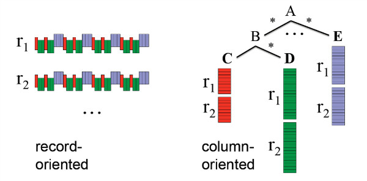
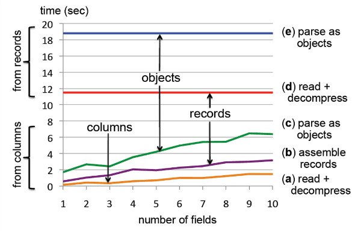
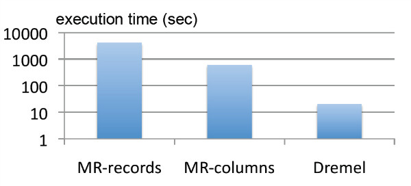
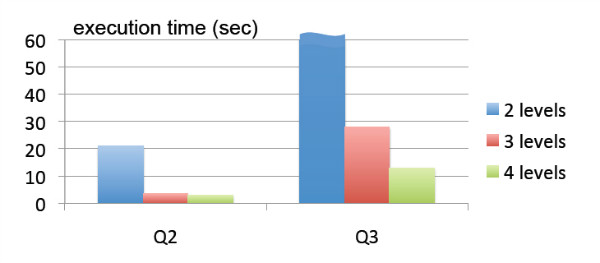
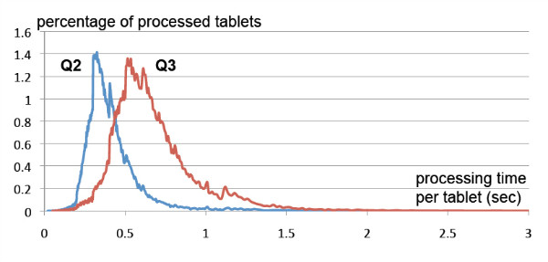

---
> **ARTS-week-44**
> 2022-10-30 14:12
---


###### ARTS-2019 左耳听风社群活动--每周完成一个 ARTS
- Algorithm： 每周至少做一个 leetcode 的算法题
- Review: 阅读并点评至少一篇英文技术文章
- Tip: 学习至少一个技术技巧
- Share: 分享一篇有观点和思考的技术文章

### 1.Algorithm:

- [934. 最短的桥 (^^+)](https://leetcode.cn/submissions/detail/376455509/)  
  + 思路:DFS
- [907. 子数组的最小值之和 (^^+)](https://leetcode.cn/submissions/detail/377359325/)  
  + 思路:模拟
- [784. 字母大小写全排列 (^^+)](https://leetcode.cn/submissions/detail/377767874/)  
  + 思路: 回溯

### 2.Review:

- [Dremel: Interactive Analysis of WebScaleDatasets](http://research.google.com/pubs/pub36632.html)

#### 点评：

- 摘要
Dremel是Google 的“交互式”数据分析系统。可以组建成规模上千的集群，处理PB级别的数据。MapReduce处理一个数据，需要分钟级的时间。作为MapReduce 的发起人，Google开发了Dremel将处理时间缩短到秒级，作为MapReduce的有力补充。Dremel作为Google BigQuery的report引擎，获得了很大的成功。最近Apache计划推出Dremel的开源实现Drill，将Dremel的技术又推到了浪尖上。

  - Google Dremel设计

根据Google公开的论文《Dremel: Interactive Analysis of WebScaleDatasets》可以看到Dremel的设计原理。还有一些测试报告。论文写于2006年，公开于2010年，Google在处理大数据方面，果真有得天独厚的优势。下面的内容，很大部分来自这篇论文。 　　

随着Hadoop的流行，大规模的数据分析系统已经越来越普及。数据分析师需要一个能将数据“玩转”的交互式系统。如此，就可以非常方便快捷的浏览数据，建立分析模型。Dremel系统有下面几个主要的特点：

    - Dremel是一个大规模系统。 在一个PB级别的数据集上面，将任务缩短到秒级，无疑需要大量的并发。磁盘的顺序读速度在100MB/S上下，那么在1S内处理1TB数据，意味着至少需要有1万个磁盘的并发读! Google一向是用廉价机器办大事的好手。但是机器越多，出问题概率越大，如此大的集群规模，需要有足够的容错考虑，保证整个分析的速度不被集群中的个别慢(坏)节点影响。 
    - Dremel是MR交互式查询能力不足的补充。和 MapReduce一样，Dremel也需要和数据运行在一起，将计算移动到数据上面。所以它需要GFS这样的文件系统作为存储层。在设计之初，Dremel并非是MapReduce的替代品，它只是可以执行非常快的分析，在使用的时候，常常用它来处理MapReduce的结果集或者用来建立分析原型。 
    - Dremel的数据模型是嵌套(nested)的。互联网数据常常是非关系型的。Dremel还需要有一个灵活的数据模型，这个数据模型至关重要。
    - Dremel支持一个嵌套(nested)的数据模型，类似于Json。而传统的关系模型，由于不可避免的有大量的Join操作，在处理如此大规模的数据的时候，往往是有心无力的。 Dremel中的数据是用列式存储的。使用列式存储，分析的时候，可以只扫描需要的那部分数据的时候，减少CPU和磁盘的访问量。同时列式存储是压缩友好的，使用压缩，可以综合CPU和磁盘，发挥最大的效能。对于关系型数据，如果使用列式存储，我们都很有经验。但是对于嵌套(nested)的结构，Dremel也可以用列存储，非常值得我们学习。Dremel结合了Web搜索 和并行DBMS的技术。首先，他借鉴了Web搜索中的“查询树”的概念，将一个相对巨大复杂的查询，分割成较小较简单的查询。大事化小，小事化了，能并发的在大量节点上跑。其次，和并行DBMS类似，Dremel可以提供了一个SQL-like的接口，就像Hive和Pig那样。

  - Google Dremel应用场景

设想一个使用场景。我们的美女数据分析师，她有一个新的想法要验证。要验证她的想法，需要在一个上亿条数据上面，跑一个查询，看看结果和她的想法是不是一样，她可不希望等太长时间，最好几秒钟结果就出来。当然她的想法不一定完善，还需要不断调整语句。然后她验证了想法，发现了数据中的价值。最后，她可以将这个语句完善成一个长期运行的任务。 　　

对于Google,数据一开始是放在GFS上的。可以通过MapReduce将数据导入到Dremel中去，在这些MapReduce中还可以做一些处理。然后分析师使用Dremel，轻松愉悦的分析数据，建立模型。最后可以编制成一个长期运行的MapReduce任务。 　　

这种处理方式，让笔者联想到Greenplum的Chorus. Chorus也可以为分析师提供快速的数据查询，不过解决方案是通过预处理，导入部分数据，减少数据集的大小。用的是三十六计，走为上计，避开的瞬时分析大数据的难题。Chorus最近即将开源，可以关注下。 　　

还有一点特别的就是按列存储的嵌套数据格式。如图所示，在按记录存储的模式中，一个记录的多列是连续的写在一起的。在按列存储中，可以将数据按列分开。也就是说，可以仅仅扫描A.B.C而不去读A.E或者A.B.C。难点在于，我们如何能同时高效地扫描若干列，并做一些分析。



  - Google Dremel数据模型 　　

在Google, 用Protocol Buffer常常作为序列化的方案。其数据模型可以用数学方法严格的表示如下：

      t=dom|<A1:t[\*|?],...,An:t[\*|?]>

其中t可以是一个基本类型或者组合类型。其中基本类型可以是integer,float和string。组合类型可以是若干个基本类型拼凑。星号 (\*)指的是任何类型都可以重复，就是数组一样。问号(?)指的是任意类型都是可以是可选的。简单来说，除了没有Map外，和一个Json几乎没有区别。 　　

下图是例子，Schema定义了一个组合类型Document.有一个必选列DocId，可选列Links，还有一个数组列Name。可以用Name.Language.Code来表示Code列。


这种数据格式是语言无关，平台无关的。可以使用Java来写MR程序来生成这个格式，然后用C++来读取。在这种列式存储中，能够快速通用处理也是非常的重要的。 　　

上图，是一个示例数据的抽象的模型;下图是这份数据在Dremel实际的存储的格式。


如果是关系型数据，而不是嵌套的结构。存储的时候，我们可以将每一列的值直接排列下来，不用引入其他的概念，也不会丢失数据。对于嵌套的结构，我们还需要两个变量R (Repetition Level) ,D (Definition Level) 才能存储其完整的信息。 　　

Repetition Level是记录该列的值是在哪一个级别上重复的。举个例子说明：对于Name.Language.Code 我们一共有三条非Null的记录。

1.第一个是”en-us”，出现在第一个Name的第一个Lanuage的第一个Code里面。在此之前，这三个元素是没有重复过的，都是第一个。所以其R为0。 2.第二个是”en”，出现在下一个Lanuage里面。也就是说Lanague是重复的元素。Name.Language.Code中Lanague排第二个，所以其R为2. 3.第三个是”en-gb”，出现在下一个Name中，Name是重复元素，排第一个，所以其R为1。

我们可以想象，将所有的没有值的列，设值为NULL。如果是数组列，我们也想象有一个NULL值。有了Repetition Level，我们就可以很好的用列表示嵌套的结构了。但是还有一点不足。就是还需要表示一个数组是不是我们想象出来的。 　　

Definition Level是定义的深度，用来记录该列是否是”想象”出来的。所以对于非NULL的记录，是没有意义的，其值必然为相同。同样举个例子。例如Name.Language.Country,

第一个”us”是在R1里面，其中Name,Language,Country是有定义的。所以D为3。 第二个”NULL”也是在R1的里面，其中Name,Language是有定义的,其他是想象的。所以D为2。 第三个”NULL”还是在R1的里面，其中Name是有定义的,其他是想象的。所以D为1。 第四个”gb”是在R1里面，其中Name,Language,Country是有定义的。所以D为3。 　　

就是这样，如果路径中有required，可以将其减去，因为required必然会define，记录其数量没有意义。 

理解了如何存储这种嵌套结构。写没有难度。读的时候，我们只读其中部分字段，来构建部分的数据模型。例如，只读取DocID和 Name.Language.Country。我们可以同时扫描两个字段，先扫描DocID。记录下第一个，然后发现下一个DocID的R是0;于是该读 Name.Language.Country，如果下一个R是1或者2就继续读，如果是0就开始读下一个DocID。


到此为止，我们已经知道了Dremel的数据结构。就像其他数据分析系统一样，数据结构确定下来，功能就决定了一大半。对于Dremel的数据查询，必然是“全表扫描”，但由于其巧妙的列存储设计，良好的数据模型设计可以回避掉大部分Join需求和扫描最少的列。

  - Google Dremel查询方式 　　
Dremel可以使用一种SQL-like的语法查询嵌套数据。由于Dremel的数据是只读的，并且会密集的发起多次类似的请求。所以可以保留上次请求的信息，还优化下次请求的explain过程。那又是如何explain的呢？


这是一个树状架构。当Client发其一个请求，根节点受到请求，根据metadata，将其分解到枝叶，直到到位于数据上面的叶子Server。他们扫描处理数据，又不断汇总到根节点。 　　

举个例子：对于请求：

```sql
SELECT A, COUNT(B) FROM T GROUP BY A
```

　根节点收到请求，会根据数据的分区请求，将请求变成可以拆分的样子。原来的请求会变为。 　　

```sql
SELECT A, SUM(c) FROM (R1 UNION ALL … Rn) GROUP BY A
```

R1,…RN是T的分区计算出的结果集。越大的表有越多的分区，越多的分区可以越好的支持并发。 

然后再将请求切分，发送到每个分区的叶子Server上面去,对于每个Server 　　

```sql
Ri = SELECT A, COUNT(B) AS c FROM Ti GROUP BY A 
```

结构集一定会比原始数据小很多，处理起来也更快。根服务器可以很快的将数据汇总。具体的聚合方式，可以使用现有的并行数据库技术。 　　

Dremel是一个多用户的系统。切割分配任务的时候，还需要考虑用户优先级和负载均衡。对于大型系统，还需要考虑容错，如果一个叶子Server出现故障或变慢，不能让整个查询也受到明显影响。 　　

通常情况下，每个计算节点，执行多个任务。例如，技巧中有3000个叶子Server，每个Server使用8个线程，有可以有24000个计算单元。如果一张表可以划分为100000个区，就意味着大约每个计算单元需要计算5个区。这执行的过程中，如果某一个计算单元太忙，就会另外启一个来计算。这个过程是动态分配的。 　　
对于GFS这样的存储，一份数据一般有3份拷贝，计算单元很容易就能分配到数据所在的节点上，典型的情况可以到达95%的命中率。 　　

Dremel还有一个配置，就是在执行查询的时候，可以指定扫描部分分区，比如可以扫描30%的分区，在使用的时候，相当于随机抽样，加快查询。

  - Google Dremel测试实验

实验的数据源如下表示。大部分数据复制了3次，也有一个两次。每个表会有若干分区，每个分区的大小在100K到800K之间。如果压缩率是25%，并且计入复制3份的事实的话。T1的大小已经达到PB级别。这幺小且巨量的分区，对于GFS的要求很高，现在的Hdfs稳定版恐怕受不了。接下来的测试会逐步揭示其是如何超过MR，并对性能作出分析。     

          
| 表名 | 记录数 | 大小(已压缩)  | 列数 | 数据中心 | 复制数量 |
| ------ | -------------- | ---- |---- |---- |---- | ---- |
|T1 | 85 billion | 87 TB    |   270   |  A   |     3×     
|T2 | 24 billion | 13 TB    |   530   |  A   |     3×     
|T3 | 4 billion  | 70 TB    |   1200  |  A   |     3×     
|T4 | 1+ trillion| 105 TB   |   50    |  B   |     2×     
|T5 | 1+ trillion| 20 TB    |   30    |  B   |     3×

  - 列存测试 　　

首先，我们测试看看列存的效果。对于T1表，1GB的数据大约有300K行，使用列存的话压缩后大约在375MB。这台机器磁盘的吞吐在70MB/s左右。这1GB的数据，就是我们的现在的测试数据源，测试环境是单机。



见上图。 

    - 曲线a是用列存读取数据并解压的耗时。 
    - 曲线b是一条一条记录挨个读的时间。 
    - 曲线c是在b的基础上，加上了反序列化的时间。 
    - 曲线d，是按行存读并解压的耗时。 
    - 曲线e加上了反序列化的时间。因为列很多，反序列化耗时超过了读并解压的50%。 　　

从图上可以看出。如果需要读的列很少的话，列存的优势就会特别的明显。对于列的增加，产生的耗时也几乎是线性的。而一条一条该个读和反序列化的开销是很大的，几乎都在原来基础上增加了一倍。而按行读，列数的增加没有影响，因为一次性读了全部列。

  - Dremel和MapReduce的对比测试

MR和Dremel最大的区别在于行存和列存。如果不能击败MapReduce，Remel就没有意义了。使用最常见的WordCount测试，计算这个数据中Word的个数。

```sql
Q1: SELECT SUM(CountWords(txtField)) / COUNT(*) FROM T1
```



上图是测试的结果。使用了两个MR任务。这两个任务和Dremel一样都运行在3000个节点上面。如果使用列存，Dremel的按列读的MR只需要读0.5TB的数据，而按行存需要读87TB。 MR提供了一个方便有效的途经来讲按行数据转换成按列的数据。Dremel可以方便的导入MapReduce的处理结果。

  - 树状计算Server测试 　　

接下来我们要对比在T2表示使用两个不同的Group BY查询。T2表有24 billion 行的记录。每个记录有一个 item列表，每一item有一个amount 字段。总共有40 billion个item.amount。这两个Query分别是。

```sql
Q2: SELECT country, SUM(item.amount) FROM T2 GROUP BY country 　　
Q3: SELECT domain, SUM(item.amount) FROM T2 WHERE domain CONTAINS ’.net’ GROUP BY domain
```

Q2需要扫描60GB的压缩数据，Q3需要扫描180GB，同时还要过滤一个条件。



上图是这两个Query在不同的server拓扑下的性能。每个测试都是有2900个叶子Server。在2级拓扑中，根server直接和叶子 Server通信。在3级拓扑中，各个级别的比例是1:100:2900，增加了100个中间Server。在4级拓扑中，比例为 1:10:100:2900. 　　

Q2可以在3级拓扑下3秒内执行完毕，但是为他提供更高的拓扑级别，对性能提升没有裨益。相比之下，为Q3提供更高的拓扑级别，性能可以有效提升。这个测试体现了树状拓扑对性能提升的作用。 　　

  - 每个分区的执行情况 　　

对于刚刚的两个查询，具体的每个分区的执行情况是这样的。



可以看到99%的分区都在1s内完成了。Dremel会自动调度，使用新的Server计算拖后腿的任务。 　　

  - 记录内聚合 　　

由于Demel支持List的数据类型，有的时候，我们需要计算每个记录里面的各个List的聚合。如

```sql
Q4 : SELECT COUNT(c1 > c2) FROM 　　(SELECT SUM(a.b.c.d) WITHIN RECORD AS c1, 　　SUM(a.b.p.q.r) WITHIN RECORD AS c2 　　FROM T3)
```

我们需要count所有sum(a.b.c.d)比sum(a.b.p.q.r)，执行这条语句实际只需要扫描13GB的数据，耗时15s，而整张表有70TB。如果没有这样的嵌套数据结构，这样的查询会很复杂。 　　

  - 扩展性测试 　　

Dremel有良好的扩展性，可以通过增加机器来缩短查询的时间。并且可以处理数以万亿计的记录。 　　

对于查询：

```sql
Q5: SELECT TOP(aid, 20), COUNT(*) FROM T4 WHERE bid = fvalue1g AND cid = fvalue2g
```

使用不同的叶子Server数目来进行测试。


可以发现CPU的耗时总数是基本不变的，在30万秒左右。但是随着节点数的增加，执行时间也会相应缩短。几乎呈线性递减。如果我们使用通过CPU时间计费的“云计算”机器，每个租户的查询都可以很快，成本也会非常低廉。 　　

  - 容错测试 　　

一个大团队里面，总有几个拖油瓶。对于有万亿条记录的T5，我们执行下面的语句。

```sql
Q6: SELECT COUNT(DISTINCT a) FROM T5
```

可以看到99%的分区都在5S内完成的。不幸的是，有一些分区需要较长的时间来处理。尽管通过动态调度可以加快一些，但在如此大规模的计算上面，很难完全不出问题。如果不在意太精确的结果，完全可以小小减少覆盖的比例，大大提升相应速度。 　　

  - Google Dremel 的影响 　　

Google Dremel的能在如此短的时间内处理这么大的数据，的确是十分惊艳的。有个伯克利分校的教授Armando Fox说过一句话“如果曾事先告诉我Dremel声称其将可做些什么，那么我不会相信能开发出这种工具”。这么给力的技术，必然对业界造成巨大的影响。第一个被波及到的必然是Hadoop。 　

  - Dremel与Hadoop 　　

Dremel的公开论文里面已经说的很明白，Dremel不是用来替代MapReduce，而是和其更好的结合。Hadoop的Hive，Pig无法提供及时的查询，而Dremel的快速查询技术可以给Hadoop提供有力的补充。同时Dremel可以用来分析MapReduce的结果集，只需要将 MapReduce的OutputFormat修改为Dremel的格式，就可以几乎不引入额外开销，将数据导入Dremel。使用Dremel来开发数据分析模型，MapReduce来执行数据分析模型。 　　

Hadoop的Hive,Pig现在也有了列存的模式，架构上和Dremel也接近。但是无论存储结构还是计算方式都没有Dremel精致。对 Hadoop实时性的改进也一直是个热点话题。要想在Hadoop中山寨一个Dremel，并且相对现有解决方案有突破，笔者觉得Hadoop自身需要一些改进。一个是HDFS需要对并发细碎的数据读性能有大的改进，HDFS需要更加的低延迟。再者是Hadoop需要不仅仅支持MapReduce这一种计算框架。其他部分,Hadoop都有对应的开源组件，万事俱备只欠东风。

  - Dremel的开源实现 　　

Dremel现在还没有一个可以运行的开源实现，不过我们看到很多努力。一个是Apache的Drill，一个是OpenDremel/Dazo。 　　

  - OpenDremel/Dazo 　　

OpenDremel是一个开源项目，最近改名为Dazo。可以在GoogleCode上找到http://code.google.com/p/dremel/。目前还没有发布。作者声称他已经完成了一个通用执行引擎和OpenStack Swift的集成。笔者感觉其越走越歪，离Dremel越来越远了。 　　

  - Apache Drill 　　

Drill 是 Hadoop的赞助商之一MapR发起的。Drill作为一个Dremel的山寨项目，有和Dremel相似的架构和能力。他们希望Drill最终会想 Hive,Pig一样成为Hadoop上的重要组成部分。为Hadoop提供快速查询的能力。和Dremel有一点不同，在数据模型上，开源的项目需要支持更标准的数据结构。比如CSV和JSON。同时Drill还有更大的灵活性，支持多重查询语言，多种接口。 　　

现在Drill的目标是完成初始的需求，架构。完成一个初始的实现。这个实现包括一个执行引擎和DrQL。DrQL是一个基于列的格式，类似于Dremel。目前，Drill已经完成的需求和架构设计。总共分为了四个组件

    - Query language:类似Google BigQuery的查询语言，支持嵌套模型，名为DrQL. 
    - Low-lantency distribute execution engine:执行引擎，可以支持大规模扩展和容错。可以运行在上万台机器上计算数以PB的数据。 
    - Nested data format:嵌套数据模型，和Dremel类似。也支持CSV,JSON,YAML类似的模型。这样执行引擎就可以支持更多的数据类型。 
    - Scalable data source: 支持多种数据源，现阶段以Hadoop为数据源。 　　

目前这四个组件在分别积极的推进，Drill也非常希望有社区其他公司来加入。Drill希望加入到Hadoop生态系统中去。

  - 最后的话 　　

本文介绍了Google Dremel的使用场景，设计实现，测试实验，和对开源世界的影响。相信不久的将来，Dremel的技术会得到广泛的应用。

### 3.Tip:

#### MYSQL查询今天、昨天、7天前、30天、本月数据
在基于Spring框架的项目中，可以通过在ApplicationContext-MVC.xml（即SpringMVC配置）文件中配置 ExceptionResolver 的bean ，来配置 全局捕获异常处理 类，然后自定义异常处理类处理。注意如果是spring配置文件中定义过的ExceptionResolver 类，不需要添加@Component。如果是SpringBoot 则需要。这是因为springboot没有自定义配置全局异常捕获类，所以需要添加@Component,来标识该类为Bean。

```
今天：
SELECT * FROM 表名 WHERE TO_DAYS( 时间字段名) = TO_DAYS(NOW());

昨天：
SELECT * FROM 表名 WHERE TO_DAYS( NOW( ) ) - TO_DAYS( 时间字段名) <= 1;

7天前：
SELECT * FROM 表名 where DATE_SUB(CURDATE(), INTERVAL 7 DAY) <= date(时间字段名);

30天：
SELECT * FROM 表名 where DATE_SUB(CURDATE(), INTERVAL 30 DAY) <= date(时间字段名);

本月：
SELECT * FROM 表名 WHERE DATE_FORMAT( 时间字段名, '%Y%m' ) = DATE_FORMAT( CURDATE( ) , '%Y%m' );
```

#### 理解Linux文件3个时间信息（access time，modify time，change time）
在Linux中使用stat命令来查看文件的详细信息，会出现3个类型的时间，分别是Access，Modify，Change。
access time：表示最后一次访问（仅仅是访问，没有改动）文件的时间。
modify time：表示最后一次修改文件的时间。
change time：表示最后一次对文件属性改变的时间，包括权限，大小，属性等等。
总结：
  1）当仅读取或访问文件时，access time 改变，而modify time ，change time 不会改变。
  2）当修改文件内容时，modify time ，change time 会改变，access time 不一定改变。
  3）当修改文件权限属性时，change time 改变，而access time ，modify time 不会改变。

### 4.Share:

- [程序员必备画图技能之——时序图](https://www.cnblogs.com/54chensongxia/p/13236965.html)

- [Java进阶——Java中的Atomic原子特性](https://blog.csdn.net/qq_30379689/article/details/80785650)

- [MySQL UPDATE多表关联更新](http://c.biancheng.net/view/8286.html)

- [Bit packing of array of integers](https://www.e-learn.cn/topic/753095)

- [StoneDB 读、写操作的执行过程](https://zhuanlan.zhihu.com/p/553827965)

- [MySQL · RocksDB · Memtable flush分析](https://zhuanlan.zhihu.com/p/414145200)

- [rocksdb介绍之compaction流程](https://blog.csdn.net/xuhaitao23/article/details/125430516)

- [LevelDB 和 RocksDB 结构详解](https://daemondshu.github.io/2019/03/21/Programming/Data%20Structure/LevelDB_RocksDB/)

- [LevelDB笔记](https://zhuanlan.zhihu.com/p/560749237)

- [Google Dremel 原理 – 如何能3秒分析1PB](http://yankay.com/google-dremel-rationale/)