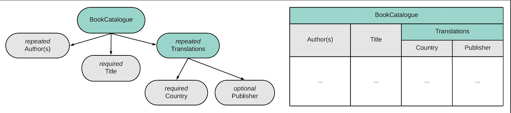
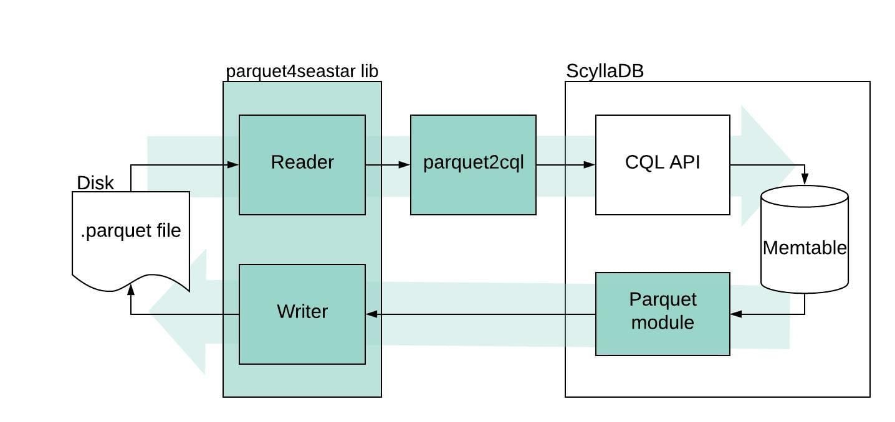
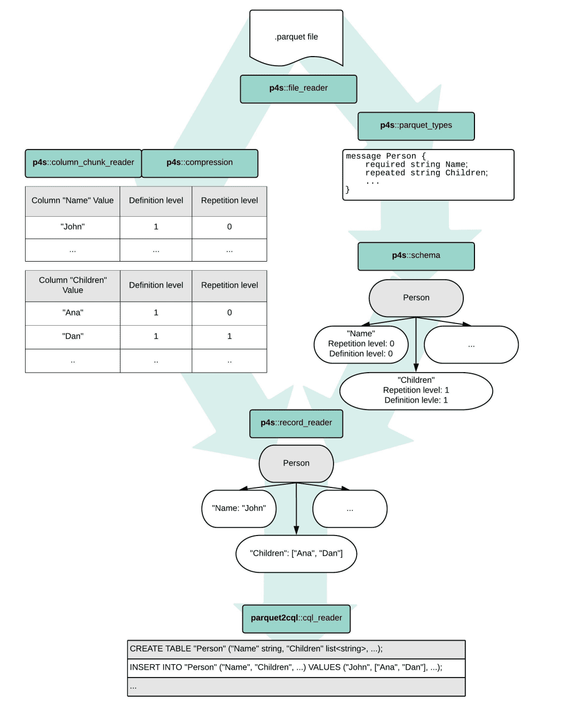
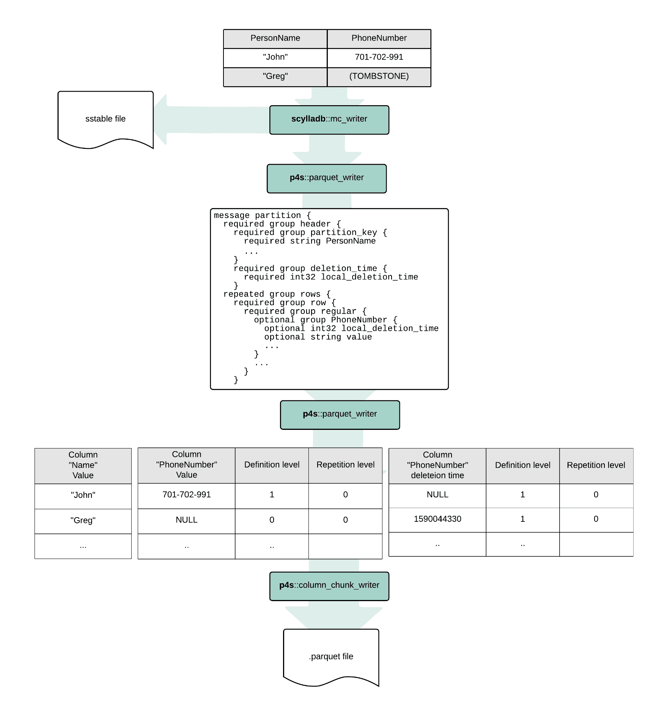
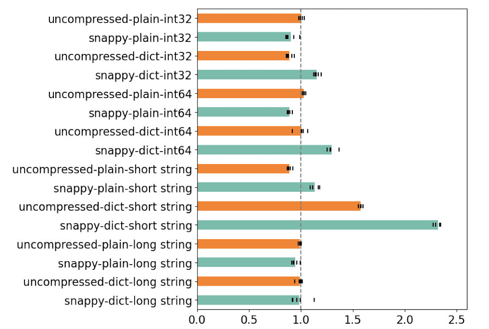
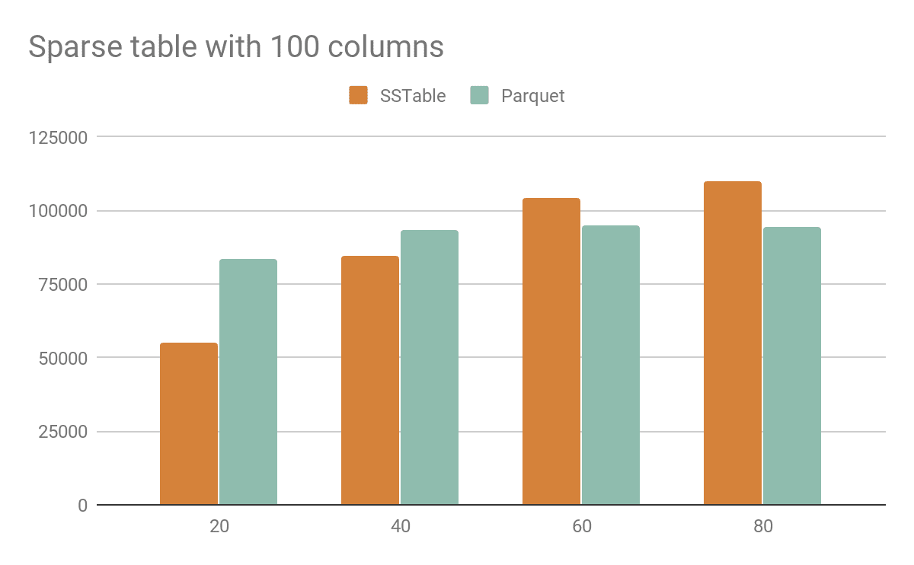

---
> **ARTS-week-46**
> 2022-11-12 21:06
---


###### ARTS-2019 左耳听风社群活动--每周完成一个 ARTS
- Algorithm： 每周至少做一个 leetcode 的算法题
- Review: 阅读并点评至少一篇英文技术文章
- Tip: 学习至少一个技术技巧
- Share: 分享一篇有观点和思考的技术文章

### 1.Algorithm:

- [816. 模糊坐标 (^^+)](https://leetcode.cn/submissions/detail/380171120/)  
  + 思路:枚举
- [764. 最大加号标志 (^^+)](https://leetcode.cn/submissions/detail/381010262/)  
  + 思路:模拟
- [790. 多米诺和托米诺平铺 (^^+)](https://leetcode.cn/submissions/detail/381492467/)  
  + 思路: DP

### 2.Review:

- [Apache Parquet support for ScyllaDB](https://docslib.org/doc/11888741/apache-parquet-support-for-scylladb)  
- [ScyllaDB Student Projects, Part I: Parquet](https://www.scylladb.com/2020/08/05/scylla-student-projects-part-i-parquet/)

#### 点评：

2019年，ScyllaDB赞助了华沙大学为计算机科学专业的学生组织的一个项目。在整个学年中，3个本科生团队与ScyllaDB工程师合作并向他们学习，为ScyllaDB及其底层Seastar引擎带来了新功能。2019年版选择的项目是：
 - 对 Seastar 和 ScyllaDB 的 Parquet 支持
 - SeastarFS：Seastar的异步用户空间文件系统
 - Seastar 和 ScyllaDB 的 Kafka 客户端
我们很高兴地宣布，合作非常成功，我们期待参加该计划的未来版本！现在，让我们看看列表中第一个项目结果的一些细节：对Seastar和ScyllaDB的Parquet支持。这项工作完全归功于撰写它的学生Samvel Abrahamyan，Michał Chojnowski，Adam Czajkowski和Jacek Karwowski以及他们的导师Robert Dąbrowski博士。

- 介绍

Apache Parquet是一种众所周知的列式存储格式，被合并到Apache Arrow，Apache Spark SQL，Pandas和其他项目中。在其列中，它可以存储简单类型以及复杂的嵌套对象和数据结构。与经典的基于行的方法相比，将数据表示为列具有有趣的优势：
 - 从表中获取特定列需要较少的 I/O，因为不会从磁盘读取其他列的冗余值
 - 列中的值通常彼此相同或相似，这提高了压缩算法的效率
 - 有趣的数据编码方案，如位打包整数，可以很容易地应用
 - 更复杂的操作，例如聚合单个列中的所有值，可以更有效地实现（例如，通过利用矢量化 CPU 指令）



Parquet 文件格式的示例，显示了它如何根据列式数据中的重复值进行优化。

ScyllaDB 使用 SSTables 作为其原生存储格式，但我们有兴趣允许用户为某些工作负载选择另一种格式（如 Parquet）。这是追求这个学生项目的主要动机。

- 如何将 ScyllaDB 与 Parquet 集成？
Parquet是开源的，非常流行，被许多项目和公司广泛使用，那么为什么不使用现有的C++库并将其直接插入ScyllaDB？简短的回答是“延迟”。

ScyllaDB建立在Seastar之上，Seastar是一个异步的高性能C++框架。Seastar 是根据无共享原则创建的，它有自己的非阻塞 I/O 原语、调度程序、优先级组和许多其他机制，专门用于确保低延迟和最优化的硬件利用率。在 Seastar 世界中，发出阻塞系统调用（如）是一个不可原谅的错误，也是性能杀手。这也意味着，许多依赖传统阻塞系统调用（不小心使用）的库在基于 Seastar 的项目中使用时会产生这样的性能回归——Parquet 的C++实现在这方面也不例外。read()

有多种方法可以使库适应 Seastar，但在这种情况下，最简单的答案是最好的 - 让我们编写我们自己的答案！镶木地板有据可查，其规格很短，因此非常适合一群勇敢的学生尝试在 Seastar 中从头开始实施它。

- 实施parquet4seastar

剧透警告：该库已经实现并且可以工作！

[parquet4seastar](https://github.com/michoecho/parquet4seastar)

该项目的第一次迭代是尝试简单地从 Arrow 的存储库中复制整个代码，并将所有 I/O 调用替换为与 Seastar 兼容的调用。这也意味着将一切重写为Seastar的未来/承诺模型，这是一项无聊而机械的任务，但也很容易做到。不幸的是，很快就发现Apache Arrow的Parquet实现在Arrow本身中有很多依赖关系。因此，为了避免重写越来越多的行，我们做出了一个决定：让我们重新开始，采用 Parquet 文档并编写一个简单的库，用于在 Seastar 之上从头开始构建的 Parquet 文件。

学生们引用了这种方法的其他优点：通过从头开始编写，他们可以避免任何技术债务，并最大限度地减少要添加到现有代码库中的代码行数，最重要的是，他们认为这会更有趣！



parquet4seastar 和 parquet2cql 如何设计与 ScyllaDB 数据库交互的框图。

该库是使用最先进的 Seastar 实践编写的，这意味着已采取措施最大限度地提高性能，同时保持较低的延迟。性能测试表明，反应堆失速全部来自外部压缩库——当然，也可以在Seastar中重写。

我们还很高兴地发现，Parquet 在 Apache Arrow 中的C++实现附带了一套全面的单元测试——这些测试针对 parquet4seastar 进行了调整，用于确保我们的重新实现至少与原始实现一样正确。

尽管如此，我们的主要目标是使库易于与现有的Seastar项目（如ScyllaDB）集成。作为库的第一步和概念验证，创建了一个读取 Parquet 文件并将其转换为 CQL 查询的小型应用程序。

- parquet2CQL

Parquet2CQL是一个小型演示应用程序，展示了parquet4seastar库的潜力。它从磁盘读取 Parquet 文件，获取特定表的 CQL 架构并吐出 CQL 查询，准备通过 cqlsh 或任何 CQL 驱动程序注入到 ScyllaDB 中。请在下面找到一个很酷的图表，显示了 parquet2cql 的工作原理。“P4s”代表“Parquet4seastar”。



parquet2cql 可以用作将 Parquet 数据直接加载到 ScyllaDB 中的粗略方式，但它仍然只是一个演示应用程序——例如，它不支持 CQL 准备语句，这将使过程更加优化。对于那些有兴趣将 Parquet 数据迁移到 ScyllaDB 集群的用户，有一种方法可以使用我们的 ScyllaDB Spark Migrator 摄取 Parquet 文件。

- 与 ScyllaDB 集成

允许 ScyllaDB 将其数据存储在 Parquet 中而不是经典的 SSTable 格式中超出了该项目的范围，但是，尽管如此，一个概念验证演示不仅以本机 MC 格式存储 SSTable 数据文件，而且还以 Parquet 格式存储，成功执行！该实现假定表中不存在复杂类型（列表、集合）。此实验使我们能够比较对各种工作负载使用 Parquet 与 SSTable mc 格式的性能和存储开销。下图显示了实验是如何进行的：



- 结果

该项目不仅涉及编码 - 其中很大一部分是运行各种正确性和性能测试和比较。其中一个测试检查了parquet4seastar库是否比Apache Arrow的哥哥更快。以下是示例结果：



parquet4seastar 相对于 Apache Arrow 的读取时间（越短意味着 parquet4seastar 更快）。

结果表明，parquet4seastar在执行时间方面与Apache Arrow大致相似（短字符串场景除外，这是设计决策的结果，请在下面的论文中找到更多详细信息）。结果很有希望，因为它们意味着通过使用非阻塞 I/O 和未来/承诺模型提供更好的延迟保证不会导致任何执行时间开销。除了将库与Apache Arrow进行比较之外，还运行了更多的测试场景 - 测量反应堆失速，比较以本机MC格式存储的SSTables的大小与Parquet存储的大小等。

在这里，我们比较了Parquet和SSTables之间的磁盘使用情况。上图显示了第一次测试的结果，其中学生每次插入一百万行随机字符串，但有些值是重复的。横轴显示每个值的重复项数，纵轴显示文件的总大小。可以看到，在此测试中，镶木地板的效率更高。



在此示例中，学生测试了一个具有多个 NULL 值的表，这是稀疏数据集的典型特征。水平轴显示随机选择的列数，这些列不是 NULL，而是具有随机值。在这种情况下，可以看到当大多数列为 NULL 时，SSTables 是一种更好的格式。

从这些测试中可以得出结论，当数据不为空但唯一值的数量不是很大时，使用 Parquet 可以节省大量磁盘空间。

### 3.Tip:

#### Android Studio 错误: 编码GBK的不可映射字符

在项目下的build.gradle中添加以下代码即可解决
```shell
tasks.withType(JavaCompile) {
    options.encoding = "UTF-8"
}
```

#### Android App异常退出时重新启动

```java
public class MyApplication extends Application {

    private static MyApplication application;
    @Override
    public void onCreate() {
        super.onCreate();
        application = this;
        // 程序崩溃时触发线程  以下用来捕获程序崩溃异常
        Thread.setDefaultUncaughtExceptionHandler(handler); 
    }
   private Thread.UncaughtExceptionHandler handler = new Thread.UncaughtExceptionHandler() {
        @Override
        public void uncaughtException(Thread t, Throwable e) {
            restartApp(); //发生崩溃异常时,重启应用
        }
    };
    private void restartApp() {
        Intent intent = new Intent(this, MainActivity.class);
        PendingIntent restartIntent = PendingIntent.getActivity(
                application.getApplicationContext(), 0, intent,Intent.FLAG_ACTIVITY_NEW_TASK);
        //退出程序
        AlarmManager mgr = (AlarmManager)application.getSystemService(Context.ALARM_SERVICE);
        mgr.set(AlarmManager.RTC, System.currentTimeMillis() + 1000,
                restartIntent); // 1秒钟后重启应用

        //结束进程之前可以把程序的注销或者退出代码放在这段代码之前
        android.os.Process.killProcess(android.os.Process.myPid());
    }

}
```

#### 循环遍历JSONObject的一种方法

```java
for(String str:obj.keySet()){
  System.out.println(str + ":" +obj.get(str));
}
```

### 4.Share:

- [开源代码统计工具 cloc](https://github.com/AlDanial/cloc)

- [android WebView的cookie机制](https://www.jianshu.com/p/1e7980c50f13)

- [Chrome 控制台console的用法（js 调试）](https://blog.csdn.net/Hhy_9288/article/details/78222451)

- [android 获取设备信息的IP地址和Mac地址—亲测无误！！](https://blog.csdn.net/qq_34902522/article/details/78962893)