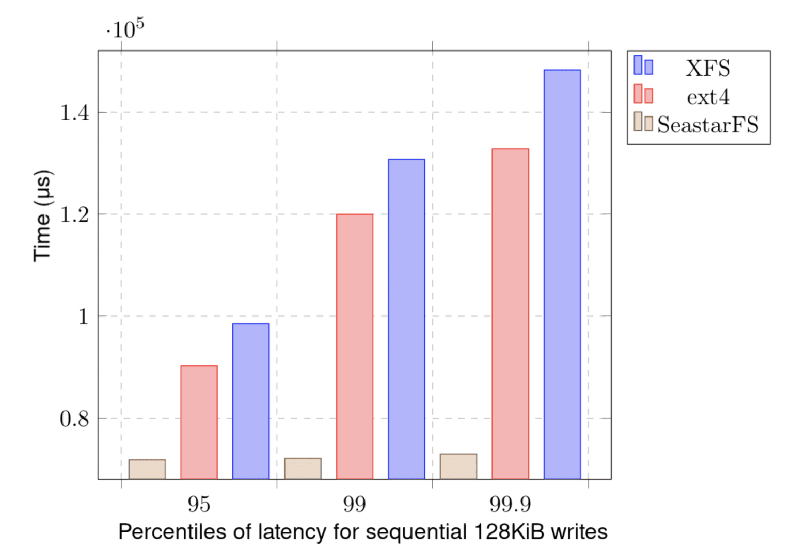
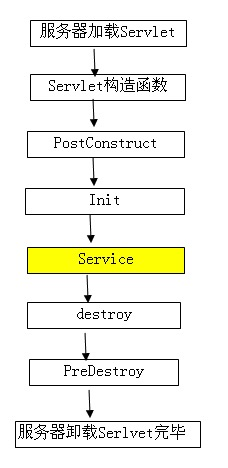

---
> **ARTS-week-47**
> 2022-11-20 08:52
---


###### ARTS-2019 左耳听风社群活动--每周完成一个 ARTS
- Algorithm： 每周至少做一个 leetcode 的算法题
- Review: 阅读并点评至少一篇英文技术文章
- Tip: 学习至少一个技术技巧
- Share: 分享一篇有观点和思考的技术文章

### 1.Algorithm:

- [775. 全局倒置与局部倒置 (^^+)](https://leetcode.cn/submissions/detail/382593431/)  
  + 思路:贪心
- [792. 匹配子序列的单词数 (^^+)](https://leetcode.cn/submissions/detail/382896105/)  
  + 思路:二分
- [799. 香槟塔 (^^+)](https://leetcode.cn/submissions/detail/383400908/)  
  + 思路: 模拟

### 2.Review:

- [Apache Parquet support for ScyllaDB](https://docslib.org/doc/11888741/apache-parquet-support-for-scylladb)  
- [scylla-student-projects-part-ii-implementing-an-async-userspace-file-system](https://www.scylladb.com/2020/08/25/scylla-student-projects-part-ii-implementing-an-async-userspace-file-system/)

#### 点评：

实现文件系统是一项复杂的任务，但与普遍的看法相反，它并不等同于编写内核模块并实现 POSIX 指定和标准化的完整 API，具有硬链接、3 种类型的文件锁定机制、扩展属性等。事实上，任何允许其用户拥有“文件”概念的程序或库，可以查找，写入和读取，已经是一个文件系统。今天，文件系统有很多种 - 有些是分布式的，有些只驻留在RAM中，其中相当一部分实际上是在用户空间中编写的。在这篇文章中，我将介绍由 ScyllaDB 赞助的一个学生项目的详细信息，该项目创建了一个完全异步的日志结构文件系统，在 Seastar 中从头开始编写。

- 简介

2019年，ScyllaDB 赞助了华沙(University of Warsaw)大学为计算机科学专业的学生组织的一个项目。在整个学年中，3个本科生团队与 ScyllaDB 工程师合作并向他们学习，为 ScyllaDB 及其底层 Seastar 引擎带来了新功能。2019年版选择的项目是：

 - 对 Seastar 和 ScyllaDB 的 Parquet 支持（参见第 I 部分）)
 - SeastarFS：Seastar的异步用户空间文件系统（这篇文章）
 - Seastar和ScyllaDB的Kafka客户端（尚未推出！）

这篇博文描述了SeastarFS项目的进展。这项工作完全归功于撰写它的学生，Krzysztof Małysa，Wojciech Mitros，Michał Niciejewski和Aleksandr Sorokin以及他们的导师Jacek Sroka博士。

- 动机

为什么要从头开始编写文件系统？第一个也是最明显的原因是它很有趣！就SeastarFS而言，以下因素也非常重要：

  - 1.缺乏替代方案。ScyllaDB 对文件系统有非常具体的延迟要求，XFS 是迄今为止唯一被认为足够好的系统。ScyllaDB 的写入路径可以从日志结构文件系统中受益（更多内容见下文），但没有这样的系统满足令人满意的要求。
  - 2.开销。传统的文件系统是在内核中实现的，这意味着用户被迫使用系统调用来与它们通信。这会产生额外的开销，可以通过将更多工作转移到用户空间来避免。
  - 3.安全。依赖第三方软件很容易，但它也伴随着风险——将来潜入 XFS 的错误可能会导致破坏延迟保证，因为文件系统的行为方式将不再与 ScyllaDB 预期的方式相同。提供我们自己的实现可以减少对外部项目的依赖。
  - 4.控制。在 Seastar 中 100% 编写文件系统，我们能够：

     - 通过为每个操作设置适当的优先级与 Seastar 调度程序集成
     - 严格控制文件系统使用的内存量
     - 提供严格的延迟保证，因为一切都是用 Seastar 异步原语编写的
     - 在非常具体的地方收集有价值的指标
     - 随心所欲地添加调试代码，而无需重新编译内核

  - 5.分片感知。Seastar 是在无共享设计中编写的，在内核中使用集中式文件系统并不适合该模型。
  - 6.完整性。Seastar距离成为一个成熟的操作系统已经只有几英寸的距离。它有自己的调度程序、内存管理、I/O 原语、线程...唯一缺少的是它自己的文件系统！

- 接口

SeastarFS 并不努力成为一个通用的、符合 POSIX 标准的文件系统。这是一个高度专业化的项目，旨在根据以下几个假设提供尽可能高的吞吐量和最低的延迟：

  - 文件很大。虽然系统应该在小文件上正常工作，但它应该针对以兆字节、千兆字节和太字节为单位的大小进行优化。
  - 没有热文件或目录。鉴于 Seastar 的无共享设计，系统希望多个用户处理自己的文件，而不必在多个用户之间共享资源。虽然任何用户都应该可以访问任何文件，但优化路径假设没有冲突，并且每个客户端都处理自己的文件。
  - 主要是顺序读/写。该系统允许对文件和目录进行许多方便的操作（例如重命名文件），但它期望最常见的操作是读取和写入长序列 - 即使以使其他操作（如重命名或随机写入）变慢为代价，它们也会得到优化。
幸运的是，ScyllaDB 就是这样做的——它主要在大型的、仅追加的文件（提交日志和 SSTables）上运行，并且已经用 Seastar 的无共享设计编写。

SeastarFS的界面类似于用户可以在符合POSIX的系统上执行的操作，但没有所有深奥的功能，如扩展属性或系统内文件锁定。以下是文件当前在 SeastarFS 中可以执行的操作的草稿界面：

- 日志结构化文件系统

SeastarFS是一个日志结构的文件系统，这意味着它将其数据和元数据存储在日志（duh）中。传统的文件系统通常将其元数据和数据保存在设备上分配的块中。将文件写入此类文件系统会导致更新某些磁盘上的元数据结构，为数据分配块，最后将数据刷新到磁盘。下面是一个粗略的示例，说明在 500 字节文件中间写入 1000 字节的简单操作到达设备时可能发生的情况：

  - 1.以偏移量 672 写入 8 字节 // 更新文件 F 的 mTime（修改时间）
  - 2.以偏移量 608 写入 8 个字节 // 文件 F 的大小已更新
  - 3.在偏移量处写入 512 字节 1036288 // 写入 F 数据的第一个块
  - 4.在偏移量 48 处写入 8 个字节 // 文件系统的元数据已更新：分配了新块
  - 5.在偏移量处写入 488 字节 4518912 // 写入新的 F 数据的第二个块

磁盘访问：


重点是，即使写入单个连续的字节流也会导致许多随机写入到达存储设备。即使对于现代NVMe驱动器来说，这也是一种次优模式，更不用说好的老式HDD——执行操作的总时间为Ls + x/T，其中Ls是寻道延迟，T是吞吐量，x是读/写的字节数。当Ls = 4ms且T = 500 MiB/s时，在一个块中写入1，000字节的平均时间为4ms +2μs≈4ms，而以10个不同的偏移量批量写入1，000字节将持续约10（4ms + 0.2μs）≈40ms，这显然使寻道延迟成为决定性因素。即使是现代 SSD 磁盘也更喜欢大批量顺序访问，尤其是在操作小于内部页面大小的情况下。小操作意味着读取时工作量更大，写入时设备磨损更快，因为内部 SSD 垃圾收集需要在下面执行更多工作——闪存驱动器往往会以块粒度擦除。

上面一段中提到的问题可以通过更改文件系统存储其数据和元数据的方式来解决。例如，假设整个磁盘被分成相对较少的固定大小块（例如 16MiB），充当日志。现在，发送到文件系统的每个元数据操作都会附加到其中一个此类日志中，始终位于末尾。与上面的示例不同，在这样的系统中更新元数据可能如下所示，假设日志中的第一个空闲位置位于字节 376：

  - 以偏移量 376 写入 16 字节 // 文件 F 的 mTime 已更新
  - 以偏移量 16 写入 384 个字节 // 文件 F 的大小已更新
  - 在偏移量 392 处写入 16 个字节 // 分配了一个新块

到目前为止的磁盘访问：


现在，类似的想法可以应用于数据：

  - 非常小的写入，其大小与元数据条目的大小相当，可以直接存储在元数据日志中
  - 中等大小的写入最终会出现在专用于中等写入的特殊日志中
  - 大小大于块本身的大型写入被简单地分成块

继续我们的简化示例，1000B 写入最终出现在其中一个介质数据日志中：


当用作元数据日志的特定块已满时会发生什么情况？假设系统中有可用的可用块，则分配一个新块，并将指向此新日志的“指针”（只是磁盘上的偏移量）作为最后一个条目附加到旧日志中。这样，元数据日志将创建存储在磁盘上的链接列表。稍后在引导系统时可以遍历该列表。

- 引导

与任何其他文件系统一样，SeastarFS 在使用之前需要引导 - 所有元数据都需要验证并加载到 RAM 中。为了能够做到这一点，在设备上的特定偏移量中创建了一个引导记录 - 首先，它是由格式化磁盘的辅助程序完成的 - 就像mkfs一样。引导记录包含文件系统元数据、控制总和、元数据的偏移量和数据日志等。当系统启动时，它会尝试从指定的偏移量（例如 0）加载结构，如果它成功验证引导记录是真实且一致的，则所有元数据都从磁盘日志中加载。验证包括：

  - 检查一个魔法数字，这是文件系统的惯例（例如，XFS 使用一个 32 位数字，表示 ASCII 中的“XFSB”）;
  - 健全性检查文件系统元数据：例如，如果块大小大于设备本身，则可能已关闭，我们不应该继续启动;
  - 从元数据日志加载元数据，其中包括验证元数据校验和和各种健全性检查。

以下是 SeastarFS 的引导记录：

- 压缩

日志结构化文件系统听起来很棒，因为它们具有更好的设备访问模式，但有一个问题。条目总是附加到日志的后面，但这也意味着一些存储的信息开始完全冗余。如果我们的磁盘无限大，或者我们在引导系统时不必读取整个日志，那将不是问题，但不幸的是，这一切都不是真的。让我们看一个示例日志（简化）：

  - 1.在目录 / 中创建一个文件 f，分配索引节点编号 F
  - 2.将文件 F 的大小更新为 3
  - 3.将“abc”写入偏移量为 0 的文件 F
  - 4.将文件 F 的大小更新为 7
  - 5.将“defg”写入偏移量 3 处的文件 F
  - 6.将文件 F 截断为大小 0
  - 7.将文件 F 从 /f 重命名为 /some/other/directory/g
  - 8.删除文件 F
  - 9.在目录 / 中创建一个文件 h，分配索引节点编号 H

在执行 8 个操作中的每一个时，其元数据条目非常有意义，并且需要使信息保持最新。但是，当我们执行操作 6 后，操作 1-5 已经过时了。如果系统现在已关闭，并且稍后从日志中还原元数据，则是否临时将某些内容写入文件并不重要，因为它的大小最终为 0。同样，到达操作 8 后，根本不需要操作 1-7。这是个好消息——一个回收空间的机会。怎么做？我们不能只是就地重写日志，因为这会破坏避免随机写入的整个想法，并且如果在重写过程中电量耗尽，也可能成为不一致的来源。我们可以做的是选择一个新的空日志，只重写旧日志中有意义的部分，然后才删除旧日志。上面日志的压缩形式如下所示：

  - 1.在目录 / 中创建一个文件 h，分配索引节点编号 H

就是这样！

何时压缩日志？这不是一个微不足道的决定，因为压缩涉及重写整个块，这在 I/O 方面是昂贵的。最好只压缩块，如果其中很大一部分将被丢弃。例如，如果日志中的 10，000 个条目中只有 3 个条目已过时，则仅为了回收几个字节而将 9，997 个条目重写到新日志是没有意义的。但是，如果 60% 的日志已经过时，则很容易启动压缩过程。请注意，即使压缩的最终目标是回收内存，它也暂时需要为重写分配一个新块。最好保留一些仅用于压缩的块，因为如果 100% 的磁盘已经被用户数据占用，那么压缩任何内容都已经太晚了。

如果可能，最好在文件系统上的负载较低时执行压缩，例如所有用户当前都处于睡眠状态，但是，鉴于 Seastar 精通为后台任务分配适当的优先级，即使系统目前被大量使用，压缩也会进展缓慢。

敏锐的读者可能注意到这个过程和在SSTables上执行的压缩之间的相似之处 - 这里不是巧合，ScyllaDB的写入路径已经受到日志结构设计的严重影响。

- 锁定

必须谨慎地在文件系统上执行并发操作，因为元数据需要始终处于一致状态。没有锁很容易导致不一致（例如，创建两个具有相同路径的文件），而朴素锁定会导致微妙的死锁。为了防止此类问题，我们的实现包括一个锁管理系统，该系统提供独占和共享锁定以及锁排序以防止死锁。核心思想是文件系统需要两种基本类型的锁：索引节点锁和 dentry 锁。索引节点锁与特定文件相关联，而 dentry 锁保护特定的目录条目。单个文件系统操作可能涉及多个锁。例如，创建文件涉及：

  - 1.锁定目录（共享锁） – 这样它就不会在操作过程中被删除，这将创建一个没有父目录的孤立文件。
  - 2.锁定新创建的目录条目（独占锁定） – 以防止创建两个具有相同路径的文件。

当然，我们也可以侥幸以独占模式锁定目录，但这是一个性能问题，因为以这种方式锁定的目录很快就会成为瓶颈——想想一次将 100，000 个独立文件添加到 / 目录中。

多个锁是迈向死锁的第一步。为了防止这种情况，我们利用文件系统中存在的所有锁都可以线性排序的事实 - 因此我们始终可以按递增的顺序获取锁，从而确保不会有任何循环。文件系统中的锁定顺序定义如下。设 x 是一个 inode，（x） 是该 inode 的锁，（x， d） 是对应于该 inode 的目录条目的锁：

```
（x） < （y） ⇔ x < y （x） < （y， d） ⇔ x ≤ y （x， d） < （y） ⇔ x < y （x， d） < （y， d'） ⇔ （x<y） ∨（x=y∧d < d'）
```

现在，鉴于 inode 表示为 64 位整数，目录条目表示为字符串，我们始终能够比较两个锁并决定哪个比另一个“小”。

- 测试结果

在撰写本博客时，SeastarFS尚未做好生产准备，但其中有很大一部分已经编码和测试（有关详细信息，请参阅最后一段）。测试文件系统本身就是一个大项目，它包括检查：

  - 各种负载下所有文件系统操作的正确性
  - 不同客户端并发级别下不同负载下操作的延迟
  - 文件系统的一般吞吐量
  - 压缩过程的正确性
  - 压缩过程的性能 — 包括可回收的数据量和需要的资源量
  - 系统与其他系统（如 XFS）的比较。
与XFS相比并不是一项微不足道的任务，因为SeastarFS实际上是一个具有特定API的用户空间库，而XFS是Linux内核的固有部分，具有不同的接口。尽管如此，还是有一些工具可以对专门为Seastar编写的底层文件系统进行基准测试和检查（单击此处和此处），并且它们很容易移植到SeastarFS。因此，可以看到SeastarFS与其他产品相比的表现如何。下面是一个示例图表，显示了 SeastarFS 在操作延迟方面的一致性：



更多结果、图表和结论可以在下一段中找到。

源代码和论文
在这个项目期间生成的所有代码都是开源的，可以在GitHub和seastar-dev邮件列表中找到：

[[RFC 补丁 01/34] fs：准备 fs/ 目录和条件编译](https://groups.google.com/g/seastar-dev/c/_U_PWLRqQlo/m/BwScxrtsAgAJ)
[https://github.com/psarna/seastar/tree/fs-metadata-log]
[https://github.com/psarna/seastar/tree/fs-compaction]

### 3.Tip:

#### @PostConstruct详解

@PostConstruct 是 Java 自带的注解，在方法上加该注解会在项目启动的时候执行该方法，也可以理解为在 spring 容器初始化的时候执行该方法。

从Java EE5规范开始，Servlet中增加了两个影响Servlet生命周期的注解，@PostConstruct和@PreDestroy，这两个注解被用来修饰一个非静态的void（）方法。

@PostConstruct注解的方法在项目启动的时候执行这个方法，也可以理解为在spring容器启动的时候执行，可作为一些数据的常规化加载，比如数据字典之类的。

```java
@PostConstruct
public void someMethod(){}

// 或者

public @PostConstruct void someMethod(){}
```

执行顺序：
其实从依赖注入的字面意思就可以知道，要将对象p注入到对象a，那么首先就必须得生成对象a和对象p，才能执行注入。所以，如果一个类A中有个成员变量p被@Autowried注解，那么@Autowired注入是发生在A的构造方法执行完之后的。

如果想在生成对象时完成某些初始化操作，而偏偏这些初始化操作又依赖于依赖注入，那么久无法在构造函数中实现。为此，可以使用@PostConstruct注解一个方法来完成初始化，@PostConstruct注解的方法将会在依赖注入完成后被自动调用。

Constructor >> @Autowired >> @PostConstruct




#### 调试 app 中的 h5 页面

```java
chrome://inspect/#devices
```

### 4.Share:

- [【Paper】Persistent Memory I/O Primitives(Performance Section)](https://zhuanlan.zhihu.com/p/410419362)

- [Atomic Read Modify Write Primitives for I/O Devices](https://www.ijkxs.com/6607.html)

- [java - 设置/更改文件的ctime或“更改时间”属性](https://mlog.club/article/234705)
