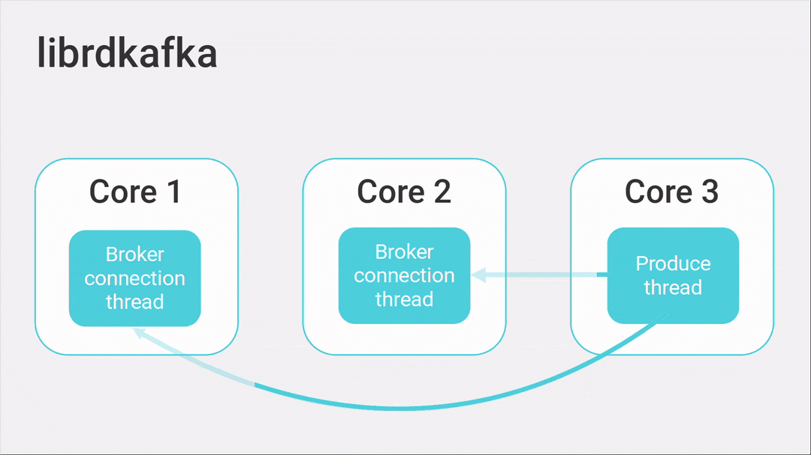

---
> **ARTS-week-48**
> 2022-11-27 09:08
---


###### ARTS-2019 左耳听风社群活动--每周完成一个 ARTS
- Algorithm： 每周至少做一个 leetcode 的算法题
- Review: 阅读并点评至少一篇英文技术文章
- Tip: 学习至少一个技术技巧
- Share: 分享一篇有观点和思考的技术文章

### 1.Algorithm:

- [808. 分汤  (^^+)](https://leetcode.cn/submissions/detail/383865195/)  
  + 思路:DFS
- [795. 区间子数组个数 (^^+)](https://leetcode.cn/submissions/detail/384458762/)  
  + 思路:模拟
- [809. 情感丰富的文字 (^^+)](https://leetcode.cn/submissions/detail/384896120/)  
  + 思路:模拟

### 2.Review:

- [ScyllaDB Student Projects, Part III: Kafka Client for Seastar and ScyllaDB](https://www.scylladb.com/2020/11/17/scylla-student-projects-part-iii-kafka-client-for-seastar-and-scylla/)

#### 点评：

Apache Kafka是一个著名的分布式消息队列，被数千家公司使用。开发人员喜欢它的可扩展性、性能、容错能力，以及围绕它构建的客户端、连接器和工具的整个生态系统。一个相关的用例是将数据从数据库摄取到 Kafka 集群，从那里可以很容易地被其他系统使用。

在这篇文章中，我将描述我们的Seastar和ScyllaDB的Kafka客户端的细节，这是我们作为最后一年的学生项目创建的，由ScyllaDB赞助。作为学生团队的一员，我将带踏上我们整个毕业年的旅程，并展示我们如何开发这个客户。最后，将看到我们如何使用它来编写 ScyllaDB 服务，以将变更数据捕获 （CDC） 事件流式传输到 Kafka。

- 简介

2019年，ScyllaDB赞助了华沙大学为计算机科学专业的学生组织的一个项目。在整个学年中，3个本科生团队与ScyllaDB工程师合作并向他们学习，为ScyllaDB及其底层Seastar引擎带来了新功能。2019年版选择的项目是：

  - 对 Seastar 和 ScyllaDB 的 Parquet 支持（参见第 I 部分）)
  - SeastarFS：Seastar的异步用户空间文件系统（见第二部分）)
  - Seastar和ScyllaDB的Kafka客户端（这篇文章）

这篇博文描述了 Kafka 客户端项目。负责该项目的学生是Wojciech Bączkowski，Piotr Grabowski（本文的作者），Michał Szostek和Piotr Wojtczak。我们的主管是Michał Możdżonek，M. Sc。该项目是参与该项目的学生的学士学位论文的基础。


项目时间表。在上面的动画中，可以看到我们项目的时间线。在这篇博文中，我们描述了开发过程的许多阶段，分享了我们如何规划我们的工作，并实现了许多很棒的功能。很快，将非常详细地了解此时间轴上（按时间顺序）呈现的所有主题。

- Apache Kafka：核心概念

Apache Kafka 是一个分布式消息队列。可以从 Kafka 发送和接收消息，这些消息由键和值组成。

  - 主题。为了组织 Kafka 集群中的消息，每条消息都绑定到一个特定的主题 - 一个不同且独立的消息队列。例如，可以有一个名为“通知”的主题，用于存储要发送给移动用户的推送通知，以及一个单独的“登录”主题，以保留有关登录到网站的用户的相关信息。

  - 代理和分区。由于 Kafka 是一个高度可扩展的系统，因此必须有一种方法将主题扩展到许多 Kafka 代理（节点）。这方面是通过分区实现的。单个 Kafka 主题由一个或多个分区组成，这些分区可以分布在多个代理中。根据所选的分区策略，消息将根据消息键拆分到不同的分区中，每个分区属于一个特定的代理。

  - 客户。Kafka 客户端有两种主要类型——生产者和消费者。生产者允许发送消息，而使用者则从 Kafka 集群接收消息。在我们的学生项目中，我们为ScyllaDB创建了一个生产者。

- 我们的目标和功能集

在我们学士学位毕业的开始，我们与ScyllaDB坐下来讨论该项目并概述共同目标。我们一起讨论了 Kafka 客户端的必要功能、项目的范围以及如何在 ScyllaDB 中使用它。我们确定的 Kafka 客户端的三个核心目标是：性能、正确性和对各种功能的支持。

  - 功能集。经过一学年的项目工作，我们成功地实现了Kafka制作器，提供：

    - 基于Seastar构建的面向特性的API
    - 高性能
    - 正确的错误处理和弹性
    - 重试，具有可配置的退避策略（默认抖动的指数退避）
    - 分区程序（多个开箱即用的实现）
    - 批处理
    - ACK（可配置的确认数，在发送消息后等待接收）
    - 与较旧的 Kafka 集群的兼容性（通过支持协议的许多版本）
    - 支持多代理集群

ScyllaDB 还建议编写一个利用我们的 Kafka 客户端的示例 ScyllaDB 功能。我们决定实现一个概念验证的 ScyllaDB 服务，该服务将变更数据捕获 （CDC） 日志复制到 Kafka 主题。

- 为什么选择Seastar？
已经有多个 Kafka 客户端可用，librdkafka 是最受欢迎的C++库。但是，使用现有库会导致与 Parquet 项目中类似的问题：延迟。

Seastar设计。ScyllaDB建立在Seastar之上，Seastar是一个异步高性能C++框架。Seastar 是按照无共享原则创建的，它有自己的非阻塞 I/O 原语、调度程序、优先级组和许多其他机制，专门用于确保低延迟和最优化的硬件利用率。

在 Seastar 世界中，发出阻塞系统调用（如）是一个不可原谅的错误，也是性能杀手。这也意味着许多依赖传统阻塞系统调用的库在基于 Seastar 的项目中使用时会产生这样的性能回归——librdkafka C++实现在这方面也不例外。因此，我们决定从头开始编写客户端，并使用 Seastar 中可用的网络功能。read()

替代客户。起初，我们还考虑修改一些现有的库以利用Seastar，但是，我们很快意识到这些库的设计与Seastar和ScyllaDB的理念不兼容。例如，librdkafka 在内部为 Kafka 集群中的每个代理创建一个线程。这可能会导致昂贵的跨核心数据传输（尤其是在具有多个 NUMA 节点的 CPU 上）。与ScyllaDB相比，这是一个明显的区别，ScyllaDB使用每个CPU内核一个线程，并使用自定义用户空间调度程序运行亚毫秒大小的小任务。



动画2：librdkafka和我们的客户之间的区别。
注意librdkafka如何进行昂贵的跨核数据传输。

此外，Seastar为我们提供了许多有用的功能，例如DPDK支持——在用户空间中运行的网络后端，允许更低的网络开销。通过将我们的API设计为基于期货，我们可以为库的用户提供一个直观的界面，其他ScyllaDB和Seastar开发人员立即熟悉。通过采用无共享原则（不在内核之间共享数据），无需使用锁或其他同步原语，这大大简化了开发过程。

- kafka协议

为了编写一个好的 Kafka 客户端，我们知道我们必须学习客户端应该如何工作的高级概念，以及其通信的较低级别的复杂性：协议。

Kafka 使用 TCP 二进制协议。它基于请求/响应范式（客户端发送请求，Kafka 代理响应一个响应）。

  - 消息类型。该协议定义了许多消息类型，例如代理支持的有关消息版本的信息（稍后会详细介绍）; 包含集群中代理、主题和分区的当前列表; 这允许向某个特定主题发送消息。

  - 版本控制。随着 Kafka 的积极开发，并且不断添加新特性，该协议必须提供一种扩展新功能的方法。此外，它必须以保持与旧客户端兼容性的方式完成。

该协议通过使用协议版本来处理这一挑战。每种消息类型都单独进行版本控制。客户端在与代理连接后发送请求。代理发回一个响应，其中包含有关每种消息类型受支持版本的信息。客户端现在可以使用有关版本的此信息，以客户端和代理都可以支持的版本发送请求。

让我们看一个具体的例子：消息定义了 9 个版本。当事务支持添加到 Kafka 时，需要将事务 ID 与请求一起传递。此附加字段已在此消息类型的版本 3 中添加。

- 处理错误

Kafka 的主要特性之一是它的容错性和弹性。在探索现有Kafka客户端的设计时，我们很快发现实现这一目标是Kafka经纪人和客户的责任。

  - 错误代码。在像Kafka这样可以在数百个节点上运行的分布式系统中，有很多故障场景必须正确处理。从客户端的角度来看，协议通过发送正确的错误代码来通知这些错误。

作为 Kafka 客户端开发人员，我们的工作是在收到错误代码时实现正确的行为。这些错误可以分为三个单独的组。

  - 不可恢复的错误。我们确定的第一组错误代码是不可恢复的错误：例如，在收到（身份验证错误）后，正确的行为是停止客户端并抛出异常，通知身份验证问题。

  - 可重试的错误。另一组错误是可重试的错误。此组中最常见的是 ，这可能发生在连接断开或超时的情况下。使用我们的指数退避策略，我们重试这些请求，因为这些网络问题可能是暂时的。

  - 元数据刷新。最后一组错误代码是需要元数据刷新的错误代码。客户端维护有关群集元数据的信息的本地副本 - 节点、主题及其分区的地址是什么。生成新消息时，Kafka 需要将其发送给分区的领导者。为了确定要将请求调度到的节点，我们使用此本地元数据。

但是，此元数据可能会过时，我们会将请求发送到不正确的节点。在这种情况下，我们将得到一个错误代码，并且我们的客户端认识到元数据需要通过将请求发送到 Kafka 集群来刷新。收到更新的元数据后，我们可以尝试再次发送消息。

- 批处理

批处理是一种简单的技术，可提高带宽并减少开销。通过在一个请求（一个批处理）中发送许多消息，我们不必多次发送有关消息的元数据，并且协议（Kafka 协议、TCP/IP）的开销相对于单个消息更小。Kafka 协议通过允许在单个 Produce 请求中发送多条消息来支持此功能。

  - 我们的实践。我们通过为等待发送的消息添加单独的队列来实现此功能。在某个时间点，此队列将被刷新，这会导致将 Produce 请求发送到 Kafka 集群。有几种方法可以控制消息刷新。首先，可以在生产者上手动调用该方法。控制此行为的另一种方法是设置该选项，该选项控制等待队列中消息的最大累积长度。最后，客户端自动定期刷新队列（由选项控制的时间段）。

- 优化


我们项目的最初目标之一是编写一个功能丰富、正确且高性能的客户端。通过确保我们从第一天起就考虑到性能设计我们的代码，利用作为 ScyllaDB 高性能基础的 Seastar 框架，我们相信我们走在正确的轨道上。

起初，我们的客户端比第一方Java Kafka客户端慢得多。为了修复解决方案的性能，我们执行了多个分析周期，每次都识别问题并修复它们。我们最初应用的一些修复是微不足道的，但为了压缩每一滴性能，我们后来专注于算法和低级改进。正如将在基准测试部分看到的那样，我们在优化工作中取得了巨大成功。

  - 分析器。为了进行分析，我们使用了perf工具和一个很棒的开源Flamegraph工具。在每个分析周期中，我们根据火焰图确定了最大的性能问题并修复了它。

  - 数据复制。在开发客户端时，我们尽量避免任何不必要的数据复制。但是，我们在这里和那里错过了一些景点。它们立即在火焰图上可见，并且修复它们被证明非常容易 - 有时就像将传递某些变量更改为通过常量引用而不是按值传递一样容易。在一种此类情况下，忘记使用引用会导致在发送的每条消息上复制群集元数据。这似乎不是一个大问题，但是当每秒发送数百万条消息时，这个单一问题是开销的重要组成部分。

  

  - 内存分配。另一个与内存相关的性能问题是内存分配。在序列化协议消息时，有一些临时缓冲区，其中一些缓冲区分配给发送的每条消息。通过将它们声明为（静态），我们节省了在基准测试过程中执行的数百万个分配。thread_local

  - 算法改进。一些修复需要从算法的角度看待问题。我们对每条消息执行的操作之一是查找元数据以确定要将 Produce 请求分派到的代理的地址。最初，此查找是线性完成的（在主题元数据中查找主题，然后在分区元数据中查找分区）。之后，我们添加了一个预处理步骤来对主题和分区进行排序，这使我们能够在查找函数中执行二叉搜索。我们的最终方法是使用unordered_map，这在我们的基准测试中被证明是最有效的。

  - 剖析器 – 小心！使用火焰图等分析工具时，需要了解其局限性。仅根据火焰图（因为它们显示 CPU 上的活动）对我们来说并不明显的一个问题是网络套接字配置。由于我们对消息进行手动批处理并等待批处理刷新，因此该过程中的每一毫秒都很重要。使用套接字上的选项（禁用 Nagle 算法）在我们的基准测试中产生了很大的影响，因为它减少了在套接字上发出写入和从 Kafka 集群接收响应之间的延迟。

  - 校验。我们发现的另一个问题是CRC32计算效率低下。此校验和是与消息一起发送的必需值。最初，为了让客户端运行，我们使用了 Boost 库实现，它使用应用于每个字节的查找表。由于此代码可能是内联的，因此它没有作为单独的函数显示在火焰图上，从而隐藏了它对性能的影响。我们切换到更高效的实现，它利用了 SSE4.2 指令。通过使用此指令，与 Boost 实现的逐字节查找相比，我们能够在 3 个周期（延迟，不包括内存访问）内处理 8 个字节。在 ScyllaDB 中，这种方法更加先进，因为它利用了能够在每个周期开始执行指令（吞吐量为 1）的优势。

- 基准

由于客户的性能是我们的首要任务之一，我们需要设计一个基准，将我们的解决方案与其他 Kafka 客户进行比较。在我们的优化过程中，拥有一个可靠的基准被证明是必不可少的。

在开发过程中，我们在本地计算机上测试了客户端。但是，当我们开始测量性能时，我们意识到我们必须在更强大的机器和多代理环境中运行它，以获得更真实的结果，更接近现实生活中的部署。

  - 基准环境。我们决定在 AWS 上运行基准测试。我们使用了在“集群”置放群组中配置的实例（以减少延迟）。这些实例具有 8 个逻辑处理器（至强级联湖，3.1GHz 持续提升）和 32GB RAM。我们为他们配备了 gp2 SSD，并在 1 个代理和 3 个代理 Kafka 集群配置中运行它们。具有经过测试的客户端的 Zookeeper 服务器和实例是在同一类型的不同节点上启动的。m5n.2xlarge

  - 基准客户。我们将客户端与两个领先的库进行了比较：由Apache Kafka项目维护的第一方Java客户端和librdkafka（一个流行的C++客户端）。

  - 测试方法。为了统一测试它们，我们实现了一个简单的基准测试例程。在给定的基准测试案例中，我们发送一定数量的特定大小的消息，并在批处理已满时手动刷新批处理并等待它完成处理。我们知道这种方法可能无法发挥某些客户的优势，但我们努力调整每个测试库的选项，以在每个库中实现最佳性能。

让我们来看看结果！

  - 1 节点集群，发送 8000 万条消息（每条 10 个字节），以 1，000 个为一组进行批处理
| Client | Time(s) | Messages per second | Throughput (MB/s) |
| ---------- | ------ | ------- | ------- |
|Our client | 53.40 s | 1,498,127 msg/s | 14.20 MB/s |
|Java | 70.83 s | 1,129,464 msg/s | 10.77 MB/s |
|librdkafka (C++) | 79.72 s | 1,003,512 msg/s | 9.57 MB/s |

  - 1 节点群集，发送 8000 万条消息（每 100 个字节），以 1，000 个为一组进行批处理
| Client | Time(s) | Messages per second | Throughput (MB/s) |
| ---------- | ------ | ------- | ------- |
|Our Client | 81.68 s | 979,431 msg/s | 93.40 MB/s |
|Java | 95.46 s | 838,047 msg/s | 79.92 MB/s |
|librdkafka (C++) | 92.84 s | 861,697 msg/s | 82.17 MB/s |

1 节点群集，发送 800 万条消息（每 1，000 个字节），按大小为 100 的组进行批处理
| Client | Time(s) | Messages per second | Throughput (MB/s) |
| ---------- | ------ | ------- | ------- |
|Our client | 38.51 s | 207,738 msg/s | 198.11 MB/s |
|Java | 43.52 s | 183,823 msg/s | 175.30 MB/s |
|librdkafka (C++) | 41.24 s | 193,986 msg/s | 184.99 MB/s |

1 节点群集，发送 8000 万条消息（每条消息 50 个字节），以大小为 10，000 的组进行批处理
| Client | Time(s) | Messages per second | Throughput (MB/s) |
| ---------- | ------ | ------- | ------- |
|Our client | 60.52 s | 1,321,877 msg/s | 63.03 MB/s |
|Java | 77.01 s | 1,038,826 msg/s | 49.53 MB/s |
|librdkafka (C++) | 61.07 s | 1,309,972 msg/s | 62.46 MB/s |

3 节点群集，发送 7800 万条消息（每条消息 10 个字节），按大小为 3，000 的组进行批处理
| Client | Time(s) | Messages per second | Throughput (MB/s) |
| ---------- | ------ | ------- | ------- |
|Our client | 38.96 s | 2,002,053 msg/s | 19.09 MB/s |
|Java | 57.68 s | 1,352,288 msg/s | 12.89 MB/s |
|librdkafka (C++) | 81.09 s | 961,894 msg/s | 9.17 MB/s |

3 节点群集，发送 1 亿条消息（每 100 个字节），以大小为 5，000 的组进行批处理
| Client | Time(s) | Messages per second | Throughput (MB/s) |
| ---------- | ------ | ------- | ------- |
|Our client | 69.59 s | 1,436,988 msg/s | 137.04 MB/s |
|Java | 90.49 s | 1,105,094 msg/s | 105.39 MB/s |
|librdkafka (C++) | 98.67 s | 1,013,479 msg/s | 96.65 MB/s |

3 节点群集，发送 1000 万条消息（每 1，000 个字节），以大小为 2，000 的组进行批处理
| Client | Time(s) | Messages per second | Throughput (MB/s) |
| ---------- | ------ | ------- | ------- |
|Our client | 29.43 s | 339,789 msg/s | 324.04 MB/s |
|Java | 30.86 s | 324,044 msg/s | 309.03 MB/s |
|librdkafka (C++) | 31.17 s | 320,821 msg/s | 305.95 MB/s |

  - 结果分析。从我们的基准测试中可以看出，在所有情况下，我们的客户端都比Java客户端和librdkafka都快。当向 3 节点集群发送 7800 万条 10 字节消息时，我们的客户打破了每秒 200 万条消息的障碍，明显快于竞争对手。在具有较大消息（1000 字节大）的测试中，我们能够在单个内核上获得 300+ MB/s 的吞吐量！

但是，查看原始数据，完全掌握它可能有点吓人。为了方便起见，让我们按某个方面对其进行分组并绘制组图。让我们首先按集群中的代理数量组织结果：

发送数百万条消息时，这个单一问题是开销的重要组成部分。

  

  图表 1：执行时间几何平均值（以秒为单位;越小越好），按集群配置分组的测试

在我们的测试中，librdkafka 在单代理场景中比 Java 客户端更快，而在三代理配置中则滞后。我们的解决方案在单代理和三代理配置中都比其他解决方案更快。

我们的基准测试测量了具有非常小消息和较大消息（10 字节、100 字节、1，000 字节）的工作负载。按此方面分组时，结果：

  

如所见，我们的客户速度更快，尤其是在发送小消息时。但是，当切换到更大的消息（100 B 或 1000 B）时，这种性能差异会迅速缩小。尽管在 1000 B 的情况下，这种差异要小得多，但我们仍然能够实现 6-8% 的加速。

- 示例用例：ScyllaDB CDC 复制服务

我们设计了 Kafka 客户端以与 ScyllaDB 很好地配合使用，所以我们的下一步很明显 - 实现使用我们客户端的新 ScyllaDB 功能。我们决定将我们的Kafka客户端与ScyllaDB的变更数据捕获（CDC）功能相结合。

  - 变更数据捕获 （CDC） 是一项功能，允许用户跟踪其 ScyllaDB 数据库中的数据变更。在表（基表）上启用 CDC 时，将创建新的 CDC 日志表。它允许查询对表所做的所有更改的历史记录，而不仅仅是存储在基表中的表的当前状态。可以在我们的“在 ScyllaDB 中使用变更数据捕获 （CDC）”博客文章中了解有关此功能的更多信息。

  - 新的 ScyllaDB 服务。为了展示如何将客户端与CDC功能一起使用，我们创建了一个新的ScyllaDB服务，该服务将数据更改流式传输到Apache Kafka。我们使用 CDC 日志表来查询表中发生的最新更改，由于 CDC 设计，可以有效地查询这些更改。稍后，该服务将这些更改序列化为 Apache Avro 格式，并使用我们的客户端将其发送到 Kafka。

  - 将CDC事件流式传输到Kafka为使用这些数据轻松构建更复杂的系统开辟了广泛的可能性。一种看似完美匹配的可能性是使用 ScyllaDB Sink Connector。它是一个 Kafka Connect 连接器，它将消息从 Kafka 主题复制到某个 ScyllaDB 表。它支持我们在服务中实现的 Avro 格式，这使我们能够维护正确的模式信息。

  - 新机遇。通过结合使用这些系统，我们有效地设置了异步 ScyllaDB 到 ScyllaDB 表复制。这显示了我们的服务和 Kafka（相对通用的）如何启用新的和有趣的方法来使用 ScyllaDB 集群中的数据。此外，它允许我们在复制完成后通过检查源和目标 ScyllaDB 集群上的表是否包含相同的数据来轻松测试我们的服务。

未来计划。尽管我们的ScyllaDB服务是作为概念验证创建的，但它显示出巨大的潜力。ScyllaDB现在正在努力将此功能作为Kafka连接器。敬请期待！

### 3.Tip:

#### how-to-get-file-creation-date-in-linux

1.通过命令获取
atime：上次打开或执行文件的时间
ctime：文件创建时间(更新索引节点信息的时间)。ctime 也会在文件被修改时更新
mtime：上次修改时间

```shell
root@sathishkumar# cat << _eof > test.txt 
> Hello
> This is my test file
> _eof
root@sathishkumar# cat test.txt 
Hello
This is my test file
root@sathishkumar# ls -i test.txt 
2097517 test.txt
root@sathishkumar# debugfs -R 'stat <2097517>' /dev/sda5

Inode: 2097517   Type: regular    Mode:  0664   Flags: 0x80000
Generation: 4245143992    Version: 0x00000000:00000001
User:  1000   Group:  1000   Size: 27
File ACL: 0    Directory ACL: 0
Links: 1   Blockcount: 8
Fragment:  Address: 0    Number: 0    Size: 0
 ctime: 0x50ea6d84:4826cc94 -- Mon Jan  7 12:09:00 2013
 atime: 0x50ea6d8e:75ed8a04 -- Mon Jan  7 12:09:10 2013
 mtime: 0x50ea6d84:4826cc94 -- Mon Jan  7 12:09:00 2013
 crtime: 0x5056d493:bbabf49c -- Mon Sep 17 13:13:15 2012
Size of extra inode fields: 28
EXTENTS:
(0):8421789
```

2.通过检查 sys/stat.h 或使用某种自动配置结构来确定系统在其统计结构中是否有st_birthtime。

```c
 struct stat { /* when _DARWIN_FEATURE_64_BIT_INODE is defined */
     dev_t           st_dev;           /* ID of device containing file */
     mode_t          st_mode;          /* Mode of file (see below) */
     nlink_t         st_nlink;         /* Number of hard links */
     ino_t           st_ino;           /* File serial number */
     uid_t           st_uid;           /* User ID of the file */
     gid_t           st_gid;           /* Group ID of the file */
     dev_t           st_rdev;          /* Device ID */
     struct timespec st_atimespec;     /* time of last access */
     struct timespec st_mtimespec;     /* time of last data modification */
     struct timespec st_ctimespec;     /* time of last status change */
     struct timespec st_birthtimespec; /* time of file creation(birth) */
     off_t           st_size;          /* file size, in bytes */
     blkcnt_t        st_blocks;        /* blocks allocated for file */
     blksize_t       st_blksize;       /* optimal blocksize for I/O */
     uint32_t        st_flags;         /* user defined flags for file */
     uint32_t        st_gen;           /* file generation number */
     int32_t         st_lspare;        /* RESERVED: DO NOT USE! */
     int64_t         st_qspare[2];     /* RESERVED: DO NOT USE! */
 };
```

一般需要通过通过 open（2） 或 fileno（tf） 来获取文件描述符。
一种无需打开文件即可检查其属性的方法。无论如何都需要打开文件并使用 stdio 函数，最简单的版本:

```c
#include <sys/types.h>
#include <sys/stat.h>
#include <stdio.h>

#ifdef HAVE_ST_BIRTHTIME
#define birthtime(x) x.st_birthtime
#else
#define birthtime(x) x.st_ctime
#endif

int main(int argc, char *argv[])
{
        struct stat st;
        size_t i;

        for( i=1; i<argc; i++ )
        {
                if( stat(argv[i], &st) != 0 )
                        perror(argv[i]);
                printf("%i\n", birthtime(st));
        }

        return 0;
}
```

3.在《Beginning Programming with C For Dummies》中探讨了这个结构。
最近，我编写了一个实用程序，用于比较目录中文件的年龄。为此，代码获取了与这些文件相关的结构的日期成员。最多有四个成员可用：

  - st_atime 返回上次访问文件的日期/时间，其中包括打开和读取文件但未更改文件的时间。
  - st_mtime 返回系统上次修改、更新或更改文件的日期/时间。
  - st_ctime 返回用户上次更改文件状态的日期/时间。
  - st_birthtime 返回创建文件的日期/时间。此字段可能并非在所有操作系统上都可用，也可能不是由所有 C 语言库实现的。

对于我的实用程序，我想检查成员。为了确保它有效，我检查了目录列表中报告的文件的日期，但也检查了其他三个结构成员。这是我写的一个测试程序：

```c
#include <stdio.h>
#include <sys/stat.h>
#include <time.h>

int main()
{
    struct stat filestat;

    stat("gettysburg.txt",&filestat);
    /* newline included in ctime() output */
    printf(" File access time %s",
            ctime(&filestat.st_atime)
          );
    printf(" File modify time %s",
            ctime(&filestat.st_mtime)
          );
    printf("File changed time %s",
            ctime(&filestat.st_ctime)
          );
    printf("  File birth time %s",
            ctime(&filestat.st_birthtime)
          );
    return(0);
}
```

### 4.Share:

- [rsync](https://rsync.samba.org/download/html)

- [scrcpy——Android开源投屏神器(使用教程)](https://zhuanlan.zhihu.com/p/467532050)

- [mermaid文档中文版-语法-时序图](https://hellowac.github.io/2021/12/21/mermaid%E6%96%87%E6%A1%A3%E4%B8%AD%E6%96%87%E7%89%88-%E8%AF%AD%E6%B3%95-%E6%97%B6%E5%BA%8F%E5%9B%BE.html)

- [ElasticSearch倒排索引、分词的详解和使用建议](https://codeantenna.com/a/KGi6uMheWC)

- [百亿级实时计算系统性能优化–—Elasticsearch篇](https://zhuanlan.zhihu.com/p/323932863)

- [腾讯万亿级 Elasticsearch 技术解密](https://zhuanlan.zhihu.com/p/99184436)

- [腾讯万亿级 Elasticsearch 内存效率提升技术解密](https://zhuanlan.zhihu.com/p/146083622)