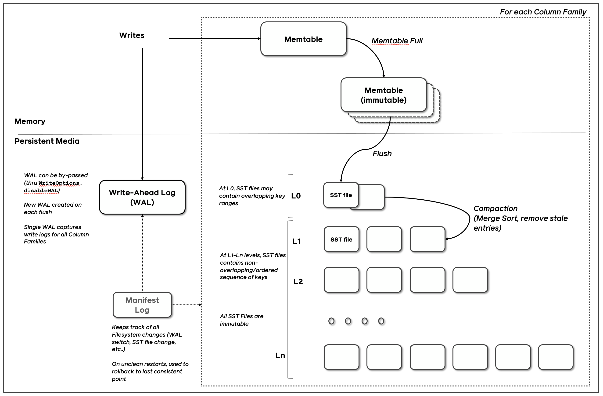

---
> **ARTS-week-49**
> 2022-12-04 10:04
---


###### ARTS-2019 左耳听风社群活动--每周完成一个 ARTS
- Algorithm： 每周至少做一个 leetcode 的算法题
- Review: 阅读并点评至少一篇英文技术文章
- Tip: 学习至少一个技术技巧
- Share: 分享一篇有观点和思考的技术文章

### 1.Algorithm:

- [1769. 移动所有球到每个盒子所需的最小操作数  (^^+)](https://leetcode.cn/submissions/detail/386400023/)  
  + 思路:缓存
- [791. 自定义字符串排序 (^^+)](https://leetcode.cn/submissions/detail/386704994/)  
  + 思路:缓存
- [1774. 最接近目标价格的甜点成本 (^^+)](https://leetcode.cn/submissions/detail/386814833/)  
  + 思路:DFS

### 2.Review:

- [RocksDB Overview](https://github.com/facebook/rocksdb/wiki/RocksDB-Overview)  

#### 点评：

- 简介

RocksDB最初在Facebook时是一个存储引擎，用于在各种存储媒体上处理服务器工作负载，最初专注于快速存储(尤其是Flash存储)。 它是一个c++标准库，用于存储键和值，它们是任意大小的字节流。 它支持点查找和范围扫描，并提供不同类型的ACID保证。

在可定制性和自适应性之间取得了平衡。 RocksDB具有高度灵活的配置设置，可以调优以运行在各种生产环境中，包括ssd、硬盘、ramfs或远程存储。 它支持各种压缩算法和用于生产支持和调试的好工具。 另一方面，还努力限制旋钮的数量，以提供足够好的开箱即用性能，并在适用的地方使用一些自适应算法。

RocksDB借鉴了开源leveldb项目的大量代码以及Apache HBase的想法。 最初的代码是从开源的leveldb 1.5派生出来的。 它也建立在Facebook在RocksDB之前开发的代码和想法之上。

- 愿景和目标

  - 性能。RocksDB的主要设计要点是，它应该为快速存储和服务器工作负载提供性能。它应该支持高效的点查找和范围扫描。它应该是可配置的，以支持高随机读工作负载、高更新工作负载或两者的组合。它的架构应该支持针对不同的工作负载和硬件进行轻松的权衡调整。

  - 产品支持。RocksDB的设计应该内置对工具和实用程序的支持，以帮助在生产环境中进行部署和调试。如果存储引擎还不能自动适应应用程序和硬件，我们将提供一些参数来允许用户调优性能。

  - 兼容性。该软件的新版本应该是向后兼容的，这样在升级到RocksDB的新版本时，现有的应用程序不需要更改。除非使用新提供的特性，否则现有的应用程序也应该能够恢复到最近的旧版本。参见RocksDB不同版本之间的兼容性。

- 高阶架构

RocksDB是一个键-值存储接口的存储引擎库，其中键和值是任意的字节流。RocksDB按照排序的顺序组织所有数据，常用的操作有Get(key)、NewIterator()、Put(key, val)、Delete(key)、SingleDelete(key)。

RocksDB的三个基本结构是memtable, sstfile和logfile。memtable是一个内存中的数据结构——新的写操作被插入到memtable中，并且可以选择写入日志文件。写日志(细胞膜))。日志文件是一个顺序写入存储的文件。当memtable被填满时，它被刷新到存储上的sstfile，相应的日志文件可以被安全地删除。sstfile中的数据进行了排序，以便于方便地查找键。

这里详细描述了sstfile的默认格式。



- 特性

  - Column Families
    - RocksDB支持将数据库实例划分为多个列族。所有数据库都使用名为“default”的列族创建，该列族用于未指定列族的操作。
    - RocksDB保证用户跨列族获得一致的视图，包括启用WAL或启用原子刷新时的崩溃恢复。它还通过WriteBatch API支持原子跨列族操作。
    
  - Updates
    - Put API向数据库插入一个键值。如果该键已经存在于数据库中，那么以前的值将被覆盖。Write API允许在数据库中原子地插入、更新或删除多个键值。数据库保证将单个Write调用中的所有键值插入到数据库中，或者不将任何键值插入到数据库中。如果这些键中的任何一个已经存在于数据库中，那么以前的值将被覆盖。DeleteRange API可用于删除一个范围内的所有键。

  - Gets, Iterators and Snapshots
    - 键和值被视为纯字节流。键或值的大小没有限制。Get API允许应用程序从数据库中获取单个键值。MultiGet API允许应用程序从数据库中检索一串键。通过MultiGet调用返回的所有键值都是一致的。
    - 数据库中的所有数据在逻辑上按顺序排列。应用程序可以指定一个键比较方法，该方法指定键的总顺序。Iterator API允许应用程序对数据库进行范围扫描。Iterator可以查找指定的键，然后应用程序可以从这个点开始一次扫描一个键。还可以使用Iterator API对数据库中的键进行反向迭代。在创建迭代器时，将创建数据库的一致时间点视图。因此，通过Iterator返回的所有键都来自数据库的一致视图。
    - Snapshot API允许应用程序创建一个数据库的时间点视图。Get和Iterator api可用于从指定的快照读取数据。从某种意义上说，Snapshot和Iterator都提供了数据库的时间点视图，但它们的实现是不同的。短期扫描/前台扫描最好通过迭代器完成，而长期扫描/后台扫描最好通过快照完成。迭代器会对与该数据库的时间点视图对应的所有底层文件保持引用计数——这些文件在迭代器释放之前不会被删除。另一方面，快照不阻止文件删除;相反，压缩过程理解快照的存在，并承诺永远不会删除任何现有快照中可见的键。
    - 快照在数据库重启时不会被持久化:重新加载RocksDB库(通过服务器重启)会释放所有现有的快照。

  - Transactions
    - RocksDB支持多操作事务。它支持乐观模式和悲观模式。看到交易。

  - Prefix Iterators
    - 大多数LSM-tree引擎不能支持有效的范围扫描API，因为它需要查看多个数据文件。但是，大多数应用程序不会对数据库中的键范围进行纯随机扫描;相反，应用程序通常在一个键-前缀内进行扫描。RocksDB利用了这一点。应用程序可以配置一个选项。Prefix_extractor来启用基于键-前缀的过滤。当选择。设置prefix_extractor后，还将该前缀的哈希值添加到Bloom中。指定键前缀的迭代器(在ReadOptions中)将使用Bloom Filter来避免查找不包含指定键前缀的键的数据文件。看到Prefix-Seek。

  - Persistence
    - RocksDB有一个预写日志(Write Ahead Log, WAL)。所有写操作(Put, Delete和Merge)都存储在内存缓冲区中，称为memtable，也可以插入到WAL中。在重新启动时，它会重新处理日志中记录的所有事务。
    - 可以将WAL配置为存储在与SST文件存储目录不同的目录中。对于希望将所有数据文件存储在非持久快速存储中的情况，这是必要的。同时，可以通过将所有事务日志放在较慢但持久的存储中来确保没有数据丢失。
    - 每个Put都有一个通过WriteOptions设置的标志，该标志指定是否应该将Put插入事务日志中。WriteOptions还可以指定在声明Put被提交之前是否向事务日志发出fsync调用。
    - 在内部，RocksDB使用批提交机制将事务批处理到日志中，这样它就可以使用一个fsync调用提交多个事务。

  - Data Checksuming
    - RocksDB使用校验和来检测存储中的损坏。这些校验和针对每个SST文件块(大小通常在4K到128K之间)。块一旦写入存储器，就永远不会被修改。RocksDB还维护一个完整文件校验和。
    - RocksDB动态检测并利用CPU校验和卸载支持。

  - Multi-Threaded Compactions
    - 在进行写操作的情况下，为了提高空间效率、读取(查询)效率和及时删除数据，需要进行压缩。压缩删除已删除或覆盖的键值绑定，并重新组织数据以提高查询效率。如果配置，压缩可能在多个线程中发生。
    - 整个数据库存储在一组sstfile中。当一个memtable被填满时，它的内容被写到LSM树的0级(L0)文件中。当将memtable刷新到L0中的一个文件时，RocksDB删除了memtable中重复和覆盖的键。在压缩过程中，定期读入一些文件并合并成更大的文件，通常进入下一个LSM级别(例如L1到Lmax)。
    - LSM数据库的整体写吞吐量直接取决于压缩发生的速度，特别是当数据存储在诸如SSD或RAM之类的快速存储中时。RocksDB可以配置为从多个线程发出并发压缩请求。可以观察到，与单线程紧凑相比，在数据库位于ssd上时，使用多线程紧凑可以增加10倍的持续写入速率。

  - Compaction Styles
    - Level Style Compaction和Universal Style Compaction都将数据存储在数据库中固定数量的逻辑级别中。最近的数据存储在Level-0 (L0)中，旧的数据存储在更高编号的级别中，一直到Lmax。L0中的文件可能有重叠的键，但其他级别的文件通常会在每个级别上单独有序运行。
    - 级别样式压缩(默认)通常通过最小化每个压缩步骤中涉及的文件来优化磁盘占用空间和逻辑数据库大小(空间放大):将Ln中的一个文件与Ln+1中的所有重叠文件合并，并用Ln+1中的新文件替换它们。
    - Universal Style Compaction通常通过一次合并多个文件和级别来优化写入磁盘的字节总数和逻辑数据库大小(写入放大)，这需要更多的临时空间。与级别样式压缩相比，通用压缩通常会导致更低的写放大，但更高的空间和读放大。
    - FIFO风格压缩在过时时会删除最旧的文件，并可用于缓存类数据。在FIFO压缩中，所有文件都处于0级。当数据的总大小超过配置的大小(CompactionOptionsFIFO::max_table_files_size)时，我们删除最老的表文件。
    - 我们还允许开发人员开发和试验自定义压缩策略。因此，RocksDB有适当的钩子来关闭内置的压缩算法，并有其他api允许应用程序操作自己的压缩算法。选项。如果设置了Disable_auto_compaction，则禁用本机压缩算法。GetLiveFilesMetaData API允许外部组件查看数据库中的每个数据文件，并决定合并和压缩哪些数据文件。调用CompactFiles来压缩想要的文件。DeleteFile API允许应用程序删除被认为过时的数据文件。

  - Metadata storage
    - 清单日志文件用于记录所有数据库状态的更改。压缩过程从数据库中添加新文件并删除现有文件，并且通过在MANIFEST中记录这些操作，使这些操作具有持久性。

  - Avoiding Stalls
    - 后台压缩线程也用于将memtable内容刷新到存储器上的一个文件中。如果所有的后台压缩线程都在忙着执行长时间运行的压缩，那么突发的写操作会很快地填满memtable，从而导致新的写入延迟。这种情况可以通过配置RocksDB来避免，它会为将memtable刷新到存储的唯一目的而显式地保留一小组线程。

  - Compaction Filter
    - 一些应用程序可能希望在压缩时处理键。例如，固有支持生存时间(TTL)的数据库可以删除过期的密钥。这可以通过应用程序定义的压缩过滤器来实现。如果应用程序希望不断删除比特定时间更早的数据，它可以使用压缩过滤器删除已经过期的记录。RocksDB Compaction Filter让应用程序可以修改一个键的值，或者作为压缩过程的一部分删除一个键。例如，应用程序可以在压缩过程中持续运行数据清理程序。

  - ReadOnly Mode
    - 数据库可以以ReadOnly模式打开，在这种模式下，数据库保证应用程序不会修改数据库中的任何内容。这将导致更高的读取性能，因为经常遍历的代码路径完全避免了锁。

  - Database Debug Logs
    - 默认情况下，RocksDB会将详细日志写到LOG\*文件中。它们主要用于调试和分析运行中的系统。用户可以选择不同的日志级别。可以将此LOG配置为按指定的周期滚动。日志接口是可插拔的。用户可以插入不同的日志记录器。看到日志记录器。

  - Data Compression
    - RocksDB 支持 lz4、zstd、snappy、zlib 和 lz4_hc 压缩，以及 Windows 下的 xpress。RocksDB 可以配置为支持最底层数据的不同压缩算法，其中 90% 的数据位于最底层。典型的安装可能会为最底层的级别配置 ZSTD（或 Zlib，如果不可用），为其他级别配置 LZ4（如果不可用，则配置 Snappy）。请参阅压缩。

  - Full Backups and Replication
    - RocksDB提供备份API BackupEngine。可以在这里阅读更多:如何备份RocksDB
    - RocksDB本身不是一个复制的，但它提供了一些帮助函数，使用户可以在RocksDB的基础上实现他们的复制系统，参见replication Helpers。

  - Support for Multiple Embedded Databases in the same process
    - RocksDB的一个常见用例是，应用程序固有地将其数据集划分为逻辑分区或分片。这种技术有利于应用程序负载平衡和快速从故障中恢复。这意味着一个服务器进程应该能够同时操作多个RocksDB数据库。这是通过一个名为Env的环境对象来完成的。其中，线程池与Env相关联。如果应用程序希望在多个数据库实例之间共享一个公共线程池(用于后台压缩)，那么它应该使用相同的Env对象来打开这些数据库。
    - 类似地，多个数据库实例可能共享相同的块缓存或速率限制器。

  - Block Cache -- Compressed and Uncompressed Data
    - RocksDB使用LRU缓存块来提供读操作。块缓存被划分为两个独立的缓存:第一个缓存未压缩的块，第二个缓存压缩的块。如果配置了压缩块缓存，用户可能希望启用直接I/O，以防止在操作系统页面缓存中重复缓存相同的数据。

  - Table Cache
    - Table Cache是一种用来缓存打开文件描述符的结构。这些文件描述符是用于sstfiles的。应用程序可以指定Table Cache的最大大小，或者配置RocksDB始终保持所有文件打开，以获得更好的性能。

  - I/O Control
    - RocksDB允许用户以不同的方式配置来自和到SST文件的I/O。用户可以启用直接I/O，这样RocksDB就可以完全控制I/O和缓存。另一种方法是利用一些选项允许用户提示应该如何执行I/O。他们可以建议RocksDB在文件中调用fadvise来读取，在被追加的文件中调用周期性范围同步，启用直接I/O等等……更多细节请参见IO。

  - Stackable DB
    - RocksDB有一个内置的包装器机制，可以在代码数据库内核之上添加一层功能。这个功能由StackableDB API封装。例如，time-to-live功能是由StackableDB实现的，而不是核心RocksDB API的一部分。这种方法使代码保持模块化和精简。

  - Memtables
    - Pluggable Memtables:RocksDB的memtable的默认实现是skiplist。skiplist是一个排序的集合，当工作负载与范围扫描交叉写入时，这是一个必要的构造。然而，有些应用程序并不交叉写入和扫描，有些应用程序根本不进行范围扫描。对于这些应用程序，排序集可能不能提供最佳性能。因此，RocksDB的memtable是可插拔的。还提供了一些替代实现。库中有三个memtable: skiplist memtable、vector memtable和prefix-hash memtable。vector memtable适用于将数据批量加载到数据库中。每次写操作都在vector的末尾插入一个新元素;当需要刷新memtable以存储vector中的元素时，将对其进行排序并写入L0中的文件。前缀-哈希memtable允许高效地处理key-prefix中的get、puts和scan。虽然memtable的可插拔性不是作为公共API提供的，但应用程序可以在私有分支中提供自己的memtable实现。
    - Memtable Pipelining:RocksDB支持为数据库配置任意数量的memtables。当一个memtable被填满时，它就变成一个不可变的memtable，一个后台线程开始将它的内容刷新到存储器中。同时，新写操作继续累积到一个新分配的memtable中。如果新分配的memtable被填满，它也会被转换为一个不可变的memtable，并被插入到刷新管道中。后台线程继续将管道中所有不可变的memtable刷新到存储中。这种流水线增加了RocksDB的写吞吐量，特别是当它在低速存储设备上运行时。
    - Garbage Collection during Memtable Flush:当一个memtable被刷新到存储器时，会执行一个内联压缩过程。垃圾清除的方法与压实的方法相同。从输出流中删除相同键的重复更新。类似地，如果前面的放置被后面的删除所隐藏，则该放置根本不会写入输出文件。对于某些工作负载，这个特性减少了存储上的数据大小并大大增加了写。

  - Merge Operator
  RocksDB本身支持三种类型的记录，Put记录、Delete记录和Merge记录。当压缩流程遇到Merge记录时，它会调用一个应用程序指定的方法，称为Merge Operator。Merge可以将多个Put和Merge记录合并为一个记录。这个强大的特性允许通常执行读-修改-写操作的应用程序完全避免读操作。它允许应用程序将操作意图记录为Merge record，而RocksDB压缩过程将该意图惰性地应用到原始值。该特性在合并操作符中有详细描述。

  - DB ID
  在创建数据库时创建的全局唯一ID，默认情况下存储在DB文件夹中的IDENTITY文件中。或者，它只能存储在MANIFEST文件中。建议存储在MANIFEST文件中。

- Tools
有许多有趣的工具用于在生产环境中支持数据库。sst_dump实用程序转储一个sst文件中的所有键值以及其他信息。ldb工具可以放置、获取、扫描数据库的内容。ldb还可以转储MANIFEST的内容，它还可以用来更改配置的数据库级别的数量。详情请参见管理和数据访问工具。

- Tests
有一堆测试数据库特定特性的单元测试。生成检查命令运行所有单元测试。单元测试触发了RocksDB的特定特性，并不是为了大规模测试数据正确性而设计的。db_stress测试用于大规模验证数据的正确性。看到压力测试。

- Performance
RocksDB的性能是通过一个名为db_bench的实用程序进行基准测试的。db_bench是RocksDB源代码的一部分。这里描述了使用Flash存储的几个典型工作负载的性能结果。还可以在这里找到针对内存工作负载的RocksDB性能结果。

### 3.Tip:

#### Java sort()数组排序（升序和降序）

```java
Arrays.sort(scores);
Arrays.sort(a, Collections.reverseOrder());
```

#### Java1.7 int 中加下划线

```java
float pi1 = 3_.1415F; // 无效的; 不能在小数点之前有下划线
float pi2 = 3._1415F; // 无效的; 不能在小数点之后有下划线
long socialSecurityNumber1 = 999_99_9999_L; //无效的，不能在L下标之前加下划线
int a1 = _52; // 这是一个下划线开头的标识符，不是个数字
int a2 = 5_2; // 有效
int a3 = 52_; // 无效的，不能以下划线结尾
int a4 = 5_______2; // 有效的
int a5 = 0_x52; // 无效，不能在0x之间有下划线
int a6 = 0x_52; // 无效的，不能在数字开头有下划线
int a7 = 0x5_2; // 有效的 (16进制数字)
int a8 = 0x52_; // 无效的，不能以下划线结尾
int a9 = 0_52; // 有效的（8进制数）
int a10 = 05_2; // 有效的（8进制数）
int a11 = 052_; // 无效的，不能以下划线结尾
```

#### MySQL创建用户与授权

```shell
# 1.创建用户
CREATE USER 'username'@'host' IDENTIFIED BY 'password';
# username：将创建的用户名
# host：指定该用户在哪个主机上可以登陆，如果是本地用户可用localhost，如果想让该用户可以从任意远程主机登陆，可以使用通配符%
# password：该用户的登陆密码，密码可以为空，如果为空则该用户可以不需要密码登陆服务器

# 例子
CREATE USER 'dog'@'localhost' IDENTIFIED BY '123456';
CREATE USER 'pig'@'192.168.1.101_' IDENDIFIED BY '123456';
CREATE USER 'pig'@'%' IDENTIFIED BY '123456';
CREATE USER 'pig'@'%' IDENTIFIED BY '';
CREATE USER 'pig'@'%';

# 2.授权
GRANT privileges ON databasename.tablename TO 'username'@'host'
# privileges：用户的操作权限，如SELECT，INSERT，UPDATE等，如果要授予所的权限则使用ALL
# databasename：数据库名
# tablename：表名，如果要授予该用户对所有数据库和表的相应操作权限则可用*表示，如*.*

# 例子
GRANT SELECT, INSERT ON test.user TO 'pig'@'%';
GRANT ALL ON *.* TO 'pig'@'%';

# 注意:用以上命令授权的用户不能给其它用户授权，如果想让该用户可以授权，用以下命令:
GRANT privileges ON databasename.tablename TO 'username'@'host' WITH GRANT OPTION;

# 3.设置与更改用户密码
SET PASSWORD FOR 'username'@'host' = PASSWORD('newpassword');
# 如果是当前登陆用户用:
SET PASSWORD = PASSWORD("newpassword");

# 例子
SET PASSWORD FOR 'pig'@'%' = PASSWORD("123456");

# 4.撤销用户权限
REVOKE privilege ON databasename.tablename FROM 'username'@'host';
# privilege, databasename, tablename：同授权部分

# 例子
REVOKE SELECT ON *.* FROM 'pig'@'%';

# 注意:假如在给用户'pig'@'%'授权的时候是这样的（或类似的）：GRANT SELECT ON test.user TO 'pig'@'%'，则在使用REVOKE SELECT ON *.* FROM 'pig'@'%';命令并不能撤销该用户对test数据库中user表的SELECT 操作。相反，如果授权使用的是GRANT SELECT ON *.* TO 'pig'@'%';则REVOKE SELECT ON test.user FROM 'pig'@'%';命令也不能撤销该用户对test数据库中user表的Select权限。具体信息可以用命令SHOW GRANTS FOR 'pig'@'%'; 查看。

# 5.删除用户
DROP USER 'username'@'host';
```

### 4.Share:

- [Lucene概览](https://zhuanlan.zhihu.com/p/45293591)

- [Lucene深入浅出](https://new.qq.com/rain/a/20210415A039RA00)

- [腾讯Elasticsearch海量规模背后的内核优化剖析](https://z.itpub.net/article/detail/3F51D223FAE926C3578F9702732A31D6)

- [StoneDB的编译安装 ](https://www.cnblogs.com/yangwilly/p/16596473.html)

- [Elasticsearch 7.3 的 offheap 原理](https://easyice.cn/archives/346)