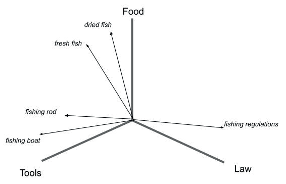

---
> **ARTS-week-50**
> 2022-12-10 16:31
---


###### ARTS-2019 左耳听风社群活动--每周完成一个 ARTS
- Algorithm: 每周至少做一个 leetcode 的算法题
- Review: 阅读并点评至少一篇英文技术文章
- Tip: 学习至少一个技术技巧
- Share: 分享一篇有观点和思考的技术文章

### 1.Algorithm:

- [1774. 最接近目标价格的甜点成本 (^^+)](https://leetcode.cn/submissions/detail/386814833/)  
  + 思路:递归
- [1775. 通过最少操作次数使数组的和相等 (^^+)](https://leetcode.cn/submissions/detail/387550413/)  
  + 思路:递归
- [1780. 判断一个数字是否可以表示成三的幂的和 (^^+)](https://leetcode.cn/submissions/detail/388120268/)  
  + 思路:迭代

### 2.Review:

- [什么是向量搜索？新前沿指南](https://opensourceconnections.com/blog/2022/10/26/what-is-vector-search-a-guide-to-the-new-frontier/)  

#### 点评：

- 什么是向量搜索？

首先，搜索上下文中的向量到底是什么？让我们从考虑传统搜索引擎的工作原理开始：本质上，它们构建的数据结构很像书后面的索引，除了它们收集和计算源材料中的每个单词。此索引使查找相关文档变得非常容易 - 如果用户键入查询，我们可以快速找出哪些文档最初包含该单词。为了根据相关性对文档进行排序，我们计算每个文档中出现的次数 - 实际上是整套文档，因此我们知道这个词的本地和整体稀有性。这些计算是自 1970 年代以来在大多数文本搜索引擎中使用的术语频率/倒排文档频率 （TF/IDF） 公式的基础，该公式在大多数情况下非常有效。

这种方法的问题在于，它从来没有抓住这个词的含义或上下文——或者实际上是短语、语法片段和有关文本之间的规范区别或联系。它也仅限于搜索文本，不能轻易用于其他类型的数据，如图像。幸运的是，文本分析的一些最新发展（如搜索领域的许多创新，这些创新是在大型互联网搜索公司创建的）使得捕获一段文本的含义变得更加容易。称为 Transformers 的机器学习算法，包括最初由谷歌开发的BERT及其变种，可以训练以识别上下文和含义。这种训练的结果是特定语言或内容领域的数学模型。为了使训练正常工作，它需要这种语言或上下文中的大量数据，并指示成功或失败。将源文档输入Transformer，输出是一个张量——文档中每个单词的多维向量表示，捕获模型如何预测其含义：注意类似概念的向量是如何接近在一起的（这个例子当然只有三个维度）：



其他机器学习算法可用于提取图像、声音或其他类型的内容的关键特征作为向量。由于这些算法通常基于神经网络，因此使用它们的应用程序通常被描述为神经搜索引擎。困难的部分是弄清楚如何处理这种庞大而复杂的数据结构，以及如何大规模地做到这一点——每个张量可以有数百个维度。

广泛使用的搜索引擎库，如Apache Lucene，直到最近才有办法将这种数据存储在他们的索引中，更不用说使用它来查找哪些文档与查询匹配的机制了。Max Irwin在2019年的博客中提供了一个很好的例子，说明如何完成这种匹配：

```
通常，方法是使用最近邻算法。这需要两个或多个向量，并以有效的方式计算它们之间的距离（或相似性）。举一个简单的例子，假设我们有两个人——爱丽丝站在离喷泉5米远的地方，鲍勃站在离喷泉7米远的地方。谁站在离喷泉最近的地方？当然是爱丽丝。现在嘉莉加入了这个团体，站在离喷泉8米的地方。那么嘉莉站在最接近谁身边呢？爱丽丝还是鲍勃？嗯，这很容易——是鲍勃。这与一个特征的向量相似。我们还可以有一个包含两个特征的向量，例如纬度和经度坐标，并用它来计算谁站在离喷泉最近的地方，谁站在彼此靠近的群体中。
```

现在出现在搜索引擎软件中的实际算法和方法包括K-最近邻（KNN），近似最近邻（ANN）和分层导航小世界（HNSW）图（ANN的一种形式）。有大量软件提供矢量搜索功能，现在许多公司将其作为免费提供的开源或商业软件提供 - 这是一些当前竞争者的比较。最近发布的Elasticsearch，OpenSearch和Apache Solr搜索服务器（均基于开源ApacheLucene）包括矢量搜索功能，而开源Vespa引擎则大规模地结合了文本和矢量搜索。

- 解决老问题的新方法

让我们首先考虑为什么这种基于矢量的新方法可能有助于解决搜索中的一些常见问题。

  - 相似性搜索。一个常见的用例是查找以某种方式彼此相似的项目。给定源文档，传统的文本搜索引擎可以轻松找到包含一些相同单词或短语的其他文档，但这种方法可能缺乏准确性。矢量搜索可以根据含义进行更准确的相似性搜索。当查询的意图不明确时，相似性搜索也很有用。

  - 问答。如果有人向专家系统提出问题，但未使用与系统包含的术语相同的术语，则提供有用的答案可能很困难。让我们考虑一下医疗保健：如果我不是医生，我可能不知道“心肌梗塞”是“心脏病发作”的常见原因 - 但这两个短语的自动提取含义可能会创建彼此接近的载体。然后，我的系统可以用非医疗专业人员的通俗语言回答诸如“什么是心肌梗塞？”之类的问题。像ColBERT这样的模型实际上是在成对的问题和文本段落上进行训练的，因此它们的工作水平比处理整个文档的关键字搜索系统要精细得多。

  - 多语言搜索。构建语言模型可以在一种语言的查询和另一种语言的文档之间进行基于矢量的匹配。从历史上看，为每种新语言构建文本分析系统几乎重复了第一种语言的努力，导致规模经济很少。迁移到新语言也可能很困难，因为可能缺乏这种语言的行为数据。还可以构建一个共享的多语言模型，以避免任何直接翻译的需要，允许一种语言的查询来搜索另一种语言的内容（这是一个很棒的演示）。

  - 综合。多模式搜索同时包括不同类型的内容，例如文本和图像。如上所述，矢量可用于捕获文本和非文本数据的特征，然后同时用于通过文本查询直接搜索图像 - 这在以前是不可能的。

- 突破搜索调整的极限

调整现有搜索引擎已经是一个持续而复杂的过程——源数据的复杂性、大小和丰富性一直在增长，可以调整的“旋钮和拨盘”的数量也在增加。基于矢量的方法允许捕获这种丰富性，并帮助以更具表现力的方式在集合中的文档之间以及文档和查询之间建立连接。同样值得注意的是，机器学习方法，如学习排名（一种自动“学习”最初由传统文本搜索引擎提供的重新排名搜索结果的最佳方式的方法）现在通常用于搜索应用程序- 因此ML并不是搜索工程师的全新工具。

传统的文本搜索通常被用作搜索引擎的基础，但可以通过这种基于矢量的方法在两步过程中得到增强 - 文本搜索易于理解，可扩展且快速，而矢量搜索可能很难且难以扩展。根据最近的一篇论文，doc2query等方法甚至可以在单个阶段使用，并在某些情况下击败传统方法。

- 选择矢量搜索引擎

选择哪条路线将取决于几个因素，包括：

  - 目前正在使用哪个搜索平台 - 它是否具有矢量搜索功能或可以添加它们？
  - 矢量搜索在多大程度上可以作为现有搜索的单独附加组件，或者是否需要一种全新的方法？
  - 是否能够在内部安装和运行这些复杂的技术，或者更喜欢外部托管的解决方案？
  - 是否拥有（或者可以通过招聘或培训获得）所需的机器学习和数据科学新技能？
  - 是否准备投资相对较新的尖端技术，也许来自初创公司，或者更喜欢更成熟的参与者？

关于可用选项的信息越来越多，包括由 Dmitry Kan 主持的矢量播客和 OSC 的Haystack会议系列的演讲。与以往一样，请记住，供应商的营销可能偏向他们的解决方案或方法，使用的数据和用例的概念证明 （POC） 是一个至关重要的工具。传统的文本搜索是众所周知和理解的，并且在正确应用时非常强大，并且矢量搜索方法的好处可能有限。

- 建模的成本
我们在上面忽略的一件事是在特定内容集上训练机器学习 （ML） 模型的成本。尽管公开可用的预训练模型是一个起点（例如，可能会找到一个针对英语新闻内容进行训练的模型），但始终需要针对的用例对这些模型进行微调，以达到可接受的质量水平。如何有效地完成此操作将取决于拥有的数据，并且需要大量训练数据才能成功。找到的模型可能不容易转移到的上下文中。

如果以前没有，现在将不得不考虑在组织中运行机器学习模型的成本，包括创建和调试模型的时间、运行计算成本高昂的训练周期的成本，以及如何快速有效地大规模部署新模型（通常称为“MLOps ”的操作过程）。').应该定期持续不断地训练所有模型，并且应该将ML视为一个持续运行的制造过程，而不是像通常基于项目的软件工程那样。

Dmitry Kan对如何衡量这项投资的结果有一些想法：
  - 应评估每个模型的影响对业务 KPI 的影响，例如每个用户的事务、电子商务的商品总价值，以及基于在公司中运行 ML 的成本
  - 模型级别指标应汇总到系统KPI。示例指标包括准确性、精度、召回率、F1 或更具体的指标，如单词错误率 （WER）
  - 由于 MLOps 是一个组织问题，因此衡量每个 ML 研究人员在基础结构调试上花费的时间百分比、从训练到生产部署的平均时间、模型查询监视以及知道要监视的内容是成功的关键——例如由任何原因的数据更改引起的漂移，包括数据中的错误

请注意，一些技术提供商承诺为处理其中的大部分问题 - 当然，仍然需要为他们提供内容和数据，并且需要对他们的交付能力，他们的整体机器学习方法以及他们的模型充满信心。


- 关于向量搜索的离别感想
神经和向量搜索有望在搜索质量方面实现巨大飞跃，并可以实现传统上难以通过传统基于文本的方法交付的用例。但是，方法，技术和公司太多，很难在它们之间进行选择。有效的向量搜索在很大程度上依赖于高质量的训练数据，并且可能还需要在机器学习和操作方面进行大量投资，除非能够信任第三方提供商为完成繁重的工作。搜索的未来无疑包含向量和神经算法，但一如既往地记住，所有闪闪发光的都不是金子！

### 3.Tip:

#### Android "Only the original thread that created a view hierarchy can touch its views."

```java
runOnUiThread(() -> doStuff(Object, myValue));
```

#### springboot+cache+redis 缓存使用

一.配置

1.maven 依赖
```xml
<!-- Cache 缓存依赖-->
<dependency>
    <groupId>org.springframework.boot</groupId>
    <artifactId>spring-boot-starter-cache</artifactId>
</dependency>

<!-- Redis 数据源依赖 -->
<dependency>
    <groupId>org.springframework.boot</groupId>
    <artifactId>spring-boot-starter-data-redis</artifactId>
</dependency>
```

2.application.properties 配置文件
```properties
spring.redis.host=localhost
spring.redis.port=6379
spring.redis.jedis.pool.max-idle=8
spring.redis.jedis.pool.min-idle=0
spring.redis.jedis.pool.max-active=8
spring.redis.jedis.pool.max-wait=-1
```

3.CacheManager 初始化配置

3.1简单配置

```java
import java.time.Duration;
import java.util.HashMap;
import java.util.Map;
import org.springframework.cache.CacheManager;
import org.springframework.context.annotation.Bean;
import org.springframework.context.annotation.Configuration;
import org.springframework.data.redis.cache.RedisCacheConfiguration;
import org.springframework.data.redis.cache.RedisCacheManager;
import org.springframework.data.redis.cache.RedisCacheWriter;
import org.springframework.data.redis.connection.RedisConnectionFactory;

@Configuration
public class RedisCacheConfig {

    @Bean
    public CacheManager cacheManager(RedisConnectionFactory redisConnectionFactory) {
        return new RedisCacheManager(
                RedisCacheWriter.nonLockingRedisCacheWriter(redisConnectionFactory),
                this.getRedisCacheConfigurationWithTtl(600), // 默认缓存过期时间单位秒(10分钟)
                this.getRedisCacheConfigurationMap() // 指定 key 策略
        );
    }

    //设置特定key过期时间
    private Map<String, RedisCacheConfiguration> getRedisCacheConfigurationMap() {
        Map<String, RedisCacheConfiguration> redisCacheConfigurationMap = new HashMap<>();
        redisCacheConfigurationMap.put("DEMO_BOOK", this.getRedisCacheConfigurationWithTtl(60));//60秒
        redisCacheConfigurationMap.put("DEMO_BOOK_OTHER", this.getRedisCacheConfigurationWithTtl(10));//10秒
        return redisCacheConfigurationMap;
    }

    //过期时间
    private RedisCacheConfiguration getRedisCacheConfigurationWithTtl(Integer seconds) {
        RedisCacheConfiguration redisCacheConfiguration = RedisCacheConfiguration.defaultCacheConfig();
        redisCacheConfiguration = redisCacheConfiguration.entryTtl(Duration.ofSeconds(seconds));
        return redisCacheConfiguration;

    }
}
```

3.2设置缓存key

```java

import java.time.Duration;
import java.util.HashMap;
import java.util.Map;

import org.springframework.cache.CacheManager;
import org.springframework.cache.interceptor.KeyGenerator;
import org.springframework.context.annotation.Bean;
import org.springframework.context.annotation.Configuration;
import org.springframework.data.redis.cache.RedisCacheConfiguration;
import org.springframework.data.redis.cache.RedisCacheManager;
import org.springframework.data.redis.cache.RedisCacheWriter;
import org.springframework.data.redis.connection.RedisConnectionFactory;
import org.springframework.data.redis.serializer.Jackson2JsonRedisSerializer;
import org.springframework.data.redis.serializer.RedisSerializationContext;

import com.fasterxml.jackson.annotation.JsonAutoDetect.Visibility;
import com.fasterxml.jackson.annotation.PropertyAccessor;
import com.fasterxml.jackson.databind.ObjectMapper;

@Configuration
public class RedisCacheConfig {
    
    //缓存key生成方式
    @Bean
    public KeyGenerator simpleKeyGenerator() {
        return (o, method, objects) -> {
            StringBuilder stringBuilder = new StringBuilder();
            stringBuilder.append(o.getClass().getSimpleName());
            stringBuilder.append(".");
            stringBuilder.append(method.getName());
            stringBuilder.append("[");
            for (Object obj : objects) {
                stringBuilder.append(obj.toString());
            }
            stringBuilder.append("]");
            return stringBuilder.toString();
        };
    }
    
    @Bean
    public CacheManager cacheManager(RedisConnectionFactory redisConnectionFactory) {
        return new RedisCacheManager(
                RedisCacheWriter.nonLockingRedisCacheWriter(redisConnectionFactory),
                this.getRedisCacheConfigurationWithTtl(600), // 默认缓存过期时间单位秒(10分钟)
                this.getRedisCacheConfigurationMap() // 指定key
        );
    }
    
    //设置特定key过期时间
    private Map<String, RedisCacheConfiguration> getRedisCacheConfigurationMap() {
        Map<String, RedisCacheConfiguration> redisCacheConfigurationMap = new HashMap<>();
        redisCacheConfigurationMap.put("DEMO_BOOK", this.getRedisCacheConfigurationWithTtl(60));//60秒
        redisCacheConfigurationMap.put("DEMO_BOOK_OTHER", this.getRedisCacheConfigurationWithTtl(10));//10秒
        return redisCacheConfigurationMap;

    }

    //过期时间
    private RedisCacheConfiguration getRedisCacheConfigurationWithTtl(Integer seconds) {
        Jackson2JsonRedisSerializer<Object> jackson2JsonRedisSerializer = new Jackson2JsonRedisSerializer<>(Object.class);
        ObjectMapper om = new ObjectMapper();
        om.setVisibility(PropertyAccessor.ALL, Visibility.ANY);
        om.enableDefaultTyping(ObjectMapper.DefaultTyping.NON_FINAL);
        jackson2JsonRedisSerializer.setObjectMapper(om);
        RedisCacheConfiguration redisCacheConfiguration = RedisCacheConfiguration.defaultCacheConfig();
        redisCacheConfiguration = redisCacheConfiguration.serializeValuesWith(
                RedisSerializationContext
                        .SerializationPair
                        .fromSerializer(jackson2JsonRedisSerializer)
        ).entryTtl(Duration.ofSeconds(seconds));
        return redisCacheConfiguration;
    }
}
    
```

4.启用缓存
```java

/**
 * Spring Boot 应用启动类
 */
@SpringBootApplication
@EnableCaching//开启缓存
public class WebApplication {
    public static void main(String[] args) {
        SpringApplication.run(WebApplication.class, args);
    }
}
```

二.测试用例

2.1 类 CacheConfig 使用
过期时间默认 10 分钟，Cacheable 缓存，CachePut 更新，CacheEvict 删除
生成 key 方式：cacheNames::id 
示例：books::1 表示 book 主键为 1 的 key

```java
import lombok.extern.slf4j.Slf4j;
import org.springframework.beans.factory.annotation.Autowired;
import org.springframework.cache.annotation.CacheConfig;
import org.springframework.cache.annotation.CacheEvict;
import org.springframework.cache.annotation.CachePut;
import org.springframework.cache.annotation.Cacheable;
import org.springframework.stereotype.Service;
import java.util.List;

@Slf4j
@Service
@CacheConfig(cacheNames = "books")
public class BookService {
    @Autowired
    BookRepository bookRepository;

    //key->books::id 更新
    @CachePut(key = "#p0.id")
    public Book update(Book book) {
        log.info("update");
        return bookRepository.save(book);
    }
    
    //key->books::id  删除
    @CacheEvict(key = "#p0")
    public Book delete(Long id) {
        log.info("delete id:{}", id);
        Book book = bookRepository.findById(id).get();
        bookRepository.delete(book);
        return book;
    }

    //key->books::id  缓存
    @Cacheable(key = "#p0")
    public Book findById(Long id) {
        log.info("findBy id:{} ", id);
        return bookRepository.findById(id).orElse(null);
    }
}
```

2.2 设置不同 key 过期时间

```java
import lombok.extern.slf4j.Slf4j;
import org.springframework.beans.factory.annotation.Autowired;
import org.springframework.cache.annotation.CacheEvict;
import org.springframework.cache.annotation.CachePut;
import org.springframework.cache.annotation.Cacheable;
import org.springframework.stereotype.Service;

@Slf4j
@Service
public class BookExpireService {
    
    @Autowired
    BookRepository bookRepository;

    //更新
    @CachePut(value = "DEMO_BOOK", key = "#p0.id")
    public Book update(Book book) {
        log.info("update");
        return bookRepository.save(book);

    }

    //删除
    @CacheEvict(value = "DEMO_BOOK", key = "#p0")
    public Book delete(Long id) {
        log.info("delete id:", id);
        Book book = bookRepository.findById(id).get();
        bookRepository.delete(book);
        return book;
    }

    //使用默认生成key
    //key->DEMO_BOOK_OTHER::BookExpireService.findById[1]
    @Cacheable(value = "DEMO_BOOK_OTHER", keyGenerator = "simpleKeyGenerator") // 10秒过期
    public Book findById(Long id) {
        log.info("findById id:{}", id);
        return bookRepository.findById(id).orElse(null);
    }

    //example2::1
    @Cacheable(value = "example2", key = "")
    public Book findByIdSpEL(Long id) {
        log.info("findByIdSpEL id:{}", id);
        return bookRepository.findById(id).orElse(null);
    }

    //example2::1
    @Cacheable(value = "example2", key = "#p0")
    public Book findByIdSpELP(Long id) {
        log.info("findByIdSpELP id:{}", id);
        return bookRepository.findById(id).orElse(null);
    }

}
```

三. redis 查询 key

```java
    @Autowired
    private StringRedisTemplate stringRedisTemplate;
    
    //"books::1"、"books*"、"*"
    public Set<String> getAllKey(String key) {
        return stringRedisTemplate.keys(key);
    }
```

#### redis 查询key数量

```shell
# 方法1、dbsize
# dbsize 显示当前库key的数量
192.168.0.1:6379> dbsize
(integer) 69421

# 方法2 、info keyspace
# info keyspace 可以看到所有库key的数量
192.168.0.1> info keyspace
# Keyspace
db0:keys=13,expires=1,avg_ttl=172490826

# 方法3、keys pattern
keys *      # 查询所有key （最好别使用，太影响性能了）
keys zhao*  # 查询以 zhao 开头的key 
keys *zhao  # 查询以 zhao 结尾的key
```

#### 查看jks证书文件内容

```shell
keytool -v -list -keystore  https_keystore.jks

密钥库类型: jks
密钥库提供方: SUN

的密钥库包含 1 个条目

别名: server
创建日期: 2019-6-22
条目类型: PrivateKeyEntry
证书链长度: 1
证书[1]:
所有者: CN=192.168.11.35, OU=internet, O=cxyzy, C=CN
发布者: CN=192.168.11.35, OU=internet, O=cxyzy, C=CN
序列号: f9cd354a8be03bc1
有效期为 Sat Jun 22 14:47:38 CST 2019 至 Sun Jun 21 14:47:38 CST 2020
证书指纹:
         MD5:  86:CC:09:8C:43:51:F4:17:DA:68:75:15:46:DC:8D:FC
         SHA1: A6:FD:7C:22:ED:DB:47:B8:C2:F1:B3:FF:72:A6:ED:FF:34:AC:6D:D6
         SHA256: BF:07:F3:3A:FF:77:EE:D5:F4:DB:B2:64:42:18:A4:5F:56:AD:58:A7:7E:98:B4:11:E5:BF:77:0E:33:3C:CE:98
签名算法名称: SHA1withRSA
主体公共密钥算法: 1024 位 RSA 密钥
版本: 3

扩展: 

#1: ObjectId: 2.5.29.17 Criticality=false
SubjectAlternativeName [
  DNSName: 127.0.0.1
  DNSName: localhost
  IPAddress: 192.168.11.35
]
```

### 4.Share:

- [spring关于缓存的注解使用@CacheConfig，@Cacheable，@CachePut，@CacheEvict，@Caching](https://blog.csdn.net/weixin_46223196/article/details/120968911)

- [OkHttp系列十三、OKHttp的Response对象只能使用一次分析](https://blog.csdn.net/haoyuegongzi/article/details/102527697)

- [Android:8.0中未知来源安装权限变更](https://www.jianshu.com/p/0462a57134ed)

- [Android应用内升级App/Apk升级（下载Apk并且安装）](https://juejin.cn/post/6882191830700523527)

- [Elasticsearch 7.3 的 offheap 原理](https://easyice.cn/archives/346)