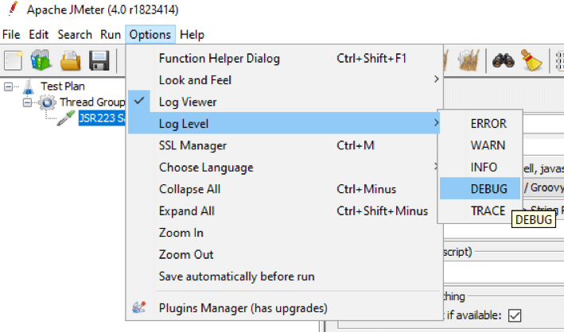

---
> **ARTS-week-02**
> 2023-01-08 09:43
---


## ARTS-2019 左耳听风社群活动--每周完成一个 ARTS
1.Algorithm: 每周至少做一个 leetcode 的算法题
2.Review: 阅读并点评至少一篇英文技术文章
3.Tip: 学习至少一个技术技巧
4.Share: 分享一篇有观点和思考的技术文章

### 1.Algorithm:

- [1658. 将 x 减到 0 的最小操作数](https://leetcode.cn/submissions/detail/393514512/)  
    + 思路：双指针
- [1802. 有界数组中指定下标处的最大值](https://leetcode.cn/submissions/detail/392784064/)  
    + 思路：二分搜索

### 2.Review:

[与 Groovy 一起使用的前 8 个 JMeter Java 类](https://www.blazemeter.com/blog/jmeter-java-classes)  

#### 点评：

JSR223（Java Specification Request 223）是一个将脚本嵌入到 Apache JMeter™ 的 Java 源代码中的框架。由于 JSR223 组件可用于增强对测试计划的控制，因此它们是使用 JMeter 进行负载测试的最有用的工具之一。

虽然可以在 JSR223 组件中使用多种语言，但用 Groovy 语言编写的脚本可能比 BeanShell 组件或其他语言高效得多。在这篇文章中，将介绍前 8 个 JMeter Java 类，它们可以与 JSR223 组件中的 Groovy 一起使用，用于自定义脚本以适应任何任务。

#### 什么是 Java 类？
```
类是通过描述相应对象的字段和方法来创建对象的模板。JMeter 是用 Java 编写的，因此所有 JMeter 实体（如采样器、缓存、侦听器、结果）都在关联的 Java 类中描述。
```
因此，可以在 JSR223 组件中使用这些类来根据需要修改实体的行为。

若要调用类方法，需要类对象。幸运的是，大多数有用的对象，如当前采样器或当前结果，已经在 JSR223 组件中为它们定义了一个变量。例如，要访问 Logger 类对象，只需编写 “log”，然后调用类方法。“sampler” 变量也是如此，它指向 HTTPSamplerProxy 类的当前采样器对象。

可以在 “如何在 JMeter 中使用 BeanShell” 和 “BeanShell for Beginners” 等文章中找到一些有用类的描述和示例。在这里将尝试更深入地研究上面文章中提到的一些类，以及其他一些类。之所以选择这些类，是因为它们轻松地为高度复杂的任务编写性能脚本，从而调用 JMeter 的全部自定义潜力。


#### 记录器类
Logger 实际上不是 JMeter 类，而是来自第三方库的 Java 类。可以使用日志变量访问组件的记录器对象。Logger 类对于脚本编写非常重要，因为它可以更轻松地调试脚本。通过允许将任何信息输出到 JMeter 日志，可以精确地检查脚本是否存在任何问题以及它们发生的位置。

日志有五个级别，分别将自定义消息输出到 JMeter 打印的 JMeter 日志中。它们是：
  - WARN 错误
  - WARN 警告
  - INFO 信息
  - DEBUG 调试
  - TRACE 跟踪
可以在“选项”->“日志级别”中将所需级别设置为“调试”。



设置日志级别后，将显示该级别和上层的所有消息。例如，如果将日志级别设置为 DEBUG，则级别 DEBUG、INFO、WARN 和 ERROR 的所有消息都将显示在 JMeter 日志中。默认情况下，日志级别设置为 INFO。

下面是如何使用 Logger 类的不同方法在不同日志级别输出自定义消息的一些示例。
```java
// 调试方法
// 使用 debug（字符串消息）方法将调试消息写入 JMeter 的日志。

log.debug('Current thread number:'+ String.valueOf(ctx.getThreadNum()));
// 上面的代码将在 JMeter 日志中输出当前线程编号。

// 信息方法
// 使用 info 方法输出在基本级别突出显示应用程序进度的消息。例如，要在 JMeter 日志中输出刚刚启动的采样器的名称：

log.info('Sampler '+ sampler.getName()+' started');

// 警告方法
// 使用warn方法输出有关潜在有害情况的自定义警告。自定义警告示例：

log.warn('Could not convert string, using default encoding');

// 错误方法
// Logger 类支持堆栈跟踪输出 - 有关错误的详细信息。例如，当捕获错误时，可以将错误写入 JMeter 日志中：

log.error("Malformed URL detected:", e);

// 跟踪方法
// 当需要输出有关脚本的非常详细的信息时，trace 方法用于精细调试：

log.error("Response data:"+ prev.getResponseDataAsString());
```

- JMeter上下文类（JMeterContext Class）

JMeterContext 类保存一个描述线程上下文的对象。线程的上下文包含有关线程的基本信息，如线程编号、JMeter 变量和 JMeter 属性。可以通过 ctx 变量访问此对象。 JMeterContext 类有很多有用的方法。一些例子：
```java
// 获取线程数方法
if(ctx.getThreadNum()==5 && prev.isSuccessful()==true){
    prev.setStopTest(true);
}

// 启动下一个线程循环方法
// ctx.setStartNextThreadLoop（布尔值 restartNextLoop）中断当前线程，并在将 “true” 值作为参数传递时启动新的 JMeter 测试线程。此方法可用于处理脚本中的错误结果。例如，当前线程遇到对关键请求的错误响应时，可以继续处理新线程：

if(prev.getResponseCode()!="200"){
    ctx.setStartNextThreadLoop(true);
}
```

#### SamplerResult 采样器结果类

类表示传递给侦听器的采样器执行结果。此结果包含来自采样器执行的数据，例如响应时间和响应数据。在 JSR223 脚本中，可以通过指针 prev 访问当前采样器的 SamplerResult 对象。

#### HTTPSamplerProxy Http代理类

HTTPSamplerProxy 类是用于控制 HTTP 采样器的代理类。这是一个非常有用的 Java 类，用于访问和设置 HTTP 采样器的数据。指向当前采样器的指针已经在 JSR223 组件中设置了 - 它的采样器。使用此指针，可以通过脚本建立对当前采样器的完全控制。

可以通过调用 HTTPSamplerProxy 对象的方法来更改 HTTP 方法、参数、标头、cookie 等等。所有可用的方法都列在 JMeter API 文档站点的 HTTPSamplerBase 类文档下。HTTPSamplerProxy 类提供了对 JMeter 脚本的大量控制。

当然，可以使用 JSR223 脚本设置 JMeter 变量，然后将它们传递给采样器的字段，例如主机、路径，甚至是 JMeter GUI 中标头管理器的标头。但是某些参数，如：“关注重定向”、“使用 KeepAlive”或“检索所有嵌入资源”无法通过变量控制。不能设置要传递的可变数量的参数。这些需要直接在 JSR223 脚本中使用 HTTPSamplerProxy 进行设置。

例如，向采样器添加新参数可能如下所示：
```java
sampler.addArgument("name","data");
```

可以手动在请求的名称和数据值之间设置分隔符：
```java
sampler.addArgument("name","data","=");
```
如果需要将参数作为 POST 请求的原始正文传递，则可以调用 addArgument 方法并将空（非空）参数的名称作为参数传递，或者事先调用 setPostBodyRaw（true） 方法。例如，以下两个脚本都设置请求正文：
```java
sampler.addArgument("", requestBodyData);
sampler.setPostBodyRaw(true);
sampler.addArgument("name", requestBodyData);
```
可以将任何字符串值作为请求正文传递。某些协议（如 OCSP 和 NTRIP）通过 HTTP 进行通信，因此可以将 OCSP 请求封装到采样器的正文数据中，以测试其他协议。

设置“关注重定向”值：
```java
sampler.setFollowRedirects(false);
```
可以控制要随请求一起发送的文件列表。首先，导入 HTTPFileArgs 类：
```java
importorg.apache.jmeter.protocol.http.util.HTTPFileArgs;
```
然后创建一个 HTTPFileArgs 对象并将其添加到采样器中：
```java
HTTPFileArgs filesToSend =new HTTPFileArgs();
filesToSend.addHTTPFileArg(“path/to/file1”,“filename1”,“mimitype1”);
filesToSend.addHTTPFileArg(“path/to/file2”,“filename2”,“mimitype2”);
sampler.setHTTPFiles(filesToSend.asArray());
```

#### HeaderManager、CacheManager、CookieManager 和 AuthManager 标头管理器、缓存管理器、cookie管理器和身份验证管理器类
当想要控制通过脚本或 cookie 策略传递的标头数量时，可以手动为采样器设置配置元素可以派上用场。这些可以通过以下JMeter Java类进行配置：HeaderManager，CacheManager，CookieManager和AuthManager。

类描述控制请求标头的对象。通过使用此类的方法，可以指定将哪些标头传递给请求。例如，以下脚本：
```java
importorg.apache.jmeter.protocol.http.control.Header;importorg.apache.jmeter.protocol.http.control.HeaderManager;

Header header =new Header("Accept","application/json");
HeaderManager headerManager =new HeaderManager();
headerManager.add(header);
sampler.addTestElement(headerManager);
```
将新的标头“接受：应用程序/json”添加到当前采样器。

类描述控制缓存条目的对象。例如，此类的方法允许检查 URL 在 JMeter 缓存中是否有关联的条目，如果有 - 清除缓存：
```java
if(sampler.getCacheManager().inCache(sampler.getUrl())){
    sampler.getCacheManager().clear();
}
```

类的对象控制请求的 cookie。例如，通过调用此类的方法，可以手动指定清除 cookie 的位置：
```java
if(sampler.getDomain()== vars.get(“ignoreCookieHost”)){
    sampler.getCookieManager().setPolicy(“ignoreCookies”);
}
```
类表示一个对象，该对象控制发送请求的服务器的授权。通过使用 AuthManager 类的方法，可以控制对发出请求的服务器的授权：
```java
importorg.apache.jmeter.protocol.http.control.Authorization;
importorg.apache.jmeter.protocol.http.control.AuthManager;

Authorization authorization = new Authorization(sampler.getUrl().toString,"admin","adminPa$$w0rd","","", Mechanism.BASIC_DIGEST);
sampler.getAuthManager().addAuth(authorization);
```
从字面上看，描述这些“控制”类的所有用例及其所有方法是不可能的。因此，我强烈建议进行个人调查、实验并与同事协商，以了解使用它们的最佳方法。

#### 总结
编写 JMeter Java 类是为了通过脚本轻松访问其方法。只需稍作努力，就可以微调测试计划以解决最复杂的任务。有任何问题，可以查阅详尽的API 文档。创建完脚本后，运行 JMX 文件。

### 3.Tip:

HTTPS请求证书校验问题

#### 证书校验失败
```java
HTTP FAILED: javax.net.ssl.SSLHandshakeException: java.security.cert.CertPathValidatorException: Trust anchor for certification path not found.
```
原因：未找到证书路径的信任锚。

解决方案：
方案一：
获取正规合法的 https 证书，让后台上传或者存在 assets 中，进行应用验证，这是最根本的解决办法！
方案二：
忽略https的证书校验
具体做法：需要在获取 sslParams 时，修改并自定义 TrustManager 为 trustAllCerts
```java
public static void handleSSLHandshake() {
    try {
        TrustManager[] trustAllCerts = new TrustManager[]{new X509TrustManager() {
            public X509Certificate[] getAcceptedIssuers() {
                return new X509Certificate[0];
            }
 
            @Override
            public void checkClientTrusted(X509Certificate[] certs, String authType) {
            }
 
            @Override
            public void checkServerTrusted(X509Certificate[] certs, String authType) {
            }
        }};
 
        SSLContext sc = SSLContext.getInstance("TLS");
        // trustAllCerts信任所有的证书
     sc.init(null, trustAllCerts, new SecureRandom());
        HttpsURLConnection.setDefaultSSLSocketFactory(sc.getSocketFactory());
        HttpsURLConnection.setDefaultHostnameVerifier(new HostnameVerifier() {
            @Override
            public boolean verify(String hostname, SSLSession session) {
                return true;
            }
        });
    } catch (Exception ignored) {
    }
}
```

#### 域名校验失败
javax.net.ssl.SSLPeerUnverifiedException
检查证书中的域名
CN 使用者。证书本身颁发给那个网站
SCN 使用者可选名称。标识那些网站也可以使用次证书

解决方案：
方案一：
如果未设置 HostnameVerifier,且证书中的 SAN 与 host 无法匹配，则优先建议服务端更换证书，证书内置需要配置 SAN。
方案二：
1.分析OkHttpClient
```java
public class OkHttpClient implements Cloneable, Call.Factory {
    /**
     * final的 不能更改
     */
    final HostnameVerifier hostnameVerifier;

    /**
     * 私有的构造函数，即不能通过构造函数去给实例化hostnameVerifier
     */
    private OkHttpClient(Builder builder) {
        this.hostnameVerifier = builder.hostnameVerifier;
    }


    public HostnameVerifier hostnameVerifier() {
        return hostnameVerifier;
   }

    /**
     * 这个是关键，下面会用到
     */
    public Builder newBuilder() {
        return new Builder(this);
    }

   /**
     * 内部类
     */
   public static final class Builder {
       HostnameVerifier hostnameVerifier;

       /**
        * 这里就是前面说到的OkHostnameVerifier
        */
       public Builder() {
           hostnameVerifier = OkHostnameVerifier.INSTANCE;
       }

       public Builder hostnameVerifier(HostnameVerifier hostnameVerifier) {
           if (hostnameVerifier == null) throw new NullPointerException("hostnameVerifier == null");
           this.hostnameVerifier = hostnameVerifier;
           return this;
       }

       /**
        * 关键 通过Builder 新建一个OkHttpClient对象
        */
       public OkHttpClient build() {
           return new OkHttpClient(this);
       }
   }
}
```
可以看到 OkHttpClient 的 hostnameVerifier 是通过 Builder 的 hostnameVerifier 来赋值的，OkHttpClient 有个 public 的产生 Builder 的方法，Builder 这个内部类还有个可以获得他的 hostnameVerifier 的公共方法。可以新建一个 HostnameVerifier 类重写 verify！
再用 Builder 的 build 方法新建一个 OkHttpClient 对象。
```java
OkHttpClient client = new OkHttpClient().newBuilder().hostnameVerifier(new HostnameVerifier() {

    @Override
    public boolean verify(String hostname, SSLSession session) {
        //强行返回true 即验证成功
        return true;
    }
}).build();
```

#### 证书过期
java.security.cert.CertificateException: Unacceptable certificate: CN=WoTrus DV SSL CA, O=WoTrus CA Limited, C=CN，
HttpsURLConnection 请求 HTTPS 时证书检查出现的问题。

证书链中某个证书过期或者手机系统时间设置的比证书中某个时间晚，导致系统校验时，认为证书过期
解决方案：
方案一：
修改系统时间设置，更换证书
方案二:
新建 NullHostNameVerifier 类
```java
import javax.net.ssl.HostnameVerifier;
import javax.net.ssl.SSLSession;
 
import android.util.Log;
 
public class NullHostNameVerifier implements HostnameVerifier {
 
    @Override   
    public boolean verify(String hostname, SSLSession session) {
        Log.i("RestUtilImpl", "Approving certificate for " + hostname);
        return true;
    }
 
}
```
封装
```java
private static void SetSocketFactory() {
    // Create a trust manager that does not validate certificate chains
    @SuppressLint("TrustAllX509TrustManager")
    TrustManager[] trustAllCerts = new TrustManager[]{new X509TrustManager() {
        public X509Certificate[] getAcceptedIssuers() {
            return null;
        }

        public void checkClientTrusted(X509Certificate[] certs, String authType) {
        }

        public void checkServerTrusted(X509Certificate[] certs, String authType) {
        }
    }};
    HttpsURLConnection.setDefaultHostnameVerifier(new NullHostNameVerifier());
    SSLContext sc;
    try {
        sc = SSLContext.getInstance("TLS");
        sc.init(null, trustAllCerts, new SecureRandom());
        HttpsURLConnection.setDefaultSSLSocketFactory(sc.getSocketFactory());
    } catch (NoSuchAlgorithmException e) {
        e.printStackTrace();
    } catch (KeyManagementException e) {
        e.printStackTrace();
    }
}
```
使用
```java
HttpURLConnection conn = null;
SetSocketFactory();
try {
    URL url = new URL(urlPath);
    conn = (HttpURLConnection) url.openConnection();
    // doSomeThing...
} catch (Exception e) {
    e.printStackTrace();
}
```

#### TLS协议或者加密套件协商失败
javax.net.ssl.SSLPortocolException
javax.net.ssl.SSLHandshakeException

1.加密套件协商失败
2.TLS协议协商失败

解决方案：
```java
ConnectionSpec spec = new ConnectionSpec.Builder(ConnectionSpec.MODERN_TLS)  
    .tlsVersions(TlsVersion.TLS_1_2)
    .cipherSuites(
          CipherSuite.TLS_ECDHE_ECDSA_WITH_AES_128_GCM_SHA256,
          CipherSuite.TLS_ECDHE_RSA_WITH_AES_128_GCM_SHA256,
          CipherSuite.TLS_DHE_RSA_WITH_AES_128_GCM_SHA256)
    .build();
 
OkHttpClient client = ...
client.setConnectionSpecs(Collections.singletonList(spec));
```

### 4.Share:

[Jmeter测试脚本编写](https://www.jianshu.com/p/e49bc31396e5)  

[jmeter多用户登录跨线程组操作传值](https://www.cnblogs.com/qiaoyeye/p/7152582.html)

[JMeter入门](https://so.csdn.net/so/search?q=Jmeter%E5%85%A5%E9%97%A8&t=blog&u=xiazdong)

[13-Jmeter调用java接口](https://blog.csdn.net/yishuifengxiao/article/details/90580760)

[Jmeter_api](https://github.com/donrifad/Jmeter_api)

[JmeterCodeTest](https://github.com/AresZone/JmeterCodeTest)

[WebView（四）—— JSBridge原理](https://blog.csdn.net/xingyu19911016/article/details/121339597)

[Carson带学Android：要的WebView与 JS 交互方式都在这里了](https://blog.csdn.net/carson_ho/article/details/64904691)

[彻底搞懂JsBridge的实现原理以及源码分析](https://juejin.cn/post/7046265810515394597)

[redis学习--redis客户端协议（RESP协议）](https://developer.aliyun.com/article/553255)

[JSBridge技术原理分析](http://blog.caogo.cn/2021/02/12/JSBridge%E6%8A%80%E6%9C%AF%E5%8E%9F%E7%90%86%E5%88%86%E6%9E%90/)

[YY博客园UML用例图-活动图-状态图之博客模块](https://developer.aliyun.com/article/319464)