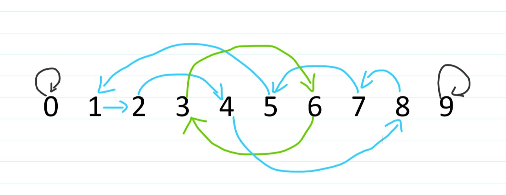
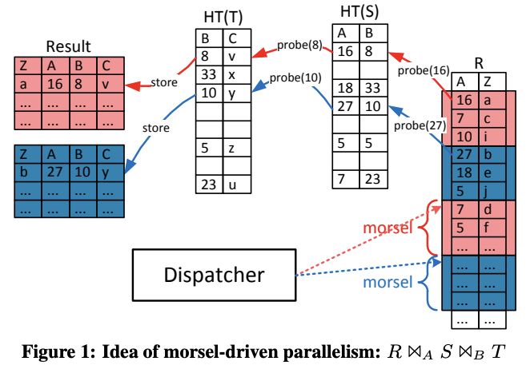
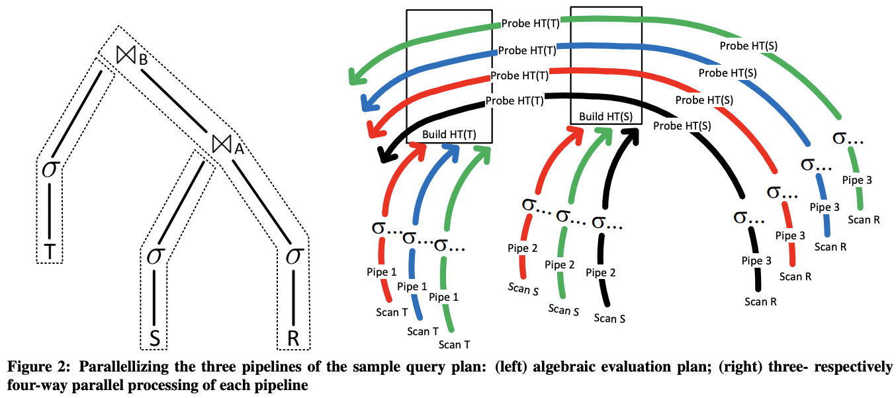
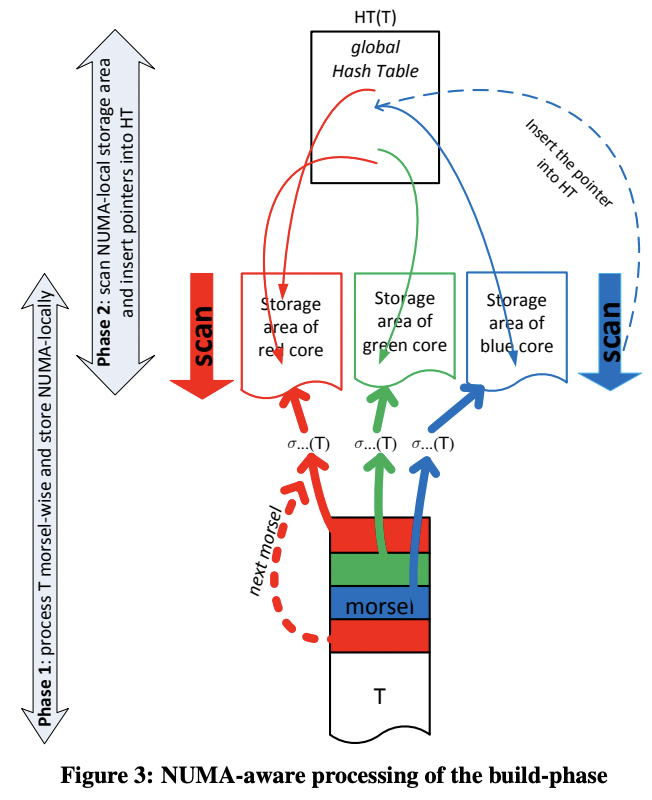
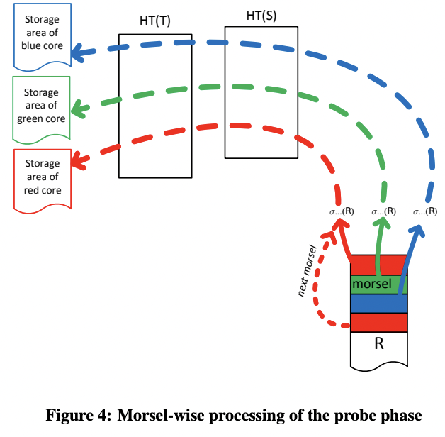
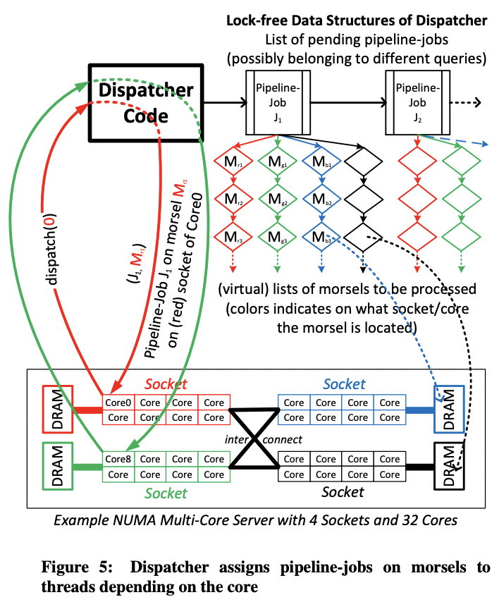
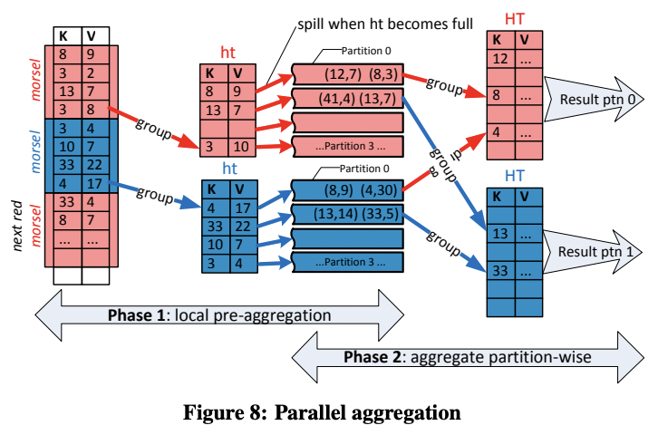
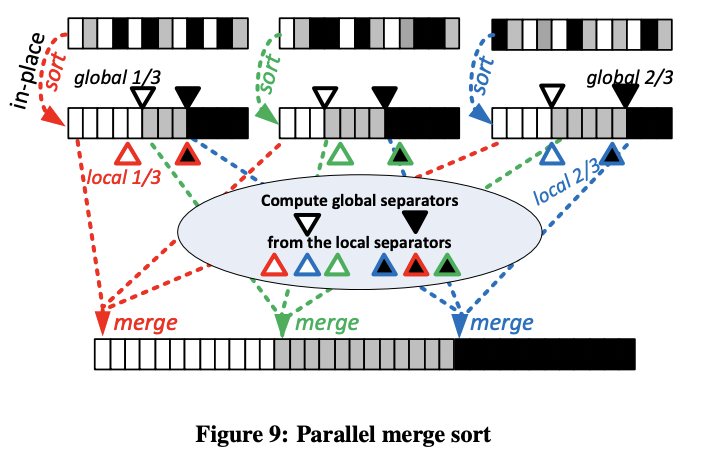

---
> **ARTS-week-03**
> 2023-01-14 09:43
---


## ARTS-2019 左耳听风社群活动--每周完成一个 ARTS
1.Algorithm: 每周至少做一个 leetcode 的算法题
2.Review: 阅读并点评至少一篇英文技术文章
3.Tip: 学习至少一个技术技巧
4.Share: 分享一篇有观点和思考的技术文章

### 1.Algorithm:

- [1806. 还原排列的最少操作步数](https://leetcode.cn/submissions/detail/393972903/)  
    + 思路：置换环
        - 首先端点处的两个值各自成一个环，它们的大小都为1。
        - 因此我们直接从下标1开始遍历到n-1。
        - 然后我们开始找环，需要一个vis数组来表示当前下标是否已经访问过。找环的过程即找出当前下标i的值是由谁来替代的，直到我们又回到了第一个下标为止，这样我们就找到了一个置换环。
        - 举一个具体的例子吧，比如说n=10：
            - 一共4个置换环：
            - 第一个环里的元素只有0
            - 第二个环里的元素只有9
            - 第三个环里的元素有1，2，4，8，7，5
            - 第四个环里的元素有3，6
            - 因此最终的答案是第三个环的大小6。
            - 图如下：


- [1807. 替换字符串中的括号内容](https://leetcode.cn/submissions/detail/394690993/)  
    + 思路：哈希表

### 2.Review:

[Morsel-Driven Parallelism: A NUMA-Aware Query Evaluation Framework for the Many-Core Age](https://dl.acm.org/doi/pdf/10.1145/2588555.2610507)

#### 点评：

#### Introduction
作者希望能解决现代系统架构中 query 执行的两个问题：
```
1.如何充分利用多核能力。
2.如何在不同核之间均匀分发负载。注意即使统计信息本身无比精确，静态 dispatch 也会随着执行过程逐渐变得不均匀。
```
作者因此选择的切入点是：
```
1.将输入数据切分为大量小体积的 morsel，这样更容易做负载均衡。
2.将 plan 组织为若干个线性的 pipeline，每个 morsel 在 pipeline 中顺序执行，直到 pipeline breaker，之间不做线程切换，这样减少了执行过程因线程切换造成的性能损失。
3.task 调度考虑 NUMA，尽量避免数据在不同 NUMA 之间传输。
4.相比于传统 query plan 在执行前确定好并行度，morsel-driven 中并行度是动态调节的，避免了静态并行度导致的执行资源不均衡的问题。
```
作者的依据：
```
1.硬件的发展（多核、大内存）使得 query 执行的瓶颈由 IO 变为了内存。
2.NUMA 的引入令多核系统更像一个小集群，不同 NUMA node 之间的内存带宽成为了瓶颈。
```
传统的 volcano 模型的并行可以被称为 plan-driven，即在 query 编译成 plan 的过程中就确定了要用多少线程，不同线程间再用 exchange 算子通信。但这种模型不能很好地适应现代系统。
morsel-driven 相对应地：
```
1.使用固定数量的线程，每个线程绑到特定的 cpu 核上，从而将线程与 NUMA node 之间的映射固定下来。
2.尽量保持数据不在 NUMA 间迁移：每个线程处理的 input 来自 NUMA 本地，output 同样写到 NUMA 本地。
3.运行期动态调节并行度，甚至动态调节优先级。
```



morsel-driven 要求所有算子都要能以 morsel 为粒度并行执行，在传统的 volcano 模型基础上修修补补是不够的。这种新的执行框架的一个要素是 data locality，每个输入的 morsel，以及物化的输出，以及中间产生的各种数据结构（如 hash table）都会封装到一个共享的 state 中。state 本身具有高度的 NUMA locality：尽管允许被所有核/线程访问，但大部分时间只有创建 state 的 pipeline 会访问，而 pipeline 执行过程是绑定到核/线程上的，因此保证了高度的 NUMA locality。
```
volcano 是在算子间交换数据，以算子为中心；morsel-driven 则是以数据为中心，在数据上迭代不同的算子，更符合分布式计算的理念。
```
纯粹的 volcano 并行框架中，并行是被隐藏在算子内部的，算子间需要交换数据，因此需要在 plan 阶段插入 exchange 算子来做运行期的 data partitioning。partition 的好处是提高了 data locality，但这种好处不一定能抵消增加的开销。相反，morsel-driven 是将并行暴露在算子之外，通过 morsel 的 locality 来实现 data 的 locality，再辅以共享 hash table 等数据结构，因此不需要运行期 partitioning。

作者认为 morsel-driven 可以很容易地与其它系统集成：只要将其中的 exchange 算子替换为 morsel 执行即可。另外 morsel-driven 中的 pipeline 很适合结合 JIT。实际上 morsel-driven 背后的 Hyper 就在使用 JIT。

#### Morsel-driven execution
morsel-driven 中 plan 是由若干个 pipeline 组成，每个 pipeline 包含若干个线性执行的算子：一个算子的输出是下个算子的输入。这样每个 pipeline 可以被编译为一个执行单元，输入一个 morsel，产生输出，中间的算子不会真的物化输出结果。一个 pipeline 在执行过程中可以产生多个实例，不同实例负责处理不同的 morsel。

具体实现上，QEPobject 负责根据数据依赖关系驱动 pipeline 执行。它会为每个 pipeline 在每个线程上创建一块 storage 存放输出结果。一个 pipeline 执行结束后，storage 中的输出会再被切分为均匀大小的 morsel 给后续 pipeline 作为输入。

每个 pipeline 结束后重新划分 morsel 有助于避免不同 morsel 产生的输出大小不均匀导致的数据倾斜。





图 3 中输入被 filter 之后划分为若干个 morsel，每个 morsel 会被 dispatcher 分给一个线程执行，因此会被直接写入到这个线程对应的 storage socket 中（根据颜色对应）。每个线程在处理完当前 morsel 之后，要么切换到另一个 task，要么再从它本地的 storage 中取出下个 morsel 继续执行。过程中并行度随时可以根据数据量进行调节。

在所有数据都被 filter 并分别写入不同线程的 socket 之后，才会开始 build hash table。此时数据大小已知，就可以提前 reserve 好 hash table。build 过程每个线程读取自己本地的 socket 中的 morsel，再将其插入到一个全局的无锁 hash table 中。
```
插入全局 hash table 仍然会带来冲突。优化点，尽量利用 data stream 本来就有的 hash 特性，避免使用全局 hash table。
```



如图 4，build 结束之后，probe pipeline 仍然是先 filter，然后将 morsel 写到不同线程的 socket，probe 算子读取 morsel，先后通过两个 hash table，再将输出写到每个线程专属的 socket 中。

上述过程中可以体现出 morsel-driven 的 pipeline 与 volcano 中的算子的区别：不同 pipeline 是协作进行的，每个 pipeline 会感知共享的数据结构、上下游数据依赖，因此可以生成最优化的执行逻辑。另外 pipeline 的实例数量也是根据数据变化的，可以有非常灵活的并行度调节。

#### Dispatcher: Scheduling Parallel Pipeline Tasks

morsel-driven 中线程是预先创建好并绑核的，因此并行度的调节完全取决于 dispatcher，而不是线程数量。每个 pipeline 的一个运行实例称为一个 task，负责处理一个 morsel。

dispatcher 的三个主要目标：
```
1.将 morsel 分配给它位于的 cpu 核，以保持 NUMA locality。
2.保证单个 query 的并行度有充分的弹性。
3.单个 query 涉及的多个 cpu 核之间负载均衡，让所有 pipeline 同时结束工作，避免有 cpu 核陷入等待。
```

#### Elasticity

每个 task 只处理一个 morsel 是为了保持执行的弹性，这样可以在运行期灵活调节并行度，比如逐渐减少一个长 query 的并行度，将算力让给另一个优先级更高的 query。

#### Implementation Overview
morsel-driven 的实现中，每个 core/socket 有一大块预先分配好的内存空间，且会按需分配出 morsel。一个 core 在向 dispatcher 请求一个新的 task 后，对应 pipeline 的 storage 输入才会被从相应的 socket storage 中切出来（而不是预先分配好 pipeline 所需的空间）。



上图看起来像是 dispatcher 自己也占一个线程，但实际不是。dispatcher 是被动调度的，本身实际是一个无锁的数据结构，由请求 task 的线程驱动。

每个 task 会不停从当前 socket 中取出下个 morsel 执行，这样避免了跨 NUMA 的访问。但为了避免执行长尾，当有 core 处理完本地 socket 的所有 morsel，请求下个 task 时，dispatcher 可能会从其它 socket『偷』一些 morsel 过来。

morsel-driven 支持 bushy 形状的 pipeline，比如『filter 并构建 hash table T』和『filter 并构建 hash table S』是可以并行执行的。但 bushy 并行的缺点也很明显，一个 query 中相互独立的 pipeline 数量往往比较少，限制了它的优势（理论上并行度高）。另外 bushy pipeline 可能需要比较大的空间来保存中间结果，会降低 cache locality。因此 morsel-driven 中每个 query 限制同时只能执行一个 pipeline，当前 pipeline 结束后再调度下个 pipeline。

morsel-driven 另一个相对于线程级并行的优势是更容易 cancel 一个 query，只需要在 dispatcher 标记，不需要 cancel 一个线程（通常不现实）。

#### Morsel Size
太小的 morsel 会导致 task 切换过于频繁，向量化失效；太大的 morsel 会影响 cache 和负载均衡。作者的实验中 10k 个 tuple 大小的 morsel 达到了最好的平衡。

#### Parallel Operator Details

- Hash Join
如前所述，morsel-driven 中 hash join 最大的特点是：
```
1.先收集数据，写到各个线程本地的 socket 中。这样可以得到一个比较理想的 hash table 的初始大小。
2.每个线程再将 tuple 插入到一个全局的无锁 hash table 中。
```
这样就避免了传统的边 insert 边 grow 的最大缺点：hash table grow 开销巨大。
```
在有锁的并行 hash table 构建中，grow 的开销进一步恶化了：grow 是要在临界区内的，即使分桶，也会阻塞所有线程。
```

与高度优化的 radix-join 的对比：
```
1.可以流水线处理更大的输入数据，且 probe 可以原地进行，更节省空间。
2.多个小的 hash table（维度表）可以组合起来 probe。
3.当 join 两个输入表的 cardinality 差别非常大时（实践中非常常见）morsel-driven 这种执行非常高效。
4.当 hash key 分布倾斜时表现更好。
5.对 tuple size 不敏感。
6.不需要硬件相关的参数。
```
但作者也表示 radix-join 值得一试。

- Lock-Free Tagged Hash Table
morsel-driven 中的 hash table 中每个 bucket 是一个链表。它的特别之处是在链表头的指针中嵌入了一个 16 位的 filter，称为 tag。链表中每个元素会被 hash 为 tag 中的 1 位。显然这是一种非确定性的 filter，类似于 bloom filter。但在这个场景中，它的开销比 bloom filter 更低，却能达到类似的提前过滤的效果。

为了降低内存访问开销，hash table 使用 huge page（2MB），且通过 mmap 惰性分配。这样的好处是 page 会在随后线程构建 hash table 时分配，会落到各自的 NUMA node 上，这样多线程构建时各个 page 就大体上均匀分配在各个 NUMA node 上了。

- NUMA-Aware Table Partitioning
NUMA-aware 的 table scan 需要将数据分发到各个 NUMA node。如果在 dispatch 时能根据某些属性 hash，就能提升 data locality。注意这只是个 hint，实际运行时数据仍然可能因为 work-stealing 或者 data-skew 跑到其它 NUMA node 上。

另外这个优化不是决定性的，毕竟只要数据经过第一个 pipeline 之后就在 NUMA 本地了，因此这个优化最多对第一个 pipeline 有一定效果。

- Grouping/Aggregation



如图，agg 分两阶段：
```
1.每个线程单独聚合，维护一个本地的固定大小的 hash table。当这个 hash table 满了之后，就会被写到 overflow partition 中。所有输入都被 partition 之后，线程间会交换不同 partition 的数据。
2.这一阶段每个线程分别扫描一个 partition 的数据，将其聚合为 thread local 的 hash table。每当有 partition 聚合好，它的输出会被立刻发给下一个算子，这样保证了下个算子执行时数据仍然大概率在 cache 中。
```
注意 agg 与 join 的区别在于，agg 一定会破坏 pipeline（它需要 sink），不如直接引入 partition。而 join 的 probe 阶段是可以完全 pipeline 的，引入 partition 会破坏 pipeline，不如使用单个 hash table。



内存中 hash-join 和 hash-agg 通常快于 merge-sort-join 和 agg，因此 morsel-driven 中 sort 只用于 order by 或 top-k。

morsel-driven 中 sort 也是两阶段：

每个线程本地 sort，之后选出 distribution key，所有线程将这些 distribution key 合并确定最终输出数组的各个区间的位置。
之后每个线程负责一个区间，将各个线程的对应数据 merge 到最终输出中。

### 3.Tip:

java 求最大公约数的几种方式

#### 
1.欧几里得算法求最大公约数
```java
public static int gcd1(int num1, int num2) {
    int temp = num1 % num2;
    while (temp != 0) {
        num1 = num2;
        num2 = temp;
        temp = num1 % num2;
    }
    return num2;
}
```

2.从num1和num2的最小值找起，一直往下减，直到找到为止
```java
public static int gcd2(int num1, int num2) {
    int temp = Math.min(num1, num2);
    while (true) {
        if (num1 % temp == 0 && num2 % temp == 0)
            break;
        else
            temp--;
    }
    return temp;
}

public static int gcd2_1(int num1, int num2) {
    int temp = Math.min(num1, num2);
    while (num1 % temp != 0 || num2 % temp != 0) {
        temp--;
    }
    return temp;
}
```

3.辗转相减求得
```java
public static int gcd3(int num1, int num2) {
    while (true) {
        if (num1 > num2)
            num1 -= num2;
        else if (num1 < num2)
            num2 -= num1;
        else
            return num1;
    }
}
```

4.递归
```java
public static int gcd4(int a, int b) {
    if (a % b == 0)
        return b;
    return gcd4(b, a % b);
}
```

#### java - 生成包含 n 个重复字符的字符串

```java
int n = 10;
char[] chars = new char[n];
Arrays.fill(chars, 'c');
String result = new String(chars);
```

```java
String result = IntStream.range(1, count).mapToObj(index -> "" + c).collect(Collectors.joining());
```

#### MySQL 慢SQL问题优化 之 Copying to tmp table on disk

Sql语句
```sql
SELECT
    sum(price) AS price,
    `member_id`
FROM
    `crm_upload`
GROUP BY
    member_id
ORDER BY
    price DESC
LIMIT 10;
```

Explain 之后的结果：
```sql
> explain SELECT sum(price) as price,`member_id` FROM `crm_upload` WHERE `status` = 1 AND `approved` = 1 AND `consume_time` > '2015-09-10'  GROUP BY member_id ORDER BY price desc LIMIT 10;
+------+-------------+------------+------+---------------+------+---------+------+--------+----------------------------------------------+
| id   | select_type | table      | type | possible_keys | key  | key_len | ref  | rows   | Extra                                        |
+------+-------------+------------+------+---------------+------+---------+------+--------+----------------------------------------------+
|    1 | SIMPLE      | crm_upload | ALL  | NULL          | NULL | NULL    | NULL | 310461 | Using where; Using temporary; Using filesort |
+------+-------------+------------+------+---------------+------+---------+------+--------+----------------------------------------------+
1 row in set (0.00 sec)
```

- 关于 Using temporary; 手册解释
```sql
To resolve the query, MySQL needs to create a temporary table to hold the result. This typically happens if the query 

contains GROUP BY and ORDER BY clauses that list columns differently.
```
需要一个临时表来暂存查询后的结果，经常会出现在Group By 或者 Order By 中

- 关于 Using filesort；手册解释
```sql
MySQL must do an extra pass to find out how to retrieve the rows in sorted order. The sort is done by going through all rows <br>according to the join type and storing the sort key and pointer to the row for all rows that match the WHEREclause. The keys then are sorted<br> and the rows are retrieved in sorted order.
```
Mysql 如果想要正常的查找出排序中的数据，需要做一个额外的传递。这个排序将根据join的类型遍历所有的数据，并且存储排序的key。找出匹配到的where条件的数据。

show profile
```sql
> show profile;
+--------------------------------+----------+
| Status                         | Duration |
+--------------------------------+----------+
| starting                       | 0.000037 |
| Waiting for query cache lock   | 0.000008 |
| init                           | 0.000006 |
| checking query cache for query | 0.000103 |
| checking permissions           | 0.000011 |
| Opening tables                 | 0.000029 |
| After opening tables           | 0.000010 |
| System lock                    | 0.000008 |
| Table lock                     | 0.000007 |
| After opening tables           | 0.000012 |
| Waiting for query cache lock   | 0.000006 |
| After opening tables           | 0.000041 |
| init                           | 0.000044 |
| optimizing                     | 0.000016 |
| statistics                     | 0.000244 |
| preparing                      | 0.000116 |
| executing                      | 0.000015 |
| Copying to tmp table           | 0.000061 |
| Copying to tmp table           | 0.138350 |
| converting HEAP to Aria        | 0.003233 |
| Creating index                 | 0.000025 |
| Repair by sorting              | 0.020695 |
| Saving state                   | 0.000040 |
| Creating index                 | 0.000005 |
| converting HEAP to Aria        | 0.000070 |
| Copying to tmp table on disk   | 4.040516 |
| Sorting result                 | 0.020373 |
| Sending data                   | 0.000046 |
| end                            | 0.000003 |
| removing tmp table             | 0.000838 |
| end                            | 0.000013 |
| query end                      | 0.000008 |
| closing tables                 | 0.000010 |
| freeing items                  | 0.000006 |
| updating status                | 0.000003 |
| Waiting for query cache lock   | 0.000002 |
| updating status                | 0.000715 |
| Waiting for query cache lock   | 0.000015 |
| updating status                | 0.000002 |
| storing result in query cache  | 0.000014 |
| logging slow query             | 0.000053 |
| cleaning up                    | 0.000017 |
+--------------------------------+----------+
```

可以看到 Copying to tmp table on disk 花费了大量的时间。
结果查找资料后 了解到 发现 mysql 可以通过变量 tmp_table_size和 max_heap_table_size 来控制内存表大小上限，如果超过上限会将数据写到磁盘上，从而会有物理磁盘的读写操作，导致影响性能。

调整参数配置之后 就不会有这个问题了。

```sql
To set max_heap_table_size to 64M do the following:
SET max_heap_table_size = 1024 * 1024 * 64;
To set tmp_table_size to 32M do the following:
SET tmp_table_size = 1024 * 1024 * 32;
```


### 4.Share:

[康奈尔笔记法](https://www.zhihu.com/question/19652630)  

[网易 MyRocks 使用和优化实践](https://www.infoq.cn/article/z0agilstcfuxa_syctik)

[MyRocks Overview](http://liuyangming.tech/02-2020/myrocks.html)

[SQL 某状态耗时过多的优化](https://techlog.cn/article/list/10183314)

[热点参数限流](https://sentinelguard.io/zh-cn/docs/parameter-flow-control.html)

[Alibaba Sentinel 配置项总结](https://www.imooc.com/article/289562)

[TiDB: a Raft-based HTAP database](https://fuzhe1989.github.io/2021/01/03/tidb-a-raft-based-htap-database/)

[TiDB: A Raft-based HTAP Database](https://developer.aliyun.com/article/802291)

[Elasticsearch优化思路](https://zhuanlan.zhihu.com/p/84173080)

[基于lucene的内嵌式kv存储](http://3dobe.com/archives/247/)

[Mmap fs可能让大索引访问变得缓慢](https://elasticsearch.cn/article/754)