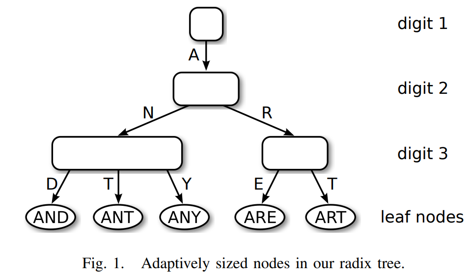
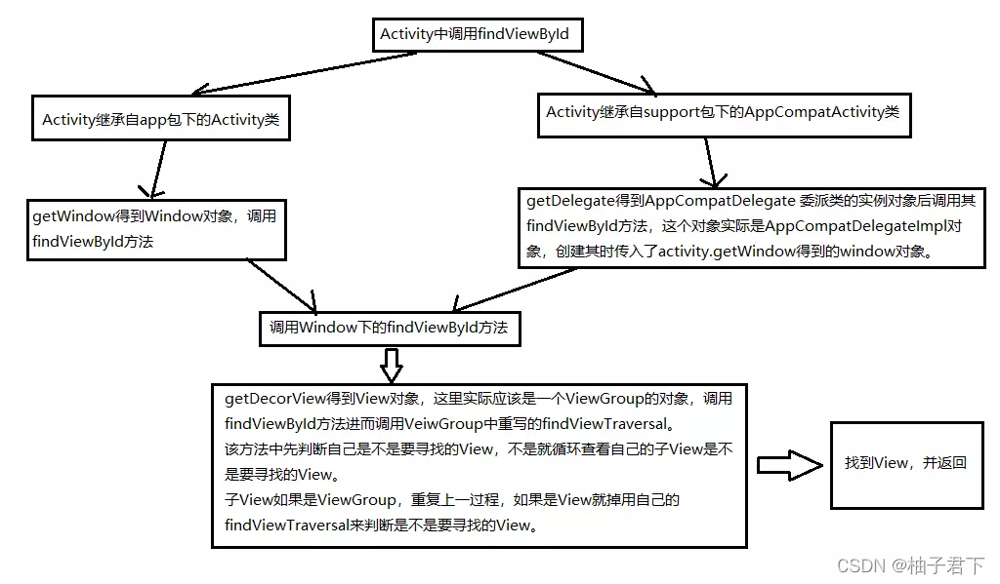

---
> **ARTS-week-06**
> 2023-02-04 10:02
---


## ARTS-2019 左耳听风社群活动--每周完成一个 ARTS
1.Algorithm： 每周至少做一个 leetcode 的算法题
2.Review: 阅读并点评至少一篇英文技术文章
3.Tip: 学习至少一个技术技巧
4.Share: 分享一篇有观点和思考的技术文章

### 1.Algorithm:

- [1129. 颜色交替的最短路径](https://leetcode.cn/submissions/detail/398738843/)  
    + 思路：BFS
- [1145. 二叉树着色游戏](https://leetcode.cn/submissions/detail/399017966/)  
    + 思路：递归
- [1798. 能构造出连续值的最大数目](https://leetcode.cn/submissions/detail/399296943/)  
    + 思路：贪心

### 2.Review:

[自适应基数树：主内存数据库的 ARTful 索引](https://db.in.tum.de/~leis/papers/ART.pdf)

#### 概要：

主内存容量已经增长到一定程度大多数数据库适合 RAM 的地方。用于主内存数据库系统方面，指标结构性能是一个关键瓶颈。传统的内存中数据结构，如平衡二进制搜索树在现代硬件上效率不高，因为它们不要以最佳方式利用 CPU 上的缓存。哈希表，也经常用于主内存索引，速度快，但仅支持点查询。

为了克服这些缺点，我们提出了ART，一种适应性的基数树 （Trie） 用于在主内存中高效索引。它的查找性能超越了高度调优的只读搜索树，而还支持非常高效的插入和删除。在同时，ART非常节省空间并解决了问题过度的最坏情况下的空间消耗，这是最困扰基数树，通过自适应选择紧凑和高效的数据内部节点的结构。即使ART的表现与哈希表相当，它维护排序的数据order，可实现其他操作，如范围扫描和前缀查找.

#### 1、简介

经过几十年主内存容量的上升，甚至大事务数据库适配 RAM。当大多数数据是缓存的传统数据库系统受 CPU 限制，因为他们花费大量精力来避免磁盘访问。这导致了非常密集的研究和商业活动主内存数据库系统，如 H-Store/VoltDB [1]，SAPHANA [2] 和 Hyper [3]。这些系统针对新的硬件设计，因此要快得多。例如，HyPer 将事务编译到机器上代码并摆脱缓冲区管理、锁定和锁定开销。对于 OLTP 工作负荷，生成的执行计划通常是索引操作的序列。因此，索引效率是决定性的性能因素。

25年前，T树[4] 被提议为内存中索引结构。不幸的是，戏剧性处理器架构的变化渲染了 T 树，就像所有传统的二叉搜索树，在现代硬件上效率低下。原因是不断增长的 CPU 缓存大小和发散的主内存速度使底层统一内存访问时间的假设已经过时。B+树像缓存敏感的B+树[5]这样的变体具有更友好的内存访问模式，但需要更昂贵的更新操作。此外，两者的效率 B+树受现代 CPU 的另一个特征的影响：
由于比较的结果不容易预测，现代 CPU 的长管道会停滞不前，这会导致每秒出现额外的延迟。

传统搜索树的这些问题由最近对专门设计用于在现代硬件架构上高效运行。K-ary 搜索树 [6] 和快速架构敏感树 （FAST） [7] 使用数据级并行性执行多重比较与单指令多数据 （SIMD） 同时使用指示。此外，FAST使用的数据布局通过优化利用缓存行来避免缓存未命中，并且转换后备缓冲区 （TLB）。虽然这些优化提高了搜索性能，但这两种数据结构不支持增量更新。对于 OLTP 数据库需要连续插入、更新和删除，一个明显的解决方案是差异文件（增量）机制，但将导致额外费用。

哈希表是另一种流行的主内存数据结构。与具有 O（log n） 访问权限的搜索树相反时间，哈希表具有预期的 O（1） 访问时间，并且因此在主内存中要快得多。尽管如此，哈希表不太常用作数据库索引。一个原因是哈希表随机分散键，因此只有支持点查询。另一个问题是大多数哈希表不要优雅地处理增长，但在O（n）复杂性溢出时需要昂贵的重组。因此当前系统面临着快速之间的不幸权衡仅允许点查询和全功能哈希表，但相对较慢，搜索树。



第三类数据结构，称为trie，基数树，前缀树和数字搜索树如图 1 所示。这些数据结构直接使用键，而不是对键进行哈希处理或比较。底层想法类似于许多按字母顺序发现的拇指索引有序字典书籍：单词的第一个字符可以直接用于跳转到所有以该开头的单词字符。在计算机中，此过程可以重复接下来的字符，直到找到匹配项。因此在这个过程中，所有操作都具有O（k）复杂度，其中k是密钥的长度。在数据集超大时代，当 n 的增长速度快于 k 时，具有时间复杂度独立于 N 是非常有吸引力的。

在这项工作中，我们提出了自适应基数树（ART），它是一种快速且节省空间的内存中索引结构专门针对现代硬件进行了调整。虽然大多数基数树木需要在树木高度与空间效率之间进行权衡通过设置全局有效的扇出参数，ART 将自适应每个单独节点的表示，如图1.通过在本地调整每个内部节点，它可以优化同时提高全球空间利用率和访问效率。节点使用少量高效和紧凑的数据结构，根据子节点的数量。两种附加技术，路径压缩和延迟扩展，让ART高效通过折叠节点来索引长键，从而减少树高。

基数树的一个有用属性是键的顺序不像哈希表中那样随机;相反，键是有序的按位字典顺序排列。我们展示了典型的数据类型如何有效地重新排序以支持所有需要的操作要排序的数据（例如，范围扫描、前缀查找、top-k、最小值和最大值）。

这项工作做出了以下贡献：
• 我们开发了自适应基数树 （ART），一种快速和节省空间的通用索引结构主内存数据库系统。
• 我们证明每个密钥的空间消耗是有界的到 52 个字节，即使对于任意长的密钥也是如此。我们展示实验上，空间消耗要低得多实际上，每个密钥通常低至 8.1 字节。
• 我们描述了内置数据类型的常见程度存储在基数树中，同时保留其顺序。
• 我们通过实验评估 ART 和其他状态艺术主存储器索引结构，包括高效的搜索树提案。
• 通过将 ART 集成到主内存数据库中系统 HyPer 并运行 TPC-C 基准测试，我们在“现实生活”中证明其卓越的端到端性能事务处理应用程序。

本文的其余部分组织如下。下一节将讨论相关工作。第三节介绍了自适应基数树并分析其空间消耗。在第四节我们介绍了二进制可比较键的概念并展示了如何转换常见的内置类型。第五节描述包括一些微型基准测试和 TPC-C 基准。最后，第六节总结并讨论未来的工作。


### 3.Tip:

#### Android findViewById 替代方案


1.Android 中的 View 结构是一个树形结构，findViewById 就是自树的根节点，依次遍历其子节点，知道找到目标的 id。



findViewById 的优点:

- 兼容性好，下面各种替代方案，都有其适用的场景，但是 findViewById 适用所有的场景，当不知道用哪种方案的时候，那就用 findViewById 吧，肯定没有错。
- 非常灵活，适合动态加载 layout 文件。比如一个 Activity，需要在不同的业务中，加载两个不同的 layout 文件，但是两个 layout 文件只有部分间距不同，其他各个元素都是相同的。这个时候，用 findViewId 就可以完美适用。

findViewById 的缺点:
- 性能略差不好，findViewById 是基于树形结构的查找，理论上会带来性能的额外开销，但是实际项目中，因为控件的个数也不会非常非常多，所以可以忽略不计。
- Fragment 中使用容易犯错。从原理图可以看到，在 Activity 中调用 findViewById，实际上是调用 Window 中的 findViewById，但是 Fragment 中并没有单独的 Window，Fragment 中调用 findViewById 的效果和 Activity 中调用的效果一模一样。所以如果一个 Activity 中有多个 Fragment，Fragment 中的控件名称又有重复的，那直接 findViewById 会出错的；
- 增加代码的耦合度，findViewById 随时实地都可以调用，在子 view 中，在 Activity 中等等，如果滥用起来，会让代码耦合的一塌糊涂，后面查找 bug 起来，非常麻烦，因为不知道 View 的属性在哪个类中被改变了；
- 容易引发空指针，一个大型项目中，控件的 id 经常会重复，xml中删除了一个控件，但是对应的 Activity 中没有删除这个控件的相关引用，编译时并不会报错，但是运营时会报出空指针；
- 代码可读性不好，findViewById 往往在 Activity 的 onCreate 方法中被引用，我们不能方便的将 xml 中的控件与代码中的控件结合起来，特别是如果 xml 的命名与代码中的命名又不规范，代码阅读起来简直就是噩梦。

2.ButterKnife

ButterKnife 框架使用方法
```shell
class ExampleActivity extends Activity {
    @BindView(R.id.title)  TextView title;
    @BindView(R.id.subtitle) TextView subtitle;
    @BindView(R.id.footer) TextView footer;

    @Override public void onCreate(Bundle savedInstanceState) {
        super.onCreate(savedInstanceState);
        setContentView(R.layout.simple_activity);
        ButterKnife.bind(this);
        // TODO Use fields...
    }
}

```

ButterKnife 的优点:
1、强大的View绑定和Click事件处理功能，简化代码，提升开发效率
2、方便的处理Adapter里的ViewHolder绑定问题
3、运行时不会影响APP效率，使用配置方便
4、代码清晰，可读性强

ButterKnife 的缺点:
从上面的代码可以看到，ButterKnife 基本上只是对 findViewById 的一个取代而已，增加了代码的可读性，findViewById 的各种缺点依然存在。

3.kotlin-android-extensions

如果使用 kotlin，则可以用 kotlin-android-extensions 来替代 findViewById，用法如下
module 的 build.gradle 文件加入以下代码：
```shell
plugins {
    id 'kotlin-android-extensions'
}
```
然后在代码中就可以引用了
```java
package com.cmri.findviewbyid

import androidx.appcompat.app.AppCompatActivity
import android.os.Bundle
import kotlinx.android.synthetic.main.activity_main.*

class MainActivity : AppCompatActivity() {
    override fun onCreate(savedInstanceState: Bundle?) {
        super.onCreate(savedInstanceState)
        setContentView(R.layout.activity_main)
        tv_hello.setOnClickListener {

        }
    }
}
```
对生成的 apk 进行反编译下，看下原理是什么
```java
/* access modifiers changed from: protected */
public void onCreate(Bundle savedInstanceState) {
    super.onCreate(savedInstanceState);
    setContentView((int) R.layout.activity_main);
    ((TextView) findViewById(R.id.tv_hello)).setOnClickListener(MainActivity$$ExternalSyntheticLambda0.INSTANCE);
}
```
可以看到，本质上依然是使用 findViewById 进行实现的，findViewById 的缺点依然存在。

4.databinding
databinding 与 viewbinding 的诞生，为优化 findViewById 的难题提出了另外一种思路，就是生成一个 databinding 文件，文件中记录了各个控件的引用。用法如下:
module的build.gradle中加入以下代码
```shell
android {
    dataBinding {
        enabled true
    }
}
```
然后将布局文件用 layout 标签包裹起来
```xml
<?xml version="1.0" encoding="utf-8"?>
<layout>
    <androidx.constraintlayout.widget.ConstraintLayout xmlns:android="http://schemas.android.com/apk/res/android"
        xmlns:app="http://schemas.android.com/apk/res-auto"
        xmlns:tools="http://schemas.android.com/tools"
        android:layout_width="match_parent"
        android:layout_height="match_parent"
        tools:context=".MainActivity">
...

    </androidx.constraintlayout.widget.ConstraintLayout>
</layout>
```
activity 代码如下
```java
class MainActivity : AppCompatActivity() {
    lateinit var binding:ActivityMainBinding
    override fun onCreate(savedInstanceState: Bundle?) {
        super.onCreate(savedInstanceState)
        binding = ActivityMainBinding.inflate(layoutInflater)
        setContentView(binding.root)
        binding.tvHello.setOnClickListener {

        }
    }
}
```
可以看到，databinding 会根据动态生成一个 ActivityMainBinding 文件，在执行 ActivityMainBinding.inflate 的时候，会自动生成控件的引用（mapBindings方法），这里对布局 tree 执行一趟遍历查找就可以生成所有的引用。

databinding 优点

- 规避了控件空指针错误，如果有引用错误，则会在编译阶段发现；
- 效率比 findViewById 要高，一趟遍历可以生成所有控件的引用，而 findViewById 是每次执行时都需要遍历一遍
- 代码的可读性要高，得益于 Android Studio 的强大功能，我们很轻易的将java（kotlin）代码中的控件引用与xml的定义结合起来

databinding 缺点

- 灵活性不高，如果需要动态选取引用的布局文件，binding 就无法适用了。
- 改造成本较大，布局文件只有加上 layout 标签才可以使用。

5.viewbinding
google在推出databinding的同时，推出了viewbinding。先看下viewbinding的用法
module的build.gradle中增加以下代码
```shell
android {
    viewBinding {
        enabled true
    }
}
```
viewbinding 会默认为所有的布局文件生成对应的 binding 文件，如果不想生成，可以在布局文件中加上以下代码
```java
tools:viewBindingIgnore="true"
```
然后在 activity 中直接使用即可，用法与 databinding 的用法相同。

但是 viewbinding 与 databinding 的最大不同是，databinding 的控件引用通过 mapbinding 来实现的，一趟查找就能生成所有的控件引用，但是 viewbinding 是通过 findViewById 来生成所有的控件引用，所有 viewbinding 理论上效率比 databinding 要差一点，但是更加轻量级。

viewbinding 生成控件的引用
```java
public static ActivityMainBinding bind(View rootView2) {
    int id = R.id.ll_layout;
    LinearLayout llLayout2 = (LinearLayout) ViewBindings.findChildViewById(rootView2, R.id.ll_layout);
    if (llLayout2 != null) {
        id = R.id.tv_hello;
        TextView tvHello2 = (TextView) ViewBindings.findChildViewById(rootView2, R.id.tv_hello);
        if (tvHello2 != null) {
            id = R.id.tv_hello1;
            TextView tvHello12 = (TextView) ViewBindings.findChildViewById(rootView2, R.id.tv_hello1);
            if (tvHello12 != null) {
                return new ActivityMainBinding((ConstraintLayout) rootView2, llLayout2, tvHello2, tvHello12);
            }
        }
    }
    throw new NullPointerException("Missing required view with ID: ".concat(rootView2.getResources().getResourceName(id)));
}
```

viewbinding 优点
- 规避了引用控件时的空指针错误问题，编译时生成控件的引用
- 较 databinding，更加轻量级
- 代码可读性高，同 databinding 一样

viewbinding 缺点
- 灵活性不高，如果需要动态选取引用的布局文件，binding 就无法适用了。
- 默认会为所有的 xml 生成 binding 文件，会生成很多冗余的文件。

### 4.Share:

[云溪数据库选型ART树作为数据查找算法（下）](https://www.modb.pro/db/240869)  

[最全面的 Android 编码规范指南](https://www.cnblogs.com/xinge1993/p/5598274.html)