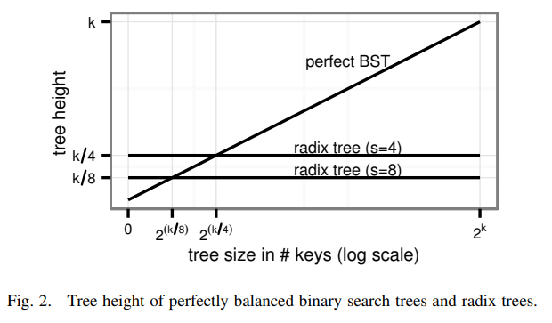
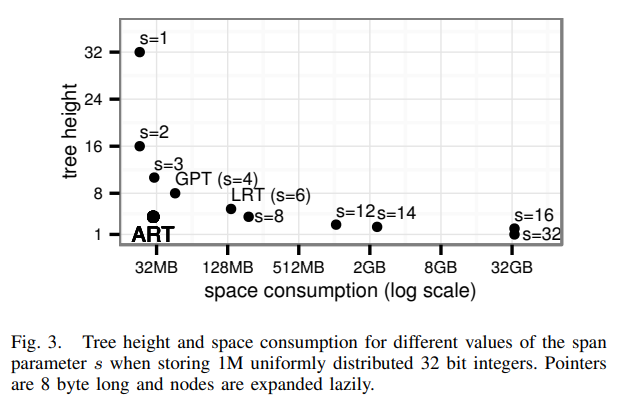
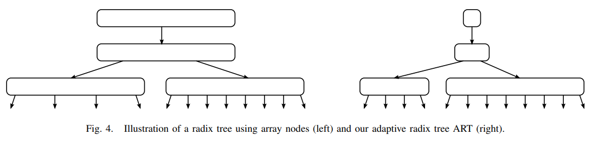
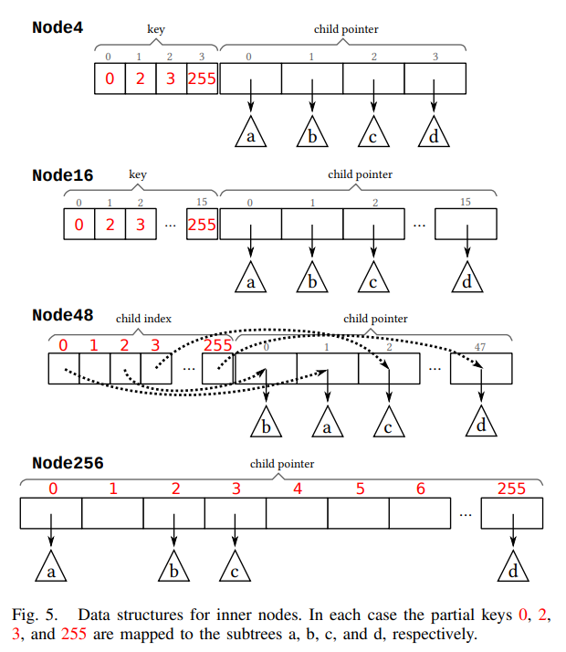
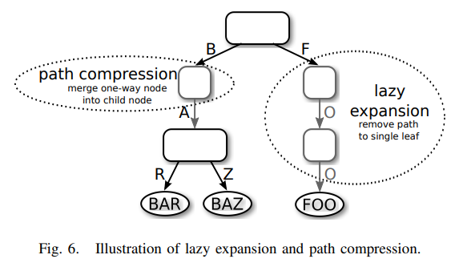
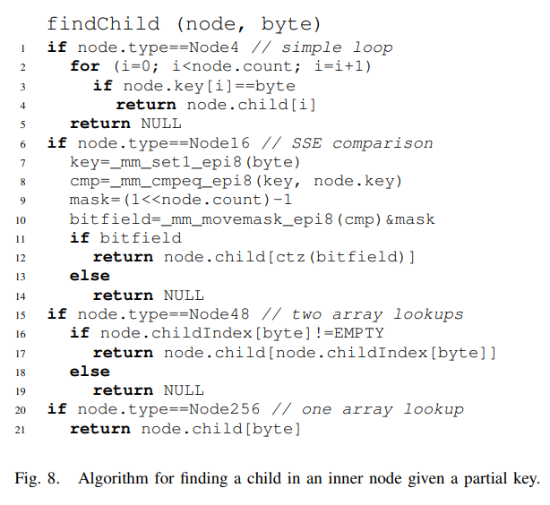
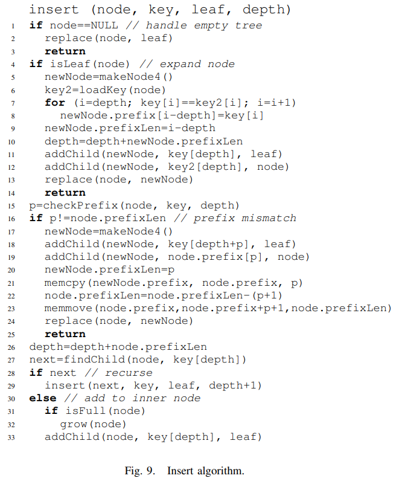
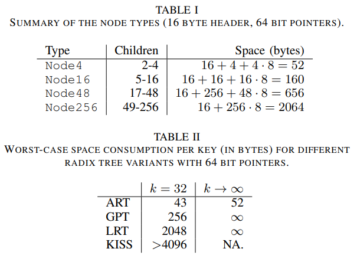
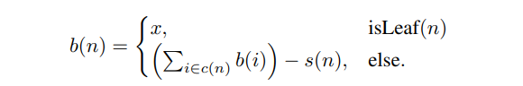

---
> **ARTS-week-07**
> 2023-02-10 20:05
---

## ARTS-2019 左耳听风社群活动--每周完成一个 ARTS
1.Algorithm: 每周至少做一个 leetcode 的算法题
2.Review: 阅读并点评至少一篇英文技术文章
3.Tip: 学习至少一个技术技巧
4.Share: 分享一篇有观点和思考的技术文章

### 1.Algorithm:

- [1604. 警告一小时内使用相同员工卡大于等于三次的人](https://leetcode.cn/submissions/detail/400041777/)  
    + 思路：哈希
- [1233. 删除子文件夹](https://leetcode.cn/submissions/detail/400357569/)  
    + 思路：贪心
- [1797. 设计一个验证系统](https://leetcode.cn/submissions/detail/400674009/)  
    + 思路：哈希

### 2.Review:

[自适应基数树：主内存数据库的 ARTful 索引](https://db.in.tum.de/~leis/papers/ART.pdf)

#### 2、相关工作

在基于磁盘的数据库系统中，B+树[8]无处不在[9]。它从磁盘中检索大块以减少访问次数。红黑树[10]，[11]和T树[4]被提议用于主内存数据库系统。Rao
和 Ross[5]表明T树像所有二叉搜索树一样，缓存行为不佳，因此通常速度比现代硬件上的 B+ 树较慢。作为替代方案，他们提出了一个缓存意识B+树变体，CSB+树[12]. Graefe 和 Larson[13]对 B+ 树做了进一步的缓存优化。

现代 CPU 允许执行多重比较单个 SIMD 指令。Schlegel 等人 [6] 提出了 kary 搜索，它减少了比较的数量log2n 到 logKn，其中 K 是适合的键数到一个 SIMD 向量中。与二叉树相比，这技术还可以减少缓存未命中的数量，因为对加载的每个高速缓存行执行 K 个比较从主内存。Kim等人通过提出FAST，一种布局二叉搜索的方法树以架构敏感的方式[7]。SIMD， 高速缓存行，和页面阻止用于最佳地使用可用的缓存和内存带宽。此外，他们提议交错多个查询的阶段以增加其搜索算法的吞吐量。FAST 树和 K-ary 搜索树是无指针的数据结构，其将所有键存储在单个数组中并使用偏移量计算遍历树。虽然这种表示是有效的，并且节省空间，这也意味着无法进行在线更新。Kim 等人还提出了 FAST 的 GPU 实现和将其性能与现代 CPU 进行比较。他们的结果显示由于更高的内存带宽，GPU 可以实现吞吐量高于 CPU。尽管如此，使用 GPU 由于专用索引硬件尚不实用，因为 GPU 的内存容量有限，通信成本主内存高，上百个并行查询是实现高吞吐量所必需的。因此，我们专注于 CPU 的索引结构。

使用 try 为字符串编制索引已广泛学习。最早的两个变体使用列表 [14]和数组 [15] 作为内部节点表示。Morrison 引入了路径压缩以存储长字符串高效[16]。 Knuth [17]分析了这些早期的 trie 变体。对于树的上层突发 trie 是使用 trie 节点的最新提案，但切换到链表一旦子树只有几个元素。HAT-trie [18]通过将链表替换为哈希表。虽然大多数研究都集中在索引字符上字符串，我们的目标是索引其他数据类型。因此我们更喜欢术语基数树而不是 trie，因为它强调了与基数排序算法的相似性，并强调可以对任意数据编制索引，而不仅仅是字符串。

广义前缀树由 Boehm 等人提出[19] 作为通用索引结构。这是一个基数树，扇出16，入围 SIGMOD 决赛 2009 年编程竞赛。KISS-Tree [20] 是一个更只有三个级别的高效基数树提案，但可以仅存储 32 位密钥。它使用开放式寻址方案密钥的前 16 位并依赖于虚拟内存系统以节省空间。第二级，负责接下来的 10 位，使用数组表示和最终级别使用位向量压缩 6 位。动态的理念更改内部节点表示由 Judy 使用惠普开发的数组数据结构研究实验室[21]，[22]。

Graefe 讨论了二进制可比较（“规范化”）键，例如 [23]，作为简化和加速密钥的一种方式比较。我们用这个概念来获得有意义的订单用于存储在基数树中的密钥。

#### 3、自适应基数树
本节介绍自适应基数树 （ART）。我们开始对基数的优点有一些一般性观察基于比较的树上的树。接下来，我们激励使用的自适应节点通过显示空间消耗传统的基数树可能过多。我们继续描述ART和用于搜索和插入的算法。最后，我们分析了空间消耗。

A. 前言
基数树具有许多有趣的特性，将它们与基于比较的搜索树区分开来：
• 基数树的高度（和复杂性）取决于键的长度，但通常不在数字上树中的元素。
• 基数树不需要重新平衡操作，所有广告订单会生成相同的树。
• 密钥按字典顺序存储。
• 叶节点的路径表示该节点的键叶。因此，密钥是隐式存储的，并且可以从路径重建。

基数树由两种类型的节点组成：内部节点，将部分键映射到其他节点和叶节点，其中存储与键对应的值。最高效的内部节点的表示形式为 2 的数组的指针。在树遍历期间，键的 s 位块用作索引到该数组中，从而确定下一个子数组节点，无需任何其他比较。参数 s，我们称之为 span，对基数的性能至关重要树，因为它决定了给定树的高度密钥长度：存储 k 位密钥的基数树的 dk/se 级别为内部节点。对于 32 位密钥，例如，基数树使用s = 1 有 32 个级别，而 8 个跨度仅产生 4 个级别。

因为基于比较的搜索树很普遍数据库系统中的索引结构，它说明了将基数树的高度与完全平衡的搜索树中的比较次数进行比较。虽然在最佳情况下，每次比较都排除了所有值的一半，但基数树如果 s > 1，节点可以排除更多值。因此，基数树高度小于 n > 2 的二叉搜索树K/S.这关系如图 2 所示，并假设可以在 O（1） 时间内比较键。对于大键，比较实际上需要O（k）时间，因此搜索的复杂性树是 O（k log n），而不是基数树复杂度O（k）。这些观察表明，基数树，特别是跨度大，比传统搜索更高效树。

B. 自适应节点
正如我们所看到的，从（纯查找）性能的角度来看，希望有一个大跨度。当数组指针用于表示内部节点，缺点大跨度也很清楚：空间使用可能过多当大多数子指针为 null 时。说明了这种权衡图 3 显示了高度和空间消耗对于存储 1M 时 span 参数的不同值均匀分布的 32 位整数。随着跨度的增加，树高呈线性下降，而空间消耗呈指数级增长。因此，在实践中，只有一些 s 的值提供了时间和空间之间的合理权衡。例如，广义前缀树 （GPT） 使用4 位 [19]，以及 Linux 内核 （LRT） 中使用的基数树使用 6 位 [24]。图3进一步显示了我们的自适应基数同时，树 （ART） 使用更少的空间并且具有更小的空间比仅使用同类数组节点的基数树高度。

实现空间和时间效率的关键思想是自适应地使用具有相同、相对的不同节点大小跨度大，但扇出不同。图 4 说明了这一想法，并显示自适应节点不会影响结构（即高度）的树，只有节点的大小。由减少空间消耗，自适应节点允许使用更大的跨度，因此也提高了性能。

为了有效地支持增量更新，它是每次更新后调整节点大小的成本太高。因此我们使用少量节点类型，每种节点类型都有不同的扇出。根据非空子项的数量，使用适当的节点类型。当节点的容量因插入而耗尽，取而代之的是更大的节点类型。相应地，当节点由于以下原因而变得未满时密钥删除，它被替换为较小的节点类型。

C. 内部节点的结构
从概念上讲，内部节点将部分键映射到子指针。在内部，我们使用四种具有不同容量的数据结构。给定下一个键字节，每个数据结构都允许有效地查找、添加和删除子节点。此外，子指针可以按排序顺序扫描，这允许实施范围扫描。我们使用 8 位的跨度，对应的到 1 字节的部分键，并导致相对较大扇出。这种选择还具有简化实现，因为字节是可直接寻址的避免位移和屏蔽操作。

这四种节点类型如图 5 所示，它们是根据其最大容量命名。而不是使用键/值对列表，我们将列表拆分为一个关键部分和一个指针部分。这允许保留表示紧凑，同时允许高效搜索：
Node4：最小节点类型最多可以存储 4 个子节点指针并使用长度为 4 的数组作为键，另一个指针的数组长度相同。键和指针存储在相应的位置，并对键进行排序。
Node16：此节点类型用于存储 5 到 16 个子指针。与 Node4 一样，键和指针存储在相应位置的单独数组中，但是两个数组都有 16 个条目的空间。可以找到一把钥匙有效地使用二进制搜索，或者在现代硬件上，使用使用 SIMD 指令进行并行比较。
Node48：随着节点中条目数量的增加，搜索密钥数组变得昂贵。因此，节点指针超过 16 个时，不会显式存储密钥。相反，使用一个 256 个元素的数组，可以对其进行索引直接使用密钥字节。如果节点有 17 到 48 个子节点指针，此数组将索引存储到第二个数组中，该数组最多包含 48 个指针。与 256 个 8 字节的指针相比，这种间接寻址节省了空间，因为索引只需要 6 位（为简单起见，我们使用 1 个字节）。
Node256：最大的节点类型只是一个 256 的数组指针，用于存储 49 到 256 个条目。有了这个表示，可以找到下一个节点有效地使用该数组中键字节的单个查找。不需要额外的间接寻址。如果大多数条目不是 null，这种表示形式也非常节省空间，因为只需要存储指针。

此外，在每个内部节点的前面，标头常量大小（例如，16字节）存储节点类型，子节点的数量和压缩路径（参见第三-E节）。

D. 叶节点的结构
除了使用内部节点存储路径之外，如前所述在上一节中，基数树还必须存储值与密钥关联。我们假设只有唯一键存储，因为可以实现非唯一索引通过将元组标识符作为决胜局附加到每个键。

这些值可以以不同的方式存储：
• 单值叶：使用存储一个值的附加叶节点类型存储值。
• 多值叶：值存储在四个叶子之一中不同的叶节点类型，它们反映了内部节点，但包含值而不是指针。
• 组合指针/值槽：如果值适合指针，则不需要单独的节点类型。相反，每个内部节点中的指针存储位置可以存储指针或值。值和指针可以是使用每个指针一个附加位或指针标记。

使用单值叶是最通用的方法，因为它允许在一个内具有不同长度的键和值树。但是，由于树高增加，它会导致每次查找一个额外的指针遍历。多值叶避免此开销，但要求树中的所有键都具有相同的长度。组合的指针/值槽是有效的和允许存储不同长度的密钥。因此，这种方法如果适用，应使用。它特别有吸引力存储元组标识符的辅助数据库索引与指针大小相同。

E. 折叠内部节点
基数树具有每个内部节点的有用属性表示键前缀。因此，键是隐式的存储在树结构中，并且可以从叶节点的路径。这样可以节省空间，因为密钥不必显式存储。然而，即使使用这种隐式前缀压缩键和使用在自适应节点中，有一些情况，特别是长键，其中每个键的空间消耗很大。我们因此，使用两个额外的、众所周知的技术，允许通过减少节点数来降低高度。这些技术对长键非常有效，增加此类指数的表现显著。同样重要是它们减少了空间消耗，并确保了最坏情况下的空间限制。

使用第一种技术，延迟扩展，内部节点是仅当需要区分至少两个时才创建叶节点。图 6 显示了一个延迟扩展的示例通过截断叶“FOO”的路径来保存两个内部节点。如果前缀为“F”的另一个叶子是插入。请注意，由于到叶子的路径可能会被截断，此优化要求将密钥存储在叶或可以从数据库中检索。

路径压缩是第二种技术，它删除了所有内部技术只有一个子节点。在图 6 中，内部节点存储部分键“A”被删除。当然，这个部分键不能简单地被忽视。有两种方法可以处理它：
• 悲观：在每个内部节点，存储一个可变长度（可能是空的）部分键向量。它包含所有先前单向节点的键删除。在查找过程中，将此向量与在继续下一个孩子之前搜索关键字。
• 乐观：仅前一个单向节点的计数（等于悲观向量的长度方法）被存储。查找只是跳过这个数字字节而不比较它们。相反，当查找时到达叶子，其键必须与搜索进行比较确保没有“错误转弯”的关键。

这两种方法都确保每个内部节点至少具有两个孩子。乐观的方法特别有益对于长字符串，但需要额外检查一次，而悲观方法使用更多空间，并且具有变量大小节点导致内存碎片增加。我们因此，使用混合方法，在每个节点就像在悲观的方法中一样，但有一个常数所有节点的大小（8 字节）。仅当超过此大小时，查找算法动态切换到乐观算法策略。不会浪费太多空间或碎片内存，这避免了我们额外检查的情况下研究。

F. 算法
我们现在介绍用于搜索和更新的算法：

搜索：用于搜索的伪代码如图  7 所示。这使用键数组的连续字节遍历树直到遇到叶节点或空指针。4号线通过检查遇到的叶子来处理延迟扩展完全匹配密钥。处理悲观路径压缩在第 7 行和第 8 行中，如果压缩路径与密钥不匹配。找到下一个子节点通过 findChild 函数，如图 8 所示。根据节点类型，适当的搜索算法执行：因为 Node4 只有 2-4 个条目，所以我们使用一个简单的循环。对于 Node16，伪代码显示使用 SSE 指令的 SIMD 实施，允许将 16 个键与一条指令并行进行比较。首先，复制搜索的键（第 7 行），然后与 16 个密钥存储在内部节点（第 8 行）。在下一步中，一个创建掩码（第 9 行），因为节点可能小于16 个有效条目。比较结果将转换为位字段，掩码被应用（第 10 行）。最后，位字段转换为使用计数尾随零的索引说明（第 12 行）。或者，可以使用二叉搜索如果 SIMD 指令不可用。在 Node48 中查找是通过首先检查子索引条目是否有效来执行，然后返回相应的指针。一个节点256查找仅包含单个阵列访问。

插入：伪代码如图 9 所示。树使用第 29 行中的递归调用遍历，直到找到新叶的位置。通常，叶子可以只需在增长后插入到现有的内部节点中如有必要（第 31-33 行）。如果，由于懒惰扩张，遇到现有叶子，它被新的叶子替换存储现有叶和新叶的内部节点（第 5 行 13）. 另一种特殊情况是，如果新叶的键与压缩路径不同：创建新的内部节点在当前节点上方并调整压缩路径因此（第 17-24 行）。我们省略了一些帮助程序函数空间不足：将替换树中的节点替换为另一个节点 addChild 将新子节点追加到内部节点节点，检查前缀比较 a 的压缩路径节点并返回相等字节数，增长用更大的节点类型替换节点，负载键从数据库中检索叶的键。

批量加载：为现有索引创建索引时关系，可以使用以下递归算法来加速向上索引构造：使用每个键的第一个字节键/值对被划分为 256 个分区，并创建适当类型的内部节点。返回之前该内部节点及其子节点是通过递归应用创建的使用下一个分区的每个分区的批量加载过程每个键的字节。

删除：删除的实现与插入。叶子从内部节点中删除，该内部节点是必要时缩小。如果该节点现在只有一个子节点，则它是替换为其子项，并调整压缩路径。

G. 空间消耗
即使具有 TB 级 RAM 的服务器也很容易可用，主内存仍然是一种宝贵的资源。因此索引结构应尽可能紧凑。对于基数树木，空间消耗取决于分布存储的密钥。密集键（例如，范围从 1 到 n ）是最好的情况，并且可以有效地存储空间，甚至使用大跨度且没有自适应节点。当键另一方面是稀疏的，内部节点的许多指针为空，这会导致空间浪费。键歪斜导致某些节点主要包含空指针，而其他节点则包含要密密麻麻。自适应节点解决了这些问题并确保任何密钥分发都由本地优化每个节点的空间消耗。

我们现在分析每个最坏情况下的空间消耗键，考虑自适应节点、延迟扩展和
路径压缩。对于以下分析，我们假设指针长度为 8 个字节，每个节点有一个 16 字节标头存储节点类型、非空子级的数量、和压缩路径。我们只考虑内部节点和忽略叶节点，因为叶子不会产生空间开销，如果使用带有标记指针的组合指针/值槽。使用这些假设，由此产生的空间消耗每个内部节点类型如表 I 所示。

将每个叶子视为提供 x 字节和内部节点消耗孩子提供的空间。如果每个节点一棵树的预算为正，那么该树使用的预算小于 x每个键的字节数。内节点的预算是所有其子女的预算减去其空间消耗节点。形式上，节点 n 与子节点的预算 b（n）节点 c（n） 和空间消耗 s（n） 定义为

在节点类型上使用归纳法，我们现在表明 b（n） ≥ 52 对于每个 ART 节点 n 如果 x = 52：对于叶子，根据预算函数的定义，报表是微不足道的。为了证明该语句适用于内部节点，我们计算P 的下限i∈c（n）b（i） 使用归纳假设以及每个节点类型的最小子节点数。后减去相应的空间消耗，我们得到每个节点类型的预算下限。在所有四个中如果它大于或等于 52，则得出感应。总而言之，我们已经证明，对于 x = 52，它无法构造自适应基数树节点预算为负。因此，最坏情况的空间任何自适应基数树的消耗量为 52 字节，即使任意长的密钥。也可以类比地表明具有六种节点类型1，最坏情况下的空间消耗可能是减少到每个密钥 34 个字节。正如我们将在V-D节中展示的那样，在实践中，空间消耗远小于最坏的情况，即使是相对较长的密钥。8.1的最佳情况但是，字节确实经常发生，因为代理项整数键通常很密集。

让我们以与其他基数树的比较来结束，即汇总见表二。因为广义前缀树并且 Linux 内核基数树不使用路径压缩，内部节点的数量与钥匙。因此，每个键的最坏情况空间消耗不受限制。此外，即使对于快捷键，两个数据结构在最坏情况下的空间消耗要高得多比 ART，因为它们不使用自适应节点。KISS-Tree 的最坏情况空间消耗超过 4KB键，并且与无符号整数键一起出现，例如，与无符号整数键一起出现 {i · 2 16 |i ∈ {0， 1， . . . ， 2 16 − 1}}.

### 3.Tip:

#### %1e9+7 和 %1000000007 的区别

1. 对 1e9+7 取模后得到的是浮点型
2. 对 1000000007 取模得到 int 型数据

#### Android开发：用adb命令安装apk到手机

1. 查看手机是否连接
adb devices 
2. 输入安装命令
adb install xxx.apk

#### jvm参数设置方法(win10)
在系统变量中，新建变量JAVA_OPTS
值设置为 -Xms1024M -Xmx2048M -XX:PermSize=256M -XX:MaxNewSize=256M -XX:MaxPermSize=512M
具体根据实际情况进行配置

### 4.Share:

[FST 压缩算法](https://blog.csdn.net/stone_tomcate/article/details/119220314)  

[为什么要对1000000007取模](https://www.zhihu.com/question/49374703)