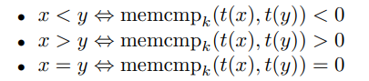
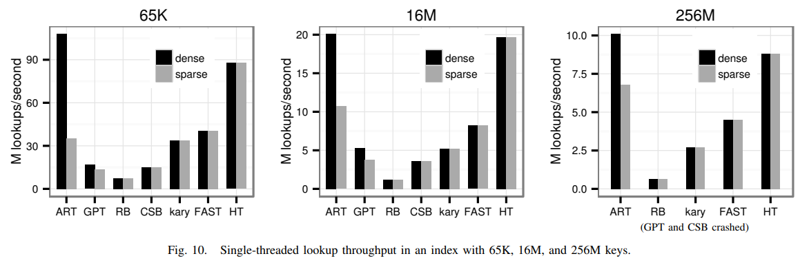
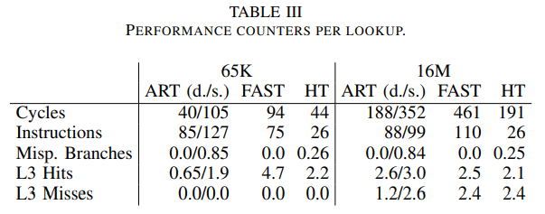
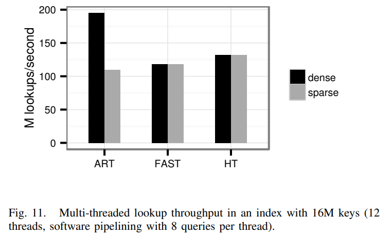
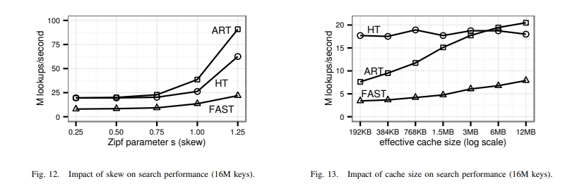
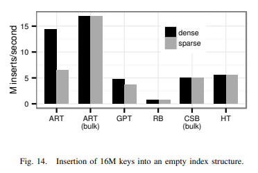
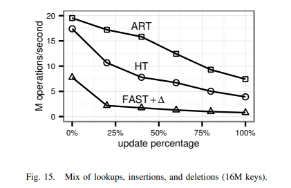
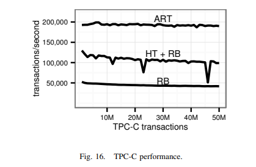
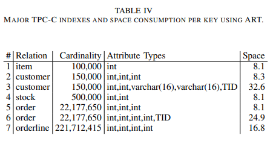
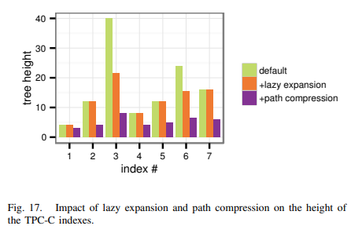

---
> **ARTS-week-08**
> 2023-02-18 09:18
---


## ARTS-2019 左耳听风社群活动--每周完成一个 ARTS
1.Algorithm: 每周至少做一个 leetcode 的算法题
2.Review: 阅读并点评至少一篇英文技术文章
3.Tip: 学习至少一个技术技巧
4.Share: 分享一篇有观点和思考的技术文章

### 1.Algorithm:

- [1234. 替换子串得到平衡字符串](https://leetcode.cn/submissions/detail/401814672/)  
    + 思路：滑动窗口
- [1124. 表现良好的最长时间段](https://leetcode.cn/submissions/detail/402148653/)  
    + 思路：前缀和
- [1139. 最大的以 1 为边界的正方形](https://leetcode.cn/submissions/detail/403156816/)  
    + 思路：DP

### 2.Review:

[自适应基数树：主内存数据库的 ARTful 索引](https://db.in.tum.de/~leis/papers/ART.pdf)

#### 4、构造二进制可比较密钥

选择索引结构的一个重要方面是数据是否按排序顺序存储。排序后的索引结构的顺序遍历有助于实现高效的有序范围扫描和查找，以实现最小，最大值、顶部 N 等。默认情况下，仅基于比较树按排序顺序存储数据，这导致它们作为数据库系统的索引结构的流行。而有人提议使用顺序保持哈希来允许哈希表元素要排序，这在现实世界的系统中并不常见。原因是对于来自未知的值分布，很难想出这样的函数将输入值均匀分布在哈希表上，同时保留输入顺序。

存储在基数树中的键按按字典顺序排序。对于某些数据类型，例如 ASCII 编码字符字符串，这将产生预期的顺序。对于大多数数据类型事实并非如此。例如，负二补码有符号整数在字典顺序上大于正整数整数。但是，可以获得所需的订单通过转换密钥。我们调用由以下值生成的值这样的转换二进制可比较键。如果仅将二进制可比较键用作基数树的键，则数据按排序顺序存储，所有依赖于此的操作可以支持订单。请注意，没有修改上一节中介绍的算法是必需的。每个键必须简单地转换为二进制可比键，然后再存储或查找。

二进制可比较键还有其他用例。就像这样概念允许用基数替换基于比较的树树，它允许取代基于比较的排序算法像快速排序或合并排序与基数排序算法可以渐近优越。

A. Definition
变换函数 t ： D → {0， 1， . . . ， 255}^k 将域 D 的值转换为二进制可比较键长度 k，如果它满足以下等价（x、y ∈ D）：



运算符 <，>，= 表示通常的关系运算符在输入类型上，而 MEMCMPK比较两个输入矢量分量明智。如果所有比较值都相等，则返回 0，如果第一个向量小于第二个向量的相应字节矢量，否则为正值。对于有限域，总是可以将任何严格完全有序域的值转换为二进制可比域 keys：域大小 n 的每个值都映射到一个字符串 log2n 位存储零扩展秩减 1。

B. Transformations
我们现在讨论如何转换常见数据类型到二进制可比较的键。
a） Unsigned Integers：无符号整数的二进制表示已经具有所需的顺序。然而，在以下情况下，必须考虑机器的字节序将值存储到主内存中。在小端机器上，必须交换字节顺序以确保结果是从最高有效字节到最低有效字节排序。
b） Signed Integers：有符号双补码整数必须重新排序，因为负整数按降序排序，并且大于正值。一个 b 位整数 x 通过翻转符号非常有效地转换位（使用 x XOR 2b−1).然后存储结果值，如下所示无符号值。
c） IEEE 754 Floating Point Numbers：用于浮点数价值观，转型涉及更多，尽管在概念上并不困难。每个值首先分类为正值或负数，作为归一化数，非归一化数，NaN、∞ 或 0。因为这 10 个类不重叠，所以一个新的可以轻松计算排名，然后像无符号一样存储价值。一个键转换需要 3 个 if 语句，1 个整数乘法和 2 个加法。
d） Character Strings：Unicode 排序算法（UCA） 定义了用于比较 Unicode 字符串的复杂规则。有一些开源库实现了这种算法，并提供转换Unicode字符串的函数。到二进制可比较的键2.一般来说，重要的是每个字符串都以一个不显示的值结尾任何字符串中的其他任何位置（例如，0 字节）。原因是该键不得是其他键的前缀。
e） Null：要使空值二进制具有可比性，它必须被分配一个具有特定等级的值。对于大多数数据类型，则已使用所有可能的值。一个简单的解决方案是将所有值的键长度增加 1 以获得空值的空间，例如，4 字节整数变为 5 字节长。容纳空值的更有效方法是仅增加域的某些值的长度。为例如，假设 null 应小于所有其他 4 个字节整数，null 可以映射到字节序列 0，0，0，0，0，先前的最小值 0 映射到 0，0，0，0，1，并且所有其他值保留其 4 字节表示形式。
f） Compound Keys：由多个属性组成的键通过单独转换每个属性轻松处理并连接结果。

#### 5、评估
在本节中，我们通过实验评估 ART，并将其性能与其他内存数据结构进行比较，包括基于比较的树、哈希和基数树。评估分为两部分：首先，我们执行一些微基准测试，作为独立程序实施，具有所有评估的数据结构。在第二部分中，我们整合将一些数据结构放入 HyPer 主内存数据库系统 。这使我们能够执行更现实的工作负载，标准 OLTP 基准 TPC-C。

我们使用了带有英特尔酷睿i7的高端台式机系统3930K CPU，具有 6 个内核、12 个线程、3.2 GHz 时钟速率和 3.8 GHz 睿频。系统有 12 MB共享、最后一级缓存和 32 GB 四通道 DDR3-1600公羊。我们使用 64 位模式下的 Linux 3.2 作为操作系统和 GCC 4.6 作为编译器。

作为参赛者，我们使用了
• 针对主内存优化的 B+ 树（缓存敏感型）B+ 树 [CSB]），
• 两种针对现代优化的只读搜索结构 x86 CPU（k-ary search tree [kary]， Fast Architecture 敏感树 [快速]），
• 基数树（广义前缀树 [GPT]），以及
• 两种教科书数据结构（红黑树[RB]，链式）哈希表 [HT] 使用 MurmurHash64A 用于 64 位平台 [25]）。
为了公平比较，我们使用了作者（如果有的话）。CSB+的情况就是如此树 [26]、k 元搜索 [27] 和广义前缀树[28]. 我们对剩余数据使用了自己的实现结构。

我们能够验证我们对 FAST 的实施，我们在线提供[29]，与原始匹配公布的数字。要针对不同的硬件进行校准，我们使用已发布的K-ary检索结果在同一篇论文中。我们的 FAST 实现使用 2 MB内存页，并将所有缓存行块对齐为 64 字节边界，如山室等人所建议的[30]。然而因为 FAST 和 k 元搜索返回键的秩以下结果不是元组标识符，而是包括在单独的元组标识符数组中增加一个查找以便在数据库上下文中评估有意义的查找。

我们不得不使用 32 位整数作为微基准测试的键，因为某些实现仅支持 32 位整数键。对于这种非常短的键，路径压缩通常会增加空间消耗，而不是减少空间消耗。因此，我们删除了微基准测试的此功能。路径压缩在更现实的第二部分中启用的评估。与基于比较的树和哈希表，基数树的性能随密钥的分发。因此，我们显示密集的结果键的范围从 1 到 n（n 表示 # 中树的大小键）和稀疏键，其中每个位同样可能是 0 或 1。我们随机排列了密集的键。



A. 搜索性能
在我们的第一个实验中，我们测量了查找随机，现有的 3 个键。图 10 显示ART 和哈希表具有最佳性能。ART 是速度是 GPT 的两倍多，GPT 是基数树的一半跨度，因此是高度的两倍。红黑树是最慢的基于比较的树，其次是 CSB+ 树，k-ary搜索，最后快速。即使 FAST 没有支持更新并针对现代架构进行了优化，它是比 ART 和哈希表慢。相对性能的数据结构对于三种索引大小非常相似。这表明小索引 （65K） 大约比大索引（256M）快10倍主要是由以下原因引起的缓存效果，而不是通过数据结构。



为了更好地理解这些结果，请考虑表三，其中显示三个随机查找的性能计数器最快的数据结构（ART、FAST 和哈希表）。跟16M 键，仅缓存部分索引结构，并且查找是内存绑定的。缓存未命中数与 FAST、哈希表和稀疏的 ART 类似钥匙。使用密集键时，ART 仅导致一半的缓存未命中，因为它的紧凑节点可以有效地缓存。在小树中，查找性能主要由决定通过指令的数量和分支错误预测。虽然 ART 几乎没有错误预测的分支密集键，稀疏键会导致大约 0.85 个错误预测的分支每次查找，在节点类型调度期间发生。稠键也需要更少的指令，因为找到下一个Node256 中的子级不需要计算，而另一个节点类型会导致更多的工作量。快速有效避免普通搜索树发生的错误预测，但需要大量指令（每个大约 5 条比较）来实现这一点。哈希表的数字很少碰撞处理过程中发生的错误预测。



到目前为止，查找一次执行一个查询，在单个线程中。下一个实验的目标是以使用多个不同步线程查找可实现的最大吞吐量。除了使用多个线程外，它还具有表明可以通过交错提高吞吐量使用软件流水线的多个树遍历 [7]。这技术可以更好地利用现代超标量 CPU，但会增加延迟，并且仅适用于多个查询可用（例如，在索引嵌套循环连接期间）。FAST从软件流水线（2.5倍）中受益最多，因为它相对而言用于比较和地址计算的大延迟可以有效隐藏。由于 ART 执行的计算较少首先，它的加速比较小，但仍然很重要（1.6x-1.7x）。链式哈希表可以被视为只有两个级别（哈希表数组和键/值列表对），因此加速比相对较小（1.2 倍）。不过图 11 显示，即使有 12 个线程和 8 个交错每个线程的查询，ART 仅比 FAST 稍慢稀疏键，但对于密集键要快得多。

B. 缓存效果



现在让我们研究缓存效果。对于现代 CPU，缓存非常重要，因为 DRAM 延迟相当于数百个 CPU 周期。树结构，在特别是，从缓存中受益匪浅，因为经常通常缓存访问的节点和顶层。自量化这些缓存效应，我们比较两种树结构，ART（带有密集键）和 FAST，到哈希表。到目前为止，我们执行的随机查找是最糟糕的缓存的大小写，因为此访问模式具有错误的时态地区。在实践中，倾斜的访问模式非常普遍，例如，最近的订单比旧订单更频繁地被访问。我们通过查找 Zipf 分布式来模拟这样的场景键而不是随机键。图 12 显示了增加三种数据结构的性能偏差。所有数据结构在存在时性能都更好的倾斜，因为缓存未命中数减少。作为偏斜增加，ART和哈希表的性能在小型缓存驻留树中接近它们的速度。对于快速加速比更小，因为它需要更多的比较以及无法通过缓存改进的偏移量计算。我们现在将注意力转向缓存的影响大小。在之前的实验中，我们只进行了查找在一棵树上。因此，整个缓存已使用，因为没有竞争的内存访问。实际上，缓存通常包含多个索引和其他数据。模拟竞争访问，从而有效地较小的缓存，我们在多个数据结构中查找键循环赛方式。每个数据结构存储16M随机，密集密钥，占用超过 128MB。图 13 显示哈希表基本上不受影响，因为它不使用无论如何都可以有效地缓存，而树的性能随着缓存大小的增加而改进，因为缓存遍历的路径的频率更高。与 1缓存的 64 分之一 （192KB），ART仅达到约三分之一的性能整个缓存 （12MB）。

C. 更新



除了高效的搜索之外，索引结构还必须支持高效的更新也是如此。图 14 显示了将 16M 个随机密钥插入空结构时的吞吐量。虽然ART 必须动态替换其内部数据结构随着树的生长，它比其他数据更有效结构。自适应节点对插入性能的影响（与仅使用 Node256 相比）为 20%适用于具有 16M 密集键的树木。由于节省的空间从自适应节点可以很大，这通常是一个值得的交易关。与增量插入相比，批量插入将稀疏键的性能提高 2.5 倍，并且密集键减少 17%。排序键时，例如代理项主键，入，执行有序搜索由于缓存效果，树木会增加。对于抗逆转录病毒治疗，5000万每秒可以插入排序的密集键。只有哈希表不能从排序顺序中受益，因为哈希随机化访问模式。



FAST 和 k 元搜索树是静态数据结构，它们只能通过重建来更新它们，这就是为什么它们未包括在之前的实验中。一种可能性用于在需要增量更新是使用增量机制：第二个数据结构，支持联机更新，存储差异，并定期与只读结构合并。为了评估这种方法的可行性，我们使用一棵红黑树来存储delta和FAST作为主要搜索。结构，并将其与 ART（带有密集键）和哈希表。我们在 FAST 和我们实验确定的delta。我们的工作量包括随机插入、删除和在大约 16M 个元素的树中查找。图 15 显示不同比例的查找与插入的结果和删除。随着查找比例的降低，FAST+delta 的性能会下降，因为周期性 O（n） 合并步骤。

D. 端到端评价
对于端到端应用程序实验，我们使用主内存数据库系统HyPer。它的独特特征之一是它非常有效地支持事务性同时使用 （OLTP） 和分析 （OLAP） 工作负载[3]. 事务是用脚本语言实现的它被编译为类似汇编程序的LLVM指令[31]。此外，HyPer没有缓冲区管理的开销，锁定或锁定。因此，其性能关键取决于所用指数结构的效率。对于每个索引，HyPer允许确定使用哪种数据结构。最初，可以使用红黑色树和哈希表。我们额外集成的 ART，包括路径压缩和延迟扩展优化。我们进一步实施第四节讨论的关键转型方案所有内置类型，以便范围扫描，前缀查找，最小值，和最大操作按预期工作。

以下实验使用 TPC-C，一种标准 OLTP基准测试模拟管理、销售和分销产品的销售公司。它由一个多样化的混合选择语句（包括点查询、范围扫描、和前缀查找）、插入和删除语句。虽然它被认为是写入密集型基准，占所有 SQL 的 54%语句是查询 [32]。我们的实施省略了客户思考时间并使用具有 5 个仓库的单个分区。我们执行基准测试，直到大部分可用 RAM用尽。作为索引配置，我们使用 ART，一个红黑树，以及哈希表和红黑树的组合。不可能对所有索引使用哈希表，因为TPC-C 要求对某些索引进行基于前缀的范围扫描。



图 16 显示索引结构选择对于HyPer的OLTP性能。ART的速度几乎是哈希表/红黑树组合，几乎四次和红黑树一样快。哈希表改进仅表现在红黑树上，但引入了不可接受的重新散列延迟，这显然是在图形中显示为尖峰。



让我们把注意力转向我们在结束时测量的TPC-C基准基准测试运行。为了节省空间，HyPer的红黑色树和哈希表实现不存储键，仅元组标识符。使用元组标识符加载键按需从数据库。尽管如此，尽管在最坏的情况下，每个元素可能会使用更多空间，使用 ART只有哈希表和红黑的一半空间树。可以更详细地了解空间消耗通过考虑每个的结构信息获得主索引及其相应的每个键的空间消耗，如表四所示。索引 3 使用最多的空间键，因为它存储相对较长的字符串。尽管如此，它的空间消耗量远低于 52 字节的最坏情况。索引 1、2、4 和 5 每个键仅使用 8.1 个字节，因为它们存储相对密集的整数。索引 6 和 7 落入在这些极端之间。



我们最终实验的结果，如图 17 所示，测量路径压缩和延迟扩展的影响平均树高。默认情况下，基数的高度tree 等于键的长度（对于 ART，以字节为单位）。为例如，索引 3 的高度将是 40，没有任何优化。路径压缩和延迟扩展减少平均身高为8.1。懒惰扩展尤其对长字符串（例如索引3）和非唯一字符串有效索引大多包含唯一值，因为附加的8字节元组标识符可以被截断（例如，索引6）。路径压缩有助于处理长字符串（例如，索引 3）和共享一个共同点的密集整数的复合索引前缀（例如，索引 2、4、5 和 7）。两者的影响对空间消耗的优化类似于影响在高度上，这就是为什么我们不单独显示它。自汇总（短整数除外）路径压缩和延迟扩展对于实现高性能至关重要基数树的内存消耗小。

#### 6、结论和今后的工作
我们介绍了自适应基数树（ART），一种快速和节省空间的主内存数据库索引结构系统。高扇出、路径压缩和延迟扩展降低了树的高度，因此导致出色的性能。最坏情况下的空间消耗，很常见基数树的问题，受动态选择的限制紧凑的内部数据结构。我们将ART与其他最先进的主内存数据结构。我们的结果表明ART比红黑树快得多，缓存敏感 B+ 树和 GPT，另一个基数树提案。甚至架构敏感的只读搜索树 FAST，其中专为现代 CPU 设计，比 ART 慢，即使不考虑更新。在所有评估中数据结构 只有哈希表具有竞争力。但是哈希表是无序的，因此不适合作为通用索引结构。通过将ART集成到主内存数据库系统HyPer中并执行TPC-C基准测试，我们证明了它是一个更好的选择事务工作负载的传统索引结构。

将来，我们打算致力于同步并发更新。特别是，我们计划开发一种无闩锁使用原子基元（如比较和交换）的同步方案。另一个想法是设计一个节省空间的基数树具有相同大小的节点。而不是动态适应基于密钥稀疏度的扇出，数量从密钥使用的位应动态变化，而扇出大致保持不变。这样的树也可以是用于存储在磁盘上的数据。

### 3.Tip:

#### 解决 java.security.cert.CertPathValidatorException: Trust anchor for certification path not found

方案1:
```java
try {
  CertificateFactory cf = CertificateFactory.getInstance("X.509");
  // uwca.crt 打包在 asset 中，该证书可以从https://itconnect.uw.edu/security/securing-computer/install/safari-os-x/下载
  InputStream caInput = new BufferedInputStream(getAssets().open("uwca.crt"));
  Certificate ca;
  try {
      ca = cf.generateCertificate(caInput);
      Log.i("Longer", "ca=" + ((X509Certificate) ca).getSubjectDN());
      Log.i("Longer", "key=" + ((X509Certificate) ca).getPublicKey();
  } finally {
      caInput.close();
  }
 
  // Create a KeyStore containing our trusted CAs
  String keyStoreType = KeyStore.getDefaultType();
  KeyStore keyStore = KeyStore.getInstance(keyStoreType);
  keyStore.load(null, null);
  keyStore.setCertificateEntry("ca", ca);
 
  // Create a TrustManager that trusts the CAs in our KeyStore
  String tmfAlgorithm = TrustManagerFactory.getDefaultAlgorithm();
  TrustManagerFactory tmf = TrustManagerFactory.getInstance(tmfAlgorithm);
  tmf.init(keyStore);
 
  // Create an SSLContext that uses our TrustManager
  SSLContext context = SSLContext.getInstance("TLSv1","AndroidOpenSSL");
  context.init(null, tmf.getTrustManagers(), null);
 
  URL url = new URL("https://certs.cac.washington.edu/CAtest/");
  HttpsURLConnection urlConnection =
          (HttpsURLConnection)url.openConnection();
  urlConnection.setSSLSocketFactory(context.getSocketFactory());
  InputStream in = urlConnection.getInputStream();
  copyInputStreamToOutputStream(in, System.out);
} catch (CertificateException e) {
  e.printStackTrace();
} catch (IOException e) {
  e.printStackTrace();
} catch (NoSuchAlgorithmException e) {
  e.printStackTrace();
} catch (KeyStoreException e) {
  e.printStackTrace();
} catch (KeyManagementException e) {
  e.printStackTrace();
} catch (NoSuchProviderException e) {
  e.printStackTrace();
}
```

方案2:
同方案1，打包一份到证书到 app 内部，但不通过KeyStore去引导生成的TrustManager，而是干脆直接自定义一个TrustManager，自己实现校验逻辑；校验逻辑主要包括：
•服务器证书是否过期
•证书签名是否合法
```java
try {
  CertificateFactory cf = CertificateFactory.getInstance("X.509");
  // uwca.crt 打包在 asset 中，该证书可以从https://itconnect.uw.edu/security/securing-computer/install/safari-os-x/下载
  InputStream caInput = new BufferedInputStream(getAssets().open("uwca.crt"));
  final Certificate ca;
  try {
      ca = cf.generateCertificate(caInput);
      Log.i("Longer", "ca=" + ((X509Certificate) ca).getSubjectDN());
      Log.i("Longer", "key=" + ((X509Certificate) ca).getPublicKey());
  } finally {
      caInput.close();
  }
  // Create an SSLContext that uses our TrustManager
  SSLContext context = SSLContext.getInstance("TLSv1","AndroidOpenSSL");
  context.init(null, new TrustManager[]{
          new X509TrustManager() {
              @Override
              public void checkClientTrusted(X509Certificate[] chain,
                      String authType)
                      throws CertificateException {
 
              }
 
              @Override
              public void checkServerTrusted(X509Certificate[] chain,
                      String authType)
                      throws CertificateException {
                  for (X509Certificate cert : chain) {
 
                      // Make sure that it hasn't expired.
                      cert.checkValidity();
                      // Verify the certificate's public key chain.
                      try {
                          cert.verify(((X509Certificate) ca).getPublicKey());
                      } catch (NoSuchAlgorithmException e) {
                          e.printStackTrace();
                      } catch (InvalidKeyException e) {
                          e.printStackTrace();
                      } catch (NoSuchProviderException e) {
                          e.printStackTrace();
                      } catch (SignatureException e) {
                          e.printStackTrace();
                      }
                  }
              }
 
              @Override
              public X509Certificate[] getAcceptedIssuers() {
                  return new X509Certificate[0];
              }
          }
  }, null);
 
  URL url = new URL("https://certs.cac.washington.edu/CAtest/");
  HttpsURLConnection urlConnection =
          (HttpsURLConnection)url.openConnection();
  urlConnection.setSSLSocketFactory(context.getSocketFactory());
  InputStream in = urlConnection.getInputStream();
  copyInputStreamToOutputStream(in, System.out);
} catch (CertificateException e) {
  e.printStackTrace();
} catch (IOException e) {
  e.printStackTrace();
} catch (NoSuchAlgorithmException e) {
  e.printStackTrace();
} catch (KeyManagementException e) {
  e.printStackTrace();
} catch (NoSuchProviderException e) {
  e.printStackTrace();
}
```

方案3（推荐） 
```java
 
//证书信任
public final static HostnameVerifier DO_NOT_VERIFY = new HostnameVerifier() {
        public boolean verify(String hostname, SSLSession session) {
            return true;
        }
    };
    //证书信任
    //关键代码
    if (url.getProtocol().toUpperCase().equals("HTTPS")) {
        trustAllHosts();
        HttpsURLConnection https = (HttpsURLConnection) url
                .openConnection();
        https.setHostnameVerifier(DO_NOT_VERIFY);
        conn = https;
    } else {
        conn = (HttpURLConnection) url.openConnection();
    }
}

//关键代码
public static void trustAllHosts() {
    TrustManager[] trustAllCerts = new TrustManager[]{new X509TrustManager() {
        public java.security.cert.X509Certificate[] getAcceptedIssuers() {
            return new java.security.cert.X509Certificate[]{};
        }

        public void checkClientTrusted(X509Certificate[] chain,
                                       String authType) throws CertificateException {
        }

        public void checkServerTrusted(X509Certificate[] chain,
                                       String authType) throws CertificateException {
        }
    }};
    // Install the all-trusting trust manager
    try {
        SSLContext sc = SSLContext.getInstance("TLS");
        sc.init(null, trustAllCerts, new java.security.SecureRandom());
        HttpsURLConnection
                .setDefaultSSLSocketFactory(sc.getSocketFactory());
    } catch (Exception e) {
        e.printStackTrace();
    }
}
```

### 4.Share:

[开源线性规划求解器（Linear Programming solver）LP_Solve和CLP的PK](https://cloud.tencent.com/developer/article/1920977)  

[大厂实践 - 腾讯：腾讯万亿级 Elasticsearch 技术实践](http://pdai.tech/md/db/nosql-es/elasticsearch-z-tencent.html)

[win10上编译elasticsearch-6.6.0并用idea调试以及修改源码以解决Master卡顿、创建/删除索引耗时过长的问题](https://blog.csdn.net/benpaodexiaowoniu/article/details/104502274)

[Android Https证书验证相关；security.cert.CertPathValidatorException: Trust anchor for certification path not found.](https://blog.csdn.net/kingyc123456789/article/details/108006601)