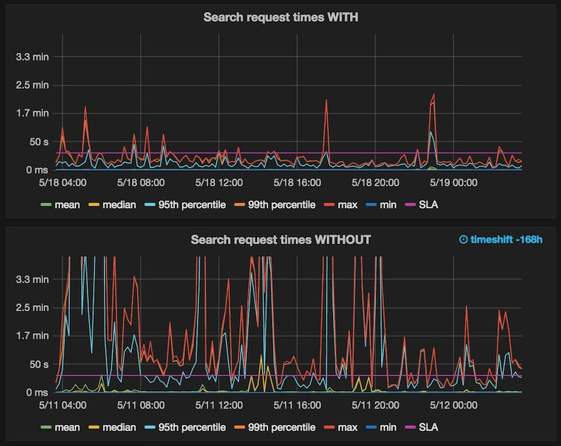

---
> **ARTS-week-09**
> 2023-02-26 09:18
---


## ARTS-2019 左耳听风社群活动--每周完成一个 ARTS
1.Algorithm： 每周至少做一个 leetcode 的算法题
2.Review: 阅读并点评至少一篇英文技术文章
3.Tip: 学习至少一个技术技巧
4.Share: 分享一篇有观点和思考的技术文章

### 1.Algorithm:

- [1140. 石子游戏 II](https://leetcode.cn/submissions/detail/404803390/)  
    + 思路：DFS
- [1238. 循环码排列](https://leetcode.cn/submissions/detail/405195938/)  
    + 思路：格雷编码
- [1247. 交换字符使得字符串相同](https://leetcode.cn/submissions/detail/405950900/)  
    + 思路：模拟

### 2.Review:

[运行 400+ 节点 Elasticsearch 集群](https://underthehood.meltwater.com/blog/2018/02/06/running-a-400+-node-es-cluster/)

鉴于 Meltwater 每天必须处理数百万个帖子，我们需要一种可以处理这种数量的搜索和存储技术。

自 0.11.X 时代以来，我们一直是 Elasticsearch 的非常快乐的用户。虽然我们经历了一些起起落落，但最终我们认为我们对技术的选择是正确的。

Elasticsearch 用于支持我们的主要媒体监控应用程序，客户可以在其中搜索和分析媒体数据，例如新闻文章，（公共）Facebook 帖子，Instagram 帖子，博客和推文。我们使用混合的 API 和爬网来收集这些内容，丰富它们并使用 Elasticsearch 使它们可搜索。

在这篇文章中，我们分享了我们学到的东西，如何调整Elasticsearch以提高其性能，以及要规避哪些陷阱。

如果想了解更多关于我们前面提到的 Elasticsearch 的起伏，请参阅我们之前关于一些numad 问题和批量渗滤器的文章。

#### 1、数量，数量

每天都有相当多的新闻文章和推文产生。在繁忙的日子里，我们索引了大约 300 万篇社论文章和近 1 亿条社交帖子。我们将编辑数据永久保留（追溯到 2009 年）和社交数据 15 个月。我们目前的磁盘使用量约为主磁盘 200 TB，副本约为 600 TB。

我们每分钟收到大约 3k 个请求。所有请求都通过一个服务，创造性地命名为“搜索服务”，该服务又完成与Elasticsearch集群的所有通信。我们的大多数搜索都是复杂的规则，用于控制面板和新闻提要中包含的内容。例如，客户可能对 Tesla 和 Elon Musk 感兴趣，但选择排除与 SpaceX 或 PayPal 有关的所有内容。我们允许用户使用接近 Lucene 查询语法的灵活语法，例如：

```
Tesla AND "Elon Musk" NOT (SpaceX OR PayPal)
```

我们最长的此类查询是 60+ 页长。关键是：在每分钟的3k请求中，没有一个是在谷歌中输入的简单的 “Barack Obama” 查询。它们是可怕的野兽，我们的 ES 节点必须努力找出匹配的文档集。


#### 2、版本
我们运行一个基于 1.7.6 的自定义 Elasticsearch 版本。与库存 1.7.6 版本的唯一区别是，我们使用向后移植版本的 Roaring Bitmaps 算法进行缓存。它从 Lucene 5 向后移植到 Lucene 4，后者支持 ES 1.x。在 Elasticsearch 1.X 中用于缓存的默认 bitset 对于稀疏结果来说非常昂贵，但在 Elasticsearch 2.X 中已经得到了改进。

为什么我们不使用更新版本的 Elasticsearch？主要原因是升级很难。主要版本之间的滚动升级只是从 ES 5 到 6 的事情（从 2 升级到 5 应该支持滚动升级，但这并没有发生）。因此，我们只能通过完全重新启动集群来升级集群。停机时间对我们来说很难，但我们可能会处理重新启动应该导致的估计 30-60 分钟的停机时间。真正可怕的部分是，如果出现问题，则没有真正的回滚过程。

到目前为止，我们已选择不升级群集。我们愿意，但到目前为止，还有更紧迫的任务。我们实际如何执行升级尚未确定，但可能是我们选择创建另一个集群而不是升级当前集群。

#### 3、节点设置
自 2017 年 6 月起，我们在 AWS 上运行主集群，对数据节点使用 i3.2xlarge 实例。我们过去常常在 COLO（托管数据中心）中运行集群，但迁移到 AWS 云以缩短新机器的交付周期，使我们能够更灵活地扩展和缩减。

我们在不同的可用区中运行三个专用主节点，保留为 2 个。这是避免裂脑问题的相当常见的模式。

我们的数据集所需的磁盘，80% 的容量和 3+ 个副本，使我们大约有 430 个数据节点。最初，我们打算使用不同的数据层，较旧的数据位于较慢的磁盘上，但由于我们只有相对较少的超过 15 个月的数据量（只有编辑数据，因为我们删除了较旧的社交数据），这没有意义。每月的硬件成本远远超过在 COLO 中运行，但云允许我们在大约零时间内将集群大小翻倍。

可能会问，为什么我们决定管理自己的 ES 群集。我们考虑过托管解决方案，但我们决定选择我们自己的设置，原因如下：AWS Elasticsearch Service 允许我们的控制太少，而 Elastic Cloud 的成本是直接在 EC2 上运行的成本的 2-3 倍。

为了保护自己免受可用区出现故障的影响，节点分布在 eu-west-1 中的所有 3 个可用区中。我们正在使用 AWS 插件进行配置。它提供了一个名为的节点属性。我们开始了。这可确保 ES 优先将副本放置在不同的可用区中，并使查询路由首选同一可用区中的节点。aws_availability_zonecluster.routing.allocation.awareness.attributesaws_availability_zone

这些实例运行 Amazon Linux，临时驱动器安装在 ext4 中。这些实例具有 ~64 GB 的 RAM。我们为 ES 节点提供 26 GB 的堆，其余的用于磁盘缓存。为什么是 26 GB？因为JVM是建立在黑魔法之上的。

我们使用 Terraform 和自动缩放组来配置实例，并使用 Puppet 来设置实例上的所有内容。

#### 4、指数结构
由于我们的数据和搜索都是基于日期的，因此我们使用基于时间的索引，类似于 ELK（elasticsearch，logstash，kibana）堆栈。我们还将不同类型的数据保存在不同的索引中，以便例如编辑文档和社会文档最终出现在不同的每日索引中。这允许我们在一段时间后仅删除社交索引，并添加一些查询优化。每个每日索引运行，每个索引有两个分片。

此设置会导致大量分片（接近 40k）。由于存在如此多的分片和节点，集群操作有时会具有特殊性质。例如，删除索引似乎受到主节点将集群状态推送到所有节点的能力的瓶颈。我们的集群状态约为 100 MB，但使用 TCP 压缩可以减少到 3MB（可以从以下API获取自己的集群状态）。主服务器仍需要为每个集群更改推送 1.3 GB（430 个注释 * 3 MB 状态大小）。在这 1.3 GB 中，大约 860 MB 必须在可用区之间传输（即基本上通过互联网）。这需要时间，尤其是当想要删除几百个索引时。我们希望较新版本的 Elasticsearch 能够使其变得更好，主要是来自仅发送集群差异的 ES 2.0 功能。

获取自己的集群状态API：
```
curl localhost：9200/_cluster/state/_all 
```

#### 5、性能
如前所述，我们的 ES 集群需要处理一些非常复杂的查询，以满足客户的搜索需求。

为了处理查询负载，我们在过去几年中在性能领域做了大量工作。我们必须了解我们对 ES 集群性能测试的公平份额，从下面的引文中可以明显看出。

```
可悲的是，随着集群出现故障，只有不到三分之一的查询成功完成。我们相信测试本身导致集群出现故障。
摘自我们新的 ES 群集平台上的第一个性能测试，其中包含实际查询
```

为了控制查询的执行方式，我们构建了一个插件，它公开了一组自定义查询类型。我们使用这些查询类型来提供 Elasticsearch 中没有的功能和性能优化。例如，我们在短语中实现了通配符，并支持在 SpanNear 查询中执行。我们将 "\*" 优化为 "全部匹配" 查询。还有很多其他的事情。

Elasticsearch 和 Lucene 的性能高度依赖于的查询和数据。没有灵丹妙药。话虽如此，这里有一些提示，从基本到更高级：

 - 将搜索限制为仅相关数据。例如，在每日索引中，仅在相关日期范围内进行搜索。对于范围搜索中间的索引，请勿应用范围查询/筛选器。
 - 如果使用通配符，请避免使用前导通配符 - 除非可以对术语进行反向索引。双端通配符很难优化。
 - 了解资源消耗的迹象。数据节点是否始终处于高 CPU 状态？高 IO 等待？查看 GC 统计数据。它们可从探查器或通过 JMX 代理获得 如果在ParNewGC上花费的时间超过15%，那就去寻找内存占用者。如果有任何串行GC暂停，那么确实存在问题。不知道我在说什么？不用担心，这一系列的博客文章是一个很好的JVM性能介绍。请记住，ES 和G1 收集器不能很好地配合使用。
 - 如果遇到垃圾回收问题，首选修复程序不应尝试调整 GC 设置。这通常是徒劳的，因为默认值很好。相反，请专注于减少内存分配。有关如何执行此操作，请参见下文。
 - 如果有内存问题，但没有时间修复它们，请考虑查看Azul Zing。这是一个昂贵的产品，但我们看到仅通过使用他们的 JVM 就将吞吐量提高了 2 倍。不过，我们最终没有使用它，因为我们无法证明成本的合理性。
 - 考虑在 Elasticsearch 之外和 Lucene 级别使用缓存。在 Elasticsearch 1.X 中，可以使用过滤器来控制缓存。在更高版本中，这似乎更难，但实现自己的缓存查询类型是合理的。在进入 2.X 时，我们可能会做类似的事情。
 - 查看是否有热点（例如，一个节点获得所有负载）。可以尝试通过使用分片分配筛选或尝试使用集群重新路由在自己周围移动分片来分散负载。我们已经使用线性优化自动重新路由，但可以通过更简单的自动化获得长篇大路。
 - 设置一个测试环境（我更喜欢我的笔记本电脑），可以在其中从生产中加载具有代表性的数据量（最好至少一个分片）。使用从生产中获取的查询（硬）推送它。使用本地设置来试验请求的资源消耗。
 - 结合上述要点，在 Elasticsearch 进程上使用分析器。这是此列表中最重要的提示。我们通过Java Mission Control和VisualVM使用Flight Recorder。那些试图推测（包括付费顾问/支持）绩效的人是在浪费他们（和的）时间。询问JVM什么消耗时间和内存，然后去探索Elasticsearch/Lucene源代码，找出运行代码或分配内存的内容。
 - 一旦了解了请求的哪个部分导致速度缓慢，就可以尝试通过更改请求来优化（例如，更改术语聚合的执行提示或切换查询类型）。更改查询类型或查询顺序可能会产生巨大影响。如果这对没有帮助，可以尝试优化 ES/Lucene 代码。这可能看起来很疯狂，但导致 CPU 使用率降低了 3-4 倍，内存使用量减少了 4-8 倍。我们的一些更改是微不足道的（例如索引查询），而其他更改则需要我们完全重写查询执行。生成的代码主要面向我们的查询模式，因此其他人可能会也可能不会使用。因此，到目前为止，我们还没有将其开源。然而，它可能是另一篇博客文章的材料。



图表描述：我们的响应时间。有/没有更改，我们重写了 Lucene 的查询执行。这也意味着我们不再有节点每天多次内存不足。

注意一下，因为我知道问题会来：从以前的性能测试来看，我们期望升级到 ES 2.X 会有一些小的性能改进，但没有什么改变游戏规则。话虽如此，如果已将 ES 1.X 集群迁移到 ES 2.X，我们很乐意听听对迁移的实际体验。

如果已经读到这里，真的很喜欢Elasticsearch（或者至少，真的需要它）。我们很想知道的经历，以及可以与我们分享的任何技巧。请在下面的评论中分享的反馈和问题。

### 3.Tip:

#### How to create integer UUID in java

```
long hi = id.getMostSignificantBits();
long lo = id.getLeastSignificantBits();
byte[] bytes = ByteBuffer.allocate(16).putLong(hi).putLong(lo).array();
BigInteger big = new BigInteger(bytes);
String numericUuid = big.toString().replace('-','1'); // just in case
```

### 4.Share:

[聊聊 Elasticsearch 的倒排索引](https://zhuanlan.zhihu.com/p/76485252)  

[教编译调试Elasticsearch 6.3.2源码](https://juejin.cn/post/6844903663807234061)

[在windows和linux下配置运行lp_solve的Java开发环境](https://zhuanlan.zhihu.com/p/31461518)