---
> **ARTS-week-10**
> 2023-03-04 07:58
---


## ARTS-2019 左耳听风社群活动--每周完成一个 ARTS
1.Algorithm： 每周至少做一个 leetcode 的算法题
2.Review: 阅读并点评至少一篇英文技术文章
3.Tip: 学习至少一个技术技巧
4.Share: 分享一篇有观点和思考的技术文章

### 1.Algorithm:

- [1144. 递减元素使数组呈锯齿状](https://leetcode.cn/submissions/detail/406602338/)  
    + 思路：锯齿数组
- [面试题 05.02. 二进制数转字符串](https://leetcode.cn/submissions/detail/407925604/)  
    + 思路：乘2取整法
- [1487. 保证文件名唯一](https://leetcode.cn/submissions/detail/408355346/)  
    + 思路：哈希

### 2.Review:

[我们如何在不停机的情况下升级旧的 3PB 大型 Elasticsearch 集群。第 1 部分 - 简介](https://underthehood.meltwater.com/blog/2022/11/11/how-we-upgraded-an-old-3pb-large-elasticsearch-cluster-without-downtime-part-1-introduction/)

早在 2018 年，也就是五年前，我们发布了一篇博客文章，描述了我们的 400+ 节点 Elasticsearch 集群。在那篇文章中，我们提出了一个重要的话题：

```
到目前为止，我们已选择不升级群集。我们愿意，但到目前为止，还有更紧迫的任务。我们实际如何执行升级尚未确定，但可能是我们选择创建另一个集群而不是升级当前集群。
```

好吧，升级的日子终于到来了。

几周前，我们完成了终止旧的 1100 个节点的大型 Elasticsearch 集群及其周围基础设施的最后步骤。当时，所有依赖的应用程序都已经路由到我们新的 Elasticsearch 集群，该集群将取代它。这意味着关闭本身对我们的用户来说不是一件大事，但对于我们团队来说，这是一个重要的里程碑，也是一个成功的多年项目的有价值的结局。

我们决定写这个博客文章系列来分享我们所做的学习，并描述我们遇到的一些挑战以及我们如何克服这些挑战。

这篇博文描述了项目概述、旧集群面临的挑战以及我们运营的限制。本系列中的其他帖子将深入探讨其他有趣的主题。我们计划在圣诞节前至少每周发布一篇新帖子，时间表大致如下:
- 第 2 部分 - 两个一致的集群
- 第 3 部分 - 搜索性能和通配符
- 第 4 部分 - 所有语言的高召回率的标记化
- 第 5 部分 - 在同一 JVM 中运行两个 Elasticsearch 客户端
- 第 6 部分 - 测试和推出策略
- 第 7 部分 - 最终架构与学习
因此，请继续关注更多内容。

#### 1、背景和用例

如之前的博客文章所述，我们 Meltwater 是 Elasticsearch 开源搜索引擎的用户。我们用它来存储来自能想象到的所有新闻来源的大约 4000 亿篇社交媒体帖子和社论文章。然后，该平台为我们的客户提供搜索结果、图形、分析、数据集导出和高级见解。

直到上个月，这个庞大的数据集还托管在 Elasticsearch 的自定义分叉和内部维护版本上。该集群包含近 1100 个在 AWS 中运行的 i3en.3xlarge 节点。集群有数千个索引，近 100，000 个分片和接近 1PB 的主数据，副本达到 3PB 以上。

今天，升级后，数据集实际上要大一些，3.5PB（原因我们将在后面的博客文章中解释），节点总数现在“只有”320（主要是i3en.6xlarge实例）。也许最重要的是，我们现在运行官方支持的Elasticsearch版本。

#### 2、升级原因
对于旧版本的 Elasticsearch，Elastic 和 Amazon 建议不要运行超过 100 个节点的集群。但正如现在可能已经收集到的那样，我们多年前就超过了这个限制。我们不断修补和改进我们的自定义版本，以继续为我们的业务增长和不断扩展的用例提供服务。

但是，随着集群的发展，我们最终开始感受到运行这样一个旧版本的局限性。例如，我们使用的版本不能很好地处理集群状态的增量更新。Elasticsearch 将整个状态（在我们的例子中为 >100mb 大）发送到我们 1100 个节点中的每一个节点，对于每一个状态更改。这意味着一个重大瓶颈是主节点上的 100 GB 网络带宽。

运行旧Elasticsearch版本的其他一些麻烦领域是：
- 节点和分片离开/加入集群时的不可预测行为
- S3 备份处理
  - 由于旧版本的 Elasticsearch 处理 S3 类型存储库的效率低下，我们无法足够快地删除旧备份以跟上新数据的流入。因此，我们的备份规模不断增长。

  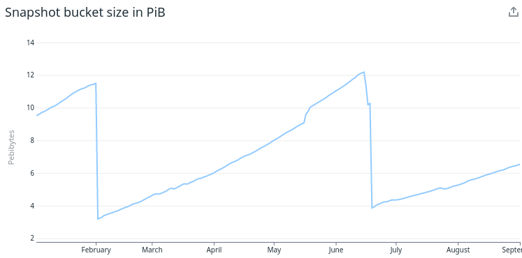
  
  - 我们必须定期切换 S3 存储桶，并每年从零开始几次新快照，以将存储成本保持在可接受的水平。
- 堆使用量激增，断路器和安全网不足（或缺乏）
  - 我们有很多情况，一个写得不好的用户查询被允许执行并分配太多内存，并导致节点进入 gc 地狱并崩溃。
  - GC 地狱意味着节点将所有时间和 CPU 都花在垃圾回收上，没有时间做其他有用的工作，例如响应集群 ping 或执行搜索。进入此阶段的节点会减慢整个集群的速度，因为主节点和所有其他节点在 gc 地狱中对节点的请求超时。
  
  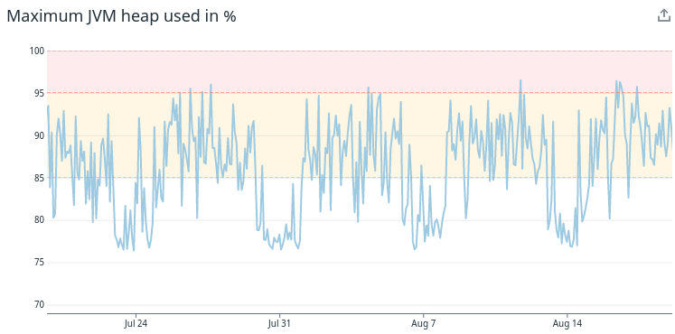
  
  - 更不用说即使节点在“正常”模式下运行，堆的使用看起来也非常尖锐和不可预测。
- 太多的段数据存储在堆上
  - 我们仅对分段数据使用了 >10TiB 的 RAM，约占整个集群中可用 Java 堆总量的 40%。Java 堆（不是磁盘或 CPU）是我们整个集群的主要扩展指标
- 无法使用较新版本的 Java 和更现代的垃圾回收实现。
  - 这迫使我们每个节点使用的 Java 堆不超过 30GB，即使操作系统可能有几 100 GB 的可用 RAM。
  - 反过来，这迫使我们横向扩展（=更多机器）而不是向上扩展（=更强大的机器），这并不总是最佳选择。

上述所有问题，以及更多问题，我们相信如果我们升级到更高版本的 Elasticsearch，将会得到改进。

最后但并非最不重要的一点是，我们也知道融水将继续增长。我们知道，未来我们将持续需要支持更多的数据、更多的用户和更多的用例，我们觉得我们正在接近当前 Elasticsearch 版本的集群大小的硬性限制。

因此，该组织最终决定是时候投资一个为期多年的项目来升级我们的 Elasticsearch 集群了。

#### 3、我们降落在哪里？
如前所述，我们将分享更多关于我们如何进行迁移的信息，但我们想首先让先睹为快，了解升级最终给我们带来的好处，最好用一些数字来解释。

在下面的所有图中，浅蓝色=旧集群，深蓝色=新集群。

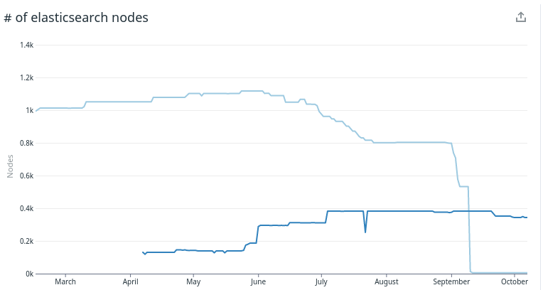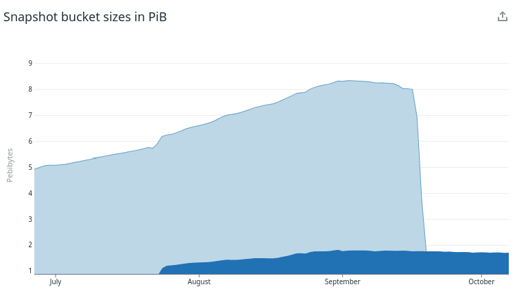

左图显示我们能够使用 ~320 个节点而不是 >1100 个节点运行。它还显示了我们使用两个并行集群运行了多长时间，以及随着越来越多的数据和搜索从旧系统转移到新系统，我们可以逐步扩展/缩减。

右图显示，快照大小的不受控制的增长确实在新的 elasticsearch 版本中得到了修复，我们现在可以降低备份成本。

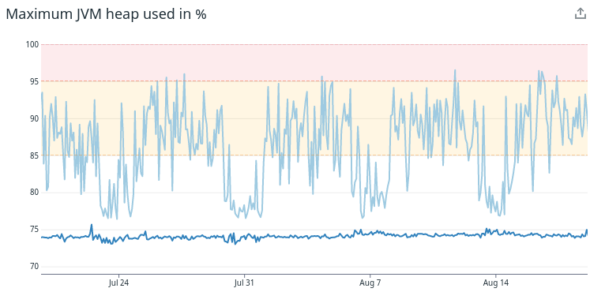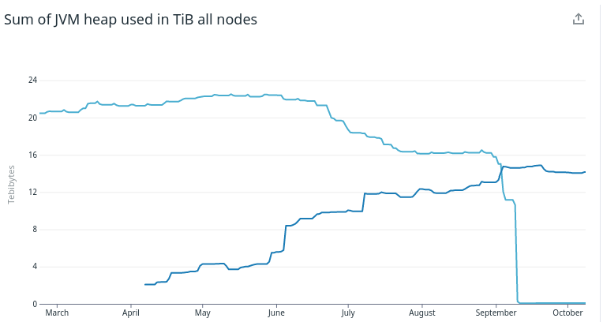

这两个图显示了在堆使用模式中所做的改进。左图显示新集群的堆使用率基本持平。右图显示，堆使用量的总和现在也更低（14 TiB与22 TiB），即使这本身并不是目标。

从上图中我们还可以看到，在迁移完成后，我们已经能够进一步优化和缩减新集群。这在旧版本中是不可能的，由于数据集的不断增长，我们总是不得不扩大规模。

但是，我们不要比这更进一步。这篇博文系列同样是关于我们如何以及为什么做事，而不仅仅是关于我们最终获得的东西。

所以，回到关于迁移的故事。

#### 4、滚动升级要求
Meltwater 是一家全球性公司，这意味着我们的系统需要每周7天，每天24小时运行和可用。

虽然我们可以安排偶尔的停机时间来维护系统的某些部分，但关闭为 Meltwater 的所有搜索和分析功能提供动力的引擎根本不是一种选择。因此，任何没有安全回滚策略的推出策略都是不可接受的。

鉴于此限制，我们唯一的选择是规划一条升级路径，使我们的客户、我们的支持组织以及我们在公司拥有的所有其他 30+ 开发团队看不到该流程。

此外，我们还需要进行增量部署，我们可以在新旧系统之间来回切换单个查询/用户/应用程序。

简而言之，我们必须为整个系统设计一个渐进的、可逆的、无停机的部署。

请继续关注本系列的下一部分，以了解我们如何通过使用并行运行的两个 Elasticsearch 集群来解决这些需求，以提供相同的数据。

### 3.Tip:

#### IDEA MyBatis Plugins 插件自动生成实体类和mapper.xml

1.IDEA 下载 MyBatis Generator 插件

2.修改 maven 的 pom 文件 （注意此处是以 plugin 的方式，要放在 plugins /plugins 里面）
```
 <plugins>
            <!-- mybatis generator 自动生成代码插件 -->
            <plugin>
                <groupId>org.mybatis.generator</groupId>
                <artifactId>mybatis-generator-maven-plugin</artifactId>
                <version>1.3.5</version>
                <configuration>
                    <!--配置文件的位置-->
                    <configurationFile>src/main/resources/generatorConfig.xml</configurationFile>
                    <overwrite>true</overwrite>
                    <verbose>true</verbose>
                </configuration>
            </plugin>
  </plugins>
```
3.Resource 目录下新建一个 generatorConfig.xml
放入下方代码，报错的话请往下看
```
<?xml version="1.0" encoding="UTF-8"?>
<!DOCTYPE generatorConfiguration
        PUBLIC "-//mybatis.org//DTD MyBatis Generator Configuration 1.0//EN"
        "http://mybatis.org/dtd/mybatis-generator-config_1_0.dtd">
<generatorConfiguration>
    <!-- 数据库驱动:选择的本地硬盘上面的数据库驱动包-->
    <classPathEntry  location="G:\lianjieshujukuqudonglib\mysql-connector-java-5.1.45-bin.jar"/>
    <context id="DB2Tables"  targetRuntime="MyBatis3">
        <commentGenerator>
            <property name="suppressDate" value="true"/>
            <!-- 是否去除自动生成的注释 true：是 ： false:否 -->
            <property name="suppressAllComments" value="true"/>
        </commentGenerator>
        <!--数据库链接URL，用户名、密码 -->
        <jdbcConnection driverClass="com.mysql.jdbc.Driver" connectionURL="jdbc:mysql://127.0.0.1/xx" userId="root" password="root">
        </jdbcConnection>
        <javaTypeResolver>
            <property name="forceBigDecimals" value="false"/>
        </javaTypeResolver>
        <!-- 生成模型的包名和位置-->
        <javaModelGenerator targetPackage="com.cn.wjp.springboot.entity" targetProject="src/main/java">
            <property name="enableSubPackages" value="true"/>
            <property name="trimStrings" value="true"/>
        </javaModelGenerator>
        <!-- 生成映射文件的包名和位置-->
        <sqlMapGenerator targetPackage="main.resources.mapping" targetProject="src">
            <!-- enableSubPackages:是否让schema作为包的后缀 -->
            <property name="enableSubPackages" value="false" />
        </sqlMapGenerator>
        <!-- 生成DAO的包名和位置-->
        <javaClientGenerator type="XMLMAPPER" targetPackage="com.cn.wjp.springboot.dao" targetProject="src/main/java">
            <property name="enableSubPackages" value="true"/>
        </javaClientGenerator>
        <!-- 要生成的表 tableName是数据库中的表名或视图名 domainObjectName是实体类名-->
        <table tableName="sc"
               domainObjectName="sc"
               enableCountByExample="false"
               enableUpdateByExample="false"
               enableDeleteByExample="false"
               enableSelectByExample="false"
               selectByExampleQueryId="false">
        </table>
    </context>
</generatorConfiguration>
```

4.generatorConfig.xml 中的注意事项
- xmlns 报红报错解决办法如下
file–>settings…–>languages & frameworks–>Schemas and DTDs–>点击右边的加号
那个 xmlns 报红就添加那个URl

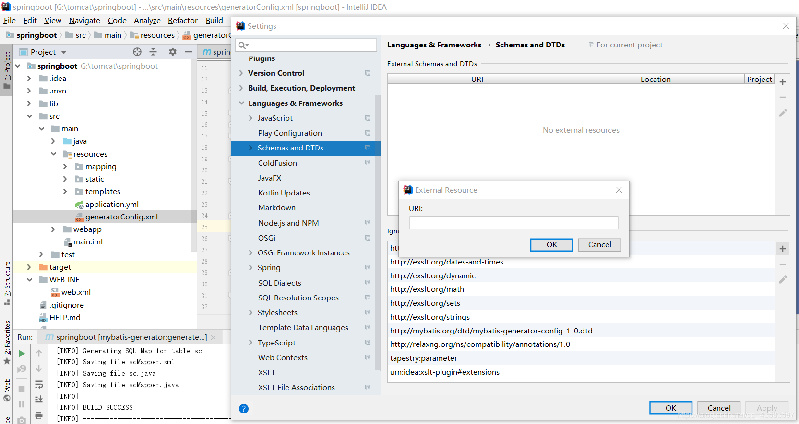

- 数据库驱动:选择的本地硬盘上面的数据库驱动包

- 配置文件中需要修改的地方

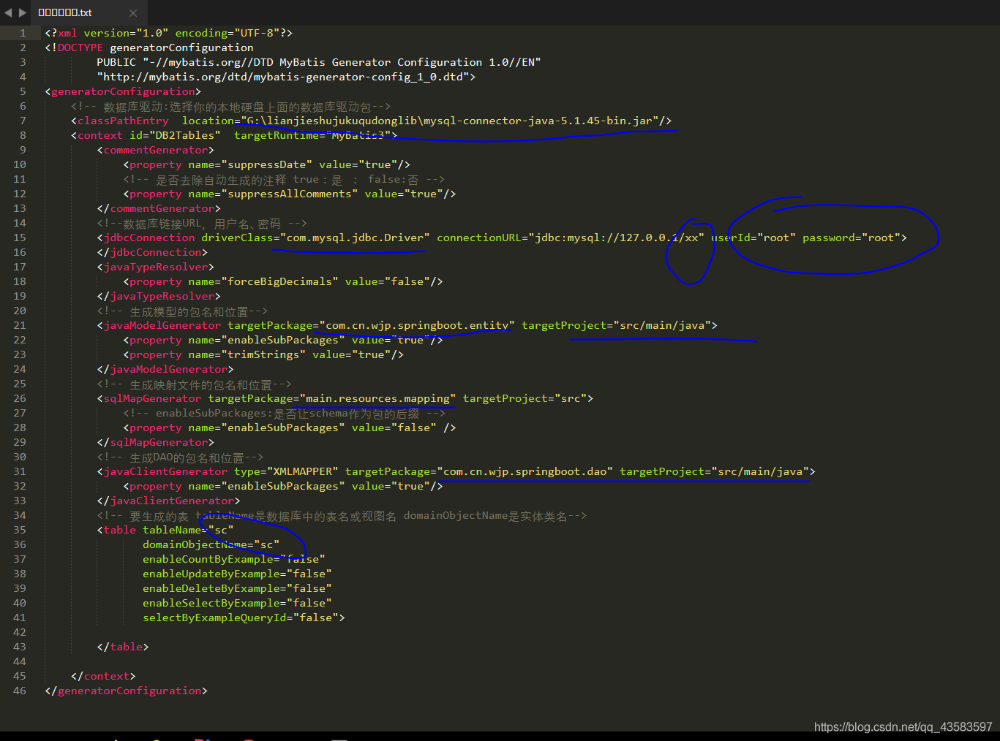

5.运行

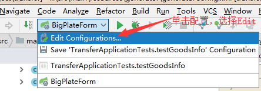

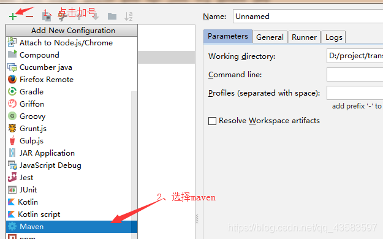

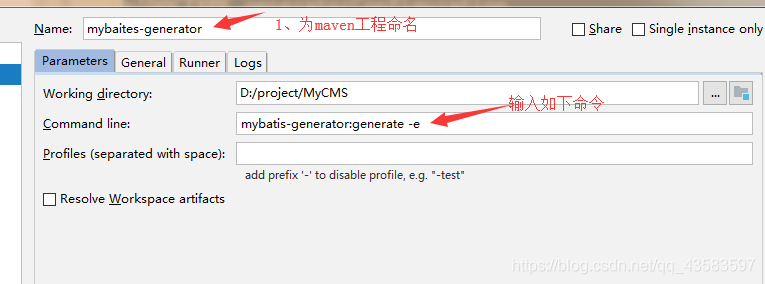

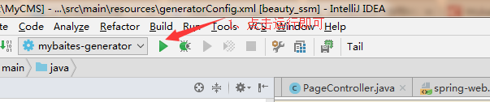


### 4.Share:

[Swagger笔记之Swagger注解](https://juejin.cn/post/7038473995640897543)  

[markdown 图片并排显示](https://blog.csdn.net/qq_21808961/article/details/80666589)

[ElasticSearch-7.8.0 源码编译调试 (详细)](https://zhuanlan.zhihu.com/p/188725714)

[使用IDEA调试ES（Elasticsearch）源码教程](https://cloud.tencent.com/developer/article/1380332)

[StoneDB 2.0 调研：架构解析内存引擎详细设计](https://blog.csdn.net/qq_35423190/article/details/127022236)