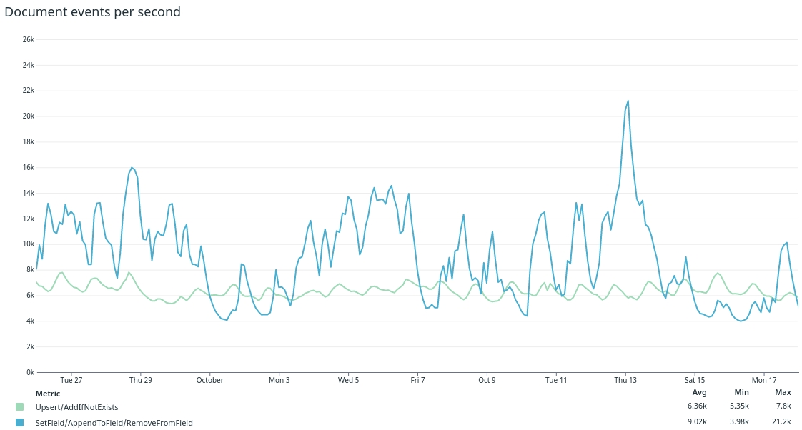
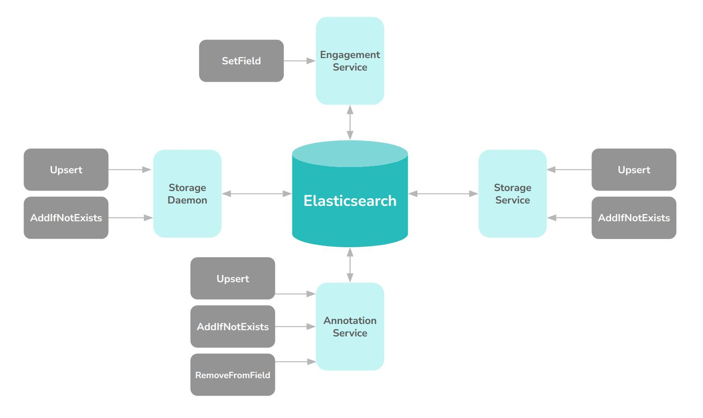
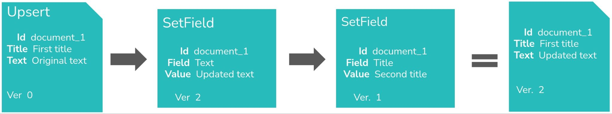
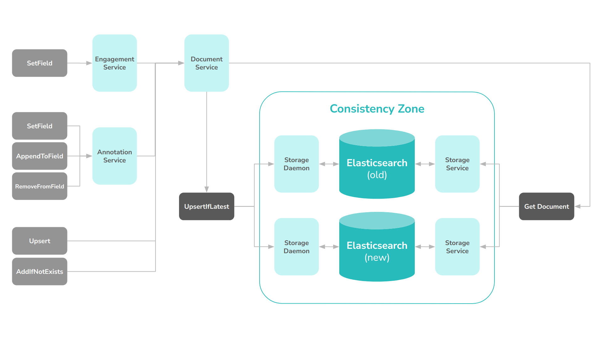

---
> **ARTS-week-11**
> 2023-03-10 20:16
---


## ARTS-2019 左耳听风社群活动--每周完成一个 ARTS
1.Algorithm: 每周至少做一个 leetcode 的算法题
2.Review: 阅读并点评至少一篇英文技术文章
3.Tip: 学习至少一个技术技巧
4.Share: 分享一篇有观点和思考的技术文章

### 1.Algorithm:

- [1653. 使字符串平衡的最少删除次数](https://leetcode.cn/submissions/detail/409517350/)  
    + 思路：前后缀
- [剑指 Offer 47. 礼物的最大价值](https://leetcode.cn/submissions/detail/410430802/)  
    + 思路：回溯
- [1590. 使数组和能被 P 整除](https://leetcode.cn/submissions/detail/411354850/)  
    + 思路：哈希

### 2.Review:

[我们如何在不停机的情况下升级旧的 3PB 大型 Elasticsearch 集群。第 2 部分 - 两个一致的集群](https://underthehood.meltwater.com/blog/2022/11/18/how-we-upgraded-an-old-3pb-large-elasticsearch-cluster-without-downtime-part-2-two-consistent-clusters/)

这是我们关于如何在不停机和最小用户影响的情况下升级 Elasticsearch 集群系列的第2 部分。

如第 1 部分所述，我们的要求是既要在系统的两个不同版本之间提供平稳过渡，又要保持回滚的机会。

考虑到这一点，很明显，从一开始，我们必须并行运行两个 Elasticsearch 集群，然后管理它们之间的无缝过渡。这篇博文将介绍我们如何解决该问题的索引一致性和数据迁移部分。

#### 1、一切都在改变

与典型的日志摄取 Elasticsearch 集群相比，我们系统的要求非常不寻常，因为在我们的系统中没有数据是不可变的。任何索引中的任何文档都可能随时收到更新。这意味着我们必须非常小心，不要丢失任何更新，并始终以正确的顺序应用它们。

我们的集群每秒接收 5000 个新文档和 10000 多个更新，而集群又包含超过 4000 亿个文档和 3.5PB 的数据（包括副本）。

管理所有这些数据非常困难，即使只运行一个集群也是如此。幸运的是，Elasticsearch 提供了内置的乐观锁定功能，我们已经在很大程度上使用了这些功能。在升级项目开始之前，我们在一致性方面没有任何重大问题，至少我们当时知道。

#### 2、更新用例
我们系统中的文档会出于多种不同的原因收到更新。三个常见示例是由于新的参与事件（即对社交帖子的点赞或评论），或由于客户对文档的特定注释（即附加到文档的标签或评论）或由于合规性原因（我们必须根据内容提供商的某些规则隐藏和/或删除内容）。



图1.~3 周内的典型指数交易量模式

为了适应所有这些，我们的系统支持对文档和字段的四种基本操作。所有操作都应用于给定的文档 ID，并且 ID 保证在整个集群中是唯一的。

- Upsert
  - 添加新文档或完全替换现有文档（如果已存在）
  - 请注意，删除也建模为更新插入。删除只是作为 Upsert 实现，该 Upsert 编写一个“空”逻辑删除文档替换现有文档。 
- AddIfNotExists
  - 添加新文档（如果尚不存在）。否则，保留现有的并静默地删除这个新的。
- SetField
  - 替换文档中一个字段的值，保持其他字段不变。如果文档不存在，则抛出错误。
- AppendToField / RemoveFromField
  - 对于数组字段，我们还支持字段级别的追加/删除功能。这是一项方便的功能，如果正在使用值集，则比 SetField 操作更易于使用。在所有其他方面，这些操作的语义类似于 SetField。

在升级之前，所有这些操作都是通过从 Elasticsearch 获取现有文档，对其进行修改，然后将修改后的文档写回 Elasticsearch 来应用的。这些操作的同步和版本控制在 Elasticsearch 中处理。只要我们遵循乐观锁定的规则，我们或多或少可以防止数据丢失和/或其他不可预测的行为。但正如预期的那样，一旦我们引入第二个集群，所有这些都会崩溃。



图2.实现这四个操作的服务概述

#### 3、添加另一个集群
通过在架构中引入第二个集群，突然出现了一大类新问题。如果我们更新失败，或者更糟糕的是，忘记了更新，它可能会对我们的客户产生立竿见影的影响。

我们迁移的目标是能够在客户不注意的情况下在不同集群之间来回路由搜索请求。这意味着我们必须确保所有收到的文档操作都以相同的有效顺序应用于两个集群。如果任何操作在一个集群中丢失，则会导致非常混乱的用户体验，当用户请求路由到该集群时，用户添加的标签将“消失”。对于我们的体积，发生概率很小的错误条件（例如每百万分之一）仍将在系统中的某个地方每小时发生一次。

我们还必须解决几乎同时在同一文档上应用两个操作的常见情况。例如，一个 Upsert 紧跟一个 SetField。在这种情况下，如果我们不小心，我们实际上可能会完全丢失数据。如果我们在两个集群中以不同的顺序应用这两个操作，它们最终将得到不同的结果。



图3.更新以不正确的顺序到达，导致版本1的更新在最终结果中丢失

我们需要确保最终两个集群收敛到任何操作序列的相同最终结果，即使它们以不同的顺序应用于不同的集群。

我们知道我们正面临挑战。

#### 4、一致性架构
我们首先意识到的是，我们首先需要限制可以直接访问 Elasticsearch 的组件数量。当前状态会使迁移到新集群过于复杂，需要太多的协调才能同时切换所有内容。我们确定了两个这样的组件，一个用于大容量批处理流数据，另一个用于 REST API。

我们必须做的最重要的更改是将版本控制移出 Elasticsearch，因为很难确保每个单独的更新始终以相同的顺序在两个集群中应用。为此，我们还决定停止支持与 Elasticsearch 对话的组件中描述的所有操作，而只是实现两个“低级”操作，即:

- 获取文档
  - 通过 documentId 获取文档及其版本号
    - 此处返回的版本需要提供给 UpsertIfLatest
- 更新如果最新
  - 如果确定文档版本为最新版本，则对文档执行更新插入
  - 如果版本不晚于现有版本，则引发错误并通知调用方
例如，SetField 高级操作可以像这样实现：

```js
fun SetField(String field, String newValue, String docId) {
  var success = false
  while (!success) {
    val document = GetDocument(docId)
    document[field] = newValue
    document.version = GetNextVersion(document.version)
    success = UpsertIfLatest(docId, document)
  }
}
```

这意味着我们必须引入一个文档服务，该服务使用存储组件来实现高级API（AddIfNotExists/ SetField/ AppendToField/ RemoveFromField）。文档服务创建版本化的更新插入，这些更新插入将复制到与单独群集通信的存储组件。存储组件可以独立决定传入的更新插入是最新版本还是不是每个群集的最新版本。

另一个复杂因素是，两个不同版本的Elasticsearch具有不同的内部版本控制和乐观锁定实现。因此，我们必须在其他两个方案之上发明第三个基于统一序列号的因果一致性版本控制方案。我们在集群“外部”管理的序列号存储在所有文档的许多版本字段中。

话虽如此，我们不会在这里深入探讨更多细节，但总而言之，一个 4 人的团队花了 1 年多的时间仔细并逐步重新构建了我们的整个索引和更新管道，最终导致最终看起来像这样：



图4.在一致性体系结构中实现四个操作的服务概述

#### 5、一致性架构优势
支持两个集群的所有工作不仅仅是升级造成的“必要之恶”。事实证明，它更早地赋予了价值。我们获得的一些额外好处是：
- 改进的自动测试套件和我们对一致性的监控
- 改进了以前有点过于纠缠的多个组件的关注点分离
- 发现并修复了我们在旧集群架构中遇到的一些边缘情况错误。
  - 我们甚至在数据中发现了一些由 Elasticsearch 本身引起的已知一致性错误的证据，这是我们以前没有意识到的。
- 我们支持“双集群架构”，将来可以重复使用。
  - 这可用于群集的未来升级。
  - 出于弹性、数据局部性或延迟原因，我们还可以使用它来在世界其他地方设置另一个集群。

#### 6、集群间数据迁移
在一致的架构设计和实现的同时，我们必须做出的另一个决定是如何将数据从旧的 Elasticsearch 集群复制到新的集群中。

我们考虑了许多不同的选项，从实现可以读取 Elasticsearch 快照并将其写入新集群的新组件，到从远程功能使用索引。最后，我们决定使用扫描和滚动 API导出所有数据 （1PB），然后将压缩批次的 JSON 文件存储在 S3 上。然后，我们让这些 JSON 文档从头到尾通过正常的引入管道。

这使我们能够不仅复制数据，而且同时改进数据。我们可以通过添加自索引以来引入的字段来删除考虑旧数据的自定义代码。这为新集群带来了一个更一致、更精简、更易于理解的信息模型，这本身就是一个很大的改进。

我们估计我们可以以 ~50，000 个文档/秒的速度运行导出、重新处理和重新索引管道。这意味着整个回填（4000 亿个文档）将持续至少 3 个月，假设我们可以不间断地保持它。

由于数据复制需要很长时间，我们还决定要构建系统的其余部分，以便我们可以利用新系统中逐渐可用的“部分”数据。这将避免最后的大爆炸开关。这个决定进一步影响了我们的计划和设计，最终证明是非常有价值的，但在后来的博客文章中会详细介绍。


图5两个月内回填速度概述

迁移期间的峰值索引吞吐量为130，000 个文档/秒。但如上面的图 5所示，由于各种原因，我们无法长时间保持该吞吐量。当我们开始在新集群中为大部分最终用户查询提供服务时，我们还必须减慢索引速度，以免对搜索延迟产生不必要的影响。

我们还可以提到，我们对平均吞吐量的估计非常准确。从开始索引到新群集拥有所有数据，整个推出需要 ~110 天。

### 3.Tip:

#### Gradle 依赖

Gradle 依赖分别为直接依赖，项目依赖，本地 jar arr 依赖，传递依赖

直接依赖：在项目中直接导入的依赖，就是直接依赖
```
dependencies {
    implementation 'androidx.constraintlayout:constraintlayout:1.1.3'
}
```
传递依赖：A项目依赖了 okhttp,而 okhttp 依赖了 okio，最后A项目也就依赖了 okio，也就是说依赖是有传递性的

本地 Libary 模块依赖
```
implementation project(':mylibary')
```
这种依赖方式是直接依赖本工程中的 libary module，这个 libary module 需要在 setting.gradle 中配置

本地二进制的依赖
这个主要包括本地 jar 文件依赖，aar 文件依赖和本地 so 文件依赖
- 本地 jar 文件依赖，一般包括这俩种形式
```
//直接依赖某文件
implementation files('libs/foo.jar', 'libs/bar.jar')
//配置某文件夹作为依赖项
implementation fileTree(dir: 'libs', include: ['*.jar'])
```

- 本地 arr 文件依赖,一般包括这俩种形式
```
//依赖单个arr文件
implementation(name: 'facesdk', ext: 'aar')
//依赖某个文件夹中的所有aar文件
implementation fileTree(include: ['*.aar'], dir: 'libs')
```

在使用之前需要设置 arr 文件夹的位置
```
// 声明本地 aar 文件地址
repositories {
    flatDir {
        dirs 'libs'
    }
}
```

so文件依赖

.so文件和.java文件一样，会被Gradle看成本地的代码资源，只需要设置so的资源路径就可以拿到so文件
依赖so文件，一般有俩种形式

使用android插件默认的文件路径存放so文件，这样android会按照默认路径去寻找so，默认路径在/src/main/jniLibs
另一种是我们手动设置so文件路径位置
```
// 设置 .so 资源路径
android{
   sourceSets {
        main {
            jniLibs.srcDirs = ['libs']
        }
    }
}
```

远程依赖

Gradle没有自己的远程仓库，所以要添加远程依赖要声明使用哪个远程仓库，每个Gradle脚本都需要声明仓库，一版情况在在根目录的build.gradle配置子project的仓库

```
allprojects {
    repositories {
        jcenter()

        maven {
            url 'https://maven.google.com/'
            name 'Google'
        }

    }
}
```

然后就可以远程依赖的配置了

```
implementation 'com.example.android:app-magic:12.3'
```

上面是简写法，完整版写法如下：

```
implementation group: 'com.example.android', name: 'app-magic', version: '12.3'
```

group name version 共同定位一个远程仓库，version 最好写一个固定的版本号，以防构建出问题

### 4.Share:

[mysql中模糊查询，在页面中输入%查询全部的问题处理](https://blog.csdn.net/qq_21223653/article/details/107786374)  

[汽车租赁模型的python求解](https://blog.csdn.net/benxiaohai11228/article/details/127773892)

[(210808) Tutorial-线性规划](https://zhuanlan.zhihu.com/p/405776296)

[线性规划模型与R](https://zhuanlan.zhihu.com/p/36288552)