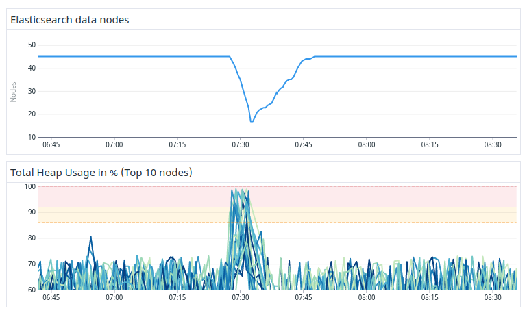

---
> **ARTS-week-12**
> 2023-03-17 20:31
---


## ARTS-2019 左耳听风社群活动--每周完成一个 ARTS
1.Algorithm: 每周至少做一个 leetcode 的算法题
2.Review: 阅读并点评至少一篇英文技术文章
3.Tip: 学习至少一个技术技巧
4.Share: 分享一篇有观点和思考的技术文章

### 1.Algorithm:

- [1615. 最大网络秩](https://leetcode.cn/submissions/detail/413369046/)  
    + 思路：贪心
- [1605. 给定行和列的和求可行矩阵](https://leetcode.cn/submissions/detail/412922089/)  
    + 思路：贪心
- [面试题 17.05.  字母与数字](https://leetcode.cn/submissions/detail/411752615/)  
    + 思路：哈希

### 2.Review:

[我们如何在不停机的情况下升级旧的 3PB 大型 Elasticsearch 集群。第 3 部分 - 搜索性能和通配符](https://underthehood.meltwater.com/blog/2022/11/25/how-we-upgraded-an-old-3pb-large-elasticsearch-cluster-without-downtime-part-3-search-performance-and-wildcards/)

这篇博文将描述我们如何测试新 Elasticsearch 集群的搜索性能，以及我们用来改进它的不同优化。具体来说，我们将重点介绍如何解决用例的主要瓶颈：通配符。

#### 1、Meltwater 搜索

为了更好地理解这篇博文，我们首先需要了解客户如何在我们的平台上搜索。最常见的搜索方法是编写布尔查询，例如：
```
Meltwater AND ((blog NEAR post) OR “search perfor*”)
```

然后将布尔值转换为在集群中执行的 Elasticsearch 查询。我们的布尔语言包括许多不同的查询类型，最常用的是术语、短语、近似、范围搜索和通配符。
我们将通配符分为以下 5 类：
- 前导通配符：\*foo或？oo
- 尾随通配符：bar\*还是ba？
- 双端通配符：\*条形\*
- 中间通配符（单通配符或多通配符）：b？ar\*t\*
- 短语中的通配符："foo* b\*a?"
  - 这是一个自定义的 Meltwater 功能，类似于匹配短语前缀查询，但支持短语中任何位置的通配符

通常，我们的客户创建的布尔查询是巨大的！我们允许搜索最多包含 60.000 个术语和 30.000 个通配符。布尔值也可以长达 750.000 个字符。允许我们的客户制作这些海量查询是Meltwater在我们市场上的优势之一，但它确实给我们的团队和整个Meltwater工程带来了挑战。

为了支持旧集群中的这些大型查询，我们在旧的分叉 Elasticsearch 版本中实现了许多性能优化。如果想阅读有关我们实施的优化的更多信息，可以查看我们的一篇较早的博客文章。

维护 Elasticsearch 的自定义修改是有代价的。它使升级更加困难，并且需要时间和精力来维护。对于新的集群，我们想看看是否可以通过使用原版 Elasticsearch 中现有功能的一些巧妙组合来实现相同的功能和性能。

#### 2、新 Elasticsearch 版本的基线搜索性能

我们从有意识的简单和幼稚的性能测试方法开始。我们让新集群达到了搜索结果通过兼容性测试的程度，它可以处理我们所有的实时索引。一旦有了这个，我们就可以开始比较搜索的性能。

对于旧版本，我们的暂存环境中已经有一个大小适中的集群，我们可以对其进行比较。为了使比较尽可能公平，我们确保在两个集群中使用相同的实例类型和相同数量的数据节点。

然后，我们将生产搜索重播到两个集群，并比较了完成请求所需的时间。最初，我们旧的优化集群比新的优化集群快得多，特别是对于所有通配符查询。我们的一些查询还在新集群中触发了巨大的堆峰值，导致节点停止响应 ping，从而离开集群。

要弄清这些问题，我们花了几个月的专注努力。在以下部分中，我们将介绍我们所做的一些优化，这些优化对新集群的性能产生了重大影响。

#### 3、通配符查询执行

为了完全理解这篇博文的其余部分，我们首先需要说几句关于Lucene（Elasticsearch使用的底层搜索库）如何索引文档，然后对它们执行通配符查询。
假设我们要为以下文档编制索引：

```json
{
  "text": "wildcards wont win"
}
```

在为文档编制索引时，文本字段的所有术语也存储在术语字典中。术语字典本质上是索引中字段中所有唯一术语的集合。例如，如果我们只索引示例文档，我们将有以下术语字典：

```json
[
  "wildcards",
  "wont",
  "win"
]
```

当使用通配符查询搜索文本字段时，Elasticsearch 会将通配符重写为通配符的匹配词。这是通过在术语字典中查找通配符匹配的所有术语来完成的。从匹配的术语中，将创建一个新的 Lucene 布尔查询。注意：这指的是Lucene的BooleanQuery，而不是我们前面提到的Meltwater布尔语言。因此，如果搜索wi*（我们的索引中只有上述文档），那么Elasticsearch会将通配符重写为Lucene布尔值：

```
(wildcards OR win)
```

然后使用重写的 Lucene 布尔值来查找与查询匹配的文档。

#### 4、前导通配符

关于Lucene，另一个需要了解的重要事情是，术语字典擅长查找尾随通配符的匹配术语，例如“elasti*”。原因是术语字典是按字母顺序排序的，允许Lucene快速找到第一个以前缀开头的术语。然后 Lucene 可以迭代下一个项，直到它不再与通配符匹配。

但是，对于前导通配符，很难找到哪些术语与通配符匹配。没有索引结构支持有效搜索以某些字符结尾的术语，例如"\*sticsearch"。在这种情况下，Elasticsearch 必须对术语字典中的每个术语执行正则表达式，以查找与通配符匹配的术语。对于大型指数来说，这要慢几个数量级。Elasticsearch 文档在通配符查询部分也提到了这一点：

```
避免以 * 或 ？ 开头的模式。这可能会增加查找匹配字词所需的迭代次数，并降低搜索性能。
```

幸运的是，还有一种相当简单的方法来优化前导通配符。如果反向索引所有术语，则可以通过先反转通配符查询词，然后在反向字段中搜索，将前导通配符转换为尾随。在现代 Elasticsearch 版本中，可以通过使用使用反向标记过滤器的子字段创建多字段映射来轻松设置此设置。

这种优化的缺点是，对于我们向其添加反向索引的每个字段，它将磁盘使用率增加了两倍。在我们的例子中，我们不需要为所有字段启用此功能。我们的大多数通配符查询仅针对可用字段的一小部分，主要是标题和正文文本字段。经过这种权衡，我们最终只将指数规模总体上增加了约30%。我们以增加的磁盘使用量换取搜索时使用的更少 CPU 和内存，从而提升了性能，这对客户的用例来说得到了很好的回报。

#### 5、通配符重写限制

虽然反向索引优化大大提高了前导通配符的速度，但我们在新集群中仍然存在严重的稳定性问题，其中许多数据节点不时死亡。

通过使用名为 Blunders.io 的工具，我们可以确定大部分堆是在一个名为 SpanBooleanQueryRewriteWithMaxClause 的类中分配的。此代码负责重写跨度接近的通配符，这些通配符用于我们在 Meltwater 中支持的短语内通配符功能的实现。

我们观察到的典型模式是数据节点上出现严重的堆峰值，导致它们内存不足。在它们耗尽内存后，Elasticsearch 进程死亡，主服务器随后将它们踢出集群。图 1 中可以看到一个示例。



这些事件是由两件事共同造成的;我们提出了 INDICES.QUERY.BOOL.max_CLAUSE_COUNT 设置，同时执行了短语中包含大量通配符的搜索。当这些通配符被重写时，Elasticsearch 在执行请求时将所有重写的术语（长OR链）保留在内存中。当一长串术语太大而无法放入堆中时，一些 Elasticsearch 节点会耗尽内存并崩溃。

我们更改的限制控制每个 Lucene 布尔值的大小。当 Elasticsearch 重写通配符时，如果超出限制，它会中止搜索，以防止内存爆炸。在旧集群中，没有这样的限制，这是本系列第一篇文章中解释的一些问题的常见根本原因。

在旧的集群中，我们通过对 Elasticsearch 本身进行更改来解决内存问题的风险。我们添加了特定于域的启发式方法、术语重写缓存，并通过对通配符的惰性计算完全避免了一些通配符重写。所有这些都使得处理大型通配符重写成为可能。最终，我们还实现了我们自己的术语重写限制，类似于更现代的 Elasticsearch 版本的行为方式。但为了不影响太多现有用户，我们使用了100.000 个术语的限制。这比 Elasticsearch 7 使用的默认值 1024 和自动计算的总限制 Elasticsearch 8 使用的总限制要高得多。

鉴于我们在旧集群中的限制，我们保存的 800.000 个客户查询中的许多查询都具有通配符，这些通配符重写为 1024 个以上的术语。因此，在我们让新集群与旧集群兼容的幼稚方法中，我们不得不将默认限制从 1024 提高到 100.000 以上。但考虑到这给我们带来的稳定性问题，很明显，如果我们想要一个可靠的集群，那么这个提高的限制是行不通的。

因此，我们开始寻求为我们的用例找到更好的限制。我们进行了一系列受控测试，降低和降低限制，同时不断在新集群中重播搜索，直到我们不再出现任何重大堆问题。最终，我们得出结论，安全极限是 2.000。坚持使用这个数字为我们提供了一个相当稳定的集群，即使在最坏的情况下也是如此，如图 2 所示。可以看到仍然存在堆峰值，但节点不再内存不足。


然而，将限制设置为 2.000 的问题在于，它导致我们的新集群拒绝了大约 15% 的客户搜索，这对我们来说意味着绝对数量超过 100.000。对于我们的支持组织来说，检查所有这些内容，更改它们，然后验证它们是否仍按预期工作，将是一项艰巨的任务。

我们考虑重新实现我们在旧集群中所做的内部更改，以优化近的通配符，但这可能会将升级延迟数月，并且再次使升级到未来的 Elasticsearch 版本变得更加困难。幸运的是，我们找到了另一种解决此问题的方法，即使用索引前缀。

#### 6、索引前缀

索引前缀是 Elasticsearch 中的一个功能，它基本上是在索引时重写尾随通配符。此功能索引名为 \_index_prefix 的单独子字段中术语的所有可能前缀。

例如，如果使用术语 Monkey 索引文档，则_index_prefix字段将包含术语M、Mo、Mon、Monk、Monke、Monkey。使用此索引，可以将尾随通配符查询（例如 Monk*）转换为针对_index_prefix字段的普通术语查询 （Monk），而无需重写任何通配符。因此，基本上每个尾随通配符都像常规术语查询一样处理，这是一个巨大的性能提升。请注意，还需要使用前缀查询才能正常工作，但该逻辑由我们的中间层服务处理。

通过使用索引前缀，数据节点上的堆使用率变得更好，请参见图 4。在稳定性方面，这确实令人惊叹，尽管进行了所有优化和自定义代码，但我们在旧集群中几乎从未见过。


使用这个的缺点是可能已经猜到了，索引前缀使用了很多磁盘。为了避免群集中的磁盘使用量爆炸，我们仅将索引前缀添加到几个经常使用通配符搜索的选定字段中。但即便如此，我们的磁盘总使用量也增长了大约 60%。

#### 7、最终成果

这听起来可能违反直觉，但尽管磁盘使用量不断增长，但索引前缀使新集群比旧集群便宜得多。由于通配符在旧集群中给我们带来了所有堆问题，我们必须基于堆来扩展该集群以保证稳定性。由于索引前缀在堆方面为我们提供了一个稳定的集群，我们现在可以在磁盘上扩展。这意味着我们可以在新集群中从 1.100 个数据增加到 600 个等效数据，从而将成本降低约 45%。

新集群也比旧集群快得多。Elasticsearch 不再需要花费大量时间重写和评估通配符;中位搜索时间提高了约 25%，第 95 个百分位数提高了 33%。

不幸的是，索引前缀对中间或双端通配符没有帮助。幸运的是，这些搜索要少得多，很少，以至于我们可以向我们出色的支持组织寻求帮助。他们帮助我们将所有糟糕的双端/中间通配符更改为更优化的变体。

展望未来，我们现在还具有针对未优化的通配符重写的内置保护功能，我们可以整夜继续睡觉，因为我们知道 Elasticsearch 将在给定 2.000 布尔最大值子句限制的情况下拒绝这些查询。

因此，使用索引前缀，再加上领先的通配符优化，为我们留下了一个更便宜、更稳定、更强大的集群，所有这些都只使用官方的原版 Elasticsearch！

### 3.Tip:

#### linux 的 split 命令

在Linux下用split进行文件分割：

模式一：指定分割后文件行数

对与 txt 文本文件，可以通过指定分割后文件的行数来进行文件分割。

```shell
split -l 300 large_file.txt new_file_prefix
```

模式二：指定分割后文件大小

```shell
split -b 10m server.log waynelog
```

#### linux 的 cat 命令

在 Linux 下用 cat 进行文件合并：

```shell
cat small_files* > large_file
```

将 a.txt 的内容输入到 b.txt 的末尾

```shell
cat a.txt >> b.txt
```

#### linux 查看磁盘 io 使用情况

top 命令、vmstat 命令、iostat 命令、iotop 命令、pt-ioprofile 命令、pidstat 命令

### 4.Share:

[SuRF : Practical Range Query Filtering with Fast Succinct](https://www.cnblogs.com/helloworldcode/p/10877604.html)  

[Java如何优化大量的if else](https://blog.csdn.net/fzy629442466/article/details/85762748)

[JAVA对象与JSON转换的各种方法-fastjson](https://blog.csdn.net/qq_34706514/article/details/103872859)
