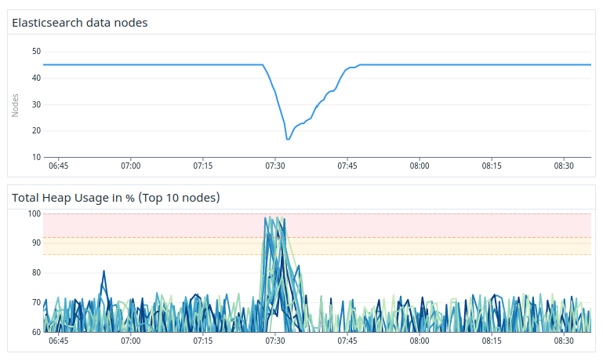

---
> **ARTS-week-14**
> 2023-04-01 9:36
---


## ARTS-2019 左耳听风社群活动--每周完成一个 ARTS
1.Algorithm: 每周至少做一个 leetcode 的算法题
2.Review: 阅读并点评至少一篇英文技术文章
3.Tip: 学习至少一个技术技巧
4.Share: 分享一篇有观点和思考的技术文章

### 1.Algorithm:

- [1641. 统计字典序元音字符串的数目](https://leetcode.cn/submissions/detail/418837802/)  
    + 思路：回溯
- [1637. 两点之间不包含任何点的最宽垂直区域](https://leetcode.cn/submissions/detail/419229939/)  
    + 思路：贪心
- [831. 隐藏个人信息](https://leetcode.cn/submissions/detail/419946462/)  
    + 思路：模拟

### 2.Review:

[我们如何在不停机的情况下升级旧的 3PB 大型 Elasticsearch 集群。第 5 部分 - 在同一 JVM 中运行两个 Elasticsearch 客户端](https://underthehood.meltwater.com/blog/2022/12/09/how-we-upgraded-an-old-3pb-large-elasticsearch-cluster-without-downtime-part-5-running-two-elasticsearch-clients-in-the-same-jvm/)

介绍如何在不停机且对用户影响最小的情况下升级 Elasticsearch 集群。由于这次升级的范围很大，从一开始就很清楚这个项目将持续至少一年，如果不是更多的话。这篇博文描述了我们如何推理我们的开发过程，以及我们如何设法在我们的 Java 代码库中长期支持多个 Elasticsearch 客户端库。

#### 1、支持多个 Elasticsearch 客户端

我们有几个直接与 Elasticsearch 交互的组件。例如，我们有一个负责处理搜索的组件，另一个处理索引的组件。几乎所有的可部署组件都是Docker容器，通常使用Java，Kotlin和Spring Boot实现。

正如我们在之前的一篇博客文章中提到的，我们并行运行了两个具有不同版本的集群。这意味着我们所有的组件都需要以某种方式支持两个版本的 Elasticsearch，直到整个升级完成。

实现这一目标的一个简单方法是停止为旧版本开发任何新功能，实际上是功能冻结，并继续改进新版本。然而，由于该项目将持续多年，这对我们来说并不是一个真正的选择，所以我们不得不寻找另一种方式。

#### 2、发展指导原则

为了让我们的团队能够继续向现有系统正常交付功能，我们决定在升级过程中坚持一些指导原则。

始终部署主分支。我们不想固定任何版本，因为这会阻止我们提供新功能。此外，我们希望避免长期存在的分叉和功能分支，因为这需要我们为每个更改保持两个代码库的最新状态。

每个组件只有一个可部署的项目。我们想使用一个功能标志来确定使用哪个 Elasticsearch 版本。功能标志将由环境变量切换。

对两个 Elasticsearch 版本运行相同的集成测试集。通过这样做，我们将确保我们向后兼容。对于我们有意识地更改 API 的少数情况，我们添加了专门的测试，突出了版本之间的差异。

但是决定我们想做什么，而不是实际实现它，是两回事。使它比预期更难的一些原因是：

- 我们更改的两个版本的 Elasticsearch API 不兼容。

- 我们旧的自定义Elasticsearch版本只与Java 8兼容，所以我们无法利用Java模块。

- 早期版本的 Elasticsearch 中使用的（传输）客户端 API 要求整个 Elasticsearch 依赖树存在于Java 类路径中。这意味着在同一 JVM 中同时运行两个版本的客户机会导致类路径冲突。

#### 3、解决类路径冲突

由于两个 Elasticsearch API 彼此不兼容，我们需要将两个版本的 API 库加载到与 elasticsearch 交互的所有组件的运行时中。

我们研究了如何解决这个问题的各种替代方案，例如使用单独的类加载器或构建具有不同依赖关系集的每个组件的两个变体。

经过一些广泛的研究，我们最终使用了Gradle 影子插件。在几件事中，该插件可以重新定位类以使用与开始时不同的包名称。例如，位于包“org.elasticsearch.index.query”中的类 TermQueryBuilder 存在于两个 Elasticsearch 版本中，但具有不同的 API 和实现。然后，可以使用影子插件将包的名称更改为“v1.org.elasticsearch.index.query”对于该类的旧版本，以及更新使用它的所有其他类中的所有导入和引用。通过这种方式，我们可以将“相同”类的两个变体加载到同一个 JVM 类路径中，但具有不同的包名称。

#### 4、使用不同的版本

一旦我们有了将两个 Elasticsearch 客户端 API 放在同一个类路径上的解决方案，我们希望在其余代码中无缝地使用它们。

为了实现这一目标，我们在 Elasticsearch API 之上创建了自己的包装库和客户端接口。我们在这里非常务实，只包装了我们在组件中实际使用的 API 部分。我们做了两个客户端接口的实现，每个Elasticsearch版本一个。大致看起来像这样：

```java
interface ESClient {
    fun search(request: ESSearchRequest): ESSearchResult
    // … index, scroll, etc
}

class ESClient1: ESClient {
    override fun search(request: ESSearchRequest): ESSearchResult {
        // Implementation of the old version using the shadowed packages
    }
}

class ESClient7: ESClient {
    override fun search(request: ESSearchRequest): ESSearchResult {
        // Implementation of the new version
    }
}
```

然后，此包装器客户端的输入和输出是与版本无关的包装类，这些包装类不依赖于任何 Elasticsearch API 类，从而使此代码的调用方对底层 API 版本一无所知。

通过使用这个客户端抽象，我们所有的组件都可以使用相同的代码来进行 Elasticsearch 调用，并且它将与版本无关。使用包装器 API 的哪个具体实现由组件启动期间设置的环境变量决定。我们的一个组件的设置如图 1 所示。




#### 5、升级后对我们方法的反思

我们的方法有一些痛苦。第一个是我们必须更改多个存储库中的大量代码，以使它们使用我们的客户端包装器，这需要花费大量时间。我们还必须花费相当多的时间尝试让 Shadow 插件完全按照我们的意愿去做。

但是一旦我们设置好了，我们就会觉得所描述的方法效果非常好。继续开发新功能很容易，我们只有一个地方可以更改。完成后，删除旧代码也很容易，因为我们只需要删除旧版本的包装器客户端，仅此而已！

### 3.Tip:

#### java 数据匹配，类似 left join 方式连表

```java

package com.home.util;
 
import lombok.AllArgsConstructor;
import lombok.Data;
import lombok.NoArgsConstructor;
import net.sf.cglib.beans.BeanMap;
import org.springframework.beans.BeanUtils;
 
import java.lang.reflect.InvocationTargetException;
import java.util.ArrayList;
import java.util.HashMap;
import java.util.List;
import java.util.Map;
import java.util.function.Function;
import java.util.stream.Collectors;
 
/**
 * 数据匹配工具
 *
 * @param <T1> 元数据1类型
 * @param <T2> 元数据2类型
 * @param <T3> 目标数据类型
 */
public class DataMatchingUtil<T1, T2, T3> {
 
    /**
     * left join 方式
     *
     * @param front     元数据1
     * @param t1Fun     元数据1获取关联字段
     * @param after     元数据2
     * @param t2Fun     元数据2获取关联字段
     * @param infoClass 目标数据类型
     * @return
     */
    public List<T3> leftJoin(List<T1> front, Function<T1, Object> t1Fun, List<T2> after, Function<T2, Object> t2Fun, Class<T3> infoClass) {
        //结果集
        List<T3> list = new ArrayList(front.size());
        if (front == null || front.size() == 0) {
            return list;
        }
        if (after == null || after.size() == 0) {
            front.stream().forEach(item -> list.add(this.collect(item, null, infoClass)));
        } else {
            //after转型
            Map<Object, List<T2>> list2Map = after.stream().collect(Collectors.groupingBy(item -> t2Fun.apply(item)));
            front.stream().forEach(item -> {
                List<T2> t2s = list2Map.get(t1Fun.apply(item));
                if (t2s == null) {
                    list.add(this.collect(item, null, infoClass));
                } else {
                    t2s.stream().forEach(item1 -> {
                        list.add(this.collect(item, item1, infoClass));
                    });
                }
            });
        }
        return list;
    }
 
    /**
     * left join 方式
     *
     * @param front 元数据1
     * @param t1Fun 元数据1获取关联字段
     * @param after 元数据2
     * @param t2Fun 元数据2获取关联字段
     * @return
     */
    public List<Map<String, Object>> leftJoin(List<T1> front, Function<T1, Object> t1Fun, List<T2> after, Function<T2, Object> t2Fun) {
        //结果集
        List<Map<String, Object>> list = new ArrayList<>(front.size());
        if (front == null || front.size() == 0) {
            return list;
        }
        if (after == null || after.size() == 0) {
            front.stream().forEach(item -> list.add(this.collect(item, null)));
        } else {
            //after转型
            Map<Object, List<T2>> list2Map = after.stream().collect(Collectors.groupingBy(item -> t2Fun.apply(item)));
            front.stream().forEach(item -> {
                List<T2> t2s = list2Map.get(t1Fun.apply(item));
                if (t2s == null) {
                    list.add(this.collect(item, null));
                } else {
                    t2s.stream().forEach(item1 -> {
                        list.add(this.collect(item, item1));
                    });
                }
            });
        }
        return list;
    }
 
    /**
     * left join 方式
     *
     * @param front   元数据1
     * @param t1param 元数据1关联字段名
     * @param after   元数据2
     * @param t2param 元数据2关联字段名
     * @return
     */
    public List<Map<String, Object>> leftJoin(List<Map<String, Object>> front, String t1param, List<Map<String, Object>> after, String t2param) {
        List<Map<String, Object>> list = new ArrayList<>(front.size());
        if (front == null || front.size() == 0) {
            return list;
        }
        if (after == null || after.size() == 0) {
            front.stream().forEach(item -> list.add(this.collect(item, null)));
        } else {
            Map<Object, List<Map<String, Object>>> list2Map = after.stream().collect(Collectors.groupingBy(item -> item.get(t2param)));
            front.stream().forEach(item -> {
                List<Map<String, Object>> t2s = list2Map.get(item.get(t1param));
                if (t2s == null) {
                    list.add(this.collect(item, null));
                } else {
                    t2s.stream().forEach(item1 -> {
                        list.add(this.collect(item, item1));
                    });
                }
            });
        }
        return list;
    }
 
    private T3 collect(T1 t1, T2 t2, Class<T3> infoClass) {
        T3 t3 = this.newT3(infoClass);
        this.copyProperties(t1, t3);
        this.copyProperties(t2, t3);
        return t3;
    }
 
    private T3 newT3(Class<T3> type) {
        T3 t3 = null;
        try {
            t3 = type.getConstructor().newInstance();
        } catch (InstantiationException e) {
            e.printStackTrace();
        } catch (IllegalAccessException e) {
            e.printStackTrace();
        } catch (InvocationTargetException e) {
            e.printStackTrace();
        } catch (NoSuchMethodException e) {
            e.printStackTrace();
        }
        return t3;
    }
 
    private void copyProperties(Object source, T3 t3) {
        if (source != null) {
            BeanUtils.copyProperties(source, t3);
        }
    }
 
    private Map<String, Object> collect(Map<String, Object> t1, Map<String, Object> t2) {
        Map<String, Object> map = new HashMap<>();
        if (t1 != null) {
            map.putAll(t1);
        }
        if (t2 != null) {
            map.putAll(t2);
        }
        return map;
    }
 
    private Map<String, Object> collect(T1 t1, T2 t2) {
        Map<String, Object> map = new HashMap<>();
        if (t1 != null) {
            BeanMap beanMap1 = BeanMap.create(t1);
            map.putAll(beanMap1);
        }
        if (t2 != null) {
            BeanMap beanMap2 = BeanMap.create(t2);
            map.putAll(beanMap2);
        }
        return map;
    }
 
    private static void testBeanToBean() {
        long start = System.currentTimeMillis();
        System.out.println(start);
        List<DataFront> list1 = new ArrayList<>();
        List<DataAfter> list2 = new ArrayList<>();
        for (int i = 0; i < 100000; i++) {
            list1.add(new DataFront("a" + i, i));
            list2.add(new DataAfter(i, "amsg" + i));
        }
        System.out.println(list1.size());
        System.out.println(list2.size());
        long middle = System.currentTimeMillis();
        System.out.println(middle - start);
 
        DataMatchingUtil<DataFront, DataAfter, DataResult> util = new DataMatchingUtil();
        List<DataResult> dataResults = util.leftJoin(list1, DataFront::getId, list2, DataAfter::getUserId, DataResult.class);
        System.out.println(dataResults.size());
        System.out.println(dataResults.get(0));
        long last = System.currentTimeMillis();
        System.out.println(last - middle);
    }
 
    private static void testMapToMap() {
        long start = System.currentTimeMillis();
        System.out.println(start);
        List<Map<String, Object>> list1 = new ArrayList<>();
        List<Map<String, Object>> list2 = new ArrayList<>();
        for (int i = 0; i < 100000; i++) {
            Map<String, Object> map1 = new HashMap<>();
            map1.put("name", "a" + i);
            map1.put("id", i);
            list1.add(map1);
 
            Map<String, Object> map3 = new HashMap<>();
            map3.put("msg", "amsg" + i);
            map3.put("userid", i);
            list2.add(map3);
        }
        System.out.println(list1.size());
        System.out.println(list2.size());
        long middle = System.currentTimeMillis();
        System.out.println(middle - start);
 
        DataMatchingUtil<Map<String, Object>, Map<String, Object>, Map<String, Object>> util = new DataMatchingUtil();
        List<Map<String, Object>> maps = util.leftJoin(list1, "id", list2, "userid");
        System.out.println(maps.size());
        System.out.println(maps.get(0));
        long last = System.currentTimeMillis();
        System.out.println(last - middle);
    }
 
    private static void testBeanToMap() {
        long start = System.currentTimeMillis();
        System.out.println(start);
        List<DataFront> list1 = new ArrayList<>();
        List<DataAfter> list2 = new ArrayList<>();
        for (int i = 0; i < 100000; i++) {
            list1.add(new DataFront("a" + i, i));
            list2.add(new DataAfter(i, "amsg" + i));
        }
        System.out.println(list1.size());
        System.out.println(list2.size());
        long middle = System.currentTimeMillis();
        System.out.println(middle - start);
 
        DataMatchingUtil<DataFront, DataAfter, Map<String, Object>> util = new DataMatchingUtil();
        List<Map<String, Object>> maps = util.leftJoin(list1, DataFront::getId, list2, DataAfter::getUserId);
        System.out.println(maps.size());
        System.out.println(maps.get(0));
        long last = System.currentTimeMillis();
        System.out.println(last - middle);
    }
 
    /**
     * 百万数据以内效率比较: map2map > bean2map > bean2bean
     *
     * @param args
     */
    public static void main(String[] args) {
        //用bean封装的
        testBeanToBean();
        System.out.println("-----------------------");
        //用map封装的
        testMapToMap();
        System.out.println("------------------------");
        //用map封装
        testBeanToMap();
    }
}
 
 
@Data
@AllArgsConstructor
class DataFront {
    String name;
    Integer id;
}
 
@Data
@AllArgsConstructor
class DataAfter {
    Integer userId;
    String msg;
}
 
@Data
@NoArgsConstructor
class DataResult {
    String name;
    Integer id;
    String msg;
}
```

### 4.Share:

[从零开始java数据库SQL优化（二）：多个LEFT JOIN的SQL优化](https://blog.csdn.net/qq_35755863/article/details/102236637)  

[leftjoin多了性能下降_MySQL 性能优化总结](https://blog.csdn.net/weixin_39719585/article/details/111264476)

[JAVA对象与JSON转换的各种方法-fastjson](https://blog.csdn.net/qq_34706514/article/details/103872859)

[Java如何优化大量的if else](https://blog.csdn.net/fzy629442466/article/details/85762748)
