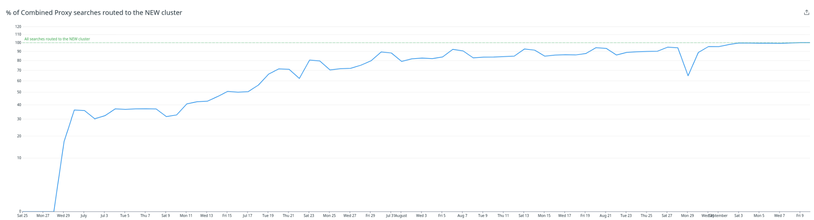

---
> **ARTS-week-15**
> 2023-04-09 7:57
---


## ARTS-2019 左耳听风社群活动--每周完成一个 ARTS
1.Algorithm： 每周至少做一个 leetcode 的算法题
2.Review: 阅读并点评至少一篇英文技术文章
3.Tip: 学习至少一个技术技巧
4.Share: 分享一篇有观点和思考的技术文章

### 1.Algorithm:

- [1039. 多边形三角剖分的最低得分](https://leetcode.cn/submissions/detail/420223571/)  
    + 思路：DFS
- [1017. 负二进制转换](https://leetcode.cn/submissions/detail/421617665/)  
    + 思路：模拟
- [1040. 移动石子直到连续 II](https://leetcode.cn/submissions/detail/421981435/)  
    + 思路：排序

### 2.Review:

[我们如何在不停机的情况下升级旧的 3PB 大型 Elasticsearch 集群。第 6 部分 - 测试和推出策略](https://underthehood.meltwater.com/blog/2022/12/16/how-we-upgraded-an-old-3pb-large-elasticsearch-cluster-without-downtime-part-6-testing-rollout-strategy/)

介绍如何在不停机且对用户影响最小的情况下升级 Elasticsearch 集群。由于这次升级的范围很大，从一开始就很清楚这个项目将持续至少一年，如果不是更多的话。这篇博文描述了我们如何推理我们的开发过程，以及我们如何设法在我们的 Java 代码库中长期支持多个 Elasticsearch 客户端库。

#### 1、它真的会起作用吗？

正如我们在本系列的第一篇文章中提到的，我们必须能够设计一个渐进的、可逆的、无停机的解决方案来推出我们的新集群。这意味着我们必须有一种无中断的方式来在现实环境中测试我们的生产工作负载，并且只有在我们确定新集群会按照我们的预期执行时才开始启用它。实现这一目标的关键是在流程中尽早开始收集数据。我们希望尽快开始执行请求，无论它包含多少数据，我们都希望尽快开始执行请求，而不是等待新集群被 PB 级数据填充。通过我们收集的数据，我们旨在回答以下问题：
- 是否有任何搜索请求在旧群集中成功但在新群集中失败？
- 在新群集中执行的搜索是否与旧群集中的搜索一样执行？
- 相同的搜索是否产生相同/相似1对不同集群执行时的结果？

我们的团队拥有根深蒂固的实验文化，并做出数据驱动的决策。我们大量使用 Datadog 和 Kibana，以及一系列通用和定制的测试和负载生成工具，以了解我们的系统在压力下的性能。这意味着我们已经为我们准备了很大一部分所需的工具。我们工具箱中最有用的工具之一称为请求重放。它是一种工具，用于捕获和存储我们的生产搜索服务执行的所有搜索，并通过将存储的请求重新发送到我们的搜索基础结构来重播它们。它最初设计用于重放从生产环境到开发/过渡环境的实际流量，但后来扩展到重放生产环境中的金丝雀部署的流量。

作为专门为我们的工作负载设计的工具，请求重放具有一些有用的功能：
- 它可以随着时间的推移按照相同的分布重放请求，因此我们模仿原始流量的突发性。
- 它可以改变原始查询的某些功能（如日期范围），使其更好地适应目标群集中的现有数据。
- 它可以根据有偏差或无偏差采样选择请求的子集，而不是重放整个流量。
- 它可以比较服务之间的结果、时间和错误率，并将有关它们的指标发送到 Datadog 和 Kibana。

一旦我们自己有了一个小集群，开始填充数据，我们就开始重放来自生产环境的请求。由于这次初步测试，我们能够在流程开始时注意到并修复一组或多或少明显的问题。但是，随着集群的发展，我们开始规划发布，我们注意到请求重放中缺少一个关键功能：实时重放请求的能力，以便可以将相同的流量发送到旧集群或新集群。虽然请求重放可以执行存储的请求，但我们也希望能够在相同的负载下进行性能比较。本来可以使用存储/重放架构来实现这一点，但是，我们决定，如果两个集群同时执行相同的负载，我们将能够更准确地分析结果。

#### 2、推出策略

此时，我们对推出策略有了想法：我们将重放对两个集群的所有请求。发送到一个集群的任何流量都将重放到另一个集群中，从而导致完整的反馈循环。我们首先将 100% 的请求发送到旧集群，然后将所有请求重放到新集群。然后，当我们收集反馈时，我们会慢慢增加发送到新集群的请求的百分比，同时重播到旧集群的请求。最终，所有请求都将发送到新集群，同时重播到旧集群。此时，我们可以安全地停止重播并终止旧集群。


当然，与许多好主意一样，这说起来容易做起来难。幸运的是，我们的搜索基础设施的设置方式简化了这一过程。我们的秘密武器是我们定制的智能负载均衡器，称为搜索路由器。

#### 3、如何执行搜索？

Meltwater 产品由许多团队开发。为了简洁起见，我们将重点介绍搜索子系统收到搜索请求后会发生什么。从最简单的意义上说，我们的架构如下所示：


我们最初使用这种架构是为了能够在 Elasticsearch 节点之间均匀分配负载。但是，我们发现拥有智能负载均衡器可以让我们能够对流量的路由方式做更多有趣的事情。截至今天，搜索路由器还可以按用户限制请求，以防止在用户并行执行大量搜索时使服务过载，将有关请求的指标报告给 Datadog 并通过 HTTP 响应标头返回给我们的用户。然后，在迁移期间，我们还添加了新功能：处理跨集群重放请求的能力。

#### 4、将一切整合在一起

通过上面解释的架构，我们面前有一个非常清晰的设计来实现。搜索路由器将负责决定哪些请求应路由到哪个集群，并且请求重放将扩展为能够通过HTTP接收和执行请求，而不是读取存储的请求。这意味着搜索路由器将负责执行客户请求和重放请求。虽然我们可以并行运行它们，但让实际的客户请求等待重放请求进行比较似乎不是一个可行的选择。相反，我们选择在尝试重播之前执行客户的实际请求。虽然这会在重播过程中引入轻微延迟，但它将足够接近实际请求，同时避免对客户体验产生任何影响。因此，最后我们决定采用以下架构。


这意味着搜索路由器将：

- 接收请求
- 确定要在哪个集群中执行请求
- 针对所选群集中的搜索服务执行它
- 获取响应
- 将响应返回给客户
- 提交请求和响应以针对其他集群重播的请求重播。
当然，由于搜索路由器可以对两个集群执行请求，这意味着架构看起来更像这样。


#### 5、如何选择先路由谁？

答案很简单：没人！我们通过重播对新集群的请求并比较结果来开始测试过程。随着结果开始涌入，我们都松了一口气，因为我们看到我们现在可以做出决定：我们可以简单地将所有客户路由到新的集群，一切都会好起来的。实际上就是这里的关键字，因为我们还注意到在旧集群中成功的请求在新集群中失败的一系列情况。有了这些数据，我们继续设计以下逻辑来决定请求是应该路由到新集群还是旧集群。

```java
fun decide(
        request: Request,
        routingPercentage: Float,
        alwaysRouteToOld: Set<String>
): TargetCluster {

  val customerId = request.customerId
  if (alwaysRouteToOld.contains(customerId)) {
    return TargetCluster.OLD
  }

  val dateRange = request.dateRange
  if (!newCluster.hasDataFor(dateRange)) {
    return TargetCluster.OLD
  }

  val userIdHash = hashToFloat(request.userId)
  if (userIdHash >= routingPercentage) {
    return TargetCluster.OLD
  }

  return TargetCluster.NEW
}
```

我们使用从回放中收集的数据来构建一个客户列表，我们认为“路由到新集群有风险”，但由于该列表相对较小，我们不想等到所有问题都得到解决后再开始。相反，我们首先为搜索路由器创建一个新的配置值，其中包含我们希望确保路由到旧群集的所有客户。因此，我们首先根据该配置检查请求，如果客户在该列表中，则所有赌注都已关闭。我们将他们定向到旧集群。在我们解决这些问题时，我们逐渐清空了该清单。

当然，如果集群没有数据来寻址查询的日期范围，则向新集群发送请求没有任何意义。为此，我们依赖于日的概念。0：我们开始用通常的数据流填充集群的那一天。


任何要求从 Day 获取数据的查询0后来，我们知道它有完整的数据。当我们开始流入最新数据时，我们也开始回填我们的数据，从 Day 开始-1并逐步回去。当我们回填数据时，我们不断相应地更新搜索路由器的配置，延长了t再往后，让它知道更多数据的可用性。一旦我们有了这个配置，在执行查询时，搜索路由器会分析查询的正文，以确定它所涵盖的日期范围，并确保它落在我们已经有数据的日期范围内，然后再将请求路由到新的集群。

最后，我们只想将一定比例的用户路由到新集群。我们将该百分比定义为 0 到 1 之间的浮点数。我们最初的实现是在此时生成一个随机数，并根据生成的数字将用户路由到新集群或旧集群。

我们很快注意到这种方法的一个大问题：如果集群返回明显不同的结果，用户会在刷新结果时看到他们获得的结果不一致，甚至在同一页面中，因为我们在某些页面中我们对搜索系统执行多个查询并显示结果。如果这些请求中的每一个都被重定向到不同的集群，这对我们的用户来说将是非常令人沮丧的。因此，我们决定根据每个用户的用户 ID 为每个用户生成一个介于 0 和 1 之间的哈希，并始终基于此哈希路由到特定集群，而不是生成随机数。这为我们的用户提供了更一致的体验，因为我们继续在后台调整系统。

#### 6、回首往事

说完之后，完整的推出过程如下图所示。



整个过程最好的部分是它是多么平淡无奇。从头到尾都很顺利和宁静。我们对系统性能、稳定性和兼容性的可见性，加上我们可以随时回滚的知识，使我们能够尽可能快地运行，而不会破坏任何东西。为了实现这一目标，我们必须构建新工具并修改我们的基础设施以适应它们，但我们获得了即时的投资回报，不仅在流程流畅性方面，而且在我们开发团队的福祉和 Meltwater 业务的安全性方面。

最后，引擎盖下的一切都变了，然而，一切都保持不变。

### 3.Tip:

#### 后台运行 Linux 命令

1、组合键及命令
Ctrl+Z 组合键，便可以暂停运行并隐藏到后台，将会返回一个停止序号，此时进程时暂停的，并不会继续运行。
输入 bg 命令即可继续将该任务在后台执行。
输入 fg + 序号命令即可让进程返回到前台执行。
执行过程中，可以输入 jobs 命令来查看所有的后台任务了。
```shell
# tar -zxf httpd-2.2.17.tar.gz                             ## 解压 httpd 压缩包
^Z                                                         ## 按下 Ctrl+Z 组合键暂停
[1]+  Stopped                 tar -zxf httpd-2.2.17.tar.gz

# bg                                                       ## 输入 bg 命令，继续在后台运行
[1]+ tar -zxf httpd-2.2.17.tar.gz &

# jobs                                                     ## 查看所有的后台任务
[1]+  Done                    tar -zxf httpd-2.2.17.tar.gz
```

2、&
在执行命令后加&，使其在终端后台运行。
```shell
# ./yum_install.sh &
```
执行完如上命令，yum脚本便在后台运行，虽然在后台运行了，但输出的内容还是会在终端上进行显示的，那么我们可以采用将执行后的命令输出结果重定向到文件中。
```shell
# ./yum_install.sh >> 202001141411out.txt 2>&1 &
```
将执行的结果重定向到202001141411out.txt文件中，2>&1将标准错误重定向到标准输出，判断yum脚本文件执行成功没成功，我们只需查看202001141411out.txt文件即可；

如果出现脚本文件执行了一段时间，卡死，无法继续运行了，可以通过第一种方法：jobs命令
```shell
# jobs -l
```
或者使用ps命令
```shell
# ps -aux | grep yum_install.sh
```

3、nohup
&：可以使命令在后台运行，当关闭控制台时，进程也将会被杀死，如果希望关闭控制台后，进程依旧运行，这时则需要使用 nohup。
nohup：no hang up，不挂起的意思。
在执行命令最前面使用 nohup，当关闭控制台时，进程依旧会在后台继续运行。
```shell
# nohup ./yum_install.sh &
```
如上 nohup 执行方式，当判断该脚本是否执行完毕，可执行命令 ps -aux | grep yum_install.sh 查看；
除此之外，我们可以将运行结果输出到 nohup.log 文件中，当没有指定输出重定向时，日志文件会默认输出到 nohup.out 文件；
```shell
# nohup ./yum_install.sh > nohup.log 2>&1 &
```

### 4.Share:

[WebAssembly 小 Demo](https://zhuanlan.zhihu.com/p/245967229)  

[wasm-pdf](https://github.com/jussiniinikoski/wasm-pdf)

[npm包发布时忽略某些文件(夹)](https://juejin.cn/post/6963186362170376223)

[Give higher priority to .npmignore over .gitignore](https://github.com/yarnpkg/yarn/issues/685)
