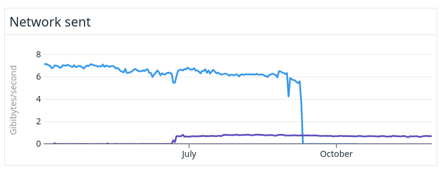
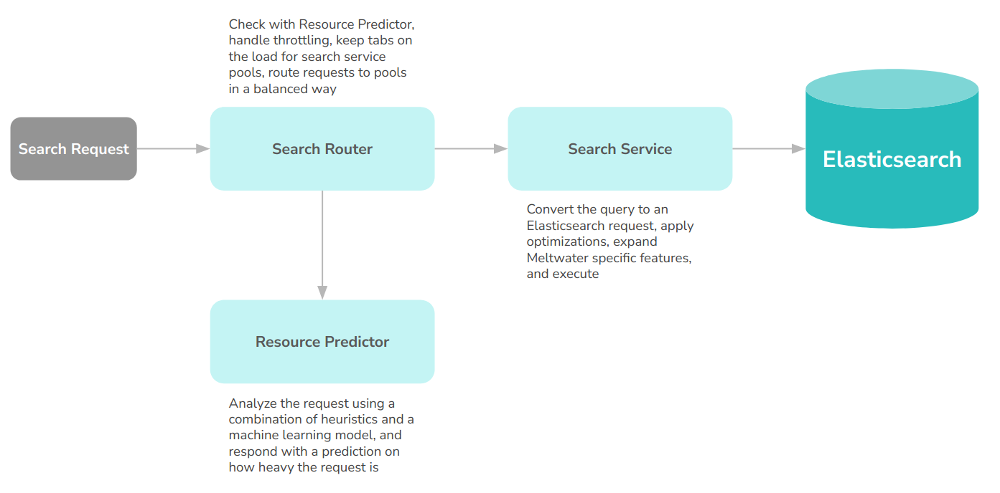
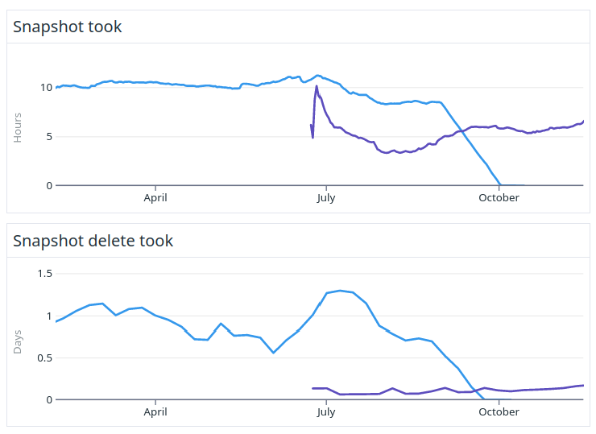
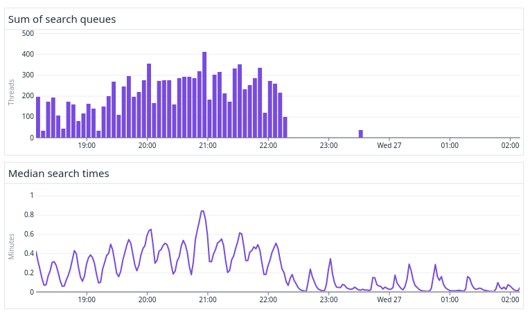
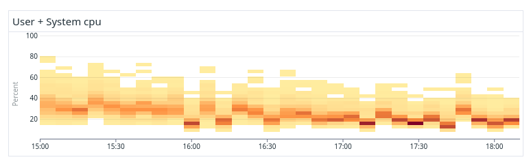

---
> **ARTS-week-16**
> 2023-04-09 10:15
---


## ARTS-2019 左耳听风社群活动--每周完成一个 ARTS
1.Algorithm： 每周至少做一个 leetcode 的算法题
2.Review: 阅读并点评至少一篇英文技术文章
3.Tip: 学习至少一个技术技巧
4.Share: 分享一篇有观点和思考的技术文章

### 1.Algorithm:

- [1041. 困于环中的机器人](https://leetcode.cn/submissions/detail/423223950/)  
    + 思路：模拟
- [1023. 驼峰式匹配](https://leetcode.cn/submissions/detail/424321992/)  
    + 思路：双指针
- [1042. 不邻接植花](https://leetcode.cn/submissions/detail/424664385/)  
    + 思路：图

### 2.Review:

[我们如何在不停机的情况下升级旧的 3PB 大型 Elasticsearch 集群。第7部分 - 最终架构与学习](https://underthehood.meltwater.com/blog/2023/01/20/how-we-upgraded-an-old-3pb-large-elasticsearch-cluster-without-downtime-part-7-final-architecture-learnings/)

这是我们博客文章系列的第 7 部分，也是最后一部分，讲述了我们如何在不停机的情况下升级 Elasticsearch 集群，并将用户影响降至最低。在这篇文章中，我们将重点介绍升级后看到的几个好处，并提供有关我们架构今天外观的更多详细信息。

#### 1、主节点 - 高效的集群状态更新和更少的 CPU 使用率

每当 Elasticsearch 中发生更改时，例如添加新节点或创建新索引，主节点都会将集群状态与集群中的所有其他节点同步。

在旧集群中，集群状态由主节点同步，将完整集群状态发送到所有其他节点。当集群有 1000+ 个节点和 90，000 个分片时，集群状态可能为 100 MB 大，然后主节点的网络带宽成为瓶颈，从而减慢每个集群操作的速度。



上图显示了新旧集群中主集群使用的网络带宽差异。最大的区别是因为在最新版本的 Elasticsearch 中，只将集群状态的增量发送到其他节点，这大大降低了主节点所需的带宽。紫线表示网络使用量减少 90% 的新版本。

另一个主节点瓶颈是，在旧版本中，许多集群操作是由主节点上的单个 JVM 线程执行的。计随算时间有时会着分片数量的增加而线性增长（或更糟）。为了能够快速处理某些集群操作，我们必须使用具有最快单核 CPU速度的实例类型。此外，网络带宽必须尽可能高，这迫使我们使用我们在 AWS 上可以找到的一些最昂贵的实例类型在旧集群中运行主节点。

但是，由于这种处理集群更新的新方法，以及最新版本的 Elasticsearch 所做的其他一些改进，我们能够使用更小的实例类型，同时减少 CPU 和网络资源，从而将主节点的成本降低了 80%。

#### 2、数据节点及其 JVM

在旧的集群中，我们使用Java 8来运行Elasticsearch，这是当时支持的最新Java版本。在新集群中，我们使用捆绑的 Java 18 版本，它允许我们使用更现代的垃圾收集器，该收集器可以更好地处理更大的堆。我们在旧集群中使用了 CMS，在新集群中使用了G1。仅此更改就大大减少了执行搜索时  “stop the world” GC 暂停时间的持续时间和频率。数据节点上的垃圾收集现在运行良好，我们不必再考虑它了。

随着 G1 收集器的加入，我们还能够尝试更大的堆。由于压缩的对象指针，Elasticsearch 不建议在任一版本中的堆中超过 32GB，但我们广泛的测试表明，使用 64GB 堆可以缩短用例的搜索时间，因此我们决定这样做。使用 64GB 堆仍然为磁盘缓存留下了额外的 128GB RAM，因为我们用于数据节点的实例类型 （i3en.6xlarge） 总共有 192GB RAM。

我们在数据节点上使用的另外两个值得注意的非默认设置是，每个节点有 48 个搜索线程（而不是 24 个核心机器的默认值为 37 个），并利用传输压缩进行节点到节点的通信。在我们确定上述值之前，上述所有更改都已仔细针对实际流量进行了基准测试。

#### 3、堆利用率

当我们仍在运行自定义分支时，Lucene 和 Elasticsearch 对堆和内存消耗进行了大量改进。我们能够向后移植一些增强功能，但不是全部。特别是一个变化，将术语索引的存储从Java堆移动到磁盘（在Elasticsearch 7.7中发布）对我们的用例产生了巨大的影响。



这些数字表明，静态段数据（随着我们使用的磁盘量而增长）占用的堆从 40-50% 下降到新集群的 <1%。这意味着我们可以将数据节点磁盘利用率从之前的 45% 更改为健康的 83%。紫色线条表示新版本。

由于我们在升级中跳过了几个中间的 Elasticsearch 版本，因此很难确切地说出哪些其他更改做出了贡献。我们可以说的是，所有 Elasticsearch 改进与之前解释的通配符前缀解决方案相结合，使我们能够在磁盘而不是堆上进行扩展，堆的行为方式更加可预测和稳定。这也意味着我们现在不必为未充分利用的 CPU 和 RAM 支付额外费用。

所有这些都使我们能够将集群从 1100 个数据节点减少到600 个等效节点，同时在延迟和吞吐量方面仍然具有相同的性能或更好的性能。

#### 4、滚动群集重新启动

滚动重启旧集群中的所有数据节点确实很痛苦。完全重启可能需要长达两个月的时间才能完成，这迫使我们要么一次批量进行许多更改，这增加了风险，要么根本不进行任何更改，这限制了我们为客户提供优质服务的能力。

从理论上讲，重新启动集群应该像 Elasticsearch 文档中描述的那样简单，但由于以下原因，它对我们来说效果不佳：

- 我们无法长时间停止索引编制，因为传入文档和更新的速率一直很高，而且我们对应用程序的正常运行时间要求很高。
- 由于我们的集群状态非常庞大，>200MB，而且较旧的 Elasticsearch 版本不能非常有效地处理节点加入/离开事件。群集可能需要几分钟才能简单地检测并完全处理单个节点已离开群集的事实。剩下的节点越多，时间就越长。
  - 因此，对于 >1000 个节点和 ~5 分钟/节点的重启周期，即使是完美的重启（所有节点上的所有数据都可以在再次启动后立即使用）也需要80 多个小时来处理所有离开和加入集群事件。
- 在旧版本的 Elasticsearch 中，重新启动节点上的现有数据无法完全重用是很常见的。作为启动和还原过程的一部分，它必须从其他节点恢复，并且以 PB 规模恢复，这可能需要很长时间，几个小时，即使在具有大量 IO 和网络带宽的实例类型上运行时也是如此。
  - 这意味着我们甚至没有接近实现上述这些完美条件。因此，我们没有 “完美” 的 80 小时重新启动，而是需要数周甚至数月才能完成。
- 最后一个复杂问题是，将数据从一个节点发送到另一个节点会占用发送数据的节点上的额外磁盘空间。因此，为了不冒磁盘不足的风险，我们被迫一次只重新启动几个节点。每次重启批次后，我们都必须等待数小时才能恢复到绿色集群状态并继续下一批。

但是，最新版本的 Elasticsearch 使用称为全局/本地检查点的东西来加速重启。当分片脱机时，例如在滚动重启期间，主分片将跟踪从分片脱机到再次联机的增量。然后，要恢复分片，Elasticsearch 可以只发送这些增量而不是整个分片。这与处理离开/加入节点的主节点的改进一起，大大加快了重新启动速度，并且现在只需一天而不是几个月，完全滚动重新启动只需一天。

#### 5、索引快照

旧集群中的另一个主要问题是索引数据的快照。主要问题是我们无法足够快地删除旧快照，因此我们的备份越来越大。

原因是 Elasticsearch 在删除快照之前迭代了快照存储桶中的所有文件。当您达到 PB 级大小的备份时，此迭代需要很长时间。较新版本的 Elasticsearch 改进了快照代码，大大减少了删除快照的时间。

我们防止这种持续快照数据增长的解决方案是每 4 个月更改一次 S3 存储桶。当时，我们从头开始，将完整备份到另一个 S3 存储桶中，同时为了安全起见，我们仍保留旧存储桶。然后，当第二个完整备份完成时，我们可以从第一个 S3 存储桶中删除数据，最终节省一些钱。

使用旧的交替存储桶快照策略，我们平均使用8PB来存储快照。在新集群中，我们只需要2PB，因为 Elasticsearch 现在可以比创建新快照更快地轻松删除旧快照，从而将我们的备份成本降低 75%。创建快照的速度也比以前快 50%，而删除快照的速度提高了 80% 以上。



上图显示了从旧集群和新集群中拍摄和删除快照的时间。紫色线条表示新版本。

#### 6、自适应复本选择

在新集群中，我们使用称为自适应副本选择 （ARS） 的功能。此功能更改搜索分片请求的路由，以便将请求发送到具有给定分片的最不繁忙的数据节点，从而减少搜索时间。在我们的旧集群中，我们实现了类似的功能，我们尝试将搜索请求发送到最不繁忙的可用区。如果您对该解决方案感到好奇，我们在较旧的博客文章中对其进行了更多描述。



上图显示了一个基准测试，我们首先在没有启用ARS的情况下运行。启用 ARS 后，我们看到搜索队列的数量大大减少，这反过来又显着改善了搜索延迟。

#### 7、索引分片策略

我们的集群在 AWS 中使用 3 个可用区 （AZ）。对于所有数据，我们为每个分片保留 2 个副本，无论数据的年龄如何。我们使用分片分配感知，确保出于故障转移和冗余原因，我们最终为每个 AV 区域提供一个副本。

我们使用基于时间的索引，我们有每日和每月索引。对于一些旧的和小的指数，我们甚至有几个年度指数。值得一提的是，我们分片的是原始文档的发布时间，而不是我们收到文档的时间。

新索引在开始接收数据前几天创建。我们不允许根据索引请求自动创建索引。整个索引创建、设置和配置编排由一组自定义工具完成，以实现我们所需的细粒度监控和可观察性，并允许弹性搜索基础设施即代码工作流。

这些新索引以及所有现有索引的最佳放置由我们定制的分片平衡工具处理，该工具确保以平衡年龄、大小、搜索和索引负载的方式将索引放置在数据节点上。这消除了热点，并在整个集群的所有数据节点上实现了负载的均匀分布。我们的系统与 Elasticsearch 8.6+ 非常相似，但再次具有一些额外的旋钮和功能以及更细粒度的监控和可观测性。



上图显示了非最佳系统（上图）和我们的工具优化的最佳平衡系统（下图）之间的 CPU 分布差异。可以看出，平衡系统中的所有数据节点的 CPU 使用率要平均得多，并且没有明显的热点会不必要地减慢搜索和索引速度。

运行一个平衡的系统不仅使我们的系统更快、更可预测，而且成本也更低，因为我们能够以更小的利润和更高的整体资源利用率运行。

#### 8、索引合并

Elasticsearch 中的更新是通过对旧版本的文档进行逻辑删除并将它们替换为另一个段中的新版本来实现的。tombstones 稍后通过自动合并索引段进行垃圾回收。

如前所述，我们收到了很多文档更新，这反过来意味着有很多 tombstones 被写入我们的分片和片段中。然而，这对我们来说不是一个主要问题，因为我们有非常高性能的硬件，有快速的磁盘和CPU备用，所以我们可以很容易地跟上段合并，这对我们来说永远不会成为瓶颈。为了将逻辑删除导致的额外磁盘使用量降至最低，我们配置了一个非常积极的合并策略。特别是控制触发自动合并之前允许的逻辑删除数量的 index.merge.policy.deletes_pct_allowed 设置已设置为其可能的最低值。

允许的最小值是 20%，但如果允许的话，我们本来希望将其设置为 5%，以比现在更频繁地强制合并，但目前Elasticsearch 不允许这样做。这意味着我们在群集中使用了多达 20% 的额外磁盘来存储永远不会被垃圾回收的逻辑删除，这对我们来说意味着总共浪费了 100 TB 的磁盘。

为了将这种额外的磁盘使用量减少到最低限度，我们开发了另一个称为合并顾问的自定义工具。该工具管理整个生命周期和围绕索引合并的启发式方法。该工具确保根据自定义规则和启发式方法，以受控和优先顺序为需要它的索引安排强制合并。其中一条规则是，超过 30 天的索引在强制合并之前只允许删除 5%。较热的数据具有更自由的规则，今天和昨天的索引完全由 Elasticsearch 默认设置管理，以便优先考虑该数据的索引速度。


此图显示了整个群集中已删除（逻辑删除）文档占用的磁盘量。11 月，我们部署了合并顾问组件，此后我们强制合并了分片，删除了逻辑删除，并将额外的磁盘使用量减少了 400 TB。这使我们能够将数据节点的数量减少 9%，并相应地降低我们的 AWS 成本。

#### 9、非技术优势

最后但并非最不重要的一点是，我们还想强调升级后获得的一些非技术优势。我们现在觉得我们更有能力再次与 Elasticsearch 社区的其他成员互动。我们可以就我们面临的挑战或我们希望看到的改进给出的反馈，现在与 Elasticsearch 开发人员更相关，并希望与更广泛的用户群更相关。所有这些都是因为我们现在运行一个官方维护和未修改的 Elasticsearch 版本。

作为开发人员，我们再次跟上最新和最伟大的搜索技术，并可以从行业中仍在发生的所有令人兴奋的创新中受益，这也是一种很棒的感觉。我们“升级后”的生活才刚刚开始，我们知道未来几年还有更多潜力可以释放。

我们回馈社区的愿望也才刚刚开始，尽管我们已经努力创建这个博客文章系列，改进了分片请求缓存键的计算方式，并举办了一次Elastic 聚会讲座。

我们希望能够保持这种状态，并在未来做出更多贡献，并向社区提供反馈，了解某些 Elasticsearch 功能在 PB 级上的工作方式，并考虑到我们的特定用例和要求。

例如，在将来的博客文章中可能会出现的一些主题（没有承诺）是提供有关我们的工作负载在 ARM 支持的实例上如何执行的更多详细信息，我们如何设法持续测量每个查询在集群中创建的确切负载或数据分层实验的结果。

#### 10、结语

简而言之，这些是我们从升级中获得的最重要的改进。
- 通过更好地处理群集状态，提高系统稳定性和复原能力
- 集群总成本降低 60% 以上
- 根据不断变化的业务需求更快、更轻松地扩展（或缩减）
- 更快、更轻松地推出新更改
- 需要维护的对 Elasticsearch 的自定义修改更少
  - 所有的修改要么打包为插件，要么打包为外部工具/应用程序，我们不再需要 Elasticsearch 的分支
我们可以在所有遗留代码消失的情况下再次加速创新
- 下一次升级将比这次顺利得多
- 我们可以再次更接近Elasticsearch社区的其他成员

### 3.Tip:

#### JAVA循环删除文件夹以及文件夹下面的文件

```java
public static boolean deleteDir(File dir){
    LOG.info("deleteDir删除文件路径：{}",dir);
    if (dir.isDirectory()){
        String[] children = dir.list();
        for (int i=0;i<children.length;i++){
            boolean success = deleteDir(new File(dir,children[i]));
            if (!success){
                return false;
            }
        }
    }
    Path filePath = dir.toPath();
    try{
        Files.delete(filePath);
    } catch (IOException e){
        LOG.error("deleteDir删除文件失败：",e);
    }
    return true;
}
```

#### Java 获取指定时间前一小时、后一小时的时间

```java
/**
 * 获取当前时间前一小时的时间
 * @param date
 * @return java.util.Date
 */
public static Date beforeOneHourToNowDate(Date date) {
    Calendar calendar = Calendar.getInstance();
    /* HOUR_OF_DAY 指示一天中的小时 */
    calendar.setTime(date);
    calendar.add(Calendar.HOUR_OF_DAY, -1);
    return calendar.getTime();
}

/**
 * 获取当前时间后一小时的时间
 * @param date
 * @return java.util.Date
 */
public static Date afterOneHourToNowDate(Date date) {
    Calendar calendar = Calendar.getInstance();
    /* HOUR_OF_DAY 指示一天中的小时 */
    calendar.setTime(date);
    calendar.add(Calendar.HOUR_OF_DAY, 1);
    return calendar.getTime();
}
```

#### How to convert a FileTime to a Date using Java

Syntax:
```java
Date newDate = new Date( filetime.toMillis() );
```
Example:
```java
import java.nio.file.attribute.FileTime;
import java.text.SimpleDateFormat;
import java.util.Date;

public class FileTimeDate {
    public static void main(String[] argv) {
      Date firstDate = new Date();
      FileTime time = FileTime.fromMillis( firstDate.getTime() );

      Date newDate = new Date( time.toMillis() );
      
      System.out.println("firstDate milliseconds:\t" +  firstDate.getTime() );
      System.out.println("FileTime milliseconds:\t" + time.toMillis() );
      System.out.println("newDate milliseconds:\t" + newDate.getTime() );

      if( time.toMillis() ==  firstDate.getTime() && newDate.getTime() ==  time.toMillis()){
          String pattern = "yyyy-MM-dd HH:mm:ss";
          SimpleDateFormat simpleDateFormat = new SimpleDateFormat(pattern);
          System.out.println("All the Dates are equal: " + simpleDateFormat.format( firstDate ) );
      }
    }
}
```

#### java获取文件创建时间

```java
public class TestXY {
  public static void main(String[] args) throws Exception {
         getFileCreateTime("");
  }


  public static String getFileCreateTime(String filePath) {

    SimpleDateFormat dateFormat = new SimpleDateFormat("YYYY-MM-dd HH:mm:ss ");
    FileTime t = null;
    try {
      t = Files.readAttributes(Paths.get(filePath), BasicFileAttributes.class).creationTime();
    } catch (IOException e) {
      e.printStackTrace();
    }

    String createTime = dateFormat.format(t.toMillis());
    System.out.println("创建时间 ： " + createTime);
    return createTime;
  }
}
```

### 4.Share:

[Java中删除文件或文件夹的几种方法](https://zhuanlan.zhihu.com/p/548171280)  

[统计java代码执行耗时的N种姿势](https://blog.csdn.net/angellee1988/article/details/113853968)

[Java获取一秒钟前、一分钟前、一小时前、一天前、一周前、一月前、一年前](https://blog.csdn.net/weixin_45739720/article/details/103638979)