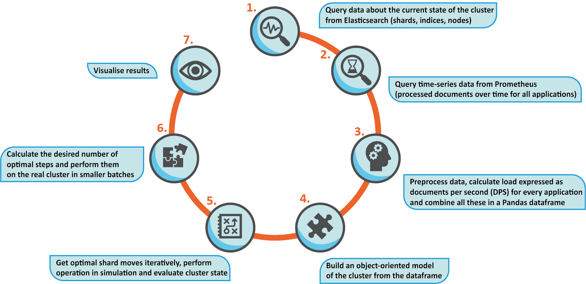
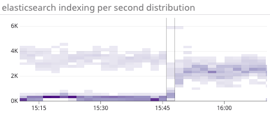

---
> **ARTS-week-19**
> 2023-05-07 10:44
---


## ARTS-2019 左耳听风社群活动--每周完成一个 ARTS
1.Algorithm: 每周至少做一个 leetcode 的算法题
2.Review: 阅读并点评至少一篇英文技术文章
3.Tip: 学习至少一个技术技巧
4.Share: 分享一篇有观点和思考的技术文章

### 1.Algorithm:

- [1105. 填充书架](https://leetcode.cn/submissions/detail/427017002/)  
    + 思路：DFS
- [1031. 两个非重叠子数组的最大和](https://leetcode.cn/submissions/detail/427949104/)  
    + 思路：双指针
- [1048. 最长字符串链](https://leetcode.cn/submissions/detail/428223175/)  
    + 思路：哈希

### 2.Review:

[Elasticsearch 中的负载驱动分片分布 - 实习的故事](https://underthehood.meltwater.com/blog/2019/09/27/load-driven-shard-distribution-in-elasticsearch-story-of-an-internship/)

自 2019 年 7 月以来，我一直在 Budapest 的 Meltwater 实习，在专注于开发人员生产力的基金会团队工作。解决具有挑战性的现实生活问题是一次真正宝贵的经验，这些问题对我们开发人员的日常生活产生了影响。

在这篇博文中，我将分享我在 Meltwater 实习的经历，并讨论我一直在从事的项目的细节。

日志记录和监控已成为软件开发的重要组成部分。无论工程师有多优秀，事情最终都会出现故障，出现意想不到的错误，服务器出现故障，应用程序崩溃。当这种情况发生时，日志是定位、识别和解决问题的极好的起点。

在 Meltwater，我们将 ELK 技术栈用于此类目的。如果不熟悉 Elasticsearch 在基本级别上的工作方式，请不要担心。就本文而言，需要知道的是，Elasticsearch 集群是一组节点（服务器），其中数据存储在搜索索引中，这些索引被分成多个分片。这些分片分布在节点上，用于负载共享目的。如果想了解更多信息，请查看Elasticsearch 的基本概念。

#### 1、问题陈述

2019 年 5 月，我们的团队收到了 60 条关于实时数据索引的警报。这是很多。这些警报大部分时间是由 Elasticsearch 中的热点引起的，这意味着一个或多个节点受到它们无法应对的传入数据速率的轰炸。交通异常使这种现象恶化，其中应用程序向我们发送了我们没有准备好的数据量。在这种情况下，无论我们多么努力地估计传入负载，一些分片都会使节点过载。这些方案显著增加了使用者的滞后，从而延迟了所有系统的日志。

值得一提的是，我们的值班工程师为稳定日志系统付出了3天的汗水。与管道和集群能够处理的日志相比，我们开始摄取大量日志，因此我们在处理传入数据时遇到了明显的滞后。


通过显著扩展集群中的节点数和受影响最大的四个索引以使用更多分片来处理引入，可以缓解此问题。这解决了眼前的问题，但既不是一个具有成本效益也不是可持续的战略。我们可以做得更好！

#### 2、探索问题

提高计算能力对这种情况的帮助微乎其微，但是值得更深入地研究增加负载密集型索引中的分片数量。Elasticsearch 使用内置算法在节点之间分配分片，考虑了两个因素：

- 1.每个节点都应包含接近相等数量的分片。

- 2.通过使用高低磁盘水印来保持高效的磁盘使用。达到低水位线的节点不允许接收更多分片，而达到高水位线的节点将移走其部分分片。

这很明显，增加某些索引的分片数量如何改善日志记录集群的整体负载分布，以及如何消除热点。但是，这种内置算法对于我们的用例确实无效，因为它错误地假设集群中的每个分片都接收大致相同的工作负载。

为了验证我们离最佳分布还有多远，我们从 Elasticsearch 查询了有关集群的信息，并可视化了以下指标，这些指标似乎支持我们的说法。


#### 3、设计更高效的算法

很明显，取分片数量并不是对工作负载的良好估计。首先，我们需要一个更精确地反映集群状态的指标，然后我们可以考虑创建一个更优化的分布。

- 派生负载指标

索引器正在接收来自各种应用程序的文档。对于所有这些服务，从 Prometheus 查询已处理文档数量的时间序列数据，时间范围为 2 周。为了使我们的负载预测更准确，我们应用指数平滑来获取权重更高的近期事件。计算完每个应用程序的负载后，剩下的唯一事情就是将此数字除以相应的分片数。通过这种方式，我们引入了一个分片级指标，用于估算系统中的负载。

- 分配负载
现在我们有一个可以优化的更精确的指标，我们必须考虑分布。本能地与著名的垃圾箱包装问题有些相似，我们必须在容量为 C 的 B 箱中拟合 N 个权重.翻译成我们的问题，权重是我们分片的估计负载，箱是具有一定理论能力的节点来处理日志。
- 1.确定节点所需的最佳负载级别。取平均值是一个合理的选择。
- 2.根据节点上的总负载对所有节点进行排序。
- 3.以总负载最高的节点 N 为例。我们将从这个节点移动一个分片。
- 4.搜索节点 N 上的分片并选择分片 S，以便通过删除 S，N 尽可能接近最佳水平。正式：

$$
Sselected=min(|LN−LSi−OPT|)
$$

where

Ln : 节点 N 上的总负载

Lsi : 节点 N 上的第 i 个分片创建的负载

OPT : 所需的最佳负载水平

- 5.从总负载最低的节点开始，我们尝试选择一个目标节点 M，以便满足以下约束：

a. 节点 M 不得与容纳 S 副本的节点位于同一可用区中。

b.如果我们将分片 S 移动到节点 M，则 M 上必须保留预定义的可用磁盘空间量。

c. 移动分片 S 后，N 和 M 与最优值的总距离不得增加

返回由分片、源节点和目标节点组成的最佳步骤。

在模拟中执行移动，返回步骤 2，并根据集群的新状态计算下一个最佳移动。


#### 4、评估集群状态

为了能够验证给定的步骤是否正在改善整体情况，我们尝试了不同的错误指标。事实证明，一个相当简单的指标足以满足我们的事业，均方误差。它由公式给出
$$

$$


n：群集中的节点数

L：第 i 个节点上的总负载

ˆL：群集中所有节点的平均负载（所需的负载级别）




#### 5、测试/结果
现在很明显，该算法能够优化一个指标的负载，但这如何改善集群状态仍然是一个悬而未决的问题。为了验证优化器是否确实在执行有效的操作，我们配置了一个测试环境来执行压力测试。为了重现与上面详述的事件类似的情况，我们释放了一个负载，对于这种规模的集群来说，这个负载太大了。结果是有希望的。工作负载的分配变得更加高效，因此我们看到索引性能显著提高。

在验证算法正常工作后，我们将该工具作为每小时运行的计划任务部署到生产中。




#### 6、未来的改进和致谢
我们已经讨论了如何整理负载值是一个非常困难的问题，并且不太可能计算出确切的解决方案。但看起来这种方法是绝对足够的，所提出的方法的效率归结为近似日志记录应用程序将来将具有的负载量。这是可以通过引入更强大的负载值预测来进一步改进应用程序的地方。

### 3.Tip:

#### Ubuntu 20.04 安装 Python 3.9

下载 Python 源码
```shell
sudo apt update
sudo apt install build-essential zlib1g-dev libncurses5-dev \
libgdbm-dev libnss3-dev libssl-dev libsqlite3-dev \
libreadline-dev libffi-dev curl libbz2-dev curl -y

curl -O https://www.python.org/ftp/python/3.9.15/Python-3.9.15.tar.xz
```

配置 Python 构建
```shell
tar -xf Python-3.9.15.tar.xz
cd Python-3.9.15/
./configure --enable-optimizations
```

编译 Python
```shell
make -j 12
sudo make altinstall
python3.9 --version
```

安装 Python 依赖包
```shell
sudo apt install python3-paramiko
```

创建虚拟环境
```shell
mkdir ~/my_app && cd ~/my_app
python3.9 -m venv .venv
```

激活虚拟环境
```shell
source .venv/bin/activate
python -v
```

退出 python 虚拟环境
```shell
deactivate
```

### 4.Share:

[模板引擎总结(Thymeleaf，FreeMarker，Enjoy，Velocity，JSP等)](https://www.cnblogs.com/ywb-articles/p/10627398.html)  

