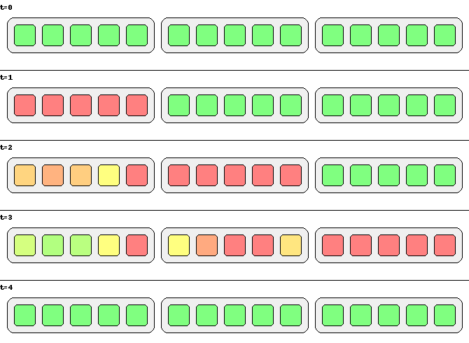
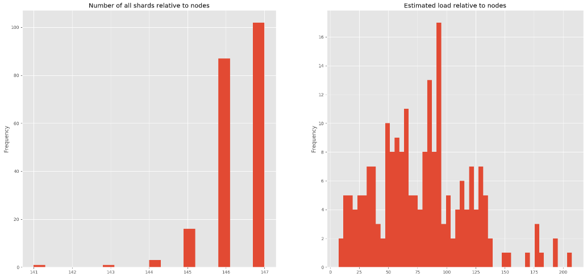
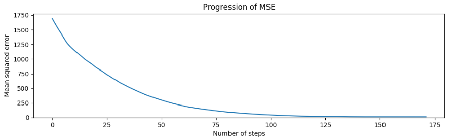
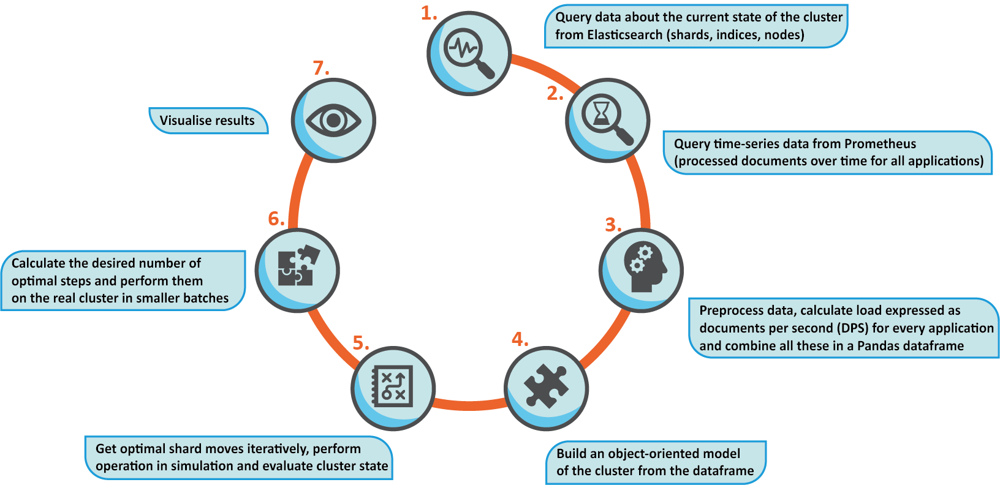
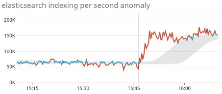
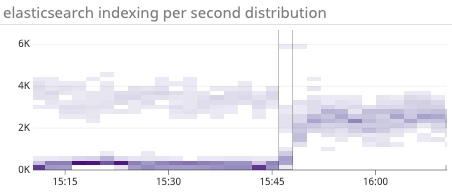

---
> **ARTS-week-20**
> 2023-05-13 15:02
---


## ARTS-2019 左耳听风社群活动--每周完成一个 ARTS
1.Algorithm: 每周至少做一个 leetcode 的算法题
2.Review: 阅读并点评至少一篇英文技术文章
3.Tip: 学习至少一个技术技巧
4.Share: 分享一篇有观点和思考的技术文章

### 1.Algorithm:

- [1010. 总持续时间可被 60 整除的歌曲](https://leetcode.cn/submissions/detail/430375581/)  
    + 思路：数学
- [1015. 可被 K 整除的最小整数](https://leetcode.cn/submissions/detail/431214880/)  
    + 思路：数学
- [1016. 子串能表示从 1 到 N 数字的二进制串](https://leetcode.cn/submissions/detail/431501038/)  
    + 思路：暴力

### 2.Review:

[在 Elasticsearch 中将副本分片提升为主分片，以及它如何在滚动重启期间为我们节省 12，000 美元](https://underthehood.meltwater.com/blog/2023/05/11/promoting-replica-shards-to-primary-in-elasticsearch-and-how-it-saves-us-12k-during-rolling-restarts/)

在 Meltwater，Elasticsearch 是我们产品的核心 - 我们一直在寻找方法来改进我们对它的使用并使其更具性能。最近，我们在执行例行滚动重启时注意到，重启后进行的第一次备份最多需要 7 小时，而不是正常的 30 分钟。我们还注意到，我们的快照存储大小突然增加了约 500TB。Elasticsearch 执行增量快照以仅上传新索引的数据，因此这两个观察结果都是出乎意料的。重新启动后的数据应该不会突然发生变化。我们仔细研究了一下，并能够找出问题所在。

在 Elasticsearch 中，数据被划分为多个分片，这些分片可以分布在集群中的不同节点上。为了可用性和可扩展性，每个分片都应该有多个副本。这些副本分为一个主分片，其余副本是副本。

重新启动节点时，该节点上的所有主分片将失去其主状态，而另一个节点上的副本分片将提升为主分片。因此，在重新启动所有节点的滚动重启期间，所有主分片将失去其主要状态并成为副本。当另一个节点重新启动时，某些节点可能会再次成为主节点。从本质上讲，所有主分片都是随机的。请注意，不会移动任何分片，只会更改其作为主分片或副本分片的状态。本文末尾可以看到这方面的说明。

由于分片的所有副本上的数据都相同，因此复制其中一个副本的快照就足够了。Elasticsearch 使用主分片来执行快照操作。每个分片由多个不可变段组成，这就是数据在磁盘上的划分方式。为新数据编制索引将创建新的细分。这些区段是 Elasticsearch 与以前的快照进行比较，以确定需要保存哪些区段。这些段不会在分片的副本之间同步。这意味着，当“新”主分片首次创建快照时，其任何段都不会与快照存储中已有的内容重叠，并且它必须对分片进行完整上传。

我们使用标准和不频繁访问存储类的组合将快照存储在 Amazon S3 上。我们存储了两周的快照，这些快照需要存储至少30 天才能过渡到不频繁访问（我们目前正在衡量这是否是最具成本效益的解决方案）。通过此设置，我们观察到在突然增加 500TB 后大约需要 40 天才能再次下降相同的量。如果这些额外的 500TB 在S3 标准中存储 30 天，在不频繁访问中再存储 10 天，则一次性成本总计为 12，500 美元，我们认为将来重新启动应该可以避免这种情况。

#### 解决方案

如果滚动重启后所有主分片仍保留在同一节点上，则增量快照应继续照常工作，而不受重启的影响。因此，我们对算法的想法是：

- 1.禁用快照

- 2.存储所有主节点所在位置的状态

- 3.执行滚动重启

- 4.将主节点提升回其原始节点

- 5.启用快照

这个提议的解决方案的唯一问题是Elasticsearch没有明确提升副本分片成为主分片的功能。该过程仅在主分片被取消时触发，例如在重新启动期间[1][2]。但是，取消主分片可以使用集群重新路由 API显式完成，然后触发将副本提升为主分片[3]。

我们尝试了这种方法，它按照建议工作，取消主分片会导致副本被提升为主分片。但是，在我们的集群中，每个分片有 3 个副本，一个主副本和两个副本。我们需要控制哪个副本将提升为主副本，以便在滚动重新启动之前选择主副本。这可以通过在同一个重新路由调用中发出两个取消命令来完成，取消我们不想成为主副本的两个副本。我们还基于观察结果进行了启发式方法，即始终是“第一个”副本按照 cat 分片 API 输出相同的顺序提升为主副本。这允许我们只取消大约一半的时间的一个分片。这工作得很好，但我们注意到取消的分片同步到新的主分片的速度非常慢。我们设法加快了这一速度，在每次批次取消之前，我们还对受影响的指数发出刷新调用。

我们已经有一个用于滚动重启的 Python 脚本，因此我们在其中添加了这个新逻辑。首先使用 cat 分片 API 获取当前状态，然后再重新启动。完成所有重启后，脚本有选择地取消分片，直到主分片位置恢复到滚动重启之前的位置。使用此脚本并在单个请求中向集群重新路由 API 发送多达 200 个取消命令，我们可以在大约 45 分钟内将 14k 个放错位置的主分片分配回其初始节点。在此期间，集群大部分时间都是黄色的，因为取消的分片在短时间内未分配，但集群性能没有明显受到影响。



模拟滚动重启的图示，一次一个区域。3 个区域中的每一个都有 5 个节点。节点的颜色表示它还剩下多少初始主分片（与 Elasticsearch 集群状态无关）。绿色节点具有其所有初始主分片，红色节点仅具有副本。起初，所有节点都是绿色的。在重新启动区域的下一个时间步骤中，每个区域都会变为红色，因为其所有分片都失去其主要状态，并且另一个区域中的副本被提升，因此需要一个新的昂贵快照。某些分片可能会偶然在其原始节点上提升回主节点。重启完成后，我们将主分片提升回其原始节点，返回到增量快照可以继续的初始状态。

总的来说，我们对我们的解决方案感到满意。我们确实觉得这是一个黑客，因为这不是集群重新路由 API 的使用方式。适当的主分片提升 API 将使此过程更加顺畅。我们确实简要考虑了它是否可以作为插件实现，但这似乎很困难。因此，就目前而言，这种通过取消的促销活动对我们有用，我们可以免费有效地进行滚动重启。

#### 2、探索问题

提高计算能力对这种情况的帮助微乎其微，但是值得更深入地研究增加负载密集型索引中的分片数量。Elasticsearch 使用内置算法在节点之间分配分片，考虑了两个因素：

- 1.每个节点都应包含接近相等数量的分片。

- 2.通过使用高低磁盘水印来保持高效的磁盘使用。达到低水位线的节点不允许接收更多分片，而达到高水位线的节点将移走其部分分片。

这很明显，增加某些索引的分片数量如何改善日志记录集群的整体负载分布，以及如何消除热点。但是，这种内置算法对于我们的用例确实无效，因为它错误地假设集群中的每个分片都接收大致相同的工作负载。

为了验证我们离最佳分布还有多远，我们从 Elasticsearch 查询了有关集群的信息，并可视化了以下指标，这些指标似乎支持我们的说法。




#### 3、设计更高效的算法

很明显，取分片数量并不是对工作负载的良好估计。首先，我们需要一个更精确地反映集群状态的指标，然后我们可以考虑创建一个更优化的分布。

- 派生负载指标

索引器正在接收来自各种应用程序的文档。对于所有这些服务，从 Prometheus 查询已处理文档数量的时间序列数据，时间范围为 2 周。为了使我们的负载预测更准确，我们应用指数平滑来获取权重更高的近期事件。计算完每个应用程序的负载后，剩下的唯一事情就是将此数字除以相应的分片数。通过这种方式，我们引入了一个分片级指标，用于估算系统中的负载。

- 分配负载
现在我们有一个可以优化的更精确的指标，我们必须考虑分布。本能地与著名的垃圾箱包装问题有些相似，我们必须在容量为 C 的 B 箱中拟合 N 个权重.翻译成我们的问题，权重是我们分片的估计负载，箱是具有一定理论能力的节点来处理日志。
- 1.确定节点所需的最佳负载级别。取平均值是一个合理的选择。
- 2.根据节点上的总负载对所有节点进行排序。
- 3.以总负载最高的节点 N 为例。我们将从这个节点移动一个分片。
- 4.搜索节点 N 上的分片并选择分片 S，以便通过删除 S，N 尽可能接近最佳水平。正式：

$$
Sselected=min(|LN−LSi−OPT|)
$$

where

Ln : 节点 N 上的总负载

Lsi : 节点 N 上的第 i 个分片创建的负载

OPT : 所需的最佳负载水平

- 5.从总负载最低的节点开始，我们尝试选择一个目标节点 M，以便满足以下约束：

a. 节点 M 不得与容纳 S 副本的节点位于同一可用区中。

b.如果我们将分片 S 移动到节点 M，则 M 上必须保留预定义的可用磁盘空间量。

c. 移动分片 S 后，N 和 M 与最优值的总距离不得增加

返回由分片、源节点和目标节点组成的最佳步骤。

在模拟中执行移动，返回步骤 2，并根据集群的新状态计算下一个最佳移动。


#### 4、评估集群状态

为了能够验证给定的步骤是否正在改善整体情况，我们尝试了不同的错误指标。事实证明，一个相当简单的指标足以满足我们的事业，均方误差。它由公式给出
$$

$$


n：群集中的节点数

L：第 i 个节点上的总负载

ˆL：群集中所有节点的平均负载（所需的负载级别）






#### 5、测试/结果
现在很明显，该算法能够优化一个指标的负载，但这如何改善集群状态仍然是一个悬而未决的问题。为了验证优化器是否确实在执行有效的操作，我们配置了一个测试环境来执行压力测试。为了重现与上面详述的事件类似的情况，我们释放了一个负载，对于这种规模的集群来说，这个负载太大了。结果是有希望的。工作负载的分配变得更加高效，因此我们看到索引性能显著提高。

在验证算法正常工作后，我们将该工具作为每小时运行的计划任务部署到生产中。





#### 6、未来的改进和致谢
我们已经讨论了如何整理负载值是一个非常困难的问题，并且不太可能计算出确切的解决方案。但看起来这种方法是绝对足够的，所提出的方法的效率归结为近似日志记录应用程序将来将具有的负载量。这是可以通过引入更强大的负载值预测来进一步改进应用程序的地方。

### 3.Tip:

#### Java 打印 Word 文档

使用 Sprie.Doc for Java 提供的 PrinterSettings 类可执行文档打印

配置 pom.xml 文件导入依赖 jar
```xml
<repositories>
        <repository>
            <id>com.e-iceblue</id>
            <url>http://repo.e-iceblue.cn/repository/maven-public/</url>
        </repository>
</repositories>
<dependencies>
    <dependency>
        <groupId> e-iceblue </groupId>
        <artifactId>spire.doc</artifactId>
        <version>3.9.4</version>
    </dependency>
</dependencies>
```

PrinterJob 打印示例
```java
import com.spire.doc.*;

import java.awt.print.PageFormat;
import java.awt.print.Paper;
import java.awt.print.PrinterException;
import java.awt.print.PrinterJob;

public class Print {

 public static void main(String[] args) {
        //加载Word文档
        Document doc = new Document();
        doc.loadFromFile("test.docx");

        //创建PrinterJob对象
        PrinterJob loPrinterJob = PrinterJob.getPrinterJob();
        PageFormat loPageFormat = loPrinterJob.defaultPage();

        Paper loPaper = loPageFormat.getPaper();
        loPaper.setSize(600, 500);//设置打印纸张大小
        loPageFormat.setPaper(loPaper);

        loPaper.setImageableArea(0, 0, loPageFormat.getWidth(), loPageFormat.getHeight());//删除默认页边距
        loPrinterJob.setCopies(1);//设置打印份数
        loPrinterJob.setPrintable(doc, loPageFormat);

        //设置打印对话框
        if (loPrinterJob.printDialog()) {
        try {
                loPrinterJob.print(); //执行打印
          } catch (PrinterException e)

            {
                e.printStackTrace();
            }
        }
    }
}
```

### 4.Share:

[如何用Excel制作一个高逼格的项目管理模板](https://zhuanlan.zhihu.com/p/137265543)  

[easyexcel](https://github.com/alibaba/easyexcel)